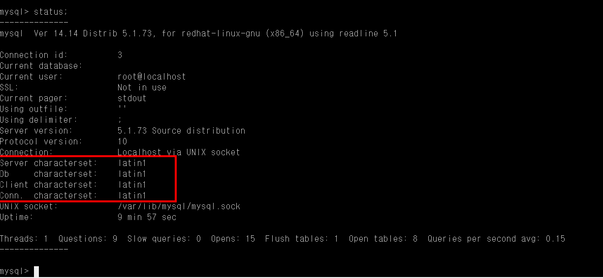
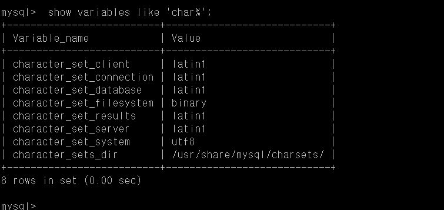
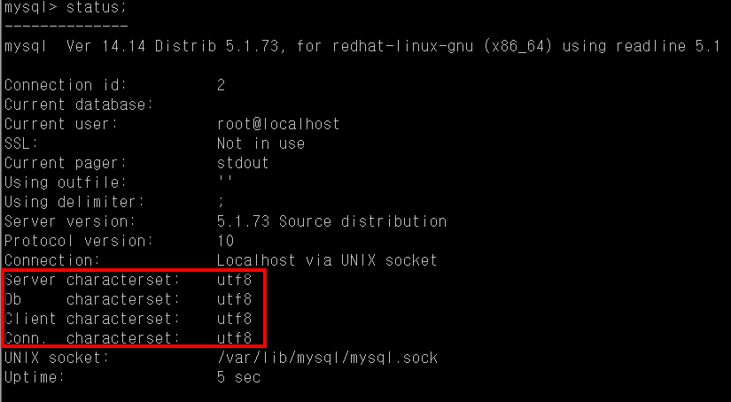

# Linux MySQL 설치

<https://www.lesstif.com/pages/viewpage.action?pageId=24445108>

## Yum을 통한 설치

1. 설치

    ```bash
    [5.7]
    wget --no-check-certificate  https://dev.mysql.com/get/Downloads/MySQL-5.7/mysql-5.7.22-1.el7.x86_64.rpm-bundle.tar
    [5.6]
    wget --no-check-certificate  https://dev.mysql.com/get/Downloads/MySQL-5.6/MySQL-5.6.40-1.el7.x86_64.rpm-bundle.tar

    tar xvf *bundle.tar
    sudo yum localinstall MySQL-server* MySQL-client*
    ```

    다운로드 : <https://dev.mysql.com/downloads/repo/yum/>

    ```bash
    rpm -ivh https://dev.mysql.com/get/mysql57-community-release-el7-11.noarch.rpm
    rpm -ivh http://dev.mysql.com/get/mysql-community-release-el7-5.noarch.rpm
    rpm -ivh https://dev.mysql.com/get/mysql57-community-release-el6-11.noarch.rpm
    rpm -ivh http://dev.mysql.com/get/mysql-community-release-el6-5.noarch.rpm

    sudo yum search mysql-community
    ```

    중에서 다음과 같은 패키지를 설치하면 된다.

   - mysql-community-server : 서버
   - mysql-community-client: 명령행 클라이언트
   - mysql-community-libs : library
   - mysql-community-common : common

    ```bash
    yum install mysql-community-server
    ```

   - 기본 chracter-set 이 latin1 이므로 /etc/my.cnf 를 수정해서 utf-8 로 설정
   - amazon Linux 는 yum clean all 명령어를 사전에 수행하지 않으면 dependency 오류가 나서 제대로 설치되지 않음.

2. MySQL 구동

    ```bash
    systemctl start mysql

    ## root 암호와 보안 설정을 위해 mysql_secure_installation  를 실행
    mysql_secure_installation
    ```

    - MySQL 패키지 버전에 따라 설치시 자동으로 mysql_secure_installation 을 실행하는 경우도 있으니 설치후 콘솔 화면을 보고 암호가 저장되는 경로는 확인
    - CentOS 에서는 초기 암호가 /root/.mysql_secret 에 저장되는 경우가 있음.

        ```bash
        A RANDOM PASSWORD HAS BEEN SET FOR THE MySQL root USER !
        You will find that password in '/root/.mysql_secret'.

        You must change that password on your first connect,
        no other statement but 'SET PASSWORD' will be accepted.
        See the manual for the semantics of the 'password expired' flag.

        Also, the account for the anonymous user has been removed.
        ```

    - 초기 암호를 획득

        ```bash
        $ grep 'password' /var/log/mysqld.log
        ```

## Ubuntu에 설치

- <https://dev.mysql.com/downloads/repo/apt/> 에서 저장소 패키지 다운로드

    ```bash
    wget https://dev.mysql.com/get/mysql-apt-config_0.8.13-1_all.deb
    ```

## Systemd 연동

- 시스템 부팅시 자동 구동되도록 설정

    ```bash
    systemctl enable mysqld
    systemctl restart mysqld
    ```

## 암호정책 변경

- 기존 암호 규칙을 사용하기 위해 password 정책 수정

    ```bash
    echo 'validate_password_policy=LOW' >> /etc/my.cnf
    echo 'default_password_lifetime=0' >> /etc/my.cnf
    ```

- 재구동

    ```bash
    systemctl restart mysqld
    ```

- 구동되었으면 다음 명령어로 임시로 생성된 루트 패스워드

    ```bash
    grep 'temporary password' /var/log/mysqld.log
    ```

- 처음 로그인하면 다음 명령어로 root 암호를 변경

    ```bash
    mysql> set password=password('qwert123');
    ```

- 변경된 암호 적용
  
    ```bash
    flush privileges;
    ```

## MySQL 기본 캐릭터셋 설정하기

|배포판|위치|
|:--:|:--:|
|RHEL/CentOS|/etc/my.cnf|
|Ubuntu|/etc/mysql/mysql.conf.d/mysqld.cnf|

- 명시적으로 설정하지 않으면 기본 캐릭터 셋은 latin1
- characterset 확인은 다음과 같이 mysql 클라이언트로 연결한 후에 status 명령어로 확인



```bash
mysql> show variables like 'char%';
```



### 설정

1. MySQL 5.5이상

   - MySQL 5.5 부터는 default-character-set 옵션이 제거되었고 character-set-server 만 설정
   - skip-character-set-client-handshake 가 빠지면 client 의 시스템 encoding 을 사용하는데 윈도의 경우 euckr 로 설정 될수 있으므로 필요

    ```bash
    [mysqld]
    collation-server = utf8_unicode_ci
    character-set-server = utf8
    skip-character-set-client-handshake
    ```

    - 이제 service mysqld restart 로 재구동후에 mysql client 에서 status 명령어로 보면 charset 이 utf-8 로 변경

    

2. MySQL 5.1이하

    ```bash
    [mysqld]
    character-set-server = utf8

    [client]
    default-character-set=utf8

    [mysql]
    default-character-set=utf8
    ```

3. 이모지 지원을 위한 UTF8-MB 인코딩

   - MySQL 은 UTF-8 구현을 대충 해서 3Byte 밖에 표현을 못하는 문제가 있었는데 Emoji 가 활성화되면서 4byte 로 표현해야 하는 UTF-8 문자들에 대한 요구가 많아짐
   -그래서 다른 DBMS 와는 달리 MySQL은 utf8mb4 라는 4byte 를 표현하는 새로운 인캐릭터 셋을 만들었으니 Emoji 나 기타 4 byte UTF 8 을 MySQL 에 저장하려면  (MySQL 5.5.3 이상 필요)
   - utf8mb4 캐릭터 셋은 오직 MySQL 에만 해당되는 문제이고 다른 DBMS 는 아예 utf8mb4 라는 캐릭터 셋이 없으며 보통 인코딩을 UTF8 로 설정하면 된다.

    ```bash
    [mysqld]
    collation-server = utf8mb4_unicode_ci
    character-set-server = utf8mb4
    skip-character-set-client-handshake
    ```

    - 이미 기존에 만들어진 database 라면 alter database 명령어로 캐릭터 셋과 collate 를 변경할 수 있다.

    ```bash
    ALTER DATABASE homestead CHARACTER SET = utf8mb4 COLLATE = utf8mb4_unicode_ci;
    ```


## MySQL root password reset 하기

## MySQL systemctl 사용법

## MySQL 사용자 계정 생성하기


