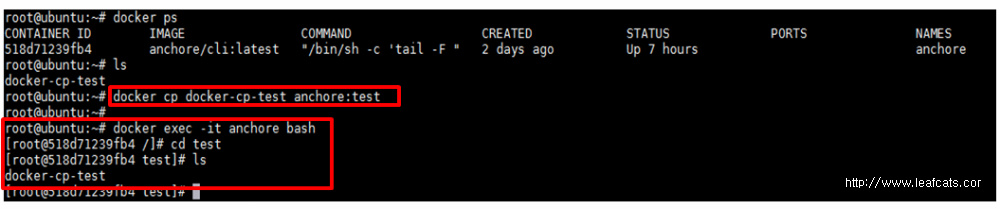

# docker cp - 호스트 컨테이너 사이 파일 복사

docker image를 실행시킨 컨테이너는 HOST와 다른 PC인 것이나 마찬가지이다.
docker는 HOST와 PC간의 파일 이동을 위해 복사 명령어인 cp를 지원한다.
docker cp 명령어는 호스트에서 컨테이너로, 컨테이너에서 호스트로 양 방향 모두를 지원하는 명령어이다.

## 1. 호스트 -> 컨테이너

```bash
docker cp [host 파일경로] [container name]:[container 내부 경로]
```

anchore라는 name을 가진 컨테이너가 실행중이다.
이 컨테이너에 호스트에 있는 docker-cp-test 라는 파일을 복사해 보자.



docker cp 명령어로 호스트의 파일 docker-cp-test를 anchore 컨테이너의 test 디렉터리 하위로 복사했다.
anchore 컨테이너에 들어가 test 디렉터리를 확인해 보면 호스트에서 복사한 파일이 복사가 되어 있는 것을 확인할 수 있다.

## 2. 컨테이너 -> 호스트

```bash
docker cp [container name]:[container 내부 경로] [host 파일경로]
```

1번에서 알아본 docker cp의 argument를 반대로 입력하면 된다.


파일이 아닌 디렉터리 경로를 지정한 경우 디렉터리 전체를 통채로 복사한다.