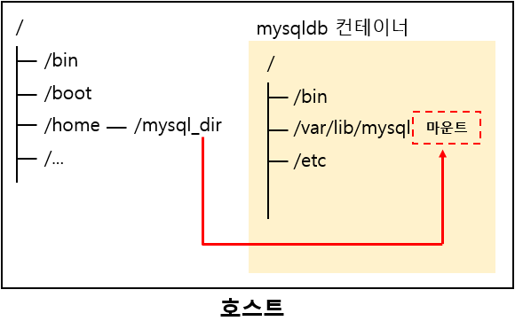
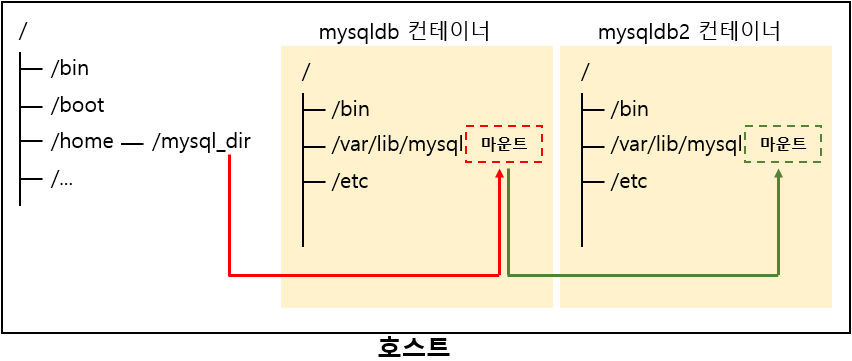
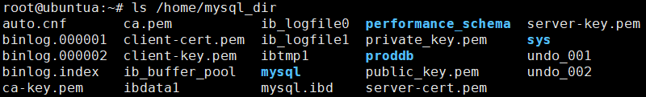
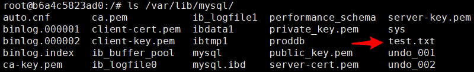

# Docker Volume

출처: [[Docker] 도커 컨테이너의 볼륨을 호스트 OS와 공유하기](http://dololak.tistory.com/402)
출처: [[Docker] 도커 컨테이너 사이에 디렉터리 및 파일 공유하기](http://dololak.tistory.com/403)
출처: [[Docker] 데이터를 컨테이너 내부가 아닌 도커 엔진에 저장하기 (도커볼륨)](http://dololak.tistory.com/404)

## [Docker] 도커 컨테이너의 볼륨을 호스트 OS와 공유하기

### 컨테이너를 제거하면 데이터도 함께 제거된다

도커 컨테이너가 동작하면서 생성된 컨테이너 데이터들은 기본적으로 컨테이너를 삭제하게 되면 같이 제거됩니다. 다음과 같이  MySQL 컨테이너를 생성했다가 docker rm 명령어로 제거하면 해당 컨테이너에 있던 MySQL 데이터까지 모두 사라지는 것입니다.

```bash
# docker run -d \
> --name mysqldb \
> -e MYSQL_ROOT_PASSWORD=123456 \
> -e MYSQL_DATABASE=proddb \
> mysql
```

당연하게도  mysqldb 컨테이너에 저장되는 db 데이터들 또한 같이 제거됩니다.

```bash
# docker stop mysqldb
# docker rm mysqldb
```

### 컨테이너의 데이터를 호스트 OS에 저장하기

도커에서 컨테이너는 정말 쉽게 제거가 가능하며, 실수로 지울 수도 있고, 서비스의 버전을 높이거나 시스템의 구성을 달리하기 위해서 지우고 새로 생성하는 등의 과정을 자주 반복하게 됩니다. 그러나 이 과정에서 실제 운영중인 데이터는 어떻게 해야 할까요?

어플리케이션(또는 컨테이너) 자체는 지워지더라도 그 어플리케이션이 사용하고 축적하는 데이터 자체가 지워지는 것을 옳지 못할 수 있습니다. 고객의 데이터는 소중하니까요.

도커는 컨테이너를 `docker run` 명령어로 생성할 때 컨테이너의 특정 디렉터리와 호스트 OS의 특정 디렉터리를 서로 공유할 수 있도록 `-v [호스트의 디렉터리]:[컨테이너의 디렉터리]` (또는 `--volume`)옵션을 제공하고 있습니다.

이때 호스트의 디렉터리는 비어있거나 파일이 존재하지 않는 디렉터리여야 합니다. 나중에서 설명하지만 만약 파일이 존재하는 디렉터리인 경우 도커 컨테이너를 생성할때 기본적으로 생성되는 내용들이 호스트의 디렉터리의 내용으로 덮어 씌워집니다.

```bash
# docker run -d \
> --name mysqldb \
> -e MYSQL_ROOT_PASSWORD=123456 \
> -e MYSQL_DATABASE=proddb \
> -v /home/mysql_dir:/var/lib/mysql \
> mysql
```

컨테이너를 생성한 이후에 호스트 OS의 `/home/mysql_dir` 을 보면 다음과 같이 mysql 운영시 저장되는 데이터 파일들이 저장되어 있는 모습을 볼 수 있습니다. 실제로 이는 방금 생성한 mysqldb 컨테이너의 /var/lib/mysql 디렉터리와 연결된 하나의 디렉터리입니다.

### 디렉터리 공유 원리

`docker run -v` 옵션은 정확하게 말하자면 컨테이너와 호스트가 디렉터리를 공유한다 라는 말이 맞을 수 있지만 그보다는 호스트의 특정 디렉터리(지정해준)를 컨테이너의 특정 경로에 마운트 시킨다 라고 할 수 있습니다.



mysql은 기본적으로 리눅스에 설치된 경우 /var/lib/mysql 하위에 데이터를 저장합니다. 그런데 해당 경로의 디렉터리가 호스트 OS의 /home/mysql_dir/ 디렉터리를 마운트 시킨 디렉터리였던 것입니다.

추가적으로 호스트 OS와 디렉터리를 공유하면 다음의 규칙이 성립합니다.

- 컨테이너를 지워도 공유했던 호스트의 디렉터리를 지우지 않는 이상 데이터는 사라지지 않습니다.
- 공유는 디렉터리 뿐만 아니라 파일 단위 공유도 가능합니다. ex) -v /home/test.txt:/var/test.txt
- 여러개의 파일 및 디렉터리를 공유할 때는 -v 옵션을 여러번 사용합니다. -v \~\~\~ -v \~\~\~

### 호스트의 디렉터리에 파일이 존재하는 상태에서 공유하는 경우

만약 `-v [호스트의 디렉터리]:[컨테이너의 디렉터리]`로 컨테이너와 호스트간에 디렉터리를 공유했을 때 호스트의 디렉터리에 이미 파일들이 존재하고 컨테이너의 디렉터리에는 컨테이너를 생성하면서 기본적으로 생성되는 파일들이 있을때는 어떻게 될까요?

정답은 컨테이너를 생성하면서 기본적으로 생성되는 파일들, 즉 도커 이미지에 기본적으로 저장된 파일들은 사라지고 호스트 디렉터리의 내용들로 덮어씌워지게(overwrite) 됩니다.

이렇게 했을때의 얻는 이점은 무엇이 있을까요? 물론 꼭 컨테이너의 데이터들을 호스트에 저장할 필요는 없습니다. 다만 컨테이너는 임시적인 프로세스 개념이므로 컨테이너의 상태를 영구적이고 더욱 안정적으로 저장하고 관리하기 싶도록 하기 위해서 호스트에 저장하는 것입니다.

또한 호스트에 데이터를 저장하게 되면 컨테이너를 유지보수 하기가 더욱 심플해질 수 있습니다. 예를 들어 블로그를 운영하기 위해 워드프레스를 컨테이너로 서비스한다고 했을때 공유되는 디렉터리의 내용만 변경해주면 컨테이너 구성은 변경하지 않으면서 블로그의 게시글(컨텐츠) 내용을 새로 업데이트 또는 마이그레이션 할 수 있습니다.

반대로 호스트의 공유 디렉터리는 그대로 둔채로 워드프레스 버전만 변경한다든지 mysql 버전만을 변경한다는지 할수도 있습니다. 꼭 장점만 있는것이 아닐 수 있고 의무는 아니기 때문에 목적에 따라 응용하시기 바랍니다.

## [Docker] 도커 컨테이너 사이에 디렉터리 및 파일 공유하기

### 볼륨 컨테이너

도커 컨테이너1 그리고 컨테이너2 두 개의 컨테이너가 있다고 할 때 컨테이너2가 컨테이너1의 특정 디렉터리 및 파일을 마운트하여 공유할 수 있습니다. 이때 조건이 있는데, 컨테이너1은 호스트의 디렉터리를 `docker run -v` 옵션(또는 --volume 옵션)을 통해 공유하고 있는 상태여야 합니다.



즉 위와 같은 그림의 구조라고 볼 수 있습니다. 호스트의 `/mysql_dir` 디렉터리를 mysqldb 컨테이너를 생성할 당시에 공유하기 위해서 -v 옵션을 사용하여 `/var/lib/mysql` 디렉터리로 마운트합니다. 이때 mysqldb2 컨테이너를 생성하면서 이전에 이미 공유설정이 되어 있던 `/var/lib/mysql` 디렉터리를 그대로 마운트하여 공유하는 형태인 것입니다.

여기서 처음 만든 컨테이너인 mysqldb 컨테이너는 보통의 경우 호스트의 볼륨(디렉터리)만 공유하면서 실제로 특정 역할(서비스)를 수행하지 않는 중간 공유자 역할인 볼륨 컨테이너 로서 동작하게 되고 이후 생성된 mysqldb2 같은 여러 컨테이너로부터의 중간 다리 역할을 하게됩니다.

### 볼륨 컨테이너의 디렉터리 마운트하기

그럼 먼저 볼륨컨테이너에 해당하는 mysqldb 컨테이너를 생성하고, 볼륨 컨테이너의 공유 디렉터리를 마운트시킬 mysqldb2 컨테이너를 생성해 보도록 하겠습니다. 볼륨컨테이너를 생성할때 호스트 <> 컨테이너간의 공유에 관한 정보는 상단 이전글을 참조해 주세요.

먼저 `docker run -v` 옵션을 사용하여 호스트와 볼륨을 공유하는 볼륨 컨테이너를 하나 생성합니다.

```bash
# docker run -d \
--name mysqldb \
-e MYSQL_ROOT_PASSWORD=123456 \
-e MYSQL_DATABASE=proddb \
-v /home/mysql_dir:/var/lib/mysql \
mysql
```

이렇게 되면 호스트의 /home/mysql_dir 디렉터리는 mysqldb 컨테이너의 `/var/lib/mysql`에 마운트 됩니다. 호스트에서 `ls /home/mysql_dir` 명령을 통해 디렉터리가 잘 공유되었는지 확인합니다.


실험을 위해 `/home/mysql_dir` 디렉터리에 텍스트 파일 하나를 생성합니다.

```bash
# touch /home/mysql_dir/test.txt
# echo 'test!!' >> /home/mysql_dir/test.txt
```

그리고 디렉터리를 공유중인  mysqldb 컨테이너에 접근합니다.

```bash
# docker exec -i -t mysqldb /bin/bash
```

mysqldb 컨테이너에 접근하여 `ls /var/lib/mysql/` 명령어를 실행하니 이전에 호스트에서 생성했던 test.txt 파일이 있습니다. 이로써 디렉터리가 잘 공유됨을 확인했습니다.

이번에는 mysqldb 컨테이너의 디렉터리를 공유시킬 또다른 컨테이너 mysqldb2를 생성합니다. 이때 -v 옵션이 아닌 `--volumes-from [볼륨 컨테이너명]` 옵션을 사용합니다. mysqldb 컨테이너를 볼륨 컨테이너로 지정합니다.

```bash
# docker run -d \
--name mysqldb2 \
-e MYSQL_ROOT_PASSWORD=123456 \
-e MYSQL_DATABASE=proddb \
--volumes-from mysqldb \
mysql
```

이번엔 방금 생성한 mysqldb2에 접근합니다.

```bash
# docker exec -i -t mysqldb2 /bin/bash
```

역시 똑같이 ls /var/lib/mysql/ 명령어로 확인해보면 mysqldb 컨테이너와 똑같은 경로로 디렉터리를 마운트하여 공유하고 있는것을 알 수 있습니다.



## [Docker] 데이터를 컨테이너 내부가 아닌 도커 엔진에 저장하기 (도커볼륨)

### 도커볼륨

이전글들에서 컨테이너에서 만들어지는 데이터들을 컨테이너가 아닌 호스트나 다른 컨테이너를 통해서 저장 및 공유하는 방법을 알아보았습니다. 이번글 역시 컨테이너에 데이터를 저장하는 것이 아닌 도커 자체에서 관리하는 도커 볼륨이라는 저장소에 저장하는 방법을 알아보도록 하겠습니다.

도커는 도커 자체에 제공하는 데이터 저장공간이 있으며 이를 도커 볼륨이라고 하는데, 이곳에 컨테이너의 데이터들을 저장하게 되면 컨테이너를 제거하거나 문제가 발생한 경우에도 데이터를 보존할 수 있습니다.

### 도커볼륨 생성하기

먼저 도커 볼륨을 관리하는 명령어로는 `docker volume`이 있으며, 도커볼륨을 생성할때는 `docker volume create` 명령을 사용합니다.

```bash
# docker volume create --name newvolume
newvolume
```

생성된 볼륨을 확인할때는 `docker volume ls` 명령을 사용합니다. 도커 볼륨을 생성할때 쓰이는 DRIVE는 직접 설정해 여러 저장소 구성을 만들 수 있지만 기본적으로는 제공되는 local DRIVE를 사용합니다. 로컬 드라이브는 이름 그대로 볼륨이 로컬 호스트에 구성됩니다.

```bash
# docker volume ls
DRIVER              VOLUME NAME
local               newvolume
```

### 컨테이너 생성시 도커 볼륨을 사용하기

볼륨이 잘 생성되었다면 `docker run -v [도커볼륨명]:[컨테이너 디렉터리 경로]`를 옵션으로 주어 도커볼륨을 컨테이너의 특정 디렉터리에 마운트하여 생성합니다.

```bash
# docker run -i -t --name ubuntu1 \
> -v newvolume:/home/ \
> ubuntu:14.04
```

ubuntu1 컨테이너가 생성되면서 컨테이너에 접속된 상태입니다. 이전에 생성했던 도커볼륨을 /home/ 에 마운트 했는데, 이곳에 파일 하나를 생성합니다.

```bash
# echo 'test!!' >> /home/test.txt
# cat /home/test.txt
test!!
```

도커 볼륨에 데이터가 잘 저장 되었는지 확인하기 위해 호스트로 나가서 또 다른 컨테이너를 생성합니다. 호스트로 나갈때는 컨테이너가 정지되지 않기 위해 `Ctrl + P` 다음 `Ctrl + Q` 를 연달아 눌러 빠져나갑니다.

도커 볼륨은 다른 컨테이너에서 또 다시 공유할 수 있습니다.

```bash
# docker run -i -t --name ubuntu2 \
> -v newvolume:/home/ \
> ubuntu:14.04
```

이번에는 새로 생성한 ubuntu2 컨테이너에 접속된 상태입니다. ubuntu1 컨테이너에서 생성했던 text.txt 파일을 출력합니다. 오! 역시 공유가 잘 되었습니다.

```bash
# cat /home/test.txt
test!!
```

이로써 도커볼륨은 호스트에 떠있는 도커 엔진이 관리하고 있다는 점과 도커볼륨은 여러 컨테이너에서 공유될 수 있다는 사실을 알게 되었습니다.

### 호스트상의 도커볼륨 실제 위치

도커볼륨은 도커 엔진에 의해 관리되므로 실제 어느곳에 저장되는지 알 필요는 없지만 그래도 알고 싶은 경우에는 docker inspect 명령어를 사용하여 알 수 있습니다. `docker inspect` 명령어는 `container, image, volume` 등의 도커를 구성하고 있는 단위들의 정보를 확인할 때 사용하는 명령어입니다.

--type 옵션에 volume을 지정해 volume 정보를 보고싶다는 것을 명시합니다.

```json
# docker inspect --type volume newvolume
[
    {
        "CreatedAt": "2018-06-26T01:25:11+09:00",
        "Driver": "local",
        "Labels": {},
        "Mountpoint": "/var/lib/docker/volumes/newvolume/_data",
        "Name": "newvolume",
        "Options": {},
        "Scope": "local"
    }
]
```

Mountpoint가 도커 볼륨의 물리적인 위치입니다. 호스트에서 해당 위치를 확인해보면 이전에 컨테이너에서 생성했던 파일을 볼 수 있습니다.

```bash
# ls /var/lib/docker/volumes/newvolume/_data
test.txt
```

### 컨테이너 생성과 동시에 도커볼륨 생성하기

만약 컨테이너 생성과 동시에 도커볼륨을 생성하여 사용하는 경우에는 -v [경로] 형태로 옵션을 주면 됩니다.

```bash
# docker run -i -t --name ubuntu1 \
> -v /home/ \
> ubuntu:14.04
```

이렇게 하면 도커볼륨을 자동으로 생성하는데, 도커볼륨의 이름은 16진수의 임의의 값으로 정해집니다.

```bash
# docker volume ls
DRIVER              VOLUME NAME
local               37e012302cea43023d6a6ac4a26358e6d91a1a3f2eed703426ba9d0e94cd277c
```

자동으로 생성된 도커볼륨에 대한 정보는 `docker container inspect [컨테이너명]` 을 통해 알 수 있습니다. 이 명령어를 실행하면 컨테이너에 대한 모든 정보가 JSON 형식으로 출력됩니다.

```bash
# docker container inspect ubuntu1 | grep 'Source'
```

그중에 Source 속성은 컨테이너가 사용중인 자동으로 생성된 도커볼륨의 경로입니다. grep을 활용하여 심플하게 정보를 얻습니다.

```json
# docker container inspect ubuntu1 | grep 'Source'
"Source": "/var/lib/docker/volumes/37e012302cea43023d6a6ac4a26358e6d91a1a3f2eed703426ba9d0e94cd277c/_data",
```

### 사용되지 않는 도커볼륨 삭제하기

컨테이너를 삭제해도 도커볼륨은 삭제되지 않습니다. 만약 컨테이너를 지운 이후 도커볼륨 또한 필요가 없어 불필요해진 도커 볼륨을 제거하고 싶은 경우에는 `docker volume prune` 명령어를 사용합니다. 명령어를 실행하면 경고가 나타나는데 y를 입력하면 사용되지 않는 도커볼륨이 제거됩니다.
