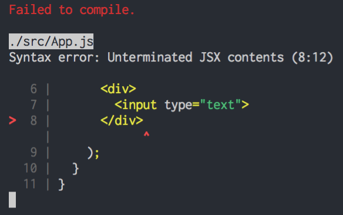
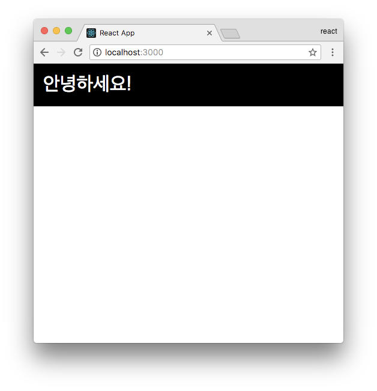

# JSX

<https://velopert.com/3626>

JSX에 대해서 더 자세히 알아봅시다. 얼핏 보기에는 html 같죠? 하지만 아닙니다. 이건 자바스크립트입니다. 이게 무슨소리인가 싶죠?


<http://bit.ly/2FJsJmo>
<https://babeljs.io/>

만약에, 컴포넌트를 만들 때 우측에 있는 것처럼 작성해야한다면, 정말 작업하기 싫겠죠? 리액트 개발을 쉽게 하기 위해서, HTML 과 비슷한 문법으로 작성을 하면 이를 React.createElement 를 사용하는 자바스크립트 형태로 변환시켜줍니다.

XML 형태의 코드를, 자바스크립트로 변환해야 하기 때문에, JSX를 제대로 사용하기 위해서 우리는 몇가지 규칙을 준수해줘야 합니다. 딱히, 어렵지는 않습니다. 한번 알아볼까요?

함께 코드를 작성해가면서 하면 좀 더 이해하기 쉬울테니, 일단 컴포넌트에서 보여주던 내용들을 다 비워주겠습니다. 상단의 css 와 svg 도 지워주겠습니다.

```js
// src/App.js
import React, { Component } from 'react';

class App extends Component {
  render() {
    return (
      <div>
        
      </div>
    );
  }
}

export default App;
```

## 꼭 닫혀야 하는 태그

태그는 꼭 닫혀있어야 합니다. `<div>` 태그를 열었으면, `</div>` 를 통하여 태그를 꼭 닫아주어야 합니다. 우리가 html 에서 input 이나 br 태그를 작성 할 때 태그를 안닫을때도 있는데요, 똑같이 리액트에서 하시면 이런 오류를 겪에 될 테니 참고하세요.

```js
import React, { Component } from 'react';

class App extends Component {
  render() {
    return (
      <div>
        <input type="text">
      </div>
    );
  }
}

export default App;
```



## 감싸져 있는 엘리먼트

두개 이상의 엘리먼트는 무조건 하나의 엘리먼트로 감싸져있어야 합니다. 한번, 다음과 같이 코드를 작성해보세요.

```js
// src/App.js
import React, { Component } from 'react';

class App extends Component {
  render() {
    return (
      <div>
        Hello
      </div>
      <div>
        Bye
      </div>
    );
  }
}

export default App;
```


그러면 터미널 쪽에서 이러한 오류가 나타납니다. 하나의 태그로 감싸져있어야 한다고, 에러가 뜨죠.

그러면, 가장 간단하게 해결하는 방법은 이렇게 div 로 감싸주는 것 입니다.

```js
import React, { Component } from 'react';

class App extends Component {
  render() {
    return (
      <div>
        <div>
          Hello
        </div>
        <div>
          Bye
        </div>
      </div>
    );
  }
}

export default App;
```

간단하죠? 그런데, 가끔 어떠한 상황에선 단순히 감싸기 위해서 새로운 div 를 사용하는게 맘에들지 않을 수도 있습니다. 예를들어서, 스타일 관련 설정을 하면서 코드가 꼬이게 될 수도 있고, table 관련 태그를 작성 할 때 번거로워질 수도 있죠.

그러한 상황엔 다음과 같이 Fragment 라는것을 사용하면 됩니다. (이 기능은 v16.2 에 도입되었습니다.)

```js
import React, { Component, Fragment } from 'react';

class App extends Component {
  render() {
    return (
      <Fragment>
        <div>
          Hello
        </div>
        <div>
          Bye
        </div>
      </Fragment>
    );
  }
}

export default App;
```

## JSX 안에 자바스크립트 값 사용하기

JSX 내부에서 자바스크립트 값을 사용 할 땐 이렇게 할 수 있습니다.

```js
import React, { Component } from 'react';

class App extends Component {
  render() {
    const name = 'react';
    return (
      <div>
        hello {name}!
      </div>
    );
  }
}

export default App;
```

혹시나, const 라는 키워드가 생소한 분들을 위해 설명드리자면, const 는 ES6 에 도입된 키워드로서, 한번 선언하고 바뀌지 않는 값을 설정 할 때 사용됩니다. 그리고, 바뀌게 될 수 있는 값은 let 을 사용하여 선언하죠.

기존 자바스크립트의 var 과 비슷하다고 생각하시면 되는데, 작동 방식에 있어서 scope 가 다릅니다.

var 은 scope 가 함수단위인데요:

```js
function foo() {
  var a = 'hello';
  if (true) {
    var a = 'bye';
    console.log(a); // bye
  }
  console.log(a); // bye
}
```

반면 const 와 let 은 scope 가 블록 단위 입니다.

```js
function foo() {
  let a = 'hello';
  if (true) {
    let a = 'bye';
    console.log(a); // bye
  }
  console.log(a); // hello
}
```

여기서 드는 의문, var, const, let 이 다른 키워드들을 어떨때 써야 할지? 궁금 할 수도 있습니다.

ES6 에서는, var 을 쓸 일이 없구요, 값을 선언 후 바꿔야 할 땐 let, 그리고 바꾸지 않을 땐 const 를 사용하시면 됩니다.

## 조건부 렌더링

JSX 내부에서 조건부 렌더링을 할 때는 보통 삼항 연산자를 사용하거나, AND 연산자를 사용합니다.

반면에 if 문을 사용 할 수는 없어요 (사용하려면 IIFE(즉시 실행 함수 표현) 을 사용해아합니다.)

코드로 예제를 한번 살펴볼까요?

먼저 삼항연산자부터 봅시다.

```js
import React, { Component } from 'react';

class App extends Component {
  render() {
    return (
      <div>
        {
          1 + 1 === 2 
            ? (<div>맞아요!</div>)
            : (<div>틀려요!</div>)
        }
      </div>
    );
  }
}

export default App;
```

이렇게 하면, 맞아요가 보여질 것입니다. 반면 1 + 1 === 2 부분을 1 + 1 === 3 으로 바꿔보세요. 그럼 틀려요가 나타납니다.

그 다음엔 AND 연산자를 사용해보겠습니다. 삼항연산자는 true 일 때와 false 일 때 다른것들을 보여주고 싶을 떄 사용하는 반면, AND 연산자의 경우 단순히 우리의 조건이 true 일 때만 보여주고 false 경우 아무것도 보여주고 싶지 않을 때 사용합니다.

```js
import React, { Component } from 'react';

class App extends Component {
  render() {
    return (
      <div>
        {
          1 + 1 === 2 && (<div>맞아요!</div>)
        }
      </div>
    );
  }
}

export default App;
```

대부분의 상황엔 위의 방식으로 해결 할 수 있지만, 가끔씩은 좀 복잡한 조건을 작성해야 할 때도 있습니다. 그러한 조건들은 웬만하면 JSX 밖에서 로직을 작성하는것이 좋습니다. 하지만, 꼭 JSX 내부에서 작성해야 한다면, 이렇게 IIFE 를 사용합니다.

```js
import React, { Component } from 'react';

class App extends Component {
  render() {
    const value = 1;
    return (
      <div>
        {
          (function() {
            if (value === 1) return (<div>하나</div>);
            if (value === 2) return (<div>둘</div>);
            if (value === 3) return (<div>셋</div>);
          })()
        }
      </div>
    );
  }
}

export default App;
```

if 문 대신에 switch 문을 사용하셔도 상관 없습니다. 그리고 위 코드는 다음과 같이 쓸 수도 있습니다.

```js
(() => {
  if (value === 1) return (<div>하나</div>);
  if (value === 2) return (<div>둘</div>);
  if (value === 3) return (<div>셋</div>);
})()
```

여기서 사용된건 화살표 함수 라고 부릅니다.

화살표 함수는 this, arguments, super 개념이 없는 익명 함수입니다. 앞으로 ES6 에서 자주 사용하게 될 것입니다.

## style 과 className

JSX 에서 style 과 CSS 클래스를 설정 할 때, html 에서 하는 것과 사뭇 다릅니다.

우선, 스타일은 다음과 같이 작성 할 수 있습니다.

```js
import React, { Component } from 'react';

class App extends Component {
  render() {
    const style = {
      backgroundColor: 'black',
      padding: '16px',
      color: 'white',
      fontSize: '12px'
    };

    return (
      <div style={style}>
        hi there
      </div>
    );
  }
}

export default App;
```



html 에서는 그냥 텍스트형태로 `="backgroundColor: black; padding: 16px; ..."` 이런식으로 작성했었지요? 리액트에서는 객체 형태로 작성해주셔야 합니다.

그리고 클래스를 설정하게 될 때에는 html 에서는 `<div class="hello">` 이렇게 작성했었는데요, 리액트 컴포넌트에서는 class 대신에 className 을 사용합니다.

한번 직접 해볼까요? App.css 파일을 열어서 다음과 같이 수정하세요:

```css
.App {
  background: black;
  color: aqua;
  font-size: 36px;
  padding: 1rem;
  font-weight: 600;
}
```

그리고, App.js 는 이렇게 수정해보세요.

```js
import React, { Component } from 'react';
import './App.css'

class App extends Component {
  render() {
    return (
      <div className="App">
        리액트
      </div>
    );
  }
}

export default App;
```


## 주석

마지막으로, 주석은 어떻게 작성하는지 알아봅시다.

```js
import React, { Component } from 'react';

class App extends Component {
  render() {
    return (
      <div>
        {/* 주석은 이렇게 */}
        <h1
          // 태그 사이에
        >리액트</h1>
      </div>
    );
  }
}

export default App;
```

위에 보이는 바와 같이, `{/* ... */}` 사이에 넣거나, 태그 사이에 넣을 수도 있습니다.

## 정리

이제 우리는 JSX 를 작성하게 될 때 주의해야 할 점을 알아보았습니다. 다음 섹션에서는, 한번 새 컴포넌트를 만들어보면서, 컴포넌트에 전달해주는 값인 props 와, 컴포넌트 내부적으로 들고있는 값인 state 에 대해서 알아보겠습니다.