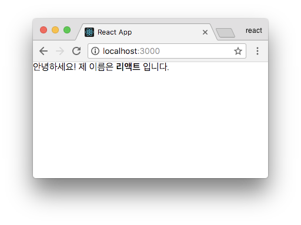
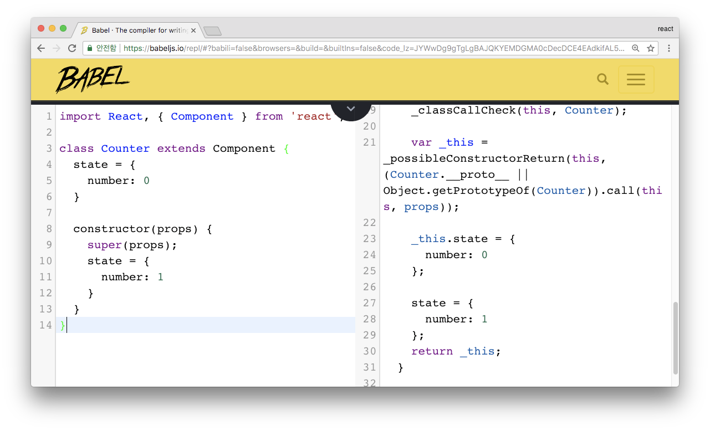

# Props, State

<https://velopert.com/3629>

리액트 컴포넌트에서 다루는 데이터는 두개로 나뉩니다. 바로 props 와 state 인데요, 미리 요약하여 설명드리자면 props 는 부모 컴포넌트가 자식 컴포넌트에게 주는 값입니다. 자식 컴포넌트에서는 props 를 받아오기만하고, 받아온 props 를 직접 수정 할 수 는 없습니다.

반면에 state 는 컴포넌트 내부에서 선언하며 내부에서 값을 변경 할 수 있습니다.

## 새 컴포넌트 만들기

자, 한번 새로운 컴포넌트를 만들어봅시다. src 디렉토리에 MyName 이라는 컴포넌트를 만들어보세요.

```js
import React, { Component } from 'react';

class MyName extends Component {
  render() {
    return (
      <div>
        안녕하세요! 제 이름은 <b>{this.props.name}</b> 입니다.
      </div>
    );
  }
}

export default MyName;
```

자신이 받아온 props 값은 this. 키워드를 통하여 조회 할 수 있습니다.
지금 name 이라는 props 를 보여주도록 설정해주었습니다. 자, 이제 이 컴포넌트를 사용해볼까요?

App.js 를 다음과 같이 열어보세요.

```js
import React, { Component } from 'react';
import MyName from './MyName';

class App extends Component {
  render() {
    return (
      <MyName name="리액트" />
    );
  }
}

export default App;
```

import 를 통하여 컴포넌트를 불러오고, 렌더링해보겠습니다. 이렇게 컴포넌트를 만들고나면, 일반 태그를 작성하듯이, 작성해주면 됩니다. 그리고 props 값은 name="리액트" 이런식으로 태그의 속성을 설정해주는 것 처럼 해주세요.

작성 후, 브라우저를 확인해볼까요?



## defaultProps

가끔씩은 실수로 props 를 빠트려먹을때가 있습니다. 혹은, 특정 상황에 props 를 일부러 비워야 할 때도 있구요. 그러한 경우에, props 의 기본값을 설정해줄 수 있는데요, 그것이 바로 defaultProps 입니다.

```js
import React, { Component } from 'react';

class MyName extends Component {
  static defaultProps = {
    name: '기본이름'
  }
  render() {
    return (
      <div>
        안녕하세요! 제 이름은 <b>{this.props.name}</b> 입니다.
      </div>
    );
  }
}

export default MyName;
```

이렇게 하면 만약에 `<MyName />` 이런식으로 name 값을 생략해버리면 “기본이름” 이 나타나게 될 것입니다. 참고로, defaultProps 는 다음과 같은 형태로도 설정 할 수 있습니다.

```js
import React, { Component } from 'react';

class MyName extends Component {
  render() {
    return (
      <div>
        안녕하세요! 제 이름은 <b>{this.props.name}</b> 입니다.
      </div>
    );
  }
}

MyName.defaultProps = {
  name: '기본이름'
};

export default MyName;
```

우리가 곧 알아볼 함수형 컴포넌트에서 defaultProps 를 설정할땐 위 방식으로 하면 됩니다.

## 함수형 컴포넌트

이렇게 단순히 props 만 받아와서 보여주기만 하는 컴포넌트의 경우엔 더 간편한 문법으로 작성할 수 있는 방법이 있습니다. 바로, 함수형태로 작성하는 것인데요, 한번 우리가 만들었던 MyName 컴포넌트를 다시 작성해보겠습니다.

```js
import React from 'react';

const MyName = ({ name }) => {
  return (
    <div>
      안녕하세요! 제 이름은 {name} 입니다.
    </div>
  );
};

export default MyName;
```

어떤가요? 훨씬 간단하죠? 함수형 컴포넌트와 클래스형 컴포넌트의 주요 차이점은, 우리가 조만간 배우게 될 state 와 LifeCycle 이 빠져있다는 점입니다. 그래서, 컴포넌트 초기 마운트가 아주 미세하게 빠르고, 메모리 자원을 덜 사용합니다. 미세한 차이이니, 컴포넌트를 무수히 많이 렌더링 하게 되는게 아니라면 성능적으로 큰 차이는 없습니다.

## state

자, 동적인 데이터를 다룰 땐 어떻게 할까요? 바로 state 를 사용합니다. 이번에 또 새로운 컴포넌트를 만들어볼게요. Counter 라는 파일을 생성해서 다음과 같이 입력해보세요.

```js
import React, { Component } from 'react';

class Counter extends Component {
  state = {
    number: 0
  }

  handleIncrease = () => {
    this.setState({
      number: this.state.number + 1
    });
  }

  handleDecrease = () => {
    this.setState({
      number: this.state.number - 1
    });
  }

  render() {
    return (
      <div>
        <h1>카운터</h1>
        <div>값: {this.state.number}</div>
        <button onClick={this.handleIncrease}>+</button>
        <button onClick={this.handleDecrease}>-</button>
      </div>
    );
  }
}

export default Counter;
```

### state 정의

위에서부터 아래로 쭉 살펴봅시다. 우선, 컴포넌트의 state 를 정의할 때는 class fields 문법을 사용해서 정의합니다.

이 코드는 만약에 class fields 를 사용하지 않는다면 다음과 같이 사용합니다.

```js
import React, { Component } from 'react';

class Counter extends Component {
  constructor(props) {
    super(props);
    this.state = {
      number: 0
    }
  }
  ...
}
```

우리가 class fields 를 사용하는건 편의를 위함입니다. 확실히 constructor 에 넣는것보다는 편해보이죠?

위 코드의 constructor 에서 `super(props)` 를 호출 한 이유는, 우리가 컴포넌트를 만들게 되면서, Component 를 상속했으며, 우리가 이렇게 constructor 를 작성하게 되면 기존의 클래스 생성자를 덮어쓰게 됩니다. 그렇기에, 리액트 컴포넌트가 지니고있던 생성자를 super 를 통하여 미리 실행하고, 그 다음에 우리가 할 작업 (state 설정) 을 해주는 것 입니다.

만약에 class fields 도 사용하고 constructor 도 사용하게 된다면, 어떤 부분이 더욱 늦게 설정될까요?



class fields 가 먼저 실행되고, 그 다음에 constructor 에서 설정된 것이 나옵니다.

### 메소드 작성

```js
  handleIncrease = () => {
    this.setState({
      number: this.state.number + 1
    });
  }

  handleDecrease = () => {
    this.setState({
      number: this.state.number - 1
    });
  }
```

컴포넌트에 메소드를 작성해주었습니다. 컴포넌트에서 메소드는 다음과 같은 형식으로도 작성 할 수 있는데요,

```js
  handleIncrease() {
    this.setState({
      number: this.state.number + 1
    });
  }

  handleDecrease() {
    this.setState({
      number: this.state.number - 1
    });
  }
```

이렇게 하면, 나중에 버튼에서 클릭이벤트가 발생 했을 때, this 가 undefined 로 나타나서 제대로 처리되지 않게 됩니다. 이는 함수가 버튼의 클릭이벤트로 전달이 되는 과정에서 “this” 와의 연결이 끊겨버리기 때문인데요, 이를 고쳐주려면 constructor 에서

```js
  constructor(props) {
    super(props);
    this.handleIncrease = this.handleIncrease.bind(this);
    this.handleDecrease = this.handleDecrease.bind(this);
  }
```

처럼 해주거나, 우리가 이전에 작성한 코드처럼 아예 화살표 함수 형태로 하면 this 가 풀리는 것에 대해서 걱정하실 필요 없습니다.

### setState

자 이제 각 메소드에 들어있는 `this.setState` 에 대해서 알아봅시다. state 에 있는 값을 바꾸기 위해서는, this.setState 를 무조건 거쳐야합니다. 리액트에서는, 이 함수가 호출되면 컴포넌트가 리렌더링 되도록 설계되어있습니다.

이 함수에 대해서 조금 더 자세히 알아봅시다.

setState 는, 객체로 전달되는 값만 업데이트를 해줍니다.

지금은 state 에 number 값밖에 없지만 만약에 다음과 같이 다른 값이 있다고 가정해봅시다.

```js
  state = {
    number: 0,
    foo: 'bar'
  }
```

그러면, this.setState({ number: 1 }); 을 하게 된다면, foo 는 그대로 남고, number 값만 업데이트 됩니다.

setState 는 객체의 깊숙한곳 까지 확인하지 못합니다. 예를들어서, state 가 다음과 같이 설정되어있다고 가정한다면요,

```js
  state = {
    number: 0,
    foo: {
      bar: 0,
      foobar: 1
    }
  }
```

아래와 같이 한다고 해서 foobar 값이 업데이트 되지 않습니다.

```js
this.setState({
  foo: {
    foobar: 2
  }
})
```

이렇게 하게된다면 그냥 기존의 foo 객체가 바뀌어버립니다.

```js
{
  number: 0,
  foo: {
    foobar: 2
  }
}
```

그 대신에 위와 같은 상황에서는 이렇게 해주어야합니다:

```js
this.setState({
  number: 0,
  foo: {
    ...this.state.foo,
    foobar: 2
  }
});
```

**…** 은 자바스크립트의 [전개연산자](https://developer.mozilla.org/ko/docs/Web/JavaScript/Reference/Operators/Spread_operator) 입니다. 기존의 객체안에 있는 내용을 해당 위치에다가 풀어준다는 의미죠. 그 다음에, 우리가 설정하고 싶은 값을 또 넣어주면 해당 값을 덮어쓰게 됩니다.

이러한 작업이 꽤나 귀찮으므로, 나중에는 [immutable.js](https://velopert.com/3486) 혹은 [immer.js](https://github.com/mweststrate/immer) 를 사용하여 이 작업을 좀 더 간단하게 해볼 것입니다.

### setState에 객체 대신 함수를 전달하기

setState 를 사용하여 값을 업데이트하게 될 때, 기존의 값을 참고하여 값을 업데이트를 하게 될 때, 조금 더 나은 문법으로 할 수 있습니다.

기존에 작성했던 코드는 이랬죠?

```js
this.setState({
  number: this.state.number + 1
});
```

큰 문제는 아니지만, 굳이 또 this.state 를 조회해야 하는데요, 이렇게 하면 조금 더 멋진 문법으로 작성 할 수 있습니다.

```js
this.setState(
  (state) => ({
    number: state.number
  })
);
```

setState 에 updater 함수를 만들어서 전달해 주었습니다. 여기서 조금 더 나아가면 이렇게 작성 할 수 있습니다.

```js
this.setState(
  ({ number }) => ({
    number: number + 1
  })
);
```

보면 (state) 가 ({ number }) 가 됐죠? 이건 [비구조화 할당](https://developer.mozilla.org/ko/docs/Web/JavaScript/Reference/Operators/Destructuring_assignment) 이라는 문법입니다.

이 문법은 이런식으로도 사용 할 수 있는데요,

```js
const { number } = this.state;
```

결국 코드를 조금 덜 작성하고 싶다면 이렇게도 할 수 있답니다.

```js
const { number } = this.state;
this.setState({
  number: number + 1
})
```

어떤 코드가 더 맘에 드시나요? 아무거나 사용하시면 됩니다.

그러면, 기존에 작성했던 함수를 각각 다른 방식으로 구현해보겠습니다.

```js
  handleIncrease = () => {
    const { number } = this.state;
    this.setState({
      number: number + 1
    });
  }

  handleDecrease = () => {
    this.setState(
      ({ number }) => ({
        number: number - 1
      })
    );
  }
```

### 이벤트 설정

render 함수에서 이벤트 설정을 한 부분을 확인해봅시다.

```js
  render() {
    return (
      <div>
        <h1>카운터</h1>
        <div>값: {this.state.number}</div>
        <button onClick={this.handleIncrease}>+</button>
        <button onClick={this.handleDecrease}>-</button>
      </div>
    );
  }
```

버튼이 클릭되면 우리가 준비한 함수가 각각 호출되도록 설정해주었습니다. 기존에 자바스크립트로 비슷한 작업을 해보신분이라면 아래에 있는 코드가 익숙하시겠죠?

```html
<button onclick="alert('hello');">Click Me</button>
```

html 에서는 onclick 속성에 클릭되면 실행 할 자바스크립트를 문자열 형태로 넣어줍니다. 반면 우리가 작성한 코드를 다시 봐보세요.

```html
<button onClick={this.handleIncrease}>+</button>
```

여기서 정말로 주의해주셔야 하는데요, 리액트에서 이벤트 함수를 설정할때 html 과 다음과 같은 사항이 다릅니다.

- 이벤트이름을 설정 할 때 camelCase 로 설정해주어야 합니다. onclick 은 onClick, onmousedown 은 onMouseDown, onchange 는 onChange 이런식으로 말이죠.
- 이벤트에 전달해주는 값은 함수 여야 합니다. 만약에 `onClick={this.handleIncrease()}` 이런식으로 하게 된다면, 렌더링을 할 때 마다 해당 함수가 호출이됩니다. 그렇게 되면 정말 큰 일이 발생합니다. 렌더링 -> 함수 호출 -> setState -> 렌더링 -> 함수 호출 -> 무한반복.. 이렇게 되버리는 것이죠!

그러니까 꼭 주의하셔야 합니다. 렌더링 함수에서 이벤트를 설정 할 때 여러분이 만든 메소드를 호출하지 마세요!

자~ 그러면 설명이 끝났으니 이 컴포넌트를 App 에서 불러와서 렌더링 해보세요.

```js
import React, { Component } from 'react';
import Counter from './Counter';

class App extends Component {
  render() {
    return (
      <Counter />
    );
  }
}
export default App;
```


아래에 있는 버튼들을 눌러보면 숫자가 바뀔겁니다!

## 정리

리액트에서 props 를 전달하는 방법과, state 를 다루는 방법을 알아보았습니다. 지금은 아주 간단한 정보의 상태 조작만 했는데요, 앞으로 조금 더 복잡한 상태들을 관리하게 될거에요.

다음 섹션에서는, 리액트에서 매우 유용한 역할을 하는 LifeCycle API 에 대해서 알아보겠습니다.