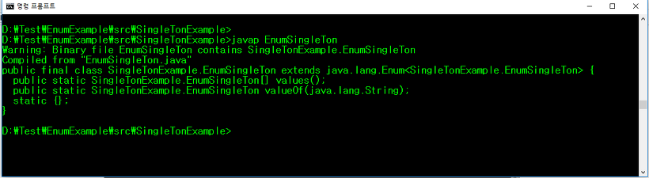

# [Design_Pattern] Singleton(싱글톤)의 고도화

<https://limkydev.tistory.com/67>

## 1. Eager initialization (이른 초기화 방식)

먼저 Singleton의 가장 기본적인 Eager initialization 방식입니다. 먼저 클래스 내에 전역변수로 instance 변수를 생성하고 private static을 사용하여 인스턴스화에 상관없이 접근이 가능하면서 동시에 private 접근 제어 키워드를 사용해 Eager initialization.instance 로 바로 접근 할 수 없도록 합니다. 또 생성자에도 private 접근 제어 키워드를 붙여 다른 클래스에서 new EagerInitialization(); 방식으로 새로운 인스턴스를 생성하는 것을 방지합니다.

오로지 정적메서드인 getInstance() 메서드를 이용해서 인스턴스를 접근하도록 하여 유일무이한 동일 인스턴스를 사용하는 기본 싱글톤(Singleton) 원칙을 지키게합니다.

이른 초기화 방식은 싱글톤 객체를 미리 생성해 놓는 방식입니다. 항상 싱글톤 객체가 필요하거나 객체 생성비용이 크게 들어가지 않는 경우에 사용합니다.

```java
package SingleTonExample;

public class EagerInitialization {

    //private static으로 선언
    private static EagerInitialization instance = new EagerInitialization();

    //생성자
    private EagerInitialization() {}

    //인스턴스 리턴
    public static EagerInitialization getInstance() {
        return instance;
    }
}
```

장점 : static으로 생성된 변수에 싱글톤 객체를 선언했기 때문에 클래스 로더에 의해 클래스가 로딩 될 때 싱글톤 객체가 생성됩니다. 또 클래스 로더에 의해 클래스가 최초 로딩 될 때 객체가 생성됨으로 Thread-safe합니다.

단점 : 싱글톤객체 사용유무와 관계없이 클래스가 로딩되는 시점에 항상 싱글톤 객체가 생성되고, 메모리를 잡고있기 때문에 비효율적일 수 있다.

## 2. Lazy initialization (늦은 초기화 방식)

Eager initialization (이른 초기화방식)과 정반대로 클래스가 로딩되는 시점이 아닌 클래스의 인스턴스가 사용되는 시점에서 싱글톤 인스턴스를 생성합니다.

즉 사용시점까지 싱글톤 객체 생성을 미루기 때문에 사용하기 전까지 메모리를 점유하지 않습니다.

getInstance() 메서드안에서 instance가 null 인 경우에만 new LazyInitialization(); 선언하였습니다.

```java
package SingleTonExample;

public class LazyInitialization {
    private static LazyInitialization instance;
    private LazyInitialization(){}
    public static LazyInitialization getInstance(){
        if(instance == null){
            instance = new LazyInitialization();
        }
        return instance;
    }
}
```

장점 : 싱글톤 객체가 필요할 때 인스턴스를 얻을 수 있습니다. Eager initialization 방식에 단점을 보완할 수 있습니다.(메모리 누수 방지)

단점 : 만약 multi-thread 환경에서 여러 곳에서 동시에 getInstance()를 호출할 경우 인스턴스가 두번 생성될 여지가 있습니다. 즉 multi-thread 환경에서는 싱글톤 철학이 깨질 수 있는 위험이 있습니다.

## 3. Thread safe Lazy initialization (스레드 안전한 늦은 초기화)

Lazy initialization 방식에서 thread-safe하지 않다는 단점을 보완하기 위해 멀티스레드에서 스레드들이 동시접근하는 동시성을 synchronized 키워드를 이용해 해결합니다.

```java
package SingleTonExample;

public class ThreadSafeLazyInitialization{
    private static ThreadSafeLazyInitializationinstance;
    private ThreadSafeLazyInitialization(){}
    public static synchronized ThreadSafeLazyInitializationgetInstance(){
        if(instance == null){
            instance = new ThreadSafeLazyInitialization();
        }
        return instance;
    }
}
```

장점 : 위에서 말했듯 Lazy initialization 방식에서 thread-safe하지 않은 점을 보완한다.

단점 : synchronized 키워드를 사용할 경우 자바 내부적으로 해당 영역이나 메서드를 lock, unlock 처리하기 때문에 내부적으로 많은 cost가 발생한다. 따라서 많은 thread 들이 getInstance()를 호출하게 되면 프로그램 전반적인 성능저하가 발생한다.

## 3-1. Thread safe Lazy initialization + Double-checked locking 기법

자 위에서 Thread safe Lazy initialization 알아보았는데, 많은 스레드들이 동시에 synchronized 처리된 메서드를 접근하면 성능저하가 발생된다고 했습니다. 이를 좀 더 완화시키기 위해 Double-checked locking기법을 사용합니다.

```java
package SingleTonExample;

public class ThreadSafeLazyInitialization {

    private static ThreadSafeLazyInitialization instance;
    private ThreadSafeLazyInitialization(){}
    public static ThreadSafeLazyInitialization getInstance(){
        //Double-checked locking
        if(instance == null){
            synchronized (ThreadSafeLazyInitialization.class) {
                if(instance == null)
                    instance = new ThreadSafeLazyInitialization();
            }
        }
        return instance;
    }
}
```

첫번째 if문에서 instance 가 null인 경우 synchronized 블럭에 접근하고 한번 더 if문으로 instance가 null 유무를 체크합니다. 2번 모두다 instance가 null인 경우에 new를 통해 인스턴스화 시킵니다. 그 후에 instance가 null이 아니기 때문에 synchronized 블럭을 타지 않습니다. 이런 Double-checked locking기법을 통해 성능저하를 보완할 수 있습니다.

## 4. Initialization on demand holder idiom (holder에 의한 초기화)

이 방법은 클래스안에 클래스(Holder)를 두어 JVM의 Class Loader 매커니즘과 Class가 로드되는 시점을 이용한 방법입니다. Lazy initialization 방식을 가져가면서 Thread간 동기화문제를 동시에 해결할 수 있습니다.

중첩클래스 Holder는 getInstance 메서드가 호출되기 전에는 참조 되지 않으며, 최초로 getInstance() 메서드가 호출 될 때 클래스 로더에 의해 싱글톤 객체를 생성하여 리턴합니다. 우리가 알아둬야 할 것은 holder 안에 선언된 instance가 static이기 때문에 클래스 로딩 시점에 한번만 호출된다는 점을 이용한것이죠. 또 final을 써서 다시 값이 할당되지 않도록 합니다.

```java
package SingleTonExample;

public class InitializationOnDemandHolderIdiom {

    private InitializationOnDemandHolderIdiom(){}
    private static class SingleTonHolder{
        private static final InitializationOnDemandHolderIdiom instance = new InitializationOnDemandHolderIdiom();
    }
    public static InitializationOnDemandHolderIdiom getInstance(){
        return SingleTonHolder.instance;
    }
}
```

현재까지 가장 많이 사용되는 방법으로 알려져있습니다.. 그 만큼 검증됬다는 이야기같습니다.

## 5. Enum initialization (Enum 초기화)

이번에는 조금 색다른 방법으로 싱글톤 패턴을 구현해보겠습니다. 바로 자바 1.5 버전부터 지원하는 enum입니다.
enum이 가지는 특징을 이용해서 싱글톤 패턴을 심플하게 구현할 수 있습니다.
enum에 대한 개념이 없으시다면 아래 글을 읽어보시길 권합니다.

2017/07/27 - [Java] - [Java] Enum의 사용법
2017/06/27 - [Java] - [Java] enum 이란?

모든 enum type들은 프로그램 내에서 한번 초기1화되는 점을 이용해 싱글톤을 구현합니다.

```java
package SingleTonExample;
public enum EnumSingleTon {

        INSTANCE;
        public void excute(String arg){
            //...code
        }
}
```

enum 으로 구현된 싱글톤 클래스의  .class파일을 javap 명령어로 cmd에서 역컴파일하면 다음과 같습니다.


enum도 결국 지금까지 배웠던 싱글톤 클래스와 비슷비슷하다. 클래스 로딩시점에 static 블럭에서 싱글톤 객체인 INSTANCE에 초기화를 합니다. 장점은 Eager initialization 동일합니다.

// 6. using reflection to destroy singleton

참고
<https://blog.seotory.com/post/2016/03/java-singleton-pattern>
<http://www.jpstory.net/2013/05/singleton-pattern/>
