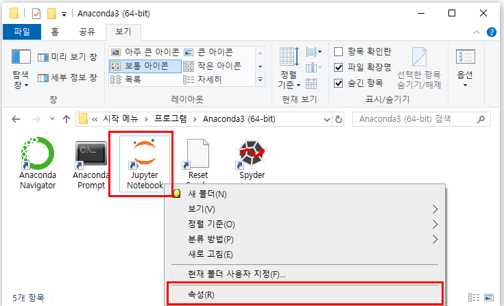
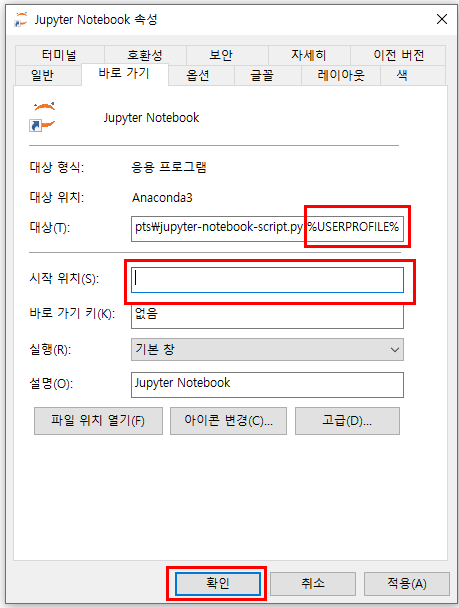

# Jupyter

## Anaconda Path

%ANACONDA_HOME\Anaconda3
%ANACONDA_HOME\Anaconda3\Library
%ANACONDA_HOME\Anaconda3\Library\bin
%ANACONDA_HOME\Anaconda3\Scripts

## Upgrade

```bash
conda --version
python --version

# Conda 업데이트
conda update -n base conda

# Python
conda install python=3.8

# 파이썬 패키지 업데이트
conda update --all

# pip 업데이트
python -m pip install --upgrade pip

```

## 설정

```bash
jupyter notebook --generate-config
```

`C:\Users\anaba\.jupyter\jupyter_notebook_config.py`
`사용자_HOME\.jupyter\jupyter_notebook_config.py`

- The directory to use for notebooks and kernels.

```properties
c.NotebookApp.notebook_dir = 'D:/GOOGLE_DRIVE/09.SOURCE/JUPYTER'
```

### Jupyter Notebook > 속성



### 설정 변경


