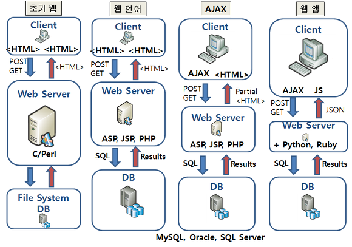

# Chapter 01

example.py

```python
#import urllib2
#print urllib2.urlopen("http://www.example.com").read()

import urllib.request
response = urllib.request.urlopen(urllib.request.Request("http://www.example.com"))
print (response.read().decode('utf-8'))
```

The urllib and urllib2 modules are merged together in python3 as urllib. If you want to make your code compatible with both 2.x and 3.x, I would advise you to look into the [six module](https://pypi.python.org/pypi/six)


