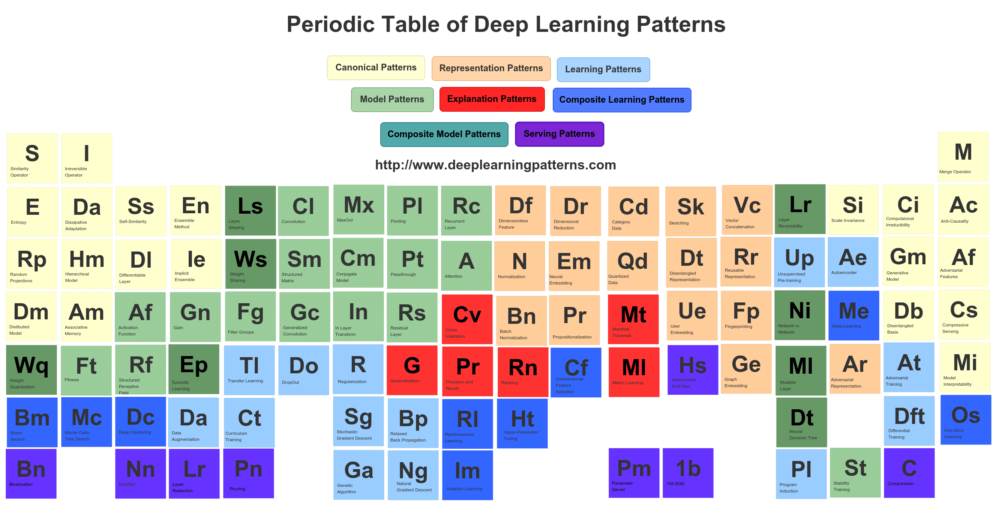

# Periodic Table of Deep Learning Patterns

## ML Table

<https://www.datasciencecentral.com/profiles/blogs/design-patterns-for-deep-learning-architectures>

### Canonical Patterns

### Representation Patterns

### Learning Patterns

### Model Patterns

### Explanation Patterns

### Composite Learning Patterns

### Composite Model Patterns

### Serving Patterns