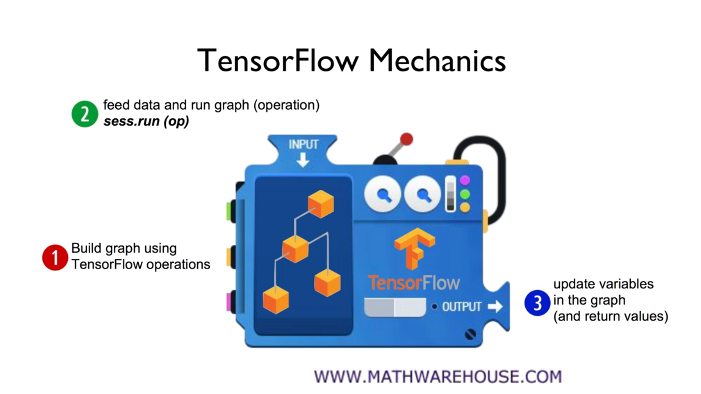

# LAB01

## TensorFlow Start

```python
# Create a constant op
# This op is added as a node to the default graph
hello = tf.constant("Hello, TensorFlow!")

# start a TF session
sess = tf.Session()

# run the op and get result
print(sess.run(hello))
```

tf.constant : <https://www.tensorflow.org/api_docs/python/tf/constant>
tf.Session : <https://www.tensorflow.org/api_docs/python/tf/Session>

결과 
b'Hello, TensorFlow!'

```python
node1 = tf.constant(3.0, tf.float32)
node2 = tf.constant(4.0) # also tf.float32 implicitly
node3 = tf.add(node1, node2)

print("node1:", node1, "node2:", node2)
print("node3: ", node3)

sess = tf.Session()
print("sess.run(node1, node2): ", sess.run([node1, node2]))
print("sess.run(node3): ", sess.run(node3))
```

tf.add : <https://www.tensorflow.org/api_docs/python/tf/add>



## Placeholder

```python
a = tf.placeholder(tf.float32)
b = tf.placeholder(tf.float32)
adder_node = a + b  # + provides a shortcut for tf.add(a, b)

print(sess.run(adder_node, feed_dict={a: 3, b: 4.5}))
print(sess.run(adder_node, feed_dict={a: [1,3], b: [2, 4]}))
```

```config
run(
    fetches,
    feed_dict=None,
    options=None,
    run_metadata=None
)
```

노드를 만드는 명령어
tf.palceholder : <https://www.tensorflow.org/api_docs/python/tf/placeholder>

## Tensor Ranks, Shapes, and Types

[URL](https://www.tensorflow.org/programmers_guide/dims_types)

```python
t = [[1,2,3],[4,5,6],[7,8,9]]
```

### RANK
| Rank | Math entity | Python example |
| :-- | :-- | :-- |
| 0 | Scalar(magnitude only) | s = 486 |
| 1 | Vector(magnitude and direction) | v = [1.1, 2.2, 3.3] |
| 2 | Matrix(table of numbers) | m = [[1, 2, 3], [4, 5, 6], [7, 8, 9]] |
| 3 | 3-Tensor(cube of numbers) | t = [[[2], [4], [6] ], [[8], [10], [12]], [[14], [16], [18]]] |
| n | n-Tensor(you get the idea) | ... |

### SHAPE
| Rank | Shape | Dimension number | Example |
| :-- | :-- | :-- | :-- |
| 0 | [] | 0-D | A 0-D tensor. A scalar |
| 1 | [D0] | 1-D | A 1-D tensor with shape[5] |
| 2 | [D0,D1] | 2-D | A 2-D tensor with shape[3,4] |
| 3 | [D0,D1,D2] | 3-D | A 3-D tensor with shape[1,3,4] |
| n | [D0,D1,...,Dn-1] | n-D | A tensor with shape [D0,D1,...,Dn-1] |

### DATA TYPE
| Data type | Python type | Description |
| :-- | :-- | :-- |
| DT_FLOAT | tf.float32 | 32 bits floating point |
| DT_DOUBLE | tf.float64 | 64 bits floating point |
| DT_INT8 | tf.int8 | 8 bits signed integer |
| DT_INT16 | tf.int16 | 16 bits signed integer |
| DT_INT32 | tf.int32 | 32 bits signed integer |
| DT_INT64 | tf.int64 | 64 bits signed integer |
| ...  |
