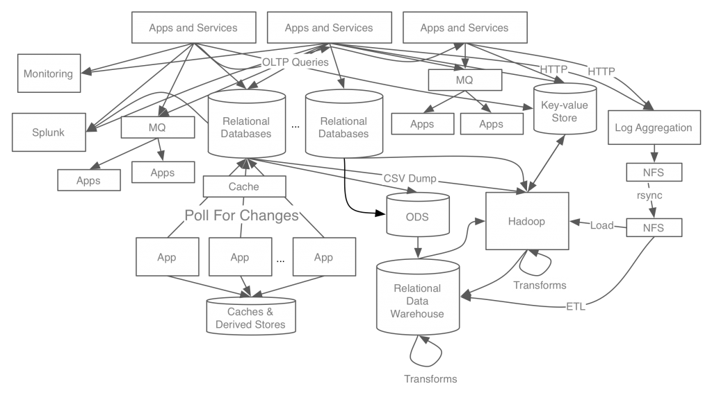
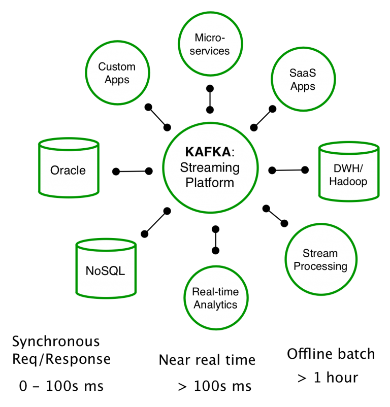
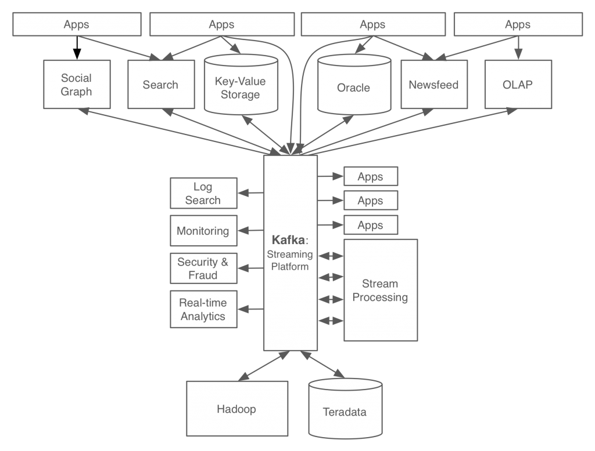
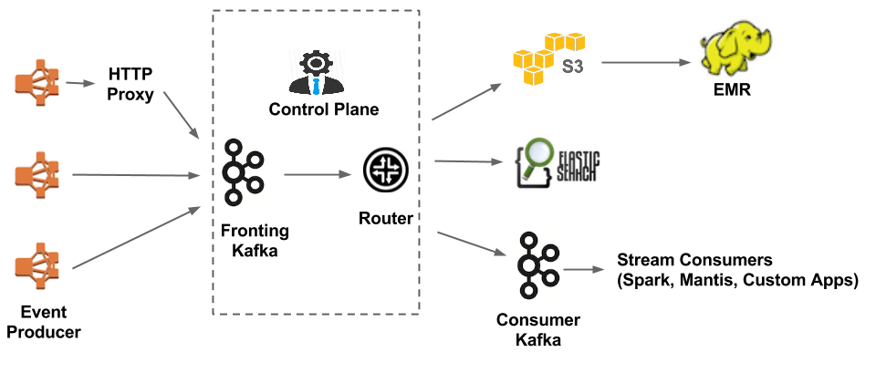

# 1장  카프카란 무엇인가(1부 카프카를 시작하며)

1. __메트릭 모니터링용 데이터 시스템__ : 앱이나 서비스에서 일어나는 미터링(사용량, 응답시간, 에러 카운트 등) 정도를 저장할 시계열(Time Series) 데이터 처리용 시스템
2. __로그 모니터링용 데이터 시스템__ : 앱/서비스에서 발생하는 로그를 저장하고 , 이것을 기반으로 실시간/배치로 분석할 수 있도록 데이터를 저장하는 시스템
3. __서비스에 필요한 컨텐츠와 고객 정보 데이터들을 저장하는 메인 데이터 시스템__. 대부분의 앱들에서 보낸 OLTP(Online Transaction Process) 쿼리(주로 데이터 갱신)를 실행한다.
4. __추천이나 장바구니와 같이 트랜잭션 처리까진 필요없지만 실시간으로 처리를 해줘야하는 내용을 저장하는 키/값 저장소__, 앱이나 사용자는 HTTP 프로토콜이나 OLTP쿼리를 실행한다.
5. __서비스와 제품군 전체에서 발생하는 데이터를 모아서 일단/주간/월간/연간 데이터를 제공하는 데이터 마켓이나 이것을 활용해 배치분석을 하는 데이터 웨어하우스__. 각종 데이터 시스템에서 이곳으로 데이터를 보낸다.
6. __빅데이터를 저장/처리하기 위한 하둡 시스템__. 빅데이터를 처리해서 데이터 웨어하우스에 보낸다. 이런 작업을 ETL(Extract, Transform, Load의 줄임말) 작업이라고 한다.

## 필요시스템

- 프로듀서와 컨슈머의 분리
- 메시징 시스템과 같이 영구 메시지 데이터를 여러 컨슈머에게 허용
- 높은 처리량을 위한 메시지 최적화
- 데이터가 증가함에 따라 스케일아웃이 가능한 시스템
  

## 카프카의 동작 방식과 원리

## 카프카의 특징

- 프로듀서와 컨슈머의 분리
- 멸티 프로듀서, 멀티 컨슈머
- 디스크에 메시지 저장
- 확장성
- 높은 성능

## 카프카의 화장과 발전(ESB)

- 다양한 시스템과 연동하기 위한 멀티 프로토콜과 데이터 타입 지원
- 느슨한 결합을 위한 메시지 큐 지원
- 정기적으로 데이터를 가져오는 대신 이벤트 기반 통신 지향

