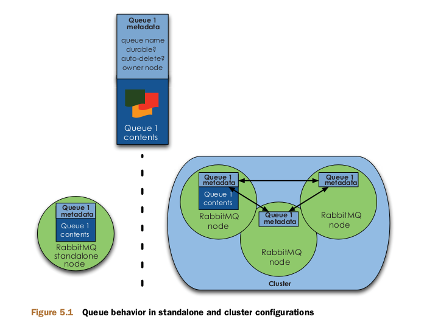
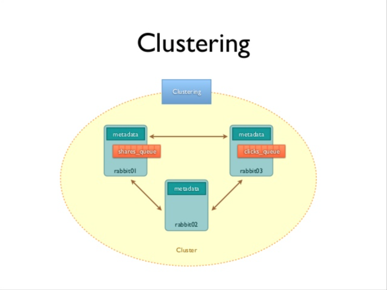
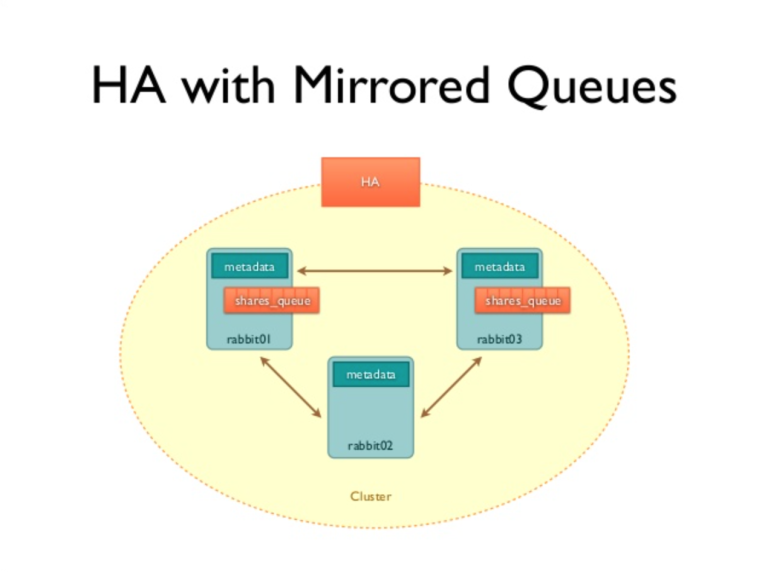
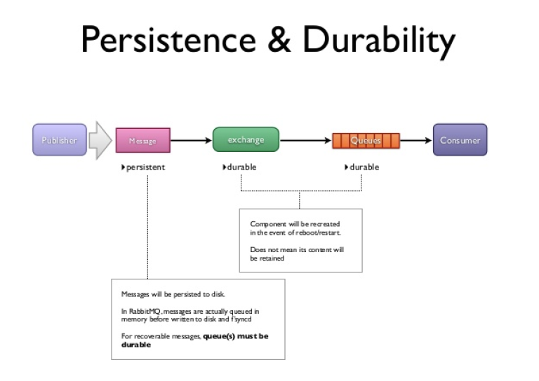

# Install

## 설치

## Install Clustering

<https://miniopt.wordpress.com/2015/01/19/rabbitmq-clustering-with-highlyz-availabl/>

<http://abh0518.net/tok/?p=411>

<https://jonnung.dev/rabbitmq/2019/08/08/rabbitmq-cluster/>

## 구성방법

- config file 에 클러스터 노드 목록을 정의
- rabbitmqctl CLI 툴을 이용한 수동 구성
- 기타 AWS, K8S 기반의 노드 디스커버리 방식 등등

## StandAlone

- MEM : 1024
- IP : 192.168.4.52/53/54
- DNS : 1.1.1.1
- C8_RABBITMT1/2/3
- HDD : 80GB
- HOSTNAME : rabbitmq1.localdomain

hostnamectl set-hostname rabbitmq1.localdomain
hostnamectl set-hostname rabbitmq2.localdomain

### 기본작업

```bash
#0. 기본 프로그램
yum install net-tool

#1. EPEL 저장소 설치
yum install -y epel-release

#2. erlang 설치
yum install -y erlang

#3. RabbitMQ 설치
yum install -y rabbitmq-server

#sudo yum -y update
curl -s https://packagecloud.io/install/repositories/rabbitmq/rabbitmq-server/script.rpm.sh | sudo bash
sudo yum makecache -y --disablerepo='*' --enablerepo='rabbitmq_rabbitmq-server'
sudo yum -y install rabbitmq-server

#4. Web Console 활성화
rabbitmq-plugins enable rabbitmq_management

# 5. RabbitMQ 서비스 등록
# systemctl list-unit-files | grep rabbitmq-server
# rabbitmq-server.service disabled
systemctl enable rabbitmq-server

#6. RabbitMQ 서비스 기동
systemctl start rabbitmq-server

#7. RabbitMQ의 새로운 계정 추가.
# RabbitMQ 사용자 리스트 확인
rabbitmqctl list_users

# RabbitMQ 사용자 추가(<사용자> <비번>)
# rabbitmqctl add_user test test
rabbitmqctl add_user admin admin

# RabbitMQ 사용자에게 태그설정(<사용자> <태그>)
# rabbitmqctl set_user_tags test administrator
# rabbitmqctl set_user_tags test administrator
rabbitmqctl set_user_tags admin administrator

#RabbitMQ 사용자 접속 퍼미션 설정(<사용자> <접속퍼미션> ...)
rabbitmqctl list_permissions

# rabbitmqctl set_permissions -p / test ".*" ".*" ".*"
rabbitmqctl set_permissions -p / admin ".*" ".*" ".*"

# 사용자 제거
rabbitmqctl delete_user <사용자>

#사용자의 비번 변경
rabbitmqctl change_password <사용자> <신규비번>
```

#### 방화벽

```bash
#### 6.5 이전
vi /etc/sysconfig/iptables
-A INPUT -m state —state NEW -m tcp -p tcp —dport 5672 -j ACCEPT
-A INPUT -m state —state NEW -m tcp -p tcp —dport 4369 -j ACCEPT
-A INPUT -m state —state NEW -m tcp -p tcp —dport 35197 -j ACCEPT
-A INPUT -m state —state NEW -m tcp -p tcp —dport 15672 -j ACCEPT

#### 6.5 이후
firewall-cmd --permanent --zone=public --add-port=5672/tcp
firewall-cmd --permanent --zone=public --add-port=4369/tcp
firewall-cmd --permanent --zone=public --add-port=35197/tcp
firewall-cmd --permanent --zone=public --add-port=15672/tcp
firewall-cmd --reload
```

```bash
# 8. Web Console 접속
https://serverip:15672 OR http://serverip:15672
```

[원본 URL]
<http://bangcfactory.tistory.com/entry/rabbitmq-%EC%82%AC%EC%9A%A9%EC%9E%90-%EA%B4%80%EB%A6%AC>
<http://linux.systemv.pe.kr/centos-7-rabbitmq-%EC%84%A4%EC%B9%98/>

[참고] ‘메시지 큐’ 란 무엇인가? <http://zzong.net/post/3>
출처: <https://sangchul.kr/647> [변군이글루]

## Clustering



1. 서버간 얼랭 쿠키 맞추기
2. 클러스터 구성하기
3. 클러스터 노드 타입 변경
4. 미러링 구성하기
5. 클러스터에서 빠져나오기

- RabbitMQ 클러스터링은 기본적으로 독립적인 두 노드가 하나인것 처럼 동작
- 어느쪽에 message를 publish하거나 consume하더라도 동일하게 동작
- master에만 컨텐츠가 저장되고, slave에는 metadata만 있기 때문에 slave가 중단되어도 아무 문제가 생기지 않음
- 기본적으로는 이렇게되고 아래쪽에 HA구성을 하면 복제되어 slave 에도 저장
- master가 중단되면 선언된 queue가 사라지고, slave에서는 not found queue가 발생
- master와 slave는 외부에서 선언되는 것이 아니고, (cluster_join의 순서나 방법에 영향이 없음) Queue가 선언된 (DeclareQueue를 처음한 노드) 노드가 master처럼 동작
- 관리를 위해서 master를 지정할때는 setup후에 declare를 한쪽에 몰아서 함 (queue를 추가할때는 master에만 하도록 유도한다.)

### Cluster 구성시 Connection 관리

- `[PUBLISHER][CUNSUMER]` message를 publish하거나 consume할때 클러스터내의 어떠한 노드에 수행하여도 동일하게 동작
- `[PUBLISHER]` 일반적으로 message를 publish하는 동작은 짧은시간의 connection만 유지하면 되기 때문에 LB를 통해 RabbitMQ cluster의 node에 connection을 연결하고 publish하고 연결을 끊는 동작을 반복
- `[CUNSUMER]` 일반적으로 consumer가 connection을 점유하고 있는 경우가 많기 때문에 [PUBLISHER]publisher는 필요할때마다 새로 connection을 연결해 publish
- `[CUNSUMER]` message를 consume하는 동작은 connection을 장기간 유지하며 message를 wait하는 경우가 많기 때문에 RabbitMQ cluster의 node에 직접 connection을 연결하고 해당 연결을 유지하며 재사용
- [CUNSUMER] consumer는 장시간 wait하거나 유지하여야 하는데 LB를 통해 연결하였을 경우, LB설정에 따라 연결이 유실될 수 있고, 최악의 경우 연결이 유실되어도 일정시간동안 RabbitMQ server및 client 모두가 유실된것을 발견하지 못 할 수 있기 때문에 주의

### 1. 서버간 얼랭 쿠키 맞추기

#### Erlang 쿠키 위치 확인

- /var/lib/rabbitmq/.erlang.cookie
- $HOME$/.erlang.cookie
- 관련파일 공유

### 2. 클러스터 구성하기

#### 클러스터 확인
  
```bash
# 1번서버 확인, 자기 자신 노드만 확인됨
rabbitmqctl cluster_status
Cluster status of node rabbit@rabbit1 ...
[{nodes,[{disc,[rabbit@rabbit1]}]},{running_nodes,[rabbit@rabbit1]}]
...done.

# 2번 서버 확인, 자기 자신 노드만 확인됨
rabbitmqctl cluster_status
Cluster status of node rabbit@rabbit2 ...
[{nodes,[{disc,[rabbit@rabbit2]}]},{running_nodes,[rabbit@rabbit2]}]
...done.

# 3번 서버 확인, 자기 자신 노드만 확인됨
rabbitmqctl cluster_status
Cluster status of node rabbit@rabbit3 ...
[{nodes,[{disc,[rabbit@rabbit3]}]},{running_nodes,[rabbit@rabbit3]}]
...done.
```

#### 클러스터 묶기

- <https://teragoon.wordpress.com/2012/01/13/rabbitmqctl-%EC%82%AC%EC%9A%A9%EB%B2%95/>
- <https://suji-developer.tistory.com/10>
- rabbitmqctl로 노드를 정지시킬때 반드시 stop_app을 사용(실수로 stop을 해버리면 rabbitmqctl 명령 자체가 먹지 않음)
- stop은 RabbitMQ node 자체를 종료/stop_app은 RabbitMQ의 Management Application을 정지
Cluster를 묶을때 해당 서버의 hostname

```bash
systemctl stop firewalld
systemctl status firewalld
systemctl disable firewalld

systemctl enable firewalld
systemctl start firewalld

firewall-cmd --list-all

rabbitmqctl stop_app
rabbitmqctl reset
rabbitmqctl join_cluster rabbit@rabbitmq1
rabbitmqctl start_app
rabbitmqctl cluster_status
```

### 3. 클러스터 노드 타입 변경

- RAM : 메모리
- disc : 디스크

```bash
# rabbitmq1 기준
# 노드 중지
rabbitmqctl stop_app

# 노드 타입 변경
rabbitmqctl change_cluster_node_type ram

# 노드 시작
rabbitmqctl start_app
```

### 4. 미러링 구성하기

모든 노드에서 다른 노드의 Exchange와 Binding 같은 내용은 공유
데이터 공유를 위해서 미러링




- 클러스터 모든 노드의 Queue를 미러링하기

```bash
rabbitmqctl set_policy ha-all "^ha\\." '{"ha-mode":"all"}'
```

- 지정한 개수의 리플리카만 생성

```bash
rabbitmqctl set_policy ha-two "^two\\." '{"ha-mode":"exactly", "ha-params": 2, "ha-sync-mode": "automatic"}'
```

- 지정한 이름의 노드만 미러링

```bash
rabbitmqctl set_policy ha-nodes "^nodes\\." '{"ha-mode": "nodes", "ha-params": ["rabbit@nodeA", "rabbit@nodeB"]}'
```

#### Mirrored Queue

- master/slave queue의 선언 위치와 관계없이 메시지가 복사되어 보존되고 처리됨 (결국 모든 노드가 master이자 slave)
- Mirrored Queue는 Replication이 아니기 때문에 가동중에 node를 추가했을 경우 node 추가 이전의 message에 대해 공유하지 않는다. (node 추가 이후의 message만 복사해서 갖는다.)
- master에 insert후에 복사가 아니고 전체 node에 복사후에 insert하는 로직
- message의 연속성등이 중요하다면 node추가에 주의.

#### Persistent & Durability



- __persistent__
  - publish된 메시지를 disk에 저장하여 장애 발생시 복구 가능.
  - queue가 durable속성을 가지고 생성되어야만 의미.
- __durable__
  - 쿼리 브로커가 재시작할때 기존의 messge를 복원.
- 위 두가지 속성은 데이터의 안정성을 보장해 주는 방법이기는 하나 전체적인 publish/consume의 속도에 영향.
  - 만약 RabbitMQ가 HA와 cluster로 구성되어 있다면, 모든 node가 동시에 down되지 않는한 데이터를 손실하는 케이스는 발생하지 않기 때문에 안정성과 퍼포먼스사이에 의사결정이 필요.
  - 개인적인 생각으로는 모든 node가 동시에 down되는일은 발생하지 않는다고 가정하고 (동시에 down되면 어쨌든 publisher와 consumer둘다 정상동작이 어렵기 때문에 message손실이 생기지 않을까?) HA with cluster구성을하고 persistent와 durable속성을 끄고 사용하는 것 권장.

### 5. 클러스터에서 빠져나오기

```bash
# 3번 서버를 클러스터에서 제거
rabbit3$ rabbitmqctl stop_app
rabbit3$ rabbitmqctl reset
rabbit3$ rabbitmqctl start_app

# 2번 서버에서 확인해보기
rabbit2$ rabbitmqctl cluster_status
Cluster status of node rabbit@rabbit2 ...
[{nodes,[{disc,[rabbit@rabbit1,rabbit@rabbit2]}]},
 {running_nodes,[rabbit@rabbit1,rabbit@rabbit2]}]
```

### CASE

#### 1. 1번과 3번 RAM , 2번 disc

```bash
# disc로 작동할 2번 서버 먼저 작업
# node중에 disc가 하나라도 없는 상황이 될 수 있으면 변경이 되지 않음
# 2번 서버 작업
rabbitmqctl stop_app
rabbitmqctl change_cluster_node_type disc

# 1번 서버 작업
rabbitmqctl stop_app
rabbitmqctl change_cluster_node_type ram
rabbitmqctl start_app

# 3번 서버 작업
rabbitmqctl stop_app
rabbitmqctl change_cluster_node_type ram
rabbitmqctl start_app
```

#### 미러링 구성하기

- 클러스터는 서로의 내용을 공유만 할 뿐이어서 불의의 사고로 1번서버가 죽어버린다면 2번, 3번 서버를 통해서 1번서버 큐의 내용을 읽을 수 없게 되며 1번에 남아있던 message들은 모두 증발
- 고가용성을 위해 클러스터의 노드들이 서로의 내용을 복사하여 저장, 노드간 미러링을 구성

##### 1. 미러링 정책 설정하기

- 서버 한 곳에서만 설정해도 모든 서버에 설정이 공유(<https://www.rabbitmq.com/ha.html>)
- ha-all은 새로 추가되는 정책의 이름, ^ha\.은 regexp로 표현된 미러링할 queue 이름, 뒤의 json은 정책 세부 사항,

```bash
rabbitmqctl set_policy ha-all "^ha\." '{"ha-mode":"all"}'
```

##### 2. Virtual Host 별로 정책 설정해주기

- 1번의 내용은 default virtual host에 적용
- 새로 만든 virtual host에 ha 정책을 정해주려면 -p 옵션을 사용
- myQueue Virtual Host 속한 이름에 .ha 가 포함된 Queue를 모두 미러링 하는 정책

```bash
rabbitmqctl set_policy -p myQueue ha-all "^.*\.ha.*" '{"ha-mode":"all"}'
```

#### 3. ha-sync-mode 에 대해

- 미러링을 하면 node간 모든 내용들이 복사
- 클러스터에 새로운 node가 추가되었을때 이 node에 다른 node들이 가지고 있는 과거의 Data를 Sync해야할 것
- RabbitMQ는 기본적으로 새로 추가된 node(죽었다 살아난 node 포함)에 기존 node의 과거의 data들을 복사하지 않도록 함.
- Data Sync하는 동안 해당 Queue는 무응답 상태가 되어 버려 서비스 가용성에 좋지 않은 영향을 미칠수 있기 때문
- 추가되는 노드에 반드시 과거 Data가 Sync되어야 한다면 ha-sync-mode 옵션으로 설정
- ha-sync-mode를 automatic으로 설정, 새로 들어오는 node에도 과거의 data가 모두 복사

```bash
rabbitmqctl set_policy -p myQueue ha-all "^.*\.ha.*" '{"ha-mode":"all", "ha-sync-mode":"automatic"}'
```

#### 4. Management Plugin 을 이용한 테스트 및 관리

- 미러링은 그냥 Virtual Host에 적용되는 정책에 따라 변함
- 이러한 정책은 Management Plugin에서 Admin=>Policies 메뉴를 이용하면 좀더 편리하게 설정
