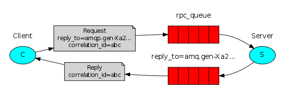

# RabbitMQ Tutorials

These tutorials cover the basics of creating messaging applications using RabbitMQ. You need to have the RabbitMQ server installed to go through the tutorials, please see the installation guide or use the Docker image. Code examples of these tutorials are open source, as is RabbitMQ website

## Hello World

The simplest thing that does something

## Work queues

Distributing tasks among workers (the competing consumers pattern)

## Publish/Subscribe

Sending messages to many consumers at once

## Routing

Receiving messages selectively

## Topics

Receiving messages based on a pattern (topics)

## RPC

Request/reply pattern example

## Publisher Confirms
