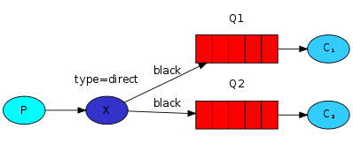
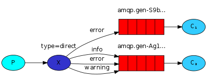

# Routing

## Prerequisites

This tutorial assumes RabbitMQ is installed and running on localhost on standard port (5672). In case you use a different host, port or credentials, connections settings would require adjusting.

## Where to get help

If you're having trouble going through this tutorial you can contact us through the mailing list.

## Introduction

In the previous tutorial we built a simple logging system. We were able to broadcast log messages to many receivers.

In this tutorial we're going to add a feature to it - we're going to make it possible to subscribe only to a subset of the messages. For example, we will be able to direct only critical error messages to the log file (to save disk space), while still being able to print all of the log messages on the console.

### Bindings

In previous examples we were already creating bindings. You may recall code like:

```java
channel.queueBind(queueName, EXCHANGE_NAME, "");
```

A binding is a relationship between an exchange and a queue. This can be simply read as: the queue is interested in messages from this exchange.

Bindings can take an extra routingKey parameter. To avoid the confusion with a basic_publish parameter we're going to call it a binding key. This is how we could create a binding with a key:

```java
channel.queueBind(queueName, EXCHANGE_NAME, "black");
```

The meaning of a binding key depends on the exchange type. The fanout exchanges, which we used previously, simply ignored its value.

### Direct exchange

Our logging system from the previous tutorial broadcasts all messages to all consumers. We want to extend that to allow filtering messages based on their severity. For example we may want a program which writes log messages to the disk to only receive critical errors, and not waste disk space on warning or info log messages.

We were using a fanout exchange, which doesn't give us much flexibility - it's only capable of mindless broadcasting.

We will use a direct exchange instead. The routing algorithm behind a direct exchange is simple - a message goes to the queues whose binding key exactly matches the routing key of the message.

To illustrate that, consider the following setup:


In this setup, we can see the direct exchange X with two queues bound to it. The first queue is bound with binding key orange, and the second has two bindings, one with binding key black and the other one with green.

In such a setup a message published to the exchange with a routing key orange will be routed to queue Q1. Messages with a routing key of black or green will go to Q2. All other messages will be discarded.

### Multiple bindings



It is perfectly legal to bind multiple queues with the same binding key. In our example we could add a binding between X and Q1 with binding key black. In that case, the direct exchange will behave like fanout and will broadcast the message to all the matching queues. A message with routing key black will be delivered to both Q1 and Q2.

### Emitting logs

We'll use this model for our logging system. Instead of fanout we'll send messages to a direct exchange. We will supply the log severity as a routing key. That way the receiving program will be able to select the severity it wants to receive. Let's focus on emitting logs first.

As always, we need to create an exchange first:

```java
channel.exchangeDeclare(EXCHANGE_NAME, "direct");
```

And we're ready to send a message:

```java
channel.basicPublish(EXCHANGE_NAME, severity, null, message.getBytes());
```

To simplify things we will assume that 'severity' can be one of 'info', 'warning', 'error'.

### Subscribing

Receiving messages will work just like in the previous tutorial, with one exception - we're going to create a new binding for each severity we're interested in.

```java
String queueName = channel.queueDeclare().getQueue();

for(String severity : argv){
  channel.queueBind(queueName, EXCHANGE_NAME, severity);
}
```

### Putting it all together



The code for EmitLogDirect.java class:

```java
import com.rabbitmq.client.Channel;
import com.rabbitmq.client.Connection;
import com.rabbitmq.client.ConnectionFactory;

public class EmitLogDirect {

  private static final String EXCHANGE_NAME = "direct_logs";

  public static void main(String[] argv) throws Exception {
    ConnectionFactory factory = new ConnectionFactory();
    factory.setHost("localhost");
    try (Connection connection = factory.newConnection();
         Channel channel = connection.createChannel()) {
        channel.exchangeDeclare(EXCHANGE_NAME, "direct");

        String severity = getSeverity(argv);
        String message = getMessage(argv);

        channel.basicPublish(EXCHANGE_NAME, severity, null, message.getBytes("UTF-8"));
        System.out.println(" [x] Sent '" + severity + "':'" + message + "'");
    }
  }
  //..
}
```

The code for ReceiveLogsDirect.java:

```java
import com.rabbitmq.client.*;

public class ReceiveLogsDirect {

  private static final String EXCHANGE_NAME = "direct_logs";

  public static void main(String[] argv) throws Exception {
    ConnectionFactory factory = new ConnectionFactory();
    factory.setHost("localhost");
    Connection connection = factory.newConnection();
    Channel channel = connection.createChannel();

    channel.exchangeDeclare(EXCHANGE_NAME, "direct");
    String queueName = channel.queueDeclare().getQueue();

    if (argv.length < 1) {
        System.err.println("Usage: ReceiveLogsDirect [info] [warning] [error]");
        System.exit(1);
    }

    for (String severity : argv) {
        channel.queueBind(queueName, EXCHANGE_NAME, severity);
    }
    System.out.println(" [*] Waiting for messages. To exit press CTRL+C");

    DeliverCallback deliverCallback = (consumerTag, delivery) -> {
        String message = new String(delivery.getBody(), "UTF-8");
        System.out.println(" [x] Received '" +
            delivery.getEnvelope().getRoutingKey() + "':'" + message + "'");
    };
    channel.basicConsume(queueName, true, deliverCallback, consumerTag -> { });
  }
}
```

Compile as usual (see tutorial one for compilation and classpath advice). For convenience we'll use an environment variable $CP (that's %CP% on Windows) for the classpath when running examples.

```bash
javac -cp $CP ReceiveLogsDirect.java EmitLogDirect.java
```

If you want to save only 'warning' and 'error' (and not 'info') log messages to a file, just open a console and type:

```bash
java -cp $CP ReceiveLogsDirect warning error > logs_from_rabbit.log
```

If you'd like to see all the log messages on your screen, open a new terminal and do:

```bash
java -cp $CP ReceiveLogsDirect info warning error
# => [*] Waiting for logs. To exit press CTRL+C
```

And, for example, to emit an error log message just type:

```bash
java -cp $CP EmitLogDirect error "Run. Run. Or it will explode."
# => [x] Sent 'error':'Run. Run. Or it will explode.'
```

(Full source code for [EmitLogDirect.java source](https://github.com/rabbitmq/rabbitmq-tutorials/blob/master/java/EmitLogDirect.java) and [ReceiveLogsDirect.java source](https://github.com/rabbitmq/rabbitmq-tutorials/blob/master/java/ReceiveLogsDirect.java))

Move on to tutorial 5 to find out how to listen for messages based on a pattern.

### Production \[Non-\]Suitability Disclaimer

Please keep in mind that this and other tutorials are, well, tutorials. They demonstrate one new concept at a time and may intentionally oversimplify some things and leave out others. For example topics such as connection management, error handling, connection recovery, concurrency and metric collection are largely omitted for the sake of brevity. Such simplified code should not be considered production ready.

Please take a look at the rest of the documentation before going live with your app. We particularly recommend the following guides: Publisher Confirms and Consumer Acknowledgements, Production Checklist and Monitoring.

### Getting Help and Providing Feedback

If you have questions about the contents of this tutorial or any other topic related to RabbitMQ, don't hesitate to ask them on the RabbitMQ mailing list.

### Help Us Improve the Docs <3

If you'd like to contribute an improvement to the site, its source is available on GitHub. Simply fork the repository and submit a pull request. Thank you!