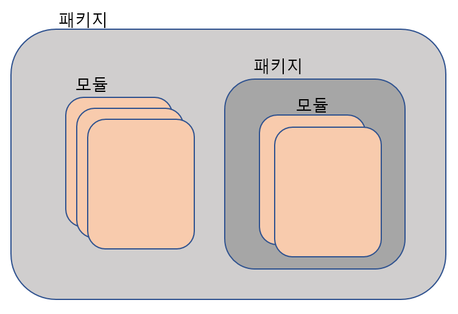

# PYTHON

## 패키지

### 1. 패키지

- 파이썬에서 모듈은 하나의 .py 파일
- 패키지는 이러한 모듈들을 모은 컬렉션
- 파이썬의 패키지는 하나의 디렉토리에 놓여진 모듈들의 집합을 가리키는데, 그 디렉토리에는 일반적으로 __init__.py 라는 패키지 초기화 파일이 존재
- Python 3.3 이후부터는 init 파일이 없어도 패키지로 인식이 가능
- 패키지는 모듈들의 컨테이너로서 패키지 안에는 또다른 서브 패키지를 포함할 수도 있음
- 파일시스템으로 비유하면 패키지는 일반적으로 디렉토리에 해당하고, 모듈은 디렉토리 안의 파일에 해당



- 파이썬으로 큰 프로젝트를 수행하게 될 때, 모든 모듈을 한 디렉토리에 모아 두기 보다는 계층적인 카테고리로 묶어서 패키지별로 관리하는 것이 편리하고 효율적
- 파이썬 프로젝트의 루트로부터 각 영역별로 디렉토리/서브디렉토리를 만들고 그 안에 논리적으로 동일한 기능을 하는묶을 모듈들을 같이 두어 패키지를 만들 수 있음
- 패키지는 "디렉토리.서브디렉토리"와 같이 엑세스하고 패키지내 모듈은 "디렉토리.서브디렉토리.모듈" 과 같이 엑세스

```bash
models/account 폴더, bill.py 라는 모듈
models/account 폴더에는 그 폴더가 일반 폴더가 아닌 패키지임을 표시하기 위해 빈 __init__.py 파일(버젼 3.3+ 에선 Optional).
```

- 패키지 안에 있는 모듈을 import 하여 사용하기 위해서는 일반 모듈처럼 import문 혹은 from...import... 문을 사용
- import문은 모듈을 import 하는 것이므로, 패키지내 모듈을 import하기 위해서는 "import 패키지명.모듈명"과 같이 패키지명을 앞에 붙여 사용
- bill.py 모듈을 import 하기 위해 "import models.account.bill" 와 같이 전체 패키지명을 함께 표시
- 모듈내 함수를 사용하기 위하여 models.account.bill.charge()와 같이 패키지명과 모듈명도 함께 사용

```python
# 모듈 import 
# import 패키지.모듈
import models.account.bill
models.account.bill.charge(1, 50)
```

#### 모듈안의 모든 함수 import

```python
# from 패키지명 import 모듈명
from models.account import bill
bill.charge(1, 50)
```

#### 특정 함수만 import

```python
# from 패키지명.모듈명 import 함수명
from models.account.bill import charge
charge(1, 50)
```

### 2. __init__.py

- 패키지에는 __init__.py 라는 특별한 파일이 있는데, 이 파일은 기본적으로 그 폴더가 일반 폴더가 아닌 패키지임을 표시하기 위해 사용
- 패키지를 초기화하는 파이썬 코드
- 버젼 3.3 이상에서는 이 파일이 없어도 패키지로 사용할 수 있지만, 호환성을 위해 두는 것이 좋음
- __init__.py 파일에서 중요한 변수로 __all__ 이라는 리스트 변수가 있는데, 이 변수는 "from 패키지명 import *" 문을 사용할 때, 그 패키지 내에서 import 가능한 모듈들의 리스트를 담고 있음
- __all__ 에 없는 모듈은 import 되지 않고 에러가 발생

```python
# __init__.py 파일의 내용
__all__ = ['bill']

# 패지키내 모든 모듈 import
# from 패키지명 import *
from models.account import *
bill.charge(1, 50)
```