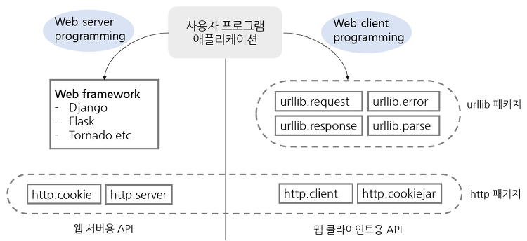

# Chapter 02



## [파이썬 3.x에서 표준 라이브러리의 모듈 구성 변경사항](https://www.tablesgenerator.com/latex_tables)

<style type="text/css">
.tg  {border-collapse:collapse;border-spacing:0;border-color:#999;}
.tg td{font-family:Arial, sans-serif;font-size:14px;padding:10px 5px;border-style:solid;border-width:0px;overflow:hidden;word-break:normal;border-color:#999;color:#444;background-color:#F7FDFA;}
.tg th{font-family:Arial, sans-serif;font-size:14px;font-weight:normal;padding:10px 5px;border-style:solid;border-width:0px;overflow:hidden;word-break:normal;border-color:#999;color:#fff;background-color:#26ADE4;}
.tg .tg-yw4l{vertical-align:top}
</style>
<table class="tg">
  <tr>
    <th class="tg-yw4l">파이썬3.x 모듈명</th>
    <th class="tg-yw4l">파이썬2.x 모듈명</th>
    <th class="tg-yw4l" colspan=2>파이썬3.x에서의 변화</th>
  </tr>
  <tr>
    <td class="tg-yw4l">urllib.parse</td>
    <td class="tg-yw4l">urlparse</td>
    <td class="tg-yw4l">urllib일부</td>
    <td class="tg-yw4l" rowspan=5>하나의 url패키지로 모아서 모듈을 기능별로 나눴고, 2.x urllib 모듈의 내용은 기능에 따라 여러 모듈로 흩어짐</td>
  </tr>
  <tr>
    <td class="tg-yw4l">urllib.request</td>
    <td class="tg-yw4l">urllib대부분</td>
    <td class="tg-yw4l">urllib일부</td>
  </tr>
  <tr>
    <td class="tg-yw4l">urllib.error</td>
    <td class="tg-yw4l">urllib2 에러부분</td>
    <td class="tg-yw4l">urllib일부</td>
  </tr>
    <tr>
    <td class="tg-yw4l">urllib.response</td>
    <td class="tg-yw4l"></td>
    <td class="tg-yw4l">urllib일부</td>
  </tr>
  <tr>
    <td class="tg-yw4l">urllib.robotparser</td>
    <td class="tg-yw4l">robotparser</td>
    <td class="tg-yw4l"></td>
  </tr>

  <tr>
    <td class="tg-yw4l">http.server</td>
    <td class="tg-yw4l">BaseHTTPServer</td>
    <td class="tg-yw4l"></td>
    <td class="tg-yw4l" rowspan=4>하나의 http패키지로 모아서 server와 client 모듈로 구분</td>
  </tr>
  <tr>
    <td class="tg-yw4l">http.server</td>
    <td class="tg-yw4l">CGIHTTPServer</td>
    <td class="tg-yw4l"></td>
  </tr>
  <tr>
    <td class="tg-yw4l">http.server</td>
    <td class="tg-yw4l">SimpleHTTPServer</td>
    <td class="tg-yw4l"></td>
  </tr>
    <tr>
    <td class="tg-yw4l">http.client</td>
    <td class="tg-yw4l">httplib</td>
    <td class="tg-yw4l"></td>
  </tr>
  <tr>
    <td class="tg-yw4l">http.cookies</td>
    <td class="tg-yw4l">Cookie</td>
    <td class="tg-yw4l"></td>
    <td class="tg-yw4l" rowspan=2>하나의 http 패키지로 모음</td>
  </tr>
  <tr>
    <td class="tg-yw4l">http.cookiejar</td>
    <td class="tg-yw4l">cookelib</td>
    <td class="tg-yw4l"></td>
  </tr>
  <tr>
    <td class="tg-yw4l">html.parser</td>
    <td class="tg-yw4l">HTMLParser</td>
    <td class="tg-yw4l"></td>
    <td class="tg-yw4l" rowspan=2>하나의 html 패키지로 모음</td>
  </tr>
    <tr>
    <td class="tg-yw4l">html.entities</td>
    <td class="tg-yw4l">htmlentitydefs</td>
    <td class="tg-yw4l"></td>
  </tr>
</table>

## urlparse --> urllib.parse

URL의 분해, 조립, 변경 등을 처리하는 함수

```python
#from urlparse import urlparse
#result = urlparse("http://www.python.org/guido/python.html;philosophy?overall=3#n10")
#result

from urllib.parse import urlparse
result = urlparse("http://www.python.org/guido/python.html;philosophy?overall=3#n10")
result
```

ParseResult(scheme='http', netloc='www.python.org', path='/guido/python.html', params='philosophy', query='overall=3', fragment='n10')

* scheme : URL에서 사용된 프로토콜
* netloc : 네트워크의 위치. user:password@host:port 형식으로 표현되며, HTTP 프로토콜인 경우는 host:port형식
* path : 파일이나 애플리케이션 경로를 의미
* params : 애플리케이션에 전달될 매개변수
* query : 질의문자열로 (\&)로 구분된 **키=값** 쌍 형식
* fragment : 문서내의 액커등 조각을 지정

urlsplit() ,urljoin() , parse_qs()
  <https://docs.python.org/3/library/urllib.parse.html>

## urllib2 --> urllib.request, urllib.error, urllib.response

주어진 URL에서 데이터를 가져오는 기본 기능을 제공

urlopen() GET방식

```python
#from urllib2 import urlopen
#html = urlopen("http://www.example.com")
#print html.read(500)

from urllib.request import urlopen
html = urlopen("http://www.example.com")
print(html.read(500))
```

urlopen() POST방식

```python
#from urllib2 import urlopen
#data = "query=python"
#html = urlopen("http://www.example.com",data)
#print html.read(500)

from urllib import request, parse
data = "query=python"
data = data.encode('ascii')
# Post Method is invoked if data != None
req =  request.Request("http://www.example.com", data=data) # this will make the method "POST"
# Response
resp = request.urlopen(req, data)
print( resp.read(500))
```

urlretrieve(), quote(), unquote(), urlencode()
  <https://docs.python.org/3/library/urllib.request.html#module-urllib.request>


## httplib --> http.client


