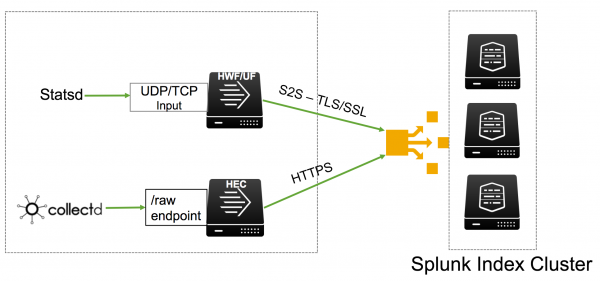

# Introduction to metrics

## Overview of metrics

Metrics is a feature for system administrators, IT, and service engineers that focuses on collecting, investigating, monitoring, and sharing metrics from your technology infrastructure, security systems, and business applications in real time.

Metrics는 기술 인프라, 보안 시스템 및 비즈니스 응용 프로그램에서 실시간으로 메트릭을 수집, 조사, 모니터링 및 공유하는 데 집중하는 시스템 관리자, IT 및 서비스 엔지니어를위한 기능

In the Splunk platform, you use metric indexes to store metrics data. This index type is optimized for the storage and retrieval of metric data.

Splunk 플랫폼에서는 메트릭 인덱스를 사용하여 메트릭 데이터를 저장. 이 인덱스 유형은 메트릭 데이터의 저장 및 검색에 최적화.

Metrics in the Splunk platform uses a custom index type that is optimized for metric storage and retrieval. You can run metrics-specific commands like mstats, mcatalog, and msearch on the metric data points in those metric indexes. For example, the mstats command lets you apply aggregate functions such as average, sum, count, and rate to those data points, helping you isolate and correlate problems from different data sources.

Splunk 플랫폼의 메트릭은 메트릭 스토리지 및 검색에 최적화 된 사용자 지정 인덱스 유형을 사용합니다. 해당 지표 인덱스의 지표 데이터 포인트에서 mstats, mcatalog 및 msearch와 같은 지표 별 명령을 실행할 수 있습니다. 예를 들어, mstats 명령을 사용하면 평균, 합계, 개수 및 비율과 같은 집계 함수를 해당 데이터 포인트에 적용 할 수 있으므로 여러 데이터 소스에서 발생하는 문제를 분리하고 연관시킬 수 있습니다.

>> As of release 8.0.0 of the Splunk platform, metrics indexing and search is case sensitive. This means, for example, that metrics search commands like mstats and msearch treat the following as three distinct metrics: cap.gear, CAP.GEAR, and Cap.Gear.
>> Splunk 플랫폼의 릴리스 8.0.0부터는 지표 색인 작성 및 검색이 대소 문자를 구분합니다. 예를 들어 mstats 및 msearch와 같은 메트릭 검색 명령은 다음을 세 가지 고유 메트릭 (cap.gear, CAP.GEAR 및 Cap.Gear)으로 취급합니다.

### What is a metric

A metric is a single measurement at a specific point in time. If you combine that measurement with a timestamp and one or more dimensions, you have a metric data point. A single metric data point can contain one timestamp but multiple measurements and multiple dimensions.

메트릭은 특정 시점의 단일 측정입니다. 해당 측정을 타임 스탬프 및 하나 이상의 차원과 결합하면 메트릭 데이터 포인트가 있습니다. 단일 메트릭 데이터 포인트는 하나의 타임 스탬프를 포함 할 수 있지만 여러 측정 및 여러 차원을 포함 할 수 있습니다.

#### timestamp

Indicates when the measurements in the data point were taken.

데이터 포인트의 측정 시점을 나타냅니다.

#### metric_name

A thing you are measuring. Uses a dotted hierarchy to refer to a namespace, such as spl.mlog.per_index_thruput.ev. You can use any string as a metric name. Metric names can include letters, numbers, underscores, dots, and other symbols (with the exception of the reserved term "metric_name"). Metric names use dots to separate their namespaces into segments. The dots enable the creation of metric hierarchies.

당신이 측정하는 것. spl.mlog.per_index_thruput.ev와 같은 네임 스페이스를 참조하기 위해 점선 계층을 사용합니다. 모든 문자열을 메트릭 이름으로 사용할 수 있습니다. 지표 이름에는 문자, 숫자, 밑줄, 점 및 기타 기호가 포함될 수 있습니다 ( "metric_name"예약어는 제외). 메트릭 이름은 점을 사용하여 네임 스페이스를 세그먼트로 분리합니다. 점을 사용하면 메트릭 계층을 만들 수 있습니다.

#### numeric_value

A number (integer or double float) representing the value of a metric at a given point of time, such as a count.
measurement
A field-value combination of a metric_name and a corresponding numeric_value. Measurements always follow this syntax: metric_name:<metric_name>=<numeric_value>. For example: metric_name:cpu.idle=15 or metric_name:io.util=10.232.

카운트와 같이 지정된 시점의 메트릭 값을 나타내는 숫자 (정수 또는 이중 부동 소수점)입니다.
측정
metric_name과 해당 numeric_value의 필드-값 조합입니다. 측정은 항상 metric_name:<metric_name>=<numeric_value> 구문을 따릅니다. 예를 들면 다음과 같습니다. metric_name : cpu.idle = 15 또는 metric_name : io.util = 10.232

#### dimensions

Metadata fields that provide additional information about the measurements. Dimensions provide categories that you can use to filter or group metric data points. For example:
Region: us-east-1, us-west-1, us-west-2, us-central1
InstanceType: t2.medium, t2.large, m3.large, n1-highcpu-2
Technology: nginx, redis, tomcat
All metric data points have the following three default dimensions: host, source, and sourcetype. The Splunk software adds these dimensions to the metric data point when it indexes them. Even when a metric data point does not have any other dimensions, it can still be filtered or grouped by these default dimensions.

측정에 대한 추가 정보를 제공하는 메타 데이터 필드 차원은 메트릭 데이터 요소를 필터링하거나 그룹화하는 데 사용할 수있는 범주를 제공합니다. 예를 들면 다음과 같습니다.
지역 : us-east-1, us-west-1, us-west-2, us-central1
인스턴스 유형 : t2.medium, t2.large, m3.large, n1-highcpu-2
기술 : nginx, redis, tomcat
모든 메트릭 데이터 포인트에는 호스트, 소스 및 소스 유형의 세 가지 기본 차원이 있습니다. Splunk 소프트웨어는 이러한 차원을 인덱스 할 때 메트릭 데이터 포인트에 이러한 차원을 추가합니다. 메트릭 데이터 포인트에 다른 차원이없는 경우에도 이러한 기본 차원을 기준으로 필터링하거나 그룹화 할 수 있습니다.

The following are examples of systems that generate metrics:
다음은 메트릭을 생성하는 시스템의 예입니다.

- IT infrastructure, such as hosts, networks, and devices
- System components, such as web servers and databases
- Application-specific metrics, such as timers that measure performance of a - function
- Software as a Service (SaaS) systems
- Sensors, such as Internet of Things (IoT) features

- 호스트, 네트워크 및 장치와 같은 IT 인프라
- 웹 서버 및 데이터베이스와 같은 시스템 구성 요소
- 기능의 성능을 측정하는 타이머와 같은 애플리케이션 별 메트릭
- SaaS (Software as a Service) 시스템
- 사물 인터넷 (IoT) 기능과 같은 센서

### What is a metric time series

A metric time series is a set of metric data points that measure the same things and have the same sets of dimensions. The following three metric data points form a metric time series. Note that each metric data point has measurements for the max.size.kb, current.size.kb, and current.size metrics and that they share the same dimension field-value combinations.

메트릭 시계열은 동일한 항목을 측정하고 동일한 차원 세트를 갖는 일련의 메트릭 데이터 포인트입니다. 다음 3 가지 메트릭 데이터 포인트는 메트릭 시계열을 형성합니다. 각 메트릭 데이터 포인트에는 max.size.kb, current.size.kb 및 current.size 메트릭에 대한 측정 값이 있으며 동일한 차원 필드-값 조합을 공유합니다.

<table>
<tr><td>_time</td><td>metric_name:max.size.kb</td><td>metric_name:current.size.kb</td><td>metric_name:current.size</td><td>group</td><td>name</td></tr>
<tr><td>08-05-2019 16:26:42.025 -0700</td><td>500</td><td>300</td><td>53</td><td>queue</td><td>azd</td></tr>
<tr><td>08-05-2019 16:26:41.055 -0700</td><td>345</td><td>245</td><td>43</td><td>queue</td><td>azd</td></tr>
<tr><td>08-05-2019 16:26:40.023 -0700</td><td>334</td><td>124</td><td>39</td><td>queue</td><td>azd</td></tr>
</table>

See Perform statistical calculations on metric time series for more information about metric time series and how you can use the _timeseries field in mstats searches.

미터법 시계열 및 mstats 검색에서 _timeseries 필드를 사용하는 방법에 대한 자세한 정보는 미터법 시계열에 대한 통계 계산 수행을 참조하십시오.

### What features does the Splunk platform provide for metrics data

The Splunk platform provides a fully-rounded metrics solution that runs from metrics data ingestion, indexing, and transformation on one end, to metrics search, analysis and reporting on the other.

Splunk 플랫폼은 한 쪽의 메트릭 데이터 수집, 인덱싱 및 변환에서 다른 쪽의 메트릭 검색, 분석 및보고에 이르기까지 완전한 메트릭스 솔루션을 제공합니다.

#### Getting metrics data in

The Splunk platform utilizes a metric collection framework of agents and APIs to collect and ingest high-volume metrics. It supports line metric protocols like collectd and StatsD. The universal forwarder and heavy forwarder can use this collection framework to ingest metric data and securely forward it to a standalone metric index or a metric index cluster. See Get metrics data in.

Splunk 플랫폼은 에이전트 및 API의 메트릭 수집 프레임 워크를 사용하여 대용량 메트릭을 수집하고 수집합니다. collectd 및 StatsD와 같은 라인 메트릭 프로토콜을 지원합니다. 유니버설 포워더 및 헤비 포워더는이 수집 프레임 워크를 사용하여 메트릭 데이터를 수집하고 독립형 메트릭 인덱스 또는 메트릭 인덱스 클러스터로 안전하게 전달할 수 있습니다. 메트릭 데이터 가져 오기를 참조하십시오.

#### Transforming event data into metric data at indexing time

The metric ingestion pipeline can transform your data at indexing time so that it conforms to the protocols of well-structured metrics. You can also use our log-to-metrics functionality to transform event data into metrics data as it is ingested and indexed. See Convert event logs to metric data points.

메트릭 수집 파이프 라인은 인덱싱시 데이터를 변환하여 잘 구성된 메트릭의 프로토콜을 준수 할 수 있습니다. 또한 Log-to-metrics 기능을 사용하여 이벤트 데이터가 수집 및 인덱싱 될 때 메트릭 데이터로 변환 할 수 있습니다. 이벤트 로그를 메트릭 데이터 포인트로 변환을 참조하십시오.

#### Converting event data into metric data at search time

The mcollect and meventcollect commands enable you to convert results of event data searches or streaming events into metric data points at search time. See the topics on the mcollect and meventcollect commands.

mcollect 및 meventcollect 명령을 사용하면 이벤트 데이터 검색 또는 스트리밍 이벤트의 결과를 검색시 메트릭 데이터 포인트로 변환 할 수 있습니다. mcollect 및 meventcollect 명령에 대한 주제를 참조하십시오.

#### Searching and reporting on metric data

The metrics-specific mstats, msearch, and mcatalog commands let you filter, aggregate and report on your metrics data. See Search and monitor metrics.

메트릭 관련 mstats, msearch 및 mcatalog 명령을 사용하면 메트릭 데이터를 필터링, 집계 및보고 할 수 있습니다. 메트릭 검색 및 모니터를 참조하십시오.

#### Visualizing and analyzing metric trends

The Analytics Workspace makes it easy to monitor and analyze trends in your metrics data without using the Splunk Search Processing Language(SPL). Use it to create interactive charts, visualize metric data correlations, and save your creations as charts or dashboards. see About the Analytics Workspace in the Analytics Workspace manual.

Analytics Workspace를 사용하면 Splunk SPL (검색 처리 언어)을 사용하지 않고도 메트릭 데이터의 추세를 쉽게 모니터링하고 분석 할 수 있습니다. 이를 사용하여 대화식 차트를 작성하고 메트릭 데이터 상관을 시각화하고 작성을 차트 또는 대시 보드로 저장하십시오. Analytics Workspace 매뉴얼의 Analytics Workspace 정보를 참조하십시오.

## Get started with metrics

The Splunk platform gathers metrics from different sources and stores this data into a new type of index that is optimized for ingestion and retrieval of metrics.

Splunk 플랫폼은 여러 소스에서 메트릭을 수집하고이 데이터를 메트릭 수집 및 검색에 최적화 된 새로운 유형의 인덱스에 저장합니다.

The Splunk platform supports the following metrics-gathering tools natively:

Splunk 플랫폼은 기본적으로 다음과 같은 메트릭 수집 도구를 지원합니다.

- The collectd agent, a Unix-based daemon, with the write_HTTP plugin. Collectd supports over 100 front-end plugins.
- The StatsD line protocol, which is used by a wide range of client libraries and other open source tools.

- write_HTTP 플러그인이있는 Unix 기반 데몬 인 [collected] 에이전트. 100 개가 넘는 프런트 엔드 플러그인을 지원합니다.
- [StatsD] 라인 프로토콜-광범위한 클라이언트 라이브러리 및 기타 오픈 소스 도구에서 사용됩니다.

Both of these tools are lightweight and easy to use, and they have a large community of support. If you want to start gathering performance metrics from your applications and systems, review these tools to determine whether either of them suits your environment.

이러한 도구는 모두 가볍고 사용하기 쉬우 며 대규모 지원 커뮤니티가 있습니다. 응용 프로그램 및 시스템에서 성능 메트릭 수집을 시작하려면 이러한 도구를 검토하여 둘 중 하나가 환경에 적합한 지 확인하십시오.

If you prefer to use a different metrics-gathering tool, you can still use the Splunk platform to collect and analyze your data with manual configuration.

다른 메트릭 수집 도구를 사용하려는 경우에도 Splunk 플랫폼을 사용하여 수동 구성으로 데이터를 수집하고 분석 할 수 있습니다.

### Metrics data format

Metrics data uses a specific format with the following fields.

<table>
<tr><td>Field</td><td>Required</td><td>Writable or Internal</td><td>Description</td><td>Example</td></tr>
<tr><td>_time</td><td>X</td><td>Writable</td><td>The timestamp of the metric in UNIX time notation.</td><td>2017-08-14 17:12:39.000</td></tr>
<tr><td>metric_name:&lt;metric_name&gt;</td><td>X</td><td>Writable</td><td>The metric name. It always has a numeric value. This is a 64-bit floating point number, which supports precision between 15 and 17 decimal digits.</td><td>metric_name:os.cpu.user=42.12345</td></tr>
<tr><td>&lt;dimension 0&gt; ...
&lt;dimension n&gt;</td><td>X</td><td>Writable</td><td>An arbitrary number of dimension fields that indicate how metrics can be split.</td><td>ip</td></tr>
<tr><td>_dims</td><td>X</td><td>Internal</td><td>An auto-generated internal field that contains the names of all of the dimensions in the metric event. The purpose of this field is to return a list of unique dimension names in a metrics index.</td><td>_dims::ip</td></tr>
<tr><td>source</td><td></td><td>Internal</td><td>The source of the metrics data.</td><td>udp:8125</td></tr>
<tr><td>host</td><td>X</td><td>Internal</td><td>The origin host. A standard field in Splunk software.</td><td>server007</td></tr>
<tr><td>index</td><td>X</td><td>Internal</td><td>The metrics index name. A standard field in Splunk software.</td><td>metricsindex</td></tr>
<tr><td>sourcetype</td><td>X</td><td>Internal</td><td>The data structure of the metric. A standard field in Splunk software.</td><td>statsd</td></tr>
</table>

### Supported line protocols

Metrics in the Splunk platform natively supports the following metric line protocols:

Splunk 플랫폼의 메트릭은 기본적으로 다음과 같은 메트릭 라인 프로토콜을 지원

- Plain StatsD over UDP/TCP
- The StatsD extension with dimensions over UDP/TCP
- Collectd over HTTPS using HTTP Event Collector (HEC)

- UDP/TCP를 통한 일반 [StatsD]
- UDP/TCP를 통한 크기의 [StatsD] 확장
- HTTP 이벤트 콜렉터 (HEC)를 사용하는 HTTPS를 통한 [Collectd]

For details about getting data in, see Get metrics in from StatsD and Get metrics in from collectd.

데이터 가져 오기에 대한 자세한 내용은 StatsD에서 메트릭 가져 오기 및 수집 된 메트릭 가져 오기를 참조하십시오.

To support other line metric protocols, you can use custom transformations to get metrics data into Splunk platform from other tools. For details, see Get metrics from other clients.

다른 회선 메트릭 프로토콜을 지원하기 위해 사용자 지정 변환을 사용하여 다른 도구에서 메트릭 데이터를 Splunk 플랫폼으로 가져올 수 있습니다. 자세한 내용은 다른 클라이언트에서 메트릭 가져 오기를 참조

### Metrics source types

The Splunk platform includes the following pre-trained source types to support the most widely-supported line metric protocols:

<table>

<tr><td>Source type name</td><td>Description</td></tr>
<tr><td>statsd</td><td>Supports data using the metric line protocols for plain StatsD and the StatsD extension with dimensions.</td></tr>
<tr><td>collectd_http</td><td>Supports data using the metric line protocol for collectd.</td></tr>
<tr><td>metrics_csv</td><td>Supports data in CSV format. For usage details, see Get metrics in from other sources.</td></tr>
</table>

### Metrics indexes

To store and analyze metrics data as efficiently as possible, metrics data is stored in a type of index just for metrics. A metrics index can be used only for metrics data. You cannot convert an events index to a metrics index, or vice versa.

메트릭 데이터를 가능한 한 효율적으로 저장하고 분석하기 위해 메트릭 데이터는 메트릭에 대한 인덱스 유형으로 저장됩니다. 메트릭 인덱스는 메트릭 데이터에만 사용할 수 있습니다. 이벤트 색인을 지표 색인으로 또는 그 반대로 변환 할 수 없습니다.

You can monitor internal Splunk metrics in the default _metrics index. It is a metrics analog of the _internal event index.

기본 _metrics 인덱스에서 내부 Splunk 메트릭을 모니터링 할 수 있습니다. _internal event index와 유사한 메트릭입니다.

To learn more, see Create metrics indexes in the Managing Indexers and Clusters of Indexers manual.

자세한 내용은 인덱서 및 인덱서 클러스터 관리 매뉴얼의 메트릭 인덱스 만들기를 참조하십시오.

For information about how metrics data is metered, see How Splunk Enterprise licensing works in the Admin Manual.

지표 데이터의 측정 방법에 대한 자세한 내용은 관리자 매뉴얼에서 Splunk Enterprise 라이센싱 작동 방식을 참조하십시오.

#### Default metrics indexes

You can assign default metrics indexes to user roles. See Add and edit roles with Splunk Web in Securing Splunk.

기본 메트릭 인덱스를 사용자 역할에 할당 할 수 있습니다. Splunk 보안에서 Splunk Web을 사용하여 역할 추가 및 편집을 참조하십시오.

When you run a search with metrics commands such as mcatalog or mstats and you do not filter the search by a specific index, the search automatically searches the default indexes assigned to your role. If you run a metrics search that does not filter by a specific metrics index and you have no default metrics indexes assigned to your role, the metrics search runs over an empty dataset.

mcatalog 또는 mstats와 같은 메트릭 명령을 사용하여 검색을 실행하고 특정 색인으로 검색을 필터링하지 않으면 검색에서 역할에 지정된 기본 색인을 자동으로 검색합니다. 특정 지표 색인으로 필터링하지 않는 지표 검색을 실행하고 역할에 할당 된 기본 지표 색인이없는 경우 지표 검색은 빈 데이터 세트에서 실행됩니다.

### Search and CLI commands with metrics

- To analyze metric data and enumerate items in a metrics index, use the mstats and mcatalog search commands.
- The msearch command enables you to view individual metric data points, without aggregation.
- The mcollect and meventcollect commands convert event log data into metric data points at search time.

-메트릭 데이터를 분석하고 메트릭 인덱스의 항목을 열거하려면 mstats 및 mcatalog 검색 명령을 사용하십시오.
-msearch 명령을 사용하면 집계하지 않고 개별 메트릭 데이터 포인트를 볼 수 있습니다.
-mcollect 및 meventcollect 명령은 검색시 이벤트 로그 데이터를 메트릭 데이터 포인트로 변환합니다.

Other search commands that work with events do not work with metrics. For example, the delete command does not work with metrics. For more about searching a metrics index, see Search and monitor metrics.

이벤트와 작동하는 다른 검색 명령은 메트릭과 작동하지 않습니다. 예를 들어, delete 명령은 메트릭에서 작동하지 않습니다. 지표 색인 검색에 대한 자세한 내용은 지표 검색 및 모니터링을 참조하십시오.

Administrative CLI commands may not all work with metrics. You can use commands such as add index and list index with metrics when using the -datatype metric parameter. See Create metrics indexes in the Managing Indexers and Clusters of Indexers manual.

관리 CLI 명령이 모두 메트릭과 작동하지 않을 수 있습니다. -datatype metric 매개 변수를 사용할 때 add index 및 list index와 같은 명령을 메트릭과 함께 사용할 수 있습니다. 인덱서 및 인덱서 클러스터 관리 매뉴얼의 메트릭 인덱스 만들기를 참조하십시오
