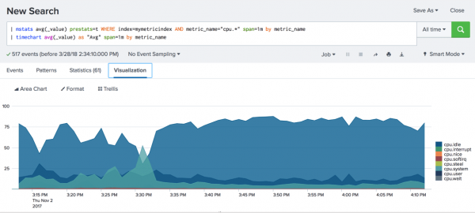
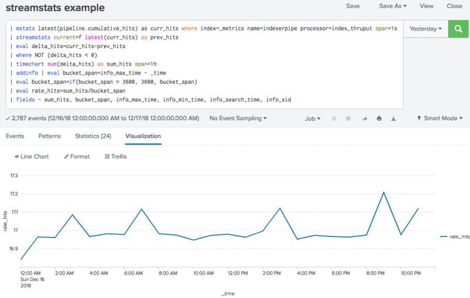
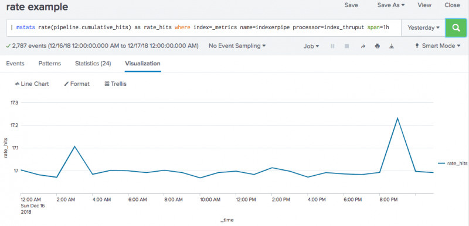

# Work with metrics

## Visualize metrics in the Analytics Workspace

Create interactive charts of your metrics data in the Analytics Workspace. You can monitor and analyze metrics without using Splunk Search Processing Language (SPL) in the Splunk Analytics Workspace.

Analytics Workspace functions and operations
Use the Analytics Workspace to perform the following analytic functions and operations on your metrics:

- Create charts to help you visualize correlations in your data.
- Aggregate data points into meaningful values.
- Shift the time range of a chart to compare metrics from an earlier time period.
- Split your metrics by a specified dimension.
- Filter metrics to include or exclude specific values.

You can also save workspace charts as alerts and dashboards in the Splunk platform.

The Analytics Workspace is included with Splunk Enterprise versions 7.3 and later. To access the Splunk Metrics Workspace:

1. Open the Search & Reporting app.
1. Click the Metrics tab on the Search & Reporting bar.

For more information about the Analytics Workspace, see About the Analytics Workspace in the Analytics Workspace manual.

## Search and monitor metrics

To analyze data in a metrics index, use mstats, which is a reporting command. Using mstats you can apply metric aggregations to isolate and correlate problems from different data sources. See mstats in the Search Reference manual.

To search on individual metric data points at smaller scale, free of mstats aggregation, use the msearch command. The msearch command is designed to be used as a tool for the onboarding and troubleshooting of metrics data and the exploration of metrics indexes. See msearch in the Search Reference manual.

>> Do not use msearch for large-scaled searches of metrics data. Such searches will be very slow to complete. Use mstats for large metrics searches instead.

To convert log events to metric data points at search time and write those metric data points to a metrics index, use the mcollect or meventcollect commands. See mcollect and meventcollect in the Search Reference manual.

To enumerate metric names, dimensions, and values, use mcatalog, which is an internal search command. See mcatalog in the Search Reference manual.

Other search commands do not work with a metrics index.

Note the following differences:

- You cannot use automatic lookups with metrics data. This is because automatic lookups are applied to individual events, whereas metrics are analyzed as an aggregate.
- You cannot perform search-time extractions.
- You can enrich metrics with the equivalent of custom indexed fields, which are treated as dimensions.
- You can use reserved fields such as "source", "sourcetype", or "host" as dimensions. However, when extracted dimension names are reserved names, the name is prefixed with "extracted_" to avoid name collision. For example, if a dimension name is "host", search for "extracted_host" to find it.
- Dimensions that start with underscore ( _ ) are not indexed, so they are not searchable.

>> As of release 8.0.0 of the Splunk platform, metrics indexing and search is case sensitive. This means, for example, that metrics search commands treat the following as three distinct metrics: cap.gear, CAP.GEAR, and Cap.Gear.

### Search examples

To list all metric names in all metrics indexes:

```sql
| mcatalog values(metric_name) WHERE index=*
```

To list all dimensions in all metrics indexes:

```sql
| mcatalog values(_dims) WHERE index=*
```

To list counts of metric names over 10-second intervals:

```sql
| mstats count where metric_name=* span=10s BY metric_name
```

To perform a simple count of a dimension:

```sql
| mstats count where index=mymetricsdata metric_name=aws.ec2.CPUUtilization
```

To calculate an average value of measurements for every 30-second interval:

```sql
| mstats avg(_value) WHERE index=mymetricdata AND metric_name=aws.ec2.CPUUtilization span=30s
```

You can also display results in a chart. The following example uses a wildcard search and group by:

```sql
| mstats avg(_value) prestats=t WHERE index=mymetricindex AND metric_name="cpu.*" span=1m by metric_name
| timechart avg(_value) as "Avg" span=1m by metric_name
```

This type of search can be used to stack different CPU metrics that add up to 100%.



This search shows an example of using an EVAL statement:

```sql
| mstats avg(_value) as "Avg" WHERE metric_name="memory.free.value" span=5s
| eval mem_gb = Avg / 1024 / 1024 / 1024
| timechart max("mem_gb") span=5s
```

### Use the REST API to list metrics data

You can also use the Metrics Catalog REST API endpoints to enumerate metrics data:

- Use the GET /services/catalog/metricstore/metrics endpoint to list metric names.
- Use the GET /services/catalog/metricstore/dimensions endpoint to list dimension names.
- Use the GET /services/catalog/metricstore/dimensions/{dimension-name}/values endpoint to list values for given dimensions.

You can also use filters with these endpoints to limit results by index, dimension, and dimension values.

See Metrics Catalog endpoint descriptions in the REST API Reference Manual.

## Perform statistical calculations on metric time series

A metric time series is a set of metric data points that all share a unique combination of a metric and a set of dimension field-value pairs.

For example, say you have a metric named miles.driven. This metric represents the odometer readings of various race cars. Metric data points for miles.driven include the following dimensions: vehicle_type, engine_type, vehicle_number, and driver_name.

The following table displays a set of metric data points ordered by _time. You can see that they break out into two distinct metric time series for the miles.driven metric.

|_time|metric_name:miles.driven|vehicle_type|engine_type|vehicle_number|driver_name|
|:--|:--:|:--:|:--:|:--:|:--:|
|01-05-2020 16:26:42.025 -0700|134.0643|Ferrari|F136|011|LanaR|
|01-05-2020 16:26:41.834 -0700|128.4515|Ferrari|F136|009|RavenM|
|01-05-2020 16:26:41.655 -0700|133.7509|Ferrari|F136|011|LanaR|
|01-05-2020 16:26:41.007 -0700|127.8861|Ferrari|F136|009|RavenM|
|01-05-2020 16:26:40.623 -0700|127.1277|Ferrari|F136|009|RavenM|
|01-05-2020 16:26:40.014 -0700|133.2482|Ferrari|F136|011|LanaR|

Both series in this metric data point sample have Ferrari as their vehicle type and F136 as their engine_type, but they have different vehicle_number and vehicle_driver values. The metric data points with vehicle_number=009 and driver_name=RavenM make up one distinct metric time series. The metric data points with vehicle_number=011 and driver_name=LanaR make up the other distinct metric time series.

As the different car_number and driver_name values indicate, the metric data points in this sample are from two different cars that are being driven at roughly the same time. If you want to get the average rate(X) for the miles.driven metric, it wouldn't make sense to calculate the average rate for all six of these metric data points. You would instead want to get the average rate split out by time series, so you are not mixing the cars together.

You can perform statistical calculations on the time series associated with a particular metric if you call out all of the dimensions related to the metric in the search. But this approach can be unwieldy, especially for metrics that involve a large number of dimensions.

```sql
| mstats avg(miles.driven) BY vehicle_type engine_type vehicle_number driver_name
```

The special _timeseries field replaces those potentially long dimension lists. Use it in conjunction with mstats to calculate statistics per time series. For example, this search would get the average miles.driven for both of the time series represented in the sample:

```sql
| mstats avg(miles.driven) BY _timeseries
```

###_timeseries is an internal field

_timeseries is an internal field and is hidden from the Splunk Web interface. If you want to display it in your results you need to implement a rename to display _timeseries as timeseries or time_series.

```sql
| mstats avg(miles.driven) BY _timeseries | rename _timeseries AS timeseries
```

### Combine _timeseries with additional group-by fields when its values will be processed by commands other than mstats

Because _timeseries is a JSON-formatted field, you might want to combine it with another group-by field when you need to process its values by an additional non-mstats command, such as stats. This method is best suited for situations where all of the results share the same time series (the same metric and the same dimension field-value pairs).

The following search uses mstats to calculate the rate for the time series related to the miles.driven metric. Then it uses stats to calculate the sum of each of those rates.

```sql
mstats rate(miles.driven) as driven BY vehicle_number, _timeseries | stats sum(rate(miles.driven)) BY vehicle_number
```

>> You can simplify this example search by using the rate_sum(X) function.

See Time functions in the Search Reference.

## Investigate counter metrics

Counter metrics are one of the most common metric types. A counter metric has a value that always increases when it changes, except when it is reset to zero on restart. In other words, it increases monotonically.

You use counter metrics to count things. Automobile odometers provide a simple example of a counter metric. Odometers indicate the number of miles that a car has been driven. Odometer values never go down, except when they are reset to zero.

Counter metrics tend to count events. For example, most networking metrics involve event counts, whether you are talking about website visits, network interface errors, packets sent or received, or disk operations.

### Periodic and accumulating counters

There are two types of counter metrics: periodic counters and accumulating counters. The following table describes these metric types, lists the metric protocols that they are associated with, and lists the key SPL that you use to query them.

<table>

<tr><td>Counter Metric Type</td><td>Description</td><td>Metric Line Protocols</td><td>SPL used to query</td></tr>
<tr><td>Periodic</td><td>The client resets the value of the counter to zero each time it sends a measurement to the server, meaning that each data point is independent.</td><td>StatsD, collectd ABSOLUTE, collectd DERIVE (storerates=true)</td><td>Use mstats, stats, or tstats with sum(x), or timechart with per_*(x).</td></tr>
<tr><td>Accumulating</td><td>The value of the counter is reset to zero only when the service is reset. Each new value is added to the last one. You can compare two measurements to get the rate of accumulation.</td><td>collectd COUNTER, collectd DERIVE (storerates=false)</td><td>If your Splunk platform version is 7.2.x or higher, use mstats with rate(x). If your Splunk platform version is 7.0.x or 7.1.x, use streamstats with latest(x) and eval.</td></tr>
</table>

### Sum up periodic counters

Because of the way that periodic counters are reset to zero each time the metrics client sends them to the Splunk platform, they are reported as a series of independent measurements. To see how these measurements work as a counter, you run a mstats, stats, or tstats search that aggregates them with the sum(x) function. Alternatively you could run a timechart search that aggregates them with one of the per_*(x) functions.

### Get the count rate for an accumulating counter

People who track accumulating counter metrics often find the count rate over time to be a more interesting measurement than the count over time. The count rate tells you when metric activity is speeding up or slowing down, and that can be significant information for some metrics.

The manner in which you determine counter rates depends mostly on the version of your Splunk platform implementation. If you are using 7.0.x or 7.1.x, you use streamstats in conjunction with latest(x) and eval to return the rate of an accumulating counter. If your Splunk platform implementation is version 7.2.x or higher, you use mstats with the rate(x) function to get the counter rate.

The two methods of getting the counter rate return slightly different results. This happens because they compare different sets of count values.

|Rate determination method|Count value difference used in rate calculation|Example|
|:--:|:--|:--|
|streamstats, the latest(x) function, and eval|Uses the difference between the count value of the latest event in the preceding timespan and the count value of the latest event in the current timespan|if your timespan is 1h, to get the rate for 2 P.M. you would get the latest event for the 1 P.M. - 2 P.M. timespan and compare it against the latest event for the 2 P.M. - 3 P.M. timespan.|
|mstats with the rate(x) function|Uses the difference between the count value of the earliest event in a timespan and the count value of the latest event in the same timespan.|If your timespan is 1h, to get the rate for 2 P.M. you would take the earliest event from the 1 P.M. - 2 P.M. timespan and compare it to the latest event in the 1 P.M. - 2 P.M. timespan.|

When constructing SPL for a counter rate search, make sure that you do not mix counter metrics. If you need to report on multiple counter metrics, use the BY clause to separate them. You should also set name=indexerpipe processor=index_thruput to keep the focus on one specific counter metric.

#### Use streamstats, latest(x), and eval to return counter rate

Use streamstats, the latest(x) function, and eval if your Splunk platform version is 7.0.x or 7.1.x, or if you have a scenario for which the rate(x) function is inappropriate. You might stick to streamstats if you can't count on having two metric data points per timespan, for example.

When you use this method, be sure to set current=f to force the search to use the latest value from the previous timespan.

Here is an example of a counter rate search that uses streamstats, latest(x), and eval for its calculations:

```sql
| mstats latest(pipeline.cumulative_hits) as curr_hits where index=_metrics
name=indexerpipe processor=index_thruput span=1s
| streamstats current=f latest(curr_hits) as prev_hits
| eval delta_hits=curr_hits-prev_hits
| where NOT (delta_hits < 0)
| timechart sum(delta_hits) as sum_hits span=1h
| addinfo | eval bucket_span=info_max_time - _time
| eval bucket_span=if(bucket_span > 3600, 3600, bucket_span)
| eval rate_hits=sum_hits/bucket_span
| fields - sum_hits, bucket_span, info_max_time, info_min_time, info_search_time, info_sid
```

And here is an example of the line chart returned by this search.



#### Walkthrough

Here is a step-by-step walkthrough of that example search.

1. Use a combination of mstats, streamstats, and eval to get the delta count on each second.

```sql
| mstats latest(pipeline.cumulative_hits) as curr_hits where index=_metrics name=indexerpipe processor=index_thruput span=1s 
| streamstats current=f latest(curr_hits) as prev_hits 
| eval delta_hits=curr_hits-prev_hits 
| where NOT (delta_hits < 0) 
```

Note that streamstats uses current=f. This forces the search to use the latest value from the previous timespan.

2. Calculate the sum of the delta counts for each hour.

```sql
| timechart sum(delta_hits) as sum_hits span=1h
```

3. Calculate the time span of the bucket. It should be 1h, unless it is the last bucket, in which case it can be less than 1h.

```sql
| addinfo | eval bucket_span=info_max_time - _time 
| eval bucket_span=if(bucket_span > 3600, 3600, bucket_span) 
```

4. Lastly, calculate the rate with the following function rate = delta_count/time_range.

```sql
| eval rate_hits=sum_hits/bucket_span 
| fields - sum_hits, bucket_span, info_max_time, info_min_time, info_search_time, info_sid
```

#### Use mstats with the rate(x) function to return counter rate

Use mstats in conjunction with the rate(x) function to determine counter rates if you are using Splunk platfom version 7.2.x or higher.

To get a proper rate measurement with mstats and rate(x) you need to have at least two counter events per time span in your search. The Splunk platform uses the difference between those two values to determine the actual rate. If you cannot guarantee that there will be two metric data points per timespan you might instead use the streamstats method.

The rate(x) functon uses the following calculation to derive its value:

(latest(<counter_field>) - earliest(<counter_field>)) / (latest_time(<counter_field>) - earliest_time(<counter_field>))

See Time functions in the Search Reference for more information about these functions.

Here is an example of a counter rate search that uses mstats and rate(x) to get counter rates.

```sql
| mstats rate(pipeline.cumulative_hits) as rate_hits where index=_metrics name=indexerpipe processor=index_thruput span=1h
```

And here is an example of the line chart returned by this search.



## Use histogram metrics

Histograms are complex metric datatypes. A histogram data point defines a set of differently-sized data buckets. Its metrics answer the following questions about the distribution of measurements—such as request durations or response sizes—across those buckets at a given point in time.

- How many measurements of a metric are less than or equal to the value that is the upper boundary of each data bucket? For example, at the given time, how many recorded request duration measurements fit into a bucket for request durations of 0.1 seconds or less? How many recorded request duration measurements fit into a bucket for request durations of 0.5 seconds or less? And so on.
- What is the sum of all of the measurements that have been recorded for the metric?
- What is the full count all of the measurements that have been recorded for the metric?

There are many things you can do with this information.

- For a metric such as a request duration, you can use the count of request duration measurements and the sum of the measurement values to get the average request duration for a given range of time.
- You can design alerts that monitor the measurement counts for specific buckets. For example, you could set up an alert that tells you if the number of requests served within 300ms drops below 95% of the total amount of requests.
- You can estimate percentile values, such as the request duration within which you have served 95% of requests.

### Histogram metrics before and after indexing

To use histogram metrics in the Splunk platform you need to ingest histogram-formatted metric data points from Prometheus or a similar metrics monitoring client using the HTTP Event Collector or DSP.

Histogram data point structures are made up of several individual metric data points. A raw histogram data point that deals with HTTP request durations in seconds should look something like this before your Splunk platform implementation ingests it:

```bash
http_req_dur_sec_bucket{le="0.05",server="ronnie",endpoint="/"} 24054 1568073334000
http_req_dur_sec_bucket{le="0.1",server="ronnie",endpoint="/"} 33444 1568073334000
http_req_dur_sec_bucket{le="0.2",server="ronnie",endpoint="/"} 100392 1568073334000
http_req_dur_sec_bucket{le="0.5",server="ronnie",endpoint="/"} 129389 1568073334000
http_req_dur_sec_bucket{le="1",server="ronnie",endpoint="/"} 133988 1568073334000
http_req_dur_sec_bucket{le="+Inf",server="ronnie",endpoint="/"} 144320 1568073334000
http_req_dur_sec_sum{server="ronnie",endpoint="/"} 53423 1568073334000
http_req_dur_sec_count{server="ronnie",endpoint="/"} 144320 1568073334000
```

Each line of the histogram data point has this format:

```xml
&lt;metric_name&gt;{<dim0>=<dim_value0>,<dim1>=<dim_value1>,...,<dimN>=<dim_valueN>} <_value> <timestamp>
```

After ingestion, the histogram data point looks like this:

<table>
<tr><td>metric_name:
http_req_dur_sec_bucket</td><td>metric_name:
http_req_dur_sec_sum</td><td>metric_name:
http_req_dur_sec_count</td><td>le</td><td>server</td><td>endpoint</td><td>timestamp (in seconds)</td></tr>
<tr><td>24054</td><td></td><td></td><td>0.05</td><td>ronnie</td><td>/</td><td>1568073334000</td></tr>
<tr><td>33444</td><td></td><td></td><td>0.1</td><td>ronnie</td><td>/</td><td>1568073334000</td></tr>
<tr><td>100392</td><td></td><td></td><td>0.2</td><td>ronnie</td><td>/</td><td>1568073334000</td></tr>
<tr><td>129389</td><td></td><td></td><td>0.5</td><td>ronnie</td><td>/</td><td>1568073334000</td></tr>
<tr><td>133988</td><td></td><td></td><td>1</td><td>ronnie</td><td>/</td><td>1568073334000</td></tr>
<tr><td>144320</td><td></td><td></td><td>+Inf</td><td>ronnie</td><td>/</td><td>1568073334000</td></tr>
<tr><td></td><td>53423</td><td></td><td></td><td>ronnie</td><td>/</td><td>1568073334000</td></tr>
<tr><td></td><td></td><td>144320</td><td></td><td>ronnie</td><td>/</td><td>1568073334000</td></tr>
</table>

Each individual metric in this table is a component of the overall histogram metric data point.

### Anatomy of a histogram metric data point

Each histogram data point is composed of three types of metrics. Each metric type says something about the measurements that have been recorded for a specific metric as of the timestamp of the histogram. Each of these metrics is also an example of an accumulating counter metric, which means their values do not decrease over time. For more information about counter metrics see Investigate counter metrics.

<table>
<tr><td>Metrics type</td><td>Definition</td><td>Example</td></tr>
<tr><td>&lt;metric_name&gt;_bucket</td><td>Provides the count of measurements for a histogram bucket. The value of this field corresponds to the value of the le dimension, which sets the upper boundary value of the bucket.</td><td>In our example metric data point, 24,054 http_req_dur_sec measurements were less than or equal to 0.05 seconds as of the timestamp of the histogram data point. Meanwhile, 33,444 http_req_dur_sec measurements were less than or equal to 0.1 seconds.</td></tr>
<tr><td>&lt;metric_name&gt;_sum</td><td>Provides the sum of all of the &lt;metric_name&gt;measurements captured in this histogram data point.</td><td>In our example metric data point, the sum of all of the http_req_dur_sec measurements included in this metric data point is 53,243 seconds.</td></tr>
<tr><td>&lt;metric_name&gt;_count</td><td>Provides the count of all of the measurements captured in this data point.</td><td>Our example histogram data point represents the distribution of 144,320 http_req_dur_sec measurements.</td></tr>
</table>

#### Bucket count metrics and the bucket boundary dimension

There are usually several bucket count metrics in a histogram data point. They form a sequence of simultaneous measurement counts for buckets with larger and larger bucket boundaries, which are defined by the le dimension. The first bucket count only represents measurements with relatively small values. The next bucket count represents the measurements from the first count plus measurements with slightly larger values.

This sequence continues until the final bucket count, which corresponds with a le dimension value of +Inf. +Inf is shorthand for "Infinite." This means that the final bucket captures all of the measurements that were captured by the preceding bucket and any measurements that exceed the preceding bucket. The count for the +Inf &lt;metric_name&gt;_bucket should be equivalent to the value of the &lt;metric_name&gt;_count field. Both fields provide a count of all of the measurements categorized by the histogram data point as of the histogram's timestamp.

There are no le values for the &lt;metric_name&gt;_sum and &lt;metric_name&gt;_sum fields by design.

>> The Prometheus client requires that the bucket-boundary dimension be named le—the field name is an acronym for "less than or equal to"—but the Splunk software is flexible and can use a different name if le does not fit your needs.

### Use histogram metrics in searches

Because histogram metric data points contain interconnected sets of counter metrics, you use the rate(x) function in conjunction with mstats to expose the bucket distribution for a given time span.

The _timeseries field is also essential. It lets you group by various dimension fields in commands that follow your rate(x) calculation. This enables you to carry out calculations similar to those that the Prometheus client allows, where every stats-like operation implicitly does something like by _timeseries when there is no explicit by clause. See Perform statistical calculations on metric time series.

#### Count and sum of measurements

Each histogram data point has a count of all of the measurements that have been recorded as of the histogram timestamp and a sum of the values of all of those measurements. You can use this information to calculate the average measurement during a given period of time. In the following example we use it to calculate the average request duration during the last five minutes.

```sql
| mstats rate(http_req_dur_sec_sum) as sum_req_duration where index="metrics"
AND earliest="-5m" by _timeseries
| appendcols [
| mstats rate(http_req_dur_secs_count) as num_req where index="metrics"
AND earliest="-5m" by _timeseries
]
| eval avg_req_duration=sum_req_duration / num_req
| fields avg_req_duration
```

#### Alert on poor service rates

You can use histogram metrics to design an alert that is triggered when your http request service rate dips below a certain threshold. For example, say you have a service level agreement to serve 95% of http requests within 300ms. You can configure a histogram that has a bucket with an upper boundary of 0.3 seconds. The following search calculates the relative amount of requests served within 300ms by job within the last 5 minutes. You can use this search in the definition of an alert that triggers when the percent_requests_served for a job is less than 95.

```sql
| mstats rate(http_req_dur_sec_bucket) as bkt_req_per_sec where index="metrics"
AND le=0.3 AND earliest="-5m" by _timeseries, job
| stats sum(bkt_req_per_sec) as sum_bkt_req_per_sec by job
| appendcols [
| mstats rate(http_req_dur_sec_count) as req_per_sec where index="metrics"
AND earliest="-5m" by _timeseries, job
| stats sum(req_per_sec) as sum_req_per_sec by job
]
| eval percent_requests_served=sum_bkt_req_per_sec / sum_req_per_sec
| fields job, percent_requests_served
```

#### Approximate Apdex scores

An Apdex score provides a numerical measure of user satisfaction with the performance of an application by calculating the ratio of satisfactory performance measurements to unsatisfactory performance measurements. You can use histogram metrics to approximate an Apdex score.

Let's say you want to do this for your http_req_dur_sec histogram. Start by configuring a bucket with the target request duration as its upper bound. Then configure another bucket to have the tolerated request duration—usually 4 times the target request duration—as the upper bound. For example, if the target request duration is 300 milliseconds, the tolerable request duration is 1.2 seconds.

The following expression yields the Apdex score for each job over the last 5 minutes:

```sql
| mstats rate(http_req_dur_sec_bucket) as bkt_req_per_sec_0.3 where index="metrics"
AND le=0.3 AND earliest="-5m" by _timeseries, job
| stats sum(bkt_req_per_sec_0.3) as sum_bkt_req_per_sec_0.3 by job
| appendcols [
| mstats rate(http_req_dur_sec_bucket) as bkt_req_per_sec_1.2 where index="metrics"
AND le=1.2 AND earliest="-5m" by _timeseries, job
| stats sum(bkt_req_per_sec_1.2) as sum_bkt_req_per_sec_1.2 by job
]
| appendcols [
| mstats rate(http_req_dur_sec_count) as req_per_sec where index="metrics"
AND earliest="-5m" by _timeseries, job
| stats sum(req_per_sec) as sum_req_per_sec by job
]
| eval apdex_score=(sum_bkt_req_per_sec_0.3 + sum_bkt_req_per_sec_1.2) / 2 / sum_req_per_sec
| fields job, apdex_score
```

This search divides the sum of both buckets because the the histogram buckets are cumulative. The le=0.3 bucket is contained in the le=1.2 bucket. Dividing it by 2 corrects for that.

>> The calculation does not exactly match the traditional Apdex score, as it includes errors in the satisfied and tolerable parts of the calculation.

### Calculate percentile values with the histperc macro

The histperc macro enables you to calculate percentile values for your histogram metrics. This macro accounts for the bucket boundaries and the rate of increase of their counters, and estimates the value associated with the specified percentile based on some linear interpolation between histogram boundaries.

Say you have a histogram macro named http_req_dur_sec that provides the distribution of HTTP request duration measurements in terms of seconds. You could use the histperc macro to calculate the request duration within which you have served 95% of requests—otherwise known as the P95 value for your request service.

To do this you would set up a histperc macro. The histperc maco takes four arguments, the last of which is optional.

```js
histperc(<perc>, <rate_field>, <bucket_upper_boundary_dimension> [, <groupby-fields>])
```

|Argument|Description|Required?|
|:--|:--|:--:|
|perc|The desired percentile value. Must be between 0.0 and 1.0.|Yes|
|rate_field|The name of the field containing the output of the mstats rate(x) command. The histogram macro uses this output to generate the histogram distribution for some time period.|Yes|
|bucket_upper_boundary_dimension|The name of the dimension that represents the inclusive upper boundary of the buckets in the histogram data structure. Prometheus metrics use le, which stands for "less than or equal to".|Yes|
|groupby-fields|One or more dimensions to group by during the percentile calculation. Lists of fields must be quoted and comma-separated.|No|

>> The three-argument version of histperc is listed on the Search Macros page in Settings as histperc(3). The four-argument version with the groupby-field argument is listed on the Search Macros page in Settings as histperc(4).

#### Histperc macro example

This search calculates the HTTP request duration within which you have served 99% of requests. It groups the results by _time for charting purposes.

```sql
| mstats rate(http_req_dur_sec_bucket) as requests_per_sec where index="metrics" by _timeseries, le span=5m
| stats sum(requests_per_sec) as total_requests_per_sec by _time, le
| `histperc(0.99, total_requests_per_sec, le, _time)`
```

### About these examples

These examples are based on examples that Prometheus—an open-source metrics monitoring and alerting system—uses to illustrate their support for the histogram metric type.

## Metrics indexing performance

This topic summarizes the results of metrics indexing performance.

### Size on disk

When ingesting typical metrics payloads with supported metrics source types (collectd_http, statsd, metrics_csv), a metrics index requires about 50% less disk storage space compared to storing the same payload in an events index.

### Throughput

Consider the following when deciding whether to scale horizontally by adding additional indexers.
Using the collectd_http source type with an HTTP Event Collector (HEC) input, testing reached a constant of around 55,000 events per second maximum ingestion throughput, and around 58,000 events per second without additional search load.

- The default batch size was 5,000 events per batch. A significant difference in ingestion performance was not observed between batch sizes of 100 to 5,000 events.
- The keep-alive setting was enabled for these tests.
- A typical event size was about 214 bytes.

Using the statsd source type with a UDP input, throughput was highly variable depending on other network activity. For UDP inputs we recommend using a universal forwarder as close as possible to where metrics are collected.

### Speed

Consider the results from the following test for running metrics queries. This test used metrics from 1,000 hosts, with a total event count of 6 billion events in the metrics index, where queries were representative and did not use wildcards in metric_name.

|Time range|Events|Query speed|
|:--:|:--:|:--:|
|1 hour|35 million|< 0.1s|
|1 day|850 million|~3-5s|
|1 week|6 billion|~20-22s|

See the Capacity Planning Manual.

## Best practices for metrics

The following are best practices when working with metrics in the Splunk platform:

### Cardinality issues

Metrics search performance decreases as the cardinality of the metric time series stored in a given index and bucket increases. In other words, as the number of unique dimension sets in your metrics data increases, the speed of your metrics searches decreases. The following strategies can help you reduce the time series cardinality in your metrics indexes and buckets.

- Remove unnecessary dimensions from your data. Focus on removing dimensions that have a wide range of unique values, like user IDs or phone numbers.
- Use larger bucket sizes. This can help you reduce the overhead per metrics data point. For example, you might try sizing your buckets to 10GB.
- Split your metrics data across multiple indexes. When you do this, partition the indexes by relative search domains. Keep data that tends to be searched frequently together in the same index. For example, you may want to keep your IT Infrastructure metrics data in one index, and your Sales/Marketing metrics in another index, if those two data sets are rarely searched together.

High result row cardinality also slows down search performance. You can try to mitigate this by increasing the time bucket span to reduce the number of rows returned. You can also reduce the overall time range of your search.

### StatsD Format with dimensions extension

If you are indexing data that is in StatsD format, use the StatsD format with the dimensions extension for better performance: cpu.idle:0.5|g|#host:some-hostsplunk.com,app:some-app

Use it instead of the plain StatsD format that combines dimensions with the metric name: cpu.idle.some-hostsplunk.com.some-app

### Other best practices

- The _value field of a metric should be of type "Double", not type "String", to avoid causing indexing inefficiencies.
- For a faster response time for REST calls to the Metrics Catalog endpoint, use constrained time windows when applicable. By default, only the last 24 hours of data is searched. See Metrics Catalog endpoint descriptions in the REST API Reference Manual.
- Make sure dimension names do not start with an underscore ( _ ). Such dimensions will not be indexed.
