# SplunkJS Stack for apps outside Splunk Web

These JavaScript examples show how to use SplunkJS Stack in an app outside of Splunk Web.

<table>
<tr><td>Code example</td><td>Description</td><td>Dashboard</td><td>Dashboard Page</td></tr>
<tr><td>Login form</td><td>A login form that shows how to log in to Splunk and get a session key using the Splunk SDK for JavaScript.</td><td></td><td></td></tr>
<tr><td>Basic page</td><td>A basic page with a chart and an events viewer displaying results from a search.</td><td></td><td></td></tr>
<tr><td>Basic page with a layout</td><td>The same basic page as above, but with a Splunk Dashboard (dashboard.css) layout.</td><td></td><td></td></tr>
<tr><td>A collection of views on one page</td><td>Displays the most common views on one page. Shows how to sync search controls to a search manager and how to populate form controls with static choices and search-based choices.</td><td></td><td></td></tr>
<tr><td>Charts</td><td>Shows examples of each of the possible chart types.</td><td></td><td></td></tr>
<tr><td>Tables with custom renderers</td><td>Shows how to display a table that includes a sparkline in the search results, a custom cell renderer, and a custom row renderer.</td><td></td><td></td></tr>
<tr><td>Events viewers</td><td>Shows examples of each of the possible types of events viewer.</td><td></td><td></td></tr>
<tr><td>Maps</td><td>Shows the same data displayed on a Splunk map and a Google map.</td><td></td><td></td></tr>
<tr><td>Drilldown properties</td><td>Shows the result of setting different combinations of drilldown properties for the views that allow drilldown actions.</td><td></td><td></td></tr>
<tr><td>Search controls using tokens</td><td>Shows how to use tokens to sync search controls to a search manager.</td><td></td><td></td></tr>
<tr><td>Search controls using events</td><td>Shows how to use change events to sync search controls to a search manager.</td><td></td><td></td></tr>
<tr><td>Search progress events</td><td>Shows how to retrieve the progress of a search, including the status of the search and the properties of the search job.</td><td></td><td></td></tr>
<tr><td>Search results model</td><td>Shows how to retrieve the different types of search results from the results model: events, preview, results, and summary.</td><td></td><td></td></tr>
</table>

## Example: Login form for apps outside Splunk Web

This example shows how to log in to the Splunk server using the Splunk SDK for JavaScript, which is included with SplunkJS Stack. To use this code, save it as login_form.html in your own web site's directory, assuming you have added the SplunkJS Stack libraries and the Splunk server is running on port 8089. For more, see Authenticate users for apps outside of Splunk Web and Use SplunkJS Stack in your own web apps.

```html
<!DOCTYPE html>
<html lang="en">
<head>
    <meta charset="utf-8">
    <meta http-equiv="X-UA-Compatible" content="IE=edge,chrome=1">
    <title>Login Tests</title>
    <meta name="viewport" content="width=device-width, initial-scale=1.0">

    <link rel="stylesheet" type="text/css" href="static/splunkjs/css/bootstrap.css"/>
    <style type="text/css">
        .fail{
            color: red;
        }
        .main-area {
            padding: 30px;
        }
    </style>
</head>

<body>
    <div class="main-area">
        <h2>Login Form</h2>
        <p>This page tests login and authentication. When you enter a name and password, these credentials are used to log in to Splunk.</p>
        <p>If login is successful, a session key is returned and stored in a cookie, along with the username.</p>
        <br>
        <p><b>Username:</b></p>
        <input id="usernamebox" type="text" value="admin">
        <p><b>Password:</b></p>
        <input id="pwbox" type="password" value="yourpassword">
        <br>
        <button class="btn" onclick="onLogin()">Log in</button>
        <br>
        <div id="errorText"></div>
    </div>

    <script src="static/splunkjs/config.js"></script>

    <script>
        require.config({
            baseUrl: "static/"
        });

        function onLogin() {
            require([
                "jquery",
                "splunkjs/splunk",
            ], function($, jssdk) {
                // Get the username and passwords
                var username = $("#usernamebox").val();
                var password = $("#pwbox").val();

                // Use the Splunk SDK for JavaScript to log in to Splunk

                // Create a Service object
                var http =  new jssdk.ProxyHttp("/proxy");
                var service = new jssdk.Service(http, {
                    username: username,
                    password: password,
                    scheme: "https",
                    host: "localhost",
                    port: 8089
                });
                // Log in to Splunk
                service.login(function(err) {
                    // The session key and username are required for logging in
                    if (!err) {
                        var key = service.sessionKey;
                        // Save the session key and username in cookies
                        $.cookie("splunk_sessionkey", key);
                        $.cookie("splunk_username", username);
                    }
                    else {
                        $("#errorText").empty().append("<p class='fail'><br>Login failed! See the console for error info.</p>");
                        console.error("Login failed: ", err);
                    }
                });
            });
        }
    </script>
</body>
</html>
```

## Example: Basic page using JavaScript for apps outside Splunk Web

This example shows how to use JavaScript to create a basic page with a chart and an events viewer that displays results from a search.

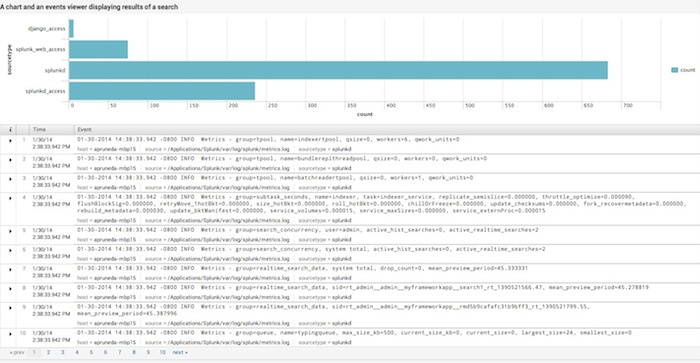

```html
<!DOCTYPE html>
<html lang="en">
<head>
    <meta charset="utf-8">
    <meta http-equiv="X-UA-Compatible" content="IE=edge,chrome=1">
    <title>Basic Page</title>
    <link rel="stylesheet" type="text/css" href="static/splunkjs/css/bootstrap.css" />
</head>
<body>
    <h4>A chart and an events viewer displaying results of a search</h4>
    <div id="mychart"></div>
    <div id="myeventsviewer"></div>

    <script src="static/splunkjs/config.js"></script>
    <script>
        // Configure SplunkJS Stack
        splunkjs.config({
            proxyPath: "/proxy",
            scheme: "https",
            host: "localhost",
            port: 8089,
            authenticate: function (done) {
                require([
                    "jquery",
                    "jquery.cookie"
                ], function ($) {
                    // Retrieve the session key and username from cookies
                    var splunkSessionKey = $.cookie("splunk_sessionkey");
                    var splunkCurrentUser = $.cookie("splunk_username");

                    // Log in using the session key and username
                    if (splunkSessionKey) {
                        done(null, {
                            sessionKey: splunkSessionKey,
                            username: splunkCurrentUser
                        });
                    }
                    // If there is no session key, redirect to the login form
                    else {
                        window.location.replace("login_form.html");
                    }
                });
            }
        });

        // Configure the web site's base URL
        require.config({
            baseUrl: "static/"
        });

        // Set up the Web Framework components
        var deps = [
            "splunkjs/ready!",
            "splunkjs/mvc/searchmanager",
            "splunkjs/mvc/chartview",
            "splunkjs/mvc/eventsviewerview"
        ];
        require(deps, function (mvc) {
            // Load individual components
            var SearchManager = require("splunkjs/mvc/searchmanager");
            var ChartView = require("splunkjs/mvc/chartview");
            var EventsViewerView = require("splunkjs/mvc/eventsviewerview");

            // Instantiate the views and search manager
            var mysearch = new SearchManager({
                id: "search1",
                preview: true,
                cache: true,
                status_buckets: 300,
                search: "index=_internal | head 1000 | stats count by sourcetype"
            });

            var mychart = new ChartView({
                id: "chart1",
                managerid: "search1",
                type: "bar",
                el: $("#mychart")
            }).render();

            var myeventsviewer = new EventsViewerView({
                id: "eviewer1",
                managerid: "search1",
                el: $("#myeventsviewer")
            }).render();
        });
    </script>
</body>
</html>
```

## Example: Basic page with a layout using JavaScript for apps outside Splunk Web

This example shows how to use JavaScript to create a basic page with a chart and an events viewer that displays results from a search. This example also uses a Splunk Dashboard (dashboard.css) layout.

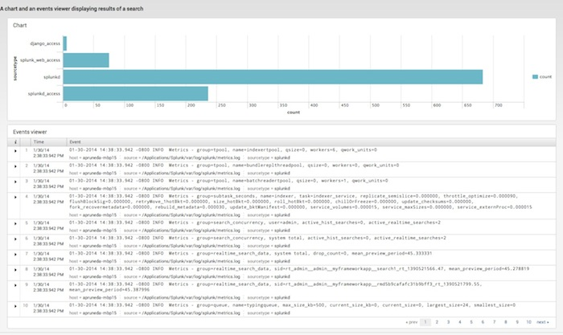

```html
<!DOCTYPE html>
<html lang="en">
<head>
    <meta charset="utf-8">
    <meta http-equiv="X-UA-Compatible" content="IE=edge,chrome=1">
    <title>Basic Page with a Layout</title>

    <link rel="stylesheet" type="text/css" href="static/splunkjs/css/bootstrap.css" />
    <link rel="stylesheet" type="text/css" href="static/splunkjs/css/dashboard.css" />
</head>

<body>
    <!-- This layout uses dashboard.css styles -->
    <div class="dashboard-body container-fluid main-section-body">
        <div class="row">
            <div class="dashboard-header clearfix">
                <h4>A chart and an events viewer displaying results of a search</h4>
            </div>
        </div>

        <!-- Row for the chart -->
        <div class="dashboard-row">
            <div class="dashboard-cell" style="width: 100%;">
                <div class="dashboard-panel">
                    <div class="dashboard-element">
                        <div class="panel-head">
                            <h3>Chart</h3>
                        </div>
                        <div class="panel-body">
                            <div id="mychart"></div>
                        </div>
                    </div>
                </div>
            </div>
        </div>

        <!-- Row for the events viewer -->
        <div class="dashboard-row">
            <div class="dashboard-cell" style="width: 100%;">
                <div class="dashboard-panel">
                    <div class="dashboard-element">
                        <div class="panel-head">
                            <h3>Events viewer</h3>
                        </div>
                        <div class="panel-body">
                            <div id="myeventsviewer"></div>
                        </div>
                    </div>
                </div>
            </div>
        </div>
    </div>

    <script src="static/splunkjs/config.js"></script>

    <script>
        // Configure SplunkJS Stack
        splunkjs.config({
            proxyPath: "/proxy",
            scheme: "https",
            host: "localhost",
            port: 8089,
            authenticate: function(done) {
                require([
                    "jquery",
                    "jquery.cookie"
                ], function($) {
                    // Retrieve the session key and username from cookies
                    var splunkSessionKey = $.cookie("splunk_sessionkey");
                    var splunkCurrentUser = $.cookie("splunk_username");

                    // Log in using the session key and username
                    if (splunkSessionKey) {
                        done(null, {sessionKey: splunkSessionKey, username: splunkCurrentUser});
                    }
                    // If there is no session key, redirect to the login form
                    else {
                        window.location.replace("login_form.html");
                    }
                });
            }
        });
        // Configure the web site's base URL
        require.config({
            baseUrl: "static/"
        });

        // Set up the Web Framework components
        var deps = [
            "splunkjs/ready!",
            "splunkjs/mvc/searchmanager",
            "splunkjs/mvc/chartview",
            "splunkjs/mvc/eventsviewerview"
        ];
        require(deps, function(mvc) {
            // Load individual components
            var SearchManager = require("splunkjs/mvc/searchmanager");
            var ChartView = require("splunkjs/mvc/chartview");
            var EventsViewerView = require("splunkjs/mvc/eventsviewerview");

            // Instantiate the search manager and views
            var mysearch = new SearchManager({
                id: "search1",
                preview: true,
                cache: true,
                status_buckets: 300,
                search: "index=_internal | head 1000 | stats count by sourcetype"
            });

            var mychart = new ChartView ({
                id: "chart1",
                managerid: "search1",
                type: "bar",
                el: $("#mychart")
            }).render();

            var myeventsviewer = new EventsViewerView ({
                id: "eviewer1",
                managerid: "search1",
                el: $("#myeventsviewer")
            }).render();

        });
    </script>
</body>
</html>
```

## Example: A collection of views using JavaScript for apps outside Splunk Web

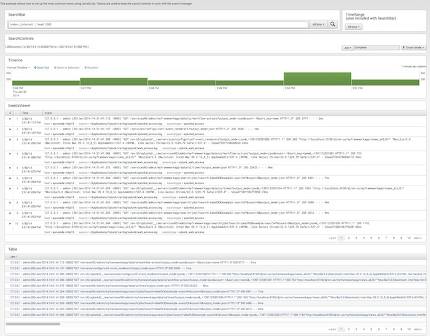

```html
<!DOCTYPE html>
<html lang="en">
<head>
    <meta charset="utf-8">
    <meta http-equiv="X-UA-Compatible" content="IE=edge,chrome=1">
    <title>A Collection of Views</title>

    <link rel="stylesheet" type="text/css" href="static/splunkjs/css/bootstrap.css" />
    <link rel="stylesheet" type="text/css" href="static/splunkjs/css/dashboard.css" />
</head>

<body>
    <div class="dashboard-body container-fluid main-section-body">
        <div class="row">
            <div class="dashboard-header clearfix">
                <p>This example shows how to set up the most common views using JavaScript on one page. Tokens are used to keep the search controls in sync with the search manager.</p>
            </div>
        </div>

        <!-- Row -->
        <div class="dashboard-row">
            <div class="dashboard-cell" style="width: 80%;">
                <div class="dashboard-panel">
                    <div class="dashboard-element">
                        <div class="panel-head">
                            <h3>SearchBar</h3>
                        </div>
                        <div class="panel-body">
                            <div id="mysearchbar"></div>
                        </div>
                    </div>
                </div>
            </div>
            <div class="dashboard-cell" style="width: 20%;">
                <div class="dashboard-panel">
                    <div class="dashboard-element">
                        <div class="panel-head">
                            <h3>TimeRange<br>(also included with SearchBar)</h3>
                        </div>
                        <div class="panel-body">
                            <div id="mytimerange"></div>
                        </div>
                    </div>
                </div>
            </div>
        </div>

        <!-- Row -->
        <div class="dashboard-row">
            <div class="dashboard-cell" style="width: 100%;">
                <div class="dashboard-panel">
                    <div class="dashboard-element">
                        <div class="panel-head">
                            <h3>SearchControls</h3>
                        </div>
                        <div class="panel-body">
                            <div id="mysearchcontrols"></div>
                        </div>
                    </div>
                </div>
            </div>
        </div>


        <!-- Row -->
        <div class="dashboard-row">
            <div class="dashboard-cell" style="width: 100%;">
                <div class="dashboard-panel">
                    <div class="dashboard-element">
                        <div class="panel-head">
                            <h3>Timeline</h3>
                        </div>
                        <div class="panel-body">
                            <div id="mytimeline"></div>
                        </div>
                    </div>
                </div>
            </div>
        </div>

        <!-- Row -->
        <div class="dashboard-row">
            <div class="dashboard-cell" style="width: 100%;">
                <div class="dashboard-panel">
                    <div class="dashboard-element">
                        <div class="panel-head">
                            <h3>EventsViewer</h3>
                        </div>
                        <div class="panel-body">
                            <div id="myeventsviewer"></div>
                        </div>
                    </div>
                </div>
            </div>
        </div>

        <!-- Row -->
        <div class="dashboard-row">
            <div class="dashboard-cell" style="width: 100%;">
                <div class="dashboard-panel">
                    <div class="dashboard-element">
                        <div class="panel-head">
                            <h3>Table</h3>
                        </div>
                        <div class="panel-body">
                            <div id="mytable"></div>
                        </div>
                    </div>
                </div>
            </div>
        </div>

        <!-- Row -->
        <div class="dashboard-row">
            <div class="dashboard-cell" style="width: 100%;">
                <div class="dashboard-panel">
                    <div class="dashboard-element">
                        <div class="panel-head">
                            <h3>Chart</h3>
                        </div>
                        <div class="panel-body">
                            <div id="mychart"></div>
                        </div>
                    </div>
                </div>
            </div>
        </div>

        <!-- Row -->
        <div class="dashboard-row">
            <div class="dashboard-cell" style="width: 33%;">
                <div class="dashboard-panel">
                    <div class="dashboard-element">
                        <div class="panel-head">
                            <h3>Single</h3>
                        </div>
                        <div class="panel-body">
                            <div id="mysingle"></div>
                        </div>
                    </div>
                </div>
            </div>
            <div class="dashboard-cell" style="width: 34%;">
                <div class="dashboard-panel">
                    <div class="dashboard-element">
                        <div class="panel-head">
                            <h3>TextInput</h3>
                        </div>
                        <div class="panel-body">
                            <div id="mytextinput"></div>
                        </div>
                    </div>
                </div>
            </div>
            <div class="dashboard-cell" style="width: 33%;">
                <div class="dashboard-panel">
                    <div class="dashboard-element">
                        <div class="panel-head">
                            <h3>Checkbox</h3>
                        </div>
                        <div class="panel-body">
                            <p>Check me:</p>
                            <div id="mycheckbox"></div>
                        </div>
                    </div>
                </div>
            </div>
        </div>

        <!-- Row -->
        <div class="dashboard-row">
            <div class="dashboard-cell" style="width: 50%;">
                <div class="dashboard-panel">
                    <div class="dashboard-element">
                        <div class="panel-head">
                            <h3>CheckboxGroup (static choices)</h3>
                        </div>
                        <div class="panel-body">
                            <div id="mycheckboxgroup1"></div>
                        </div>
                    </div>
                </div>
            </div>
            <div class="dashboard-cell" style="width: 50%;">
                <div class="dashboard-panel">
                    <div class="dashboard-element">
                        <div class="panel-head">
                            <h3>CheckboxGroup (search-based choices)</h3>
                        </div>
                        <div class="panel-body">
                            <div id="mycheckboxgroup2"></div>
                        </div>
                    </div>
                </div>
            </div>
        </div>

        <!-- Row -->
        <div class="dashboard-row">
            <div class="dashboard-cell" style="width: 50%;">
                <div class="dashboard-panel">
                    <div class="dashboard-element">
                        <div class="panel-head">
                            <h3>RadioGroup (static choices)</h3>
                        </div>
                        <div class="panel-body">
                            <div id="myradiogroup1"></div>
                        </div>
                    </div>
                </div>
            </div>
            <div class="dashboard-cell" style="width: 50%;">
                <div class="dashboard-panel">
                    <div class="dashboard-element">
                        <div class="panel-head">
                            <h3>RadioGroup (search-based choices)</h3>
                        </div>
                        <div class="panel-body">
                            <div id="myradiogroup2"></div>
                        </div>
                    </div>
                </div>
            </div>
        </div>

        <!-- Row -->
        <div class="dashboard-row">
            <div class="dashboard-cell" style="width: 50%;">
                <div class="dashboard-panel">
                    <div class="dashboard-element">
                        <div class="panel-head">
                            <h3>Dropdown (static choices)</h3>
                        </div>
                        <div class="panel-body">
                            <div id="mydropdown1"></div>
                        </div>
                    </div>
                </div>
            </div>
            <div class="dashboard-cell" style="width: 50%;">
                <div class="dashboard-panel">
                    <div class="dashboard-element">
                        <div class="panel-head">
                            <h3>Dropdown (search-based choices)</h3>
                        </div>
                        <div class="panel-body">
                            <div id="mydropdown2"></div>
                        </div>
                    </div>
                </div>
            </div>
        </div>


        <!-- Row -->
        <div class="dashboard-row">
            <div class="dashboard-cell" style="width: 50%;">
                <div class="dashboard-panel">
                    <div class="dashboard-element">
                        <div class="panel-head">
                            <h3>MultiDropdown (static choices)</h3>
                        </div>
                        <div class="panel-body">
                            <div id="mymultidropdown1"></div>
                        </div>
                    </div>
                </div>
            </div>
            <div class="dashboard-cell" style="width: 50%;">
                <div class="dashboard-panel">
                    <div class="dashboard-element">
                        <div class="panel-head">
                            <h3>MultiDropdown (search-based choices)</h3>
                        </div>
                        <div class="panel-body">
                            <div id="mymultidropdown2"></div>
                        </div>
                    </div>
                </div>
            </div>
        </div>

    </div>

    <script src="static/splunkjs/config.js"></script>

    <script>
        // Configure SplunkJS Stack
        splunkjs.config({
            proxyPath: "/proxy",
            scheme: "https",
            host: "localhost",
            port: 8089,
            authenticate: function(done) {
                require([
                    "jquery",
                    "jquery.cookie"
                ], function($) {
                    // Retrieve the session key and username from cookies
                    var splunkSessionKey = $.cookie("splunk_sessionkey");
                    var splunkCurrentUser = $.cookie("splunk_username");

                    // Log in using the session key and username
                    if (splunkSessionKey) {
                        done(null, {sessionKey: splunkSessionKey, username: splunkCurrentUser});
                    }
                    // If there is no session key, redirect to the login form
                    else {
                        window.location.replace("login_form.html");
                    }
                });
            }
        });
        // Configure the web site's base URL
        require.config({
            baseUrl: "static/"
        });

        // Set up the Web Framework components
        var deps = [
            "splunkjs/ready!",
            "splunkjs/mvc/searchmanager",
            "splunkjs/mvc/chartview",
            "splunkjs/mvc/checkboxgroupview",
            "splunkjs/mvc/checkboxview",
            "splunkjs/mvc/dropdownview",
            "splunkjs/mvc/eventsviewerview",
            "splunkjs/mvc/multidropdownview",
            "splunkjs/mvc/radiogroupview",
            "splunkjs/mvc/searchbarview",
            "splunkjs/mvc/searchcontrolsview",
            "splunkjs/mvc/singleview",
            "splunkjs/mvc/tableview",
            "splunkjs/mvc/textinputview",
            "splunkjs/mvc/timelineview",
            "splunkjs/mvc/timerangeview"
        ];
        require(deps, function(mvc) {
            // Load individual components
            var SearchManager = require("splunkjs/mvc/searchmanager");
            var TimelineView = require("splunkjs/mvc/timelineview");
            var ChartView = require("splunkjs/mvc/chartview");
            var CheckboxGroupView = require("splunkjs/mvc/checkboxgroupview");
            var CheckboxView = require("splunkjs/mvc/checkboxview");
            var DropdownView = require("splunkjs/mvc/dropdownview");
            var EventsViewer = require("splunkjs/mvc/eventsviewerview");
            var MultiDropdownView = require("splunkjs/mvc/multidropdownview");
            var RadioGroupView = require("splunkjs/mvc/radiogroupview");
            var SearchbarView = require("splunkjs/mvc/searchbarview");
            var SearchControlsView = require("splunkjs/mvc/searchcontrolsview");
            var SingleView = require("splunkjs/mvc/singleview");
            var TableView = require("splunkjs/mvc/tableview");
            var TextInputView = require("splunkjs/mvc/textinputview");
            var TimeRangeView = require("splunkjs/mvc/timerangeview");

            // Create a token-based search to interact with search controls
            var search1 = new SearchManager({
                id: "example-search1",
                search: mvc.tokenSafe("$searchquery$"),
                earliest_time: mvc.tokenSafe("$earlyval$"),
                latest_time: mvc.tokenSafe("$lateval$"),
                preview: true,
                cache: true,
                status_buckets: 300
            });

            // Create a stats search for chart example
            var search2 = new SearchManager({
                id: "example-search2",
                search: "index=_internal | head 1000 | stats count by sourcetype",
                preview: true,
                cache: true
            });

            // Create a search that returns a single value
            var search3 = new SearchManager({
                id: "example-search3",
                search: "index=_internal | stats count",
                preview: true,
                cache: true,
                earliest_time: "-15m",
                latest_time: "now"
            });

            // Create a search on index names for populating choices
            var search4 = new SearchManager({
                id: "example-search4",
                search: "| eventcount summarize=false index=* index=_* | dedup index | fields index",
                preview: true,
                cache: true
            });

            // Create views
            var timeline1 = new TimelineView({
                id:"example-timeline",
                managerid: "example-search1",
                el: $("#mytimeline")
            }).render();

            var searchbar1 = new SearchbarView({
                id:"example-searchbar",
                managerid: "example-search1",
                value: mvc.tokenSafe("$searchquery$"),
                default: "index=_internal | head 1000",
                timerange_earliest_time: mvc.tokenSafe("$earlyval$"),
                timerange_latest_time: mvc.tokenSafe("$lateval$"),
                el: $("#mysearchbar")
            }).render();

            var timerange1 = new TimeRangeView({
                id:"example-timerange",
                managerid: "example-search1",
                earliest_time: mvc.tokenSafe("$earlyval$"),
                latest_time: mvc.tokenSafe("$lateval$"),
                el: $("#mytimerange")
            }).render();

            var searchcontrols1 = new SearchControlsView({
                id:"example-searchcontrols",
                managerid: "example-search1",
                el: $("#mysearchcontrols")
            }).render();

            var eventsviewer1 = new EventsViewer({
                id:"example-eventtable",
                managerid: "example-search1",
                el: $("#myeventsviewer")
            }).render();

            var table1 = new TableView({
                id:"example-table",
                managerid: "example-search1",
                el: $("#mytable")
            }).render();

            var chart1 = new ChartView({
                id:"example-chart",
                managerid: "example-search2",
                type: "bar",
                el: $("#mychart")
            }).render();

            var single1 = new SingleView({
                id:"example-single",
                managerid: "example-search3",
                beforeLabel: "Event count:",
                el: $("#mysingle")
            }).render();

            var textinput1 = new TextInputView({
                id:"example-textinput",
                default: " Type here",
                el: $("#mytextinput")
            }).render();

            var checkbox1 = new CheckboxView({
                id:"example-checkbox",
                label: "Check me",
                default: true,
                el: $("#mycheckbox")
            }).render();

            var checkboxgroup1 = new CheckboxGroupView({
                id:"example-checkboxgroup1",
                default: "Three",
                el: $("#mycheckboxgroup1")
            }).render();

            var checkboxgroup2 = new CheckboxGroupView({
                id:"example-checkboxgroup2",
                managerid: "example-search4",
                default: "main",
                labelField: "index",
                valueField: "index",
                el: $("#mycheckboxgroup2")
            }).render();

            var radiogroup1 = new RadioGroupView({
                id:"example-radiogroup1",
                default: "One",
                el: $("#myradiogroup1")
            }).render();

            var radiogroup2 = new RadioGroupView({
                id:"example-radiogroup2",
                managerid: "example-search4",
                default: "main",
                labelField: "index",
                valueField: "index",
                el: $("#myradiogroup2")
            }).render();

            var dropdown1 = new DropdownView({
                id:"example-dropdown1",
                default: "One",
                el: $("#mydropdown1")
            }).render();

            var dropdown2 = new DropdownView({
                id:"example-dropdown2",
                managerid: "example-search4",
                default: "main",
                labelField: "index",
                valueField: "index",
                el: $("#mydropdown2")
            }).render();

            var multidropdown1 = new MultiDropdownView({
                id:"example-multidropdown1",
                default: "Two",
                el: $("#mymultidropdown1")
            }).render();

            var multidropdown2 = new MultiDropdownView({
                id:"example-multidropdown2",
                managerid: "example-search4",
                default: "main",
                labelField: "index",
                valueField: "index",
                el: $("#mymultidropdown2")
            }).render();

            // Define a static list of choices for the form controls
            var staticchoices = [
                {label:" One", value: "One"},
                {label:" Two", value: "Two"},
                {label:" Three", value: "Three"}
            ];

            // Populate the form controls with the list of choices
            checkboxgroup1.settings.set("choices", staticchoices);
            dropdown1.settings.set("choices", staticchoices);
            multidropdown1.settings.set("choices", staticchoices);
            radiogroup1.settings.set("choices", staticchoices);

            // Whenever the user changes the timeline, update the search manager
            timeline1.on("change", function() {
                search1.search.set(timeline1.val());
            });
        });
    </script>
</body>
</html>
```

## Example: Charts using JavaScript for apps outside Splunk Web

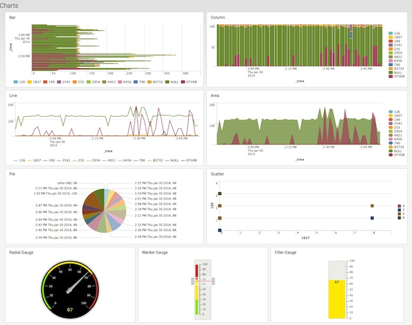

```html
<!DOCTYPE html>
<html lang="en">
<head>
    <meta charset="utf-8">
    <meta http-equiv="X-UA-Compatible" content="IE=edge,chrome=1">
    <title>Charts</title>

    <link rel="stylesheet" type="text/css" href="static/splunkjs/css/bootstrap.css"/>
    <link rel="stylesheet" type="text/css" href="static/splunkjs/css/dashboard.css"/>
</head>

<body>
    <div class="dashboard-body container-fluid main-section-body">
        <div class="row">
            <div class="dashboard-header">
                <h2>Charts</h2>
            </div>
        </div>

        <div class="dashboard-row">
            <!-- First cell -->
            <div class="dashboard-cell" style="width: 50%;">
                <div class="dashboard-panel">
                    <div class="panel-head">
                        <h3>Bar</h3>
                    </div>
                    <div class="panel-body">
                        <div id="mybarchart"></div>
                    </div>
                </div>
            </div>
            <!-- Second cell -->
            <div class="dashboard-cell" style="width: 50%;">
                <div class="dashboard-panel">
                    <div class="panel-head">
                        <h3>Column</h3>
                    </div>
                    <div class="panel-body">
                        <div id="mycolumnchart"></div>
                    </div>
                </div>
            </div>

        </div>

        <div class="dashboard-row">
            <!-- First cell -->
            <div class="dashboard-cell" style="width: 50%;">
                <div class="dashboard-panel">
                    <div class="panel-head">
                        <h3>Line</h3>
                    </div>
                    <div class="panel-body">
                        <div id="mylinechart"></div>
                    </div>
                </div>
            </div>
            <!-- First cell -->
            <div class="dashboard-cell" style="width: 50%;">
                <div class="dashboard-panel">
                    <div class="panel-head">
                        <h3>Area</h3>
                    </div>
                    <div class="panel-body">
                        <div id="myareachart"></div>
                    </div>
                </div>
            </div>
        </div>

        <div class="dashboard-row">
            <!-- Second cell -->
            <div class="dashboard-cell" style="width: 50%;">
                <div class="dashboard-panel">
                    <div class="panel-head">
                        <h3>Pie</h3>
                    </div>
                    <div class="panel-body">
                        <div id="mypiechart"></div>
                    </div>
                </div>
            </div>

            <!-- Second cell -->
            <div class="dashboard-cell" style="width: 50%;">
                <div class="dashboard-panel">
                    <div class="panel-head">
                        <h3>Scatter</h3>
                    </div>
                    <div class="panel-body">
                        <div id="myscatterchart"></div>
                    </div>
                </div>
            </div>
        </div>

        <div class="dashboard-row">
            <!-- first cell -->
            <div class="dashboard-cell" style="width: 33%;">
                <div class="dashboard-panel">
                    <div class="panel-head">
                        <h3>Radial Gauge</h3>
                    </div>
                    <div class="panel-body">
                        <div id="myrgchart"></div>
                    </div>
                </div>
            </div>
            <!-- Second cell -->
            <div class="dashboard-cell" style="width: 33%;">
                <div class="dashboard-panel">
                    <div class="panel-head">
                        <h3>Marker Gauge</h3>
                    </div>
                    <div class="panel-body">
                        <div id="mymgchart"></div>
                    </div>
                </div>
            </div>
            <!-- Third cell -->
            <div class="dashboard-cell" style="width: 33%;">
                <div class="dashboard-panel">
                    <div class="panel-head">
                        <h3>Filler Gauge</h3>
                    </div>
                    <div class="panel-body">
                        <div id="myfgchart"></div>
                    </div>
                </div>
            </div>
        </div>

    </div>

    <script src="static/splunkjs/config.js"></script>

    <script>
        // Configure SplunkJS Stack
        splunkjs.config({
            proxyPath: "/proxy",
            scheme: "https",
            host: "localhost",
            port: 8089,
            authenticate: function(done) {
                require([
                    "jquery",
                    "jquery.cookie"
                ], function($) {
                    // Retrieve the session key and username from cookies
                    var splunkSessionKey = $.cookie("splunk_sessionkey");
                    var splunkCurrentUser = $.cookie("splunk_username");

                    // Log in using the session key and username
                    if (splunkSessionKey) {
                        done(null, {sessionKey: splunkSessionKey, username: splunkCurrentUser});
                    }
                    // If there is no session key, redirect to the login form
                    else {
                        window.location.replace("login_form.html");
                    }
                });
            }
        });
        // Configure the web site's base URL
        require.config({
            baseUrl: "static/"
        });

        // Set up the Web Framework components
        var deps = [
            "splunkjs/ready!",
            "splunkjs/mvc/searchmanager",
            "splunkjs/mvc/chartview"
        ];
        require(deps, function(mvc) {
            // Load individual components
            var SearchManager = require("splunkjs/mvc/searchmanager");
            var ChartView = require("splunkjs/mvc/chartview");

            // Set up search managers
            var search1 = new SearchManager({
                id: "example-search",
                search: "index=_internal | head 10000 | timechart count by bytes limit=10",
                preview: true,
                cache: true
            });

            var search2 = new SearchManager({
                id: "example-search-gauge",
                search: "index=_internal | stats count",
                earliest_time: "-15s",
                latest_time: "now",
                preview: true,
                cache: true
            });

            // Set up the charts
            barchart = new ChartView({
                id: "example-bar-chart",
                managerid: "example-search",
                "charting.chart.stackMode": "stacked",
                "charting.legend.placement": "bottom",
                type: "bar",
                el: $("#mybarchart")
            }).render();

            linechart = new ChartView({
                id: "example-chart-line",
                managerid: "example-search",
                type: "line",
                "charting.legend.placement": "bottom",
                el: $("#mylinechart")
            }).render();

            piechart = new ChartView({
                id: "example-chart-pie",
                managerid: "example-search",
                type: "pie",
                "charting.chart.showPercent": true,
                el: $("#mypiechart")
            }).render();

            areachart = new ChartView({
                id: "example-chart-area",
                managerid: "example-search",
                type: "area",
                el: $("#myareachart")
            }).render();

            scatterchart = new ChartView({
                id: "example-chart-scatter",
                managerid: "example-search",
                type: "scatter",
                el: $("#myscatterchart")
            }).render();

            columnchart = new ChartView({
                id: "example-chart-column",
                managerid: "example-search",
                type: "column",
                "charting.chart.stackMode": "stacked100",
                el: $("#mycolumnchart")
            }).render();

            fillergaugechart = new ChartView({
                id: "example-chart-fg",
                managerid: "example-search-gauge",
                type: "fillerGauge",
                el: $("#myfgchart")
            }).render();

            markergaugechart = new ChartView({
                id: "example-chart-mg",
                managerid: "example-search-gauge",
                type: "markerGauge",
                el: $("#mymgchart")
            }).render();

            radialgaugechart = new ChartView({
                id: "example-chart-rg",
                managerid: "example-search-gauge",
                type: "radialGauge",
                el: $("#myrgchart")
            }).render();

            // Respond to a click event on the bar chart
            barchart.on("click:chart", function (e) {
                e.preventDefault();
                console.log("Clicked chart: ", e);
            });
        });
    </script>
</body>
</html>
```

## Example: Tables with custom renderers using JavaScript for apps outside Splunk Web

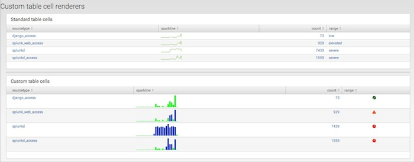

```html
<!DOCTYPE html>
<html lang="en">
<head>
    <meta charset="utf-8">
    <meta http-equiv="X-UA-Compatible" content="IE=edge,chrome=1">
    <title>Custom Table Renderers</title>

    <link rel="stylesheet" type="text/css" href="static/splunkjs/css/bootstrap.css" />
    <link rel="stylesheet" type="text/css" href="static/splunkjs/css/dashboard.css" />

    <!-- Define icon styles -->
    <style>
        td.icon {
            text-align: center;
        }
        td.icon i {
            font-size: 15px;
            text-shadow: 1px 1px #aaa;
        }
        td.icon .severe {
            color: red;
        }
        td.icon .elevated {
            color: orangered;
        }
        td.icon .low {
            color: #006400;
        }
    </style>
</head>

<body>
    <div class="dashboard-body container-fluid main-section-body">

        <div class="row">
            <div class="dashboard-header clearfix">
                <h2>Custom cell and row renderers</h2>
            </div>
        </div>

        <div class="dashboard-row">
            <div class="dashboard-cell" style="width: 100%;">
                <div class="dashboard-panel">
                    <div class="panel-head">
                        <h3>Standard table cells</h3>
                    </div>
                    <div class="panel-body">
                        <div id="table-plain"></div>
                    </div>
                </div>
            </div>
        </div>

        <div class="dashboard-row">
            <div class="dashboard-cell" style="width: 100%;">
                <div class="dashboard-panel">
                    <div class="panel-head">
                        <h3>Custom table cells</h3>
                    </div>
                    <div class="panel-body">
                        <div id="table-customcell"></div>
                    </div>
                </div>
            </div>
        </div>

        <div class="dashboard-row">
            <div class="dashboard-cell" style="width: 100%;">
                <div class="dashboard-panel">
                    <div class="panel-head">
                        <h3>Custom expanding table rows</h3>
                    </div>
                    <div class="panel-body">
                        <div id="table-customrow"></div>
                    </div>
                </div>
            </div>
        </div>

    </div>

    <script src="static/splunkjs/config.js"></script>

    <script>
        // Configure SplunkJS Stack
        splunkjs.config({
            proxyPath: "/proxy",
            scheme: "https",
            host: "localhost",
            port: 8089,
            authenticate: function(done) {
                require([
                    "jquery",
                    "jquery.cookie"
                ], function($) {
                    // Retrieve the session key and username from cookies
                    var splunkSessionKey = $.cookie("splunk_sessionkey");
                    var splunkCurrentUser = $.cookie("splunk_username");

                    // Log in using the session key and username
                    if (splunkSessionKey) {
                        done(null, {sessionKey: splunkSessionKey, username: splunkCurrentUser});
                    }
                    // If there is no session key, redirect to the login form
                    else {
                        window.location.replace("login_form.html");
                    }
                });
            }
        });
        // Configure the web site's base URL
        require.config({
            baseUrl: "static/"
        });

        // Set up the Web Framework components
        var deps = [
            "splunkjs/ready!",
            "underscore",
            "splunkjs/mvc/searchmanager",
            "splunkjs/mvc/tableview"
        ];
        require(deps, function(mvc,_) {
            // Load individual components
            var SearchManager = require("splunkjs/mvc/searchmanager");
            var TableView = require("splunkjs/mvc/tableview");

            // Set up search managers
            var search1 = new SearchManager({
                id: "search1",
                search: "index=_internal | head 10000 | stats sparkline count by sourcetype | rangemap field=count low=0-100 elevated=101-1000 default=severe",
                earliest_time: "-1h@h",
                latest_time: "now",
                preview: true,
                cache: true
            });

            var search2 = new SearchManager({
                id: "search2",
                preview: true,
                cache: true,
                search: "index=_internal | stats count by sourcetype, source, host"
            });

            // Create a table
            var myplaintable = new TableView({
                id: "table-plain",
                managerid: "search1",
                el: $("#table-plain")
            }).render();

            // Create a custom table and set sparkline properties
            var mycustomcelltable = new TableView({
                id: "table-customcell",
                managerid: "search1",
                el: $("#table-customcell"),
                // Format the sparkline cell
                format: {
                    "sparkline": [ // This field name is required
                        {
                            "type": "sparkline", // This property must be "sparkline"

                            // Sparkline options
                            "options":
                            {
                                "type": "bar",
                                "height": "40px",
                                "barWidth": "5px",
                                "colorMap":
                                {
                                    "100:": "#0033CC",
                                    ":99": "#00FF00"
                                }
                            }
                        }
                    ]
                }
            });

            // Create a table for a custom row expander
            var mycustomrowtable = new TableView({
                id: "table-customrow",
                managerid: "search2",
                drilldown: "none",
                el: $("#table-customrow")
            });

            // Define icons for the custom table cell
            var ICONS = {
                severe: "alert-circle",
                elevated: "alert",
                low: "check-circle"
            };

            // Use the BaseCellRenderer class to create a custom table cell renderer
            var CustomCellRenderer = TableView.BaseCellRenderer.extend({
                canRender: function(cellData) {
                    // This method returns "true" for the "range" field
                    return cellData.field === "range";
                },

                // This render function only works when canRender returns "true"
                render: function($td, cellData) {
                    console.log("cellData: ", cellData);

                    var icon = "question";
                    if(ICONS.hasOwnProperty(cellData.value)) {
                        icon = ICONS[cellData.value];
                    }
                    $td.addClass("icon").html(_.template('<i class="icon-<%-icon%> <%- range %>" title="<%- range %>"></i>', {
                        icon: icon,
                        range: cellData.value
                    }));
                }
            });

            // Use the BasicRowRenderer class to create a custom table row renderer
            var CustomRowRenderer = TableView.BaseRowExpansionRenderer.extend({
                canRender: function(rowData) {
                    console.log("RowData: ", rowData);
                    return true;
                },

                render: function($container, rowData) {
                // Print the rowData object to the console
                console.log("RowData: ", rowData);

                // Display some of the rowData in the expanded row
                $container.append("<div>"
                    + "<b>rowIndex</b>: " + rowData.rowIndex + "<br>"
                    + "<b>colspan</b>: " + rowData.colspan + "<br>"
                    + "<b>fields</b>: " + rowData.fields + "<br>"
                    + "<b>values</b>: " + rowData.values
                    + "</div>");
                }
            });

            // Create an instance of the custom cell renderer,
            // add it to the table, and render the table
            var myCellRenderer = new CustomCellRenderer();
            mycustomcelltable.addCellRenderer(myCellRenderer);  
            mycustomcelltable.render();

            // Create an instance of the custom row renderer,
            // add it to the table, and render the table
            var myRowRenderer = new CustomRowRenderer();
            mycustomrowtable.addRowExpansionRenderer(myRowRenderer);
            mycustomrowtable.render();

        });
    </script>
</body>
</html>
```

## Example: Events viewers using JavaScript for apps outside Splunk Web

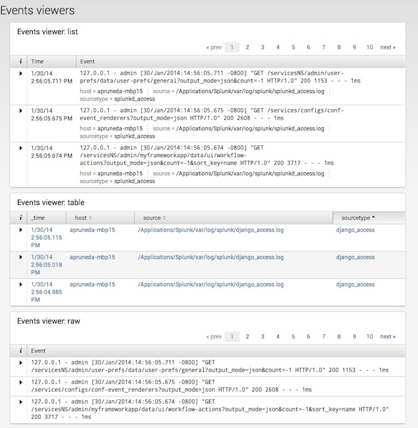

```html
<!DOCTYPE html>
<html lang="en">
<head>
    <meta charset="utf-8">
    <meta http-equiv="X-UA-Compatible" content="IE=edge,chrome=1">
    <title>Events Viewers</title>

    <link rel="stylesheet" type="text/css" href="static/splunkjs/css/bootstrap.css" />
    <link rel="stylesheet" type="text/css" href="static/splunkjs/css/dashboard.css" />
</head>

<body>
    <div class="dashboard-body container-fluid main-section-body">
        <div class="row">
            <div class="dashboard-header">
                <h2>Events viewers</h2>
            </div>
        </div>

        <!-- Row for the list events viewer -->
        <div class="dashboard-row">
            <div class="dashboard-cell" style="width: 60%;">
                <div class="dashboard-panel">
                    <div class="dashboard-element">
                        <div class="panel-head">
                            <h3>List style</h3>
                        </div>
                        <div class="panel-body">
                            <div id="myeventsviewer-list"></div>
                        </div>
                    </div>
                </div>
            </div>
        </div>

        <!-- Row for the table events viewer -->
        <div class="dashboard-row">
            <div class="dashboard-cell" style="width: 60%;">
                <div class="dashboard-panel">
                    <div class="dashboard-element">
                        <div class="panel-head">
                            <h3>Table style</h3>
                        </div>
                        <div class="panel-body">
                            <div id="myeventsviewer-table"></div>
                        </div>
                    </div>
                </div>
            </div>
        </div>

        <!-- Row for the raw events viewer -->
        <div class="dashboard-row">
            <div class="dashboard-cell" style="width: 60%;">
                <div class="dashboard-panel">
                    <div class="dashboard-element">
                        <div class="panel-head">
                            <h3>Raw style</h3>
                        </div>
                        <div class="panel-body">
                            <div id="myeventsviewer-raw"></div>
                        </div>
                    </div>
                </div>
            </div>
        </div>

    </div>

    <script src="static/splunkjs/config.js"></script>

    <script>
        // Configure SplunkJS Stack
        splunkjs.config({
            proxyPath: "/proxy",
            scheme: "https",
            host: "localhost",
            port: 8089,
            authenticate: function(done) {
                require([
                    "jquery",
                    "jquery.cookie"
                ], function($) {
                    // Retrieve the session key and username from cookies
                    var splunkSessionKey = $.cookie("splunk_sessionkey");
                    var splunkCurrentUser = $.cookie("splunk_username");

                    // Log in using the session key and username
                    if (splunkSessionKey) {
                        done(null, {sessionKey: splunkSessionKey, username: splunkCurrentUser});
                    }
                    // If there is no session key, redirect to the login form
                    else {
                        window.location.replace("login_form.html");
                    }
                });
            }
        });
        // Configure the web site's base URL
        require.config({
            baseUrl: "static/"
        });

        // Set up the Web Framework components
        var deps = [
            "splunkjs/ready!",
            "splunkjs/mvc/searchmanager",
            "splunkjs/mvc/eventsviewerview"
        ];
        require(deps, function(mvc) {
            // Load individual components
            var SearchManager = require("splunkjs/mvc/searchmanager");
            var EventsViewer = require("splunkjs/mvc/eventsviewerview");

            // Set up a search manager
            var search1 = new SearchManager({
                id: "example-search",
                search: "index=_internal | head 100",
                preview: true,
                cache: true
            });

            // Create 3 events viewers: list, table, and raw
            listviewer = new EventsViewer({
                id: "example-eventsviewer-list",
                managerid: "example-search",
                type: "list",
                "list.drilldown": "outer",
                drilldownRedirect: true,
                "list.wrap": true,
                count: 3,
                pagerPosition: "top",
                showPager: true,
                rowNumbers: false,
                el: $("#myeventsviewer-list")
            }).render();

            tableviewer = new EventsViewer({
                id: "example-eventsviewer-table",
                managerid: "example-search",
                type: "table",
                "table.drilldown": true,
                drilldownRedirect: true,
                "table.sortColumn": "sourcetype",
                "table.sortDirection": "asc",
                "table.wrap": true,
                count: 3,
                showPager: false,
                rowNumbers: false,
                el: $("#myeventsviewer-table")
            }).render();

            rawviewer = new EventsViewer({
                id: "example-eventsviewer-raw",
                managerid: "example-search",
                type: "raw",
                "raw.drilldown": "inner",
                drilldownRedirect: true,
                count: 3,
                pagerPosition: "top",
                showPager: true,
                rowNumbers: false,
                el: $("#myeventsviewer-raw")
            }).render();
        });
    </script>
</body>
</html>
```

## Example: Maps using JavaScript for apps outside Splunk Web

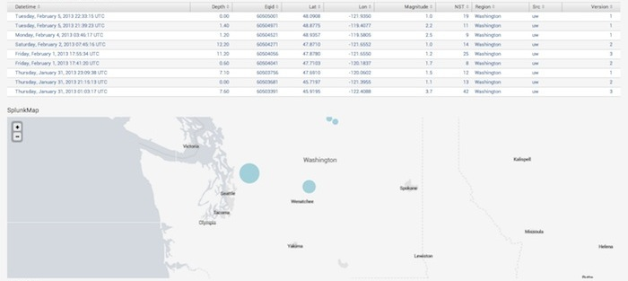

```html
<!DOCTYPE html>
<html lang="en">
<head>
    <meta charset="utf-8">
    <meta http-equiv="X-UA-Compatible" content="IE=edge,chrome=1">
    <title>Maps</title>

    <link rel="stylesheet" type="text/css" href="static/splunkjs/css/bootstrap.css" />
    <style>
        .main-area {
            padding: 30px;
        }
    </style>
</head>

<body>
    <div>
        <div class="main-area">
            <h4>Marker info</h4>
            <div id="markerinfotable"></div>

            <h3>SplunkMap</h3>
            <div id="mysplunkmapview"></div>
        </div>
    </div>

    <script src="static/splunkjs/config.js"></script>

    <script>
        // Configure SplunkJS Stack
        splunkjs.config({
            proxyPath: "/proxy",
            scheme: "https",
            host: "localhost",
            port: 8089,
            authenticate: function(done) {
                require([
                    "jquery",
                    "jquery.cookie"
                ], function($) {
                    // Retrieve the session key and username from cookies
                    var splunkSessionKey = $.cookie("splunk_sessionkey");
                    var splunkCurrentUser = $.cookie("splunk_username");

                    // Log in using the session key and username
                    if (splunkSessionKey) {
                        done(null, {sessionKey: splunkSessionKey, username: splunkCurrentUser});
                    }
                    // If there is no session key, redirect to the login form
                    else {
                        window.location.replace("login_form.html");
                    }
                });
            }
        });
        // Configure the web site's base URL
        require.config({
            baseUrl: "static/"
        });

        // Set up the Web Framework components
        var deps = [
            "splunkjs/ready!",
            "splunkjs/mvc/searchmanager",
            "splunkjs/mvc/postprocessmanager",
            "splunkjs/mvc/tableview",
            "splunkjs/mvc/splunkmapview"
        ];
        require(deps, function(mvc) {
            // Load individual components
            var SearchManager = require("splunkjs/mvc/searchmanager");
            var PostProcessManager = require("splunkjs/mvc/postprocessmanager");
            var TableView = require("splunkjs/mvc/tableview");
            var SplunkMapView = require("splunkjs/mvc/splunkmapview");

            // Define the search managers and postprocess managers
            var searchmain = new SearchManager({
                id: "search-map",
                search: "| inputlookup earthquakes.csv | search  Region=Washington",
                preview: true,
                cache: true
            });

            var searchsub1 = new PostProcessManager({
                id: "search-splunkmap",
                managerid: "search-map",
                search: "| rename Lat as lat, Lon as lon | geostats count"
            });


            // Set up a table for displaying marker info
            new TableView({
                id: "markerinfo",
                managerid: "search-map",
                el: $("#markerinfotable")
            }).render();

            // Set up the Splunk map
            mysplunkmap = new SplunkMapView({
                id: "example-splunkmap",
                managerid: "search-splunkmap",
                drilldown: true,
                drilldownRedirect: true,
                // tileSource: "splunk", This doesn't work outside of Splunk Web
                "mapping.map.zoom": 7,
                "mapping.map.center": "(47.5,-120)", // Center on Washington state
                "mapping.markerLayer.markerOpacity": 0.6,
                "mapping.markerLayer.markerMinSize": 15,
                el: $("#mysplunkmapview")
            }).render();

            // Capture click data and display the object in the console
            mysplunkmap.on("click:marker", function(e) {
                e.preventDefault();
                alert(e.data.count+" earthquakes near ("+e.data.latitude+", "+e.data.longitude+")");
                console.log(e.data);
            });

        });
    </script>
</body>
</html>
```

## Example: Drilldown properties using JavaScript for apps outside Splunk Web

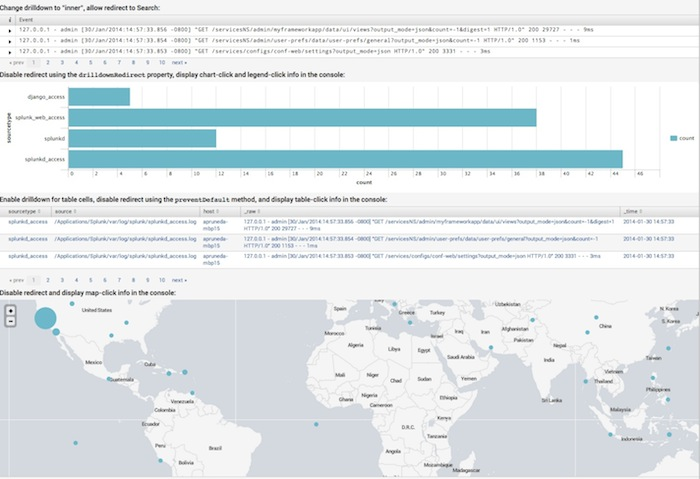

```html
<!DOCTYPE html>
<html lang="en">

<head>
    <meta charset="utf-8">
    <meta http-equiv="X-UA-Compatible" content="IE=edge,chrome=1">
    <title>Drilldown</title>
    <link rel="stylesheet" type="text/css" href="static/splunkjs/css/bootstrap.css" />
    <style>
        .main-area {
            padding: 30px;
        }
    </style>
</head>

<body>
    <div class="main-area">
        <p>You can set drilldown properties for the EventsViewer, SplunkMap, Chart, and Table views.
            <br>This example shows how to define a global drilldown function that displays an alert box with drilldown data (the search query with earliest and latest times). This data object is also displayed in the console.</p>

        <h2>Raw-style events viewer</h2>
        <h4>Global drilldown: enabled</h4>
        <p>Shows how to change the type of drilldown (<tt>full | inner | outer | none</tt>).</p>
        <div id="myeventsviewer"></div>

        <h2>Splunk map</h2>
        <h4>Global drilldown: enabled</h4>
        <p>A click event handler also displays map-click info in the console.</p>
        <div id="mymap"></div>

        <h2>Bar chart</h2>
        <h4>Global drilldown: disabled using the <tt>drilldownRedirect</tt> property</h4>
        <p>Two click event handlers display chart-click and legend-click info in the console.</p>
        <div id="mychart"></div>

        <h2>Table</h2>
        <h4>Global drilldown: disabled using the <tt>preventDefault</tt> method</h4>
        <p>A click event handler displays table-click info in the console.</p>
        <div id="mytable"></div>
    </div>

    <script src="static/splunkjs/config.js"></script>

    <script>
        // Configure SplunkJS Stack
        splunkjs.config({
            proxyPath: "/proxy",
            scheme: "https",
            host: "localhost",
            port: 8089,
            onDrilldown: function(e) {
                alert("Search query:\n" + e.q + "\n\nEarliest time: " + e.earliest + "\nLatest time: " + e.latest);
                console.log("Drilldown object: ", e);
            },
            authenticate: function(done) {
                require([
                    "jquery",
                    "jquery.cookie"
                ], function($) {
                    // Retrieve the session key and username from cookies
                    var splunkSessionKey = $.cookie("splunk_sessionkey");
                    var splunkCurrentUser = $.cookie("splunk_username");

                    // Log in using the session key and username
                    if (splunkSessionKey) {
                        done(null, {sessionKey: splunkSessionKey, username: splunkCurrentUser});
                    }
                    // If there is no session key, redirect to the login form
                    else {
                        window.location.replace("login_form.html");
                    }
                });
            }
        });
        // Configure the web site's base URL
        require.config({
            baseUrl: "static/"
        });

        // Set up the Web Framework components
        var deps = [
            "splunkjs/ready!",
            "splunkjs/mvc/searchmanager",
            "splunkjs/mvc/postprocessmanager",
            "splunkjs/mvc/eventsviewerview",
            "splunkjs/mvc/splunkmapview",
            "splunkjs/mvc/chartview",
            "splunkjs/mvc/tableview"
        ];
        require(deps, function(mvc) {
            // Load individual components
            var SearchManager = require("splunkjs/mvc/searchmanager");
            var PostProcessManager = require("splunkjs/mvc/postprocessmanager");
            var EventsViewer = require("splunkjs/mvc/eventsviewerview");
            var ChartView = require("splunkjs/mvc/chartview");
            var TableView = require("splunkjs/mvc/tableview");
            var SplunkMapView = require("splunkjs/mvc/splunkmapview");

            // Define search managers
            // ... for the events viewer
            var searchmain = new SearchManager({
                id: "main-search",
                search: "index=_internal | head 1000 | fields *",
                preview: true,
                cache: true
            });

            // ... for the chart
            var searchsub1 = new PostProcessManager({
                id: "subsearch1",
                managerid: "main-search",
                search: " | stats count by sourcetype"
            });

            // ... for the table
            var searchsub2 = new PostProcessManager({
                id: "subsearch2",
                managerid: "main-search",
                search: " | fields sourcetype, source, host"
            });

            // ... for the map
            var searchmap = new SearchManager({
                id: "map-search",
                search: "| inputlookup earthquakes.csv | rename Lat as lat Lon as lon | geostats count",
                preview: true,
                cache: true
            });

            // Set up an events viewer
            myeventsviewer = new EventsViewer({
                id: "example-eventsviewer",
                managerid: "main-search",
                type: "raw",
                "raw.drilldown": "inner",
                drilldownRedirect: true,
                count: 3,
                el: $("#myeventsviewer")
            }).render();

            // Set up a Splunk map
            mymap = new SplunkMapView({
                id: "example-splunkmap",
                managerid: "map-search",
                drilldown: true,
                drilldownRedirect: true,
                el: $("#mymap")
            }).render();

            // Set up a chart
            mychart = new ChartView({
                id: "example-chart",
                managerid: "subsearch1",
                type: "bar",
                drilldown: "all",
                drilldownRedirect: false, // Disable global drilldown
                el: $("#mychart")
            }).render();

            // Set up a table
            mytable = new TableView({
                id: "example-table",
                managerid: "subsearch2",
                pageSize: 3,
                wrap: true,
                drilldown: "cell",
                // drilldownRedirect: false, // Use the preventDefault() method instead
                el: $("#mytable")
            }).render();


            // Create a click event handler for the map
            mymap.on("click:marker", function(f) {
                // Display a data object in the console
                var clickdata = f.data;
                console.log("Map click event: ", clickdata["row.count"], "instances at lat: ", clickdata["click.lat.value"], ", long:", clickdata["click.lon.value"]);
            });

            // Create click event handlers for the chart and its legend
            mychart.on("click:legend", function(f) {
                // Displays a data object in the console--the legend text
                console.log("Legend click event: ", f.name2);
            });
            mychart.on("click:chart", function(f) {
                // Displays a data object in the console
                console.log("Chart click event: ", f.value);
            });

            // Create a click event handler for the table
            mytable.on("click", function(f) {
                // Bypass the global drilldown function
                f.preventDefault();

                // Display a data object in the console
                console.log("Table data object:", f.data);
            });

        });
    </script>
</body>
</html>
```

## Example: Search controls using tokens and JavaScript for apps outside Splunk Web

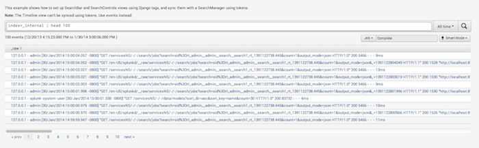

```html
<!DOCTYPE html>
<html lang="en">
<head>
    <meta charset="utf-8">
    <meta http-equiv="X-UA-Compatible" content="IE=edge,chrome=1">
    <title>Search Controls: Tokens</title>

    <link rel="stylesheet" type="text/css" href="static/splunkjs/css/bootstrap.css" />
    <style>
        .main-area {
            padding: 30px;
        }
    </style>
</head>

<body>
    <div>
        <div class="main-area">
            <p>This example shows how to set up SearchBar and SearchControls views using Django tags, and sync them with a SearchManager using tokens.</p>
            <p><b>Note:</b> The Timeline view can't be synced using tokens. Use events instead.</p>

            <div id="mysearchbar1"></div>
            <div id="mysearchcontrols1"></div>
            <div id="mytable1"></div>
        </div>
    </div>

    <script src="static/splunkjs/config.js"></script>

    <script>
        // Configure SplunkJS Stack
        splunkjs.config({
            proxyPath: "/proxy",
            scheme: "https",
            host: "localhost",
            port: 8089,
            authenticate: function(done) {
                require([
                    "jquery",
                    "jquery.cookie"
                ], function($) {
                    // Retrieve the session key and username from cookies
                    var splunkSessionKey = $.cookie("splunk_sessionkey");
                    var splunkCurrentUser = $.cookie("splunk_username");

                    // Log in using the session key and username
                    if (splunkSessionKey) {
                        done(null, {sessionKey: splunkSessionKey, username: splunkCurrentUser});
                    }
                    // If there is no session key, redirect to the login form
                    else {
                        window.location.replace("login_form.html");
                    }
                });
            }
        });
        // Configure the web site's base URL
        require.config({
            baseUrl: "static/"
        });

        // Set up the Web Framework components
        var deps = [
            "splunkjs/ready!",
            "splunkjs/mvc/searchmanager",
            "splunkjs/mvc/searchbarview",
            "splunkjs/mvc/searchcontrolsview",
            "splunkjs/mvc/tableview"
        ];
        require(deps, function(mvc) {
            // Load individual components
            var SearchManager = require("splunkjs/mvc/searchmanager");
            var SearchbarView = require("splunkjs/mvc/searchbarview");
            var SearchControlsView = require("splunkjs/mvc/searchcontrolsview");
            var TableView = require("splunkjs/mvc/tableview");

            // Create the search manager and views
            var mysearch = new SearchManager({
                id: "search1",
                search: mvc.tokenSafe("$searchquery$"),
                earliest_time: mvc.tokenSafe("$earlyval$"),
                latest_time: mvc.tokenSafe("$lateval$"),
                app: "search",
                preview: true,
                required_field_list: "*",
                status_buckets: 300
            });

            var mysearchbar = new SearchbarView({
                id: "searchbar1",
                managerid: "search1",
                value: mvc.tokenSafe("$searchquery$"),
                timerange_earliest_time: mvc.tokenSafe("$earlyval$"),
                timerange_latest_time: mvc.tokenSafe("$lateval$"),
                default: "index=_internal | head 100",
                el: $("#mysearchbar1")
            }).render();

            var mysearchcontrols = new SearchControlsView({
                id: "searchcontrols1",
                managerid: "search1",
                el: $("#mysearchcontrols1")
            }).render();

            var mytable = new TableView({
                id: "table1",
                managerid: "search1",
                el: $("#mytable1")
            }).render();
        });
    </script>
</body>
</html>
```

## Example: Search controls using events and JavaScript for apps outside Splunk Web

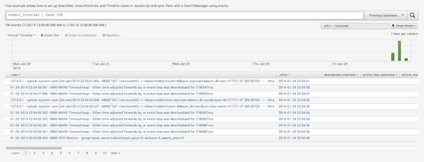

```html
<!DOCTYPE html>
<html lang="en">
<head>
    <meta charset="utf-8">
    <meta http-equiv="X-UA-Compatible" content="IE=edge,chrome=1">
    <title>Search Controls: Events</title>

    <link rel="stylesheet" type="text/css" href="static/splunkjs/css/bootstrap.css" />
    <style>
        .main-area {
            padding: 30px;
        }
    </style>
</head>

<body>
    <div>
        <div class="main-area">
            <p>This example shows how to set up SearchBar, SearchControls, and Timeline views in JavaScript and sync them with a SearchManager using events.</p>

            <div id="mysearchbar1"></div>
            <div id="mysearchcontrols1"></div>
            <div id="mytimeline1"></div>
            <div id="mytable1"></div>
        </div>
    </div>

    <script src="static/splunkjs/config.js"></script>

    <script>
        // Configure SplunkJS Stack
        splunkjs.config({
            proxyPath: "/proxy",
            scheme: "https",
            host: "localhost",
            port: 8089,
            authenticate: function(done) {
                require([
                    "jquery",
                    "jquery.cookie"
                ], function($) {
                    // Retrieve the session key and username from cookies
                    var splunkSessionKey = $.cookie("splunk_sessionkey");
                    var splunkCurrentUser = $.cookie("splunk_username");

                    // Log in using the session key and username
                    if (splunkSessionKey) {
                        done(null, {sessionKey: splunkSessionKey, username: splunkCurrentUser});
                    }
                    // If there is no session key, redirect to the login form
                    else {
                        window.location.replace("login_form.html");
                    }
                });
            }
        });
        // Configure the web site's base URL
        require.config({
            baseUrl: "static/"
        });

        // Set up the Web Framework components
        var deps = [
            "splunkjs/ready!",
            "splunkjs/mvc/searchmanager",
            "splunkjs/mvc/searchbarview",
            "splunkjs/mvc/searchcontrolsview",
            "splunkjs/mvc/timelineview",
            "splunkjs/mvc/tableview"
        ];
        require(deps, function(mvc) {
            // Load individual components
            var SearchManager = require("splunkjs/mvc/searchmanager");
            var SearchbarView = require("splunkjs/mvc/searchbarview");
            var SearchControlsView = require("splunkjs/mvc/searchcontrolsview");
            var TimelineView = require("splunkjs/mvc/timelineview");
            var TableView = require("splunkjs/mvc/tableview");

            // Create the search manager
            var mysearch = new SearchManager({
                id: "search1",
                app: "search",
                preview: true,
                cache: true,
                status_buckets: 300,
                required_field_list: "*",
                search: "index=_internal | head 100"
            });

            // Create the views
            var mytimeline = new TimelineView ({
                id: "timeline1",
                managerid: "search1",
                el: $("#mytimeline1")
            }).render();

            var mysearchbar = new SearchbarView ({
                id: "searchbar1",
                managerid: "search1",
                el: $("#mysearchbar1")
            }).render();

            var mysearchcontrols = new SearchControlsView ({
                id: "searchcontrols1",
                managerid: "search1",
                el: $("#mysearchcontrols1")
            }).render();

            var mytable = new TableView ({
                id: "table1",
                managerid: "search1",
                el: $("#mytable1")
            }).render();

            // When the timeline changes, update the search manager
            mytimeline.on("change", function() {
                mysearch.search.set(mytimeline.val());
            });

            // When the query in the searchbar changes, update the search manager
            mysearchbar.on("change", function() {
                mysearch.query.set("search", mysearchbar.val());
            });

            // When the timerange in the searchbar changes, update the search manager
            mysearchbar.timerange.on("change", function() {
                mysearch.search.set(mysearchbar.timerange.val());
            });
        });
    </script>
</body>
</html>
```

## Example: Search progress events using JavaScript for apps outside Splunk Web

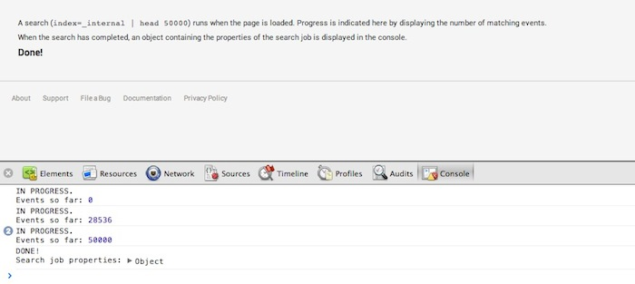

```html
<!DOCTYPE html>
<html lang="en">
<head>
    <meta charset="utf-8">
    <meta http-equiv="X-UA-Compatible" content="IE=edge,chrome=1">
    <title>Progress Events</title>

    <link rel="stylesheet" type="text/css" href="static/splunkjs/css/bootstrap.css" />
    <style>
        .main-area {
            padding: 30px;
        }
    </style>
</head>

<body>
    <div>
        <div class="main-area">
            <p>A search (<tt>index=_internal | head 50000</tt>) runs when the page is loaded. Progress is indicated here by displaying the number of matching events.</p>
            <p>When the search has completed, an object containing the properties of the search job is displayed in the console.</p>
            <h4><div id="progresstext">...status...</div></h4>

        </div>
    </div>

    <script src="static/splunkjs/config.js"></script>

    <script>
        // Configure SplunkJS Stack
        splunkjs.config({
            proxyPath: "/proxy",
            scheme: "https",
            host: "localhost",
            port: 8089,
            authenticate: function(done) {
                require([
                    "jquery",
                    "jquery.cookie"
                ], function($) {
                    // Retrieve the session key and username from cookies
                    var splunkSessionKey = $.cookie("splunk_sessionkey");
                    var splunkCurrentUser = $.cookie("splunk_username");

                    // Log in using the session key and username
                    if (splunkSessionKey) {
                        done(null, {sessionKey: splunkSessionKey, username: splunkCurrentUser});
                    }
                    // If there is no session key, redirect to the login form
                    else {
                        window.location.replace("login_form.html");
                    }
                });
            }
        });
        // Configure the web site's base URL
        require.config({
            baseUrl: "static/"
        });

        // Set up the Web Framework components
        var deps = [
            "splunkjs/ready!",
            "splunkjs/mvc/searchmanager"
        ];
        require(deps, function(mvc) {
            // Load individual components
            var SearchManager = require("splunkjs/mvc/searchmanager");

            // Create the search manager
            var mysearch = new SearchManager({
                id: "search1",
                app: "search",
                cache: false,
                search: "index=_internal | head 50000"
            });

            mysearch.on("search:failed", function(properties) {
                // Print the entire properties object
                console.log("FAILED:", properties);
                document.getElementById("progresstext").innerHTML="Failed!";
            });

            mysearch.on("search:progress", function(properties) {
                // Print just the event count from the search job
                console.log("IN PROGRESS.\nEvents so far:", properties.content.eventCount);
                document.getElementById("progresstext").innerHTML="In progress with " + properties.content.eventCount + " events...";
            });

            mysearch.on("search:done", function(properties) {
                // Print the search job properties
                console.log("DONE!\nSearch job properties:", properties.content);
                document.getElementById("progresstext").innerHTML="Done!";
            });
        });
    </script>
</body>
</html>
```

## Example: Search results model using JavaScript for apps outside Splunk Web

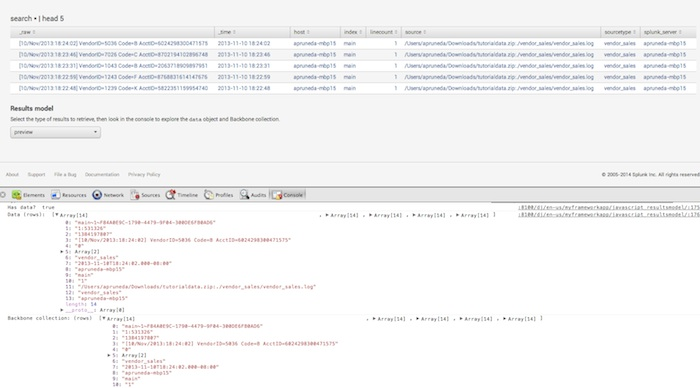

```html
<!DOCTYPE html>
<html lang="en">
<head>
    <meta charset="utf-8">
    <meta http-equiv="X-UA-Compatible" content="IE=edge,chrome=1">
    <title>Search Results Model</title>

    <link rel="stylesheet" type="text/css" href="static/splunkjs/css/bootstrap.css" />
    <style>
        .main-area {
            padding: 30px;
        }
    </style>
</head>

<body>
    <div class="main-area">
        <h2>Results model</h2>
        <div id="mysearchbar1"></div>
        <br>
        <h4>1. Select the type of results to retrieve</h4>
        <div id="mydropdown"></div>
        <br>
        <h4>2. Open the console</h4>
        <p>Look in the console to explore the <b>data</b> object and Backbone collection.</p>
    </div>

    <script src="static/splunkjs/config.js"></script>
    <script>
        // Configure SplunkJS Stack
        splunkjs.config({
            proxyPath: "/proxy",
            scheme: "https",
            host: "localhost",
            port: 8089,
            authenticate: function(done) {
                require([
                    "jquery",
                    "jquery.cookie"
                ], function($) {
                    // Retrieve the session key and username from cookies
                    var splunkSessionKey = $.cookie("splunk_sessionkey");
                    var splunkCurrentUser = $.cookie("splunk_username");

                    // Log in using the session key and username
                    if (splunkSessionKey) {
                        done(null, {sessionKey: splunkSessionKey, username: splunkCurrentUser});
                    }
                    // If there is no session key, redirect to the login form
                    else {
                        window.location.replace("login_form.html");
                    }
                });
            }
        });

        // Configure the web site's base URL
        require.config({
            baseUrl: "static/"
        });

        // Set up the Web Framework components
        var deps = [
            "splunkjs/ready!",
            "splunkjs/mvc/searchmanager",
            "splunkjs/mvc/searchbarview",
            "splunkjs/mvc/dropdownview"
        ];
        require(deps, function(mvc) {
            // Load the components
            var SearchManager = require("splunkjs/mvc/searchmanager");
            var SearchbarView = require("splunkjs/mvc/searchbarview");
            var DropdownView = require("splunkjs/mvc/dropdownview");

            // Create the search manager and views
            var mainSearch = new SearchManager({
                id: "mysearch",
                search: mvc.tokenSafe("$searchquery$"),
                earliest_time: mvc.tokenSafe("$earlyval$"),
                latest_time: mvc.tokenSafe("$lateval$"),
                data: mvc.tokenSafe("$datamod$"),
                status_buckets: 300,
                preview: true,
                cache: false
            });

            var mysearchbar = new SearchbarView({
                id: "searchbar1",
                managerid: "mysearch",
                value: mvc.tokenSafe("$searchquery$"),
                timerange_earliest_time: mvc.tokenSafe("$earlyval$"),
                timerange_latest_time: mvc.tokenSafe("$lateval$"),
                default: "index=_internal | head 5",
                el: $("#mysearchbar1")
            }).render();

            var mydropdown = new DropdownView({
                id: "selData",
                showClearButton: false,
                value: mvc.tokenSafe("$datamod$"),
                el: $("#mydropdown")
            }).render();

            // Set the dropdown list choices
            var choices = [
                {label: "events",  value: "events" },
                {label: "preview", value: "preview"},
                {label: "results", value: "results"},
                {label: "summary", value: "summary"}
            ];
            mydropdown.settings.set("choices", choices);

            // Display the type of selected results model in the console
            var myChoice = "results";
            mydropdown.on("change", function(){
                myChoice = mydropdown.settings.get("value");
                var myResults = mainSearch.data(myChoice);
                myResults.on("data", function() {
                    console.log("Has data? ", myResults.hasData());
                    console.log("Type: ", myChoice);
                    console.log("Data (rows): ", myResults.data().rows);
                    console.log("Backbone collection: (rows) ", myResults.collection().raw.rows);
                });
            });
        });
    </script>
</body>
</html>
```