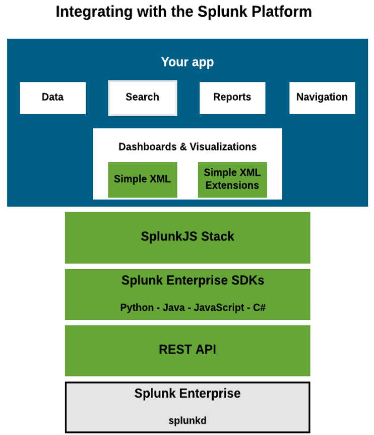

# 스플렁크 엔터프라이즈를 위한 앱 및 추가 기능 개발

## 스플렁크 플랫폼과 통합

### Splunk Enterprise REST API

- REST API : GET,POST 및 DELETE
- [REST API 참조 메뉴얼](https://docs.splunk.com/Documentation/Splunk/latest/RESTREF/RESTprolog)

### Splunk Enterprise SDK

- __Python / Java / Javascript / C#__
- __HTTP 액세스 처리__ : SDK는 HTTP 액세스를 제공하고 HTTPS에 대한 인증서를 처리
- __인증__ : 사용자 이름과 암호를 사용하여 로그인하면 Splunk는 세션 키를 반환 SDK는 이 세션 키를 자동으로 기억하고 후속 요청에 추가
- __Namespace를 관리__ : Namespace는 Splunk 사용자 이름, Splunk 앱 (예 : 기본 검색 앱) 및 공유 모드로 지정된 리소스에 액세스하기 위한 사용자/앱 컨텍스트. SDK는 로그인에 사용된 Namespace를 기반으로 요청을 보내거나 특정 리소스에 액세스 할 Namespace를 지정할 수 있음(예를 들어 모든 앱 또는 특정 사용자가 액세스 할 수 있는 앱만 나열할 수 있음)
- __REST Endpoint에 대한 액세스 단순화__ : SDK는 다양한 프로그래밍 언어의 기본 스타일로 REST API에 대한 액세스를 제공
- __Endpoint에 올바른 URL을 빌드__ : SDK는 Namespace 및 지정한 추가 매개 변수와 함께 올바른 형식으로 전체 REST URL을 빌드
- __검색을 위해 단순화된 출력을 표시__ : REST API는 XML, JSON 또는 CSV 형식의 검색 결과 (이벤트)를 원시 형식으로 반환. SDK는 이러한 이벤트를 구문 분석하고 명확한 키-값 쌍으로 단순화된 구조로 반환 하는 결과 판독기 (Python 및 Java의 도우미 클래스, JavaScript의 코드 예제)를 제공.



### 작업의 사례

- 실시간 검색을 실행하고 고객 서비스 응용 프로그램과 같은 업무용 시스템에서 Splunk 데이터를 검색
- Splunk의 데이터 및 시각화 (차트, 테이블)를 BI 도구 및 보고 대시 보드에 통합
- Splunk가 제공하는 실시간 KPI 대시 보드 및 알림으로 모바일 애플리케이션을 구축
- TCP, UDP 및 HTTP를 통해 원격 장치 및 애플리케이션에서 Splunk에 직접 로그인
- Splunk의 사용자 별 데이터로 구동되는 응용 프로그램에서 고객 용 대시 보드를 구축
- Splunk 외부의 응용 프로그램에서 데이터 입력을 생성할 뿐만 아니라 사용자 추가 및 제거를 포함하여 Splunk 인스턴스를 관리
- 장기 데이터웨어하우징을 위해 프로그래밍 방식으로 Splunk에서 데이터를 추출

### 추가 개발자 도구

- Visual Studio 및 Eclipse에 대한 IDE 지원
- .NET, Java 또는 JavaScript 응용 프로그램에서 활동을 기록하고 Splunk Enterprise로 데이터를 보내는 라이브러리.
- Splunk Enterprise를 웹 앱에 통합하기 위한 웹스택 라이브러리.
- 사용자 지정 대시 보드 및 시각화를 만들기 위한 도구

## 스플렁크 App 개발

### App 또는 Add-on 개발 시나리오

- 실시간 데이터 분석
- 보안 및 모니터링
- 데이터 해석을 돕는 Custom 시각화
- SPL에 대한 검색 언어 확장
- Modular Inputs

### App 개발 순서

1. __App 또는 Add-on 만들기__ : Splunk Web을 이용하여 App 또는 Add-on 생성, App속성, 데이터 입력, Knowledge Object, 권한 및 경고 구성
2. __App에 대한 Dashboard 및 시각화 만들기__ : Splunk Web Framework 웹개발을 위한 Full Stack. Simple XML, HTML 및 Javascript를 사용하여 Custom Dashboard, 차트, 검색 및 기타 기능 앱 빌드
3. __앱에 Navigation 추가__ : 사용자가 액세스하기 위한 Navigation 생성
4. __App 상태 관리__ : App Key Value Store(KV Store)는 App내에서 데이터를 저장하고 검색하는 방법 제공, 앱상태를 관리하고 유지
5. __Custom REST Endpoint 생성__ : 사용자 정의 REST Endpoints 생성
6. __App에 설정페이지 생성__ : 사용자 입력을 구성하는 경우 설정 페이지 추가
7. __Custom Search Command 생성__ : 사용자 정의 검색 명령 생성
8. __로깅__ : App 또는 Add-on 위한 로깅 활성화
9. __스플렁크 Enterprise Security 위한 통합__ : 스플렁크 ES 프레임워크

### Splunk Caching 비활성

- web.conf

```properties
[settings]
js_no_cache = true
cacheBytesLimit = 0
cacheEntriesLimit = 0
max_view_cache_size = 0
auto_refresh_views = 1
```
