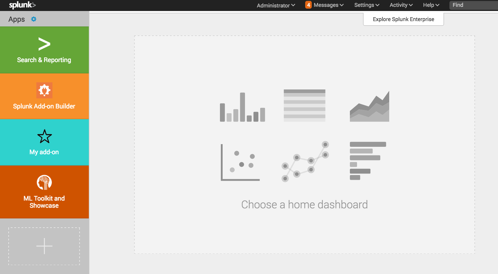
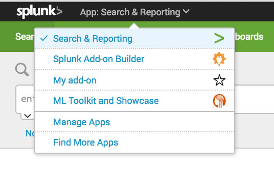

# App 또는 Add-on 만들기

## 스플렁크 엔터프라이즈용 App 또는 Add-on 만들기

스플렁크 엔터프라이즈 또는 스플렁크 클라우드용 App 또는 Add-on 개발

- 스플렁크 엔터프라이즈 테스트 환경
    랩톱과 같은 단일 인스턴스 개발 환경에서 Splunk Enterprise 설치를 사용
    지원되는 컴퓨팅 환경에 대한 자세한 내용은 설치 설명서의 스플렁크 엔터프라이즈 온-프레미스 사용에 대한 시스템 요구 사항을 참조
- 개발 도구.
    Splunk Web에는 구문 강조 표시 및 자동 들여쓰기 기능이 있는 기본 제공 소스 코드 편집기 또는 XML, CSS 및 HTML 파일에 대한 사용자 고유의 편집기 사용
    웹 브라우저에 포함된 디버깅 도구를 사용할 수도 있음
- App에 대한 계획.
    App의 범위를 결정하고 해결하려는 사용 사례를 결정
    App을 스토리보드하고 대시보드, 패널 및 탐색의 모형을 만듬
- 샘플 데이터.
    작업할 데이터와 데이터를 가져올 방법을 결정합니다. App을 테스트하기 위해 몇 가지 샘플 데이터를 가져옵니다.

## Splunk App을 개발하기 위한 기본 프로세스

1. 스플렁크 웹을 사용하여 App을 생성
2. 앱구성 설정 및 정적 자산과 같은 App 속성을 구성
3. 데이터 입력, 인덱스 및 모듈식 입력을 사용하여 Splunk에 데이터를 가져옴
4. Splunk 검색 언어를 사용하여 데이터를 검색하고 검색을 최적화(필터, 범위 제한, 실시간 검색 피하기)
5. SavedSearch, Eventtype, Transaction, Tag, Fields 추출, 변환, Lookups, 검색 명령 및 데이터모델과 같은 Splunk 지식 개체로 검색을 보강
6. App의 개체에 대한 권한을 설정하여 사용자가 볼 수 있는(읽기)및 상호 작용(쓰기)을 지정
7. 즉시 사용 가능한 경고 작업과 다른 시스템과 통합할 사용자 지정 경고 작업을 모두 사용하여 경고 생성

## 스플렁크 App 만들기

Splunk Web을 사용하여 스플렁크 App을 만들어 App 및 필수 파일에 대한 디렉터리 구조를 생성

1. 스플렁크 웹 홈 페이지에서 App옆에 있는 기어 아이콘을 클릭
2. App 만들기 클릭
3. 새 추가 페이지에서 새 App의 속성을 입력
    <table>
    <tr><td>OPTION</td><td>DESCRIPTION</td></tr>
    <tr><td>Name</td><td>
    Splunk 웹 목록과 App 메뉴에 나타나는 앱 이름<br/>
    이름 label은 app.conf구성 파일 의 설정에 매핑<br/>
    Splunkbase에 App을 업로드하려는 경우 Splunkbase 작업 매뉴얼의 Splunkbase 에있는 App 및 추가 기능의 이름 지정 규칙에 설명 된 이름 지정 규칙을 따름<br/>
    팁 Windows에서 긴 파일 경로 문제를 방지하려면 짧은 앱 이름을 사용하는 것이 권장
    </td></tr>
    <tr><td>Folder name</td><td>$SPLUNK_HOME/etc/apps/의 디렉토리에 사용할 이름<br/>
    폴더 이름에는 "점"( .) 문자를 사용할 수 없음</td></tr>
    <tr><td>Version</td><td>앱 버전 문자열</td></tr>
    <tr><td>Visible</td><td>Splunk Web에 App을 표시해야 하는지 여부를 나타냄<br/>
    사용자 인터페이스가 포함된 App이 표시</td></tr>
    <tr><td>Description</td><td>App에 대한 설명<br/>
    이전 버전의 Splunk Enterprise는 Splunk 홈 페이지에 설명을 표시했지만 현재 버전의 Splunk Enterprise는 이 설명을 사용하지 않음<br/>Splunkbase에 App을 업로드하려는 경우 Splunkbase가이를 사용하여 앱 패키지의 유효성을 검사하므로 설명을 포함</td></tr>
    <tr><td>Author</td><td>저자 이름</td></tr>
    <tr><td>Template</td><td>App을 만드는 데 사용할 템플릿<br/>
    "barebones"템플릿을 선택하여 기본 앱 디렉토리 구조와 몇 가지 필요한 파일을 생성하십시오.
    "sample_app"템플릿은 대시보드 스타일 및 동작을위한 샘플 대시보드, 이미지 및 CSS 파일을 포함하는 App을 생성하십시오.
    팁> $SPLUNK_HOME/share/splunk/app_templates/에 사용자 지정 앱 템플릿을 만들고 추가</td></tr>
    <tr><td>Upload asset</td><td>파일 선택을 클릭 하여 단일 이미지, HTML, JavaScript, CSS 또는 기타 자산 파일을 App에 업로드
    </td></tr>
    </table>
4. App에 대한 새 디렉터리$SPLUNK_HOME/etc/앱 디렉토리 아래에 만들어짐
  필요한 디렉터리 "베어본" 템플릿을 사용할 때 생성
    <table>
    <tr><td>디렉터리</td><td>설명</td></tr>
    <tr><td>./app_name</td><td>App의 디렉터리, app_name $SPLUNK_HOME/etc/apps .</td></tr>
    <tr><td>./app_name/appserver</td><td>이미지 및 스타일 시트와 같은 리소스 파일이 포함.</td></tr>
    <tr><td>./app_name/appserver/static</td><td>CSS, JS 확장자 및 아이콘 파일을 포함한 리소스 파일이 포함. 자세한 내용은 클라이언트 및 서버 자산 캐싱을 참조.</td></tr>
    <tr><td>./app_name/bin</td><td>검색 또는 스크립팅된 입력에 대한 사용자 지정 스크립트를 포함.</td></tr>
    <tr><td>./app_name/default</td><td>App 및 대시보드 파일에 필요한 구성을 포함.</td></tr>
    <tr><td>./app_name/default/data</td><td>탐색 및 대시보드 파일이 포함.</td></tr>
    <tr><td>./app_name/default/data/ui</td><td>탐색 및 대시보드 파일이 포함.</td></tr>
    <tr><td>./app_name/default/data/ui/html</td><td>변환된 대시보드(HTML 파일)를 포함.</td></tr>
    <tr><td>./app_name/default/data/ui/nav</td><td>App의 탐색 파일인 default.xml을 포함.</td></tr>
    <tr><td>./app_name/default/data/ui/views</td><td>앱과 관련된 간단한 XML 대시보드가 포함.</td></tr>
    <tr><td>./app_name/local</td><td>/default에 있는 기본 구성 파일 또는 대시보드의 수정된 버전을 포함. Splunk Enterprise는 사용자가 변경할 때 이 디렉터리를 만듬.</td></tr>
    <tr><td>./app_name/local/data</td><td>수정된 대시보드를 포함.</td></tr>
    <tr><td>./app_name/local/data/ui</td><td>수정된 대시보드를 포함.</td></tr>
    <tr><td>./app_name/local/data/ui/html</td><td>변환된 대시보드(HTML 파일)를 포함.</td></tr>
    <tr><td>./app_name/local/data/ui/views</td><td>수정된 간단한 XML 대시보드(XML 파일)가 포함.</td></tr>
    <tr><td>./app_name/lookups</td><td>Lookups 테이블(CSV 파일)을 포함.</td></tr>
    <tr><td>./app_name/metadata</td><td>사용 권한(META 파일)이 포함. default.meta 파일은 App에 대한 기본 권한을 설정. 사용자가 권한을 재정의하는 권한은 local.meta 파일에 설정</td></tr>
    <tr><td>./app_name/static</td><td>아이콘 파일을 포함한 리소스 파일이 포함</td></tr>
    </table>

## App 디렉토리 구성

- 대시보드는 `$SPLUNK_HOME/etc/apps/appname/default/data/ui/views/dashboardname.xml`에 저장
- JS 확장은 `$SPLUNK_HOME/etc/apps/appname/appserver/static/dashboardname.js`에 저장
- 데이터소스에서 데이터를 가져오는 모듈식 입력은 `$SPLUNK_HOME/etc/apps/appname/bin/appname_inputname.py`에 저장

주어진 App에 대한 모든 패키지 구성 요소는 `$SPLUNK_HOME/etc/apps` 아래의 디렉토리(your_app)

```bash
your_app
    |__appserver
    |    |__ static  
    |              |__ // App resources like CSS, images, JavaScript extensions
    |    |__ event_renderers
    |              |__ // Supporting files for custom event rendering 
    |__bin
    |    |__ // Entry points for app code should start with your_app_*.py  
    |    |__ your_app
    |              |__ // All other non-entry point app code
    |__default
    |    |__ // .conf files containing the apps default configuration
    |    |__ data
    |              |__ ui
    |                   |__ nav
    |                        |__ // Top-level nav for the app
    |                   |__ views
    |                        |__ // SimpleXML dashboards
    |                   |__ html
    |                        |__ // HTML dashboards
    |__local
    |    |__ // .conf files containing user's configuration modifications
    |    |__ // Same internal structure as default
    |    |__ // Packaged Splunk apps should not contain a local folder
    |__ lib
    |    |__ // All app dependencies including splunklib
    |__ lookups
    |    |__ // .csv lookup files
    |__ metadata
    |    |__ // .meta files for permissions management
    |__ static
    |    |__ // App icon and app logo images
```

- default 및 local 디렉토리는 서로의 하위 디렉토리 구조를 반영
- local의 앱별 사용자 지정은 default 디렉토리의 해당 항목보다 우선
- 패키지 된 Splunk App에는 local 디렉토리가 포함되지 않아야 함(그렇지 않으면 local 디렉토리가 고객이 앱 사본에 대해 구성한 내용을 겹쳐 쓸 수 있음)
- 또한 앱 업그레이드 중에 로컬 디렉토리가 유지되는 동안 기본 구성이 재정의
- local 과 기본값 사이의 파일 우선 순위에 대한 자세한 내용은 파일 우선 순위 및 캐싱 정보를 참조

Python App의 경우 몇 가지 특정 추가 요구 사항

- conf 파일이 참조하는 모든 Python 파일은 bin에 저장 해야 하며 appname_*.py 규칙을 사용하여 고유하게 이름을 지정
- App의 추가 Python 파일은 bin/appname 내의 하위 디렉토리에 저장(이 폴더 내의 파일에는 이름 지정 제한이 없음)
- 필요한 경우를 포함하여 모든 Python 종속성은 bin이 아닌 lib에 저장
- App의 폴더에 패키징 하는 경우 시스템에 존재 할 수 있는 다른 버전이 아닌 App이 해당 버전을 호출하도록 경로에 추가(경로에 추가하려면 App의 기본 스크립트에서 다음과 같은 코드를 사용 splunklib splunklib lib lib splunklib splunklib lib)

```py
import sys, os
sys.path.insert(0, os.path.join(os.path.dirname(__file__), "..", "lib"))
```

아래는 이러한 Python 앱별 규칙의 구현 예

```bash
your_app
    |__default
    |    |__ app.conf
    |__bin
    |    |__ your_app_entry_point.py
    |    |__ your_app
    |              |_ other_your_app_code.py
    |__ lib
          |__ dependency_code.py
```

## 파일 우선 순위 및 캐싱

Splunk Enterprise가 파일 우선 순위 및 캐싱을 처리하는 방법

### 파일 우선 순위

- 대시보드 소스 파일 (XML, HTML) 및 Splunk 구성 파일 (CONF)과 같은 App에서 파일 작업을 수행 할 때 Splunk는 Splunk Enterprise 시스템 폴더로 시작하는 여러 위치에서 파일을 찾은 다음 앱별 폴더, 그런 다음 사용자별 폴더. 또한 이러한 각 위치에는 /default 및 /local 하위 폴더
- 원본 App 파일은 /default 에 있고 사용자가 편집 한 모든 파일은 /local 폴더에 있으므로 각 사용자에 대한 설정 및 수정 사항은 유지
- 대시보드에 설정 한 권한에 따라 대시보드 소스 파일의 위치가 결정
  - Private : $SPLUNK_HOME/etc/users/<user_name>/<app_name> /local/data/ui/...
  - Shared : $SPLUNK_HOME/etc/apps/<app_name>/local/data/ui/...

- myapp App에 관리자를 위한 mydash.xml 대시보드 가 있다고 가정.
- Splunk는 다음 위치에서 mydash.xml 소스 파일을이 순서대로 찾습니다 .

1. 시스템 폴더 :
    `$SPLUNK_HOME/etc/system /default/data/ui/views/mydash.xml`
    `$SPLUNK_HOME/etc/system /local/data/ui/views/mydash.xml`
2. 앱별 폴더 :
    `$SPLUNK_HOME/etc/apps/myapp/default/data/ui/views/mydash.xml`
    `$SPLUNK_HOME/etc/apps/myapp/local/data/ui/views/mydash.xml`
3. 사용자별 폴더 :
    `$SPLUNK_HOME/etc/users/admin/myapp /default/data/ui/views/mydash.xml`
    `$SPLUNK_HOME/etc/users/admin/myapp /local/data/ui/views/mydash.xml`

구성 파일의 우선 순위에 대한 자세한 내용은 Splunk Enterprise 관리 설명서의 [구성 파일 우선 순위](https://docs.splunk.com/Documentation/Splunk/latest/Admin/Wheretofindtheconfigurationfiles) 를 참조

### Clinet 및 Server Asset 캐싱

- Splunk Enterprise가 파일을 캐시하는 방법을 이해하면 개발 및 문제 해결 중에 도움
- App 파일, 구성 파일 및 정적 자산은 클라이언트와 서버에 캐시. 이러한 소스 파일을 변경할 때마다 변경 사항을 보려면 클라이언트 및 서버 캐시를 모두 지워야 함
- 대부분의 경우 전체 재시작이 필요하지 않지만 Splunk Enterprise를 다시 시작하면 항상 이러한 캐시가 지워짐.

#### Client Asset 업데이트

- 클라이언트 자산을 업데이트하려면 브라우저 캐시를 수동으로 지우십시오.
- 개발 중에는 브라우저의 개발자 도구를 사용하여 브라우저 캐시를 비활성화. 예를 들어, Chrome에서 DevTools를 사용하고 캐시 사용 안함 (DevTools가 열린 상태) 옵션을 선택하여 항상 캐시를 지울 수 있음.

#### Server Asset 업데이트

- `http://<host:port>/debug/refresh`로 이동하여 시스템 데이터 (XML, HTML 및 대부분의 CONF 파일)를 새로 고칩니다
- splunkd 서버는 특정 파일 (예 : JS, CSS 및 HTML 파일)을 캐시
- 개발 중에 `web.conf` 구성 파일 에서 다음 설정 을 사용하여 splunkd 서버에서 캐시를 비활성화

```properties
# 이 설정은 프로덕션에 권장되지 않습니다.
cacheEntriesLimit = 0
cacheBytesLimit = 0
```

요약하자면:

- 개발자 도구를 사용하여 개발 중에 브라우저 캐시를 비활성화
- 시스템 데이터 (XML, HTML 및 대부분의 CONF 파일)를 편집할 때는을 사용 `http://<host:port>/debug/refresh`.
- JS 파일을 편집할 때 splunkd에서 캐싱을 비활성화하고을 사용 `http://<host:port>/debug/refresh`.
- CONF 파일을 수정할 때는 `http://<host:port>/debug/refresh`먼저 시도(변경 사항이 표시되지 않으면 Splunk Enterprise를 다시 시작)

## App 속성 구성

App 속성에는 이름 및 설명과 같이 App을 만들 때 설정 한 값과 Splunkbase 및 기타 기능에 대한 추가 속성이 포함
배경색을 포함하여 앱 탐색 모음을 변경하려면 [Splunk App에 탐색 추가](https://dev.splunk.com/enterprise/docs/developapps/addnavsplunkapp)를 참조

### App 구성 수정

- 기본 `app.conf` 파일 에는 다음 설정이 포함
- Splunkbase에 필요한 속성을 포함하여 설정 할 수 있는 다른 속성에 대한 자세한 내용은 관리 설명서 의 `app.conf` 사양을 참조

|환경|기술|
|:--:|:--:|
|is_configured|사용자가 App의 사용자 지정 설정을 실행했는지 여부를 나타내는 부울입니다 (1은 true, 0은 false).|
|is_visible|Splunk Web에 App이 표시되는지 여부를 나타내는 부울입니다 (1은 true0,은 0 false).|
|label|Splunk Web에 표시되는 앱 이름입니다.|
|author|저자의 이름. Splunkbase에 게시하려는 App의 경우 splunk.com 계정의 사용자 이름을 입력하십시오.|
|description|App에 대한 간단한 설명.|
|version|"1.0.0"또는 "2.0beta"와 같은 앱 버전이 포함된 문자열입니다. Splunkbase에 게시하려는 App의 경우 app.conf 의 버전 번호가 Splunkbase의 버전 번호와 일치해야합니다.|

기본 "barebones" app.conf 파일

```properties
#
# Splunk app configuration file
#

[install]
is_configured = 0

[ui]
is_visible = 1
label = NAME OF YOUR APP

[launcher]
author =
description = DESCRIPTION
version = 1.0
```

1. 텍스트 편집기에서 `$SPLUNK_HOME/etc/apps/<your_app_name>/default/app.conf` 실행
2. 변경하고 파일을 저장
3. 변경 사항을 보려면 Splunk Web을 다시 시작하거나 App을 새로 수정(`http://<localhost:port>/debug/refresh`웹 브라우저에서 URL을 열고 새로 고침을 클릭 한 다음 브라우저에서 대시보드를 다시 로드)

### 새로운 버전의 App에 대한 정적 자산 업데이트

- 새 버전의 App을 출시하면 app.conf 파일의 빌드 번호를 사용하여 사용자의 정적 자산을 업데이트
- 정적 자산에는 App의/appserver/static/폴더 에있는 이미지, CSS 및 JavaScript 파일이 포함

- 빌드 번호를 사용하려면 특성이 단일 정수로 설정된 app.conf 파일에 `install`스탠자를 추가
- 그런 다음 정적 자산을 변경하는 새 버전의 App을 출시 할 때마다 빌드 번호와 버전 번호를 모두 증가
- 이 프로세스는 브라우저가 새로운 버전의 App에 대해 오래된 정적 파일의 캐시된 사본을 사용하지 않도록 함 `build`

```properties
[install]
build = 2
```

### 설정 페이지 지정

- 사용자가 App을 처음 실행할 때 표시되는 설정 페이지를 사용하는 경우 속성 `ui`을 사용하여 `app.conf`파일에 스탠자를 추가하여 설정 페이지를 지정 `setup_view`.
- 기본적으로 App에서보기를 요청하면 Splunk Enterprise는 스탠자 의 `setup_view`속성 `install`을 확인하여 App이 구성되었는지 확인
- App이 구성되지 않은 경우 설정 페이지가 표시

app.conf 설정 페이지 구성 의 예는 다음과 같습니다 .

```properties
[install]
is_configured = false

[ui]
setup_view = my_custom_setup_page
```

### App에 아이콘 추가

Splunk Web App 목록 및 App 메뉴에서 App에 아이콘을 표시





- 24 비트 투명도로 PNG 형식으로 아래의 아이콘 파일을 작성
- 아래와 같이 아이콘 파일의 이름을 지정
- 파일 이름은 대소 문자를 구분
- 아이콘 파일을 `$SPLUNK_HOME/etc/apps/<your_app_name>/static/`에 저장

<table>
<tr><td>파일 이름</td><td>이미지 크기 (픽셀)</td><td>놓기</td><td>이미지 예</td></tr>
<tr><td>appIcon_2x.png</td><td>72 x 72</td><td>Splunk 웹 홈 페이지의 App 목록 (고해상도 디스플레이)</td><td></td></tr>
<tr><td>appIcon.png</td><td>36 x 36</td><td>Splunk 웹 홈 페이지의 App 목록 (표준 해상도 표시)</td><td></td></tr>
<tr><td>appIconAlt_2x.png</td><td>72 x 72</td><td>Splunk 막대 및 검색 막대 (고해상도 디스플레이) 용 App 메뉴</td><td></td></tr>
<tr><td>appIconAlt.png</td><td>36 x 36</td><td>Splunk 막대 및 검색 막대의 App 메뉴 (표준 해상도 표시)</td><td></td></tr>
<tr><td>appLogo.png</td><td>160 x 40 (최대 크기)</td><td>표준 해상도 디스플레이의 앱 바	</td><td>—</td></tr>
<tr><td>appLogo_2x.png</td><td>320 x 80 (최대 크기)</td><td>고해상도 디스플레이의 앱 바</td><td>—</td></tr>
</table>

>> 노트:
>> 앱 아이콘은 Splunkbase에서 사용하는 우선 순위대로 나열됩니다 (이 순서대로 가장 먼저 찾은 아이콘이 사용됩니다).
고해상도 디스플레이에는 Retina Display가 장착 된 MacBookPro가 포함됩니다.

## Splunk App에서 데이터 계층 및 지식 개체 구성

- 데이터 처리 방법을 지정하도록 App의 데이터 계층을 구성.
- App에서 사용할 수 있는 데이터, Splunk Enterprise 인스턴스로 가져 오는 방법 및 데이터 저장 방법을 사용자 지정

SavedSearch, 보고서, Eventtype, 필드, 필드 추출, 태그, Lookups, 경고, 데이터모델, 트랜잭션 및 워크플로우 작업을 포함하여 앱 내 지식 개체를 구성

### 데이터 계층 구성

- 기본적으로 모든 구성은 전역적
- 모든 App에서 사용 할 수 있음(구성을 분리하려면 구성을 App의 디렉토리)
- App 디렉토리에 넣은 구성도 App과 함께 패키지화
- 인덱싱 된 모든 데이터 입력은 항상 다른 App에서 사용할 수 있음

데이터 계층 구성의 몇 가지 예를 제공(구성 파일에 대한 자세한 내용은 관리자 매뉴얼의 구성 파일 정보를 참조)

<table>
<tr><td>데이터 레이어</td><td>기술</td></tr>
<tr><td>inputs</td><td>App의 데이터 입력을 구성. App에 대해서만 특정 유형의 데이터를 색인화. (예를 들어 웹개발자가 웹로그를 한 곳에서 볼 수 있도록 웹 로그를 인덱싱)

HTTP Event Collector를 Splunk Enterprise 및 Splunk Cloud로 직접 데이터를 전송하는 빠르고 효율적인 방법으로 사용(자세한 정보는 HTTP 이벤트 콜렉터를 참조)

재사용 가능한 inputs을 작성하여 Splunk를 확장하여 REST를 사용하여 사용자 정의 데이터 입력 기능을 프로그래밍 방식으로 관리

자세한 내용은 C#, Python, Java 또는 JavaScript 용 Splunk SDK를 사용하여 모듈 식 입력을 만드는 방법을 참조</td></tr>
<tr><td>indexes</td><td>App의 데이터를 저장하도록 사용자 지정 인덱스를 구성하면 앱 사용자가 특정 데이터만 검색 할 수 있도록 하는 가장 좋은 방법.
자세한 내용은 인덱서 및 인덱서 클러스터 관리 매뉴얼 에서 여러 인덱스 설정을 참조.</td></tr>
<tr><td>props and transforms</td><td>사용자 정의 데이터 유형의 경우 세그먼트, 문자 세트 또는 기타 사용자 정의 데이터 처리 규칙을 설정. props.conf 구성 파일 에서 데이터 처리 규칙을 작성 하고 transforms.conf 구성 파일을 사용하여 데이터에 연결. 이러한 구성을 앱과 함께 패키지 할 수 있지만 소스, 소스 유형 또는 호스트별로 적용</td></tr>
<tr><td>users and role</td><td>사용자 지정 사용자 또는 역할을 만들어 앱과 앱 내의 콘텐츠에 액세스 할 수 있으므로 다른 팀을 다른 콘텐츠로 제한</td></tr>
</table>

### 지식 개체 구성

App에서 다양한 지식 객체를 사용하는 방법(지식 개체 및 구성 세부 정보에 대한 자세한 내용은 지식 관리자 매뉴얼을 참조)

<table>
<tr><td>지식 객체</td><td>기술</td></tr>
<tr><td>SavedSearch 및 Report</td><td>SavedSearch 및 Report는 중요한 데이터를 동적으로 캡처
App에서이를 대시보드에 표시하거나 Splunk Web의 드롭 다운 메뉴에 추가하여 필요에 따라 실행
SavedSearch을 바로 가기로 사용하여 App에로드 한 모든 데이터에서 흥미롭고 관련성있는 검색을 시작
SavedSearch은 대시보드를 로드할 때 검색 결과를 이미 사용할 수 있도록 SavedSearch을 실행하고 데이터를 수집하도록 예약 할 수 있으므로 대시보드를 작성할 때 유용</td></tr>
<tr><td>Eventtypes</td><td>Eventtypes은 이벤트를 분류하고 공통 특성별로 분류 할 수 있도록 하여 검색 결과를 단순화.</td></tr>
<tr><td>필드 및 필드 추출</td><td>필드는 이벤트 데이터에 나타나는 이름-값 쌍
Splunk Enterprise는 데이터에서 필드를 자동으로 추출하지만 고유한 필드 추출을 정의.(예를 들어, 사용자 정의 필드를 추출하여 결과에 표시하려는 일부 데이터가 App에 있을 수 있음)</td></tr>
<tr><td>태그</td><td>태그는 데이터에 메타 데이터를 추가하는 또 다른 방법
태그를 사용하면 특정 필드 값이 포함된 이벤트를 검색</td></tr>
<tr><td>Lookups</td><td>Lookups는 이벤트 값을 다른 데이터 소스의 필드에 맵핑하고 일치하는 결과를 원래 이벤트에 추가하여 데이터 보강을 제공.(예를 들어, Lookups를 사용하여 HTTP 상태 코드를 일치시키고 상태에 대한 자세한 설명이 포함된 새 필드를 리턴)
Lookups 컨텐츠의 데이터 소스에는 검색 결과, CSV 파일, KV스토어 콜렉션 및 데이터베이스 연결이 포함
Lookups를 대시보드에 통합하여 사람이 읽을 수 있는 형식으로 컨텐츠를 표시 할 수 있으므로 사용자는 불분명 한 이벤트 필드를 몰라도 이벤트 데이터와 상호 작용</td></tr>
</table>

>> 앱 내에서 지식 개체를 구성하여 범위를 지정하는 방법과 역할별로 개체에 대한 권한을 설정할지 여부를 지정(예를 들어 보고서는 소유자(개인), 하나의 앱(앱) 또는 모든 앱(전역)에 대해서만 표시 될 수 있는 개체이며, 사용자 역할마다 읽기/쓰기 권한을 부여)

## Splunk App에서 객체에 대한 권한 설정

- 앱 내의 모든 앱과 개체는 Splunk Enterprise에서 사용자가 보고 (읽기 액세스)하고 상호 작용(쓰기 액세스) 할 수 있는 항목을 지정하는 읽기/쓰기 권한 세트에 의해 관리
- 모든 App 및 개체에 대한 역할별로 권한을 부여

### 다음은 앱 또는 App의 객체에 대한 권한을 설정하기 위한 사용 사례

- __사용자가 볼 수 있는 개체를 제한__ : 예를 들어 경영진 만 볼 수 있는 비즈니스 통계 대시보드와 개발팀만 볼 수 있는 오류보고 대시보드
- __사용자가 볼 수 있는 데이터를 제한__ : 예를 들어, 운영팀은 syslog 데이터만 볼 수 있는 권한이 있고 개발팀은 Log4J 및 Apache 데이터만 볼 수 있음. 따라서 각 팀이 액세스해야 하는 다양한 유형의 데이터를 보여주는 각 팀마다 특정 App을 만들 수 있음. 이러한 사용자가 Splunk Enterprise에 로그인하면 볼 수 있는 권한이 있는 앱만 표시
- __개체를 만들거나 편집하는 기능을 제한__ : 권한에 따라 특정 사용자는 앱 내에서만 개체를 ​​만들거나 편집할 수 있지만 다른 사용자는 자신의 사용자 역할에서 사용할 수 있는 개체를 만들거나 편집할 수 있음. (예를 들어, 사용자가 보고서를 작성하면 `$SPLUNK_HOME/etc/users/<user_name>` 아래의 사용자 디렉토리에 저장되며 해당 사용자만 사용. App에 대한 쓰기 권한이 있는 사용자는 사용자 수준에서 앱 수준으로 개체를 승격 시킬 수 있음. 승격된 오브젝트는 파일 시스템에서 사용자 디렉토리에서 `$SPLUNK_HOME/etc/apps/<app_name>` 앱 디렉토리로 이동. 그런 다음 해당 앱 내에서 읽기 권한이 있는 모든 사용자가 객체를 사용

사용자 및 역할에 대한 자세한 내용은 관리자 매뉴얼의 사용자 및 역할 정보를 참조. 사용자 및 역할을 데이터로만 제한하는 방법에 대한 자세한 내용은 Securing Splunk Enterprise 매뉴얼의 관리자 콘솔 및 App에 대한 액세스 설정을 참조.

사용자가 앱과 해당 개체에 액세스하는 방법을 제어하기 위해 Splunk 웹 설정 (권장)을 사용하거나 Splunk Enterprise 파일을 직접 수정하여 권한을 설정할 수 있음.

### Splunk Web에서 권한 설정

1. Splunk Web에서 설정으로 이동한 다음 지식에서 객체 범주를 클릭하거나 모든 구성을 클릭.
2. 권한 을 편집하려는 오브젝트에 대한 권한 을 클릭.
3. 앱 컨텍스트 (모든 앱 또는 객체의 현재 앱)에 대한 옵션을 선택한 다음 나열된 모든 역할에 대한 읽기 및/또는 쓰기 권한을 설정.
4. 저장을 클릭.

### 파일 시스템에서 권한 설정

App에서 권한 파일 (default.meta)을 편집 하여 App의 모든 객체에 대한 읽기/쓰기 권한을 설정.

- 텍스트 편지기 : `$SPLUNK_HOME/etc/apps/<your_app_name>/metadata/default.meta`
- 다음 형식을 사용하여 각 객체 또는 유형의 모든 객체에 대한 항목을 추가.

    ```properties
    [<object_type>/<object_name>]
    access = read : [ <comma-separated list of roles>], write : [ comma-separated list of roles>]
    ```

  - object_type 다음을 포함하지만 이에 국한되지 않는 객체 유형에 해당
    |목적|OBJECT_TYPE|
    |:--:|:--:|
    |알림|alert_actions|
    |앱|app|
    |Eventtype|eventtypes|
    |HTML 대시보드|html|
    |Lookups 테이블|lookups|
    |보고서|savedsearches|
    |검색 스크립트|searchscripts|
    |간단한 XML 대시보드|views|
    |태그|tags|
    |시각화|visualizations|

  - object_name "Top%20five%20sourcetypes"와 같이 URL 인코딩 된 개체 이름입니다.

을 지정하지 않으면 object_name해당 유형의 모든 객체에 권한이 적용됩니다.

#### 예 : 개체 당 권한 설정

개체별로 권한을 설정하려면 개체 이름을 명시적으로 지정.(예를 들어이 항목은 "지난 24시간 동안의 Splunk 오류" SavedSearch에 대한 관리자 역할에 대한 읽기 및 쓰기 권한을 부여)

```properties
[savedsearches/Splunk%20errors%20last%2024%20hours]
access = read : [ admin ], write : [ admin ]
```

#### 예 : 유형의 모든 개체에 대한 권한 설정

이 항목은 모든 사람에게 읽기 권한을 부여하고 App의 모든 Eventtype에 대한 관리자 및 권한 역할에 대한 쓰기 권한을 제공.

```properties
[eventtypes]
access = read : [ * ], write : [ admin, power ]
```

#### 객체를 전역적으로 사용 가능하게 만들기

기본적으로 개체는 만든 앱 내에서만 개체가 표시됩니다. 모든 App에서 객체를 사용할 수있게하려면 default.meta 의 객체 항목에 다음 줄을 추가.

```properties
export = system
```

예를 들어 Splunk Enterprise 설치의 모든 App에서 "테스트"App의 모든 Eventtype을 볼 수있게 하려면 `$SPLUNK_HOME/etc/apps/testing/metadata/default.meta`에 다음 항목을 추가.

```properties
[eventtypes]
access = read : [ * ], write : [ admin, power ]
export = system
```
