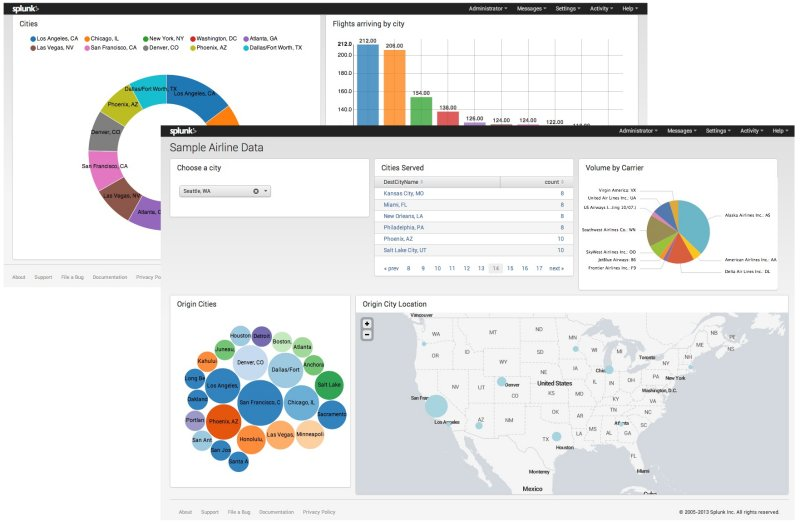
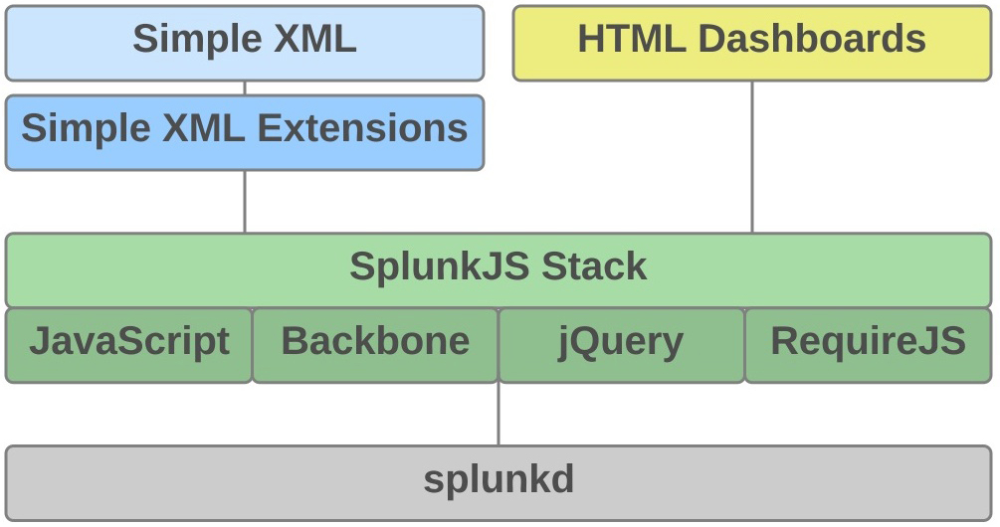
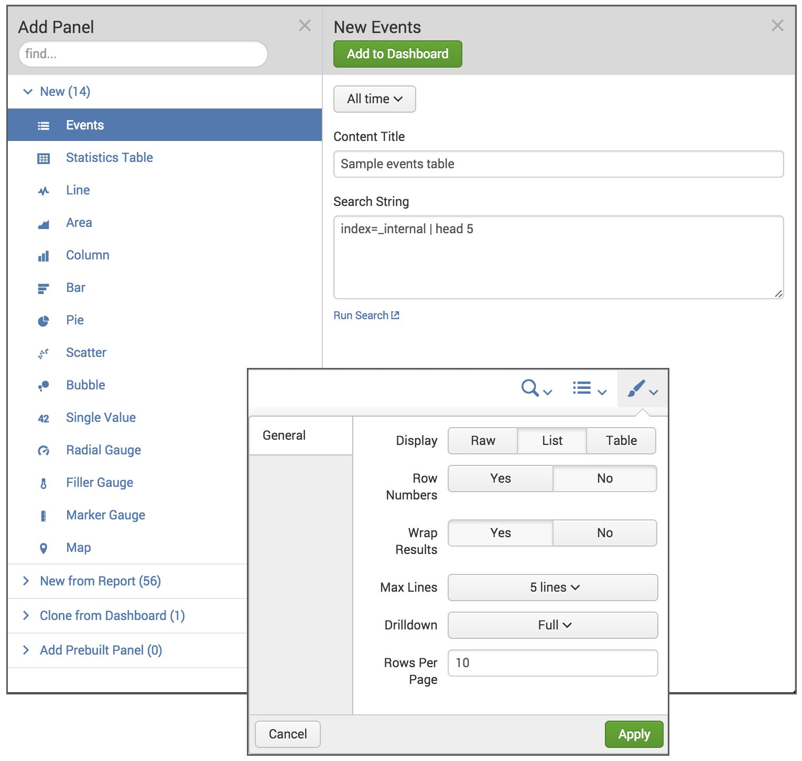
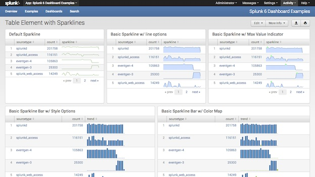

# Splunk Web Framework를 사용하여 대시 보드 및 시각화 생성

- Splunk Web Framework는 테이블, 차트, 양식 검색 및 기타 기능을 사용하여 사용자 지정 대시 보드 및 Splunk 앱을 만들려는 Splunk 사용자를 위한 앱 프레임워크.
- Splunk는 사용하기 쉬운 GUI(클릭 앤 드래그 도구 포함)부터 JavaScript 개발자를 위한 일련의 백본 모델에 이르기까지 다양한 개발 도구를 제공.

## Architecture

Splunk Web Framework는 핵심 Splunk 서버 인 splunkd 위에 구축 된 기능 스택을 제공. Splunk Search와 같은 앱과 함께 Splunk Web에서 실행되는 앱을 구축 할 수 있지만 Splunk와 상호 작용하지만 자체 웹 서버에서 실행되는 사용자 지정 앱을 구축 가능.

## Simple XML 레이어 도구

스택의 Simple XML 계층은 프로그래밍 지식이 필요없고 Splunk 웹 UI에서 사용할 수있는 사용하기 쉬운 도구를 제공.

### 대시 보드 편집기

Dashboard Editor는 WYSIWYG 클릭 앤 드래그 인터페이스로 Splunk Web 내에서 대시 보드를 구축  가능. 드롭 다운 목록, 확인란 및 라디오 단추와 같은 양식 컨트롤과 함께 테이블 및 차트와 같은보기가있는 패널을 추가  가능. 대시 보드 편집기는 패널,보기 및 양식을 수정할 수있는 편집 도구도 제공.

### Simple XML

Splunk의 확장 가능한 마크 업 언어 인 Simple XML은 대시 보드 편집기를 사용하여 만든 대시 보드의 기본 소스 코드입니다. 대시 보드 편집기를 사용하여 가장 일반적인 기능으로 작업 할 수 있지만 일부 기능은 Simple XML 코드로 작업해야만 사용 가능.
Simple XML을 편집하려면 Splunk Enterprise에서 소스 편집기를 사용하거나 Splunk Enterprise 설치에서 소스 파일에 액세스 할 수있는 경우 자체 텍스트 편집기를 사용 가능.

## Simple XML 확장 계층 도구

스택의 Simple XML Extensions 계층은 친숙한 웹 개발자 환경에서 대시 보드 및 앱을 추가로 사용자 정의하려는 다양한 수준의 전문 지식을 갖춘 웹 개발자를 위한 것. 각 계층은 SplunkJS 스택 (JavaScript 및 JavaScript 라이브러리의 웹 스택)에 액세스하며 검색 관리자 및 시각화를 위한 사전 구축 된 구성 요소 포함.

### Simple XML 확장

확장을 사용하여 대시 보드 편집기 또는 Simple XML을 사용하여 작성된 대시 보드의 모양과 동작을 수정하십시오. 확장은 앱에 추가 한 다음 대시 보드의 Simple XML 코드에서 참조하는 CSS 및 JavaScript 파일.

### SplunkJS Stack 라이브러리

SplunkJS Stack 라이브러리를 웹 사이트에 추가하여 모든 Splunk Web Framework 구성 요소를 사용하여 Splunk 데이터를 상호 작용하고 볼 수 있도록하여 SplunkJS Stack 라이브러리를 웹 서버에서 실행되는 자체 웹 응용 프로그램에 통합.

### HTML 대시 보드

레거시 기능

## Splunk Web Framework

Splunk Web Framework는 Splunk Enterprise 6이상에 포함되어 있으므로 시작하기 위해 아무것도 다운로드 하거나 설치할 필요가 없음. Splunk Web Framework에는 몇 가지 구성 요소가 있음. 사용하는 구성 요소는 수행하려는 작업과 이미 알고 있는 정도에 따라 다름.

<table>

<tr><td></td><td>대시 보드 편집기</td><td>Simple XML 소스 코드</td><td>Simple XML 확장</td><td>SPLUNKJS Stack 라이브러리</td></tr>
<tr><td>사용 사례</td><td>대시 보드 생성 및 수정</td><td>기존 대시 보드에 고급 기능 추가</td><td>대시 보드에 사용자 정의 스타일 및 로직 추가</td><td>Splunk 구성 요소를 자체 웹 사이트 응용 프로그램에 통합</td></tr>
<tr><td>기술</td><td>없음</td><td>XML</td><td>CSS
HTML
자바 스크립트</td><td>CSS
HTML
자바 스크립트</td></tr>
<tr><td>혜택</td><td>드래그 앤 드롭 UI
PDF 생성</td><td>드래그 앤 드롭 UI
PDF 생성
추가 레이아웃 옵션
추가 기능</td><td>드래그 앤 드롭 UI
PDF 생성
완벽하게 사용자 정의 가능한
타사 라이브러리</td><td>완벽하게 사용자 정의 가능한
타사 라이브러리
Splunk Web 외부에서 실행</td></tr>
<tr><td>단점</td><td>제한된 레이아웃
제한된 기능</td><td>제한된 레이아웃
제한된 기능</td><td>없음</td><td>끌어서 놓기 UI
없음 PDF 생성 없음</td></tr>
<tr><td>시작하다</td><td>대시 보드 편집기 정보</td><td>Simple XML 편집 정보</td><td>Simple XML 확장을 사용하여 대시 보드 수정</td><td>자신의 웹 앱에서 SplunkJS Stack 사용</td></tr>
</table>

## Splunk Enterprise 앱

Splunk는 시작하는 데 도움이되는 Splunk Web Framework의 다양한 기능을 보여주는 앱을 제공.

### Splunk 7.x 대시 보드 예

[Splunk 7.x 대시 보드 예제 앱](https://splunkbase.splunk.com/app/1603/)에는 기본 기능과 고급 사용자 지정에 Simple XML을 사용하는 방법을 보여주는 예제 대시 보드 및 샘플 코드가 포함. 예는 테이블 및 차트 사용에서 레이아웃, 시각화 및 상호 작용의 사용자 정의를위한 간단한 XML 확장 예제에 이르기까지 다양.
