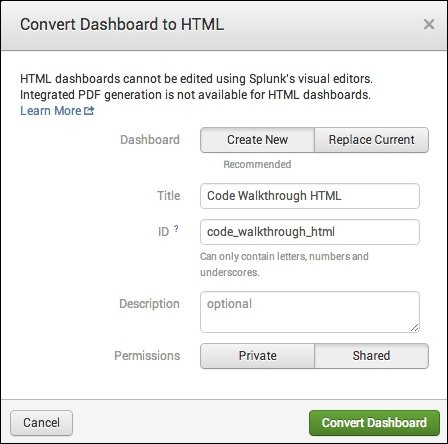
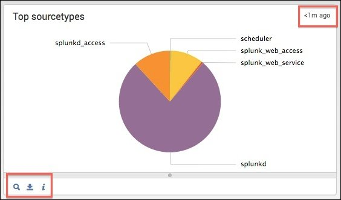

# Splunk Web Framework

## Splunk Web Framework 사용

- Splunk Web Framework는 Splunk App용 대시보드 및 시각화를 개발할 수 있는 도구를 제공.
- Splunk의 확장 가능한 마크업 언어인 Simple XML은 기본 제공 대시보드 편집기를 사용하여 만든 대시보드의 기본 소스 코드.
- Dashboard Editor 및 Simple XML 작업에 대한 자세한 내용은 Splunk Enterprise 설명서 의 [Dashboards and Visualizations](https://docs.splunk.com/Documentation/Splunk/latest/Viz) 매뉴얼을 참조.

Splunk와 프로그래밍 방식으로 상호작용하도록 친숙한 웹 개발자 환경에서 대시보드 및 App을 추가로 사용자 정의하려는 개발자인 경우 Simple XML 확장을 사용하여 SplunkJS Stack에서 작업.

- Simple XML 확장을 사용하여 대시보드의 모양과 동작을 수정하십시오. 확장은 앱에 추가한 다음 대시보드의 Simple XML 코드에서 참조하는 CSS 및 JavaScript 파일.
- SplunkJS Stack은 검색 및 시각화를 위한 사전 빌드된 구성 요소가 포함된 JavaScript 및 JavaScript 라이브러리의 Web Stack.

### 사용자 지정 Splunk App 및 대시보드를 개발하기위한 다음 주요 기능

- Simple XML 확장
- SplunkJS Stack
- Search Manager는 Splunk 검색 작업, 저장된 보고서 및 사후 프로세스 검색에 해당.
- Splunk View 는 Simple XML 시각화에 해당하며 데이터를 시각화하고 양식 입력을 수락하며 검색을 제어하는 ​​데 사용.
- 토큰을 사용하여 데이터 바인딩은 Search 및 view에서 값을 함께 바인드하여 동기화 되도록하는 편리한 메커니즘을 제공.
- 드릴다운 작업을 통해 사용자가 View를 클릭 할 때 드릴다운 동작을 사용자 지정 가능.
- Splunk 대시보드 스타일은 HTML 대시보드에서 레이아웃에 사용.
- Navigation을 사용하면 앱의 Navigation 표시줄에 링크와 메뉴를 추가 가능.

## SplunkJS Stack 정보

Splunk Web Framework에는 친숙한 JavaScript 환경에서 Splunk App을 만들려는 웹 개발자를 위한 SplunkJS Stack 구성 요소가 포함. 이 Web Stack에는 Splunk App을 만드는 데 도움이 되는 여러 도구가 포함.

- 검색 작업 및 Splunk 데이터와의 상호작용을 위한 Splunk View용 라이브러리 및 Search Manager
- Backbone.js 는 코드 구조로 MVC 프레임 워크를 제공.
- RequireJS 는 종속성을 관리.
- jQuery 는 DOM(Document Object Model)을 관리하는 데 도움.

따라서 SplunkJS Stack을 자주 사용하는 개발 도구와 함께 사용하면 풍부한 대화형 App을 구축하여 Splunk 데이터에 액세스하고 조작. 앱에 Third-party Visualization을 추가하고 재사용할 수 있는 View를 생성 가능

### Splunk Enterprise에서 실행할 Splunk App 만들기

SplunkJS Stack을 사용하여 Splunk Enterprise의 Splunk Web에 나타나는 앱인 Splunk App을 개발. Splunk의 Web Server를 사용하여 splunkd와 상호작용하여 데이터를 HTML 페이지로 렌더링. 또한 Splunk의 내장 Navigation 막대 및 헤더를 사용하면 Splunk와 동일한 모양과 느낌을 앱에 제공.

SplunkJS Stack을 시작하여 Splunk App을 만들려면 :

- 바로 다이빙할 [앱 만들기](https://dev.splunk.com/enterprise/docs/developapps/createapps/createsplunkapp)를 참조.
- Splunk Web Framework의 다양한 기능을 보여주는 단계별 예제는 [자습서](https://dev.splunk.com/enterprise/tutorials) 참조.
- 참고 항목 [코드 예제](https://dev.splunk.com/enterprise/docs/developapps/webframework/codeexamplefw)를 Simple XML 확장의 전체 코드 예제를 참조.
  
### 자신의 Web App에 SplunkJS Stack 추가

Web Framework Search Manager 및 Splunk View를 사용하여 Splunk와 상호작용하고 데이터를 표시하려면 SplunkJS Stack 라이브러리를 고유한 Web App에 추가. 다운로드에서 SplunkJS Stack을 다운로드.

자세한 내용은 다음 주제를 참조.

- 자신의 Web App에서 SplunkJS Stack 사용
- 라이브러리 로드 및 SplunkJS 구성
- Splunk 서버와 통신
- 사용자 인증
- SplunkJS Stack을 사용하여 자신의 Web App에 Splunk를 추가하는 방법
- Splunk Web 외부의 App을위한 SplunkJS Stack의 코드 예제

### SplunkJS Stack Search Manager 및 보기 개요

Simple XML이 시각화 요소 및 양식 모음을 제공하는 것처럼 Splunk Web Framework의 SplunkJS Stack 구성 요소는 JavaScript로 액세스 할 수 있는 Search Manager 및 View 모음을 제공. 따라서 Simple XML 대시보드를 HTML로 변환하면 모든 Simple XML 시각화가 SplunkJS Stack과 동등한 것으로 변환.

#### Search Manager

SplunkJS Stack에서 Search Manager를 사용하여 데이터를 표시하는 시각화와 별도로 검색을 정의하고 관리. Search Manager는 검색 쿼리 및 검색 속성을 포함하는 검색 작업을 캡슐화하고 검색 작업 및 수명을 처리. Search Manager의 유형은 검색 유형에 따라 다름.

- SearchManager는 INLINE SEARCH에 해당.
- SavedSearchManager는 SAVED REPORT에 해당.
- PostProcessManager는 POST-PROCESS 검색에 해당.

각 Search Manager에는 고유한 ID 있음. 검색을 특정 시각화에 연결하려면 시각화 `managerid`속성을 검색 `id`값으로 설정.

다음은 SplunkJS Stack이 JavaScript에서 Search Manager를 정의하는 방법에 대한 예.

```js
    var mysearch = new SearchManager({
        id: "search1",
        preview: true,
        cache: true,
        status_buckets: 300,
        search: "index=_internal | head 1000 | stats count by sourcetype"
    });
```

Search Manager를 사용하는 방법에 대한 자세한 내용은 Search Manager를 사용하여 검색 추가를 참조. Search Manager 및 해당 속성에 대한 참조 정보는 [Splunk Web Framework 구성 요소](https://docs.splunk.com/Documentation/WebFramework)를 참조.

#### Views

SplunkJS Stack에서 시각화는 속성이 있는 View로 정의. Search가 View에 바인딩된 경우 `managerid`속성은 사용할 검색을 나타냄.

다음은 SplunkJS Stack이 JavaScript에서 차트 보기를 정의하는 방법에 대한 예.

```js
    var mychart = new ChartView ({
        id: "chart1",
        managerid: "search1",
        type: "bar",
        el: $("#mychart")
    }).render();
```

View 작업 방법에 대한 자세한 내용은 Splunk View로 데이터 표시를 참조. View 및 해당 속성에 대한 참조 정보는 [Splunk Web Framework 구성 요소](https://docs.splunk.com/Documentation/WebFramework)를 참조.

## 라이브러리, 구성 요소 및 종속성 로드

SplunkJS Stack은 RequireJS 와 함께 AMD (Asynchronous Module Definition) 형식을 사용하여 종속성을 로드. Simple XML로 작업 할 때 Splunk View 및 Search Manager를 인스턴스화하려면 SplunkJS Stack 라이브러리 및 구성 요소에 대한 요구 사항을 수동으로 추가.

SplunkJS Stack을 사용하려면 다음과 같이 `"splunkjs/mvc/simplexml/ready!"` 로더 스크립트를 `require`명령문에 추가.

```js
require(["splunkjs/mvc/simplexml/ready!"], function() { . . . });
```

이 스크립트는 SplunkJS Stack 라이브러리를 로드한 다음 완료된 후에 (스크립트는 값을 반환하지는 않지만)반환.

View 및 Search Manager와 같은 구성 요소를 인스턴스화 하려면 다음과 같이 개별 구성 요소 각각에 대한 요구 사항을 추가.

```js
require([
    componentpath_1,
    componentpath_2,
    componentpath_n,
    "splunkjs/mvc/simplexml/ready!"
], function() { . . . });
```

각 구성 요소의 라이브러리 경로는 Splunk Web Framework 구성 요소 참조를 참조.

그런 다음 반환된 객체의 변수를 requirements에서 선언된 순서대로 함수 인수로 추가. 때문에 `ready!`로더 스크립트가 값을 반환하지 않음, 당신은 요구 사항의 끝 부분에 이 문을 추가하고, 함수 인수에서 그것을 생략:

```js
require([
    componentpath_1,
    componentpath_2,
    componentpath_n,
    "splunkjs/mvc/simplexml/ready!"
], function(
    object_1,
    object_2,
    object_n,
) { . . . });
```

### 예

이 예는 차트와 Search Manager를 로드하는 방법

```js
require([
    "splunkjs/mvc/searchmanager",
    "splunkjs/mvc/chartview",
    "splunkjs/mvc/simplexml/ready!"
], function(
    SearchManager,
    ChartView
) {

    // Create search managers
    new SearchManager({
        id: "search1",
        earliest_time: "-24h@h",
        latest_time: "now",
        search: "index=_internal | stats count by sourcetype"
    });


    // Instantiate views
    new ChartView({
        id: "chart1",
        managerid: "search1",
        "type": "line",
        el: $("#chart1")
    }).render();

});
```

이미 인스턴스화 된 Splunk View 또는 Search Manager 인스턴스를 사용하려면 개별 구성 요소를 로드할 필요는 없지만 구성 요소 "splunkjs/mvc"에 액세스하려면 라이브러리 요구 사항을 추가. 다음 예제는 이벤트 패널로 이미 인스턴스화 된 `EventsViewer`보기의 속성을 수정하는 방법.

```js
require([
    "splunkjs/mvc",
    "splunkjs/mvc/simplexml/ready!"
], function(mvc) {

    // Get the Events table
    var myEventsTable = mvc.Components.get('myevents');

    // Programmatically change a property in the Events table
    myEventsTable.getVisualization(function(eventsView) {
        eventsView.settings.set("count", 2);
    });
});
```

## Simple XML 확장을 사용하여 대시보드 수정

- 앱에 추가하는 CSS 스타일시트 및 JavaScript 파일인 Simple XML 확장을 사용하여 대시보드에 사용자 정의 기능을 추가 가능.
- 레이아웃을 수정하고 새 시각화를 추가하며 대시보드의 동작을 사용자 정의.
- 확장을 사용하면 원래 대시보드를 계속 사용할 수 있으며 내장된 대시보드 편집기 및 PDF 생성 기능을 계속 사용.

대시보드에서 JavaScript 라이브러리 또는 CSS에 Simple XML 확장을 사용하면 Splunk Enterprise 인스턴스를 업그레이드하여 공유한 사람이나 다른 사람이 대시보드를 손상시킬 위험이 있음. 이러한 종속성은 Splunk Enterprise에 동적으로 연결되어 있으며 CSS 또는 JavaScript 라이브러리에 대한 변경 내용이 Splunk Enterprise 변경 사항과 호환되지 않을 수 있기 때문. 이러한 불일치는 찾아서 수정하기가 매우 어려움.

### 확장을 추가하려면

정적 CSS 및 JavaScript 자원 파일의 경우 `$SPLUNK_HOME/etc/apps/app_name/`아래에 `/appserver/static/` 디렉토리를 앱에 추가. "barebones" 템플리트를 사용하여 App을 작성할 때 이 디렉토리는 기본적으로 작성되지 않음. 이 디렉토리를 앱에 추가한 후 Splunk Enterprise를 다시 시작.

그런 다음 Simple XML에 확장을 추가하려면 다음을 수행.

- 대시보드 소스 코드 편집
- 계단식 스타일시트 추가
- 자바 스크립트 확장 만들기

#### 대시보드 소스 코드 편집

확장을 사용하려면 대시보드의 Simple XML 소스 코드를 편집.

Splunk Enterprise에서 Simple XML 소스 코드를 편집하려면 대시보드에서 편집을 클릭 한 다음 소스를 클릭.

Simple XML 소스 코드를 직접 편집하려면 텍스트 편집기에서 소스 파일 오픈. 파일 위치는 대시보드에 설정 한 권한에 따라 다름.

개인 : `$SPLUNKHOME/etc/apps/users/admin/<app_name>/local/data/ui/views/_dashboard_name.xml`
앱에서 공유 : `$SPLUNK HOME/etc/apps/<app_name>/local/data/ui/views/_dashboard_name .xml`

다음과 같이 대시보드 소스 코드에서 CSS 및 JavaScript 확장 파일에 대한 참조를 추가.

```html
<dashboard script="filename.js" stylesheet="filename.css">
```

JavaScript를 사용하여 대시보드에서 시각화 또는 양식 입력에 액세스하려면 먼저 대시보드의 소스 코드에서 시각화 또는 양식 입력에 컴포넌트 ID를 추가한 후 JavaScript에서이 ID를 사용.

이 형식을 사용하여 Simple XML 소스 코드에 ID를 추가. 여기서 component 는 차트, 테이블, 맵, 텍스트 입력 등과 같은 시각화에 해당.

```html
    <component id="component_id">
```

Simple XML의 시각화 및 양식 입력에 대한 자세한 내용은 대시보드 및 시각화 매뉴얼 의 [Simple XML Reference](https://docs.splunk.com/Documentation/Splunk/latest/Viz/PanelreferenceforSimplifiedXML)를 참조.

#### 계단식 스타일시트 추가

CSS (Cascading Style Sheet)를 사용하려면 CSS 파일을 앱의 `$SPLUNK_HOME/etc/apps/<app_name>/appserver/static/`디렉토리에 추가.

#### 자바 스크립트 확장 만들기

Simple XML 용 JavaScript 확장은 SplunkJS Stack을 기반으로 하며 JavaScript에서 View 및 Search Manager 구성 요소를 사용하여 Simple XML 대시보드에서 시각화를 작성하고 수정 가능. SplunkJS Stack에 대한 자세한 내용은 [SplunkJS Stack Search Manager 및 View 개요](https://dev.splunk.com/enterprise/docs/developapps/webframework/usewebframework/aboutsplunkjsstack)를 참조.

SplunkJS Stack 라이브러리를 사용 "splunkjs/mvc/simplexml/ready!" 하려면 필요한 구성 요소 및 종속성을 로드하는 스크립트 를 사용. SplunkJS Stack 구성 요소 로드에 대한 자세한 내용은 라이브러리, 구성 요소 및 종속성 로드를 참조.

JavaScript를 사용하여 대시보드를 수정하려면

- 앱의 `$SPLUNK_HOME/etc/apps/<app_name>/appserver/static/`디렉토리에 JavaScript 파일을 작성.
- SplunkJS Stack 라이브러리를 로드하려면 명령문에 ready!로더 스크립트를 추가 `require`.

    ```js
    require([
        "splunkjs/mvc/simplexml/ready!"
    ], function() {

        . . .

    });
    ```

    때문에 `ready!`문은 값을 반환하지 않음, 당신은 요구 사항의 끝을 호출하고 함수의 인수를 생략 가능.

- 기존 컴포넌트에 액세스하려면 "splunkjs/mvc" 라이브러리를 로드하고 다음과 같이 `splunkjs.mvc.Components.get()` , `settings.get()` 및 `settings.set()` 메소드를 사용.

    ```js
    require([
        "splunkjs/mvc",
        "splunkjs/mvc/simplexml/ready!"
    ], function(mvc) {

        . . .

        // Get the component using the ID you added to the Simple XML tag
        var componentInstance = splunkjs.mvc.Components.get("component_id");

        // Get a property
        componentInstance.settings.get("property_name");

        // Set a property
        componentInstance.settings.set("property_name", "new_value");
        . . .

    });
    ```

- JavaScript를 사용하여 시각화 또는 양식 입력을 인스턴스화 하려면 해당 Splunk View 및 선택적으로 Search Manager를 인스턴스화. 구성 요소 라이브러리를 `require`명령문에 추가하고 다음 형식을 사용하여 구성 요소를 인스턴스화.

    ```js
    require([
        "splunkjs/mvc/component",
        "splunkjs/mvc/simplexml/ready!"
    ], function(component) {

        // Instantiate the component
        new componentInstance({
            id: component_id,
            managerid: search_manager_id, // optional
            el: $("#element_location_id")
        }).render();

    });
    ```

    >> 중요 사항 함수 인수는 require명령문에 표시된 순서대로 배치. 그렇지 않으면 동일한 순서를 유지하지 않으면 오류가 표시되지 않지만 대시보드는 작동하지 않음. "splunkjs/mvc/simplexml/ready!" 당신은 요구 사항의 끝을 호출하고 함수의 인수를 생략 할 수 있도록 문은 값을 반환하지 않음.

    ```js
    /* The order of requirements and function arguments must match */
    require([
        "splunkjs/mvc/component_A",
        "splunkjs/mvc/component_B",
        "splunkjs/mvc/simplexml/ready!"
    ], function(
        component_A,
        component_B
    ) {
        . . .
    });
    ```

다음 단계:

- Search Manager 작업에 대한 자세한 내용은 Search Manager를 사용한 검색 추가를 참조.
- View 작업에 대한 자세한 내용은 Splunk View로 데이터 표시를 참조.
- 각 구성 요소의 라이브러리 경로, 속성 및 코드 예제는 Splunk Web Framework 구성 요소 참조를 참조.

### 예제

다음은 이벤트 테이블이 있는 대시보드 확장의 예이며, 이벤트 테이블 속성을 수정하고 클릭 이벤트에 응답하는 방법.

#### 대시보드의 예제 코드

아래 코드는 대시보드 편집기를 사용하여 만든 대시보드 용 코드. 소스 코드는 `example.js` 확장 파일에 대한 참조를 추가하고, 메시지를 표시하는 HTML 패널을 추가하고, `<event>`태그에 ID를 추가하여 수정.

```xml
<dashboard script="example.js">
  <label>Example</label>
  <description>A Simple XML dashboard using extensions</description>
  <row>
    <panel>
      <html>
        Click a row in the table to trigger a click event
        <br/><br/>
        <div id="message"/>
      </html>
    </panel>
  </row>
  <row>
    <panel>
      <title>Events table</title>
      <event id="myevents">
        <title>Top 5 results from index = _internal</title>
        <search>
          <query>index=_internal | head 5</query>
          <earliest>0</earliest>
        </search>
        <option name="list.drilldown">outer</option>
        <option name="list.wrap">1</option>
        <option name="maxLines">5</option>
        <option name="raw.drilldown">outer</option>
        <option name="rowNumbers">0</option>
        <option name="table.drilldown">all</option>
        <option name="table.wrap">1</option>
        <option name="type">list</option>
        <option name="wrap">true</option>
        <option name="dataOverlayMode">none</option>
        <option name="count">2</option>
        <fields>["host","source","sourcetype"]</fields>
      </event>
    </panel>
  </row>
</dashboard>
```

#### JavaScript 확장의 예제 코드

이 JavaScript 예제는 myeventsID를 사용하여 이벤트 테이블에 액세스하고 , "count"특성을 변경하고 , 이벤트 테이블에서 클릭 이벤트에 응답 하는 방법을 보여줍니다 .

```js
/* example.js */
require([
    "splunkjs/mvc",
    "splunkjs/mvc/simplexml/ready!"
], function(mvc) {

    // Get the Events table
    var myEventsTable = mvc.Components.get('myevents');

    // Programmatically change a property in the Events table
    myEventsTable.getVisualization(function(eventsView) {
        eventsView.settings.set("count", 2);
    });

    // Respond to a click event
    myEventsTable.on("click", function(e) {
        // Prevent drilldown from redirecting away from the page
        e.preventDefault();

        // Console feedback
        console.log("Click!");

        // Use jQuery to fill in the text in the HTML's <div> tag
        $('#message').text("Clicked!");
    });
});
```

다양한 Splunk View 및 Search Manager를 인스턴스화하고, 토큰을 사용하고, 드릴다운 조치를 수정하고, 이벤트에 응답하는 방법을 보여주는 Simple XML 확장에 대한 엔드 투 엔드 코드 예제는 Splunk Web Framework를 사용한 코드 예제를 참조.

## Simple XML 대시보드를 HTML로 변환

>> Splunk는 Simple XML 대시보드를 HTML로 변환하지 않는 것이 좋음. 이 문서는 레거시 앱용으로 제공.
기존 Simple XML 대시보드를 HTML로 변환하여 Splunk Web Framework의 도구, 유연성 및 기능을 활용. 이를 통해 수정할 수 있는 자동 생성 코드로 시작. HTML 및 JavaScript에서 직접 작업함으로써 Simple XML에서 할 수 있는 것 이상의 대시보드를 사용자 정의 할 수 있음.

- 시각화 레이아웃을 변경.
- 대시보드에 서식 및 사용자 정의 CSS를 추가하고 이미지 및 HTML로 할 수 있는 모든 작업을 추가.
- Splunk 시각화를 추가하고 사용자 정의.
- 드릴다운 및 기타 대화형 동작을 사용자 정의.
- 타사 시각화와 통합.

이러한 많은 사용자 정의는 Simple XML 확장을 사용하여 수행 가능. 그러나 HTML 대시보드는 다음과 같은 경우에 특히 유용.

- 대시보드 편집기에서 사용하는 패널 및 행 기반 레이아웃보다 고급 레이아웃을 생성.
- 슬라이더 입력 선택기와 같은 고급 입력 컨트롤을 사용.
- 서버 측 로직에 사용자 정의 REST 엔드 포인트를 사용.

대시보드를 HTML로 변환 한 후에는 다른 대시보드와 함께 표시되며 Splunk Web을 사용하여 계속 관리 가능 (예 : 권한 변경). 그러나 Splunk 대시보드를 HTML로 변환하면 다음과 같은 기본 제공 기능이 손실됩니다.

- 내장된 대시보드 편집기를 사용한 대화식 편집
- 통합 PDF 생성 및 예약 된 배송

>> HTML 대시보드는 생성되는 Splunk 버전에 따라 다름. 나중에 Splunk를 업그레이드하면 변환된 대시보드가 작동하지 않을 수 있음.

### Simple XML이 HTML로 변환되는 방법

Simple XML 대시보드는 요소 (예 : 테이블, 차트, 맵, 이벤트 Viewer 및 단일 View) 및 양식 입력 (예 : 라디오 단추, 텍스트 상자, 드롭다운 및 시간 범위 선택기)과 같은 시각화 유형으로 구성.

Simple XML을 HTML로 변환 할 때, 각 Simple XML 시각화는 패널 구현을 포함하는 각 View 주위에 랩퍼와 시각화가 검색에 바인드된 경우 Search Manager와 함께 SplunkJS Stack과 동등한 Splunk View 로 변환. 자동 생성된 HTML에서 각 시각화의 레이아웃, 정의 및 관련 검색은 다음과 같이 구분.

- 레이아웃은 Splunk의 스타일로 변환되어 Bootstrap 의 그리드 시스템 과 유사하게 페이지에 항목을 배치하고 서식을 지정하는 방법을 나타냄.
- 각 시각화의 정의는 JavaScript로 변환. 각 시각화의 코드에는 해당 속성과 자동 생성된 ID가 포함.
- 시각화에 지정된 모든 검색이 추출되어 JavaScript로 표시. 각 검색의 코드에는 해당 속성과 자동 생성된 ID가 포함.

다음은 시각화를 XML에서 HTML로 변환하는 방법을 보여주는 간단한 예. 결과 테이블을 표시하는 검색.

```splunk
index=_internal | head 5 | table host, source
```

이 검색을 대시보드 패널로 저장하면 테이블 및 제목에 대해 작성된 XML은 다음과 같습니다.

```xml
...
<row>
    <table>
        <title>Result table</title>
        <searchString>index=_internal | head 5 | table host, source</searchString>
    </table>
</row>
...
```

HTML로 변환하면 중첩 `<div>`태그를 사용하여 패널이 포함된 행을 정의하는 레이아웃이 생성. 패널은 테이블의 ID ("element1")를 참조하여 테이블이 해당 패널에 표시됨을 나타냄. 표의 제목도 패널에 포함.

```xml
...
<div class="dashboard-row dashboard-row1">
    <div class="dashboard-cell" style="width: 100%;">
        <div class="dashboard-panel clearfix">
            <div class="panel-element-row">
                <!-- Display "element1" in this panel -->
                <div class="dashboard-element table" id="element1" style="width: 100%">
                    <div class="panel-head">
                        <h3>Result table</h3>
                    </div>
                    <div class="panel-body"></div>
                </div>
            </div>
        </div>
    </div>
</div>
...
```

테이블의 정의 및 검색 기능은 JavaScript에서 별도로 정의. 테이블 ID가 레이아웃을 테이블에 연결하는 것처럼 검색ID `("search1")`는 테이블의 `managerid`속성을 통해 테이블을 검색에 연결 JavaScript.

```js
...
var search1 = new SearchManager({
    "id": "search1",               // This is the search ID
    "status_buckets": 0,
    "earliest_time": "$earliest$",
    "search": "index=_internal | head 5 | table host, source",
    "latest_time": "$latest$",
    "cancelOnUnload": true,
    "app": utils.getCurrentApp(),
    "auto_cancel": 90,
    "preview": true
}, {tokens: true, tokenNamespace: "submitted"});
...
var element1 = new TableElement({
    "id": "element1",              // This is the table ID
    "managerid": "search1",        // This connects the table to the search
    "el": $('#element1')
}, {tokens: true}).render();
...
```

이것보다 더 많은 것을 알지 못하면 HTML을 편집하여 간단한 사용자 정의. 예를 들어, 고유한 CSS를 추가하거나 레이아웃을 변경 가능(기본 스타일 및 사용 방법은 Splunk 대시보드 스타일에 설명되어 있지만 이러한 시각화의 동작 및 상호작용 방식을 사용자 지정하려면 작업. JavaScript로 Web Framework 의 SplunkJS Stack 구성 요소에 대해 자세히 학습

### Simple XML 대시보드를 HTML로 변환(2)

대시보드, 특히 "edit_view_html"기능이 있는 역할을 변환하려면 권한. 자세한 내용은 기능이 있는 [역할 정의 정보](https://docs.splunk.com/Documentation/Splunk/latest/Security/Rolesandcapabilities)를 참조.

1. Splunk Web에서 변환하려는 대시보드 오픈.
2. 생략 부호 (...)를 클릭하고 HTML로 변환을 선택.
3. 변환된 대시보드의 속성을 설정.
    
    - 대시보드의 HTML 버전을 작성하려면 새로 작성을 클릭. 또는 기존 대시보드를 바꾸고 덮어 쓰려면 현재 바꾸기를 클릭.

    >> 현재 대시보드를 바꾸면 대시보드의 HTML 버전이 사용자에게 표시되고 Simple XML 버전이 숨겨짐. HTML 파일을 삭제하여 Simple XML 대시보드로 되돌릴 수 있음. 파일 위치는 권한에 따라 다름(아래 참조).
    - 선택적으로 제목, ID (파일 이름), 설명 및 권한을 변경.
4. 대시보드 변환을 클릭.

### HTML 대시보드를 편집

Splunk Enterprise의 내장 소스 편집기를 사용하거나 선택한 텍스트 편집기에서 소스 파일을 열어 변환된 HTML 대시보드를 편집 가능.

#### 소스 편집기 사용

Splunk Enterprise에서 소스 편집기를 사용하려면

1. Splunk Web에서 설정 , 사용자 인터페이스 , 보기 를 차례로 클릭하여 편집하려는 대시보드 선택.
2. 대시보드를 나열하려면 적절하게 앱 컨텍스트 및 소유자 필터를 선택.
3. 목록에서 HTML 대시보드를 찾아 편집을 클릭 한 다음 소스를 클릭 하여 소스 코드를 표시.

모든 앱 에서 대시보드 탭을 클릭하여 대시보드 를 나열.

#### 자신만의 텍스트 편집기를 사용하십시오

선택한 텍스트 편집기에서 HTML 대시보드의 소스 파일을 편집하려면 Splunk 인스턴스의 소스 파일에 액세스. 권한과 액세스를 위해 Splunk 관리자에게 문의해야 가능.

HTML 파일의 위치는 대시보드에 대해 선택한 권한에 따라 다름.

- 개인 : `$SPLUNK_HOME/etc/users/<사용자 이름>/<appname>/local/data/ui/html`
- 공유 : `$SPLUNK_HOME/etc/apps/<appname>/local/data/ui/html`

이 설명서 전체의 절차는 공유 권한의 경로.

### HTML 대시보드에서 시각화를 View로 변환

Simple XML 대시보드에서 각 시각화는 타임 스탬프와 같은 추가 기능과 검색을 열고 결과를 내보내고 검색 작업 관리자를 여는 버튼과 같은 추가 기능을 제공하는 패널 내에 표시.



Simple XML 대시보드가 HTML로 변환 될 때 각 시각화는이 패널 구현을 포함하는 View 주위에 랩퍼가 있는 SplunkJS Stack View로 변환. 추가 패널 구현을 원하지 않으면 랩퍼없이 직접 모든 View를 사용. 또한 Simple XML에서는 사용할 수 없는 여러 SplunkJS Stack보기가 있지만 이를 HTML 대시보드에 추가 가능.

다음 표는 시각화, 시각화가 HTML로 변환될 때 작성되는 Simple XML 랩퍼 이름 및 SplunkJS Stack보기 이름. 일부 Simple XML 랩퍼에는 필요하지 않기 때문에 해당 SplunkJS Stack View가 없음 (예 : 인라인 HTML은 HTML로 변환되어 View가 필요 없음). 일부 View에는 랩퍼가 없음. 패널 내에 표시되지 않음(예 : 헤더).

|VISUALIZATION|SIMPLE XML WRAPPER|SPLUNKJS STACK VIEW|
|:--:|:--:|:--:|
|Chart|ChartElement|ChartView|
|Checkbox|not available in Simple XML|CheckboxView|
|Checkbox group|CheckboxGroupInput|CheckboxGroupView|
|Data template|not available in Simple XML|DataTemplateView|
|Dropdown list|DropdownInput|DropdownView|
|Event table|EventElement|EventsViewerView|
|Layout|no wrapper|LayoutView|
|Inline HTML|HtmlElement|not necessary|
|Link list|LinkListInput|LinklistView|
|List|ListElement|not necessary|
|Map|MapElement|SplunkMapView|
|Multidropdown list|MultiSelectInput|MultiDropdownView|
|Radio buttons|RadioGroupInput|RadioGroupView|
|Result table|TableElement|TableView|
|Search control|not available in Simple XML|SearchControlsView|
|Searchbar|not available in Simple XML|SearchbarView|
|Single|SingleElement|SingleView|
|Submit button|SubmitButton|not necessary|
|Text box|TextInput|TextInputView|
|Time-range picker|TimeRangeInput|TimeRangeView|
|Timeline|not available in Simple XML|TimelineView|

랩퍼 또는 보기 (예 : ChartElement 또는 ChartView)를 사용하든 동일한 방법으로 동일한 특성을 설정하고 검색 할 수 있음. 이러한 View 및 해당 속성에 대한 참조 정보는 Splunk Web Framework 구성 요소 참조.

### HTML 대시보드와 함께 Splunk 대시보드 스타일 사용

HTML 대시보드 (Simple XML에서 변환된)에는 이미 Splunk 대시보드 스타일을 기반으로 자동 생성된 레이아웃이 있음. 이 레이아웃에는 제목과 앱 바가 있는 헤더가 포함. 자동 생성된 HTML 대시보드 스타일 `<div>`은 Simple XML 양식 입력 및 요소에 추가 태그 클래스를 사용. 라디오 버튼 그룹과 제출 버튼의 레이아웃 예.

```xml
    <div class="fieldset">
        <div class="element input-radio" id="field1">
            <label>Label</label>
        </div>
        <div class="input form-submit" id="search_btn">
            <button class="btn btn-primary submit">Search</button>
        </div>
    </div>
```

요소의 경우 레이아웃은 `"panel-element-row"` 및 `"dashboard-element"` `<div>`태그 클래스도 사용. 일반적으로 요소는 패널 구현이 있는 해당 SplunkJS Stack View 주위의 랩퍼. 패널 구현은 전체 컨테이너를 사용하므로 패널 당 하나의 시각화만 표시되며 View의 ID는 `"dashboard-element"`클래스에 배치.

```xml
    <div class="dashboard-row dashboard-row1">
        <div class="dashboard-cell" style="width: 100%;">
            <div class="dashboard-panel clearfix">
                <div class="panel-element-row">
                    <div class="dashboard-element table" id="elementid" style="width: 100%">
                        <div class="panel-head">
                            <h3>Panel Title</h3>
                        </div>
                        <div class="panel-body"></div>
                    </div>
                </div>
            </div>
        </div>
    </div>
```

자세히보기
예를 들어 양식 입력을 "대시 행" `<div>`태그에 배치하거나 Web Framework 앱에 대해 설명 된 레이아웃을 사용하여 필요에 따라이 레이아웃을 수정.

>> Splunk Enterprise 버전 '6.1.x'에서 HTML 대시 보드 레이아웃을 편집 할 때 알려진 문제로 인해 너비 설정이 무시됩니다. 이 문제를 해결하려면 다음과 같이! important 선언을 사용하십시오.`style = "width : 30 %! important;"`

## 자동 생성된 HTML 대시보드 코드 연습

>> Splunk는 Simple XML 대시보드를 HTML로 변환하지 않는 것이 좋음. 이 문서는 레거시 앱용으로 제공.

Simple XML 대시보드를 HTML로 변환하면 HTML 및 JavaScript가 포함된 대시보드에 대한 코드가 자동 생성. 이 주제에서는 변환된 대시보드에 대해 자동 생성된 코드의 각 섹션을 살펴보고 해당 기능을 설명.

먼저 결과 테이블을 표시하는 다음 검색을 사용하여 변환할 대시보드를 작성.

1. Splunk Web의 모든 앱에서 다음 검색을 실행하십시오.

    ```sql
    index=_internal | head 5 | table host, source
    ```

2. 다른 이름으로 저장 > 대시보드 패널을 클릭.
3. Enter를 누르 대시보드 ID를 (예 : "예"로), 클릭 저장 , 클릭한 다음 View 대시보드 .
4. 클릭 ... , 다음을 클릭 HTML로 변환을 한 후 클릭 Convert 대시보드.
5. 자동 생성 코드를 보려면 HTML 편집을 클릭.

이 코드의 흥미로운 부분을 다음 기본 섹션으로 분류

- 스타일시트 및 URL 접두사
- Layout
- Library 요구 사항
- 토큰
- Search Manager
- 머리글, 바닥글 및 대시보드 편집기
- Views
- 데이터 제출 및 대시보드 준비

### 섹션 1 : 스타일시트 및 URL 접두사

```xml
<!DOCTYPE html>
<html lang="en">
<head>
    <meta charset="utf-8" />
    <meta http-equiv="X-UA-Compatible" content="IE=edge" />
    <title>example HTML</title>
    <link rel="shortcut icon" href="{{SPLUNKWEB_URL_PREFIX}}/static/img/favicon.ico" />
        <link rel="stylesheet" type="text/css" href="/en-US/static/@387cc49a8ed8/css/build/bootstrap.min.css" />
        <link rel="stylesheet" type="text/css" href="/en-US/static/@387cc49a8ed8/css/build/pages/dashboard-simple-bootstrap.min.css" />
    <link rel="stylesheet" type="text/css" media="all" href="{{SPLUNKWEB_URL_PREFIX}}/static/app/search/dashboard.css" />
</head>
```

- 이 `<head>` 섹션은 Bootstrap 및 Splunk의 대시보드 스타일을 포함하여 서식 및 레이아웃을위한 스타일시트로 연결.
- 자리표시 `{{SPLUNKWEB_URL_PREFIX}}`자는 모든 내부 URL의 접두사에 사용. 대시보드가 렌더링되면이 자리 표시자가 사용자의 locale을 포함하여 올바른 URL로 바뀜

여기에서 자신만의 스타일시트에 대한 링크를 삽입하고 `<style>`페이지 스타일을 정의하려는 경우 섹션을 삽입 할 수 있음.

### 섹션 2 : 레이아웃

```xml
<body class="simplexml preload locale-en">
<!-- 
BEGIN LAYOUT
This section contains the layout for the dashboard. Splunk uses proprietary
styles in <div> tags, similar to Bootstrap's grid system. 
-->
<header>
<a class="navSkip" href="#navSkip" tabindex="1">Screen reader users, click here to skip the navigation bar</a>
<div class="header splunk-header">
        <div id="placeholder-splunk-bar">
            <a href="{{SPLUNKWEB_URL_PREFIX}}/app/launcher/home" class="brand" title="splunk > listen to your data">splunk<strong>></strong></a>
        </div>
            <div id="placeholder-app-bar"></div>
</div>
<a id="navSkip"></a>
</header>
<div class="dashboard-body container-fluid main-section-body" data-role="main">
    <div class="dashboard-header clearfix">
        <h2>example HTML</h2>
    </div>

    <div id="row1" class="dashboard-row dashboard-row1">
        <div id="panel1" class="dashboard-cell" style="width: 100%;">
            <div class="dashboard-panel clearfix">
                <div class="panel-element-row">
                    <div id="element1" class="dashboard-element table" style="width: 100%">
                        <div class="panel-body"></div>
                    </div>
                </div>
            </div>
        </div>
    </div>
</div>

<!-- 
END LAYOUT
-->
```

이 섹션에는 Splunk 헤더 (Navigation 막대 포함) 및 바닥글을 포함하여 대시보드 패널의 레이아웃이 포함.

레이아웃은 부트 스트랩 스타일과 유사한 Splunk 스타일을 사용하여 생성. Splunk는 중첩 `<div>`태그를 사용하여 그리드 시스템의 행, 열 및 셀 레이아웃으로 컨테이너를 생성. Splunk의 대시보드 모양과 느낌을 유지하려면 Splunk 대시보드 스타일에서 이러한 스타일을 사용하는 방법.

그러나 이러한 스타일이나 레이아웃을 전혀 사용할 필요는 없음. 원하는 대로 페이지 서식을 지정 가능. 예를 들어 테이블과 제목만 표시한다고 가정. 최소한 테이블 ID를 페이지의 태그와 연결해야 하므로 위의 전체 섹션을 다음과 같이 바꿀 수 있음.

```xml
<body class="simplexml preload">
<p id="element1" />
```

### 섹션 3 : 라이브러리 요구 사항

```js
<script src="{{SPLUNKWEB_URL_PREFIX}}/config?autoload=1"></script>
<script src="{{SPLUNKWEB_URL_PREFIX}}/static/js/i18n.js"></script>
<script src="{{SPLUNKWEB_URL_PREFIX}}/i18ncatalog?autoload=1"></script>
<script src="{{SPLUNKWEB_URL_PREFIX}}/static/build/simplexml/index.js"></script>
<script type="text/javascript">
// <![CDATA[
// <![CDATA[

//
// LIBRARY REQUIREMENTS
//
// In the require function, we include the necessary libraries and modules for
// the HTML dashboard. Then, we pass variable names for these libraries and
// modules as function parameters, in order.
//
// When you add libraries or modules, remember to retain this mapping order
// between the library or module and its function parameter. You can do this by
// adding to the end of these lists, as shown in the commented examples below.

require([
    "splunkjs/mvc",
    "splunkjs/mvc/utils",
    "splunkjs/mvc/tokenutils",
    "underscore",
    "jquery",
    "splunkjs/mvc/simplexml",
    "splunkjs/mvc/layoutview",
    "splunkjs/mvc/simplexml/dashboardview",
    "splunkjs/mvc/simplexml/dashboard/panelref",
    "splunkjs/mvc/simplexml/element/chart",
    "splunkjs/mvc/simplexml/element/event",
    "splunkjs/mvc/simplexml/element/html",
    "splunkjs/mvc/simplexml/element/list",
    "splunkjs/mvc/simplexml/element/map",
    "splunkjs/mvc/simplexml/element/single",
    "splunkjs/mvc/simplexml/element/table",
    "splunkjs/mvc/simpleform/formutils",
    "splunkjs/mvc/simplexml/eventhandler",
    "splunkjs/mvc/simplexml/searcheventhandler",
    "splunkjs/mvc/simpleform/input/dropdown",
    "splunkjs/mvc/simpleform/input/radiogroup",
    "splunkjs/mvc/simpleform/input/linklist",
    "splunkjs/mvc/simpleform/input/multiselect",
    "splunkjs/mvc/simpleform/input/checkboxgroup",
    "splunkjs/mvc/simpleform/input/text",
    "splunkjs/mvc/simpleform/input/timerange",
    "splunkjs/mvc/simpleform/input/submit",
    "splunkjs/mvc/searchmanager",
    "splunkjs/mvc/savedsearchmanager",
    "splunkjs/mvc/postprocessmanager",
    "splunkjs/mvc/simplexml/urltokenmodel"
    // Add comma-separated libraries and modules manually here, for example:
    // ..."splunkjs/mvc/simplexml/urltokenmodel",
    // "splunkjs/mvc/checkboxview"
    ],
    function(
        mvc,
        utils,
        TokenUtils,
        _,
        $,
        DashboardController,
        LayoutView,
        Dashboard,
        PanelRef,
        ChartElement,
        EventElement,
        HtmlElement,
        ListElement,
        MapElement,
        SingleElement,
        TableElement,
        FormUtils,
        EventHandler,
        SearchEventHandler,
        DropdownInput,
        RadioGroupInput,
        LinkListInput,
        MultiSelectInput,
        CheckboxGroupInput,
        TextInput,
        TimeRangeInput,
        SubmitButton,
        SearchManager,
        SavedSearchManager,
        PostProcessManager,
        UrlTokenModel

        // Add comma-separated parameter names here, for example:
        // ...UrlTokenModel,
        // CheckboxView
        ) {

        var pageLoading = true;
```

이 섹션은 JavaScript 코드를 시작하고 필요한 JavaScript 라이브러리 및 구성 요소를 로드.

이 `require`문은 Simple XML 및 SplunkJS Stack 구성 요소에 대한 라이브러리와 Underscore및 jQuery 라이브러리와 같은 유틸리티를 지정. 모든 Simple XML 랩퍼도 필요.

필요한 경우 추가 라이브러리가 필요할 수 있지만 대부분의 경우이 코드를 그대로 둠. SplunkJS Stack View를 페이지에 추가하려면 `require`섹션에 수동으로 추가 하고 기존 코드를 밟지 않고 매개 변수로 함수에 변수를 추가. 고급 토큰 조작으로 작업하고 싶다고 가정. 새 항목을 쉼표로 구분하여 다음과 같이 TokenForwarder 라이브러리 ("splunkjs/mvc/tokenforwarder"경로)가 필요.

```js
...
require([
    "splunkjs/mvc",
    "splunkjs/mvc/utils",
    "splunkjs/mvc/tokenutils",
    "underscore",
    "jquery",
    "splunkjs/mvc/simplexml",
    "splunkjs/mvc/layoutview",
    "splunkjs/mvc/simplexml/dashboardview",
    "splunkjs/mvc/simplexml/element/chart",
    "splunkjs/mvc/simplexml/element/event",
    "splunkjs/mvc/simplexml/element/html",
    "splunkjs/mvc/simplexml/element/list",
    "splunkjs/mvc/simplexml/element/map",
    "splunkjs/mvc/simplexml/element/single",
    "splunkjs/mvc/simplexml/element/table",
    "splunkjs/mvc/simpleform/formutils",
    "splunkjs/mvc/simpleform/input/dropdown",
    "splunkjs/mvc/simpleform/input/radiogroup",
    "splunkjs/mvc/simpleform/input/multiselect",
    "splunkjs/mvc/simpleform/input/checkboxgroup",
    "splunkjs/mvc/simpleform/input/text",
    "splunkjs/mvc/simpleform/input/timerange",
    "splunkjs/mvc/simpleform/input/submit",
    "splunkjs/mvc/searchmanager",
    "splunkjs/mvc/savedsearchmanager",
    "splunkjs/mvc/postprocessmanager",
    "splunkjs/mvc/simplexml/urltokenmodel",
    "splunkjs/mvc/tokenforwarder"  // Add the view manually
    ],
    function(
        mvc,
        utils,
        TokenUtils,
        _,
        $,
        DashboardController,
        LayoutView,
        Dashboard,
        ChartElement,
        EventElement,
        HtmlElement,
        ListElement,
        MapElement,
        SingleElement,
        TableElement,
        FormUtils,
        DropdownInput,
        RadioGroupInput,
        MultiSelectInput,
        CheckboxGroupInput,
        TextInput,
        TimeRangeInput,
        SubmitButton,
        SearchManager,
        SavedSearchManager,
        PostProcessManager,
        UrlTokenModel,
        TokenForwarder   // Add the parameter manually
) {
...
```

### 섹션 4 : 토큰

```js
    //
    // TOKENS
    //

    // Create token namespaces
    var urlTokenModel = new UrlTokenModel();
    mvc.Components.registerInstance('url', urlTokenModel);
    var defaultTokenModel = mvc.Components.getInstance('default', {create: true});
    var submittedTokenModel = mvc.Components.getInstance('submitted', {create: true});

    urlTokenModel.on('url:navigate', function() {
        defaultTokenModel.set(urlTokenModel.toJSON());
        if (!_.isEmpty(urlTokenModel.toJSON()) && !_.all(urlTokenModel.toJSON(), _.isUndefined)) {
            submitTokens();
        } else {
            submittedTokenModel.clear();
        }
    });

    // Initialize tokens
    defaultTokenModel.set(urlTokenModel.toJSON());

    function submitTokens() {
        // Copy the contents of the defaultTokenModel to the submittedTokenModel and urlTokenModel
        FormUtils.submitForm({ replaceState: pageLoading });
    }

    function setToken(name, value) {
        defaultTokenModel.set(name, value);
        submittedTokenModel.set(name, value);
    }

    function unsetToken(name) {
        defaultTokenModel.unset(name);
        submittedTokenModel.unset(name);
    }
```

이 섹션에서는 시각화 및 검색을위한 토큰 네임 스페이스 및 토큰 모델을 설정.

기본 토큰 모델을 사용하는 토큰의 경우 토큰 값이 변경되면 값이 즉시 업데이트.
제출된 토큰 모델을 사용하는 토큰의 경우 토큰 값이 변경되면 변경된 값이 큐에 추가되고 제출될 때까지 값이 업데이트되지 않음.
개별 시각화 및 검색에 사용할 토큰 모델을 지정 가능. 그러나 대부분이 섹션의 코드는 그대로 둠.

토큰 및 사용 방법에 대한 자세한 내용은 토큰으로 데이터 바인딩을 참조.

### 섹션 5 : Search Manager

```js
    //
    // SEARCH MANAGERS
    //
    var search1 = new SearchManager({
        "id": "search1",
        "search": "index=_internal | head 5 | table host, source",
        "earliest_time": "$earliest$",
        "cancelOnUnload": true,
        "latest_time": "$latest$",
        "status_buckets": 0,
        "app": utils.getCurrentApp(),
        "auto_cancel": 90,
        "preview": true,
        "runWhenTimeIsUndefined": false
    }, {tokens: true, tokenNamespace: "submitted"});
```

이 섹션에는 Search Manager가 정의되어 있으며 새 Search Manager를 사용자 정의하고 작성할 수 있음.

- 필요에 따라 속성을 변경 가능. 예를 들어 다음과 같이 최신 검색 시간을 변경 가능.

    ```json
    "latest_time": "now",
    ```

    다양한 유형의 Search Manager 및 설정할 수 있는 속성에 대한 참조는 Splunk Web Framework 구성 요소 참조를 참조.

- 사용할 토큰 모델을 변경 가능. 위 코드에서 제출된 토큰 모델이 사용. 즉, 토큰 값 변경이 제출될 때까지 검색이 다시 실행되지 않음. 기본 토큰 모델을 사용하고 토큰 값이 변경되는 즉시 검색을 실행하려는 경우 다음과 같이 변경 가능.

    ```js
    }, {tokens: true, tokenNamespace: "default"});
    ```

    이름에서 알 수 있듯이 기본 모델은 "default"이므로 명시 적으로 지정하지 않아도됩니다.

    ```js
    }, {tokens: true});
    ```

    Search Manager 를 추가하는 방법 에 대한 자세한 내용은 HTML 대시보드에 Search Manager를 추가하는 방법을 참조.

### 섹션 6 : 레이아웃 및 대시보드 편집기

```js
    //
    // SPLUNK LAYOUT
    //
    $('header').remove();
    new LayoutView({"hideFooter": false, "hideSplunkBar": false, "hideAppBar": false, "hideChrome": false})
        .render()
        .getContainerElement()
        .appendChild($('.dashboard-body')[0]);

    //
    // DASHBOARD EDITOR
    //
    new Dashboard({
        id: 'dashboard',
        el: $('.dashboard-body'),
        showTitle: true,
        editable: true
    }, {tokens: true}).render();
```

이 섹션에서는 레이아웃 및 대시보드보기를 정의합니다. 여기에 사용자 정의 할 것이 많지 않음.

### 섹션 7 : View

```js
    //
    // VIEWS: VISUALIZATION ELEMENTS
    //
    var element1 = new TableElement({
        "id": "element1",
        "managerid": "search1",
        "el": $('#element1')
    }, {tokens: true, tokenNamespace: "submitted"}).render();

    //
    // VIEWS: FORM INPUTS
    //
    // This section is only included for forms
```

모든보기 (요소 및 양식 입력)가 여기에 정의되어 있음. 이 예제 대시보드에는 양식 입력이 없지만 자리 표시자는 배치 될 위치를 기록합니다.

- 필요에 따라 속성을 변경 가능. 예를 들어,이 속성을 테이블에 추가하여 페이지 당 표시 할 결과 수를 지정 가능.

    ```json
    "pageSize": 3,
    ```

- 각 시각화에 대해 설정할 수 있는 다양한 유형의 속성에 대한 참조는 Splunk Web Framework 구성 요소 참조를 참조.
- 사용할 토큰 모델을 변경 가능 (토큰 모델에 대한 자세한 내용은 "섹션 5 : Search Manager"참조).

View 추가에 대한 자세한 내용은 HTML 대시보드에 시각화를 추가하는 방법을 참조.

### 섹션 8 : 데이터 및 대시보드 제출 준비

```html
    // Initialize time tokens to default
    if (!defaultTokenModel.has('earliest') && !defaultTokenModel.has('latest')) {
        defaultTokenModel.set({ earliest: '0', latest: '' });
    }

    submitTokens();

    //
    // DASHBOARD READY
    //
    DashboardController.ready();
    pageLoading = false;

}
);
// ]]>
</script>
</body>
</html>
```

이 섹션은 토큰 값을 제출하여 완료됩니다.

## HTML 대시보드에 Search Manager를 추가 방법

>> Splunk는 Simple XML 대시보드를 HTML로 변환하지 않는 것이 좋음. 이 문서는 레거시 앱용으로 제공.

검색 이벤트 또는 검색 결과를 표시하는 새 시각화를 추가하려면 SplunkJS Stack Search Manager 로 대시보드에 검색을 별도로 추가. Search Manager는 검색 쿼리 및 검색 속성을 포함하는 검색 작업을 캡슐화하고 검색 작업 및 수명을 처리. Search Manager의 유형은 검색 유형에 따라 다름.

- SearchManager 는 인라인 검색에 해당.
- SavedSearchManager 는 저장된 보고서에 해당.
- PostProcessManager 는 사후 프로세스 검색에 해당.

Search Manager 라이브러리는 기본적으로 가져 오기되므로 요구 사항을 추가 할 필요가 없음.

텍스트 편집기 나 Splunk의 소스 편집기에서 HTML 대시보드 오픈.

// Create searches코드에서 " " 주석(자세한 내용은 변환된 HTML 대시보드의 코드 연습을 참조).

인라인 검색을 추가하려면 다음 블록을 추가.

```js
var REPLACE_ID = new SearchManager({
    "id": "REPLACE_ID",
    "search": "REPLACE_QUERY",
    // "earliest_time": "0",
    // "latest_time": "now",
    // "app": utils.getCurrentApp(),
    // "cache": "true",
    // "cancelOnUnload": true
}, {tokens: true});
```

필수 특성에 대해 다음 변수를 바꾸십시오.

REPLACE_ID :이 Search Manager의 고유 ID를 제공하십시오. 두 인스턴스 모두에 동일한 값을 사용.
REPLACE_QUERY : 검색어를 제공.
추가 속성을 설정할 수도 있습니다 (일부 공통 속성이 포함되지만 주석 처리됨). 자세한 내용은 Splunk Web Framework 구성 요소 참조를 참조.

저장된 보고서를 추가하려면 다음 블록을 추가.

var REPLACE_ID = new SavedSearchManager({
    "id": "REPLACE_ID",
    "searchname": "REPLACE_REPORT_NAME",
    // "app": utils.getCurrentApp(),
    // "cache": "scheduled",
    // "cancelOnUnload": true
}, {tokens: true});
필수 특성에 대해 다음 변수를 바꾸십시오.

REPLACE_ID :이 Search Manager의 고유 ID를 제공하십시오. 두 인스턴스 모두에 동일한 값을 사용.
REPLACE_REPORT_NAME : 저장된 보고서의 이름을 제공하십시오.
추가 속성을 설정할 수도 있습니다 (일부 공통 속성이 포함되지만 주석 처리됨). 자세한 내용은 Splunk Web Framework 구성 요소 참조를 참조.

사후 프로세스 검색을 추가하려면 다음 블록을 추가.

var REPLACE_ID = new PostProcessManager({
    "id": "REPLACE_ID",
    "managerid": "REPLACE_SEARCHID",
    "search": "REPLACE_QUERY"
}, {tokens: true});
필수 특성에 대해 다음 변수를 바꾸십시오.

REPLACE_ID :이 Search Manager의 고유 ID를 제공하십시오. 두 인스턴스 모두에 동일한 값을 사용.
REPLACE_SEARCHID : 기본 검색의 ID를 제공하십시오.
REPLACE_QUERY : 사후 프로세스 검색 쿼리를 제공하십시오.
다음 단계는 시각화를 추가하여 Search Manager의 데이터를 표시하는 것입니다. 자세한 내용은 HTML 대시보드에 시각화를 추가하는 방법을 참조.

HTML 대시보드에 시각화를 추가하는 방법
Splunk는 Simple XML 대시보드를 HTML로 변환하지 않는 것이 좋음. 이 문서는 레거시 앱용으로 제공.
시각화를 표시하고 차트 또는 테이블과 같은 검색에 연결하려는 경우 HTML 대시보드에 SplunkJS Stack보기를 추가 가능. 사용자 입력을위한 양식 컨트롤을 추가 가능. 추가 할 수 있는 모든 유형의 View에 대한 자세한 내용은 Splunk View를 참조.

기존 HTML 대시보드에보기를 추가하려면 다음을 수행.

보기가 이미 포함된 것이 아닌 경우보기 라이브러리에 대한 요구 사항을 추가. 예를 들어, 모든 Simple XML 랩퍼가 포함되지만 SplunkJS Stack보기는 포함되지 않음. 랩퍼 및 보기 목록은 시각화를 HTML 대시보드의View로 변환을 참조.
보기의 코드 블록을 추가하고 특성을 설정 한 후 선택적으로 검색에 링크하십시오.
레이아웃에 View를 추가.
이 섹션에서는 HTML 대시보드에보기를 추가하기위한 기본 단계를 제공.

텍스트 편집기 또는 Splunk의 소스 편집기에서 HTML 대시보드를 엽니 다 ( 방법 을 배우 려면 Simple XML 대시보드를 HTML로 변환하는 방법 참조 ).

View 라이브러리에 대한 요구 사항을 추가하려면 다음 코드 블록을 찾으십시오.

require([
    "splunkjs/mvc",
    "splunkjs/mvc/utils",
    "splunkjs/mvc/tokenutils",
    "underscore",
    "jquery",
    "splunkjs/mvc/simplexml",
    "splunkjs/mvc/layoutview",
자세히보기
다음과 같이보기 및 해당 함수 매개 변수에 대한 요구 사항을 추가.

require([
    "splunkjs/mvc",
    "splunkjs/mvc/utils",
    "splunkjs/mvc/tokenutils",
    "underscore",
    "jquery",
    "splunkjs/mvc/simplexml",
    "splunkjs/mvc/layoutview",
자세히보기
사용할 경로는 Splunk Web Framework 구성 요소 참조를 참조. 예를 들어, 차트를 추가하려면 경로는 "splunkjs/mvc/chart"입니다.

보기에 코드 블록을 추가하려면 " // VIEWS:"로 시작하는 주석을 찾으십시오 . 코드 블록을 자동 생성된 JavaScript와 동일하게 구성 할 필요는 없지만 깔끔하게 유지하는 데 도움.

이 패턴을 사용하여 블록을 추가.

var REPLACE_ID = new ViewName({
    "id": "REPLACE_ID",
    "managerid": "REPLACE_SEARCHID",
    "el": $('#REPLACE_ID')
}, {tokens: true}).render();
필수 특성에 대해 다음 변수를 바꾸십시오.

ViewName : 수동으로 추가한 경우 2 단계에서 생성 한 것과 동일한 변수로, 또는 View가 자동으로 포함된 경우 속성 중 하나 (예 : ChartElement)로이를 대체하십시오.
REPLACE_ID :이보기에 고유한 ID를 제공하십시오. 모든 인스턴스에 동일한 값을 사용.
REPLACE_SEARCHID : 적절한 경우 관련 검색의 ID를 제공하십시오.
예를 들어, 새 차트를 추가하기 위해 다음과 같은 블록을 추가 가능.

var mynewchart = new ChartElement({
    "id": "mynewchart",
    "managerid": "mysearch",
    "type": "pie",
    "el": $('#mynewchart')
}, {tokens: true}).render();
레이아웃에보기를 추가하려면 el보기의 코드 블록에서 특성에 지정한 것과 동일한 ID를 사용하여 페이지의 본문에 HTML 요소를 추가.

예를 들어, 가장 간단한 경우, <body>보기 ID가 " mynewview"인 태그 아래의 페이지에이를 추가 할 수 있습니다 .

<p id="mynewview"/>
또는 원래 대시보드의 Splunk 스타일을 유지하는 경우 다음과 같이 대시보드 컨테이너의 닫는 태그 내에이 코드를 삽입하여 기존 대시보드에 새 행을 추가 가능.

<div class="dashboard-body container-fluid main-section-body" data-role="main">
...
    <!-- A new Nth row -->
    <div class="dashboard-row dashboard-rowN">
        <div class="dashboard-cell" style="width: 100%;">
            <div class="dashboard-panel clearfix">
                <div class="panel-element-row">
                    <div class="dashboard-element chart" id="mynewview" style="width: 100%">
                        <div class="panel-head">
                            <h3>New View</h3>
                        </div>
                        <div class="panel-body"></div>
                    </div>
                </div>
            </div>
        </div>
    </div>
...
</div>

HTML 대시보드에서 데이터 바인딩을위한 토큰 모델
Splunk는 Simple XML 대시보드를 HTML로 변환하지 않는 것이 좋음. 이 문서는 레거시 앱용으로 제공.
SplunkJS Stack은 단일 default토큰 모델을 사용합니다 . HTML 대시보드의 경우 default모델과 모델이라는 두 가지 자동 생성 토큰 모델이 정의됩니다 submitted. 이 토큰 모델은 다음과 같이 작동합니다.

default모델의 토큰은 변경되면 즉시 전파됩니다. 예를 들어, 드롭다운 목록에서 토큰 값을 선택하면이 토큰에 의존하는 다른 옵션이이 값을 즉시 얻습니다.
submitted모델의 토큰 은 검색 버튼을 클릭 할 때만 업데이트 된 값을 가져옵니다 . 이는 클릭이 발생할 때 default모델 의 내용을 모델로 복사하여 submitted발생합니다. 예를 들어, 여러 토큰 값을 사용하는 검색이 있지만 모든 값이 설정 될 때까지 검색을 실행하지 않으려는 경우를 가정 해 봅시다. submitted모델을 사용하여 사용자는 여러 옵션을 선택한 다음 검색 버튼을 클릭하여 토큰 값을 모두 한 번에 업데이트 한 다음 검색을 실행합니다.
토큰 모델은 tokenNamespace다음과 같은 옵션을 사용하여 Search Manager,보기, 요소 또는 양식 입력의 생성자에서 지정 됩니다.

// This search manager uses the "submitted" token model
new SearchManager({
    "id": "search1",
    "search": "index=_internal sourcetype=$sourcetype$ | head $choices$",
    "earliest_time": "$earliest$",
    "latest_time": "now",
    "preview": true
}, {tokens: true, tokenNamespace: "submitted"});
default네임 스페이스가 지정되지 않은 경우, 때문에 네임 스페이스를 명시 적으로 선언 할 필요가없는 default모델이 사용된다. 예를 들면 다음과 같습니다.

// This table uses the "default" token model
new TableElement({
    "id": "element1",
    "showPager": true,
    "managerid": "search1",
    "el": $("#element1")
}, {tokens: true}).render();
