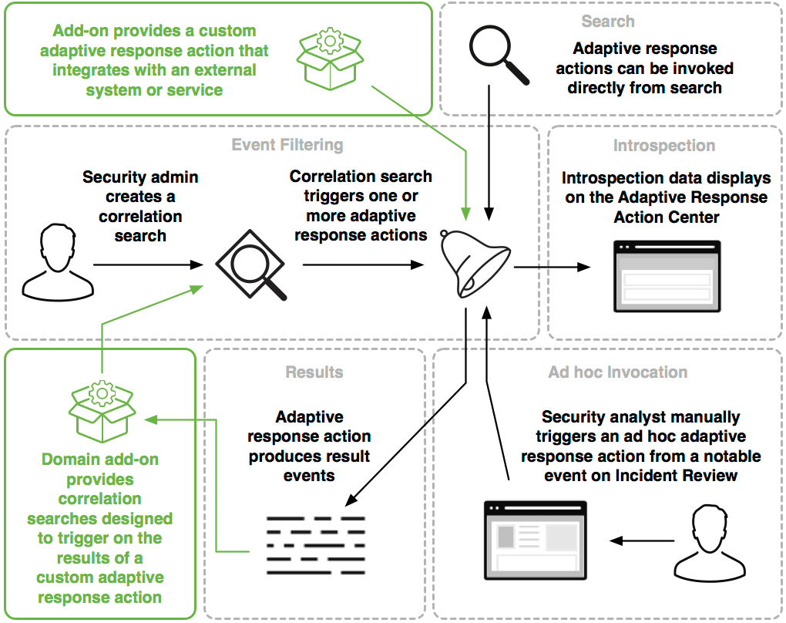

# Building Integrations for Splunk Enterprise Security

## Adaptive Response framework in Splunk ES

Adaptive Response 프레임워크는 Splunk 플랫폼 내에서 미리 구성된 작업을 실행하거나 외부 응용 프로그램과 통합하여 실행하는 메커니즘을 제공
이러한 작업은 correlation search 결과에 의해 자동으로 트리거되거나 Incident Review 대시보드에서 임시로 수동으로 실행

이 프레임워크는 통합 할 수있는 Splunk Enterprise Security의 다섯 가지 프레임워크 중 하나
프레임워크에 대한 소개는 [Building Integrations for Splunk Enterprise Security](http://dev.splunk.com/view/enterprise-security/SP-CAAAFAZ)을 참조

대부분의 adaptive response actions는 Splunk 플랫폼에서 새로운 이벤트를 생성
응답 이벤트는 orig_action_name, orig_sid 및 orig_rid 필드로 생성된 작업과 연결되므로 개발자 또는 ES 관리자가 연결 작업의 워크플로를 구성
ES 관리자 및 분석가는 이러한 워크플로를 사용자 지정하고 감사

이 다이어그램은 가능한 통합 지점을 강조 표시하여 Adaptive Response 프레임워크의 개요를 표시

이 다이어그램은 관리자, 분석가 및 개발자가 적응 형 응답 프레임워크와 상호 작용하는 방법

* 보안 관리자는 하나 이상의 response actions를 트리거하는 correlation search을 작성
* 보안 분석가는 Incident Review에서 notable event로부터 adaptive response action을 수동으로 트리거하거나, Splunk 검색에서 직접 호출
* Introspection 데이터는 Adaptive Response Action Center에 표시. adaptive response action는 결과 이벤트를 생성
* 개발자는 외부 시스템이나 서비스와 통합되는 custom adaptive response action를 제공
* 개발자는 custom adaptive response action의 결과 이벤트를 트리거하도록 설계된 correlation searches 생성

### Integrate with the Adaptive Response framework

이 프레임워크에 대한 통합을 빌드하려면 Common Action Model을 사용하여 사용자 고유의 adaptive response actions를 작성
JSON 사양과 cim_actions.py 라이브러리를 따르거나 Splunk  Add-on Builder를 사용하여 동작이 Adaptive Response 프레임워크와 완벽하게 호환되는지 확인

또한 custom response action의 결과를 경고하고 다른 작업을 트리거하도록 설계된 하나 이상의 correlation searches을 생성
이런 식으로 한 동작의 결과를 평가하고 추가 동작이나 권장 사항과 동적으로 반응하는 논리적 인 동작 체인을 만들 수 있음

시작하려면 [Create a response action](http://dev.splunk.com/view/enterprise-security/SP-CAAAFBF)을 참조

#### Determine whether your action supports ad hoc invocation

Response actions은 두 가지 방법으로 호출 :

Splunk Enterprise Security에서 correlation search의 트리거 조건을 일치 시키거나 Incident Review 대시보드에서 notable event에 대한 작업을 수동으로 실행하는 것(액션을 실행하는 후자의 수동 방법을 ad-hoc invocation이라고 함)

correlation searches을 통해 모든 response actions을 트리거 할 수 있지만 모든 응답 작업을 ad-hoc actions으로 호출 할 수있는 것은 아님(예를 들어 전자 메일 보내기 보내기 작업은 기본 sendalert 명령 대신 sendemail 명령을 사용하고 이벤트 컨텍스트에서 사용할 수없는 여러 매개 변수를 사용하기 때문에 임시 작업으로 호출 할 수 없음)

기본 sendalert 명령을 사용하여 adaptive response action을 시작하는 모든 작업을 ad-hoc action으로 호출

#### Best practices for using dynamic logic in a response action

모범 사례로 단일 response action 내에 선택 라우팅 또는 기타 동적 논리를 포함하지 않음.
단일 response action 내에서 여러 동작을 실행하는 것은 기술적으로 가능하지만 이러한 동작을 문제 해결하고 감사하는 것은 어려움.
대신 Common Action Model에서 제공하는 addevent() 및 writevents() 메소드를 사용하여 다른 correlation searches의 검색 기준을 일치시켜 다운 스트림 작업을 시작할 수 있는 이벤트를 생성(예를 들어 [Sample correlation search designed to assign risk scores based on results from the haveibeenpwned action](http://dev.splunk.com/view/enterprise-security/SP-CAAAFBH#chain)을 참조)

Enterprise Security 관리자는 notable event의 세부 사항 및 트리거를 구성 할 때 다음 단계 옵션을 사용하여 분석가가 따르도록 워크플로를 제안
ES 분석가를 위한 다음 단계 작성에 대한 자세한 내용은 [Create a notable event](http://docs.splunk.com/Documentation/ES/latest/Admin/Configureadaptiveresponse#Create_a_notable_event)를 참조

### Adaptive Response 프레임워크

* 애드온은 외부 시스템 또는 서비스와 통합되는 custom adaptive response action를 제공
* Adaptive response actions는 검색에서 직접 호출
* 보안 관리자가 correlation search을 생성
* Correlation search은 하나 이상의 adaptive response actions를 트리거
* 내부 분석 데이터가 "Adaptive Response Action Center"에 표시
* 도메인 에드온은 custom adaptive response action의 결과를 트리거하도록 설계된 correlation searches을 제공
* Adaptive response action는 결과 이벤트를 생성
* 보안 분석가는 Incident Review에서 notable event에서 ad-hoc adaptive response action를 수동으로 트리거