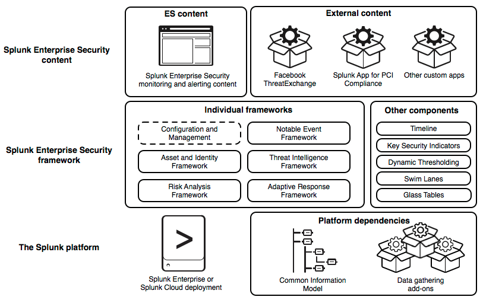
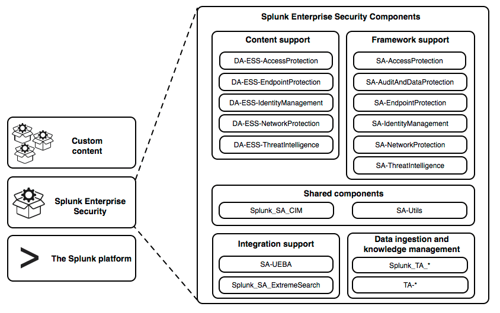

# Integrations for Splunk Enterprise Security

## Building Integrations for Splunk Enterprise Security

* Splunk Enterprise Security 보안 소스의 머신데이터에 대한 통찰력을 제공하여 SIEM 사용 사례를 해결하는 Splunk 플랫폼을 위한 프리미엄 응용 프로그램
* 보안팀이 네트워크, Endpoint, 액세스, 멀웨어, 취약성 및 identity 정보를 분석하고 응답하는 데 도움이 되는 미리 패키지화 된 대시 보드, 상관 관계 및 사고 대응 워크 플로가 포함
* Splunk Enterprise Security에 대한 관리 및 사용자 설명서는 Splunk 설명서의 Splunk Enterprise Security를 참조

* 다른 응용 프로그램 및 추가 기능은 특정 기술이나 사용 사례에 특정한 Splunk Enterprise Security에 추가 데이터, 지식 관리 및 운영 인텔리전스를 제공
* Splunk Enterprise Security에는 통합에 사용할 수있는 다섯 가지 프레임워크가 있습니다.

### About the Splunk Enterprise Security frameworks

* Splunk Enterprise Security는 일련의 프레임워크에서 지원
* Splunk Enterprise Security의 기능 영역을 구현
* Splunk Enterprise Security에 패키지 된 콘텐츠 및 다른 보안 응용 프로그램에서 제공되는 외부 콘텐츠를 모니터링하고 경고
* 개발자는 이러한 프레임워크와 통합하여 Splunk Enterprise Security 사용자를 위해 사용자 정의 컨텐츠를 제공

#### 다섯 프레임워크

* The [Notable Event framework](http://dev.splunk.com/view/enterprise-security/SP-CAAAFA9) - 이벤트에서 주목할만한 사건을 식별 한 다음 소유권, 분류 절차 및 해당 사건의 상태를 관리하는 방법을 제공
* The [Asset and Identity framework](http://dev.splunk.com/view/enterprise-security/SP-CAAAFBB) - 검색으로 반환 된 이벤트 세트에있을 수있는 필드에 대해 자산 및 ID 상관 관계를 수행
* The [Threat Intelligence framework](http://dev.splunk.com/view/enterprise-security/SP-CAAAFBC) - 위협 피드를 사용 및 관리하고, 위협을 탐지하고 경고하는 메커니즘입니다
* The [Risk Analysis framework](http://dev.splunk.com/view/enterprise-security/SP-CAAAFBD) - 개인이나 자산의 위험 프로필을 높이는 행동을 식별하고 위험을 축적하여 비정상적인 위험 활동을 수행하는 사람이나 장치를 식별
* The [Adaptive Response framework](http://dev.splunk.com/view/enterprise-security/SP-CAAAFBE) - Splunk 플랫폼에서 사전 구성된 작업을 실행하거나 외부 응용 프로그램과 통합하여 메커니즘을 제공합니다. 이러한 작업은 상관 관계 검색 결과에 의해 자동으로 트리거되거나 Incident Review 대시 보드에서 임시로 수동으로 실행 있습니다.

 이 프레임워크는 다른 지원 구성 요소와 함께 Splunk Enterprise Security의 아키텍처에 기능적 계층을 형성
 프레임워크 계층은 Splunk 플랫폼과 데이터 및 지식 관리를 제공하는 여러 부가 기능에 따라 다릅니다. 또한 프레임워크 계층은 사용자에게 모니터링 및 경고 기능을 제공하는 Splunk Enterprise Security 컨텐트를 지원

이 다이어그램은 3개의 수평계층에서 Splunk Enterprise Security 플랫폼의 아키텍처를 나타냅니다.

* 하단 계층(Splunk 플랫폼) - Splunk Enterprise 또는 Splunk Cloud 배포와 공통 정보 모델 및 플랫폼 종속성 인 데이터 수집 애드온으로 구성
* 중간 계층(Splunk Enterprise Security 프레임워크) - 프레임워크는 개별 프레임워크 집합과 다른 구성 요소 집합으로 나뉘어져 있음. 나열된 다른 구성 요소는 타임 라인, 주요 보안 표시기, 동적 임계 값, 스윔 레인 및 글래스테이블
* 최상위 계층(Splunk Enterprise Security Content) - Splunk Enterprise Security 모니터링 및 ES 자체 및 외부 콘텐츠에 번들 된 경고의 두 섹션을 표시(외부 콘텐츠의 예로는 FacebookThreat Exchange와 PCI Compliance를위한 Splunk App)

이러한 프레임워크는 Splunk Enterprise Security 폴더 구조의 항목 별 패키지가 아닙니다. 대신, 코드 및 통합 지점은 Splunk Enterprise Security 앱에 번들로 제공되는 여러 가지 지원 및 도메인 추가 기능에 분산되어 있습니다.

이 다이어그램은 Splunk Enterprise Security를 구성하는 구성 요소 파일(구성 요소를 다섯 가지 그룹)

* 컨텐츠 지원 그룹에는 DA-ESS-AccessProtection, DA-ESS-EndpointProtection, DA-ESS-IdentityManagement, DA-ESS-NetworkProtection 및 DA-ESS-ThreatIntelligence가 포함
* 프레임워크 지원 그룹에는 SA-AccessProtection, SA-AuditAndDataProtection, SA-EndpointProtection, SA-IdentityManagement, SA-NetworkProtection 및 SA-ThreatIntelligence가 포함
* 공유 구성 요소 그룹은 Splunk_SA_CIM과 SA-Utils로 구성
* 통합 지원 그룹에는 SA-UEBA 및 Splunk_SA_ExtremeSearch가 포함
* 데이터 수집 및 지식 관리 그룹에는 Splunk_TA_로 시작하는 모든 추가 기능과 TA-로 시작하는 모든 추가 기능이 포함

이러한 추가 기능의 상호 관계가 복잡하기 때문에이 가이드에서 제공하는 모범 사례를 따라 프레임워크 및 지원 기능의 업그레이드 및 변경을 허용하는 통합을 구축
솔루션 아키텍처에 대한 자세한 내용은 Enterprise Security 솔루션 아키텍처 정보를 참조