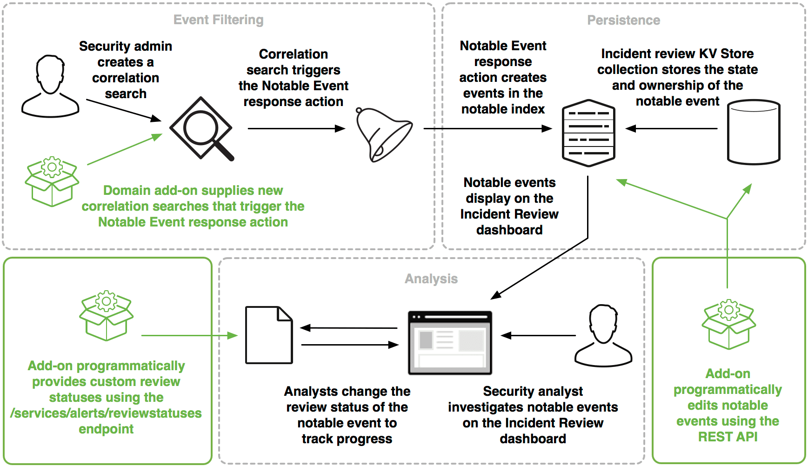

# Building Integrations for Splunk Enterprise Security

## Notable Event framework in Splunk ES

Notable Event 프레임워크는 이벤트에서 주목할만한 사건을 식별하고 소유권, 분류 절차 및 해당 사건의 상태를 관리 할 수있는 방법을 제공

이 프레임워크는 통합 할 수있는 Splunk Enterprise Security의 다섯 가지 프레임워크 중 하나 프레임워크에 대한 소개는 [Building Integrations for Splunk Enterprise Security](http://dev.splunk.com/view/enterprise-security/SP-CAAAFAZ)을 참조

다이어그램은 가능한 통합 지점을 강조 표시한 Notable Event 프레임워크의 개요를 제공

이 다이어그램은 관리자, 분석가 및 개발자가 Notable Event 프레임워크와 상호 작용하는 방법

* 보안 관리자는 Notable Event response action을 트리거하는 상관 관계 검색을 작성하거나 구성
* Notable Event response action은 notable index에 이벤트를 생성
* incident review KV Store Collection은 notable event의 상태와 소유권을 저장
* Notable Event는 Incident Review 대시 보드의 분석가에게 표시됨
* 보안 분석가는 Notable Event를 조사하고 검토 상태를 변경하여 진행 상황을 추적
* 개발자는 다음 세 가지 방법으로 Notable Event 프레임워크와 통합

1. Notable Event 대응 조치를 트리거하는 새로운 Correlation Searches을 제공
2. REST API를 사용하여 Notable Event를 프로그래밍 방식으로 편집하십시오.
3. REST API의 /services/alerts/reviewstatuses Endpoint를 사용하여 프로그래밍 방식으로 사용자 지정 검토 상태 옵션을 추가

### Creating notable events manually

대부분의 Notable Event는 Correlation Searches에 의해 트리거되지만 Notable Event를 수동으로 만들 수도 있음.
Notable Event를 수동으로 생성하는 방법에는 두 가지 :

* 검색 문자열에 "| sendalert notable"이 포함된 검색 언어를 사용하여 Notable Event를 작성(Ex. | makeresults | eval dest="somedest" | sendalert notable)
* Splunk Enterprise Security UI를 사용하여 Notable Event를 생성. [Manually create a notable event in Splunk Enterprise Security](http://docs.splunk.com/Documentation/ES/latest/Admin/Createnotablesmanually)

### Searching for notable events

모든 notable events들은 notable index에 저장
notable index의 이벤트는 stateless
Notable Event만 포함되며 Review 상태에 대한 정보는 포함되지 않음.
이 상태는 incident_review KV Store Collection에서 추적
notable index을 검색하는 모범 사례는 [Notable index](http://dev.splunk.com/view/enterprise-security/SP-CAAAFBA) 참조

### Integrate with the Notable Event framework

Notable Event 프레임워크와 통합하는 세 가지 방법

* 하나 이상의 사용자 정의 Correlation Searches을 작성하여 Notable Event를 생성
* 외부 트리거에 따라 Notable Event를 편집하려면 REST API를 사용.[Notable Event API reference](http://docs.splunk.com/Documentation/ES/latest/API/NotableEventAPIreference)
* REST API를 사용하여 맞춤 검토 상태를 설정하고 상태 전환을 관리. SA-ThreatIntelligence의 reviewstatuses.conf.spec을 참조

### Notable Evnets 프레임워크

* 보안 관리자가 correlation search을 생성
* correlation search은 Notable Event response action를 트리거
* 도메인 에드온은 Notable Event response action을 트리거하는 새로운 correlation searches을 제공
* Notable Event response action으로 notable 인덱스에 이벤트를 생성
* Incident review KV Store collection은 notable event의 상태와 소유권을 저장
* Incident Review 대시보드에 notable event가 표시됨
* 분석가가 진행 상황을 추적하기 위해 notable event의 검토 상태를 변경
* 보안 분석가는 Incident Review 대시보드에서 notable event를 조사
* 애드온은 /services/alerts/reviewstatuses Endpoint를 사용하여 프로그래밍 방식으로 custom review statuses를 제공
* 에드온은 REST API를 사용하여 notable event를 프로그래밍 방식으로 편집