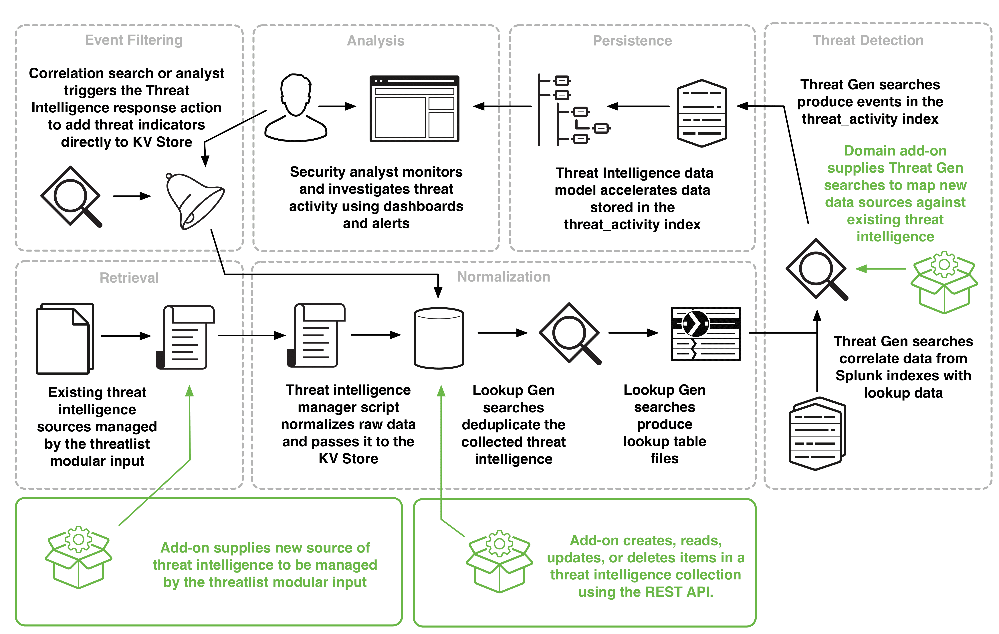

# Building Integrations for Splunk Enterprise Security

## Threat Intelligence framework in Splunk ES

Threat Intelligence 프레임워크는 위협 피드를 사용 및 관리하고, 위협을 탐지하고 경고하는 메커니즘
프레임워크는 Threat Intelligence 데이터를 수집 및 삭제하는 모듈식 입력, 조회 생성 검색을 통해 데이터를 줄여 성능을 최적화하고, 데이터와 상관 관계를 분석하고 결과를 경고하며 데이터 모델링을 통해 결과를 가속화하고 저장
이 프레임워크에는 위협정보 검색, 정규화, 지속성 및 분석에 대한 내성 검사를 허용하는 많은 감사 대시보드가 포함

이 프레임워크는 통합 할 수있는 Splunk Enterprise Security의 다섯 가지 프레임워크 중 하나
프레임워크에 대한 소개는 [Building Integrations for Splunk Enterprise Security](http://dev.splunk.com/view/enterprise-security/SP-CAAAFAZ)을 참조

이 다이어그램은 가능한 통합 지점이 강조 표시된 Threat Intelligence 프레임워크의 개요를 제공

이 다이어그램은 관리자, 분석가 및 개발자가 Threat Intelligence 프레임워크와 상호 작용하는 방법
보안 관리자는 threatlist modular input에 의해 관리되는 threat intelligence 소스를 구성
threat intelligence manager script는 원시 데이터를 표준화하여 이를 Splunk KV Store로 전달
Lookup generating searches은 수집 된 위협 정보를 중복 제거하고 Lookup 테이블 파일을 생성
Threat generation searches은 Splunk Index의 데이터를 Lookup 데이터와 상관
Threat generation searches은 threat_activity Index에서 이벤트를 생성
Threat Intelligence 데이터 모델은 threat_activity Index의 데이터를 가속화
보안 분석가는 대시보드 및 경고를 사용하여 위협 활동을 모니터링하고 조사
분석가는 correlation searches을 통해 트리거 될 수 있는 adaptive response action을 사용하여 KV Store에 새로운 threat indicators를 직접 추가
개발자는 다음 세 가지 방법으로 위협 정보 프레임워크와 통합

1. threatlist modular input에 의해 관리 될 새로운 threat intelligence 소스를 제공하는 에드온을 만듬.
2. REST API를 사용하여 KV Store의 threat intelligence collection에서 항목을 생성, 읽기, 업데이트 또는 삭제
3. 새로운 Threat generation searches을 제공하여 기존 threat intelligence에 대해 새 데이터 소스를 매핑

### How Splunk Enterprise Security processes threat intelligence

Splunk Enterprise Security가 위협 인텔리전스를 처리하는 기본 프로세스

1. Splunk Enterprise Security 관리자는 포함된 위협목록 원본을 구성하고 새로운 위협목록 입력을 추가하여 새로운 위협 목록 원본을 추가(추가적으로 correlation searches을 구성하여 이벤트의 위협 요소를 KV Store에 직접 추가)

2. threatlist.py 모듈식 입력은 구성된 위협 목록 원본에서 위협 정보를 $SPLUNK_HOME/etc/apps/SA-ThreatIntelligence/local/data/threat_intel 의 위협 정보 보관함으로 다운로드
    * 참고 : 복잡한 인증 체계와 같은 특수한 요구사항이 있는 경우 threatlist.py modular input은 threat intelligence를 다운로드 할 수 없는 경우(이러한 경우 Splunk Enterprise Security 관리자는 Splunk 플랫폼 외부의 out-of-band 프로세스를 사용하여 파일로 위협 정보 보관함을 채움)
    * Splunk Enterprise Security는 $SPLUNK_HOME/etc/apps/DA-ESS-ThreatIntelligence/local/data/threat_intel 에서 이러한 목적으로 드롭 박스를 제공
    * 다른 응용 프로그램에 다른 보관 용 계정을 추가하려면 [Configure a custom folder and input monitor for threat sources](http://docs.splunk.com/Documentation/ES/latest/Admin/Uploadthreatfile#Configure_a_custom_folder_and_input_monitor_for_threat_sources) 참조
    * 경로는 $SPLUNK_HOME/etc/apps/<app_name>/local/data/threat_intel 패턴을 따름

3. threat_intelligence_manager.py modular input은 정의된 모든 보관용 dropboxes 및 Lookup table에서 다운로드한 콘텐츠를 새로운 Threat Intelligence에 대해 검토

    * 다운로드 한 파일에 사용 가능한 정보가 없는 경우, remove_unusable이 true로 설정되어 있을 때 threat_intelligence_manager가 파일을 삭제
    * 다운로드 한 파일에 사용 가능한 정보가 있는 경우, sink_ole이 true로 설정되어 있을 때 threat_intelligence_manager가 데이터를 사용하고 파일을 삭제
    * threat intelligence가 lookup table에서 오는 경우 threat_intelligence_manager는 데이터를 사용하여 제자리에 남겨 둡니다.
    * lookup tables에서 소비 된 threat intelligence는 다른 검색에서 사용되기 때문에 삭제되지 않음.

4. Threat Intelligence Audit 대시보드에는 위협 소스에 대한 최신 상태변경 사항이 표시됨

5. threat_intelligence_manager.py modular input은 위협소스을 파싱하고 새로운 intelligence으로 KV Store threat collections을 업데이트(보안 분석가는 Threat Artifacts 대시보드의 threat collections에 있는 데이터를 검토하거나 특정 collection name에 대한 "| inputlookup"로 검색(예를 들어, "| inputlookup ip_intel" )

6. collections이 업데이트되면 lookup generating searches은 KV Store collections에서 위협 데이터를 추출 및 중복 제거하고 검색에서 효율적으로 사용할 수 있도록 CSV 조회 파일을 만듬.

7. Threat generating searches은 lookup 파일을 데이터 모델의 이벤트와 비교
    * 기본적으로 모든 Threat generating searches은 이전 45 분간의 이벤트를 검색
    * Threat Intelligence 데이터를 45분보다 오래된 이벤트와 비교하려면 Threat Gen searches에 대한 earliest time을 수정

8. Threat Gen searches에서 찾은 일치 항목은 threat_activity 인덱스를 채우고 Threat Intelligence 데이터 모델의 이벤트에 태그를 지정(보안 분석가는 Threat Activity 대시보드에서 threat_activity 인덱스의 항목을 검토)

9. Threat Activity Detected correlation search은 "threat source matches"에서 notable events를 생성하고 "threat source matches"와 관련된 assets 및 identities의 위험 점수를 변경합니다.
    * 보안 분석가는 Incident Review 대시보드에서 작성된 notable events와 위험 Risk Analysis 보드의 위험 점수를 검토
    * Threat Intelligence response action를 사용하여 이벤트의 위협 지표를 KV Store에 추가

### Integrate with the Threat Intelligence framework

Threat Intelligence 프레임워크와 통합하는 세 가지 방법

* 사용자 지정 위협 정보 데이터 원본을 추가(두 가지 방법)
  * threatlist.py modular input에 의해 관리되는 inputs.conf에 새 스탠자를 생성
    * 명명 규칙 [threatlist : // <my_custom_threat_intel_source>]
  * REST API를 사용하여 사용자 지정 위협 정보 데이터 원본을 업로드
    * [Threat Intelligence API reference](http://docs.splunk.com/Documentation/ES/latest/API/ThreatIntelligenceAPIreference)
* REST API를 사용하여 KV Store의 threat intelligence collection에서 항목을 생성, 읽기, 업데이트 또는 삭제(Threat Intelligence API 참조를 참조)
* 새로운 Threat Gen search을 작성하여 기존 정보 수집과 사용자 정의 데이터를 일치

### Threat Intelligence 프레임워크

* Correlation search 또는 분석가가 Threat Intelligence response action를 트리거하여 KV Store에 직접 threat indicators를 추가
* 보안 분석가는 대시보드 및 경고를 사용하여 threat activity을 모니터하고 조사
* Threat Intelligence 데이터 모델은 threat_activity 인덱스에 저장된 데이터를 가속화
* Threat Gen searches은 threat_activity 인덱스에서 이벤트를 생성
* 도메인 에드온은 기존 threat intelligence에 대해 새 데이터 소스를 매핑하기 위해 Threat Gen searches를 제공
* Threat Gen searches은 Splunk 인덱스의 데이터를 Lookup 데이터와 상관
* threatlist modular input에 의해 관리되는 기존의 threat intelligence sources
* Threat intelligence manager script는 원시 데이터를 정규화하여 KV 저장소로 전달
* Lookup Gen searches은 수집된 threat intelligence를 중복 제거
* Lookup Gen searches은 Lookup 테이블 파일을 생성
* 애드온은 threatlist modular input에 의해 관리될 threat intelligence의 새로운 소스를 제공
* 애드온은 REST API를 사용하여 threat intelligence collection에서 항목을 생성, 읽기, 업데이트 또는 삭제