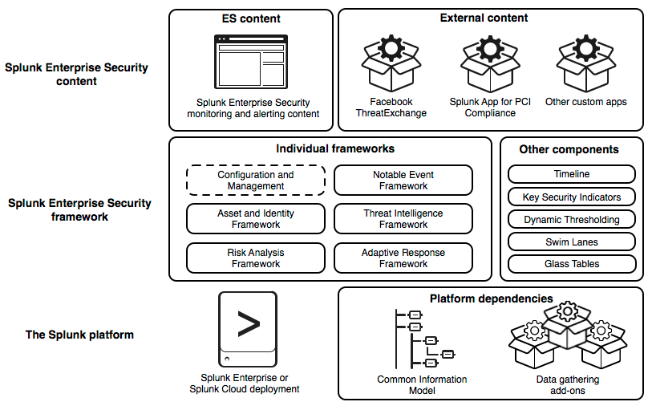
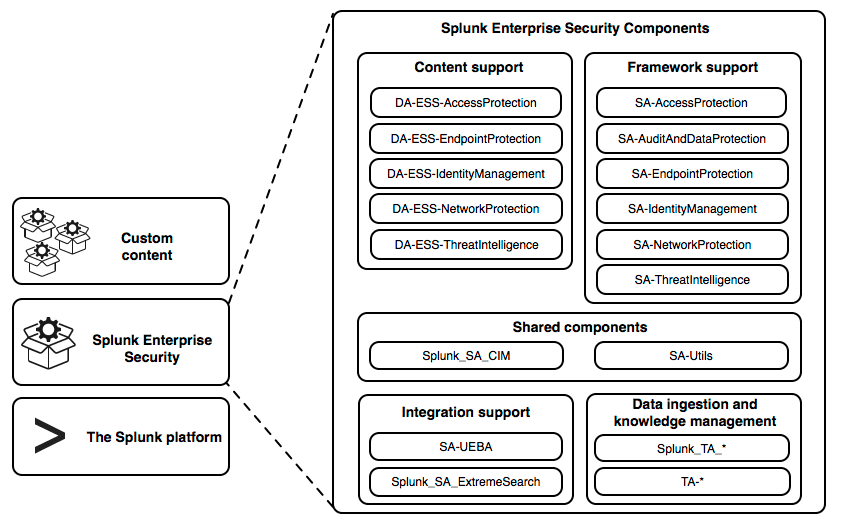

# Integrations for Splunk Enterprise Security

## Building Integrations for Splunk Enterprise Security

Splunk Enterprise Security is a premium app for the Splunk platform that addresses SIEM use cases by providing insight into machine data from security sources. The app includes prepackaged dashboards, correlations, and incident response workflows to help security teams analyze and respond to their network, endpoint, access, malware, vulnerability, and identity information. For admin and user documentation about Splunk Enterprise Security, see Splunk Enterprise Security in the Splunk documentation.

Other apps and add-ons can provide additional data, knowledge management, and operational intelligence to Splunk Enterprise Security specific to certain technologies or use cases. Splunk Enterprise Security has five frameworks that are available for integration.

### About the Splunk Enterprise Security frameworks

Splunk Enterprise Security is supported by a set of frameworks. These frameworks implement the functional areas of Splunk Enterprise Security. Together, the frameworks support the monitoring and alerting content packaged within Splunk Enterprise Security, as well as external content provided in other security apps. As a developer, you can integrate with these frameworks to provide your own custom content for users of Splunk Enterprise Security.

There are five frameworks.

- The [Notable Event framework](http://dev.splunk.com/view/enterprise-security/SP-CAAAFA9) provides a way to identify noteworthy incidents from events and then manage the ownership, triage process, and state of those incidents.
- The [Asset and Identity framework](http://dev.splunk.com/view/enterprise-security/SP-CAAAFBB) performs asset and identity correlation for fields that might be present in an event set returned by a search.
- The [Threat Intelligence framework](http://dev.splunk.com/view/enterprise-security/SP-CAAAFBC) is a mechanism for consuming and managing threat feeds, detecting threats, and alerting.
- The [Risk Analysis framework](http://dev.splunk.com/view/enterprise-security/SP-CAAAFBD) provides the ability to identify actions that raise the risk profile of individuals or assets, and accumulate that risk to allow identification of people or devices that perform an unusual amount of risky activities.
- The [Adaptive Response framework](http://dev.splunk.com/view/enterprise-security/SP-CAAAFBE) provides a mechanism for running preconfigured actions within the Splunk platform or by integrating with external applications. These actions can be automatically triggered by correlation search results or manually run on an ad hoc basis from the Incident Review dashboard.

The frameworks, in combination with other supporting components, form a functional layer in the architecture of Splunk Enterprise Security. The framework layer depends on the Splunk platform and several add-ons that provide data and knowledge management. In turn, the framework layer supports the Splunk Enterprise Security content that provides monitoring and alerting capabilities to users.

This diagram presents the architecture of Splunk Enterprise Security platform in three horizontal tiers. The bottom tier is the Splunk platform. It consists of a Splunk Enterprise or Splunk Cloud deployment, and the Common Information Model and data gathering add-ons, which are platform dependencies. The middle tier is the Splunk Enterprise Security framework. It shows the framework divided into a set of individual frameworks and a set of other components. The other components listed are: Timeline, Key Security Indicators, Dynamic Thresholding, Swim Lanes, and Glass Tables. The top tier is Splunk Enterprise Security Content. This tier shows two sections: the Splunk Enterprise Security monitoring and alerting content bundled within ES itself and external content. Examples of external content include FacebookThreat Exchange and the Splunk App for PCI Compliance.

These frameworks are not itemized packages within the Splunk Enterprise Security folder structure. Instead, their code and integration points are distributed over a number of related supporting and domain add-ons bundled within the Splunk Enterprise Security app.

This diagram shows the component files that make up Splunk Enterprise Security. The diagram shows these components in five groups. The content support group contains DA-ESS-AccessProtection, DA-ESS-EndpointProtection, DA-ESS-IdentityManagement, DA-ESS-NetworkProtection, and DA-ESS-ThreatIntelligence. The framework support group contains: SA-AccessProtection, SA-AuditAndDataProtection, SA-EndpointProtection, SA-IdentityManagement, SA-NetworkProtection, and SA-ThreatIntelligence. The shared components group consists of Splunk_SA_CIM and SA-Utils. The integration support group contains SA-UEBA and Splunk_SA_ExtremeSearch. The data ingestion and knowledge management group contains all add-ons that begin with Splunk_TA_ and all add-ons that begin with TA-.

Because the interrelationship of these add-ons is complex, follow the best practices provided in this guide to build integrations that tolerate upgrades and changes to the frameworks and the functionality they support. For more information about the solution architecture, see About the Enterprise Security solution architecture.

Ready to start building your own integration? See Planning your integration for ES.