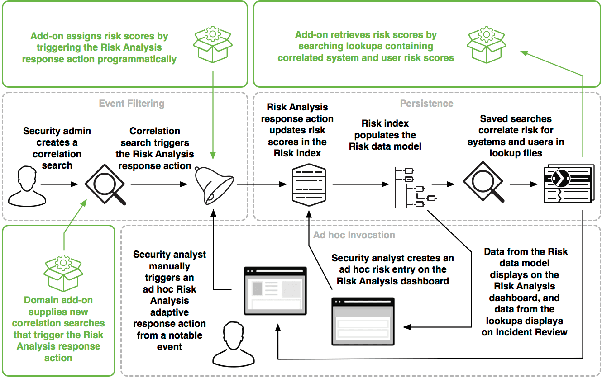

# Building Integrations for Splunk Enterprise Security

## Risk Analysis framework in Splunk ES

The Risk Analysis framework provides the ability to identify actions that raise the risk profile of individuals or assets. The framework also accumulates that risk to allow identification of people or devices that perform an unusual amount of risky activities.

This framework is one of five frameworks in Splunk Enterprise Security with which you can integrate. See [Building Integrations for Splunk Enterprise Security](http://dev.splunk.com/view/enterprise-security/SP-CAAAFAZ) for an introduction to the frameworks.

The diagram presents an overview of the Risk Analysis framework, with the possible integration points highlighted.



This diagram shows how admins, analysts, and developers can interact with the Risk Analysis framework. A security admin creates a correlation search which triggers the Risk Analysis response action. The response action updates the risk score in the Risk index, and data from that index displays on both Incident Review and the Risk Analysis dashboard. A security analyst can trigger the Risk Analysis response action from Incident Review or make an ad-hoc risk score entry from the Risk Analysis dashboard. Either of those actions will update the risk index. Add-ons (highlighted in green) can integrate with this framework in two ways: they can contribute new correlation searches that trigger the Risk Analysis response action, or they can programmatically assign risk scores by calling the /receivers/simple endpoint directly.

There are several ways for ES analysts and admins to interact with the Risk Analysis framework in Splunk Enterprise Security.

* Enable the correlation searches included with Splunk Enterprise Security that include Risk Analysis response actions.
* Create an ad hoc risk entry on the Risk Analysis dashboard.
* Run an ad hoc Risk Analysis adaptive response action from the Incident Review dashboard to raise or lower the risk score from a notable event.

### Terminology for the Risk Analysis framework

Events that modify risk in Splunk Enterprise Security are called risk modifiers. Risk modifiers are events in the risk index which contain, at a minimum, a risk_score, a risk_object, and a risk_object_type. There is also a description field which describes the modifier. The Risk data model accelerates these fields for the Risk Analysis and Incident Review dashboards. The framework also handles case insensitive asset and identity correlation, allowing risk modifiers that are applied to system or user name variants to be correctly attributed to the same risk_object.

The overall risk score for any given risk_object is the sum of all risk_score values from all risk modifiers for that risk_object. For more about how the framework calculates risk scores, see [Analyze risk in Splunk Enterprise Security](http://docs.splunk.com/Documentation/ES/latest/User/RiskScoring).

### Integrate with the Risk Analysis framework

There are three possible integration points for which you can provide a packaged integration for the Risk Analysis framework.

* Write a correlation search to and set it to trigger the Risk Analysis response action.
* Trigger the Risk Analysis response action programmatically.
* Read risk scores from the Risk Framework for use in an external app or other integration.

#### Write a correlation search

The first way to build an integration for the Risk Analysis framework is to write a correlation search that meets the needs of your integration and set it to trigger the Risk Analysis response action. For an example, see [Risk scoring example](http://docs.splunk.com/Documentation/ES/latest/User/RiskAnalysis#Risk_scoring_example). You can then export your correlation search as an app from the Content Management page. See [Export content from Splunk Enterprise Security](http://docs.splunk.com/Documentation/ES/latest/Admin/Export) as an app.

#### Trigger the response action programmatically

To trigger the Risk Analysis response action programmatically from within your add-on without using a correlation search, invoke | sendalert risk using the modaction_adhoc REST handler.

For example, to update the risk score for a specific system to 100:

```bash
$ curl -k -u admin:changeme https://localhost:8089/services/alerts/modaction_adhoc \
>     -d "search=| makeresults | eval src=\"my system\",description=\"my description\"" \
>     -d "action_name=risk" \
>     -d "action.risk.param._risk_score=100" \
>     -d "action.risk.param._risk_object=src" \
>     -d "action.risk.param._risk_object_type=system"
{"sid":"1476130499.2","command":"| makeresults | eval src=random() | sendalert risk param._risk_object_type=system param._risk_object=src param._risk_score=100 param.action_name=risk param.results_count=\"$job.resultCount$\" | stats count"}
```

You can also modify risk directly in the search pipeline. To update the risk score for a specific system to 100:

```bash
| makeresults | eval risk_object="mysystem"
| sendalert risk param._risk_score="100" param._risk_object_type="system"
```

To update the risk score for a specific user to 100:

```bash
| makeresults | eval risk_object="myuser"
| sendalert risk param._risk_score="100" param._risk_object_type="user"
```

To update the risk score for a risk object of type "other" to 100:

```bash
| makeresults | eval risk_object="myother"
| sendalert risk param._risk_score="100" param._risk_object_type="other"
```

#### Read risk scores from the framework

To read current risk scores from the Risk Analysis framework for use in an external app, directly invoke the risk_correlation lookups in a search. It is best practice to read data from the lookups rather than directly from the index or the data model, because the lookups correlate the risk modifiers for variants of the same risk_object. For example:

```bash
| inputlookup append=T risk_correlation_by_user_lookup where risk_object="myuser"
```

It is also possible to use the search pipeline to correlate risk scores with other data using the `risk_correlation_identities(user)` macro. For example:

```bash
| tstats `summariesonly` count from datamodel=Authentication.Authentication by Authentication.user
| rename Authentication.user as user | `risk_correlation_identities(user)`
```

### Risk Analysis Framework

* Add-on assigns risk scores by triggering the Risk Analysis response action programmatically
* Add-on retrives risk score by searching lookups containing correlated system and user risk scores
* Security admin creates a correlation search
* Correlation search triggers the Risk Analysis response action
* Risk Analysis response action updates risk scores in the Risk Index
* Risk Index populates the Risk data model
* Saved searches correlate risk for systems and users in lookup files
* Domain add-on supplies new correlation searches that trigger the Risk Analysis response action
* Security analyst manually triggers an ad-hoc Risk Analysis adaptive response action from a notable event
* Security analyst creates an ad-hoc risk entry on the Risk Analysis dashboard
* Data from the Risk data model displays on the Risk Analysis dashboard, and data from the lookups displays on Incedint Review