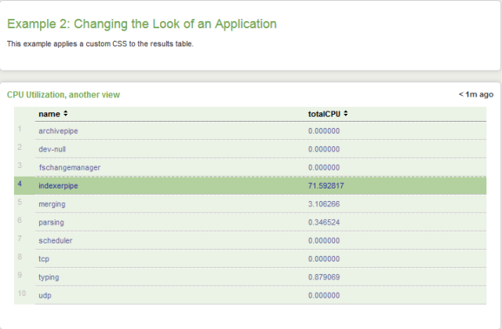
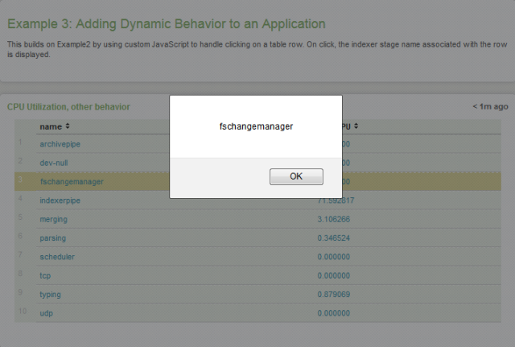
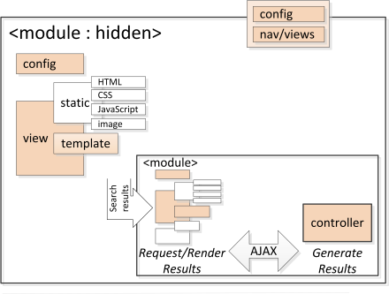
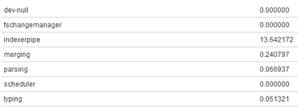
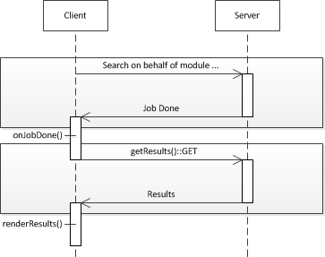
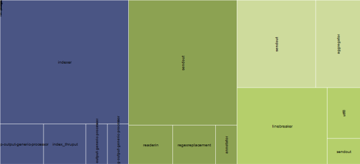
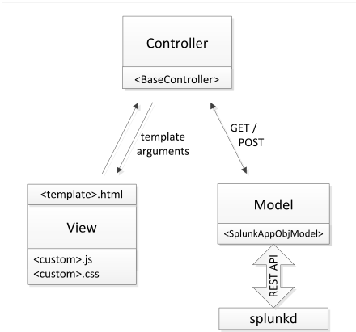
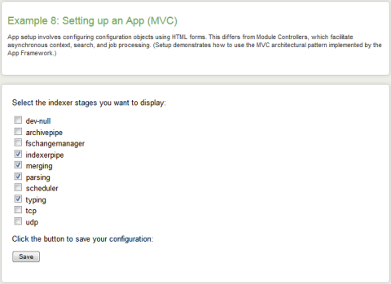

# MODULE SYSTEM

## Get the tutorial app

The cookbook provides learn-by-doing recipes for building custom apps, using progressive, real-world examples. We take a simple CPU resource utilization application and iterate on that example, building on what you already know toward gaining a more comprehensive understanding of the Module System.

Download the [Cookbook tutorial app](http://docs.splunk.com/images/0/05/Dev_tutorial.zip) to run the examples as a Splunk app.

Cookbook examples are can be found in the $SPLUNK_HOME/etc/apps/dev_tutorial directory. You can follow along or try implementing the examples yourself.

Our data source is the readily available metrics.log file. We demonstrate various Module System customizations by rendering CPU utilization statistics, using the following search results:

```bash
index=_internal source=*metrics.log group=pipeline
| stats sum(cpu_seconds) as totalCPU by name
```

## Simple customizations

To use custom CSS styling
To use custom JavaScript
Example 2 and Example 3

One of the first things you might want to do is use one of the following mechanisms to change the look or behavior of an app:

- Use custom CSS to change the look of your app.
- Use application.js to add custom JavaScript and change your app behavior.

You might consider simple CSS or JavaScript changes instead of more involved mechanisms, if you need to:

- Make changes to one point in your Splunk view.
- Change the style or behavior of a specific module or modules within a Splunk view.
- Make changes across an entire app. (This is not recommended.)

>> Note: It might be useful to recall from Getting started that default CSS files are located at $SPLUNK_HOME/share/splunk/search_mrsparkle/exposed/css and $SPLUNK_HOME/share/splunk/search_mrsparkle/exposed/css/skins. For some modules distributed with Splunk, you can find their CSS files in the $SPLUNK_HOME/share/splunk/search_mrsparkle/modules directory for the module.

Because these kinds of customization should already be familiar to you and because minimal Module System knowledge is needed, these are the first examples presented.

Details

This recipe demonstrates simple customization using two examples. Example2 changes app appearance using CSS customization. Example3 changes app behavior by hooking in custom JavaScript. Both build on our basic CPU utilization app.

Using CSS styling, we enhance the appearance of the results table, applying color to the cell background and highlighting the active row:


CSS styling requires providing a custom CSS file and specifying the filename in the view.

To show some action when a row is clicked, our custom JavaScript displays an alert showing the indexer stage of clicked row:



All resources, including images, custom CSS, and custom JavaScript, are located in the $SPLUNK_HOME/etc/apps/Dev_tutorial/appserver/static directory.

It is useful to understand these simple customization techniques because you'll want to combine these with more advanced customizations you'll learn about to create increasingly sophisticated applications, targeted to your domain.

### To use custom CSS styling

1. Create your view specification file, Example2.xml, in the $SPLUNK_HOME/etc/apps/Dev_tutorial/default/data/ui/views directory.
2. Specify the custom CSS file as a <view> tag parameter. The rest of the view specification is the same as Example1.xml.

    ```xml
    <view template="dashboard.html" stylesheet="example2Styles.css">
    ```

3. Create your custom CSS file, example2Styles.css, in the $SPLUNK_HOME/etc/apps/Dev_tutorial/appserver/static directory. Our example changes the default cell background color and highlights a row on hover.

    ```css
    table.simpleResultsTable tbody{
        background: #ebf2e6;
    } table.simpleResultsTable td{
        color: #669;
        border-top: 1px dashed #fff;
    } table.simpleResultsTable tbody tr:hover td{
        color: #339;
        background: #b3d09f;
    }
    ```

### To use custom JavaScript

The application.js file is used, by convention, to override existing methods for a particular instance. If you want SplunkWeb to do something specific on a user action, such as a click, change, or mouse-over event, use application.js to override the default behavior, replacing the default action with your custom handler.

In Example3, the NullModule is a child of the SimpleResultsTable module. A NullModule, as you might expect, does nothing, but provides a container for custom module code. As such, application.js code can use NullModule as a convenient entry point into the view context.

1. Create your view specification file, Example3.xml, in the $SPLUNK_HOME/etc/apps/Dev_tutorial/default/data/ui/views directory.
2. Add NullModule as a SimpleResultsTable child module. The rest of the Example3 view specification is the same as Example2.

    ```xml
    <module name="SimpleResultsTable">
    <param name="drilldown">row</param>
    <param name="displayMenu">true</param>
    <module name="NullModule"></module>
    </module>
    ```

    The NullModule module executes code attached to it when it is called by the SimpleResultsTable module.
3. Create the application.js file in the $SPLUNK_HOME/etc/apps/Dev_tutorial/appserver/static directory and add the following code.

    ```js
    switch (Splunk.util.getCurrentView()) {

    case "Example3":
    if (Splunk.Module.NullModule) {
        Splunk.Module.NullModule =
            $.klass(Splunk.Module.NullModule, {
                getModifiedContext: function() {
                var context = this.getContext(),
                click = context.getAll('click');
                alert (click.value);
                return context;
            }
        });
    }
    break;}
    ```

    In the code above, we ensure the code is executed only if the current view is Example3 and we are in the NullModule namespace. Use getCurrentView() to ensure you are operating on only the desired view.

    We use the JQuery.klass() utility to instantiation a NullModule class to override the getModifiedContext() method. All modules inherit from the AbstractModule base class.

    We get the click property from the NullModule context to display in an alert message.

    >> Tip: Alternatively, to the style of specific elements in a Splunk view, use the JQuery ready() method, getCurrentView(), and a selector to scope your changes to the specific elements, usually using the id attribute.

    ```js
    if (Splunk.util.getCurrentView() == 'myview') {

    $(document).ready( function() {
        $('.SimpleResultsTable').parent().css('width', '100%');
    });}
    ```

### Related recipes

Create a custom module shows the basics of creating a custom app, which you can enhance further by including CSS and application.js customizations.

## Create a custom module

To add your module code
To define your custom module
To implement the server-side search request handler
To implement the client-side results renderer
To integrate the module into the app view
Example 4

Typically, applications are constructed from prebuilt modules distributed with Splunk. You can list modules available in your Splunk distribution by logging in to Splunkweb and entering http://<host>:<port>/en-US/modules. For example, http://localhost:8000/en-US/modules. This also provides basic documentation about how to use a module.

For your application domain, you may need to create a custom module to present your data in a more meaningful way. Modules are at the core of Splunk apps, where the UI view is constructed from a hierarchy of modules. Data returned from your search is passed between modules and handled, or rendered, according to module functionality. The following figure introduces you to the module components:



Modules are nested and search results are typically passed from parent to child modules for processing. The figure depicts a HiddenModule, because it has no UI, which initiates the search request in our recipes. Using the AJAX pattern, modules pend on search results generated by the module controller on the host. The module client templating mechanism renders the results.

Details

This recipe demonstrates the basic steps needed to create a module:

1. Create the example source files in the correct directory.
2. Define the module so it is recognized by the Module System.
3. On the server, handle the search request and return the requested data.
4. On the client, render the response data.
5. Integrate the module into the app view.

These steps are common to all modules, and demonstrated in this recipe using the CustomResultsTable module.

The CustomResultsTable module extracts CPU utilization data from the indexed metrics.log file using the following search string:

```sql
index=_internal source=*metrics.log group=pipeline
| stats sum(cpu_seconds) as totalCPU by name
```

and displays results in tabular format:



Creating custom modules is the foundation of most of the recipes in this cookbook.

### To add your module code

Create the $SPLUNK_HOME/etc/apps/Dev_tutorial/appserver/modules/CustomResultsTable directory and add the following files:

- CustomResultsTable.conf
- CustomResultsTable.js
- CustomResultsTable.py

You can copy and paste the file contents from the sample code. Experiment with modifying the code to better understand how Module System works.

>> Note: Remember that modules minimally require a .conf and a .js file.

### To define your custom module

1. In the CustomResultsTable.conf file, give the module a class name and specify the base class from which it inherits.

    ```properties
    [module]
    className = Splunk.Module.CustomResultsTable
    superClass = Splunk.Module.DispatchingModule
    description = This is my first custom module.
    ```

3. In the same file, define module parameters to customize your view. For simplicity, this module does not have parameters so none are specified. 

    ```properties
    [param:myParam]
    required = False default = none
    ```

The configuration file hooks your module into the Module System. The Splunk.Module.DispatchingModule abstract base class, itself a subclass of the root Splunk.Module abstract class, handles the attachment of jobProgress and jobDone events, such that the onJobProgress() and onJobDone() methods are only called when the job context actually changes.

>> Note: The description and parameter fields are used to auto-document your module, which you can view when you enter http://<host>:<port>/en-US/modules in Splunkweb.

### To implement the server-side search request handler

Server-side code is implemented in the CustomResultsTable.py file.

>> Note: The root filename is the same as the unique className defined in CustomResultsTable.conf.

1. Import the libraries needed by most modules.
    import controllers.module as module import splunk import splunk.search import splunk.util import splunk.entity import lib.util as util import lib.i18n as i18n import logging

    >> Tip  : It is the recommended practice to have each import statement on a separate line.([See: PEP 8 -- Style Guide for Python Code](https://www.python.org/dev/peps/pep-0008/#imports))

2. Create a logger for your module to log error and debug messages.

    ```python
    logger = logging.getLogger('splunk.module.CustomResultsTable')
    ```

    Messages are logged by calling logger. logLevel ( logMessage ), which appends logMessage to the $SPLUNK_HOME/var/log/splunk/web_service.log file.

    Loggers are arranged in a namespace hierarchy so create your logger passing the module namespace, splunk.module.CustomResultsTable as a parameter.

3. Define the module class, specifying the base class as a parameter.

    ```python
    class CustomResultsTable(module.ModuleHandler)
    ```

    The ModuleHandler base class defines Module System server-side extension points for handling module requests. Your module hooks into Module System by implementing the methods for your particular application.

4. The only method that needs to be implemented for this simple module is the generateResults() method. Define the method and parameters used.

    ```python
    def generateResults(self, host_app, client_app, sid, count=1000,
                    offset=0, entity_name='results'):
    ```

    Validate the parameters and set local variables.

    ```python
    count = max(int(count), 0) offset = max(int(offset), 0) if not sid:

    raise Exception('CustomResultsTable.generateResults - sid not passed!')
    try:

        job = splunk.search.getJob(sid)
    except splunk.ResourceNotFound, e:

        logger.error('CustomResultsTable could not find job %s.' % sid)
        return _('<p class="resultStatusMessage">Could not retrieve search data.</p>')
    ```

    If the job ID parameter, sid, is not associated with your search request job, valid data are not available. In more advanced examples, you will learn how to work with job states.

    >> Tip: Use standard Python logging to log errors.

    The rest of this method builds the HTML displayed by this module, inserting the CPU Utilization search results in a table.

    ```python
    output = [] output.append('<div class="CustomResultsTableWrapper">') output.append('<table class="CustomResultsTable splTable">') fieldNames = [x for x in getattr(job, entity_name).fieldOrder if (not x.startswith('_'))] dataset = getattr(job, entity_name)[offset: offset+count] for i, result in enumerate(dataset):

    output.append('<tr>')
    for field in fieldNames:
        output.append('<td')
        fieldValues = result.get(cgi.escape(field), None)
        if fieldValues:
            output.append('>%s</td>' % fieldValues)
        else:
            output.append('></td>')
            output.append('</tr>')
            output.append('</table></div>')
            output = .join(output)
    return output
    ```

    The fieldNames variable contains the names of the fields specified in the search request (the pipeline indexer stage name and cpu_seconds utilization), which are used to index the field value.

    The method returns an HTML-formatted data table populated with CPU utilization data.

    >> Tip: To avoid security vulnerabilities, make sure to use HTML escaping of your data, either on the client or server, as applicable. Escaping is conveniently specified on the server using the Mako template but, because this example does not have a template, manually escape the HTML by calling cgi.escape(<field>).

### To implement the client-side results renderer

Client-side code is implemented in the CustomResultsTable.js file.

>> Note: The root filename is the same as the unique className defined in CustomResultsTable.conf.

1. Instantiate an instance of the CustomResultsTable class as a subclass of Splunk.Module.DispatchingModule, using the jQuery klass construct.

    ```js
    Splunk.Module.CustomResultsTable = $.klass(Splunk.Module.DispatchingModule, {...}
    ```

    The DispatchingModule base class, subclassing Splunk.Module, defines Module System extension points for implementing client-side response data handling and rendering particular to your application.

    >> Tip: Splunk provides a number of modules with predefined functionality. Choose the module from which to inherit most appropriate for your module functionality. Splunk modules are located at $SPLUNK_HOME/share/splunk/search_mrsparkle/modules. All modules have Splunk.Module as the base class.

2. Implement the constructor, which is called automatically when the class is instantiated, passing the containing DOM element as a parameter. 

    ```js
    initialize: function($super, container) {

    $super(container);
    this.resultsContainer = this.container;
    },
    ```

    All modules must have an initialize() method.

    Call $super(), first, to guarantee that the base class constructor is called before the module initialize() method executes. Save the container where results are rendered with this object.

3. Override the onJobDone() event handler.

    ```js
    onJobDone: function(event) {

    this.getResults();
    },
    ```

    This method is called when the search command is completed for the job associated with this instance. The only action needed for this simple example is to request the search results. For more complex applications, you might consider using other job progress event handlers.

4. Override the getResultParams() method, which is called when results are available following the getResults() call.

    ```js
    getResultParams: function($super) {
        var params = $super();
        var context = this.getContext();
        var search = context.get("search");
        var sid = search.job.getSearchId();
        if (!sid) this.logger.error(this.moduleType, "Assertion Failed.");
            params.sid = sid;
        return params;
    },
    ```

5. Override the renderResults() method to render the results in the container for this module.

    ```js
    renderResults: function($super, htmlFragment) {
        if (!htmlFragment) {
            this.resultsContainer.html('No content available.');
            return;
        }
        this.resultsContainer.html(htmlFragment);
    }
    ```

    For this example, the HTML fragment constructed on the server can be rendered directly by calling resultsContainer.html(), passing the results as a parameter.

The following simplified sequence diagram shows the basic client-server interaction:



A search job is dispatched by the module with DispatchingModule binding job progress events to the module. The getResults() and response sequence is implemented as an AJAX pattern. Other apps may interact differently, responding to different job progress events or doing something other than render the data.

### To integrate the module into the app view

In the $SPLUNK_HOME/etc/apps/Dev_tutorial/default/data/ui/views/Example4.xml file, add the following line in the view hierarchy where you want your module data rendered:

```xml
<module name="CustomResultsTable"></module>
```

In other examples, you will learn Parameterize your module.

### Related recipes

Render JSON data shows you how to transfer your data as JSON and format the display on the on the client.

Include 3rd-party libraries shows you how to import third-party graphics library for more advanced rendering.

Parameterize your module shows you how to statically parameterize your module.

Setup your app shows you how to configure your app at runtime.

## Render JSON data

To add your module code
To define the CustomJSONResults module
To handle the search request, returning JSON-formatted data
To render the JSON data
To integrate the CustomJSONResults module into the app view
Example 5

This recipe is the same as the Create a custom module recipe, except that results are formatted as JSON and sent to the client for rendering, instead of raw HTML.

Details

The main point of interest is the introduction of the render_json() method to transmit JSON-formatted data to the client. We also get the CPU utilization dataset directly, using the field name, instead of implicitly as in the CustomResultsTable module.

This represents an intermediate step between rendering an HTML table and a visualization that requires JSON, which we'll demonstrate in the Include 3rd-party libraries recipe.

### To add your module code

Create the $SPLUNK_HOME/etc/apps/Dev_tutorial/appserver/modules/CustomJSONResults directory and add the following files:

- CustomJSONResults.conf
- CustomJSONResults.js
- CustomJSONResults.py

### To define the CustomJSONResults module

In your CustomJSONResults.conf file, set the module class name and specify the base class from which it inherits.

```properties
[module]
className = Splunk.Module.CustomJSONResults
superClass = Splunk.Module.DispatchingModule
```

In this example, Splunk.Module.CustomJSONResults inherits from Splunk.Module.DispatchingModule, which itself inherits from the root module class, Splunk.Module.

The module has no static parameters so none are defined.

### To handle the search request, returning JSON-formatted data

The CustomJSONResults.py file implements server-side request handling. It simply formats the response data for the module and transmits it to the client.

1. Import the libraries needed for working with JSON, including the CherryPy framework component for setting the content type in the response header.

   ```python
   import cherrypy import jsonfrom splunk.appserver.mrsparkle.lib import jsonresponse
    ```

2. Import libraries needed by most modules.
    import controllers.module as module import splunk import splunk.search import splunk.util import splunk.entity import lib.util as util import lib.i18n as i18n import logging

    ```python
    logger = logging.getLogger('splunk.module.CustomJSONResults')
    ```

3. Define the class, inheriting from ModuleHandler.

    ```python
    class CustomJSONResults(module.ModuleHandler)
    ```

4. Override the generateResults() method to implement the code specific to this module.

    ```python
    def generateResults(self, host_app, client_app, sid, count=1000, offset=0, entity_name='results'):
    ```

    The sid, count, offset, and entity_name parameters are used to locate the data associated with the search request.

    ```python
    count = max(int(count), 0) offset = max(int(offset), 0) if not sid:
    raise Exception('CustomJSONResults.generateResults - sid not passed!')
    ```

    Use the job ID parameter, sid, to get the associated job for retrieving results data.

    ```python
    try:
        job = splunk.search.getJob(sid)
    except splunk.ResourceNotFound, e:

        logger.error('CustomJSONResults could not find the job %s. Exception: %s' % (sid, e))
        return _('<p class="resultStatusMessage">Could not retrieve search data.</p>')
    ```

    Get the results data for the associated job.

    ```python
    dataset = getattr(job, entity_name)[offset: offset+count]
    ```

    Iterate through the results, using the indexer name and totalCPU literals, appending the name-value pairs to the outputJSON dictionary.

    ```python
    outputJSON = {} for i, result in enumerate(dataset):
    outputJSON[str(result.get('name', None))] = str(result.get('totalCPU', None))
    ```

    Use the CherryPy utility to set the text/json content type in the response header, and transmit the JSON string to the client using the json.dumps() method.

    ```python
    cherrypy.response.headers['Content-Type'] = 'text/json' return json.dumps(outputJSON, sort_keys=True)
    ```

    >> Note: Beginning with release 4.x, you can use render_json() to transmit JSON data.

    The generateResults() method formats CPU utilization data similar to the following JSON example:

    ```json
    {
        dev-null":"0.000000",
        fschangemanager":"0.000000",
        indexerpipe":"9.327396",
        merging":"0.543903",
        parsing":"0.031909",
        scheduler":"0.000000",
        tcp":"0.000000",
        typing":"0.120027"
    }
    ```

### To render the JSON data

Client-side code is implemented in the CustomJSONResults.js file.

>> Note: Refer to the Create a custom module example for the general discussion of client processing. Here, we primarily cover the renderRusults() method, which is the major change from the previous example.

1. Client-side code is implemented in the CustomJSONResults.js file, which renders the JSON data.
Define the client component by subclassing Splunk.Module.DispatchingModule.

    ```python
    Splunk.Module.CustomJSONResults = $.klass(Splunk.Module.DispatchingModule, {...}
    ```

2. Override the renderResults() method to render the JSON data in the module container.
Validate that data is actually available from the server:

    ```js
    renderResults: function($super, results) {
    if(!results) {
        this.resultsContainer.html('No content available.');
        return;
    }
    ```

    The main function of the method is to build the HTML fragment, which is similar to what was done by the server in the Create a custom module example:

    ```js
    htmlFragment = '<div class="CustomResultsTableWrapper">';
    htmlFragment += '<table class="CustomResultsTable splTable">';
    for (var key in results) {
        htmlFragment += '<tr>';
        htmlFragment += '<td>' + key  + '</td><td>' + results[key]  + '</td>';
        htmlFragment += '</tr>';
    }
    htmlFragment += '</table></div>';
    this.resultsContainer.html(htmlFragment);
    }
    ```

    Iterating through the keys in the JSON name-value pairs, the code builds the table, which is rendered by calling the html() method of resultsContainer, passing the HTML fragment as a parameter and using the jQuery appendTo() method to insert the fragment into the target container.

### To integrate the CustomJSONResults module into the app view

In the $SPLUNK_HOME/etc/apps/Dev_tutorial/default/data/ui/views/Example5.xml file, add the following line in the view hierarchy where you want your module data rendered:

```xml
<module name="CustomJSONResults"></module>
```

The HTML table is rendered in the bottom-most panel, displaying search results initiated by the HiddenSearch module and forwarded to the CustomJSONResults module.

### Related recipes

Create a custom module shows you the basics of creating a custom module.

Include 3rd-party libraries shows you how to import third-party graphics library for more advanced rendering.

Parameterize your module shows you how to statically parameterize your module.

Setup your app shows you how to make your app configurable.

## Include 3rd-party libraries

To add your module code
To define the treemap module
To import the protovis treemap visualization library
To handle the search request
To render the treemap
To integrate the TreeMap module into the app view
Example 6

This recipe extends the Render JSON data recipe by using the same search to render a treemap visualization, instead of an HTML table. For treemap rendering, we've selected the Protovis graphical library, which provides a way to demonstrate the integration of non-Splunk software in your application. You can use this mechanism to include any custom JavaScript.

>> Note: The example for this tutorial, Example 6, currently only renders in the Firefox browser.

Details

The module template file, TreeMap.html, added to the TreeMap module shows the mechanism for importing third-party libraries.

Additionally, a request to get CPU utilization data by both name and processor was added to the search string in Example6.xml.

```sql
index=_internal source=*metrics.log group=pipeline
| stats sum(cpu_seconds) as totalCPU by name, processor
```

Hierarchically showing processors grouped by indexer stage makes the visualization more interesting, and is the way treemaps are intended to be used.



See the [Treemapping](https://en.wikipedia.org/wiki/Treemapping) reference to learn about treemaps and their application.

### To add your module code

Create the $SPLUNK_HOME/etc/apps/Dev_tutorial/appserver/modules/TreeMap directory and add the following files:

- TreeMap.conf
- TreeMap.html
- TreeMap.js
- TreeMap.py

The HTML template file is added to the module as the mechanism for linking the protovis.js graphical library.

### To define the treemap module

In your TreeMap.conf file, define your module class name and your module base class.

```python
[module]
className = Splunk.Module.TreeMap
superClass = Splunk.Module.DispatchingModule
```

### To import the protovis treemap visualization library

Your template, TreeMap.html custom template provides the mechanism for linking third-party libraries. Custom templates are Mako templates, packaged within an app, that emit dynamic HTML. You can specify custom or third-party JavaScript in the template.

1. Define the %page, %namespace, and %lib tags. <%page args="module" expression_filter="h"/><%namespace name="lib" file="//lib.html" import="*"/><%lib:script_tags files="${['/static/app/%s/protovis.js' % APP['id']]}" />
Use the %page expression for all templates to enforce the Mako expression filter, h, for all content rendered by the template. Any variable passed to this template is escaped before rendering.

    >> Tip: This is a much more scalable practice than trying to apply expression filters on a per-variable basis. If double-escaping is needed, manually unescape variables using the n expression filter: <div>Something = ${ pre_escaped n}</div>

    The %namespace tag defines the lib namespace and imports from the lib.html base template (see Mako Namespaces ), inheriting all the def s from lib.html.

    The %lib:script_tags tag includes the protovis.js reference in a script tag when TreeMap.html is rendered.

    Tip: Although not used in this example, you can use templates to include custom CSS and JavaScript in the HTML rendered by the template, using:

    - script_tags() for JavaScript
    - stylesheet_tags() for CSS

    The best practice is to use the css(), custom_css(), or js() methods inherited from layout/base.html. This ensure that dependencies and load orders are respected.

    Implement the script_tags() and stylesheet_tags() calls inside custom_css(), as shown: <%def name="custom_css()"> <%lib:stylesheet_tags files="${['/static/app/<appname>/<custom>.css']}" /><%lib:script_tags files="${['/static/app/<appname>/<custom>.js']}" />

2. Protovis requires a DOM element ID where it renders the treemap. Define a <DIV> element with ID TreeMapID. <div id="TreeMapID" class="TreeMapResults"></div>
    >> Note: See the Mako documentation for more about [Mako](https://docs.makotemplates.org/en/latest/) templates.

>> Note: Load order is important, here. Because the module template loads the protovis.js library after the module is loaded, you cannot reference library functions in the module constructor.

### To handle the search request

The TreeMap.py file handles the search request, formatting a JSON string and transmitting the data to the client.

>> Note: This only differs from the Render JSON data example in adding processor field data to the results.

1. Define the treemap module class, inheriting from ModuleHandler.
   class TreeMap(module.ModuleHandler)

2. Override the generateResults() method, making the following code additions.

   ```python
   def generateResults(self, host_app, client_app, sid, count=1000, offset=0, entity_name='results'):
    ```

    Validate parameters:

    ```python
    count = max(int(count), 0) offset = max(int(offset), 0)
    if not sid:
        raise Exception('TreeMap.generateResults - sid not passed!')
    ```

    Get the job associated with this search instance:

    ```python
    try:
        job = splunk.search.getJob(sid)
    except splunk.ResourceNotFound, e:
        logger.error('TreeMap could not find job %s. Exception: %s' % (sid, e))
        return _('<p class="resultStatusMessage">Could not get search data.</p>')
    ```

    Get the search results data associated with the job:

    ```python
    dataset = getattr(job, entity_name)[offset: offset+count]
    ```

    Build a dictionary of CPU utilization, iterating through the search results and using field name literals to index the data:

    ```python
    outputJSON = {} for i, result in enumerate(dataset):
    tdict = {}
    tdict[str(result.get('processor', None))] = str(result.get('totalCPU', None))
    name = str(result.get('name', None))
    if name not in outputJSON:
        outputJSON[name] = dict() outputJSON[name].update(tdict)
    ```

For each indexer stage, the data structure includes the processor-CPU utilization, name-value pairs, for indexer processors.

Set the text/json data format in the response header and format a JSON string for transfer to the client:

```python
cherrypy.response.headers['Content-Type'] = 'text/json'
return json.dumps(outputJSON, sort_keys=True)
```

>> Note: Beginning with release 4.3, you can use render_json() to transmit JSON data.

The generateResults() method now formats CPU utilization data similar to the following JSON example:

```json
dev-null:
   {
   nullqueue:"0.000000"
   },
fschangemanager:
   {
   fschangemanager:"0.000000",
   sendindex:"0.000000"
   },
indexerpipe:
   {
   http-output-generic-processor:"0.000000",
   index_thruput:"0.074836",
   indexandforward:"0.000000",
   indexer:"11.016261"
   indexin:"0.000000"
   signing:"0.000000"
   syslog-output-generic-processor:"0.022083"
   tcp-output-generic-processor:"0.000000"
   },
merging:
   {
   aggregator:"0.732066",
   readerin:"0.000000",
   sendout:"0.031409"
   },
parsing:
   {
   header:"0.000000",
   linebreaker:"0.017684",
   readerin:"0.000000",
   sendout:"0.031909"
   utf8:"0.000000"
   },
scheduler:
   {
   livesplunks:"0.000000"
   },
tcp:
   {
   tcp:"0.000000"
   },
typing:
   {
   annotator:"0.000000",
   previewout:"0.000000",
   readerin:"0.000000",
   regexreplacement:"0.000000"
   sendout:"0.140565"
   }
```

### To render the treemap

Client-side code is implemented in the TreeMap.js file.

>> Note: Refer to the Create a custom module example for the general discussion of client processing.

Here, we override the renderResults() method with calls to the Protovis API for rendering the treemap.

1. Define the client component, subclassing Splunk.Module.DispatchingModule. 

   ```js
   Splunk.Module.TreeMap = $.klass(Splunk.Module.DispatchingModule, {...}
   ```

2. Override the renderResults() method, making the following code changes.
Verifying data are available from the server.

    ```js
    renderResults:function($super, results) {
        if(!results) {
            this.resultsContainer.html('No content available.');
            return;
        }
    ```

    Set up treemap rendering properties for a Protovis panel and render the treemap.

    The Protovis namespace is pv. You might find it helpful to review the [Protovis API](http://mbostock.github.com/protovis/jsdoc/).

    ```js
    var re = "", color = pv.Colors.category19().by(function(d) d.parentNode.nodeName) nodes = pv.dom(results).root("flare").nodes();
    var vis = new pv.Panel().width(920).height(420).canvas(document.getElementById('TreeMapID'));
    /* .canvas($('#TreeMapID')[0]); */
    var treemap = vis.add(pv.Layout.Treemap).nodes(nodes).round(true);
    treemap.leaf.add(pv.Panel).fillStyle(function(d)color(d).alpha(1)).strokeStyle("#fff").lineWidth(1).antialias(false);
    treemap.label.add(pv.Label).textStyle(function(d) pv.rgb(0, 0, 0, 1)); vis.render();
    }
    ```

    >> Note: You can learn more about the Protovis treemap implementation and API at the GitHub repository.

    The panel origin is set to the <DIV id=TreeMapID> element previously defined in our template file.

    The input data used to build the treemap is the raw JSON data passed in the results parameter, which is assigned to the nodes variable.

    >> Tip: To handle browser dependencies, it is recommended that you use jQuery where possible, as shown in the code comment, above, for getting the desired <DIV> element by ID, for rendering.

### To integrate the TreeMap module into the app view

In the $SPLUNK_HOME/etc/apps/Dev_tutorial/default/data/ui/views/Example6.xml file, add the following line in the view hierarchy where you want your module data rendered:

```xml
<module name="TreeMap"></module>
```

The treemap visualization is rendered in the bottom-most panel, displaying search results initiated by the HiddenSearch module and forwarded to the TreeMap module.

### Related recipes

Render JSON data shows you how to transfer your data as JSON and format the display on the on the client.

Parameterize your module shows you how to statically parameterize your module.

Setup your app shows you how to make your app configurable.

## Parameterize your module

To add your module code
To add parameters
Example 7

You can define configurable items for your module at implementation time that are applied when the module initializes.

>> Note: The example for this tutorial, Example 7, currently only renders in the Firefox browser.

Details

This recipe builds on the Include 3rd-party libraries recipe, which renders a treemap of fixed height and width. Here, we show you how to use module parameters to make the height and width configurable.

1. We create a new module, ParameterizedTreeMap.
2. The module configuration file defines the parameters and sets the desired height and width values.
3. When the module initializes, it reads the parameters, which are used in the call to render the treemap.

Simple parameterization shows you how the app can be configured at initialization. The Setup your app recipe shows you how you can achieve even more app flexibility by configuring the app after initialization.

### To add your module code

Create the $SPLUNK_HOME/etc/apps/Dev_tutorial/appserver/modules/ParameterizedTreeMap directory and add the following files:

- ParameterizedTreeMap.conf
- ParameterizedTreeMap.html
- ParameterizedTreeMap.js
- ParameterizedTreeMap.py

The HTML template and ParameterizedTreeMap.py files are the same as the TreeMap recipe files, except for different class names.

You need to add code to the ParameterizedTreeMap.conf and ParameterizedTreeMap.js files for defining and handling parameters.

### To add parameters

1. Define the parameters in ParameterizedTreeMap.conf.
    Define the module class name and the class from which it inherits, as usual.

    ```properties
    [module]
    className = Splunk.Module.ParameterizedTreeMap
    superClass = Splunk.Module.DispatchingModule
    ```

    Define the parameters you want. In this example, we define a height parameter and a width parameter.

    ```properties
    [param:tmapWidth]
    required = False
    default = 640
    label = This parameter defines the treemap width.
    description = this module waits for the search to complete, formats JSON data, and renders a treemap.

    [param:tmapHeight]
    required = False
    default = 320
    label = This parameter defines the treemap height.
    ```

    The parameters are not required, so the treemap is rendered using a default value for undefined parameters, as shown in the next step.

2. The client JavaScript is essentially the same as the Treemap app client handler, with the addition of parameter handling.
    For this example, we define a new class.

    ```js
    Splunk.Module.ParameterizedTreeMap = $.klass(Splunk.Module.DispatchingModule, {...})
    ```

    In the initialization method, we add getting the parameters into the tmapHeight and tmapWidth instance variables using getParam(). If the parameters are not specified, we provide default height and width values as the second argument.

    ```js
    initialize: function($super, container) {
        $super(container);
        this.resultsContainer = this.container;
        this.tmapHeight = this.getParam('tmapHeight', 920);
        this.tmapWidth = this.getParam('tmapWidth', 420);
    },
    ```

    The renderResults() method that we override uses the instance height and width variables to set the Protovis treemap height and width variables.

    ```js
    renderResults: function($super, results) {
        ... elided ...
    var vis = new pv.Panel().width(this.tmapWidth).height(this.tmapHeight) /
                .canvas(document.getElementById('ParameterizedTreeMapID'));
        ... elided ...
    ```

    You should notice the different size of the rendered treemap.

### Related recipes

Include 3rd-party libraries is the base recipe for this example, without parameters.

Setup your app shows how to configure your app, post-initialization.

## Set up your app

To bootstrap the controller
To specify the setup view, preserving app chrome
To render the setup form
To update the model
To display update status and continue
Example 8

App setup involves setting properties to configure your app appearance or behavior. Typically, you modify properties, or configuration objects, using HTML forms. Module controllers, the parts that compose your view, are designed to facilitate asynchronous interaction with Splunk context, search, and job facilities but not to support HTML forms. By design, module controllers only support the GET method and not POST.

To support both GET and POST methods on configuration objects, Module System provides a Model-View-Controller (MVC) architecture pattern implementation. Briefly,

- Model is the code that accesses the data, or REST endpoints.
- View is the code that renders and handles UI interaction.
- Controller is the code that mediates between the model and view, providing separation of concerns.

The following figure shows the Splunk MVC implementation.



In the Module System MVC implementation:

- All models inherit from the SplunkAppObjModel class. The model uses the REST API to access data endpoints.

>> Tip: See the $SPLUNK_HOME/lib/Python2.x/site-packages/splunk/models directory for the models that ship with Splunk.

- Mako templates implement the view, which can be forms, pop-ups, and status notifications. These can include custom JavaScript and CSS, although they are not included in this tutorial.
- All controllers inherit from the BaseController class.

Details

Example8 uses the TutorialSetup controller to demonstrate how to set up an app. The following figure shows the dependencies between TutorialSetup MVC components:


The web.conf file hooks your controller into the Module System.

The Example8.xml file is mostly the same as module view definitions you've seen in previous recipes. The difference here is that, to preserve our app chrome, we specify an iframe as the module where the form is rendered. The required module parameter is a pathname to the controller method that renders the form.

The example TutorialSetup.py controller has two methods:

- show() Render the setup form.
- save() Commit the form values to the model, and announce update status upon completion.

These methods render the setup.html, success.html, and failure.html templates.

You typically follow a logical sequence to implement app setup:

1. Define your model, which correlates with your UI form elements.
2. Design your app UI (view) for setting configurable items and navigation upon update complete (or error handling).
3. Create your controller method to render the setup form.
4. Create your controller method to update your model data objects and values.

>> Note: This example simplifies the code as much as possible to highlight the essential setup logic. In a real-world application, you would augment the logic with facilities that make for a more robust implementation. But, to cover the various alternative and enhanced mechanisms here would obscure our main purpose, which is to introduce you to app setup using MVC. Where practical, we will suggest some implementation options to consider for your own learning.

### To bootstrap the controller

<p> Create a web.conf file in the $SPLUNK_HOME/etc/apps/Dev_tutorial/default directory that has the following line:</p>

[endpoint:TutorialSetup]

<p> When SplunkWeb starts, this instantiates your controller and permits URI targets to be routed to specific controller methods.</p><p><i> Note: CherryPy controllers are instantiated at startup, not on a per-request basis. Any change to controller code requires a Splunk restart to reload the controller instance. For this same reason, custom controllers should be resilient in handling exceptions on instantiation.

Controllers are exposed at:

/<locale>/custom/<hostApp>/<controllerName>

For example,

/en-US/custom/Dev_tutorial/TutorialSetup

To make sure that your controller has started, check the /paths endpoint. If you do not see your controller listed after a Splunk restart, it has failed to load. Check the logs to verify controller loading success or failure.

>> Tip: Use the @route decorator in your controller code, if needed, to expose additional endpoints. (See h ttps://<yourServer>/en-US/paths for a list of exposed endpoints.)

### To specify the setup view, preserving app chrome

We continue to work with the CPU utilization example because you are already familiar with how the app works. Now, we modify the app behavior by specifying configurable properties. Instead of displaying the CPU utilization of all indexer stages, you can select which stages you want to include in the display.



If an indexer stage is not checked, it is not included in the results.

When you have checked the stages you want displayed, click Save to save the setup.

For most applications, the form needs to be embedded in a splunk view that preserves the app chrome. This is done using an iframe, as shown in the new module added to Example8.xml:

```xml
<module name="IFrameInclude" layoutPanel="panel_row2_col1">
   <param name="src">/custom/Dev_tutorial/TutorialSetup/show</param>
</module>
```

The controller entry point that renders the form, show(), is passed as a parameter.

### To render the setup form

A first step is to create the templates, which define the parameters passed to the controller and the template arguments the controller needs to provide to the templates.

The setup.html template implements the checklist UI. As a point of reference, here is a basic HTML fragment that renders a form:

```xml
<div id="setup">
<p class="pageDesc">Select the indexer stages you want to display:</p>
<form>
   <input type="checkbox" name="dev-null" value="Yes" /> dev-null<br />
   <input type="checkbox" name="archivepipe" value="Yes" /> archivepipe<br />
   <input type="checkbox" name="fschangemanager" value="Yes" /> fschangemanager<br />
   <input type="checkbox" name="indexerpipe" value="Yes" checked/> indexerpipe<br />
   <input type="checkbox" name="merging" value="Yes" checked/> merging<br />
   <input type="checkbox" name="parsing" value="Yes" checked/> parsing<br />
   <input type="checkbox" name="scheduler" value="Yes" /> scheduler<br />
   <input type="checkbox" name="typing" value="Yes" checked/> typing<br />
   <input type="checkbox" name="tcp" value="Yes" /> tcp<br />
   <input type="checkbox" name="udp" value="Yes" /> udp<br />
   <p>Click the button to save your configuration:</p>
   <input class="splButton-primary" type="submit" value="Save"></input>
</form>
</div>
```

Notice the differences between this code and the setup.html Mako template used in this tutorial.

Create a setup.html file, adding the following templating facilities.

1. Specify the base template and namespaces, as described in Include 3rd-party libraries, adding support for logging, if needed. 
<%page expression_filter="h"/> <%inherit file="//layout/base.html" /> <%namespace name="lib" file="//lib.html" import="*"/> <%namespace name="helpers" file="//view/_helpers.html" import="*"/> <%!import logging

logger = logging.getLogger('splunk.module.setup')%>

2. Define a gen_form() function to POST the form data. 
<%def name="gen_form(method='POST', action=None)"> <form method="${method}" action="${action if action else }"> </%def>

Mako def s are equivalent to Python functions, but modified for use in templates. A def must contain a name value that defines the namespace. As with Python functions, a def can optionally define positional and keyword arguments with default values.

3. Call the gen_form() function in the <form> tag line. 
${gen_form(method="POST", action=make_url(['custom', 'Dev_tutorial', 'TutorialSetup', 'save']))} ${csrf_hidden_input()}

>> Tip: Make sure to use make_url(), defined in lib.html to define a path relative to the current app server location, handling locale.

>> Tip: Make sure to use csrf_hidden_input() to add CSRF protection and pass the correct value on a POST.

</form>

### To update the model

Each controller method to be exposed through a URI uses the @expose_page() decorator.

1. Create the TutorialSetup.py controller file and import the libraries commonly used by controllers.

   ```python
    import logging
    import os
    import sys
    import cherrypy
    import splunk
    import splunk.bundle as bundle
    import splunk.appserver.mrsparkle.controllers as controllers
    import splunk.appserver.mrsparkle.lib.util as util
    from splunk.appserver.mrsparkle.lib.decorators
    import expose_page
    ```

    >> Tip: Standard library imports should be listed first, followed by third-party imports, followed by local imports. Following this convention makes imports easier for others to understand.

2. Particularly, import event_type, which subclasses SplunkAppObjModel, for working with configuration objects.

   ```python
    from splunk.models.event_type import EventType
    ```

    >> Note: Because SplunkAppObjModel is an abstract class, remember to instantiate and derive classes by subclassing

3. Define the example TutorialSetup controller class, inheriting from the BaseController class.

    ```python
    class TutorialSetup(controllers.BaseController):
    111

4. Implement the show() method to render the setup.html form.

   ```python
    @expose_page(must_login=True, methods=['GET'])
    def show(self, **kwargs):
    ```

    The only thing we need to do in this example is render the form, passing the template to be rendered as a parameter.

    ```python
    return self.render_template('/Dev_tutorial:/templates/setup.html')
    ```

    In practice, you are likely to want to populate form fields with current field values. To do that, get the field values and pass them as a dictionary in a render_template() argument. To get all the values for your app and render them, do something similar to the following:

    ```python
    etype = EventType.all().filter_by_app('Dev_tutorial')
    return self.render_template('/Dev_tutorial:/templates/setup.html', dict(etype=etype))
    ```

    Tip: Use EventType.get() to get specific event values.

5. Implement the save() method to handle form submission and to save the configuration objects to the model, passing form data as a parameter.

    ```python
    @expose_page(must_login=True, trim_spaces=True, methods=['POST'])
    def save(self, **params):
    ```

    Declare a dictionary to hold our configuration objects of name-value pairs.

    ```python
    form_content = {}
    ```

    Get the session CherryPy session associated with the authenticated user.

    ```python
    user = cherrypy.session['user']['name']
    ```

    Iterate through the form data, passed in the parameter, and add the parameter name and value to the dictionary.

    for key, val in params.iteritems():

    ```python
    try:
        if (key != 'splunk_form_key'):
            form_content[key] = EventType.get(EventType.build_id(key, 'Dev_tutorial', user))
            form_content[key].search = val
    except Exception, ex:
        form_content[key] = EventType('Dev_tutorial', user, key)
    ```

    For this tutorial, the model is not a defined endpoint so we need to create the configuration objects. We use an exception on the get() method to determine the object doesn't exist. If it doesn't exist, we create the object instantiating a new configuration object by calling the EventType constructor.

Tip: The build_id() method provides a convenient alternative to specifying a get() path parameter such as:

'/servicesNS/%s/%s/saved/eventtypes/%s' % (user, 'Dev_tutorial', key)

After getting the form data, save each configuration object to the model.

for key in form_content.keys():

   try:
       form_content[key].passive_save()
Tip: The passive_save() method is recommended over save() because it handles errors for you. Exception messages are added to the instance member so you can display errors from the list in the best way for your application.

If the configuration object value is Yes, the associated indexer stage results are included in the display.

It is recommended that you handle save exceptions, particularly, authorization exceptions.

except splunk.AuthorizationFailed:

   logger.info('User %s is unauthorized to perform setup on %s' % (user,
                                               'Dev_tutorial'))
   except Exception, ex:
       logger.info(ex)
       logger.info('Failed to save eventtype %s' % key)
Provide notification on the success or failure of the operation to update configuration data by rendering a status template. For simplicity, this example only provides a notification of successful completion.

return self.render_template('/Dev_tutorial:/templates/success.html')

To display update status and continue
You might want to provide a status template to be rendered when show() completes successfully. The success.html template is a simple implementation.

Ex8 01.png

Specify the standard template base and namespace entities. 
<%inherit file="//layout/base.html" /> <%namespace name="lib" file="//lib.html" import="*"/>

Provide an exit prompt with the notification, specifying a destination URL. 
<a target="_parent" href="${make_url('/app/Dev_tutorial')}" class="splButton-primary">

   <span  class="cancel">OK</span>
</a>

Because we are in an iframe, specify target-"_parent" to alter the parent document instead of the iframe.

Use make_url() to define a path relative to the current app server location.

Related recipes
Create a custom module describes the basics of the environment in which your app runs.

Include 3rd-party libraries introduces you to templates.