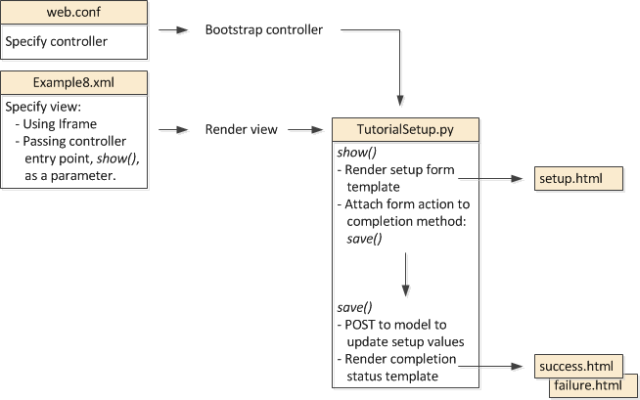
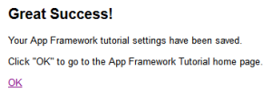

# SUMMARY

[Cookbook tutorial app](http://docs.splunk.com/images/0/05/Dev_tutorial.zip)

## 관련디렉토리

- $SPLUNK_HOME/share/splunk/search_mrsparkle/exposed/css
- $SPLUNK_HOME/share/splunk/search_mrsparkle/exposed/css/skins
- $SPLUNK_HOME/share/splunk/search_mrsparkle/modules

## Simple customizations

### 작업디렉토리

>> $SPLUNK_HOME/etc/apps/{앱명}/appserver/static

- $SPLUNK_HOME/etc/apps/dev_tutorial/appserver/static

### To use custom CSS styling

- $SPLUNK_HOME/etc/apps/dev_tutorial/default/data/ui/views/Example2.xml
  
    ```xml
    <view template="dashboard.html" stylesheet="example2Styles.css">
    ```

- $SPLUNK_HOME/etc/apps/dev_tutorial/appserver/static/example2Styles.css

### To use custom JavaScript

- $SPLUNK_HOME/etc/apps/dev_tutorial/default/data/ui/views/Example3.xml
  
    ```xml
    <module name="SimpleResultsTable">
    <param name="drilldown">row</param>
    <param name="displayMenu">true</param>
    <module name="NullModule"></module>
    </module>
    ```

- $SPLUNK_HOME/etc/apps/dev_tutorial/appserver/static/application.js

    ```js
        switch (Splunk.util.getCurrentView()) {

        case "Example3":
        if (Splunk.Module.NullModule) {
            Splunk.Module.NullModule =
                $.klass(Splunk.Module.NullModule, {
                    getModifiedContext: function() {
                    var context = this.getContext(),
                    click = context.getAll('click');
                    alert (click.value);
                    return context;
                }
            });
        }
        break;}
    ```

    ```js
        if (Splunk.util.getCurrentView() == 'myview') {
        $(document).ready( function() {
            $('.SimpleResultsTable').parent().css('width', '100%');
        });}
    ```

## 커스터마이징 모듈 생성

### 커스터마이징 모듈

- <http://localhost:8000/en-US/modules>

### 커스터마이징 모듈 구성


- $SPLUNK_HOME/etc/apps/dev_tutorial/appserver/modules/CustomResultsTable
- CustomResultsTable.conf
- CustomResultsTable.js
- CustomResultsTable.py

### 커스터마이징 모듈 정의

1. 모듈정의(CustomResultsTable.conf)

    ```properties
    [module]
    className = Splunk.Module.CustomResultsTable
    superClass = Splunk.Module.DispatchingModule
    description = This is my first custom module.
    ```

2. 파라메터 정의(CustomResultsTable.conf)

    ```properties
    [param:myParam]
    required = False
    default = none
    ```

3. 서버사이드(CustomResultsTable.py)

   - 클래스 정의, 메소드 정의, 로직 정의, 화면OUTPUT 정의 및 로그설정

    ```python
    ## 기본 라이브러리
    import controllers.module as module 
    import splunk
    import splunk.search
    import splunk.util
    import splunk.entity
    import lib.util as util
    import lib.i18n as i18n
    import logging

    ## 로그정의
    logger = logging.getLogger('splunk.module.CustomResultsTable')

    ## 클래서 정의
    class CustomResultsTable(module.ModuleHandler):

        ## 메소드 정의
        ## https://docs.splunk.com/Documentation/Splunk/7.3.0/ModuleRef/ModuleHandler
        def generateResults(self, host_app, client_app, sid, count=1000,
            offset=0, entity_name='results'):
            count = max(int(count), 0)
            offset = max(int(offset), 0)
            if not sid:
                raise Exception('CustomResultsTable.generateResults - sid not passed!')
            try:
                ## 로직구현
                job = splunk.search.getJob(sid)
            except splunk.ResourceNotFound, e:
                logger.error('CustomResultsTable could not find job %s.' % sid)
                return _('<p class="resultStatusMessage">Could not retrieve search data.</p>')

            ## 화면OUTPUT
            output = []
            output.append('<div class="CustomResultsTableWrapper">') output.append('<table class="CustomResultsTable splTable">') fieldNames = [x for x in getattr(job, entity_name).fieldOrder if (not x.startswith('_'))]
            dataset = getattr(job, entity_name)[offset: offset+count]

            for i, result in enumerate(dataset):
                output.append('<tr>')
                for field in fieldNames:
                    output.append('<td')
                    fieldValues = result.get(cgi.escape(field), None)
                    if fieldValues:
                        output.append('>%s</td>' % fieldValues)
                    else:
                        output.append('></td>')
                output.append('</tr>')
            output.append('</table></div>')
            output = .join(output)
            return output
    ```

4. 클라이언트사이드(CustomResultsTable.js)

     - Splunk는 사전 정의 된 기능이있는 여러 모듈을 제공
     - Splunk 모듈은 $SPLUNK_HOME/share/splunk/search_mrsparkle/modules
     - 모든 모듈에는 기본 클래스로 Splunk.Module

    ```js
    //클라이언트 클래스 모듈(Splunk.Module.DispatchingModule의 하위 클래스로 인스턴스화)
    Splunk.Module.CustomResultsTable = $.klass(Splunk.Module.DispatchingModule, {

        //생성자 구현
        initialize: function($super, container) {
            $super(container);
            this.myParam = this.getParam("myParam");
            this.resultsContainer = this.container;
        },

        // 검색명령이 완료될 때 호출(이벤트 핸들러)
        onJobDone: function(event) {
            this.getResults();
        },

        // 결과를 적용
        getResultParams: function($super) {
            var params = $super();
            var context = this.getContext();
            var search = context.get("search");
            var sid = search.job.getSearchId();

            if (!sid) this.logger.error(this.moduleType, "Assertion Failed.");

            params.sid = sid;
            return params;
        },

        // 결과 렌더링
        renderResults: function($super, htmlFragment) {
            if (!htmlFragment) {
                this.resultsContainer.html('No content available.');
                return;
            }
            this.resultsContainer.html(htmlFragment);
        }
    })
    ```

    

### 앱View에 모델반영

- $SPLUNK_HOME/etc/apps/dev_tutorial/default/data/ui/views/Example4.xml

```xml
<module name="CustomResultsTable"></module>
```

## JSON 랜더링

### JSON랜더링 모듈 구성

- $SPLUNK_HOME/etc/apps/dev_tutorial/appserver/modules/CustomJSONResults
- CustomJSONResults.conf
- CustomJSONResults.js
- CustomJSONResults.py

### JSON랜더링 모듈 정의

1. 모듈정의(CustomJSONResults.conf)

    ```properties
    [module]
    className = Splunk.Module.CustomJSONResults
    superClass = Splunk.Module.DispatchingModule
    ```

2. 서버사이드(CustomJSONResults.py)

    ```python
    ## 기본 라이브러리
    import cherrypy
    import json
    from splunk.appserver.mrsparkle.lib import jsonresponse

    ## 로그정의
    import logging
    logger = logging.getLogger('splunk.module.CustomJSONResults')

    ## 클래서 정의
    class CustomJSONResults(module.ModuleHandler):

        ## 메소드 정의
        ## https://docs.splunk.com/Documentation/Splunk/7.3.0/ModuleRef/ModuleHandler
        def generateResults(self, host_app, client_app, sid, count=1000,
            offset=0, entity_name='results'):

            count = max(int(count), 0)
            offset = max(int(offset), 0)
            if not sid:
                raise Exception('CustomJSONResults.generateResults - sid not passed!')

            try:
                ## 로직구현
                job = splunk.search.getJob(sid)
            except splunk.ResourceNotFound, e:
                logger.error('CustomJSONResults could not find the job %s. Exception: %s' % (sid, e))
                return _('<p class="resultStatusMessage">Could not retrieve search data.</p>')

            fieldNames = [x for x in getattr(job, entity_name).fieldOrder if (not x.startswith('_'))]

            dataset = getattr(job, entity_name)[offset: offset+count]

            ## 화면OUTPUT
            outputJSON = {}
            for i, result in enumerate(dataset):
                key = True
                for field in fieldNames:
                    fieldValues = result.get(field, None)
                    if fieldValues:
                        if key == True:
                            keyName = fieldValues
                            key = False
                        else:
                            outputJSON[str(keyName)] = str(fieldValues)
                            key = True

        ## Cherrypy라이브러리 Response(json.dumps)
        cherrypy.response.headers['Content-Type'] = 'text/json'
        return json.dumps(outputJSON, sort_keys=True)

    def render_json(self, response_data, set_mime='text/json'):
        cherrypy.response.headers['Content-Type'] = set_mime
        if isinstance(response_data, jsonresponse.JsonResponse):
            response = response_data.toJson().replace("</", "<\\/")
        else:
            response = json.dumps(response_data).replace("</", "<\\/")
        # Pad with 256 bytes of whitespace for IE security issue. See SPL-34355
        return ' ' * 256  + '\n' + response
    ```

3. 클라이언트사이드(CustomJSONResults.js)

    ```js
    //클라이언트 클래스 모듈(Splunk.Module.DispatchingModule의 하위 클래스로 인스턴스화)
    Splunk.Module.CustomJSONResults = $.klass(Splunk.Module.DispatchingModule, {

        // 생성자 구현
        initialize: function($super, container) {
            $super(container);
            this.myParam = this.getParam("myParam");
            this.resultsContainer = this.container;
        },
        // 검색명령이 완료될 때 호출(이벤트 핸들러)
        onJobDone: function(event) {
            this.getResults();
        },
        // 결과를 적용
        getResultParams: function($super) {
            var params = $super();
            var context = this.getContext();
            var search = context.get("search");
            var sid = search.job.getSearchId();
            if (!sid) this.logger.error(this.moduleType, "Assertion Failed.");
            params.sid = sid;
            return params;
        },
        // 결과 렌더링
        renderResults: function($super, results) {
            if(!results) {
            this.resultsContainer.html('No content available.');
                return;
            }
            for (var key in results) {
                console.debug("key = %s, val = %s", key, results[key]);
            }
            htmlFragment = '<div class="CustomResultsTableWrapper">';
            htmlFragment += '<table class="CustomResultsTable splTable">';
            for (var key in results) {
                htmlFragment += '<tr>';
                htmlFragment += '<td>' + key  + '</td><td>' + results[key]  + '</td>';
                htmlFragment += '</tr>';
            }
            htmlFragment += '</table></div>';
            this.resultsContainer.html(htmlFragment);
        }
    })
    ```

### 앱View에 랜더링모델 반영

- $SPLUNK_HOME/etc/apps/dev_tutorial/default/data/ui/views/Example5.xml

```xml
<module name="CustomJSONResults"></module>
```

## 트리맵

### 트리맵 모듈 구성

- $SPLUNK_HOME/etc/apps/dev_tutorial/appserver/modules/TreeMap
- TreeMap.conf
- TreeMap.html
- TreeMap.js
- TreeMap.py

### 트리맵 모듈 정의

1. 모듈정의(TreeMap.conf)

    ```properties
    [module]
    className = Splunk.Module.TreeMap
    superClass = Splunk.Module.DispatchingModule
    ```

2. Protovis 트리맵 라이브러리 import([Mako Template](https://www.makotemplates.org/))

    ```html
    <%page args="module" expression_filter="h"/>
    <%namespace name="lib" file="//lib.html" import="*"/>
    <%lib:script_tags files="${['/static/app/%s/protovis.js' % APP['id']]}" />
    <div id="TreeMapID" class="TreeMapResults"></div>
    ```

    - 모든 템플리트에 대해 %page 표현식을 사용하여 템플리트에 의해 렌더링된 모든 컨텐츠에 대해 Mako expression_filter h를 적용, 이 템플릿에 전달 된 모든 변수는 렌더링 전에 이스케이프, 이것은 변수별로 식 필터를 적용하는 것보다 훨씬 확장 가능한 방법, 이중 이스케이프가 필요한 경우 expression_filter n 를 사용하여 변수를 수동으로 이스케이프 해제, `<div>Something = ${pre_escaped n}</div>`
    - %namespace 태그는 lib 네임 스페이스를 정의하고 lib.html 기본 템플릿(Mako 네임 스페이스 참조)에서 가져 와서 lib.html의 모든 정의를 상속
    - %lib : script_tags 태그는 TreeMap.html이 렌더링 될 때 스크립트 태그에 protovis.js 참조를 포함합니다.

    >> 팁 : 이 예제에서는 사용되지 않았지만 다음을 사용하여 템플릿을 사용하여 템플릿에 의해 렌더링된 HTML에 사용자정의 CSS 및 JavaScript를 포함

    - JavaScript용 script_tags()
    - CSS용 stylesheet_tags()

    - 가장 좋은 방법은 layout/base.html에서 상속 된 css(), custom_css() 또는 js() 메소드를 사용하는 것

    ```html
        <%def name="custom_css()">
        <%lib:stylesheet_tags files="${['/static/app/<appname>/<custom>.css']}" />
        <%lib:script_tags files="${['/static/app/<appname>/<custom>.js']}" />
    ```

    - 다음과 같이 custom_css() 안에 script_tags() 및 stylesheet_tags() 호출을 구현

3. 서버사이드(TreeMap.py)

    ```python
    ## 기본 라이브러리
    import cherrypy
    import json
    from splunk.appserver.mrsparkle.lib import jsonresponse

    ## 로그정의
    import logging
    logger = logging.getLogger('splunk.module.TreeMap')

    ## 클래서 정의
    class TreeMap(module.ModuleHandler):

        ## 메소드 정의
        ## https://docs.splunk.com/Documentation/Splunk/7.3.0/ModuleRef/ModuleHandler
        def generateResults(self, host_app, client_app, sid, count=1000,
            offset=0, entity_name='results'):

            count = max(int(count), 0)
            offset = max(int(offset), 0)
            if not sid:
                raise Exception('CustomJSONResults.generateResults - sid not passed!')

            try:
                ## 로직구현
                job = splunk.search.getJob(sid)
            except splunk.ResourceNotFound, e:
                logger.error('CustomJSONResults could not find the job %s. Exception: %s' % (sid, e))
                return _('<p class="resultStatusMessage">Could not retrieve search data.</p>')

            dataset = getattr(job, entity_name)[offset: offset+count]

            ## 화면OUTPUT
            outputJSON = {}
            for i, result in enumerate(dataset):
                tdict = {}
                tdict[str(result.get('processor', None))] = str(result.get('totalCPU', None))
                name = str(result.get('name', None))
                if name not in outputJSON:
                    outputJSON[name] = dict()
                outputJSON[name].update(tdict)

            ## Cherrypy라이브러리 Response(json.dumps)
            cherrypy.response.headers['Content-Type'] = 'text/json'
            return json.dumps(outputJSON, sort_keys=True)

    def render_json(self, response_data, set_mime='text/json'):
        cherrypy.response.headers['Content-Type'] = set_mime
        if isinstance(response_data, jsonresponse.JsonResponse):
            response = response_data.toJson().replace("</", "<\\/")
        else:
            response = json.dumps(response_data).replace("</", "<\\/")

        # Pad with 256 bytes of whitespace for IE security issue. See SPL-34355
        return ' ' * 256  + '\n' + response
    ```

4. 클라이언트사이드(TreeMap.js)

    ```js
    //클라이언트 클래스 모듈(Splunk.Module.DispatchingModule의 하위 클래스로 인스턴스화)
    Splunk.Module.TreeMap = $.klass(Splunk.Module.DispatchingModule, {

        // 생성자 구현
        initialize: function($super, container) {
            $super(container);
            this.myParam = this.getParam("myParam");
            this.resultsContainer = this.container;
        },
        // 검색명령이 완료될 때 호출(이벤트 핸들러)
        onJobDone: function(event) {
            this.getResults();
        },
        // 결과를 적용
        getResultParams: function($super) {
            var params = $super();
            var context = this.getContext();
            var search = context.get("search");
            var sid = search.job.getSearchId();

            if (!sid) this.logger.error(this.moduleType, "Assertion Failed.");

            params.sid = sid;
            return params;
        },
        // 결과 렌더링 Protovis API(https://www.makotemplates.org/)
        // http://mbostock.github.com/protovis/jsdoc/
        renderResults: function($super, results) {
            if(!results) {
                this.resultsContainer.html('No content available.');
                    return;
                }
                var re = "";
                var color = pv.Colors.category19().by(function(d){return d.parentNode.nodeName});
                var nodes = pv.dom(results).root("flare").nodes();
                var vis = new pv.Panel().width(920).height(420).canvas(document.getElementById('TreeMapID'));
                var treemap = vis.add(pv.Layout.Treemap).nodes(nodes).round(true);
                treemap.leaf.add(pv.Panel).fillStyle(function(d){return color(d).alpha(1)}).strokeStyle("#fff").lineWidth(1).antialias(false);
                treemap.label.add(pv.Label).textStyle(function(d){return pv.rgb(0, 0, 0, 1)});
                vis.render();
            }
    })
    ```

### 앱View에 트리맵 모델 반영

- $SPLUNK_HOME/etc/apps/dev_tutorial/default/data/ui/views/Example6.xml

```xml
<module name="TreeMap"></module>
```

## 파라메터 모듈

### 파라메터 모듈 구성

- $SPLUNK_HOME/etc/apps/dev_tutorial/appserver/modules/ParameterizedTreeMap
- ParameterizedTreeMap.conf
- ParameterizedTreeMap.html
- ParameterizedTreeMap.js
- ParameterizedTreeMap.py

### 파라메터 모듈 정의

1. 모듈정의(ParameterizedTreeMap.conf)

    ```properties
    ## 모듈 선언
    [module]
    className = Splunk.Module.ParameterizedTreeMap
    superClass = Splunk.Module.DispatchingModule

    ## 파라메터 선언
    [param:tmapWidth]
    required = False
    default = 640
    label = This parameter defines the treemap width.
    description = this module waits for the search to complete, formats JSON data, and renders a treemap.

    [param:tmapHeight]
    required = False
    default = 320
    label = This parameter defines the treemap height.
    ```

2. 클라이언트사이드(ParameterizedTreeMap.js)

    ```js
    //클라이언트 클래스 모듈(Splunk.Module.DispatchingModule의 하위 클래스로 인스턴스화)
    Splunk.Module.ParameterizedTreeMap = $.klass(Splunk.Module.DispatchingModule, {

        // 생성자 구현
        initialize: function($super, container) {
            $super(container);
            this.resultsContainer = this.container;
            // 파라메터 선언
            this.tmapHeight = this.getParam('tmapHeight', 920);
            this.tmapWidth = this.getParam('tmapWidth', 420);
        },

        ...

        // 결과 렌더링 Protovis API(https://www.makotemplates.org/)
        // http://mbostock.github.com/protovis/jsdoc/
        renderResults: function($super, results) {

            if(!results) {
            this.resultsContainer.html('No content available.');
                return;
            }

            var re = "";
            var color = pv.Colors.category19().by(function(d){return d.parentNode.nodeName});
            var nodes = pv.dom(results).root("flare").nodes();

            var vis = new pv.Panel().width(this.tmapWidth).height(this.tmapHeight).canvas(document.getElementById('ParameterizedTreeMapID'));

            var treemap = vis.add(pv.Layout.Treemap).nodes(nodes).round(true);
            treemap.leaf.add(pv.Panel).fillStyle(function(d){return color(d).alpha(1)}).strokeStyle("#fff").lineWidth(1).antialias(false);
            treemap.label.add(pv.Label).textStyle(function(d){return pv.rgb(0, 0, 0, 1)});
            vis.render();
        }
    })
    ```

### 앱View에 파라메터 모델 반영

- $SPLUNK_HOME/etc/apps/dev_tutorial/default/data/ui/views/Example6.xml

```xml
<module name="TreeMap"></module>
```

## MVC 모듈


모듈 시스템 MVC 구현에서 :

- 모든 모델은 SplunkAppObjModel 클래스에서 상속됩니다. 모델은 REST API를 사용하여 데이터 엔드포인트에 액세스
- $SPLUNK_HOME/lib/Python2.x/site-packages/splunk/models
- Mako 템플릿은 양식, 팝업 및 상태 알림 일 수 있는보기를 구현
- 모든 컨트롤러는 BaseController 클래스에서 상속

Example8에서는 TutorialSetup 컨트롤러를 사용하여 앱을 설정하는 방법을 보여줌.
다음 그림은 TutorialSetup MVC 구성 요소 간의 종속성을 보여줌



- web.conf 파일은 컨트롤러를 모듈 시스템에 연결
- Example8.xml 파일은 대부분 이전 레시피에서 보았던 모듈보기 정의와 동일
- 차이점은 앱 크롬을 유지하기 위해 iframe을 양식이 렌더링되는 모듈로 지정한다는 것
- 필수 모듈 매개 변수는 양식을 렌더링하는 컨트롤러 메소드의 경로 이름

TutorialSetup.py 컨트롤러 예제

- show() 설정 폼을 렌더링
- save() 양식 값을 모델에 커밋하고 완료시 업데이트 상태를 알림

이러한 메소드는 setup.html, success.html 및 failure.html 템플리트를 렌더링

1. UI 양식 요소와 관련된 모델을 정의
2. 업데이트 완료 (또는 오류 처리)시 구성 가능한 항목 및 탐색을 설정하기위한 앱 UI (보기)를 설계
3. 설정 방법을 렌더링하는 컨트롤러 메소드를 작성
4. 모델 데이터 개체 및 값을 업데이트하는 컨트롤러 방법을 만듬

### 컨트롤러 부트스트랩

- $SPLUNK_HOME/etc/apps/Dev_tutorial/default/web.conf

[endpoint:TutorialSetup]

- SplunkWeb을 시작하면 컨트롤러가 인스턴스화되고 URI 대상이 특정 컨트롤러 메서드로 라우팅
- CherryPy 컨트롤러는 요청 시가 아니라 시작시 인스턴스화
- 컨트롤러 코드를 변경하면 컨트롤러 인스턴스를 다시로드하기 위해 Splunk를 다시 시작
- 커스텀 컨트롤러는 인스턴스화시 예외를 처리하는 데 탄력적이어야 함

컨트롤러는 다음에 노출됩니다.

`/<locale>/custom/<hostApp>/<controllerName>`

예를 들어

`/en-US/custom/dev_tutorial/TutorialSetup`

- 컨트롤러가 시작되었는지 확인하려면 /paths 엔드포인트를 확인
- Splunk를 다시 시작한 후에 컨트롤러가 표시되지 않으면 로드에 실패
- 로그를 확인하여 컨트롤러로드 성공 또는 실패를 확인
- 필요한 경우 컨트롤러 코드에서 @route 데코레이터를 사용하여 추가 엔드포인트를 노출. 노출(`https://<yourServer>/en-US/paths`)
- <http://localhost:8000/en-US/paths>

### 앱크롬을 유지하면서 setup form 지정


- 대부분의 응용 프로그램의 경우 양식을 앱 크롬을 유지하는 splunk view에 포함
- Example8.xml에 추가된 새 모듈에 표시된대로 iframe을 사용하여 수행

```xml
<module name="IFrameInclude" layoutPanel="panel_row2_col1">
   <param name="src">/custom/dev_tutorial/TutorialSetup/show</param>
</module>
```

- show() 양식을 렌더링하는 컨트롤러 진입 점이 매개 변수로 전달

### setup form 랜더링

- 템플릿을 생성
- 템플릿은 컨트롤러에 전달되는 매개 변수와 컨트롤러가 템플릿에 제공해야하는 템플릿 인수를 정의
- setup.html 템플릿은 체크리스트 UI를 구현

```xml
<div id="setup">
<p class="pageDesc">Select the indexer stages you want to display:</p>
<form>
   <input type="checkbox" name="dev-null" value="Yes" /> dev-null<br />
   <input type="checkbox" name="archivepipe" value="Yes" /> archivepipe<br />
   <input type="checkbox" name="fschangemanager" value="Yes" /> fschangemanager<br />
   <input type="checkbox" name="indexerpipe" value="Yes" checked/> indexerpipe<br />
   <input type="checkbox" name="merging" value="Yes" checked/> merging<br />
   <input type="checkbox" name="parsing" value="Yes" checked/> parsing<br />
   <input type="checkbox" name="scheduler" value="Yes" /> scheduler<br />
   <input type="checkbox" name="typing" value="Yes" checked/> typing<br />
   <input type="checkbox" name="tcp" value="Yes" /> tcp<br />
   <input type="checkbox" name="udp" value="Yes" /> udp<br />
   <p>Click the button to save your configuration:</p>
   <input class="splButton-primary" type="submit" value="Save"></input>
</form>
</div>
```

다음 템플릿 기능을 추가하여 setup.html 파일을 작성

1. 필요한 경우 로깅 지원을 추가하여 타사 라이브러리 포함에 설명 된대로 기본 템플릿 및 네임 스페이스를 지정합니다.

    ```html
    <%page expression_filter="h"/>
    <%inherit file="//layout/base.html" />
    <%namespace name="lib" file="//lib.html" import="*"/>
    <%namespace name="helpers" file="//view/_helpers.html" import="*"/>
    <%!import logging
        logger = logging.getLogger('splunk.module.setup')%>
    ```

2. 양식 데이터를 POST 할 gen_form () 함수를 정의하십시오.

    ```html
    <%def name="gen_form(method='POST', action=None)">
    <form method="${method}" action="${action if action else }">
    </%def>
    ```

    - Mako def는 Python 함수와 동일하지만 템플릿에서 사용하도록 수정
    - def는 네임 스페이스를 정의하는 이름 값을 포함
    - Python 함수와 마찬가지로 def는 선택적으로 위치 및 키워드 인수를 기본값으로 정의

3. `<form>`태그 행에서 gen_form() 함수를 호출하십시오.

    ```js
    ${gen_form(method="POST", action=make_url(['custom', 'Dev_tutorial','TutorialSetup', 'save']))} ${csrf_hidden_input()}
    ```

    >> 팁 : lib.html에 정의된 make_url()을 사용하여 로케일을 처리하여 현재 앱 서버 위치에 상대적인 경로를 정의
    >> 팁 : CSRF보호를 추가하고 POST에서 올바른 값을 전달하려면 csrf_hidden_input()을 사용

### 모델 업데이트

URI를 통해 노출되는 각 컨트롤러 메소드는 @expose_page() 데코레이터를 사용합니다.

1. TutorialSetup.py 컨트롤러 파일을 생성하고 컨트롤러가 일반적으로 사용하는 라이브러리 호출

   ```python
    import logging
    import os
    import sys
    import cherrypy
    import splunk
    import splunk.bundle as bundle
    import splunk.appserver.mrsparkle.controllers as controllers
    import splunk.appserver.mrsparkle.lib.util as util
    from splunk.appserver.mrsparkle.lib.decorators
    import expose_page
    ```

    >> 팁 : 표준 라이브러리 가져오기를 먼저 표시 한 다음 타사 가져 오기를 수행 한 다음 로컬 가져 오기를 수행. 이 규칙을 따르면 다른 사람들이 수입품을 더 쉽게 이해

2. 특히, 구성 객체를 다루기 위해 SplunkAppObjModel을 서브클래스로 만드는 import event_type을 import

    ```python
    from splunk.models.event_type import EventType
    ```

    >> 참고 : SplunkAppObjModel은 추상 클래스이므로 서브클래싱을 통해 클래스를 인스턴스화하고 파생

3. BaseController 클래스에서 상속되는 예제 TutorialSetup 컨트롤러 클래스를 정의

    ```python
    class TutorialSetup(controllers.BaseController):
    ```

4. setup.html 양식을 렌더링하려면 show() 메소드를 구현

   ```python
    @expose_page(must_login=True, methods=['GET'])
    def show(self, **kwargs):
    ```

    The only thing we need to do in this example is render the form, passing the template to be rendered as a parameter.

    ```python
    return self.render_template('/dev_tutorial:/templates/setup.html')
    ```

    In practice, you are likely to want to populate form fields with current field values. To do that, get the field values and pass them as a dictionary in a render_template() argument. To get all the values for your app and render them, do something similar to the following:

    ```python
    etype = EventType.all().filter_by_app('Dev_tutorial')
    return self.render_template('/Dev_tutorial:/templates/setup.html', dict(etype=etype))
    ```

    Tip: Use EventType.get() to get specific event values.

5. Implement the save() method to handle form submission and to save the configuration objects to the model, passing form data as a parameter.

    ```python
    @expose_page(must_login=True, trim_spaces=True, methods=['POST'])
    def save(self, **params):
    ```

    Declare a dictionary to hold our configuration objects of name-value pairs.

    ```python
    form_content = {}
    ```

    Get the session CherryPy session associated with the authenticated user.

    ```python
    user = cherrypy.session['user']['name']
    ```

    Iterate through the form data, passed in the parameter, and add the parameter name and value to the dictionary.

    for key, val in params.iteritems():

    ```python
    try:
        if (key != 'splunk_form_key'):
            form_content[key] = EventType.get(EventType.build_id(key, 'Dev_tutorial', user))
            form_content[key].search = val
    except Exception, ex:
        form_content[key] = EventType('Dev_tutorial', user, key)
    ```

    For this tutorial, the model is not a defined endpoint so we need to create the configuration objects. We use an exception on the get() method to determine the object doesn't exist. If it doesn't exist, we create the object instantiating a new configuration object by calling the EventType constructor.

    >> Tip: The build_id() method provides a convenient alternative to specifying a get() path parameter such as:

    '/servicesNS/%s/%s/saved/eventtypes/%s' % (user, 'Dev_tutorial', key)

    After getting the form data, save each configuration object to the model.

    ```python
    for key in form_content.keys():
    try:
        form_content[key].passive_save()
    ```

    >> Tip: The passive_save() method is recommended over save() because it handles errors for you. Exception messages are added to the instance member so you can display errors from the list in the best way for your application.

    If the configuration object value is Yes, the associated indexer stage results are included in the display.

    It is recommended that you handle save exceptions, particularly, authorization exceptions.

    ```python
    except splunk.AuthorizationFailed:
        logger.info('User %s is unauthorized to perform setup on %s' % (user,'Dev_tutorial'))
    except Exception, ex:
        logger.info(ex)
        logger.info('Failed to save eventtype %s' % key)
    ```

    Provide notification on the success or failure of the operation to update configuration data by rendering a status template. For simplicity, this example only provides a notification of successful completion.

    ```python
    return self.render_template('/Dev_tutorial:/templates/success.html')
    ```

### To display update status and continue

You might want to provide a status template to be rendered when show() completes successfully. The success.html template is a simple implementation.



1. Specify the standard template base and namespace entities.

    ```html
    <%inherit file="//layout/base.html" />
    <%namespace name="lib" file="//lib.html" import="*"/>
    ```

2. Provide an exit prompt with the notification, specifying a destination URL.

    ```html
    <a target="_parent" href="${make_url('/app/Dev_tutorial')}" class="splButton-primary">
        <span  class="cancel">OK</span>
    </a>
    ```

    Because we are in an iframe, specify target-"_parent" to alter the parent document instead of the iframe.

    Use make_url() to define a path relative to the current app server location.

### Related recipes(5)

Create a custom module describes the basics of the environment in which your app runs.
Include 3rd-party libraries introduces you to templates.
