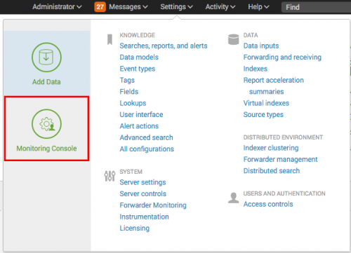

# About the Monitoring Console 

## What is the Monitoring Console?

The Monitoring Console is the Splunk Enterprise monitoring tool. It lets you view detailed topology and performance information about your Splunk Enterprise deployment. Before Splunk Enterprise version 6.5.0, the Monitoring Console was called the Distributed Management Console.

The available dashboards provide insight into the following areas of your deployment or instance:

- search performance and distributed search framework
- indexing performance
- operating system resource usage
- Splunk app key value store performance
- search head and indexer clustering
- index and volume usage
- forwarder connections and Splunk TCP performance
- HTTP Event Collector performance
- license usage.

The Monitoring Console dashboards use data from Splunk Enterprise's internal log files such as metrics.log, as well as data available from Splunk Enterprise platform instrumentation.

Monitoring Console은 Splunk Enterprise 모니터링 도구입니다. Splunk Enterprise 배포에 대한 자세한 토폴로지 및 성능 정보를 볼 수 있습니다. Splunk Enterprise 버전 6.5.0 이전에는 Monitoring Console이 분산 관리 콘솔이라고 불 렸습니다.

사용 가능한 대시 보드는 배포 또는 인스턴스의 다음 영역에 대한 통찰력을 제공합니다.

- 검색 성능 및 분산 검색 프레임 워크
- 색인 생성 성능
- 운영 체제 리소스 사용
- Splunk 앱 키 값 저장 성능
- 검색 헤드 및 인덱서 클러스터링
- 색인 및 볼륨 사용
- 전달자 연결 및 Splunk TCP 성능
- HTTP 이벤트 수집기 성능
- 라이센스 사용.

Monitoring Console 대시 보드는 metrics.log와 같은 Splunk Enterprise의 내부 로그 파일과 Splunk Enterprise 플랫폼 계측에서 제공되는 데이터를 사용합니다.

## Find the Monitoring Console

From anywhere in Splunk Web, click Settings, and then click the Monitoring Console icon on the left.

This screen image shows the settings menu. The icon for the Monitoring Console is on the left of the image, about halfway up.

The Monitoring Console is visible only to users with the Splunk Enterprise admin role.

For information about the Monitoring Console in Splunk Cloud, see [Monitor Splunk Cloud deployment health](http://docs.splunk.com/Documentation/SplunkCloud/7.2.4/User/DMCoverview) in the Splunk Cloud User Manual.

## What can the Monitoring Console do?

There are three main configuration states for the Monitoring Console.

- You can leave the Monitoring Console unconfigured in standalone mode on your Splunk Enterprise instance. This means that you can navigate to the Monitoring Console on your individual instance in your deployment and see that particular instance's performance.
- You can go through the configuration steps, still in standalone mode, which lets you access the default platform alerts.
- You can go through the configuration steps for distributed mode, which lets you log into one instance and view the console's information for every instance in your deployment.

- Splunk Enterprise 인스턴스에서 독립형 모드로 Monitoring Console을 구성 해제 된 상태로 둘 수 있습니다. 즉, 배포 환경의 개별 인스턴스에서 Monitoring Console로 이동하여 특정 인스턴스의 성능을 확인할 수 있습니다.
- 기본 플랫폼 경고에 액세스 할 수있는 독립형 모드의 구성 단계를 계속 진행할 수 있습니다.
- 분산 모드 구성 단계를 수행하면 한 인스턴스에 로그인하여 배포의 모든 인스턴스에 대한 콘솔 정보를 볼 수 있습니다.

### Find answers to common problems

The Monitoring Console is a rich source of troubleshooting information about your Splunk Enterprise deployment. Here are a few examples of problems you can investigate with this tool.

Symptom	Dashboard
My users are reporting errors when they run a search, like "Peer x is unresponsive", "Peer did not participate in search", or "Results might be incomplete".	Possible starting points include:
Distributed search: Deployment health checks, or Distributed search: Instance if you know which search peer is experiencing the problems.
On Resource usage: Deployment select search peers, and look for any that are oversubscribed.
Compare problematic time periods in the Distributed search and Resource usage views to consider capacity planning.
My users' UI is slow	Resource usage: Instance for the instance experiencing problems.
My search performance is slow	Resource usage: Deployment, Scheduler activity, or Search activity
Is my indexer/search head up/down right now?	Overview > Topology
Is indexer workload distributed evenly across instances?	Indexing performance: Deployment
What are my indexes' retention policies?	Indexing > Indexes and Volumes: Instance
KV store is not initializing	Search > KV Store: Deployment
Splunk Web errors that disk space is full	Resource usage: Machine or Indexes and volumes dashboards

### How the Monitoring Console works

This topic lists the files that the Monitoring Console modifies in a Splunk Enterprise filesystem.

These files reside in $SPLUNK_HOME/etc/apps/splunk_monitoring_console/ unless indicated otherwise. This directory contains configuration files in both a default directory and, after Monitoring Console setup, a local directory. See About configuration file directories in the Admin Manual.

이 항목에서는 Splunk Enterprise 파일 시스템에서 Monitoring Console이 수정하는 파일을 나열합니다.

이 파일은 별도로 지정되지 않는 한 $ SPLUNK_HOME / etc / app / splunk_monitoring_console /에 있습니다. 이 디렉토리에는 기본 디렉토리와 Monitoring Console 설치 후 로컬 디렉토리에 모두 구성 파일이 들어 있습니다. 관리 설명서의 구성 파일 디렉토리 정보를 참조하십시오.

File(s)	Information contained in file(s)	When populated
app.conf	Basic information about the Monitoring Console: determines whether it is in distributed mode, and provides a short description for Splunk Web to use in Launcher. See app.conf.spec.	By default. Updated when you click Apply changes.
distsearch.conf in etc/system/local	Contains stanzas that reference distributed search groups created by the Monitoring Console. The names of these groups are usually prefaced with dmc_group_*. For example: [distributedSearch:dmc_group_cluster_master]	When you switch to distributed mode in Monitoring Console setup and click Apply changes
dmc_alerts.conf	In some cases, you can edit thresholds in a platform alert without having to directly modify the search string for that alert. For such an alert, the Monitoring Console has a template of the search string, description string, and editable parameters. The template data, which is used in the Monitoring Console Alerts Setup page, is stored here, in stanzas named for the name of the saved search in default/savedsearches.conf.	By default
lookups directory	Contains two important files:
assets.csv lists the instances that the Monitoring Console recognizes and their peer URI (unique name), server name, host, machine (host fqdn), search group (server role, custom group, or cluster). This csv is used by every Monitoring Console dashboard.
dmc_forwarder_assets.csv is generated when you enable forwarder monitoring. Enabling forwarder monitoring enables the scheduled search (DMC Forwarder - Build Asset Table) in savedsearches.conf, which populates this .csv file. See Configure forwarder monitoring for the Monitoring Console in this manual.
By default (on initial startup). Updated when you click Apply changes or Rebuild forwarder assets, respectively.
macros.conf	Contains two types of macros:
Search macros for all Monitoring Console dashboards.
Overview page customizations set in Monitoring Console > Settings > Overview preferences.
See macros.conf.spec.

Search macros are stored here by default.
Customizations are set when you edit one and click Save.

props.conf	Search-time field extraction and lookup applications and evals. See props.conf.spec.	By default
savedsearches.conf	Schedules and search strings for platform alerts. The saved search named DMC Forwarder - Build Asset Table runs when you enable forwarder monitoring.	By default
splunk_monitoring_console_assets
.conf

This file contains:
A list of search peers configured with the Monitoring Console, and any for which you have disabled monitoring.
Any search peer identifier that has been overwritten by the Monitoring Console manually during setup, for example host, host_fqdn, indexer cluster labels, or search head cluster labels.
Stanzas describing which indexer and search head cluster(s) each search peer is a member of.
When you click "Apply Changes" on Setup > General setup
transforms.conf	Lookup definitions for assets.csv and forwarder csv file	By default
For more details about dmc_alerts.conf and splunk_monitoring_console_assets.conf, look in $SPLUNK_HOME/etc/apps/splunk_monitoring_console/README.