# Extreme Search

<http://www.georgestarcher.com/tag/extreme-search/page/2/>
<http://www.georgestarcher.com/tag/extreme-search/>

## Splunk Getting Extreme Part One

This is going to be a series of posts on Splunk Extreme Search (XS). Something that is for folks with Splunk Enterprise Security (ES). At this time that is the only way to get Extreme Search. It comes as an included Supporting Addon. You can get the Extreme Search Visualization (XSV) app from splunkbase, but it does not have all the commands to fully use Extreme Search (XS)

이것은 Splunk Extreme Search (XS)에 대한 일련의 게시물이 될 것입니다. Splunk Enterprise Security (ES)를 사용하는 사람들을위한 것입니다. 현재 Extreme Search를 이용하는 유일한 방법입니다. 그것은 포함 된 보조 Addon으로 제공됩니다. 당신은 splunkbase에서 극단적 인 검색 시각화 (XSV) 응용 프로그램을 얻을 수 있지만 완전히 익스트림 검색 (XS)을 사용하는 모든 명령을 가지고 있지는 않습니다.

Extreme Search is a tool for avoiding making searches that rely on static thresholds. The Splunk documentation example walks through this based on a simple Authentication failure example. <http://docs.splunk.com/Documentation/ES/4.5.1/User/ExtremeSearchExample>

익스 트림 검색은 정적 임계 값에 의존하는 검색을 피하는 도구입니다. Splunk 문서 예제는 간단한 인증 실패 예제를 기반으로이 과정을 안내합니다. <http://docs.splunk.com/Documentation/ES/4.5.1/User/ExtremeSearchExample>

I like to explain XS this way. You still are filtering search results on a range of values. The difference is rather than hard coding a simple threshold for all data like failureCount > 6 you build a “context” profiled per “class” such as src, user, app so you can search filter on a word like “anomalous”, “medium”, or “extreme”. Those terms are range mapped to values that got calculated based on your existing data. This is way better than simple thresholds.

나는 XS를 이렇게 설명하고 싶다. 검색 범위는 여전히 다양한 값으로 필터링됩니다. 차이점은 모든 데이터에 대해 간단한 임계 값을 하드 코딩하는 것이 아니라 failureCount> 6과 같이 src, user, app와 같은 "클래스"별로 프로파일 된 "컨텍스트"를 작성하여 "이상한", "중간" "또는"극한 ". 이러한 용어는 기존 데이터를 기반으로 계산 된 값에 범위 매핑됩니다. 이것은 간단한 임계 값보다 나은 방법입니다.

Contexts are nothing but fancy lookup tables. They actually get created in the desired app context’s lookup folder.

컨텍스트는 멋진 조회 테이블 일뿐입니다. 실제로 원하는 앱 컨텍스트의 조회 폴더에서 생성됩니다.

To use XS we need to make the “context” and ideally freshen it up on some time interval using a scheduled search. Then we have our search that uses that context to filter for what we are looking for.

XS를 사용하려면 "컨텍스트"를 만들고 일정 검색을 사용하여 일정 시간 간격으로 이상적으로 리프레시해야합니다. 그런 다음 우리는 우리가 찾고있는 것을 필터링하기 위해 컨텍스트를 사용하는 검색을합니다.

### Construction of a context generating search

1. We need a search that gets the data we want bucketed into some time chunks that is meaningful to us.
2. Next we generate the statistics that XS needs to generate our context lookup table for us based on the data.
3. We calculate/handle the depth of our context by working with the values such as max, min, and what are called cross over points. We will talk more about those shortly.
4. We add on the context create/update statement.

한글

1. 우리가 원하는 데이터를 우리에게 의미있는 시간 조각으로 가져 오는 검색이 필요합니다.
2. 다음으로 XS가 데이터를 기반으로 컨텍스트 검색 테이블을 생성하는 데 필요한 통계를 생성합니다.
3. 우리는 맥스, 분, 크로스 오버 포인트 (cross over points)와 같은 값으로 작업함으로써 맥락의 깊이를 계산 / 처리합니다. 우리는 곧 그에 대해 더 이야기 할 것입니다.
4. 컨텍스트 생성 / 업데이트 문에 추가합니다.

### Scenario

This example needs both the XS and XSV apps installed. XSV adds a command called xsCreateADContext that we will need. This stands for Extreme Search Create Anomaly Driven Context. All these XS commands are just custom search commands in a Splunk perspective.

이 예에서는 XS 및 XSV 앱을 모두 설치해야합니다. XSV는 우리가 필요로하는 xsCreateADContext라는 명령을 추가합니다. 이것은 Extreme Search Anomaly Driven Context를 의미합니다. 이 XS 명령어들은 모두 Splunk 퍼스펙티브의 커스텀 검색 명령어입니다.

We are interested in event per second spikes beyond “normal” for a sending host. We will take advantage of Splunk’s own internal metrics logs to do this.

우리는 전송 호스트에 대해 "정상"이상의 초당 이벤트에 관심이 있습니다. 우리는 Splunk의 내부 통계 로그를 활용하여이를 수행 할 것입니다.

### Context Generation

This search will give us all metrics events bucketed into 5 minute averages for a host by day of week and hour of day.

이 검색은 요일 및 시간대별로 호스트에 대해 5 분 평균으로 버킷으로 연결된 모든 메트릭 이벤트를 제공합니다.

```sql
index= _internal source=*metrics.log group=per_host_thruput | bucket _time span=5m | stats max(eps) as eps by _time, series, date_hour, date_wday
```

Next we expand that to generate the overall statistics.

다음으로 전체 통계를 생성하기 위해이를 확장합니다.

```sql
index= _internal source=*metrics.log group=per_host_thruput | bucket _time span=5m | stats max(eps) as eps by _time, series, date_hour, date_wday | stats avg(eps) as average, stdev(eps) as stddev, count by series, date_hour, date_wday
```

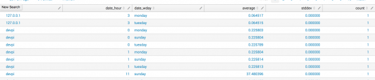

We want to find EPS values that are anomalous to their normal levels. We will be using xsCreateADContext from the XSV app. That command needs the fields min, max, anomalous_normal, and normal_anomalous.

우리는 정상 수준에 변칙적 인 EPS 값을 찾고자합니다. 우리는 XSV 응용 프로그램에서 xsCreateADContext를 사용할 것입니다. 이 명령에는 min, max, anomalous_normal 및 normal_anomalous 필드가 필요합니다.

```sql
index= _internal source=*metrics.log group=per_host_thruput | bucket _time span=5m | stats max(eps) as eps by _time, series, date_hour, date_wday | stats avg(eps) as average, stdev(eps) as stddev, count by series, date_hour, date_wday | eval min=(average-3*stddev-3), max=(average+3*stddev+3), anomalous_normal=(average-2*stddev-1), normal_anomalous=(average+2*stddev+1)
```

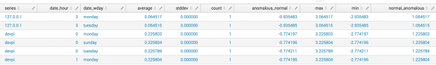

Last we add the command to create the context file.

마지막으로 컨텍스트 파일을 만드는 명령을 추가합니다.

```sql
index= _internal source=*metrics.log group=per_host_thruput | bucket _time span=5m | stats max(eps) as eps by _time, series, date_hour, date_wday | stats avg(eps) as average, stdev(eps) as stddev, count by series, date_hour, date_wday | eval min=(average-3*stddev-3), max=(average+3*stddev+3), anomalous_normal=(average-2*stddev-1), normal_anomalous=(average+2*stddev+1) | xsCreateADContext name=eps_by_series_5m app=search container=splunk_metrics scope=app terms="anomalous,normal,anomalous" notes="eps by host by 5m" uom="eps" class="series, date_wday, date_hour"
```

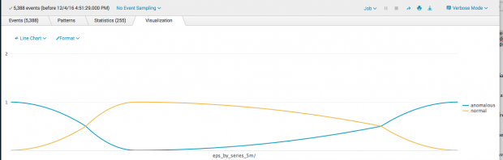

#### Fields and Depth

- `Min` : We calculate min to be the average EPS minus 3 times the standard deviation minus 3. We have to subtract off that last 3 in case the standard deviation is zero. If we did not do this we would get a min=max situation when it was zero. XS has to has ranges to work with.
- `Max` : We calculate min to be the average EPS plus 3 times the standard deviation plus 3. We have to add on that last 3 in case the standard deviation is zero. If we did not do this we would get a min=max situation when it was zero. XS has to has ranges to work with.
- `Anomalous_Normal` : This is the cross over point between a low (left side) anomalous section. So it is similar to calculating Min. But we pull it in some from Min by only using 2 times standard deviation and tacking on a 1 to handle the standard deviation being zero.
- `Normal_Anomalous` : This is the cross over point between a high (right side) anomalous section. So it is similar to calculating Max. But we pull it in some from Max by only using 2 times standard deviation and tacking on a 1 to handle the standard deviation being zero.

- `Min` : min을 평균 EPS에서 표준 편차의 3 배에서 3을 뺀 값으로 계산합니다. 표준 편차가 0 인 경우 마지막 3을 뺍니다. 이렇게하지 않으면 0 일 때 min = max 상황이 발생합니다. XS는 사용할 범위가 있어야합니다.
- `Max` : min을 평균 EPS에 표준 편차의 3 배를 더한 값을 더한 값으로 계산합니다. 표준 편차가 0 인 경우 마지막 3 개를 추가해야합니다. 이렇게하지 않으면 0 일 때 min = max 상황이 발생합니다. XS는 사용할 범위가 있어야합니다.
- `Anomalous_Normal` : 낮은 (왼쪽) 변칙 구간 사이의 교차점입니다. 그래서 Min 계산과 비슷합니다. 그러나 Min에서 표준 편차의 2 배를 사용하고 표준 편차를 0으로 처리하기 위해 1을 tacking하여 일부를 가져옵니다.
- `Normal_Anomalous` : 높은 (오른쪽) 변칙 구간 사이의 교차점입니다. 따라서 Max를 계산하는 것과 유사합니다. 그러나 Max에서 표준 편차의 2 배를 사용하고 표준 편차를 0으로 처리하기 위해 1을 tacking하여 일부를 Max에서 가져옵니다.

In my experience so far playing with the computation of min, max and the cross over points are an experiment. In large volume authentication data I have used 5 times standard deviation for min/max and 3 times for the cross over points. What you use will be some trial and error to fit your data and environment. But you have to create a spread or none of your results will have a depth and then you might as well search for all raw events rather than looking for “abnormal” conditions.

지금까지 min, max 및 cross over points 계산에 참여한 경험이 있습니다. 대용량 인증 데이터에서 나는 최소 / 최대 5 배 표준 편차를 사용했으며 크로스 오버 포인트는 3 번 사용했습니다. 당신이 사용하는 것은 데이터와 환경에 맞는 시행 착오 일 것입니다. 그러나 당신은 결과를 확산 시키거나 아무 것도 만들지 않아야합니다. 그러면 "비정상적인"조건을 찾기보다는 모든 원시 이벤트를 검색 할 수 있습니다.

#### Breaking down the xsCreateADContext command

- `Name` : that is the name of our data context. In this case we called it eps_by_series_5m to represent it is events per second by the series field values in 5 minute averages.
- `App` : this is the app context we want our stuff to exist in within Splunk. In this case we have it make the context file in the search/lookup folder.
- `Container` : this is the name of the csv file that is created in the lookup folder location. The trick to remember here is that the entire csv “container” is loaded into RAM when Splunk uses it. So you want to consider making contexts that have very large numbers of row into their own containers rather than putting multiple named contexts into the same file.
- `Scope` : this is same how to scope access permissions. Normally I just keep it to the app that I am making the context in using the word “app”
- `Terms` : Since we are making an AD context we need to set “anomalous, normal, anomalous” You can understand why when you look at the graphic below. We are saying that the left low side has the word mapped to the ranges as anomalous, the middle range is normal values, then the right high side is anomalous. This is important because when we use this context to search we will say something like “eps is anomalous” which will match any values in the ranges to the left or right of “normal”. This is what I meant by we range map values to words.

- `Name` : 데이터 컨텍스트의 이름입니다. 이 경우 eps_by_series_5m을 호출하여 초당 이벤트를 5 분 평균으로 시리즈 필드 값으로 나타냅니다.
- `App` : 우리의 물건이 Splunk 안에 존재하기를 원하는 앱 컨텍스트입니다. 이 경우 검색 / 조회 폴더에 컨텍스트 파일을 만듭니다.
- `Container` : 이것은 룩업 폴더 위치에 생성 된 CSV 파일의 이름입니다. 여기서 기억해야 할 것은 csv "컨테이너"가 Splunk를 사용할 때 RAM에로드된다는 것입니다. 따라서 여러 개의 명명 된 컨텍스트를 동일한 파일에두기보다는 자체 컨테이너에 매우 많은 수의 행을 포함하는 컨텍스트를 만드는 것이 좋습니다.
- `Scope` : 접근 권한의 범위를 지정하는 것과 같습니다. 일반적으로 나는 단지 "app"이라는 단어를 사용하는 맥락을 만들고있다.
- `Terms` : 광고 문맥을 만들기 때문에 "비정상적, 정상적, 비정상적"으로 설정해야합니다. 아래 그림을 보면 왜 그런지 이해할 수 있습니다. 우리는 왼쪽 하단이 범위에 매핑 된 단어가 비정상적이고 중간 범위가 정상 값이라고 말하면서 오른쪽 상단이 변칙적이라고 말하고 있습니다. 이 문맥을 검색 할 때 "eps is anomalous"와 같이 "normal"의 왼쪽 또는 오른쪽 범위의 값과 일치 할 것이기 때문에 중요합니다. 이것은 내가지도 값을 단어의 범위로 지정한다는 의미입니다.

> Notes and uom: the notes and units of measure fields are just optional. They only matter when you look at the contexts in something like the XSV app GUI.
> 메모 및 uom : 메모 및 측정 단위 필드는 선택 사항입니다. 그것들은 XSV 앱 GUI와 같은 맥락에서 컨텍스트를 볼 때에 만 중요합니다.

- `Class` : this is critical as this is saying we are profiling the values BY series, date_wday and date_hour. This is exactly the same as the split by in a stats command in Splunk.

- `Class` : 이것은 series, date_wday 및 date_hour 값을 프로파일 링한다는 것을 말하는 것이므로 중요합니다. 이것은 Splunk의 stats 명령에서 split by와 동일합니다.

In this chart notice how the light blue middle region is “normal” and to the left and right we have the “anomalous” zones. This helps you visualize what areas you will match when you make compatibility statements like “is normal”, “is anomalous”, ” is above normal”.

이 차트에서 연한 파란색 중간 영역은 "정상"이며 왼쪽과 오른쪽에는 "비정상적인"영역이 있습니다. 이렇게하면 "정상", "비정상", "정상 이상"과 같은 호환성 문구를 작성할 때 일치시킬 영역을 시각화하는 데 도움이됩니다.

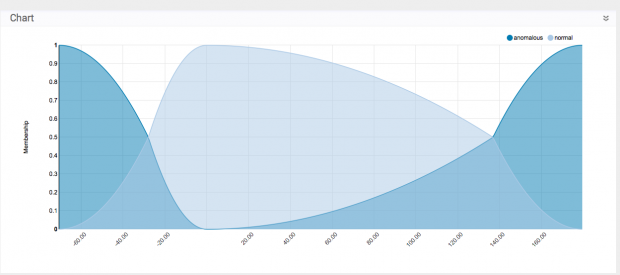

### Using our Context

The key to using the context is making sure we search for data with the same time bucketing and split by fields. Otherwise the context value model won’t line up with our real data very well.

컨텍스트를 사용하는 데있어 핵심은 버킷을 넣고 필드별로 분할하여 데이터를 검색하는 것입니다. 그렇지 않으면 컨텍스트 값 모델이 실제 데이터와 잘 맞지 않습니다.

There are several XS commands we should be familiar with in getting ready to use the context.

컨텍스트를 사용할 준비를 할 때 익숙해 져야 할 몇 가지 XS 명령이 있습니다.

1. xsFindBestConcept: this takes our search and compares it to our context and gives us a guide on what “term” we should use for that result line if we wanted to get it from the filter.
2. xsgetwherecix: this shows us all the results without filtering them but gives us the CIX or compatibility fit value based on the compatibility statement we make. Aka “is anomalous”
3. xswhere: this is the filtering command we will actually use when we are done.

한글

1. xsFindBestConcept : xsFindBestConcept : 검색 결과를 컨텍스트와 비교하여 필터에서 가져 오려는 경우 해당 결과 행에 사용해야하는 용어에 대한 지침을 제공합니다.
2. xsgetwherecix : 필터링없이 모든 결과를 보여 주지만 우리가 작성한 호환성 진술에 따라 CIX 또는 호환성 적합 값을 제공합니다. 일명 "변칙적 인"
3. xswhere :이 작업이 끝나면 실제로 사용할 필터링 명령입니다.

#### xsFindBestConcept

```sql
index= _internal source=*metrics.log group=per_host_thruput | bucket _time span=5m | stats max(eps) as eps by _time, series, date_wday, date_hour | xsFindBestConcept eps from eps_by_series_5m by series, date_wday, date_hour in splunk_metrics
```

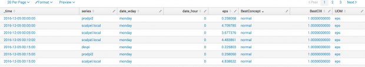

#### xsgetwherecix

```sql
index= _internal source=*metrics.log group=per_host_thruput | bucket _time span=5m | stats max(eps) as eps by _time, series, date_wday, date_hour | xsgetwherecix eps from eps_by_series_5m by series, date_wday, date_hour in splunk_metrics is anomalous
```

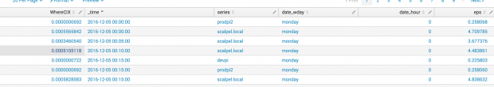

#### xswhere

```sql
index= _internal source=*metrics.log group=per_host_thruput | bucket _time span=5m | stats max(eps) as eps by _time, series, date_wday, date_hour | xswhere eps from eps_by_series_5m by series, date_wday, date_hour in splunk_metrics is anomalous
```


There out of our data for yesterday only two hours were classified as “anomalous.” We did not have to hard code in specific limiting values. Our own existing data helped create an XS context and we then applied that to data going forward.

어제의 데이터에서 "비정상적인"것으로 분류 된 것은 불과 2 시간이었습니다. 특정 제한 값에 하드 코딩 할 필요가 없었습니다. 우리 자신의 기존 데이터는 XS 컨텍스트를 만드는 데 도움을 주었고 앞으로 데이터에 적용했습니다.

Next in our series we will start going through different use cases related to security. We will also cover the other types of contexts than just simply “anomalous.”

다음 시리즈에서는 보안과 관련된 다양한 유스 케이스를 시작합니다. 우리는 단순히 "변칙적 인 것"이 아닌 다른 유형의 상황에 대해서도 다룰 것입니다.

## Splunk Getting Extreme Part Two

Part one gave us a walk through of a simple anomalous search. Now we need to go over foundational knowledge about search construction when building extreme search contexts.

1부는 우리에게 단순한 변칙적인 탐색을 안내합니다. 이제 극단적 인 검색 컨텍스트를 구축 할 때 검색 구성에 대한 기본 지식을 검토해야합니다.

### Comparing Search Methods

#### Traditional Search

This is what we did in part one. We ran a normal SPL search across regular events then used a bucket by _time and stats combination to get our statistics trend over time. This is handy when your event data is not tied to an accelerated Data Model.

이것이 우리가 부분 1에서 한 것입니다. 정기적 인 이벤트에서 일반적인 SPL 검색을 실행 한 다음 _time 및 stats 조합으로 버킷을 사용하여 시간 경과에 따른 통계 동향을 파악했습니다. 이것은 이벤트 데이터가 가속화 된 데이터 모델에 묶이지 않은 경우에 유용합니다.

__Context Gen Search Pattern__ :

```sql
search events action=failure | bucket _time span=1h | stats count by _time, src | stats min, max etc | XS Create/Update
```

__Search Speed__ :

```sql
tag=authentication action=failure
```

“This search has completed and has returned 8,348 results by scanning 14,842 events in 7.181 seconds”

"이 검색은 완료되었으며 7.181 초에 14,842 개의 이벤트를 스캔하여 8,348 개의 결과를 반환했습니다"

#### tstats Search

Splunk is great at the “dynamic schema” aka search time extractions. This flexibility comes at the cost of speed when searching. An Accelerated Data Model is a method to give a step up in performance by building an indexed map of a limited set of fields based on that data. This is much faster to search at the trade off of only being able to specify fields that are mapped in the Data Model. Tstats means tsidx stats. It functions on the tsidx indexing files of the raw data plus it runs the equivalent to “ | datamodel X | stats Z” to catch data that is not accelerated already. This is a middle ground between accelerated and non accelerated only data searching.

Splunk는 "동적 스키마"라고하는 일명 검색 시간 추출에서 뛰어납니다. 이러한 유연성은 검색 할 때의 속도를 희생합니다. 가속 데이터 모델은 해당 데이터를 기반으로 제한된 필드 집합의 인덱싱 된지도를 작성하여 성능을 한 단계 높일 수있는 방법입니다. 데이터 모델에 매핑 된 필드 만 지정할 수 있다는 점에서 트레이드 오프를 검색하는 것이 훨씬 빠릅니다. Tstats는 tsidx 통계를 의미합니다. 원시 데이터의 tsidx 색인 파일에서 작동하며 "| 데이터 모델 X | 통계 Z "는 이미 가속되지 않은 데이터를 잡습니다. 이것은 가속화 된 데이터 검색과 가속화되지 않은 데이터 검색 간의 중간 지점입니다.

__Context Gen Search Pattern__ :

```sql
| tstats count from datamodel=…. by _time… span=1h | stats min, max etc | XS Create/Update
```

__Search Speed__ :

```sql
| tstats count from datamodel=Authentication where nodename=Authentication.Failed_Authentication
```

“This search has completed and has returned 1 results by scanning 12,698 events in 1.331 seconds”

"이 검색이 완료되었으며 1.331 초에 12,698 개의 이벤트를 검색하여 1 개의 결과를 반환했습니다"

#### tstats summariesonly=true Search

Using summaries only with tstats tells Splunk to search ONLY the data buckets that have had their Data Model map acceleration build completed. It leaves off the attempt to even check for non accelerated data to return. This does mean you can miss data that has not yet been accelerated. Or you can miss data if something happens where acceleration data has to be rebuilt. This often happens in an index cluster after a rolling restart.

tstats에서만 요약을 사용하면 Splunk가 데이터 모델 맵 가속 빌드를 완료 한 데이터 버킷 만 검색하도록 지시합니다. 그것은 가속화되지 않은 데이터가 반환되는지 확인하기위한 시도에서 출발합니다. 이는 아직 가속화되지 않은 데이터를 놓칠 수 있음을 의미합니다. 또는 가속 데이터를 다시 작성해야하는 상황이 발생하면 데이터를 놓칠 수 있습니다. 이는 롤링을 다시 시작한 후 인덱스 클러스터에서 자주 발생합니다.

Ball park, the accelerated data copy is going to consume an extra 3.4x storage the size of the indexed data. We are trading that storage for speed for the index of the data. So keep that in mind when you decide how much data to accelerate.

볼 파크 (Ball Park)는 가속화 된 데이터 복사본이 인덱싱 된 데이터의 크기 인 3.4 배의 추가 스토리지를 소비합니다. 우리는 데이터 색인을위한 속도로 스토리지를 교환하고 있습니다. 따라서 가속화 할 데이터 양을 결정할 때이를 염두에 두십시오.

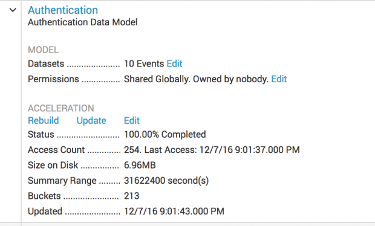

__Context Gen Search Pattern__ :

```sql
| tstats summariesonly=true count from datamodel=…. by _time… span=1h | stats min, max etc | XS Create/Update
```

__Search Speed__ :

```sql
| tstats count from datamodel=Authentication where nodename=Authentication.Failed_Authentication
```

“This search has completed and has returned 1 results by scanning 10,081 events in 0.394 seconds”

### Summary

We can see significant speed increases in the progression across how we constructed the searches.

검색을 구성하는 과정에서 진행 속도가 크게 빨라질 수 있습니다.

1. Traditional Search took 7.2 seconds
2. tstats took 1.3 seconds
3. tstats summariesonly=true took 0.4 seconds.

한글

1. 기존 검색은 7.2 초 걸렸습니다.
2. tstats가 1.3 초 걸렸습니다.
3. tstats summariesonly = true는 0.4 초가 걸렸습니다.

This tells us that when we want to generate stats trends for Extreme Search contexts over large data sets we should use tstats, and with summariesonly=true where we can. That often makes it trivial even in multi TB/day deployments to generate and update our XS search contexts quickly, even over months of data. That is handy when you are trying to “define normal” based on the existing data. All the above speeds are just using Splunk on my late 2012 MacBook Pro. Real indexers etc will perform even better. The point is to show you the gains between the base search methods when building your XS contexts.

이것은 큰 데이터 세트에 대한 Extreme Search 컨텍스트에 대한 통계 동향을 생성 할 때 tstats를 사용해야하며 summariesonly = true를 사용할 수 있어야합니다. 이를 통해 수개월에 걸친 데이터조차도 XS 검색 컨텍스트를 신속하게 생성하고 업데이트 할 수있는 멀티 TB / day 배포에서도 사소한 일이 발생합니다. 기존 데이터를 기반으로 "정상"을 정의하려고 할 때 편리합니다. 위의 모든 속도는 내 늦은 2012 MacBook Pro에서 Splunk를 사용하고 있습니다. 실제 인덱서 등이 더 잘 수행됩니다. 핵심은 XS 컨텍스트를 구축 할 때 기본 검색 방법 간의 차이점을 보여주는 것입니다.

The next posts in our series will focus on actual search use cases and the different XS context types.

우리 시리즈의 다음 글은 실제 검색 유스 케이스와 다른 XS 컨텍스트 유형에 초점을 맞출 것이다.

## Splunk Getting Extreme Part Three

We covered an example of an Anomalous Driven (AD) context in part one and how to use tstats in part two. We will cover the a traditional Domain type context example using Authentication data and tstats.

우리는 1 부에서 AD (Anomalous Driven) 컨텍스트의 예와 2 부에서 tstats를 사용하는 방법에 대해 설명했습니다. 우리는 인증 데이터와 tstats를 사용하여 전통적인 도메인 유형 컨텍스트 예제를 다룰 것입니다.

In XS commands DD mean Data Driven context. Here we will cover a use case using xsCreateDDContext of the type Domain. Using type=domain means we are going to need a count, max, mix. The terms we will use are minimal, low, medium, high, and extreme. This will let us find certain levels of activity without worrying about what “normal” is vs “anomalous” as we saw in part one.

XS 명령에서 DD는 데이터 기반 컨텍스트를 의미합니다. 여기에서는 도메인 유형의 xsCreateDDContext를 사용하는 유스 케이스를 설명합니다. type = domain을 사용한다는 것은 count, max, mix가 필요하다는 것을 의미합니다. 우리가 사용할 용어는 최소, 낮음, 중간, 높음 및 극단입니다. 이것은 우리가 부분 1에서 보았던 것처럼 "정상적인"것이 "변칙적"인 것에 대해 걱정하지 않고 일정 수준의 활동을 발견하게합니다.

### Extreme Search Commands

#### xsCreate

The Create method tells extreme search to create the container and populate or update all the classes if the container already exists. You have to use this if the container does not already exist.

Create 메소드는 극단적 검색이 컨테이너를 생성하고 컨테이너가 이미 존재하는 경우 모든 클래스를 채우거나 업데이트하도록 지시합니다. 컨테이너가 이미 존재하지 않으면 이것을 사용해야합니다.

#### xsUpdate

This functions exactly as the xsCreate except that it will NOT work if the container does not exist. It will return an error and stop.

이 함수는 컨테이너가 존재하지 않으면 작동하지 않는다는 점을 제외하고는 xsCreate와 똑같이 작동합니다. 오류를 반환하고 중지합니다.

#### xsDeleteContext

This will delete a SPECIFIC class or “all” if no class is specified from a context in a container. There is no XS command to actually remove the contents from the container. Deleting against a context/container without a class leaves all the class data but searching against the context will act as if it does not exist. The deletion without a class removed the default class lines. From there XS commands act as if the context is gone though most of the class data remains. This means the file exists with most of its file size intact. There is not even an XS command to remove an entire container. We can still cheat from within Splunk. Normally, you should NEVER touch the context files via the outputlookup command as it will often corrupt the file contents. If we want to empty a container file we can just overwrite the csv file with empty contents. The CSV file name will be in the format: containername.context.csv

컨테이너의 컨텍스트에서 클래스를 지정하지 않으면 SPECIFIC 클래스 또는 "all"이 삭제됩니다. 실제로 컨테이너에서 내용을 제거하는 XS 명령은 없습니다. 클래스가없는 컨텍스트 / 컨테이너에 대한 삭제는 모든 클래스 데이터를 남겨 두지 만 컨텍스트에 대한 검색은 존재하지 않는 것처럼 동작합니다. 클래스가없는 h 제는 기본 클래스 행을 제거했습니다. XS 명령은 대부분의 클래스 데이터가 남아 있지만 컨텍스트가 사라진 것처럼 작동합니다. 즉, 파일 크기가 그대로 유지 된 채로 파일이 존재 함을 나타냅니다. 전체 컨테이너를 제거하는 XS 명령조차 없습니다. 우리는 여전히 Splunk에서 속임수를 쓸 수 있습니다. 일반적으로, 파일 내용을 종종 손상시킬 수 있으므로 outputlookup 명령을 통해 컨텍스트 파일을 만지지 마십시오. 컨테이너 파일을 비우려면 csv 파일을 빈 내용으로 덮어 쓸 수 있습니다. CSV 파일 이름은 containername.context.csv 형식입니다.

If we had made a context with:

```sql
| xsupdateddcontext name=mytest container=mytestContainer app=search scope=app class=src terms=terms="minimal,low,medium,high,extreme"
```

We can nuke the contents of the file using the search:

검색을 사용하여 파일의 내용을 누락시킬 수 있습니다.

```sql
makeresults | outputlookup mytestContainer.context.csv
```

We can now populate that container with either xsCreate or xsUpdate. xsUpdate will work since the container file exists. This trick can be handy to reset a container and cull out accumulated data because the file has grown very large over time with use or if you accidentally fed too much data into it.

이제 해당 컨테이너에 xsCreate 또는 xsUpdate를 채울 수 있습니다. 컨테이너 파일이 있기 때문에 xsUpdate가 작동합니다. 이 트릭은 콘테이너를 리셋하고 축적 된 데이터를 추려내는 데 유용 할 수 있습니다. 왜냐하면 파일이 너무 길어 지거나 사용량이 너무 많아 졌기 때문입니다.

Let’s talk about that for a minute. What is too large? XS has to read in the entire CSV into memory when it uses it. That has the obvious implications. A data set of 10 rows with the normal 5 domain terms of “minimal,low,medium,high,extreme” gives us 56 lines in the csv. 10 data items plus a default data item = 11 * 5 = 55 plus a header row = 56. Generally, if you are going to have 10K data items going into a context I would make one container for it and not share that container with any other contexts. That way you are not reading in a lot of large data into memory you are not using with your XS commands like for xswhere filtering.

잠깐 얘기하자. 너무 큽니다. XS는 그것을 사용할 때 전체 CSV를 메모리로 읽어야합니다. 그것은 명백한 함축성을 가지고 있습니다. "최소, 낮음, 보통, 높음, 극한"의 5 개 도메인 용어로 된 10 개 행의 데이터 세트는 csv에서 56 개의 행을 제공합니다. 10 데이터 항목과 기본 데이터 항목 = 11 * 5 = 55 더하기 헤더 행 = 56. 일반적으로 10K 데이터 항목을 컨텍스트에 넣으려는 경우 하나의 컨테이너를 만들고 그 컨테이너를 다른 컨테이너와 공유하지 않습니다. 다른 문맥. 그렇게하면 xswhere 필터링과 같은 XS 명령을 사용하지 않는 많은 양의 대용량 데이터를 메모리로 읽지 않습니다.

One other thing to consider. The data size of this file is important in the Splunk data bundle replication. It is a csv file in the lookups folder and gets distributed with all the other data. If you made a context so large the CSV was 1.5GB in size you could negatively impact your search bundle replication and be in for the fun that brings.

고려해야 할 한 가지. 이 파일의 데이터 크기는 Splunk 데이터 번들 복제에서 중요합니다. lookups 폴더에있는 csv 파일이며 다른 모든 데이터와 함께 배포됩니다. 컨텍스트를 너무 크게 만들면 CSV의 크기가 1.5GB가되어 검색 번들 복제에 부정적인 영향을 미쳐 재미있는 결과를 얻을 수 있습니다.

#### xsFindBestConcept(설명)

This command comes from the Extreme Search Visualization app. It lets you run data against your context and have it tell you what concept terms best match the each result. This command has to work pretty hard so if your data going in is large it may take a few minutes to come back.

이 명령은 Extreme Search Visualization 앱에서 제공됩니다. 컨텍스트에 대해 데이터를 실행하고 각 결과에 가장 적합한 개념 용어를 알려줍니다. 이 명령은 꽤 힘들어서 데이터가 큰 경우 돌아 오는 데 몇 분이 걸릴 수 있습니다.

```sql
| tstats summariesonly=true dc(Authentication.user) as userCount from datamodel=Authentication where (nodename=Authentication.Failed_Authentication sourcetype=linux_secure) by _time, Authentication.src, Authentication.app span=1d | rename Authentication.* AS * | xsFindBestConcept userCount FROM users_by_src_1d IN auth_failures BY "src,app"
```

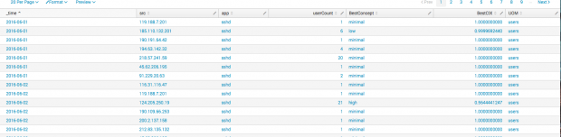

#### xsGetWhereCIX

This command comes acts like xswhere but does not actually filter results. It just displays ALL results that went in and what their CIX compatibility value is for the statement you used.

이 명령은 xswhere와 같은 역할을하지만 결과를 실제로 필터링하지는 않습니다. 그것은 단지 들어간 모든 결과와 사용 된 명령문에 대한 CIX 호환성 값을 표시합니다.

```sql
| tstats summariesonly=true count as failures, dc(Authentication.user) AS userCount from datamodel=Authentication where nodename=Authentication.Failed_Authentication by _time Authentication.src, Authentication.app span=1d | eval avgFailures=failures/userCount | rename Authentication.* AS * | xsgetwherecix avgFailures from failures_by_src_1d by "src,app" in auth_failures is extreme
```

#### Min and Max

XS for the type=domain needs count, and min/max values with depth. This means where min/max are never equal. The fun part is HOW you get a min and max is up to you. You will see examples that just use the min() and max() functions. Other examples will get min() and make max the median()*someValue. You often have to experiment for what fits your data and gives you an acceptable result. We touched on this value spreading in part one of Getting Extreme.

유형 = 도메인에 대한 XS는 개수가 필요하고 최소 / 최대 값은 깊이가 필요합니다. 이것은 min / max가 절대로 같지 않음을 의미합니다. 재미있는 부분은 분을 얻는 방법과 최대는 당신에게 달린 것입니다. min () 및 max () 함수를 사용하는 예제가 표시됩니다. 다른 예제는 min ()을 얻고 median () * someValue를 최대로 만듭니다. 당신은 종종 당신의 데이터에 맞는 것을 실험하고 받아 들일만한 결과를줍니다. Getting Extreme 중 하나에서 확산 된이 가치에 대해 알아 보았습니다.

Here a couple of different patterns though you can do it any way you like.

여기 당신이 좋아하는 어떤 방식 으로든 할 수 있지만 몇 가지 다른 패턴.

1. stats min(count) as min, max(count) as max … | eval max=if(min=max,min+5,max) | eval max=if(max-min<5,min+5,max)
2. stats min(count) as min, median(count) as median, average(count) as average … | eval median=if(average-median<5,median+5,average) | eval max=median*2

한글

1. 통계 min (count) min, max (count) as max ... | eval max = if (min = max, min + 5, max) | eval max = if (max-min <5, min + 5, max)
2. 통계 min (분), min (평균), median (count), average (count) ...로 통계 ... | eval median = if (평균 - 중앙값 <5, 중앙값 + 5, 평균) | eval max = 중간 값 * 2

If you don’t get min/max spread out you will see a message like the following when trying to generate your context.

최소 / 최대 스프레드를 얻지 못하면 상황을 생성 할 때 다음과 같은 메시지가 표시됩니다.

> xsCreateDDContext-W-121: For a domain context failures_by_src_1d with class 103.207.36.133:sshd, min must be less than max, skipping

### Use Case: Authentication Abusive Source IPs

Question: We will define our question as, what are the source IPs that are abusing our system via authentication failures by src and application type. We want to know by average failures/number of user accounts tried per day. We also want to know if it is simply an extreme number of user accounts failed regardless of the number of failures per day. Yeah, normally I would do by hour or shorter period. The test data I have is from a Raspberry Pi exposed to the Internet. The RPi is sending to Splunk using the [UF for Raspberry PI](https://splunkbase.splunk.com/app/1611/). That RPi is also running [fail2ban](http://www.fail2ban.org/wiki/index.php/Fail2ban:Community_Portal), so it limits the number of failures a source can cause before it is banned for a while. This means we will work with a scale that typically maxes out at 6 tries.

질문 : src와 응용 프로그램 유형에 의한 인증 실패를 통해 시스템을 악용하는 소스 IP가 무엇인지 정의합니다. 우리는 평균 실패 횟수 / 하루에 시도한 사용자 계정 수를 알고 싶습니다. 또한 하루에 실패 횟수에 관계없이 실패한 극단적 인 사용자 계정인지 여부도 알고 싶습니다. 네, 보통은 한시간이나 그보다 짧습니다. 내가 가지고있는 테스트 데이터는 인터넷에 노출 된 Raspberry Pi에서 가져온 것입니다. RPi는 [UF for Raspberry PI](https://splunkbase.splunk.com/app/1611/)를 사용하여 Splunk로 보냅니다. RPi는 또한 [fail2ban](http://www.fail2ban.org/wiki/index.php/Fail2ban:Community_Portal)을 실행하기 때문에 소스가 잠시 동안 금지되기 전에 발생할 수있는 실패 횟수를 제한합니다. 이것은 우리가 일반적으로 6 회 시도한 척도로 작업한다는 것을 의미합니다.

#### Avg Failures/userCount by src by day

Here we divide the number of failures by the number of users. This gives us a ball park number of failures for a user account from a given source. We could put user into the class but that would then make our trend too specific of being tied to a distinct src, app,user. We want more a threshold of failures per user per source in a day.

여기에서는 실패 수를 사용자 수로 나눕니다. 이렇게하면 특정 출처의 사용자 계정에 대한 공 파크 횟수가 줄어 듭니다. 우리는 클래스에 사용자를 넣을 수는 있지만 그때 우리의 경향은 별개의 src, app, user에 묶여 있다고 너무 구체적으로 나타납니다. 우리는 하루에 한 소스 당 사용자 당 실패 임계 값을 원합니다.

__Context Gen__ :

```sql
| tstats summariesonly=true count as failures, dc(Authentication.user) AS userCount from datamodel=Authentication where nodename=Authentication.Failed_Authentication by _time Authentication.src, Authentication.app span=1d | eval avgFailures=failures/userCount | stats count, avg(avgFailures) as average, min(avgFailures) as min, max(avgFailures) as max by Authentication.src, Authentication.app | rename Authentication.* AS * | eval max=if(min=max,min+5,max) | xsCreateDDContext name=failures_by_src_1d app=search container=auth_failures scope=app type=domain terms="minimal,low,medium,high,extreme" notes="login failures by src by day" uom="failures" class="src,app"
```

__Search__ :
Here we use the context to filter our data and find the extreme sources.

여기서 우리는 컨텍스트를 사용하여 데이터를 필터링하고 극한의 소스를 찾습니다.

```sql
| tstats summariesonly=true count as failures, dc(Authentication.user) AS userCount from datamodel=Authentication where nodename=Authentication.Failed_Authentication by time Authentication.src, Authentication.app span=1d | eval avgFailures=failures/userCount | rename Authentication.* AS * | xswhere avgFailures from failures_by_src_1d by "src,app" in auth_failures is extreme | iplocation prefix=src src | rename src_City AS src_city, src_Country AS src_country, src_Region as src_region, src_lon AS src_long | lookup dnslookup clientip AS src OUTPUT clienthost AS src_dns
```

#### Distinct User Count by src by day

Here we are going to trend the distinct number of users tried per source without regard of the number of actual failures.

여기서 우리는 실제 실패 횟수에 관계없이 소스 당 시도한 사용자 수를 추세로 추산 할 것입니다.

__Context Gen__ :

```sql
| tstats summariesonly=true dc(Authentication.user) as userCount from datamodel=Authentication where (nodename=Authentication.Failed_Authentication sourcetype=linux_secure) by _time, Authentication.src, Authentication.app span=1d | stats min(userCount) as min, max(userCount) as max, count by Authentication.src, Authentication.app | rename Authentication.* as * | eval max=if(min=max,min+5,max) | xsCreateDDContext name=users_by_src_1d app=search container=auth_failures scope=app type=domain terms="minimal,low,medium,high,extreme" notes="user count failures by src by day" uom="users" class="src,app"
```

__Search__ :
Here we use the context to filter our data and find the sources with user counts above medium.

여기서 우리는 컨텍스트를 사용하여 데이터를 필터링하고 사용자 수가 매체보다 높은 소스를 찾습니다.

```sql
| tstats summariesonly=true dc(Authentication.user) as userCount from datamodel=Authentication where (nodename=Authentication.Failed_Authentication sourcetype=linux_secure) by _time, Authentication.src, Authentication.app span=1d | rename Authentication.* AS * | xswhere userCount from users_by_src_1d in auth_failures by "src,app" is above medium
```

#### Merge to get the most abusive sources by app

We can actually merge both of these searches together. This lets us run one search over a give time period reducing our Splunk resource usage and giving us results that match either or both of our conditions.

실제로 두 검색을 병합 할 수 있습니다. 이를 통해 일정 기간 동안 하나의 검색을 실행하여 Splunk 리소스 사용을 줄이고 우리 조건 중 하나 또는 둘 모두와 일치하는 결과를 제공 할 수 있습니다.

__Combined Search__ :
This search is bucketing the time range it runs across into days then compares to our contexts that were generated with day period as a target. Normally for an ES notable search you would not bucket time with the “by” and “span” portions as you would be only running the search over something like the previous day each day.

이 검색은 일 단위로 실행되는 시간 범위를 버킷킹하여 일일 기간을 대상으로 생성 된 컨텍스트와 비교합니다. 일반적으로 ES 주목할만한 검색의 경우, "날"과 "스팬"부분을 사용하여 시간을 버킷 화하지 않을 것입니다.

```sql
| tstats summariesonly=true count AS failures, dc(Authentication.user) as userCount, values(Authentication.user) as targetedUsers, values(Authentication.tag) as tag, values(sourcetype) as orig_sourcetype, values(source) as source, values(host) as host from datamodel=Authentication where (nodename=Authentication.Failed_Authentication sourcetype=linux_secure) by time, Authentication.src, Authentication.app span=1d | eval avgFailures=failures/userCount | rename Authentication.* AS * | xswhere avgFailures from failures_by_src_1d by "src,app" in auth_failures is extreme OR userCount from users_by_src_1d in auth_failures by "src,app" is above medium | iplocation prefix=src src | rename src_City AS src_city, src_Country AS src_country, src_Region as src_region, src_lon AS src_long | lookup dnslookup clientip AS src OUTPUT clienthost AS src_dns
```

The thing to note about the CIX value is anything that is greater than 0.5 means it matched both our contexts to some degree. The 1.0 matched them both solidly. If the CIX is 0.5 or less it means it matches only one of the contexts to some degree. Notice, I used “is extreme” on one test and “is above medium” on the other. You can adjust the statements to fit your use case and data.

CIX 값에 대해주의해야 할 것은 0.5보다 큰 값이라면 어느 정도 우리의 컨텍스트와 일치한다는 것을 의미합니다. 1.0은 그 둘을 견고하게 매치시켰다. CIX가 0.5 이하이면 어느 정도 컨텍스트 중 하나와 만 일치 함을 의미합니다. 통지, 나는 한 테스트에서 "극한"을 사용했고 다른 테스트에서는 "중간보다 위에"사용했습니다. 유스 케이스와 데이터에 맞게 명령문을 조정할 수 있습니다.

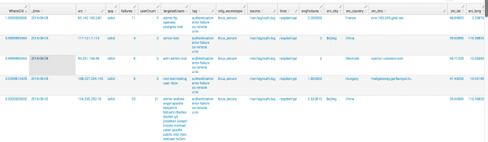

### Bonus Comments

You will notice in the searches above I added some [iplocation](http://www.georgestarcher.com/splunk-updating-the-geoip-database/) and dnslookup commands. I also used the values and extra eval functions to add to the field value content of the results. This is something you want to do when making Enterprise Security notables. This helps give your security analysts data robust notables that they might can triage without ever drilling down into the original event data.

위 검색에서 [iplocation](http://www.georgestarcher.com/splunk-updating-the-geoip-database/) 및 dnslookup 명령을 추가했음을 알 수 있습니다. 또한 값과 추가 평가 함수를 사용하여 결과의 필드 값 내용을 추가했습니다. 이것은 Enterprise Security의 주목할만한 제품을 만들 때 수행하고자하는 작업입니다. 이를 통해 보안 분석가가 원래 이벤트 데이터를 조사하지 않고도 분류 할 수있는 강력한 정보를 제공 할 수 있습니다.

## Splunk Getting Extreme Part Four

Let’s revisit our EPS Splunk Metrics. This time we are going to use type=domain and do something else a little different. We are going to make a non classed context and apply it directly to the raw event data.

EPS Splunk Metrics를 다시 살펴 보겠습니다. 이번에는 type = domain을 사용하고 약간 다른 것을 할 것입니다. 분류되지 않은 컨텍스트를 만들어 원시 이벤트 데이터에 직접 적용하려고합니다.

### The Question

The question we want is, what systems are generating metrics events well above low AND we want to know what concept term they fall in?

우리가 원하는 질문은 어떤 시스템이 메트릭 이벤트를 낮은 수준보다 높게 생성하는지, 그리고 어떤 개념 용어가 들어 있는지 알고 싶습니다.

We also want get the original raw events precise in time. That is technically a different question than we asked in part one of this blog series. There we made more of a canary that asked when did a given host go over normal for its activity levels with no relation to the whole environment in a particular bucket of time.

우리는 또한 원래의 원시 이벤트를 정확한 시간에 정확하게 얻길 원합니다. 이것은 기술적으로 우리가이 블로그 시리즈 중 일부에서 물어 본 것보다 다른 질문입니다. 우리는 주어진 호스트가 시간의 특정 버켓에서 전체 환경과 관련이없는 활동 레벨에 대해 정상적인 상태가되었을 때 더 많은 카나리아를 만들었습니다.

### Context Gen

We want to make a context that is not setup for a class. Note we don’t even use a time bucketing step. The search just is set to run across the previous 30 days which is typically the retention period of Splunk index=_internal logs.

우리는 클래스에 대해 설정되지 않은 컨텍스트를 만들고 싶습니다. 우리는 시간 버킷 팅 단계조차 사용하지 않습니다. 검색은 일반적으로 이전 30 일 동안 실행되도록 설정되며, 일반적으로 Splunk index = _ internal 로그의 보존 기간입니다.

The reason we are doing it this way is we are wanting to find events that are something like high, extreme etc for our entire environment. We don’t care about trending per source system (series). We get count as the distinct count of source systems (series), then the min and max values for EPS for all sources.

우리가 이런 방식으로 그렇게하는 이유는 우리가 전체 환경에 대해 높고 극단적 인 사건을 찾고 싶어하기 때문입니다. 소스 시스템 (시리즈)별로 추세에 신경 쓰지 않습니다. 소스 시스템 (계열)의 고유 한 개수로 계산 한 다음 모든 소스의 EPS에 대한 최소 및 최대 값으로 계산합니다.

```sql
index= _internal source=*metrics.log earliest=-30d latest=now group=per_host_thruput | stats dc(series) as count, min(eps) as min, max(eps) as max | xscreateddcontext name=eps container=splunk_metrics app=search scope=app type=domain terms="minimal,low,medium,high,extreme" notes="events per second" uom=“eps”
```

### Search

First we see if we have any extreme events in the past 30 days.

먼저 지난 30 일 동안 극단적 인 사건이 있는지 확인합니다.

```sql
index= _internal source=*metrics.log group=per_host_thruput | xswhere eps from eps in splunk_metrics is extreme
```

I get one event, the largest catch up of web log imports.

하나의 이벤트, 웹 로그 가져 오기의 최대 캐치를 얻습니다.

```txt
11-11-2016 11:11:54.003 -0600 INFO Metrics - group=per_host_thruput, series="www.georgestarcher.com", kbps=2641.248883, eps=7144.764212, kb=81644.455078, ev=220854, avg_age=1172745.126151, max_age=2283054
```

Next let’s get fancier. We want to know events very above low and have XS tell us what concept term those events best fit. This is a handy way to get the word for the term it fits

다음은 더 좋아질 것입니다. 우리는 아주 낮은 사건을 알고 싶습니다. 그리고 XS가 그 사건이 어떤 개념의 용어에 가장 잘 맞는지 말해달라고하십시오. 이것은 맞는 용어에 대한 단어를 얻는 편리한 방법입니다

```sql
index= _internal source=*metrics.log group=per_host_thruput | xswhere eps from eps in splunk_metrics is very above low | xsFindBestConcept eps from eps in splunk_metrics | table _time, series, eps, kbps, BestConcept
```

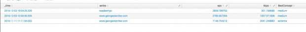

### Summary(4)

The point is that you can use XS to build a context profile for raw data values then apply them back to the raw events. Raw events, if you can keep the number of matches low, make great ES notable events because they have the most of the original data. Using stats and tstats boils down the fields. That requires us to pass through values as we we saw in Part Three to make the results more robust.

핵심은 XS를 사용하여 원시 데이터 값에 대한 컨텍스트 프로파일을 작성한 다음 다시 원시 이벤트에 적용 할 수 있다는 것입니다. 원시 이벤트는 경기 수를 낮게 유지할 수 있으면 원본 데이터를 최대한으로 활용하여 주목할만한 훌륭한 이벤트를 만듭니다. 통계 및 tstats를 사용하면 필드가 나타납니다. 그 결과를보다 강력하게 만들기 위해 제 3 부에서 보았던 값을 통과해야합니다.

## Splunk Getting Extreme Part Five

Part five brings another use case. We will use values in raw data not a calculated value to make our context and then match against the raw events without bucketing them.

5 부는 또 다른 사용 사례를 제시합니다. 우리는 계산 된 값이 아닌 원시 데이터의 값을 사용하여 컨텍스트를 만들고 버킷을 만들지 않고 원시 이벤트와 일치시킵니다.

First, we have glossed over an important question. What does data match when you use xsWhere and there is no matching class in the context? It uses the “default” class. Default is the weight average of all the existing classes within the context. If you look within the csv for the container you will find lines for your context where the class is an empty string “”. That is default. Default is also what is made for the class when no class is specified.

첫째, 우리는 중요한 질문을 글로 나타내었다. xsWhere를 사용하고 컨텍스트에서 일치하는 클래스가 없을 때 데이터가 일치합니까? 그것은 "기본"클래스를 사용합니다. 기본값은 컨텍스트 내의 모든 기존 클래스의 가중 평균입니다. 컨테이너에 대한 CSV 내에서 보면 클래스가 빈 문자열 ""인 상황에 맞는 행을 찾을 수 있습니다. 그것은 기본값입니다. 기본값은 클래스가 지정되지 않은 경우 클래스에 대해 만들어진 것입니다.

You get a message like the following when a class value is not in the context you are trying to use.

클래스 값이 사용하려는 컨텍스트에없는 경우 다음과 같은 메시지가 나타납니다.

```txt
xsWhere-I-111: There is no context 'urllen_by_src' with class 'Not Found' from container '120.43.17.24' in scope 'none', using default context urllen_by_src
```

### Use Case: Finding long urls of interest

#### Just the longer URLs

Let’s try just creating a context of all our url_length data from the Web Data Model. This version of the search will not break this up by class. We will just see if we can find “extreme” length urls in our logs based on the log data itself.

웹 데이터 모델에서 모든 url_length 데이터의 컨텍스트를 작성해 보겠습니다. 이 버전의 검색은 클래스별로이를 구분하지 않습니다. 우리는 로그 데이터 자체를 기반으로 로그에서 "극단적 인"길이의 URL을 찾을 수 있는지 확인합니다.

__Context Gen__ :

```sql
| tstats dc(Web.url_length) as count, avg(Web.url_length) as average, min(Web.url_length) as min, max(Web.url_length) as max from datamodel=Web where Web.src!="unknown" | rename Web.* as * | xsCreateDDContext name=urllen container=web_stats app=search scope=app type=domain terms="minimal,low,medium,high,extreme" notes="urllen" uom="length"
```

The table that is displayed when the xsCreateDDContext finishes is interesting. Below we sort for extreme and see the urllen value is 678. This tells us in my data the url_length value high end is around 678 characters. If we search the logs using this context we find that our results are not a magic all bad “is extreme” situation. All the interesting URLs are down in the low/medium ranges with all the good urls. You have to come up with a another way to slice data when the signal and noise are so close to each other. This approach might work for some other use case, but not for this particular data set.

xsCreateDDContext가 끝났을 때 표시되는 테이블은 흥미 롭습니다. 아래에서 우리는 극단을 정렬하고 urllen 값이 678임을 확인합니다. 이것은 url_length 값 하이 엔드가 내 데이터에서 약 678 문자임을 나타냅니다. 이 컨텍스트를 사용하여 로그를 검색하면 우리의 결과는 모든 "나쁘다"는 아주 나쁜 상황이 아니라는 것을 알 수 있습니다. 모든 흥미로운 URL은 모든 좋은 URL을 사용하여 낮은 / 중간 범위에 있습니다. 신호와 노이즈가 서로 너무 가까울 때 데이터를 조각 내기위한 또 다른 방법을 생각해 내야합니다. 이 접근법은 다른 유스 케이스에서는 작동하지만이 특정 데이터 세트에서는 작동하지 않을 수 있습니다.

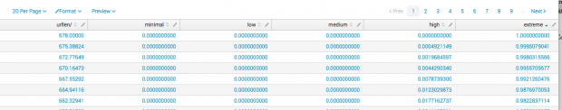

__Searches__ :

```sql
index=weblogs | xswhere url_length from urllen in web_stats is low | stats count by url
```

We get an overwhelming number of matches since most of our URLs are in the low range.

대부분의 URL이 낮은 범위에 있기 때문에 엄청나게 많은 성냥을 얻습니다.

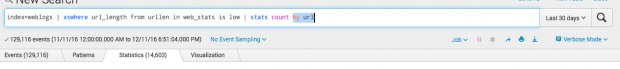

```sql
index=weblogs | xswhere url_length from urllen in web_stats is extreme | stats count by url
```

We get a manageable 5 events from extreme but they are not interesting URLs.

극단적 인 것으로부터 5 개의 이벤트를 처리 할 수 있지만 재미있는 URL은 아닙니다.

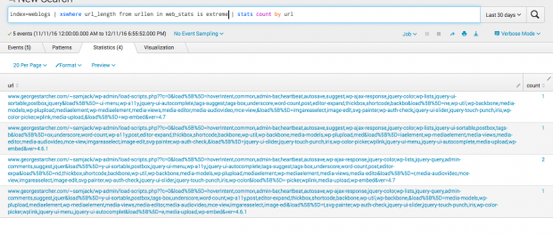

#### URL Length by Src

We get a different url_length distribution if we break it out by src. Remember, default is the weighted average of all the classes in the context if you use classes. The table we see when our context gen finishes is that default.

우리가 src로 나누면 다른 url_length 분포를 얻습니다. 클래스를 사용하는 경우 기본값은 컨텍스트의 모든 클래스에 대한 가중 평균입니다. 컨텍스트 gen이 끝나면 우리가 볼 수있는 테이블은 기본값입니다.

__Context Gen__ :

Notice in our by src version our urllen for extreme in the default context is around 133. That is going to come from the weighted average of the per source classes.

src 버전의 url은 기본 컨텍스트에서 극단에 대한 urllen이 약 133입니다. 이는 소스 클래스 당 가중치 평균에서 나올 것입니다.

```sql
| tstats avg(Web.url_length) as average, min(Web.url_length) as min, max(Web.url_length) as max from datamodel=Web where Web.src!="unknown" by _time, Web.src span=1m | rename Web.* as * | stats count, min(min) as min, max(max) as max, avg(average) as average by src | eval max=if(min=max, max+average, max) | eval max=if(max-min < average , max+average, max) | xsCreateDDContext name=urllen_by_src container=web_stats app=search scope=app type=domain terms="minimal,low,medium,high,extreme" notes="url len by src" uom="length" class="src"
```

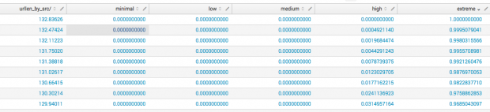

__Search__ :

```sql
index=weblogs | xsWhere url_length from urllen_by_src in web_stats by src is very very extreme | stats values(src) AS sources, dc(src) as sourceCount by url, status_description
```

Even using is very very extreme we get a lot of results. However the urls are much more interesting. Granted none of the searches here in Part Five are super awesome. They do show a workable example of using and XS context directly against raw events. We also get a good comparison of a classless context which does what it is supposed to vs with a class that helps draw out more interesting events. Formulating your XS context and your search questions are very important so you really have to think about what question you are trying to answer and experiment with variations against your own data.

사용하는 경우에도 매우 극단적이므로 많은 결과를 얻습니다. 그러나 URL은 훨씬 더 흥미 롭습니다. 제 5 부에서 검색 한 내용 중 아무 것도 최고입니다. 원시 이벤트에 직접 사용하고 XS 컨텍스트를 사용하는 실용적인 예제를 보여줍니다. 우리는 또한보다 흥미로운 이벤트를 이끌어내는 데 도움이되는 클래스와 비교할만한 클래스없는 컨텍스트를 비교합니다. XS 컨텍스트와 검색 질문을 구성하는 것은 매우 중요하므로 사용자가 답변하려고하는 질문에 대해 생각하고 자신의 데이터에 대한 유사 콘텐츠를 실험해야합니다.

In my data I find interesting URLs trying to redirect through my site but they land on a useless wordpress page.

내 데이터에서 나는 내 사이트를 통해 리디렉션하려고하는 흥미로운 URL을 발견하지만 그들은 쓸모없는 wordpress 페이지에 착륙했습니다.

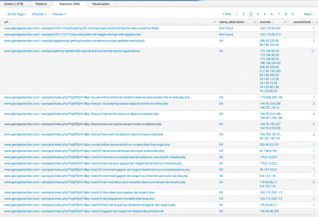

## Splunk Gettinxg Extreme Part Six

Welcome to part six of my series on Splunk Extreme Search. I am dedicating this to my best buddy of 18 years, Rylie. He is my Miniature Pinscher whom I need to let rest come December 29th. He has been awesome all these years and had me thinking about Time. So let’s talk Time and Extreme Search.

Splunk Extreme Search의 제 6 부 시리즈에 오신 것을 환영합니다. 나는 이것을 18 년 동안 가장 좋은 친구에게 헌정하고 있습니다, Rylie. 그는 12 월 29 일에 휴식을 취할 수있는 나의 미니어처 핀셔입니다. 그는 지난 몇 년 동안 두려웠으며 시간에 대해 생각하게했습니다. 그럼 시간과 익스 트림 검색에 대해 이야기 해 봅시다.

We saw in part five that we do not have to always bucket data and stats across time. Still, it is the most common thing to do in Extreme Search. How you handle time is important.

우리는 시간이 지남에 따라 데이터와 통계를 항상 버킷화할 필요가 없다는 것을 5 부에서 보았습니다. 그래도 익스트림 검색에서 가장 일반적으로하는 일입니다. 어떻게 시간을 다루는 것이 중요합니다.

### Saving Time

There are two main things you can do to make your searches time efficient.

검색 시간을 효율적으로 사용하기 위해 수행 할 수있는 두 가지 주요 작업이 있습니다.

1. Use well defined searches. The more precise you can make the up front restrictions like action=success src_ip=10.0.0.0/8 the better the job the indexers can do. This also applies when using tstats by placing these up front restrictions in the where statement.
2. Use accelerated data and tstats. Use the Common Information Model data models where you can. Accelerate them over the time ranges you need. Remember, you can also make custom data models and accelerate those even if your data does not map well to the common ones.

한글

1. 잘 정의 된 검색을 사용하십시오. 보다 정확하게 action = success src_ip = 10.0.0.0 / 8과 같은 전면 제한을 만들면 인덱서가 할 수있는 일을 더 잘 수행 할 수 있습니다. 이는 tstats를 사용할 때 where 문에 이러한 앞쪽 제한 사항을 적용 할 때도 적용됩니다.
2. 가속화 된 데이터와 tstats를 사용하십시오. 가능한 경우 Common Information Model 데이터 모델을 사용하십시오. 필요한 시간 범위에 따라 가속화하십시오. 데이터가 일반적인 데이터 모델과 잘 맵핑되지 않은 경우에도 맞춤 데이터 모델을 만들어 가속화 할 수 있습니다.

### Accelerated Data Models

Seriously. I hot linked the title of this section. Go read it! And remember to hug a Splunk Docs team member at conf. They do an amazing job putting all that in there for us to read.

진지하게. 나는이 섹션의 제목을 핫 링크했다. 가서 읽어! conf에서 Splunk Docs 팀원을 포옹하는 것을 잊지 마십시오. 그들은 우리가 읽을 수 있도록 거기에 모든 것을 넣는 놀랄만한 일을합니다.

You choose how much data to accelerate by time. Splunk takes the DMs that are to be accelerated and launches special hidden searches behind the scenes. These acceleration jobs consume memory and CPU core resources like all the other searches. If you do not have enough resources you may start running into warning about hitting the maximum number of searches and your accelerations may be skipped. Think about that. If you are running ES Notables that use summariesonly=true you will miss matching data. This is because the correlation search runs over a time range and it finds no matching accelerated data. Woo! It is quiet and no notables are popping up. Maybe that isn’t so great… uh oh…

시간별로 가속화 할 데이터 양을 선택합니다. Splunk는 가속화 될 DM을 취하고 특수 숨겨진 검색을 현장에서 시작합니다. 이러한 가속 작업은 다른 모든 검색과 마찬가지로 메모리 및 CPU 코어 리소스를 소모합니다. 리소스가 충분하지 않은 경우 최대 검색 횟수를 경고하는 경고가 표시 될 수 있으며 가속도는 건너 뛸 수 있습니다. 그것에 대해 생각해보십시오. summariesonly = true를 사용하는 ES Notables를 실행하는 경우 일치하는 데이터가 누락됩니다. 이는 상관 관계 검색이 시간 범위에 걸쳐 실행되고 일치하는 가속 데이터가 없기 때문입니다. 우! 그것은 조용하고 주목할만한 것이 없습니다. 어쩌면 그렇게 좋지는 않을거야. 어 .. 오 ..

A second way you can have data model acceleration disruption is by having low memory on your indexers. This one is easier to spot. If you check the Data Model audit in Enterprise Security and see in the last error message column references to oomkiller you have less ram than you need. When that dispatched acceleration job gets killed, Splunk has to toss the acceleration job and dispatch it again on the next run. The data models will never get caught up if the jobs keep getting disrupted.

데이터 모델 가속화를 방해 할 수있는 두 번째 방법은 인덱서에서 메모리를 적게 사용하는 것입니다. 이것은 쉽게 발견 할 수 있습니다. 엔터프라이즈 보안에서 데이터 모델 감사를 확인하고 oomkiller에 대한 마지막 오류 메시지 열에서 필요한 것보다 적은 RAM을 볼 수 있습니다. 그 파견 된 가속 작업이 죽을 때, Splunk는 가속 작업을 던져서 다음 실행시 다시 파견해야합니다. 데이터 모델은 작업이 계속 혼란에 빠지면 결코 포착되지 않습니다.

Acceleration getting behind can happen another way. Index Clustering. Acceleration builds tsidx files with the primary searchable bucket on an indexer. Index clustering exists to replicates data buckets to reduce the chance of data loss or availability if you lose one or more indexers. Prior to Splunk 6.4 there was no replication of the accelerated buckets. Just the data buckets. That was bad news when you had an indexer go down or had a rolling restart across your cluster. It would take time for the accelerations to roll back through, find that the primary bucket is now assigned as primary on a different indexer than where it was earlier. You guessed it. It has to rebuild the acceleration bucket on the indexer that now had the primary flag for that bucket. This is why if you check Data Model Audit in Enterprise Security you will see percentages complete drop most times after restarts of the indexing layer. You can turn on accelerated bucket replication in 6.4, at the cost of storage of course. Are you on version before 6.4 and using Index Clustering with Enterprise Security? You better plan that upgrade.

가속이 뒤쳐지는 것은 다른 방법으로 발생할 수 있습니다. 색인 클러스터링. 가속은 인덱서에서 기본 검색 가능 버킷으로 tsidx 파일을 만듭니다. 인덱스 클러스터링은 데이터 버킷을 복제하여 하나 이상의 인덱서를 잃어버린 경우 데이터 손실 또는 가용성을 줄일 수 있습니다. Splunk 6.4 이전에는 가속 버킷의 복제가 없었습니다. 데이터 버킷. 인덱서가 다운되었거나 클러스터에서 롤링이 다시 시작될 때 그것은 나쁜 소식이었습니다. 가속도가 롤백되는 데 시간이 걸리므로 기본 버킷이 이제 이전 인덱서와 다른 인덱서에서 기본으로 지정됩니다. 당신은 그것을 짐작했다. 인덱서에서 가속 버킷을 다시 작성해야합니다. 이제는 버킷에 기본 플래그가 있습니다. 따라서 Enterprise Security에서 데이터 모델 감사를 검사하면 인덱싱 계층을 다시 시작한 후에 백분율이 대부분 삭제되는 것을 볼 수 있습니다. 6.4에서 가속화 된 버킷 복제를 켜고 저장할 수 있습니다. 6.4 이전 버전입니까? Enterprise Security에서 색인 클러스터링을 사용하고 있습니까? 업그레이드 계획을 세우는 것이 좋습니다.

How far back in time your accelerations are relative to percentages complete is different between environments. Imagine the network traffic data model is behind at 96%. It sounds pretty good, but in large volume environments it could means the latest events in acceleration are 6 hours ago. What does that mean if your threat matching correlation searches only range over the past two hours and use summariesonly? It means no notables firing and you think things are quiet and great. The same thing applies to XS Context Gens. If you use summariesonly and are building averages and other statistics, those numbers are thrown off from what they should be.

가속도가 백분율에 비례하여 어느 정도 역행하는지는 환경에 따라 다릅니다. 네트워크 트래픽 데이터 모델이 96 %라고 가정 해보십시오. 꽤 좋은 것처럼 들리지만 대용량 환경에서는 가속화의 최신 이벤트가 6 시간 전임을 의미 할 수 있습니다. 위협 일치 검색에서 지난 두 시간 동안 만 범위를 검색하고 요약 만 사용하는 경우 그 의미는 무엇입니까? 그것은 발사의 주목할만한 것을 의미하지 않으며 당신은 일이 조용하고 위대하다고 생각합니다. XS Context Gens도 마찬가지입니다. summariesonly를 사용하고 평균 및 기타 통계를 작성하는 경우 해당 숫자는 원래 있어야하는 값에서 벗어납니다.

If your data is pretty constant, like in high volume environments this is a down and dirty search to gauge latest event time compared to now.

대용량 환경에서와 같이 데이터가 꽤 일정하다면 이는 최근의 이벤트 시간을 현재보다 훨씬 더 낮추고 더러운 검색입니다.

```sql
| tstats summariesonly=true min(_time) as earliestTime, max(_time) as latestTime from datamodel=Authentication | eval lagHours=(now()-latestTime)/3600 | convert ctime(*Time)
```

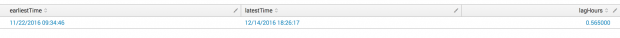

The message is be a good Splunk Admin. Check your data model accelerations daily in your operations review process. Make sure you are adding enough indexers for your data load so DM accelerations can build quickly and stay caught up. You can increase the acceleration.max_concurrent for a given datamodel if you have the CPU resources on both Search Heads and Indexers. Use accelerated bucket replication if you can afford it.

메시지는 좋은 Splunk Admin이 될 것입니다. 작업 검토 프로세스에서 매일 데이터 모델 가속도를 확인하십시오. DM 가속이 신속하게 구축되고 따라 잡을 수 있도록 데이터로드에 충분한 인덱서를 추가해야합니다. 검색 헤드와 인덱서 모두에서 CPU 리소스가있는 경우 주어진 데이터 모델에 대한 acceleration.max_concurrent를 늘릴 수 있습니다. 여유가 있다면 가속화 된 버킷 복제를 사용하십시오.

One way you can spot acceleration jobs using search is something like the following. You may have to mess with the splunk_server field to match your search head pattern if you are on search clustering.

검색을 사용하여 가속 작업을 발견 할 수있는 한 가지 방법은 다음과 같습니다. 검색 클러스터링을 사용하는 경우 splunk_server 필드를 사용하여 검색 헤드 패턴을 일치시켜야 할 수도 있습니다.

```sql
| rest splunk_server=local /servicesNS/-/-/search/jobs | regex label="ACCELERATE" | fields label, dispatchState ,id, latestTime, runDuration
```

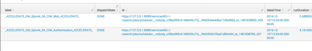

There is another option to help accelerations stay caught up for your critical searches. The gui doesn’t show it but there is a setting called acceleration.backfill_time from [datamodels.conf](http://docs.splunk.com/Documentation/Splunk/latest/Admin/Datamodelsconf). You can say accelerate the Web data model for 30 days of data, but only backfill 7 days. This means if data is not accelerated, such as by an index cluster rolling restart, Splunk will only go back 7 days to catch up accelerations. That can address short run correlation searches for ES. It still creates gaps when using summariesonly for context generation searches that trend over the full 30 days. That brings you back to acceleration replication as the solution.

가속 검색이 중요한 검색에 뒤지지 않도록 도와주는 또 다른 옵션이 있습니다. GUI에는 표시되지 않지만 [datamodels.conf](http://docs.splunk.com/Documentation/Splunk/latest/Admin/Datamodelsconf)에서 acceleration.backfill_time이라는 설정이 있습니다. 30 일 동안 웹 데이터 모델을 가속화하지만 7 일만 백업 할 수 있습니다. 즉, 색인 클러스터 롤링 재시작과 같이 데이터가 가속되지 않으면 Splunk는 가속을 따라 잡기 위해 7 일만 돌아갈 것입니다. 이는 ES에 대한 단기 상관 검색을 처리 할 수 ​​있습니다. 전체 30 일 동안 추세를 보이는 컨텍스트 생성 검색에 summariesonly만을 사용하면 여전히 틈이 생깁니다. 솔루션으로 가속 복제로 다시 돌아갑니다.

Oh, one other little item about data models. A data model acceleration is tied to a search head guid. If you are using search head clustering, it will use a guid for the whole cluster. ONLY searches with the matching GUID can access the accelerated data. No sharing accelerations across search heads not in the same cluster. This is why most of us cringe when Splunk customers ask about running multiple Enterprise Security instances against the same indexers. It requires data model acceleration builds for each GUID. You can imagine how resource hungry that can be at all levels.

오, 데이터 모델에 관한 또 하나의 작은 항목. 데이터 모델 가속은 검색 헤드 GUID에 연결됩니다. 검색 헤드 클러스터링을 사용하는 경우 전체 클러스터에 대해 GUID를 사용합니다. 일치하는 GUID로만 ​​검색하면 가속 데이터에 액세스 할 수 있습니다. 동일한 클러스터에없는 검색 헤드에서 공유 가속은 없습니다. 이러한 이유로 Splunk 고객이 동일한 인덱서에 대해 여러 Enterprise Security 인스턴스를 실행하는 것에 대해 물어볼 때 우리 대부분은 힘들어합니다. 각 GUID에 대한 데이터 모델 가속 빌드가 필요합니다. 당신은 모든 수준에있을 수있는 배가 고픈 자원을 상상할 수 있습니다.

### Context Gens and Correlation Searches

#### Search Scheduling

A context is about defining ways to ask if something is normal, high, extreme etc. Most of our context gens run across buckets of time for time ranges like 24 hours, 30 days and so on.

문맥은 무언가 정상, 최고, 극한 등인지 묻는 방법을 정의하는 것에 관한 것입니다. 우리의 컨텍스트 gens의 대부분은 24 시간, 30 일 등의 시간 범위에 대해 시간의 버킷을 통해 실행됩니다.

Scenario. Lets say we have a context gen that is anomalous login successes by source, app and user. This should let me catch use of credentials from sources not normally seen or at a volume off of normal. If I refresh that context hourly but also run my detection search that uses xswhere hourly; I run the risk of a race condition. I could normalize in the new bad or unexpected source into the context BEFORE I detect it. I would probably schedule my context gen nightly so during the day before it refreshes I get every chance to have ES Notables trigger before the data is normalized into our context. So be sure to compare how often you refresh your context compared to when you use the context.

대본. 소스, 앱 및 사용자에 의한 비정상적인 로그인 성공 인 컨텍스트 gen이 있다고 가정 해 보겠습니다. 이것은 정상적으로 보이지 않는 곳이나 평범하지 않은 곳에서 자격 증명을 사용하게합니다. 시간별로 컨텍스트를 새로 고치면 시간별로 xswhere를 사용하는 검색 검색을 실행하십시오. 경쟁 조건의 위험이 있습니다. 내가 발견하기 전에 새로운 나쁜 또는 예상치 못한 소스를 컨텍스트로 정상화 할 수있었습니다. 야간에 내 컨텍스트 gen을 예약 할 것이므로 새로 고침하기 전날 데이터가 컨텍스트에 정규화되기 전에 ES Notables 트리거를받을 수있는 모든 기회를 얻습니다. 따라서 컨텍스트를 사용할 때와 비교하여 컨텍스트를 새로 고치는 빈도를 비교해야합니다.

#### Time Windows

Check your context generation time range lines up with how far back you accelerate the models. It is easy to say run over 90 days then find out you only accelerated 30 days.

컨텍스트 생성 시간 범위가 얼마나 빨리 모델을 가속화하는지 확인하십시오. 90 일 이상 달리면 30 일만 가속된다는 것을 알기 쉽습니다.

Check the run duration of your searches. Validate your search is not taking longer to run than the scheduled interval of the context gen or correlation search. That always leads to tears. Your search will run on its schedule. Take longer to run and get scheduled for its next run. It will actually start to “time slide” as the next run time gets farther and farther behind compared to the real time the search job finished. I saw this happen with a threat gen search for a threat intel product app once. It was painful. Job/Activity inspector is your friend on checking run durations. Also check the scheduled search panel now and then.

검색 실행 시간을 확인하십시오. 컨텍스트 gen 또는 상관 관계 검색의 예약 된 간격보다 검색 실행이 오래 걸리지 않는지 확인하십시오. 그것은 항상 눈물을 끈다. 검색은 일정에 따라 실행됩니다. 계속해서 달리고 다음 실행을 위해 예약하십시오. 검색 작업이 완료된 실시간에 비해 다음 실행 시간이 멀어지고 멀어지면 실제로 "시간 슬라이드"가 시작됩니다. 위협 인텔 제품 앱에 대한 위협 검색을 한 번 해보았습니다. 고통 스러웠습니다. Job / Activity inspector는 실행 지속 시간을 확인하는 데있어 친구입니다. 또한 지금 예약 된 검색 패널을 확인하십시오.

Look back at the previous posts. We make contexts over time buckets and we make sure to run a search that leverages it over the same bucket width of time. Do trending over a day? Make sure you run your matching correlation search over a day’s worth of time to get numbers on the same scale. Same goes for by hour. Normally you would not make a context by day and search by hour. The scales are different. Mixing scales can lead to odd results.

이전 게시물을 다시보십시오. 우리는 시간의 경과에 따라 컨텍스트를 만들고 동일한 버킷의 시간 폭에 걸쳐이를 활용하는 검색을 수행합니다. 하루 동안 유행합니까? 동일한 척도로 숫자를 얻으려면 하루 동안의 상관 관계 검색을 실행해야합니다. 같은 시간 동안 간다. 일반적으로 낮에는 컨텍스트를 만들고 시간별로 검색하지 않습니다. 비늘은 다릅니다. 스케일을 혼합하면 이상한 결과가 발생할 수 있습니다.

### Embracing the odd

One thing you should get from this series. It is all about The Question. Imagine we trend event count, or data volume per day for a source. Would it ever make sense to use that context over only an hour’s worth of data? Sure. You would get the real low end of the terms like minimal, low, maybe medium. If you saw hits matching “is extreme” you know that you have a bad situation going on. After all, you are seeing a days worth of whatever in only an hour window. Sometimes you break the “rules” because that is the question you want to ask.

당신이이 시리즈에서 얻는 한 가지. 그것은 모든 문제에 관한 것입니다. 소스에 대해 하루에 이벤트 수 또는 데이터 볼륨의 추세를 상상해보십시오. 한 시간 분량의 데이터를 통해 그 맥락을 사용하는 것이 이치에 맞을까요? 확실한. 최소, 낮음, 아마도 중간 정도의 용어의 진짜 로우 엔드를 얻을 수 있습니다. 일치하는 히트가 "극단적 인"것과 일치하면 나쁜 상황이 계속되고 있음을 알 수 있습니다. 결국, 당신은 단지 1 시간의 창문에서 무엇이든간에 가치있는 일을 보게됩니다. 때때로 당신이 물어보고 싶은 질문이기 때문에 "규칙"을 어기는 경우가 있습니다.

I probably would not do that with the Anomaly Driven contexts. After all, you want anomalous deviation off normal.

나는 Anomaly Driven 컨텍스트를 사용하지 않을 것입니다. 결국, 비정상적인 이탈이 정상적으로 이루어지기를 원합니다.

## Splunk Getting Extreme Part Seven

Welcome to part seven where we will try a User Driven context for Extreme Search.

7 부에 오신 것을 환영합니다. 여기서 우리는 익스트림 검색을위한 사용자 중심 컨텍스트를 시도 할 것입니다.

Our use case is to find domain names in a from email address that are look alike domains to our own. We need to use Levenshtein to do this. There is a Splunk app for it on splunkbase. The app does have some issues and needs to be fixed. I also recommend editing the returned fields to be levenshtein_distance and levenshtein_ratio.

우리의 유스 케이스는 우리 자신의 도메인처럼 보이는 이메일 주소의 도메인 이름을 찾는 것입니다. 우리는 이것을하기 위해 레벤 시틴 (Levenshtein)을 사용해야합니다. splunkbase에는 Splunk 앱이 있습니다. 앱에 몇 가지 문제가있어 해결해야합니다. 또한 반환 된 필드를 levenshtein_distance 및 levenshtein_ratio로 편집하는 것이 좋습니다.

### Test Data

I took the new Top 1 Million Sites list from Cisco Umbrella as a source of random domain names. Then I matched it with usernames from a random name list. I needed some test data to pretend I had good email server logs. I do not have those kind of logs at home. The below data is MOCK data. Any resemblance to real email addresses is accidental.

나는 Cisco Umbrella의 새로운 Top 100 만 사이트 목록을 무작위 도메인 이름의 출처로 삼았습니다. 그런 다음 임의의 이름 목록에서 사용자 이름과 대조했습니다. 좋은 이메일 서버 로그를 가진 척하기위한 테스트 데이터가 필요했습니다. 나는 집에서 그런 종류의 통나무를 가지고 있지 않다. 아래의 데이터는 MOCK 데이터입니다. 실제 이메일 주소와 닮은 것은 우발적 인 것입니다.

```sql
source="testdata.txt" sourcetype="demo"
```

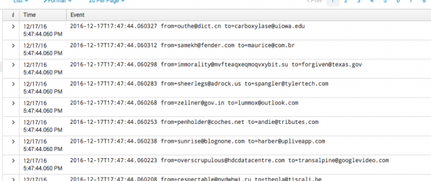

### Context Gen(6)

This time we do not want to make a context based on data. We need to create a mapping of terms to values that we define regardless of the data. Technically we could just use traditional SPL to filter based on Levenshtein distance values. What fun would that be for this series? We also want to demonstrate a User Driven context. Levenshtein is the number of characters difference between two strings, aka the distance. A distance of zero means the strings match. I arbitrarily picked a max value of 15. Pretty much anything 10 or more characters different are so far out we could never care about them. I then picked terms I wanted to call the distance ranges. The closer to zero the more likely it is a look alike domain. “Uhoh” is generally going to be a distance of 0-2 then we go up from there. You could play with the max to get different value ranges mapped to the terms. It depends on your needs.

이번에는 데이터를 기반으로 컨텍스트를 만들고 싶지 않습니다. 우리는 데이터에 관계없이 정의한 값에 대한 용어의 매핑을 생성해야합니다. 기술적으로 Levenshtein 거리 값을 기반으로 필터링하기 위해 전통적인 SPL을 사용할 수 있습니다. 이 시리즈의 재미는 무엇입니까? 우리는 또한 사용자 기반 컨텍스트를 보여주고 싶습니다. Levenshtein은 두 문자열 사이의 문자 차이, 일명 거리입니다. 거리가 0이면 문자열이 일치 함을 의미합니다. 저는 15의 최대 값을 임의로 선택했습니다. 10 개 이상의 다른 문자가 너무 많아서 결코 신경 쓰지 않을 수 있습니다. 나는 거리 범위라고 부르는 용어를 골랐다. 0에 가까울수록 유사하게 보이는 도메인입니다. "Uhoh"는 일반적으로 0-2의 거리가 될 것이고 거기에서부터 올라갑니다. 최대 값을 사용하여 조건에 매핑 된 다양한 값 범위를 얻을 수 있습니다. 그것은 당신의 필요에 달려 있습니다.

```sql
 | xsCreateUDContext name=distances container=levenshtein app=search scope=app terms=“uhoh,interesting,maybe,meh" type=domain min=0 max=15 count=4 uom=distance
```

We can use the Extreme Search Visualization app to examine our context curves and values.

Extreme Search Visualization 앱을 사용하여 컨텍스트 곡선 및 값을 검사 할 수 있습니다.


### Exploring the Data

We can try a typical stats count and wildcard search to see what domains might resemble ours of “georgestarcher.com”

일반적인 통계 계산과 와일드 카드 검색을 통해 "georgestarcher.com"과 유사한 도메인을 확인할 수 있습니다.

```sql
source="testdata.txt" sourcetype="demo" from="*@geo*" | rex field=from "(?P<from_user>[^@]+)@(?P<from_domain>[^$]+)"  | stats count by from_domain
```

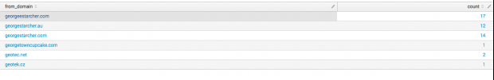

It gets close but matches domains clearly not even close to our good one. Here is the list from my test data generation script.

그것은 가까이에 도착하지만, 우리의 좋은 것에도 가까운 도메인을 명확하게 일치시킵니다. 다음은 테스트 데이터 생성 스크립트의 목록입니다.

```json
georgeDomain = ['georgestarcher.com','ge0rgestarcher.com', 'g5orgestarhcer.net', 'georgestarcher.au', 'georgeestarcher.com']
```

We can see we didn’t find the domain staring with g5. Trying to define a regex to find odd combinations of our domain would be very difficult. So we will start testing our Levenshtein context.

우리는 g5로 응시하는 도메인을 찾지 못했음을 알 수 있습니다. 도메인의 이상한 조합을 찾기 위해 정규 표현식을 정의하려고하면 매우 어려울 것입니다. 그래서 우리는 Levenshtein 컨텍스트를 테스트하기 시작할 것입니다.

Let’s try a getwhereCIX and sort on the distance.

getwhereCIX를 시도하고 거리를 정렬 해 봅시다.

```sql
source="testdata.txt" sourcetype="demo" | rex field=from "(?P<from_user>[^@]+)@(?P<from_domain>[^$]+)" | search from_domain="g*" | eval mydomain="georgestarcher.com" | levenshtein distance mydomain from_domain | search levenshtein_distance!=0 | stats values(levenshtein_distance) as levenshtein_distance by from_domain | xsGetWhereCIX levenshtein_distance from distances in levenshtein is below meh
```

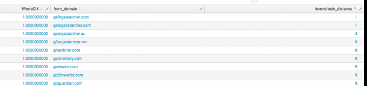

Next let’s try using xsFindBestConcept to see what terms match the domains we are interested in compared to their distances.

다음으로 xsFindBestConcept를 사용하여 우리가 관심있는 도메인과 그 도메인의 거리가 얼마나 유사한 지 확인하십시오.

```sql
source="testdata.txt" sourcetype="demo" | rex field=from "(?P<from_user>[^@]+)@(?P<from_domain>[^$]+)" | search from_domain="g*" | eval mydomain="georgestarcher.com" | levenshtein distance mydomain from_domain | search levenshtein_distance!=0 | stats values(levenshtein_distance) as levenshtein_distance by from_domain | xsFindBestConcept levenshtein_distance from distances in levenshtein
```

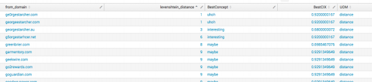

### Using our Context(6)

We have an idea what we need to try based on our exploring the data. Still we will try a few different terms with xswhere to see what we get.

우리는 우리가 데이터를 탐색하는 데 기반하여 무엇을 시도해야 하는지를 알고 있습니다. 아직도 우리는 우리가 얻는 것을보기 위해 xswhere와 몇 가지 다른 용어를 시도 할 것입니다.

#### Using: ”is interesting”

We can see we miss the closest matches this way and get more matches that clearly are not look alikes to our domain.

우리는이 방법으로 가장 가까운 성냥을 놓치고 더 많은 성냥을 얻는 것을 볼 수 있습니다.

```sql
source="testdata.txt" sourcetype="demo" | rex field=from "(?P<from_user>[^@]+)@(?P<from_domain>[^$]+)"  | rex field=to "(?P<to_user>[^@]+)@(?P<to_domain>[^$]+)" | eval mydomain="georgestarcher.com" | levenshtein distance mydomain from_domain | search levenshtein_distance!=0 | xswhere levenshtein_distance from distances in levenshtein is interesting | stats values(from_domain) as domains by levenshtein_distance | sort - levenshtein_distance
```

#### Using: “is near interesting”

Adding the hedge term “near” we can extend matching interesting into just a little into adjacent concept terms. We find all our terms even the closest ones. The problem is we also extended up into the higher distances too.

헤지 용어를 "근처"에 추가하면 흥미로운 부분을 인접 개념 용어로 확장 할 수 있습니다. 우리는 우리의 모든 용어가 가장 가까운 용어를 찾는다. 문제는 우리도 더 먼 거리로 확장된다는 것입니다.

```sql
source="testdata.txt" sourcetype="demo" | rex field=from "(?P<from_user>[^@]+)@(?P<from_domain>[^$]+)"  | rex field=to "(?P<to_user>[^@]+)@(?P<to_domain>[^$]+)" | eval mydomain="georgestarcher.com" | levenshtein distance mydomain from_domain | search levenshtein_distance!=0 | xswhere levenshtein_distance from distances in levenshtein is near interesting | stats values(from_domain) as domains by levenshtein_distance | sort - levenshtein_distance
```

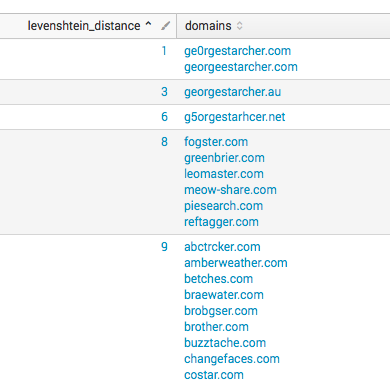

#### Using: “is near uhoh”

Again, we use near to extend up from uhoh but we find it is not far enough to find the domain “g5orgestarhcer.net”

다시 말하지만, 우리는 uhoh에서 위로 확장하기 위해 근처를 사용하지만 우리는 도메인 "g5orgestarhcer.net"을 찾기에 충분하지 않다는 것을 알게됩니다.

```sql
source="testdata.txt" sourcetype="demo" | rex field=from "(?P<from_user>[^@]+)@(?P<from_domain>[^$]+)"  | rex field=to "(?P<to_user>[^@]+)@(?P<to_domain>[^$]+)" | eval mydomain="georgestarcher.com" | levenshtein distance mydomain from_domain | search levenshtein_distance!=0 | xswhere levenshtein_distance from distances in levenshtein is near uhoh | stats values(from_domain) as domains by levenshtein_distance | sort - levenshtein_distance
```


#### Using: “is very below maybe”

This time we have some fun with the hedge terms and say very to pull in the edges and below to go downward from the maybe concept. This gives us the domains we are exactly trying to find. You may have noticed we dropped where the distance was zero in our searches. That is because we don’t care where it is from our own legitimate domain name.

이번에 우리는 헤지 펀드를 재미있게 보았고 어쩌면 어쩌면 컨셉에서 아래로 갈 수 있도록 가장자리와 아래를 잡아 당기는 것이 아주 좋다. 이것은 정확하게 우리가 찾고자하는 도메인을 우리에게줍니다. Google 검색에서 거리가 0 인 곳으로 떨어 뜨린 것을 알 수 있습니다. 그것은 우리가 자신의 합법적 인 도메인 이름에서 어디에 있는지 신경 쓰지 않기 때문입니다.

```sql
source="testdata.txt" sourcetype="demo" | rex field=from "(?P<from_user>[^@]+)@(?P<from_domain>[^$]+)"  | rex field=to "(?P<to_user>[^@]+)@(?P<to_domain>[^$]+)" | eval mydomain="georgestarcher.com" | levenshtein distance mydomain from_domain | search levenshtein_distance!=0 | xswhere levenshtein_distance from distances in levenshtein is very below maybe | stats values(from_domain) as domains by levenshtein_distance | sort - levenshtein_distance
```

### Last Comments

Levenshtein can be real hard to use on shorter domain names. It becomes too easy to match full legitimate other domain names compared to small distances of your own. If you try and use this in making notables you might want to incorporate a lookup table to drop known good domains that are not look alike domains. Here is the same search that worked well for my domain but for google.com. You can see it matches way too much stuff, though it does still capture interesting near domain names.

Levenshtein은 더 짧은 도메인 이름에서 사용하기가 정말로 어려울 수 있습니다. 자신의 작은 거리에 비해 합법적 인 다른 도메인 이름을 비교하는 것은 너무 쉽습니다. 주목할만한 작품을 만들 때이 것을 사용하려고하면 룩업 테이블을 통합하여 유사 도메인이 아닌 알려진 우수한 도메인을 삭제할 수 있습니다. 내 도메인은 물론 google.com에서도 동일한 검색 결과가 나타납니다. 도메인 이름 근처에서 흥미로운 부분을 캡처 할지라도 너무 많은 것들과 일치한다는 것을 알 수 있습니다.

#### Example: google.com

```sql
source="testdata.txt" sourcetype="demo" | rex field=from "(?P<from_user>[^@]+)@(?P<from_domain>[^$]+)"  | rex field=to "(?P<to_user>[^@]+)@(?P<to_domain>[^$]+)" | eval mydomain="google.com" | levenshtein distance mydomain from_domain | search levenshtein_distance!=0 | xswhere levenshtein_distance from distances in levenshtein is very below maybe | stats values(from_domain) as domains by levenshtein_distance | sort - levenshtein_distance
```


## Splunk Getting Extreme Part Eight

Extreme Search has some other commands included with it. They have included the Haversine equation for calculating physical distance in the xsGetDistance command. We can couple that with the Splunk iplocation command to find user login attempts across distances too fast for realistic travel.

익스 트림 검색에는 일부 다른 명령이 포함되어 있습니다. xsGetDistance 명령에서 물리적 거리를 계산하기위한 Haversine 방정식을 포함 시켰습니다. 실제로 Splunk iplocation 명령을 사용하여 거리를 가로 지르는 사용자 로그인 시도가 너무 빨라 현실적인 여행을 할 수 있습니다.

### Context Gen(8)

#### Class: default

First we will create a default context with a maximum speed of 500mph. Note how we do not specify the class argument.

먼저 500mph의 최대 속도로 기본 컨텍스트를 만듭니다. 클래스 인수를 지정하지 않는 것에 유의하십시오.

```sql
| xsCreateUDContext name=speed container=travel app=search scope=app terms="normal,fast,improbable,ludicrous” type=domain min=0 max=500 count=4 uom=mph
```

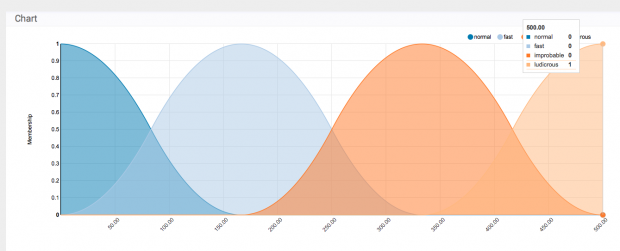

#### Class: all

Second we will create a context for the class all with the same maximum speed of 500mph. We could use a different maximum if we wanted here.

두 번째로 우리는 500mph의 같은 최대 속력으로 클래스 학생들을위한 문맥을 만들 것이다. 우리가 원하면 다른 최대 값을 사용할 수 있습니다.

```sql
| xsCreateUDContext name=speed container=travel app=search scope=app terms="normal,fast,improbable,ludicrous” type=domain min=0 max=500 count=4 uom=mph class=all
```

#### Class: foot

Last we will create a context for the class foot with a maximum speed of 27.8mph. This is approximately the maximum foot speed of a human. This could be useful if measuring speed across a place like a college campus.

마지막으로 27.8mph의 최대 속도로 클래스 풋에 대한 컨텍스트를 만듭니다. 이것은 대략 인간의 최대 발 속도입니다. 대학 캠퍼스와 같은 장소에서 속도를 측정 할 때 유용 할 수 있습니다.

```sql
| xsCreateUDContext name=speed container=travel app=search scope=app terms="normal,fast,improbable,ludicrous” type=domain min=0 max=27.8 count=4 uom=mph class=foot
```

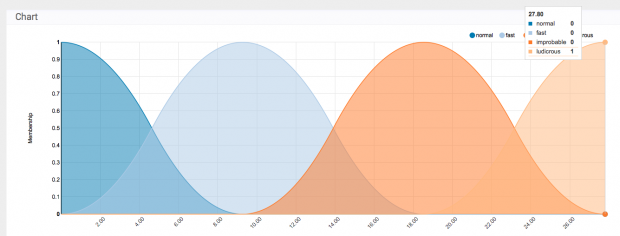

### Search(8)

We will pretend my ssh authentication failures are actually successes. This is just because it is the data I have easily available.

우리는 나의 ssh 인증 실패가 실제로 성공한 척 할 것이다. 이는 내가 쉽게 사용할 수있는 데이터이기 때문입니다.

#### Class: all(Search)

```sql
tag=authentication action=failure user=* src_ip=* user=* app=sshd | iplocation prefix=src_ src_ip | sort + _time | streamstats current=t window=2 earliest(src_lat) as prev_lat, earliest(src_lon) as prev_lon, earliest(_time) as prev_time, earliest(src_City) as prev_city, earliest(src_Country) as prev_country, earliest(src_Region) as prev_region, earliest(src) as prev_src, by user | eval timeDiff=(_time - prev_time) | xsGetDistance from prev_lat prev_lon to src_lat src_lon | eval speed=round((distance/(timeDiff/3600)),2) | table user, src, prev_src, src_Country, src_Region, src_City, prev_country, prev_region, prev_city, speed | eval travel_method="all" | xswhere speed from speed by travel_method in travel is above improbable | convert ctime(prev_time)
```

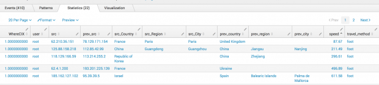

#### Class: foot(Search)

```sql
tag=authentication action=failure user=* src_ip=* user=* app=sshd | iplocation prefix=src_ src_ip | sort + _time | streamstats current=t window=2 earliest(src_lat) as prev_lat, earliest(src_lon) as prev_lon, earliest(_time) as prev_time, earliest(src_City) as prev_city, earliest(src_Country) as prev_country, earliest(src_Region) as prev_region, earliest(src) as prev_src, by user | eval timeDiff=(_time - prev_time) | xsGetDistance from prev_lat prev_lon to src_lat src_lon | eval speed=round((distance/(timeDiff/3600)),2) | table user, src, prev_src, src_Country, src_Region, src_City, prev_country, prev_region, prev_city, speed | eval travel_method="foot" | xswhere speed from speed by travel_method in travel is above improbable | convert ctime(prev_time)
```

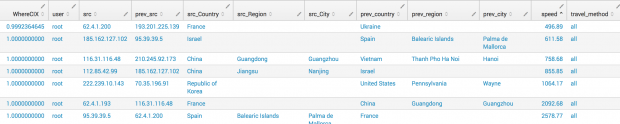

### Summary(8)

We combined a User Driven context with another XS command to provide ourselves an interesting tool. We also saw how we could use different classes within that UD context to answer the question on a different scale. Try adding another class like automobile with a max=100 to find speeds that are beyond safe local travel speeds.

사용자 중심의 컨텍스트를 다른 XS 명령과 결합하여 흥미로운 도구를 제공합니다. 또한 우리는 UD 컨텍스트 내에서 다른 클래스를 사용하여 다른 규모로 질문에 대답 할 수있는 방법을 보았습니다. 자동차와 같은 다른 클래스를 최대 = 100으로 추가하여 안전한 지역 이동 속도를 초과하는 속도를 찾으십시오.

This would be real fun when checking webmail logs to find compromised user accounts. Especially if you combine with Levenshtein for look alike domains sent to users to build the list of whom to check.

웹 메일 로그를 검사하여 손상된 사용자 계정을 찾을 때 정말 재미있을 것입니다. 특히 Levenshtein과 결합하여 사용자에게 보내어 확인할 도메인 목록을 작성하는 경우 비슷합니다.

## Splunk Getting Extreme Part Nine

I ran a series on Splunk Enterprise’s Extreme Search over a year ago. It is time to add a discussion about alfacut. I had not realized the exact behavior of alfacut at the time of that blog series.

Splunk Enterprise의 Extreme Search 시리즈를 1 년 전에 운영했습니다. 이제는 alfacut에 대한 토론을 추가 할 차례입니다. 나는 그 블로그 시리즈의 시간에 alfacut의 정확한 행동을 깨닫지 못했습니다.

### Alfacut

What is alfacut in XS? Extreme Search generates a score called WhereCIX that is the measurement ranging from 0.0 to 1.0 of how compatible what you are measuring is against the Extreme Search statement you made in the xswhere command. The xswhere command uses an alfacut (the limit on the WhereCIX score) of 0.2 by default.

XS에서 alfacut은 무엇입니까? Extreme Search는 WhereCIX라는 스코어를 생성합니다.이 스코어는 xswhere 명령으로 작성한 익스 트림 서치 (Extreme Search) 문항과 비교하여 측정 대상과 얼마나 호환되는지에 대한 측정 범위가 0.0에서 1.0까지입니다. xswhere 명령은 기본값으로 alfacut (WhereCIX 점수 제한)을 0.2로 사용합니다.

Here is where I rant. You CAN put alfacut>=0.7 in your xswhere command. This is like thinking you are cutting with shears and instead you are cutting with safety scissors. It doesn’t work like you would expect when you use compound xswhere commands: AND, OR.

여기 내가 호언 장담하는 곳이있다. xswhere 명령에 alfacut> = 0.7을 넣을 수 있습니다. 이것은 가위로 자르고 있다고 생각하는 것과 같으며 대신 안전 가위로 자르고 있습니다. AND, OR 등의 복합 xswhere 명령을 사용할 때 기대하는 것처럼 작동하지 않습니다.

If you specify the alfacut in the xswhere command it applies the limit to BOTH sides of the compound individually . It does NOT apply to the combined score, which is what you would expect as a user if you were looking at the output after the xswhere command. The WhereCIX  displayed from the output of the xswhere is the score of the compatibility of the entire compound statement.  If we want to filter on the combined score we simply have to know this is how things work and add our filter in the next step in the SPL pipeline.

xswhere 명령에 alfacut을 지정하면 화합물의 양쪽 측면에 제한을 적용합니다. 결합 된 점수에는 적용되지 않습니다. xswhere 명령 다음에 출력을 보았을 때 사용자로서 기대했던 것입니다. xswhere의 출력에서 ​​표시되는 WhereCIX는 복합 문 전체의 호환성 점수입니다. 결합 된 스코어를 필터링하려면 SPL 파이프 라인의 다음 단계에서 필터가 작동하는 방식을 알아야합니다.

### XSWhere Compound Statements

How you define your interesting question for ES Notables matters. Let’s take Excessive Failures.

ES Notables 문제에 대한 흥미로운 질문을 정의하는 방법. 과도한 실패를 가져 가자.

The default Excessive Failures is not even Extreme Search based:

기본 과도한 오류는 익스트림 검색 기반이 아닙니다.

```sql
| from datamodel:"Authentication"."Failed_Authentication" | stats values(tag) as "tag",dc(user) as "user_count",dc(dest) as "dest_count",count by "app","src" | where 'count'>=6
```

This says we find interesting to be a failure count greater or equal to 6 by src, app.

이것은 src, app에 의해 6보다 크거나 같은 실패 횟수가되는 것이 흥미 롭다는 것을 알 수 있습니다.

That is going to be VERY noisy and have little context based on existing behavior. A static limit also gives bad actors a limbo bar to glide under.

그것은 매우 시끄럽고 기존의 행동을 기반으로하는 약간의 상황을 가질 것입니다. 정적 제한은 또한 불량배에게 줄넘기 할 limbo bar를줍니다.

What we really want to ask is: “Give me extreme non normal failure counts by source and app.” This would squash down common repetitive abuse.

우리가 정말로 묻기를 원하는 것은 : "소스와 앱으로 극단적 인 비정상적인 실패 횟수를 주시오."이것은 일반적인 반복적 인 악용을 줄였습니다.

We need a compound statement against anomalous and magnitude contexts.

우리는 변칙적이고 규모가 큰 상황에 대한 복합 선언문이 필요합니다.

The SA-AccessProtection app has an existing XS Context Generator named: Access – Authentication Failures By Source – Context Gen

SA-AccessProtection 애플리케이션에는 다음과 같은 기존 XS 컨텍스트 생성기가 있습니다. 액세스 - 소스 별 인증 실패 - 컨텍스트 Gen

It looks like this:
SA-AccessProtection 애플리케이션에는 다음과 같은 기존 XS 컨텍스트 생성기가 있습니다. 액세스 - 소스 별 인증 실패 - 컨텍스트 Gen

다음과 같이 보입니다.

```sql
| tstats `summariesonly` count as failures from datamodel=Authentication.Authentication where Authentication.action="failure" by Authentication.src,_time span=1h
| stats median(failures) as median, min(failures) as min, count as count
| eval max = median*2
| xsUpdateDDContext app="SA-AccessProtection" name=failures_by_src_count_1h container=authentication scope=app
| stats count
```

The issue is that failures by src only is misleading because what if the failure pattern of the “app” such as ssh or mywebapp differ but from same source. You don’t want them hiding the other’s pattern.

문제는 ssh 또는 mywebapp와 같은 "app"의 실패 패턴이 다르지만 동일한 소스의 경우에는 무엇 때문에 src에 의한 오류 만 오도 된 것입니다. 다른 패턴을 숨기지 않으려는 것입니다.

### Magnitude Context Gen

```sql
| tstats `summariesonly` count as failure from datamodel=Authentication
    where (nodename="Authentication.Failed_Authentication" NOT
    Authentication.src_category="known_scanner" Authentication.app!=okta) by
    Authentication.src, Authentication.app, _time span=1h
| stats median(failure) as median, avg(failure) as average, stdev(failure)
    as stdev, min(failure) as min, max(failure) as max, count as count by
    Authentication.src, Authentication.app
| `drop_dm_object_name("Authentication")`
| eval min=if(min=max,0,min)
| eval max=if(min=0,6,max)
| eval max=if(max-min<6,min+6,max)
| xsCreateDDContext app="SA-AccessProtection"
    name=failures_by_src_app_count_1h class="src,app" container=authfails
    scope=app terms=`xs_default_magnitude_concepts` type=domain
```

That gives us the stats for a source and the app it is abusing such as sshd specifically. I used xsCreateDDContext instead of xsUpdateDDContext, because the first time we run it we need to create  a new vs update an existing context file.

그것은 소스와 우리가 특별히 sshd와 같이 남용하고있는 앱에 대한 통계를 제공합니다. xsUpdateDDContext 대신 xsCreateDDContext를 사용했습니다. 처음 실행할 때 기존 컨텍스트 파일을 업데이트해야하기 때문에 새로운 컨텍스트 파일을 업데이트해야합니다.

We need more than this though. Because maybe there is a misbehaving script and we do not want ES Notable events for simply extreme failures but non normal extreme failure counts.

우리는 이것보다는 더 많은 것을 필요로합니다. 어쩌면 오작동하는 스크립트가 있기 때문에 우리는 단순히 극단적 인 실패에 대한 ES 주목할만한 사건이 아니라 정상적인 극단적 인 실패 횟수에 대한 ES의 사건을 원하지 않기 때문입니다.

To use Anomalous XS commands you need to have the extra XS visualization app installed from splunkbase: <https://splunkbase.splunk.com/app/2855/>

Anomalous XS 명령을 사용하려면 splunkbase에서 추가 XS 시각화 응용 프로그램을 설치해야합니다. <https://splunkbase.splunk.com/app/2855/>

### Anomalous Context Gen

```sql
| tstats `summariesonly` count as failure from datamodel=Authentication
    where (nodename="Authentication.Failed_Authentication") by Authentication.src,
    Authentication.app, _time span=1h
| stats stdev(failure) as stddev, avg(failure) as average, count by
    Authentication.src, Authentication.app
| `drop_dm_object_name("Authentication")`
| eval max=average+5*stddev+4, min=average-5*stddev-4,
    anomalous_normal=average-3*stddev-2, normal_anomalous=average+3*stddev+2
| xsCreateADContext name=anomalous_failures_by_src_app_count_1h
    container=anomalous_authfails scope=app app="SA-AccessProtection"
    terms="anomalous,normal,anomalous" class="src,app"
```

### Combining Contexts

Our NEW xswhere:

```sql
| xswhere failure from failures_by_src_app_count_1h in authfails by
    "src,app" is extreme AND failure from
    anomalous_failures_by_src_app_count_1h in anomalous_authfails by "src,app"
    is above normal
```

See we did not specify the alfacut in the xswhere command. Instead, we need to use a following where statement:

```sql
| where WhereCIX>=.9
```

That gives us a limit using the compatibility score of the entire compound statement. This will be much less noisy a result. If you have a compound statement and a WhereCIX of 0.5 you typically have a one sided match. Meaning it was perfectly compatible with one side of your statement but not the other at all. This is common when you combine anomalous and magnitude contexts like this. You have yup it was super noisy but that was totally normal for it so it was NOT above normal but WAS extreme.

따라서 복합 문 전체의 호환성 점수를 사용하면 한계가 있습니다. 이것은 훨씬 시끄러운 결과가 될 것입니다. 복합 문과 WhereCIX가 0.5 인 경우 일반적으로 일방적 인 일치가 발생합니다. 그것은 문장의 한쪽면과 완벽하게 호환되지만 다른면은 전혀 호환되지 않는다는 것을 의미합니다. 이것은 변칙적 인 것과 진도의 맥락을 결합 할 때 일반적입니다. 당신은 굉장히 시끄 럽다. 그러나 그것은 정상적이었다. 그러나 WAS 극단이었다. 그래서 그것은 정상적이었다.

One possible new Excessive Failed Logins search could look something like this:

가능한 새로운 로그인 실패 검색은 다음과 같이 보일 수 있습니다.

```sql
| tstats `summariesonly` count as failure, dc(Authentication.src) as srcCount,
| tstats `summariesonly` count as failure, dc(Authentication.src) as srcCount,
    values(Authentication.app) as app, values(Authentication.tag) as tag,
    values(Authentication.signature) as signature,
    values(Authentication.signature_id) as signature_id from
    datamodel=Authentication where
    (nodename=Authentication.Failed_Authentication
    Authentication.user!="unknown"
    Authentication.user!="-" Authentication.user!=*$
    Authentication.src!="unknown" Authentication.src!="\\"
    Authentication.src!="::" NOT Authentication.src_category="known_scanner" NOT
    Authentication.user_category="known_scanner" ) by
    Authentication.user, Authentication.src, Authentication.dest, _time, index,
    sourcetype
| `drop_dm_object_name("Authentication")`
| stats dc(user) as "user_count",dc(dest) as
    "dest_count",sum(failure) as failure, values(user) AS user, values(dest) as dest,
    values(signature) as signature, values(signature_id) as signature_id,
    values(index) as index, values(sourcetype) as sourcetype by "src","app"
| eval src=mvjoin(src,"|"), user=mvjoin(user,"|"), dest=mvjoin(dest,"|"), sourcetype=mvjoin(sourcetype,"|"), signature=mvjoin(signature,"|"), signature_id=mvjoin(signature_id,"|")
| xswhere failure from failures_by_src_app_count_1h in authfails by
    "src,app" is extreme AND failure from
    anomalous_failures_by_src_app_count_1h in anomalous_authfails by "src,app"
    is above normal
| where WhereCIX>=0.9
| eval urgency=if(failure<10,"informational",null()), src=split(src,"|"), user=split(user,"|"), dest=split(dest,"|"), sourcetype=split(sourcetype,"|"), signature=split(signature,"|"), signature_id=split(signature_id,"|")
| lookup dnslookup clientip AS src OUTPUTNEW clienthost AS src_dns
| iplocation src prefix=srcgeo_
| eval src_city=coalesce(src_city, srcgeo_City),
    src_country=coalesce(src_country, srcgeo_Country),
    src_lon=coalesce(src_lon, srcgeo_long) , src_lat=coalesce(src_lat,
    srcgeo_lat)
| eval orig_index=index, orig_sourcetype=sourcetype, tag=mvappend(tag,"authentication"), action="failure"
```