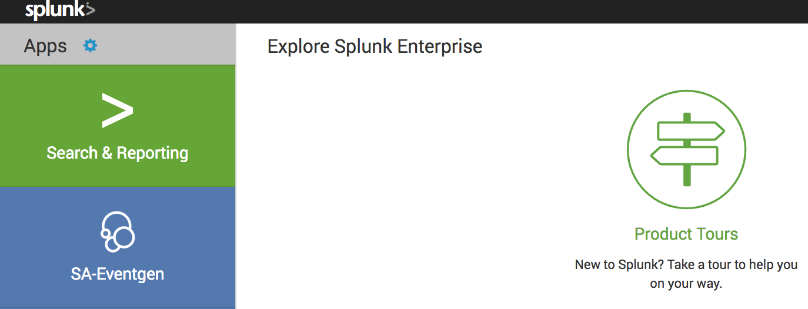
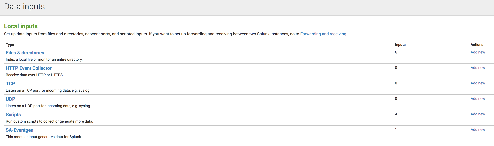

# 설치

- PyPI Module
- Splunk App

## Splunk App으로 설치

>> :heavy_exclamation_mark: Starting from 7.0.0 release, Eventgen only supports python3, which means SA-eventgen can only work with Splunk enterprise 8.x and later release.

장점 :

- 설치가 용이
- SplunkBase에서 TA의 다운로드 된 direclty와 작동
- 주요 Eventgen 프로세스 제어를위한 모듈 식 입력 사용
- Splunk Rest에서 구성을 읽습니다.
- 앱 default/local 디렉토리 지원

후퇴 :

- 단일 프로세스로 제한
- 큰 데이터세트로 확장 할 수 없습니다
- 많은 양의 eventgen.conf 파일을 처리 할 때 쉽게 뒤 떨어질 수 있습니다
- jinja 템플릿 시스템을 자동으로 설치하지 않습니다
- 파이썬 멀티 스레딩 / 처리를 지원하지 않습니다

## Python (PyPI) package로 설치

장점 :

- 스레딩 / 멀티 프로세싱 지원
- 여러 스레딩 작업자를 제어하고 실행할 수있는 중앙 집중식 서비스 지원
- 적은 오버 헤드로 많은 양의 데이터 볼륨을 실행할 수 있습니다
- Python 코드를 사용하여 Eventgen 객체를 포함하고 제어 할 수 있습니다.
- 더 많은 플러그인 시스템 노출
- Jinja2 템플릿 엔진 포함/설치

후퇴 :

- 더 복잡한 설치
- Splunk 앱을 생성하려면 build 명령을 실행해야합니다
- 문제 해결이 더 어렵습니다 (특히 다중 프로세스 모드에서)

## PyPI Installation / First Run

Eventgen을 PyPI 모듈로 사용하려면 소스 코드를 다운로드 / 복제하거나 github에서 직접 설치해야 합니다.

### 전제조건

1. git 설치
2. Eventgen> = 7.0.0을 빌드하기 전에 python3을 설치하십시오.
3. Eventgen <7.0.0을 빌드하기 전에 python2를 설치하십시오.
: information_source : 여기에서 python3 설치 패키지를 다운로드 할 수 있습니다.

### PiPI 설치

Download Eventgen Sourcecode

```bash
git clone https://www.github.com/splunk/eventgen
```

원하는 경우에 따라 특정 지점을 사용할 수 있습니다. Eventgen의 브랜칭 모델은 항상 마스터 브랜치를 Eventgen의 가장 안정적이고 출시 된 버전으로 유지하는 반면, 개발 브랜치는 최첨단 코드 라인을 포함합니다. 코드 라인을 선택하려면 원하는 분기를 체크 아웃하십시오 (개발은 기본적으로 선택됨).

```bash
git branch -a
* develop
  remotes/origin/HEAD -> origin/develop
  remotes/origin/develop
  remotes/origin/master

git checkout remotes/origin/master
Note: checking out 'remotes/origin/master'.

git pull

curl -sSL https://raw.githubusercontent.com/python-poetry/poetry/master/get-poetry.py | python
# 또는 pip를 사용하여시를 설치할 수 있습니다 (충돌을 유발할 수있는 권장되지 않음).

pip install --user poetry

poetry build

# you should see a tar file inside of dist directory
# the <version> is a token to represent current version of Eventgen, for example, 7.1.0
ls dist
splunk_eventgen-<version>.tar.gz

pip install splunk_eventgen-<version>.tar.gz
```

### Github에서 직접 설치

```bash
pip install git+https://www.github.com/splunk/eventgen.git
```

### 설치확인

위의 설치 방법 중 하나를 완료 한 후 패키지 된 Eventgen 버전을 확인하여 안전한 설치를 확인할 수 있습니다.

```bash
# the <version> is a token to represent current version of Eventgen, for example, 7.1.0
$ splunk_eventgen --version
Eventgen <version>
```

### 실행

#### Command Line

```properties
# eventgen.conf
# Invoke python module
$ python -m splunk_eventgen -v generate tests/sample_eventgen_conf/replay/eventgen.conf.replay

# Alternatively, you can use the `splunk_eventgen` alias
$ splunk_eventgen -v generate path/to/eventgen.conf
```

#### Controller-Server Cluster

Docker 환경에서 Eventgen 클러스터를 실행하려면 다음 지시 사항을 따르십시오.

1. `make image`
2. Docker 네트워크 생성 : `docker network create --attachable --driver bridge eg_network`
3. 컨트롤러를 설정하려면 `docker run --network eg_network --name eg_controller -d -p 6379 : 6379 -p 9500 : 9500 eventgen : latest controller`를 실행하십시오.
4. 서버를 설정하려면 `docker run --network eg_network --name eg_server -e REDIS_HOST = eg_controller -d -p 9501 : 9500 eventgen : latest server`를 실행하십시오.
    - REDIS_HOST는 컨트롤러에 대해 해석 가능한 호스트 주소 여야합니다. 또한 –name을 사용하여 서버와 다른 서버를 구별해야합니다.

## Splunk App 설치

Eventgen을 Splunk 앱으로 사용하려면 SPL 파일이 필요합니다. 이 SPL 파일은 다음 두 가지 방법 중 하나로 얻을 수 있습니다.

1. splunk_eventgen pypi 모듈의 빌드 프로세스 실행을 통해
2. splunkbase에서 SPL 직접 다운로드

SPL 파일 발아

SPL 파일을 생성하려면 위 지침에 따라 PyPI를 통해 Eventgen을 설치하십시오. Eventgen을 설치했으면 다음을 실행하십시오.

```bash
# This command generates spl file
$ splunk_eventgen build --destination <DESIRED_PATH_TO_OUTPUT_SPL_FILE>
```

### Finishing the Install

With the generated / downloaded SPL file, follow these steps to install:

1. 생성 / 다운로드 된 SPL 파일로 다음 단계에 따라 설치하십시오.
2. Splunk Web에 로그인하고 앱> 앱 관리로 이동합니다.
3. "파일에서 앱 설치"를 클릭하십시오.
4. 로컬 SPL 파일이있는 경로로 이동하여 선택하십시오.
5. 성공적으로 설치되었다는 알림을받은 후 Splunk를 다시 시작하십시오.

Before you start Eventgen, confirm that you have successfully installed SA-Eventgen:




```bash
cd ${SPLUNK_HOME}/etc/apps
```

### 실행

SA-Eventgen 앱이 올바르게 설치되어 있으면 추가 구성이 필요하지 않습니다. SA-Eventgen 앱은 eventgen.conf가있는 모든 앱을 자동으로 식별합니다.

데이터 생성을 시작하려면 설정> 데이터 입력> SA-Eventgen으로 이동하고 기본 모듈 식 입력 스탠자에서 "사용"을 클릭하여 SA-Eventgen 모듈 입력을 사용 가능하게하십시오.

modinput이 패키지를 감지 할 수 있도록 번들을 추가하려면 다음을 수행하십시오. 구성에 요약 된대로 eventgen.conf 및 샘플 파일을 디렉토리 구조로 패키지하십시오. 완료되면 번들을 ${SPLUNK_HOME}/etc/apps/ 디렉토리로 복사 /이동하고 Splunk를 다시 시작하십시오. eventgen.conf에서 특정 샘플을 활성화 한 경우 지정된 Splunk 인덱스로 데이터가 스트리밍되는 것을 볼 수 있습니다.

번들 앱 권한이 전역인지 확인하십시오. 다음 두 가지 방법으로 구성 할 수 있습니다.

- Splunk Web에 로그인하고 앱> 앱 관리로 이동합니다. 번들 앱 행을 찾아 공유 열에서 '글로벌'권한을 설정합니다.
- default.meta 파일을 사용하여 번들 아래에 폴더 메타 데이터를 작성하고 다음 컨텐츠를 추가하십시오.

    ```properties
    []
    export=system
    ```

이 샘플 번들을 사용하여 데이터 생성을 빠르게 시작할 수 있습니다.
