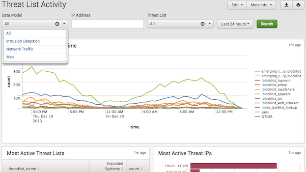
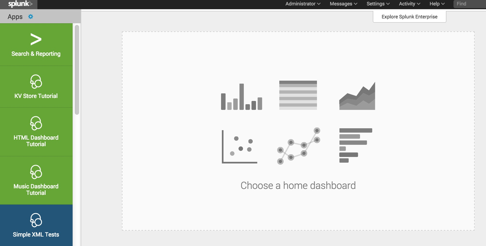

# Overview of Splunk apps and add-ons

- About Splunk apps
- What is a Splunk app?
- What is a Splunk add-on?
- Why would someone want to use a Splunk app?

## About Splunk apps

Apps in Splunk Enterprise and Splunk Cloud make it easier for an organization and its users to interact with data. Apps are designed to address a specific type of task, such as real-time data analysis, or security and monitoring, and then display the data using any number of visualizations to make the data easier to interpret. You can create apps in different ways for the Splunk users within your organization, as well as apps to share with or sell to other Splunk users.

## What is a Splunk app

A Splunk app is a collection of knowledge objects and extensions packaged for a specific technology or use case allowing for a more effective use of Splunk Enterprise or Splunk Cloud. A Splunk app can include such elements as a custom UI with dashboards, reports, custom search commands, modular inputs, field extraction definitions, data lookups, a navigation menu, custom alert actions, custom code files, and much more. Splunk apps run in Splunk Web, and you access them from the Home page or the Apps menu.

To expand on this definition of a Splunk app:

- A Splunk app is a packaged solution that solves specific issues for specific users.
- A Splunk app often targets a specific type of role, restricting read/write access by role. So, different users of the same Splunk Enterprise or Splunk Cloud instance can see only the data that is relevant to their interests.
- A Splunk app includes one or more dashboards containing forms and visualizations.
- A Splunk app can handle getting data into Splunk in different ways, such as by using a scripted input or modular input, and from different data sources.
- Multiple apps can run at the same time on the same instance of Splunk.

Here are some examples of Splunk apps for different users and roles:

- The [Splunk App for Microsoft Exchange](http://splunkbase.splunk.com/app/1660/) is for the Exchange administrator. This app gathers performance metrics, log files, and PowerShell data from all aspects of Microsoft Exchange and its underlying infrastructure.
- Splunk Enterprise Security is for the security specialist. This app looks for threats by analyzing massive volumes of activity data.
- The Splunk App for VMware is for the system administrator. This app provides an accurate real-time picture of the health of the environment, proactively identifying performance and capacity bottlenecks.
- The Splunk App for NetApp Data ONTAP is for the storage administrator. This app lets you visualize configuration, logs, and performance of all your NetApp Data ONTAP storage systems.
- The S.o.S - Splunk on Splunk app is for anyone who wants to troubleshoot Splunk. This app lets you analyze and troubleshoot problems in your Splunk environment.

## What is a Splunk add-on

Technically, a Splunk add-on is a Splunk app. In practice, a Splunk add-on refers to a Splunk app that does not contain a full UI, and typically provides some custom configurations or data inputs. And without a UI, add-ons aren't available from the Splunk Web home page or the Splunk App menu, nor do they have a dedicated URL.

A single add-on can be used in multiple apps, suites, or solutions. So, every object in an add-on must be globally available in order to be globally accessible. For more, see App architecture and object ownership in the Admin Manual.

The Splunk Add-on Builder is a Splunk app that helps you build and validate technology add-ons for your Splunk deployment. For details, see the Splunk Add-on Builder User Guide.

## Why would someone want to use a Splunk app

Splunk apps are useful for many reasons:

- Apps provide deep insights by role (such as Exchange admin, system admin, storage admin, and so forth).
- Apps provide instant visibility and analysis across all servers and network devices from one place.
- Apps drive business growth to secure, forecast, plan, and monitor usage.
- Apps improve security posture, speed incident investigations, and meet compliance mandates.
- Apps consolidate tools (multiple monitoring tools are no longer needed).
- Apps monitor and help troubleshoot the development and production applications.

## Next steps

Ready to develop apps for the Splunk platform? Jump in and try the Quick Start for a walkthrough that shows how to create and configure a basic app.

Then, learn more about how to:

Develop an app or add-on
Release an app or add-on
Integrate with the Splunk platform
Extend premium features