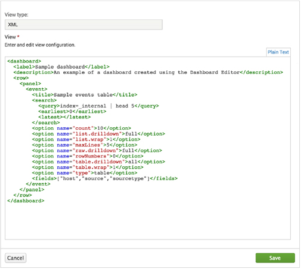

# Splunk Web Framework Overview

<http://dev.splunk.com/webframework>

The Splunk Web Framework is an app framework for Splunk users who want to create custom dashboards and Splunk apps with tables, charts, forms searches, and other functionality. Splunk provides different tools for development, ranging from an easy-to-use GUI with click-and-drag tools to a set of Backbone models for JavaScript developers.

## Architecture

The Splunk Web Framework provides a stack of features built on top of splunkd, the core Splunk server. You can build apps that run in Splunk Web alongside apps such as Splunk Search, but you can also build custom apps that interact with Splunk but run on your own web server.

## Tools for the Simple XML layer

The Simple XML layer of the stack provides easy-to-use tools that don't require any programming knowledge and are available from the Splunk Web UI:

### Dashboard Editor

The Dashboard Editor is a WYSIWYG click-and-drag interface that allows you to build dashboards within Splunk Web. You can add panels with views such as tables and charts, along with form controls such as dropdown lists, checkboxes, and radio buttons. The Dashboard Editor also provides editing tools that lets you modify the panels, views, and forms.

### Simple XML

Splunk's extensible markup language, Simple XML, is the underlying source code for the dashboards created using the Dashboard Editor. Although you can work with the most common features using the Dashboard Editor, some features are only available by working in the Simple XML code.
To edit Simple XML, you can use the Source Editor in Splunk Enterprise, or use your own text editor if you have access to the source files in your Splunk Enterprise installation.

## Tools for the Simple XML Extensions and HTML Dashboard layers

The Simple XML Extensions and HTML Dashboard layers of the stack are for web developers with varying levels of expertise who want to further customize dashboards and apps in a familiar web developer environment. Each layer accesses SplunkJS Stack, which is a web stack of JavaScript and JavaScript libraries, and contains prebuilt components for search managers and visualizations.

### Simple XML extensions

Use extensions to modify the appearance and behavior of a dashboard that was created using the Dashboard Editor or by using Simple XML. Extensions are CSS and JavaScript files that you add to your app then reference from the dashboard's Simple XML code.

### HTML dashboards

For full control over the appearance and behavior of an app, you can convert any dashboard from Simple XML to HTML, then use your favorite development tools to work with CSS, HTML, and JavaScript code to build rich, interactive experiences:

- Modify all aspects of page layout and UI.
- Add custom logic, interactions, and drilldown behavior.
- Interact with Splunk searches and manipulate Splunk data.
- Create custom visualizations and reusable components.
- Add third-party visualizations.
- Use Splunk dashboard styles so that your apps can have the same Splunk look and feel, including Splunk chrome and navigation bars.

If you don't have access to the source files in your Splunk Enterprise installation, you can edit HTML using the Source Editor in Splunk Enterprise.

### SplunkJS Stack libraries

Integrate Splunk into your own web apps that run on your own web server by adding the SplunkJS Stack libraries to your web site, enabling you to use all of Splunk Web Framework components to interact and view your Splunk data.

## Getting started

Since the Splunk Web Framework is included with Splunk Enterprise 6 and later, you don't need to download or install anything to get started. The Splunk Web Framework has several components―which ones you use depends on what you want to do, and how much you already know.

<table>
<tr><td></td><td>Dashboard Editor</td><td>Simple XML source code</td><td>Simple XML extensions</td><td>**HTML** dashboards</td><td>SplunkJS Stack libraries</td></tr>
<tr><td>Use case</td><td>Create and modify dashboards</td><td>Add advanced features to existing dashboards</td><td>Add custom styles and logic to dashboards</td><td>Create interactive dashboards with custom layouts and visualizations</td><td>Integrate Splunk components into your own web site applications</td></tr>
<tr><td>Skills</td><td>None</td><td>XML</td><td>• CSS
• HTML
• JavaScript</td><td>• CSS
• HTML
• JavaScript</td><td>• CSS
• HTML
• JavaScript</td></tr>
<tr><td>Benefits</td><td>• Drag-and-drop UI
• PDF generation</td><td>• Drag-and-drop UI
• PDF generation
• More layout options
• More features</td><td>• Drag-and-drop UI
• PDF generation
• Completely customizable
• Third-party libraries</td><td>• Completely customizable
• Third-party libraries</td><td>• Completely customizable
• Third-party libraries
• Runs outside Splunk Web</td></tr>
<tr><td>Drawbacks</td><td>• Limited layout
• Limited features</td><td>• Limited layout
• Limited features</td><td>None
• No drag-and-drop UI
• No PDF generation</td><td>• No drag-and-drop UI
• No PDF generation</td></tr>
<tr><td>Get Started</td><td>About the Dashboard Editor</td><td>About editing Simple XML</td><td>Modify dashboards using Simple XML extensions</td><td>Convert Simple XML dashboards to HTML</td><td>Use SplunkJS Stack in your own web apps</td></tr>
</table>

## Splunk Enterprise Apps

Splunk provides an app that showcases different features of the Splunk Web Framework to help you get started.

## Splunk 7.x Dashboard Examples

The Splunk 7.x Dashboard Examples app contains example dashboards and sample code showing you how to use Simple XML for both basic features as well as advanced customizations. Examples range from usage of tables and charts to example Simple XML extensions for customization of layout, visualizations, and interactivity.