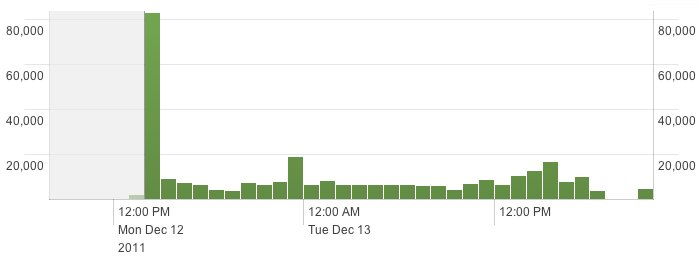
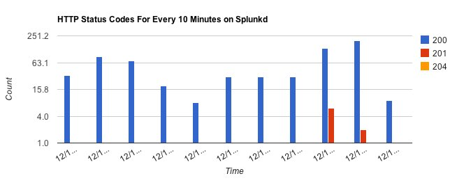

# Overview of the Splunk SDK for JavaScript

JavaScript 용 Splunk® SDK (소프트웨어 개발 키트)는 오픈 소스이며 Apache v2.0 라이센스를 사용합니다. 코드를 작성하려면 [Open Source](http://dev.splunk.com/view/opensource/SP-CAAAEDM) 페이지로 이동하십시오.

이 개요에서는 다음에 대해 자세히 설명합니다.

- JavaScript 용 Splunk SDK를 사용하여 수행 할 수있는 작업
- JavaScript 용 Splunk SDK 아키텍처 및 구성 요소

## What you can do with the Splunk SDK for JavaScript

이 SDK에는 개발자가 Splunk를 사용하여 응용 프로그램을 만들 수 있도록 설계된 라이브러리 코드와 예제가 들어 있습니다.

JavaScript 용 Splunk SDK를 사용하면 Splunk 엔진과 프로그래밍 방식으로 상호 작용하는 JavaScript 응용 프로그램을 작성할 수 있습니다. SDK는 REST API 맨 위에 빌드되어 REST API 엔드 포인트에 대한 랩퍼를 제공합니다. 따라서 코드의 줄이 적어지면 다음과 같은 응용 프로그램을 작성할 수 있습니다.

- 데이터 검색, 저장된 검색 실행 및 검색 작업.
- Splunk 구성 및 개체를 관리합니다.
- 검색 결과를 응용 프로그램에 통합하십시오.
- Splunk에 직접 로그.
- 사용자 정의 UI를 제시하십시오.

클라이언트 측 스크립트, 서버 측 스크립트 또는 둘 다를 생성하여 Splunk와 상호 작용할 수 있습니다. 다음 웹 브라우저에서 JavaScript 용 Splunk SDK를 테스트했습니다.

- Internet Explorer 8 (and version 7 in compatibility mode)
- Chrome
- Safari
- Firefox

특정 브라우저에 문제가있는 경우 Splunk Dev Info에 알려주십시오.

### Add visualizations to your web pages

클라이언트 측 JavaScript를 사용하여 시각화 구성 요소를 웹 페이지에 추가하십시오. SDK에 포함 된 미리 빌드 된 파일 및 도구를 사용하는 방법에 대해 알아 보려면 여기로 이동하십시오. 실행중인 JavaScript 용 Splunk SDK를 보려면 타임 라인과 같이 다양한 구성 요소를 구현하는 페이지를 보려면 [client-side examples](http://dev.splunk.com/view/javascript-sdk/SP-CAAAEDC)를 실행하십시오. 여기에 표시된 컨트롤 :



다른 예는 여기에 표시된 [Google Charts](http://code.google.com/apis/chart/) 구성 요소와 같은 타사 시각화 도구를 통합하는 방법을 보여줍니다.



### Create complete applications

You can create complete applications using server-side JavaScript. Check out the [server-side examples](http://dev.splunk.com/view/javascript-sdk/SP-CAAAEDA). They'll show you ropes, from listing jobs and running searches to handling the results in JSON.

## The Splunk SDK for JavaScript architecture and components

JavaScript 용 Splunk SDK는 다음 두 영역으로 나뉩니다.

- Data SDK를 사용하면 Splunk와 상호 작용할 수 있습니다. 예를 들어, 인덱스 작성 및 제거, 사용자 작성과 같은 Splunk, HTTP 입력을 통한 데이터 입력 및 검색 데이터를 관리 할 수 ​​있습니다.
- UI SDK에는 인기있는 Splunk UI 구성 요소가 포함되어있어 고객에게 풍부하고 매력적인 자료를 제공 할 수 있습니다. 현재 이러한 구성 요소는 다음과 같습니다.
- Splunk에 포함 된 **Charting 컨트롤**을 사용하면 Splunk 데이터를 기반으로 다양한 유형의 차트를 표시 할 수 있습니다.
- **타임 라인 컨트롤** : 쿼리에서 타임 라인마다 사용할 수있는 이벤트 수를 보여줍니다. 이 컨트롤은 \<canvas\> 태그를 지원하는 브라우저에서만 작동합니다 (Internet Explorer 8 이하에서는 작동하지 않음).

JavaScript 용 Splunk SDK는 서버 측 및 클라이언트 측 JavaScript를 지원합니다. 설치할 구성 요소를 결정할 수 있습니다. SDK에는 Splunk의 XML 출력과 JavaScript에서 사용되는 JSON 사이의 변환 레이어 인 Splunk 응용 프로그램이 포함되어 있습니다. SDK에는 교차 도메인 통신 및 예제에서 사용되는 다른 기능과 같은 기능을 위해 포함 된 여러 타사 라이브러리가 포함되어 있습니다.

JavaScript 라이브러리 파일 용 Splunk SDK에는 다음이 포함됩니다.

- **utils.js** : 유틸리티 함수 모음.
- **async.js** : 비동기 루핑 및 비동기 제어 흐름과 같은 작업을 처리하는 비동기 유틸리티 함수 모음입니다.
- **paths.js** : 명명 된 REST 엔드 포인트 경로의 사전.
- **http.js** : 다른 HTTP 클라이언트가 공유하는 기본 HTTP 구현입니다.
- **context.js** : Splunk REST-wire 프로토콜에 대한 추상화. 인증 및 매개 변수 인코딩과 같은 작업을 처리합니다.
- **service.js** : REST API의 네이티브 JavaScript 작업입니다. 작업, 색인, 저장된 검색 등을 만들고 관리하기위한 개체가 들어 있습니다.
- **searcher.js** : 결과를 검색하고 반복하는 것에 대한 상위 수준의 추상화입니다.

자세한 내용보기 :

- Entities and collections
- Native JavaScript objects
- Namespaces
- State management
- The Service class
- Asynchronous model

### Entities and collections

Most REST endpoints in the Splunk REST API can be thought of as operations on entities and collections of entities. For example, there are operations to create, modify, and remove apps. Similarly, there are operations to create, manage, remove, and get results from search jobs. For each logical grouping, the base abstractions are as follows:

- **Resource** : An abstraction over a resource that can be accessed over HTTP, with shortcuts for making HTTP GET, POST, and DELETE calls.
- **Entity** : An abstraction over a Splunk entity (such as a single app, saved search, job, or index), providing operations such as update, remove, read properties, and refresh.
- **Collection** : An abstraction over a Splunk collection (such as all apps, all saved searches, all jobs, or all indexes), providing operations such as creating new entities and fetching specific entities.

**Entity** and **Collection** are a type of **Resource** :

```js
Entity = Resource.extend({...});
Collection = Resource.extend({...});
```

### Native JavaScript objects

The service layer provides higher-level access to Splunk REST API through native JavaScript objects. Architecturally, each object implements either Entity or Collection. For example:

```js
Indexes = Collection.extend({...});
Index = Entity.extend({
Jobs = Collection.extend({...});
Job = Entity.extend({...});
```

Each object has the default operations available to its superclass: Job has update and remove methods, while Jobs has create and list methods.

### Namespaces

To account for permissions to view apps, system files, and other entity resources by users throughout a Splunk installation, Splunk provides access to entity resources based on a namespace. This is similar to the app/user context that is used by the Splunk REST API when accessing resources using endpoints.

The namespace is defined by:

- An owner, which is the Splunk username, such as "admin". A value of "nobody" means no specific user. The "-" wildcard means all users.
- An app, which is the app context for this resource (such as "search"). The "-" wildcard means all apps.
- A sharing mode, which indicates how the resource is shared. The sharing mode can be:
  "user": The resource is private to a specific user, as specified by owner.
  "app": The resource is shared through an app, as specified by app. The owner is "nobody", meaning no specific user.
  "global": The resource is globally shared to all apps. The owner is "nobody", meaning no specific user.
  "system": The resource is a system resource (owner is "nobody", app is "system").

In general, when you specify a namespace you can specify any combination of owner, app, and sharing the SDK library will reconcile the values, overriding them as appropriate. If a namespace is not explicitly specified, the current user is used for owner and the default app is used for app.

Here are some example combinations of owner, app, sharing:

- List all of the saved searches for a specific user named Kramer: kramer, -, user
- Create an index to be used within the Search app: nobody, search, app

### State management

When you create an object for an entity, the entity's properties are read and copied from the server, creating a local snapshot of those values. Any changes to the object are only made to the object in your local cache. Your changes are not made on the server until you explicitly call the object's update method and include the specific properties and values to update. And, changes made on the server don't affect your local copy unless you call the object's fetch method, which replaces any changes you have made to your local object with an updated snapshot from the server.

The SDK does not perform validation on values when you set them, but rather passes these values to the server for validation. Any error messages from the server are then sent back to you through the SDK.

### The Service class

The Service class is the entry point for using the Splunk SDK for JavaScript. Communication with Splunk starts by creating a Service instance and logging in, for example:

```js
var service = new splunkjs.Service({username: "admin", password: "yourpassword"});
```

If you provide a username and password, you will be auto-logged in as long as autologin is not disabled. (Otherwise, you'd need to explicitly call the Service.login method next.) If a subsequent request returns a 401 error, the SDK attempts to log in once.

You can pass more arguments to the Service constructor, such as scheme, host, and sessionKey. For example, if you already got a Splunk session key from another source, you can use it as follows:

```js
var service = new splunkjs.Service({sessionKey: mySessionKey});
```

The Service class is also where you access the different resources in Splunk. For example, this example gets the Jobs collection:

```js
var service = new splunkjs.Service(...);
var jobs = service.jobs();
```

You can specify a namespace when you create a new Service instance, but you can also specify a namespace as you fetch a resource:

```js
var jobs = service.jobs({owner: "user", app: "awesome_app"});
```

When you retrieve a collection, you can limit the number of items you retrieve at a time by specifying count and offset parameters. Set count to the number of items to retrieve, and use offset to indicate where in the collection to retrieve them. For example, to page through 10 jobs at a time in the Jobs collection, you'd set count to 10, and offset to increments of 10. This retrieves 10 jobs starting at the 21st job in the collection:

```js
var searches = service.jobs();
jobs.fetch({count: 10, offset: 20}, function(err, searches) {
    console.log(jobs.list().length); // is 10
});
```

### Asynchronous model

JavaScript is asynchronous, so rather than return values, functions expect a callback as their last argument. In return, every callback takes an error parameter as its first argument.

The following pseudo-code shows how to create a job:

```js
var service = new splunkjs.Service({username: "admin", password: "yourpassword"});
var jobs = service.jobs();
service.login(function(err, success) {
    assert.ok(success);
    service.jobs.create("search index=_internal | head 1", {exec_mode: "blocking"}, function(err, job) {
        assert.ok(!err); // err will be null if we were successful.
        console.log(job.sid);
    });
});
```

However, writing in this nesting, diagonal style can become tiresome and hard to maintain, so Splunk provides the Async module to ease development. Code could then be written as follows:

```js
var service = new splunkjs.Service(...);
Async.chain([
        function(done) {
            service.login(done);
        },
        function(success, svc, done) {
            var jobs = svc.jobs();
            jobs.create("search index=_internal | head 1", {exec_mode: "blocking"}, done);
        },
        function(job, done) {
            console.log(job.sid);
            job.cancel(done);
        }
    ],
    function(err) {
        assert.ok(err);
        console.log("DONE");
    }
);
```

**Async.chain** executes each function in turn, and passes the results to the next function. If any function encounters an error (by calling the callback with the first parameter not equal to null), it immediately calls the final callback with the error.