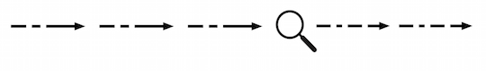

# Overview

## Types of Searches

### Types of searches

As you search, you will begin to recognize patterns and identify more information that can be useful as searchable fields. You can configure Splunk software to recognize these new fields as you index new data, or you can create new fields as you search. Whatever you learn, you can use, add, and edit this knowledge about fields, events, and transactions to your event data. This capturing of knowledge helps you to construct more efficient searches and build more detailed reports.

검색할 때 패턴을 인식하고 검색 가능한 필드로 유용할 수 있는 추가 정보를 식별하기 시작
새 데이터를 인덱스할 때 이러한 새 필드를 인식하도록 Splunk 소프트웨어를 구성하거나 검색할 때 새 필드를 만들 수 있습니다. 무엇을 배우든지 필드, 이벤트 및 트랜잭션에 대한이 지식을 이벤트 데이터에 사용, 추가 및 편집할 수 있습니다.
이러한 지식의 수집은 보다 효율적인 검색을 구성하고 보다 자세한 보고서를 작성하는데 도움이 됩니다.

Before delving into the language and syntax of search, you should ask what you are trying to accomplish. Generally, after getting data into your Splunk deployment, you want to:

검색 언어와 구문을 파고 들기 전에 무엇을 성취하려고 하는지 물어봐야 합니다. 일반적으로 Splunk 배포로 데이터를 가져온 후 다음을 수행하려고 합니다.

- Investigate to learn more about the data you just indexed or to find the root cause of an issue.
- Summarize your search results into a report, whether tabular or other visualization format.

- 방금 색인을 생성 한 데이터에 대해 자세히 알아 보거나 문제의 근본 원인을 찾으십시오.
- 테이블 형식이든 기타 시각화 형식이든 상관없이 검색 결과를 보고서로 요약합니다.

Because of this, you might hear us refer to two types of searches: Raw event searches and transforming searches.

이 때문에 원시 이벤트 검색과 변환검색(Transforming Searches)이라는 두 가지 유형의 검색을 참조하는 소리가 들릴 수 있습니다.

### Raw event searches

Raw event searches are searches that just retrieve events from an index or indexes, and are typically used when you want to analyze a problem. Some examples of these searches include: checking error codes, correlating events, investigating security issues, and analyzing failures. These searches do not usually include search commands (except `search`, itself), and the results are typically a list of raw events.

원시 이벤트 검색은 인덱스에서 이벤트를 검색하는 검색이며 일반적으로 문제를 분석하려고할 때 사용됩니다. 이러한 검색의 예로는 오류 코드 확인, 이벤트 상관, 보안 문제 조사 및 실패 분석이 있습니다. 이러한 검색에는 일반적으로 검색 명령이 포함되지 않으며 (`search`자체 제외) 결과는 일반적으로 원시 이벤트 목록입니다.

- Read more about raw event searches starting with the topic [About retrieving events](http://docs.splunk.com/Documentation/Splunk/7.3.1/Search/Aboutretrievingevents).

- 이벤트 검색 정보 주제로 시작하는 원시 이벤트 검색에 대해 자세히 읽으십시오 .

### Transforming searches

A search that uses transforming commands like stats, chart, and timechart to transform event data returned by a search into statistical tables that can be used as the basis for charts and other kinds of data visualizations.

통계, 차트 및 시간 차트와 같은 변환명령을 사용하여 검색에서 반환된 이벤트 데이터를 차트 및 기타 종류의 데이터 시각화의 기초로 사용할 수있는 통계 테이블로 변환하는 검색입니다.

Transforming searches are searches that perform some type of statistical calculation against a set of results. These are searches where you first retrieve events from an index and then pass the events into one or more search commands. These searches will always require fields and at least one of a set of statistical commands. Some examples include: getting a daily count of error events, counting the number of times a specific user has logged in, or calculating the 95th percentile of field values.

변환검색(Transforming Searches)은 일련의 결과에 대해 일부 유형의 통계 계산을 수행하는 검색입니다. 인덱스에서 이벤트를 먼저 검색한 다음 하나 이상의 검색 명령으로 이벤트를 전달하는 검색입니다. 이러한 검색에는 항상 필드와 하나 이상의 통계 명령 세트가 필요합니다. 몇 가지 예는 다음과 같습니다. 일일 오류 이벤트 수 가져 오기, 특정 사용자가 로그인 한 횟수 계산 또는 95번째 백분위 필드 값 계산.

- Read more about the structure of a search in [About the search processing language syntax](http://docs.splunk.com/Documentation/Splunk/7.3.1/Search/Aboutsearchlanguagesyntax).
- Read more about using subsearches to filter results in [About subsearches](http://docs.splunk.com/Documentation/Splunk/7.3.1/Search/Aboutsubsearches).
- Read more about transforming searches and commands starting with the topic [About transforming commands and searches](http://docs.splunk.com/Documentation/Splunk/7.3.1/Search/Aboutreportingcommands).

- 검색 처리 언어 구문 정보에서 검색 구조에 대해 자세히 알아보십시오.
- 하위 검색을 사용하여 결과를 필터링하는 방법에 대해 자세히 알아보십시오.
- 명령 및 검색 변환 정보 주제로 시작하여 검색 및 명령 변환에 대해 자세히 읽으십시오.

### Information density

Whether you are retrieving raw events or building a report, you should also consider whether you are running a search for sparse or dense information:

원시 이벤트를 검색하든 보고서를 작성하든, 스파스정보 나 밀도가 높은 정보를 검색하는지 여부도 고려해야합니다.

- __Sparse searches__ are searches that look for a single event or an event that occurs infrequently within a large set of data. You have probably heard these referred to as 'needle in a haystack' or "rare term" searches. Some examples of these searches include: searching for a specific and unique IP address or error code.
- __Dense searches__ are searches that scan through and report on many events. Some examples of these searches include: counting the number of errors that occurred or finding all events from a specific host.

- __Sparse searches__(부족한) 단일 이벤트 또는 대규모 데이터 집합 내에서 드물게 발생하는 이벤트를 찾는 검색입니다. 당신은 아마 이것을 건초 더미에있는 바늘 또는 "희귀한 용어"검색이라고합니다. 이러한 검색의 일부 예는 다음과 같습니다. 구체적이고 고유 한 IP 주소 또는 오류 코드 검색.
- __Dense searches__(밀집)은 많은 이벤트를 검색하고보고하는 검색입니다. 이러한 검색의 몇 가지 예는 다음과 같습니다. 발생한 오류 수 계산 또는 특정 호스트에서 모든 이벤트 찾기.

See How search types affect Splunk Enterprise performance in the Capacity Planning Manual.

용량 계획 매뉴얼에서 검색 유형이 Splunk Enterprise 성능에 미치는 영향을 참조하십시오.

## Types of Command

### Types of commands

As you learn about Splunk SPL, you might hear the terms streaming, generating, transforming, orchestrating, and data processing used to describe the types of search commands. This topic explains what these terms mean and lists the commands that fall into each category.

Splunk SPL에 대해 배울 때 검색 명령의 유형을 설명하는데 사용되는 스트리밍, 생성, 변환, 조정 및 데이터 처리라는 용어를 들을 수 있습니다. 이 주제에서는 이러한 용어의 의미를 설명하고 각 범주에 속하는 명령을 나열합니다.

There are six broad categorizations for almost all of the search commands:

거의 모든 검색 명령에 대한 6 가지 범주가 있습니다.

- 분배 가능한 스트리밍(distributable streaming)
- 중앙집중식 스트리밍(centralized streaming)(centralized streaming)
- 변형(transforming)
- 생성(generating)
- 조율(orchestrating)
- 데이터 세트 처리(dataset processing)

These categorizations are not mutually exclusive. Some commands fit into only one categorization. The stats command is an example of a command that fits only into the transforming categorization. Other commands can fit into multiple categorizations. For example a command can be streaming and also generating.

이러한 분류는 상호 배타적이지 않습니다. 일부 명령은 하나의 분류에만 적합합니다. 이 stats명령은 변환(transforming) 분류에만 적합한 명령의 예입니다. 다른 명령은 여러 분류에 적합할 수 있습니다. 예를 들어 명령을 스트리밍하고 생성할 수 있습니다.

For a complete list of commands that are in each type, see [Command types](http://docs.splunk.com/Documentation/Splunk/7.3.1/SearchReference/Commandsbytype) in the Search Reference.

각 유형에있는 명령의 전체 목록은 검색 참조 서의 명령 유형 을 참조하십시오 .

### Streaming and non-streaming commands

A streaming command operates on each event as it is returned by a search. Essentially one event in and one (or no) event out.

스트리밍 명령 이 검색에 의해 반환되는 각 이벤트에서 작동합니다. 본질적으로 하나의 이벤트 및 하나의 이벤트 또는 하나의 이벤트가 없습니다.



This diagram shows individual events being processed by a streaming command, one event after another.

이 다이어그램은 스트리밍 명령에 의해 개별 이벤트가 처리되는 것을 보여줍니다.

For example, the `eval` command can create a new field, `full_name`, to contain the concatenation of the value in the `first_name` field, a space, and the value in the `last_name` field.

예를 들어, `eval`명령은 필드 `full_name`의 값 `first_name`, 공백 및 필드 의 값을 연결하기 위해 새 필드를 작성할 수 있습니다 `last_name`.

```sql
... | eval full_name = first_name." ".last_name
```

The eval command evaluates each event without considering the other events.

이 eval명령은 다른 이벤트를 고려하지 않고 각 이벤트를 평가합니다.

A non-streaming command waits until all of the events are gathered from the indexers before the command runs. For example, the sort command must have the entire set of events before the events can be sorted. Non-streaming commands run on the search head. By contrast, a streaming command operates on each event as the event is returned by the search. Any command in a search that occurs after a non-streaming command must also be processed on the search head.

비스트리밍 명령은 명령이 실행되기 전에 인덱서에서 모든 이벤트가 수집 될 때까지 대기합니다. 예를 들어, sort 명령은 이벤트를 정렬하기 전에 전체 이벤트 세트를 가져야합니다. 비스트리밍 명령은 검색 헤드에서 실행됩니다. 대조적으로, 스트리밍 명령은 이벤트가 검색에 의해 리턴 될 때 각 이벤트에서 작동합니다. 비스트리밍 명령 이후에 발생하는 검색의 모든 명령은 검색 헤드에서도 처리되어야 합니다.

A non-streaming command requires the events from all of the indexers before the command can operate on the entire set of events. Many transforming commands are non-streaming commands. There are also several commands that are not transforming commands but that are non-streaming. These non-transforming, non-streaming commands are sometimes referred to as event based non-streaming commands.

This diagram shows a set of events that are collected and then processed together by a non-streaming command.

비스트리밍 명령은 명령이 이벤트의 전체 세트에서 작동하기 전에 인덱서 모두에서 이벤트를 필요로 한다. 많은 변형 명령은 비스트리밍 명령입니다. 명령을 변환하지 않지만 스트리밍하지 않는 명령도 있습니다. 이러한 비변형 비스트리밍 명령을 이벤트 기반 비스트리밍 명령이라고도합니다.


For example, before the sort command can begin to sort the events, the entire set of events must be received by the sort command. Other examples of non-streaming commands include dedup (in some modes), stats, and top.

예를 들어, sort명령이 이벤트 정렬을 시작 하기 전에 명령이 전체 이벤트 세트를 수신해야합니다 sort. 비스트리밍 명령의 다른 예는 dedup(일부 모드에서) stats, 그리고 top.

Non-streaming commands force the entire set of events to the search head. This requires a lot of data movement and a loss of parallelism.

비스트리밍 명령은 전체 이벤트 세트를 검색 헤드로 강제합니다. 이를 위해서는 많은 데이터 이동과 병렬 처리 손실이 필요합니다.

For information on how to mitigate the cost of non-streaming commands, see [Write better searches](http://docs.splunk.com/Documentation/Splunk/7.3.1/Search/Writebettersearches) in this manual.

비스트리밍 명령의 비용을 줄이는 방법에 대한 자세한 내용은이 매뉴얼의 더 나은 검색 작성을 참조하십시오 .

### Processing attributes

The following table describes the processing differences between some of the types of commands.

다음 표는 일부 명령 유형 간의 처리 차이점을 설명합니다.

||Distributable streaming|Centralized streaming|Data processing (non-streaming)|Transforming|
|--|:--:|:--:|:--:|:--:|
|인덱스에서 실행(Can run on indexers)|Y|N|N|N|
|최종입력 전에 출력(Can output before final input)|Y|Y|N|N|
|입력이 이벤트인 경우 이벤트 출력(Outputs events if inputs are events)|Y|Y|Y|N|

When a command is run it outputs either events or results, based on the type of command. For example, when you run the sort command, the input is events and the output is events in the sort order you specify. However, transforming commands do not output events. Transforming commands output results. For example the stats command outputs a table of calculated results. The events used to calculate those results are no longer available. After you run a transforming command, you can't run a command that expects events as an input.

명령이 실행될 때 명령 유형에 따라 이벤트 또는 결과를 출력합니다. 예를 들어, sort명령 을 실행할 때 입력은 이벤트이고 출력은 지정한 정렬 순서로 이벤트입니다. 그러나 변환명령은 이벤트를 출력하지 않습니다. 명령 출력 결과 변환 예를 stats들어이 명령은 계산 결과 테이블을 출력합니다. 해당 결과를 계산하는데 사용된 이벤트는 더 이상 사용할 수 없습니다. 변환명령을 실행 한 후에는 이벤트를 입력으로 예상하는 명령을 실행할 수 없습니다.

Data processing commands are non-streaming commands that require the entire dataset before the command can run. These commands are not transforming, not distributable, not streaming, and not orchestrating. The sort command is an example of a data processing command. See Data processing commands.

데이터 처리 명령은 명령을 실행하기 전에 전체 데이터 세트가 필요한 비스트리밍 명령입니다. 이러한 명령은 변형되지 않고 배포할 수 없으며 스트리밍되지 않으며 조정되지 않습니다. 이 sort명령은 데이터 처리 명령의 예입니다. 데이터 처리 명령을 참조하십시오 .

### Distributable streaming

A streaming command operates on each event returned by a search. For distributable streaming, the order of the events does not matter. A distributable streaming command is a command that can be run on the indexer, which improves processing time. The other commands in a search determine if the distributable streaming command is run on the indexer:

스트리밍 명령은 검색에서 반환된 각 이벤트에서 작동합니다. 분배 가능한 스트리밍의 경우 이벤트 순서는 중요하지 않습니다. 분배 가능 스트리밍 명령은 인덱서에서 실행할 수있는 명령으로 처리 시간이 단축됩니다. 검색의 다른 명령은 분배기 스트리밍 명령이 인덱서에서 실행되는지 판별합니다.

- If all of the commands before the distributable streaming command can be run on the indexer, the distributable streaming command is run on the indexer.
- If any one of the commands before the distributable streaming command must be run on the search head, the remaining commands in the search must be run on the search head. When the search processing moves to the search head, it cannot move back to the indexer.

Distributable streaming commands can be applied to subsets of indexed data in a parallel manner. For example, the rex command is streaming. It extracts fields and adds them to events at search time.

- 분배 가능 스트리밍 명령 이전의 모든 명령을 인덱서에서 실행할 수 있으면 분배 가능 스트리밍 명령이 인덱서에서 실행됩니다.
- 분배 가능 스트리밍 명령 이전의 명령 중 하나를 검색 헤드에서 실행해야하는 경우 검색의 나머지 명령을 검색 헤드에서 실행 해야합니다 . 검색 처리가 검색 헤드로 이동하면 인덱서로 다시 이동할 수 없습니다.

분배 가능한 스트리밍 명령은 색인화된 데이터의 서브 세트에 병렬 방식으로 적용될 수 있습니다. 예를 들어 rex명령이 스트리밍 중입니다. 검색시 필드를 추출하여 이벤트에 추가합니다.

Some of the common distributable streaming commands are: `eval`, `fields`, `makemv`, `rename`, `regex`, `replace`, `strcat`, and `where`.

일반적인 배포 가능한 스트리밍 명령 중 일부는 `eval`, `fields`, `makemv`, `rename`, `regex`, `replace`, `strcat`, 및 `where`. 입니다.

For a complete list of distributable streaming commands, see [Streaming commands](https://docs.splunk.com/Documentation/Splunk/7.3.1/SearchReference/Commandsbytype#Streaming_commands) in the Search Reference.

분배 가능한 스트리밍 명령의 전체 목록은 검색 참조 서의 스트리밍 명령 을 참조하십시오 .

### Centralized streaming

For centralized streaming commands, the order of the events matters. A centralized streaming command applies a transformation to each event returned by a search. But unlike distributable streaming commands, a centralized streaming command only works on the search head. You might also hear the term "stateful streaming" to describe these commands.

중앙집중식 스트리밍(centralized streaming) 명령의 경우 이벤트 순서가 중요합니다. 중앙집중식 스트리밍(centralized streaming) 명령은 검색에서 반환된 각 이벤트에 변환을 적용합니다. 그러나 분산 가능한 스트리밍 명령과 달리 중앙집중식 스트리밍(centralized streaming) 명령은 검색 헤드에서만 작동합니다. 이러한 명령을 설명하기 위해 "상태 저장 스트리밍"이라는 용어를들을 수도 있습니다.

Centralized streaming commands include: `head`, `streamstats`, some modes of `dedup`, and some modes of `cluster`.

중앙집중식 스트리밍(centralized streaming) 명령에는 `head` , `streamstats` , 일부 `dedup` 모드 및 일부 `cluster` 모드가 포함 됩니다.

### Transforming

A transforming command orders the search results into a data table. These commands "transform" the specified cell values for each event into numerical values that Splunk software can use for statistical purposes. Transforming commands are not streaming. Also, transforming commands are required to transform search result data into the data structures that are required for visualizations such as column, bar, line, area, and pie charts.

변환명령 주문 검색은 데이터 테이블에 발생합니다. 이 명령은 각 이벤트에 대해 지정된 셀 값을 Splunk 소프트웨어가 통계 목적으로 사용할 수있는 숫자 값으로 "변환"합니다. 변형 명령이 스트리밍되지 않습니다. 또한 열, 막대, 선, 영역 및 원형 차트와 같은 시각화에 필요한 데이터 구조로 검색 결과 데이터를 변환하려면 변환명령이 필요합니다.

Transforming commands include: `chart`, `timechart`, `stats`, `top`, `rare`, `typer`, and `addtotals` when it is used to calculate column totals (not row totals).

변환명령에는 `chart`, `timechart`, `stats`, `top`, `rare`, `typer` 및 `addtotals` (행 합계가 아닌 열 합계를 계산하는데 사용되는 경우)가 포함됩니다.

For more information about transforming commands and their role in create statistical tables and chart visualizations, see About transforming commands and searches in the this manual.

통계 테이블 및 차트 시각화 작성에서 명령 변환 및 해당 역할에 대한 자세한 정보 는이 매뉴얼의 명령 및 검색 변환 정보를 참조하십시오 .

For a complete list of transforming commands, see Transforming commands in the Search Reference.

변환명령의 전체 목록은 검색 참조에서 변환명령 을 참조하십시오.

### Generating

A generating command fetches information from the indexes, without any transformations. Generating commands are either event-generating (distributable or centralized) or report-generating. Most report-generating commands are also centralized. Depending on which type the command is, the results are returned in a list or a table.

생성명령(Generating)은 어떠한 변형없이 인덱스 정보를 가져온다. 생성명령(Generating)은 이벤트 생성 (분배 가능 또는 중앙 집중식) 또는 보고서 생성입니다. 대부분의 보고서 생성명령(Generating)도 중앙 집중식입니다. 명령의 유형에 따라 결과가 목록 또는 테이블로 리턴됩니다.

Generating commands do not expect or require an input. Generating commands are usually invoked at the beginning of the search and with a leading pipe. That is, there cannot be a search piped into a generating command. The exception to this is the search command, because it is implicit at the start of a search and does not need to be invoked.

생성명령(Generating)에는 입력이 필요하거나 필요하지 않습니다. 생성명령(Generating)은 일반적으로 검색 시작시 및 주요 파이프와 함께 호출됩니다. 즉, 생성명령(Generating)으로 파이프된 검색을 수행할 수 없습니다. `search`검색 시작시 내재적이며 호출할 필요가 없으므로 명령은 예외 입니다.

Examples of generating commands include: `dbinspect` , `datamodel` , `inputcsv` , `metadata` , `pivot` , `search`, and `tstats`

생성명령(Generating)의 예에는 `dbinspect` , `datamodel` , `inputcsv` , `metadata` , `pivot` , `search` 및 `tstats`가 포함됩니다.

For a complete list of generating commands, see Generating commands in the Search Reference.

생성명령(Generating)에 대한 전체 목록은 검색 참조에서 생성명령(Generating)을 참조하십시오 .

### Orchestrating

An orchestrating command is a command that controls some aspect of how the search is processed. It does not directly affect the final result set of the search. For example, you might apply an orchestrating command to a search to enable or disable a search optimization that helps the overall search complete faster.

오케스트레이션명령(Orchestrating) 검색 처리 방식의 일부 측면을 제어하는 명령이다. 검색의 최종 결과 집합에는 직접적인 영향을 미치지 않습니다. 예를 들어, 검색에 오케스트레이션명령(Orchestrating)을 적용하여 전체 검색을 더 빠르게 완료하는데 도움이되는 검색 최적화를 활성화하거나 비활성화할 수 있습니다.

Examples of orchestrating commands include `redistribute`, `noop`, and `localop`. The `lookup` command also becomes an orchestrating command when you use it with the `local=t` argument.

오케스트레이션명령(Orchestrating)의 예로는 `redistribute` , `noop` 및 `localop`이 있습니다. 또한 `lookup` 명령은 `local=t`인수 와 함께 사용할 때 오케스트레이션명령(Orchestrating)이됩니다 .

### Dataset processing

There are a handful of commands that require the entire dataset before the command can run. These commands are referred to as dataset processing commands. These commands are not transforming, not distributable, not streaming, and not orchestrating. Some of these commands fit into other types in specific situations or when specific arguments are used.

명령을 실행하기 전에 전체 데이터 세트가 필요한 몇 가지 명령이 있습니다. 이러한 명령을 데이터세트처리명령(Dataset Processing)이라고합니다. 이러한 명령은 변형되지 않고 배포할 수 없으며 스트리밍되지 않으며 조정되지 않습니다. 이러한 명령 중 일부는 특정 상황이나 특정 인수가 사용될 때 다른 유형에 적합합니다.

Examples of data processing commands include: `sort`, `eventstats`, and some modes of `cluster`, `dedup`, and `fillnull`.

데이터 처리 명령의 예로는 `sort` , `eventstats` 및 `cluster` , `dedup` 및 `fillnull` 의 일부 모드가 있습니다 .

For a complete list of dataset processing commands, see Dataset processing commands in the Search Reference.

데이터세트처리명령(Dataset Processing)의 전체 목록을 보려면 데이터 집합 처리 명령 에서 검색 참조 .

## Command Types

There are six broad types for all of the search commands: distributable streaming, centralized streaming, transforming, generating, orchestrating and dataset processing. These types are not mutually exclusive. A command might be streaming or transforming, and also generating.

모든 검색 명령에는 분산가능 스트리밍(distributable streaming), 중앙집중식 스트리밍(centralized streaming), 변환, 생성, 오케스트레이션 및 데이터 세트 처리의 6 가지 유형이 있습니다. 이 유형은 상호 배타적이지 않습니다. 명령이 스트리밍 또는 변환 중이거나 생성 중일 수 있습니다.

The following tables list the commands that fit into each of these types. For detailed explanations about each of the types, see Types of commands in the Search Manual.

다음 표는 이러한 각 유형에 맞는 명령을 나열합니다. 각 유형에 대한 자세한 설명은 검색 매뉴얼의 명령 유형을 참조하십시오.

### Streaming commands

A streaming command operates on each event as the event is returned by a search.

검색에 의해 이벤트가 리턴 될 때 각 명령에 대해 스트리밍 명령이 작동합니다.

- A distributable streaming command runs on the indexer or the search head, depending on where in the search the command is invoked. Distributable streaming commands can be applied to subsets of indexed data in a parallel manner.
- A centralized streaming command applies a transformation to each event returned by a search. Unlike distributable streaming commands, a centralized streaming command only works on the search head.

- 분배 가능한 스트리밍 명령은 검색에서 명령이 호출된 위치에 따라 인덱서 또는 검색 헤드에서 실행됩니다. 분배 가능한 스트리밍 명령은 색인화된 데이터의 서브 세트에 병렬 방식으로 적용될 수 있습니다.
- 중앙집중식 스트리밍(centralized streaming) 명령은 검색에서 반환된 각 이벤트에 변환을 적용합니다. 분산가능 스트리밍(distributable streaming) 명령과 달리 중앙집중식 스트리밍(centralized streaming) 명령은 검색 헤드에서만 작동합니다.

### Generating commands

A generating command generates events or reports from one or more indexes without transforming the events.

생성명령(Generating)은 이벤트를 변환하지 않고 하나 이상의 인덱스에서 이벤트 또는 보고서를 생성합니다.

### Transforming commands

A transforming command orders the results into a data table. The command "transforms" the specified cell values for each event into numerical values for statistical purposes.

변환명령은 결과를 데이터 테이블로 정렬합니다. 이 명령은 각 이벤트에 대해 지정된 셀 값을 통계 목적으로 숫자 값으로 "변환"합니다.

>> In earlier versions of Splunk software, transforming commands were referred to as reporting commands.

>> 이전 버전의 Splunk 소프트웨어에서는 변환 명령을보고 명령이라고 했습니다.

### Orchestrating commands

Orchestrating commands control some aspect of how a search is processed. They do not directly affect the final result set of the search. For example, you might apply an orchestrating command to a search to enable or disable a search optimization that helps the overall search complete faster.

오케스트레이션명령(Orchestrating)은 검색 처리 방법의 일부 측면을 제어합니다. 검색의 최종 결과 집합에는 직접적인 영향을 미치지 않습니다. 예를 들어, 검색에 오케스트레이션명령(Orchestrating)을 적용하여 전체 검색을 더 빠르게 완료하는 데 도움이되는 검색 최적화를 활성화하거나 비활성화 할 수 있습니다.

### Dataset processing commands

A dataset processing command is a command that requires the entire dataset before the command can run. Some of these commands fit into other command types in specific situations or when specific arguments are used.

데이터세트처리명령(Dataset Processing)은 명령을 실행하기 전에 전체 데이터 세트가 필요한 명령입니다. 이러한 명령 중 일부는 특정 상황에서 또는 특정 인수가 사용될 때 다른 명령 유형에 적합합니다.
