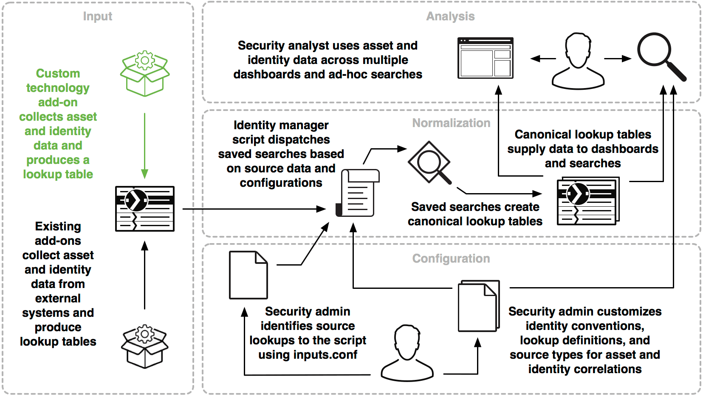

# Building Integrations for Splunk Enterprise Security

## Asset and Identity framework in Splunk ES

Asset and Identity 프레임워크는 검색으로 반환된 이벤트 집합에 있을 수 있는 필드에 대해 Asset와 Identity 상관관계 분석을 수행
Asset and Identity 프레임워크는 Enterprise Security 관리자가 관리하는 조회 및 구성에 의존

이 프레임워크는 통합 할 수있는 Splunk Enterprise Security의 다섯 가지 프레임워크 중 하나
프레임워크에 대한 소개는 [Building Integrations for Splunk Enterprise Security](http://dev.splunk.com/view/enterprise-security/SP-CAAAFAZ)을 참조

이 다이어그램은 가능한 통합 지점이 강조 표시된 Asset and Identity 프레임워크의 개요를 제공

이 다이어그램은 관리자, 분석가 및 개발자가 asset and identity 프레임워크와 상호 작용하는 방법을 제시
에드온 집합은 외부 시스템에서 asset 및 identity 데이터를 수집하고 lookup 테이블을 생성
identity manager script는 관리자가 만든 소스 데이터 및 구성을 기반으로 saved searches를 전달
saved searches는 대시보드 및 검색에 데이터를 제공하는 표준의 Lookups 테이블을 생성
보안 분석가는 multiple 대시보드 및 adhoc searches에서 asset 및 identity 데이터를 사용
보안 관리자는 두 가지 주요 단계에서 프레임워크에 영향을 주는 구성을 수행

1. 관리자는 inputs.conf를 사용하여 identity manager script에 대한 source lookups을 식별
2. 관리자는 asset 및 identity 상관 관계에 대한 identity 규칙, Lookup 정의 및 source types을 사용자 정의하여 identity manager script 및 Splunk 검색에서 asset 및 identity 정보를 이해하는 방법에 영향을 줌
3. 개발자는 custom source 또는 서비스에서 asset 및 identity 정보를 수집하고 결과를 lookup 테이블로 서식을 지정하기 위해 에드온을 만들어 asset and identity 프레임워크와 통합

### Terminology for the Asset and Identity framework

Asset은 고객 조직의 네트워크 시스템
Asset and Identity 프레임워크는 다음 주요 필드를 사용하여 자산을 식별

|필드|설명|
|:--:|:--|
| ip | IP 주소.
| dns | 도메인 이름 |
| nt_host | NetBIOS 이름 |
| mac | MAC 또는 기계 주소 |

identity는 개별 사용자 또는 사용자 계정에 속하거나 식별하는 이름 집합
Asset and Identity 프레임워크는 단일키 필드로 identifies를 식별

|필드|설명|
|:--:|:--|
|identity|신원의 유효한 표현.|

### Integrate with the Asset and Identity framework

Asset and Identity 프레임워크에는 하나의 통합지점만 사용
개발자는 Splunk Enterprise Security의 처리를 위해 데이터를 추출하고 준비할 수 있는 사용자 지정 데이터 수집 애드온을 만들수 있음.

이미 존재하는 수집 방법을 검토하여 데이터 원본이 이미 고려되었는지 확인
다양한 표준 데이터소스에 대한 기존 수집 방법에 대한 목록은 [Collect and extract asset and identity data in Splunk Enterprise Security](http://docs.splunk.com/Documentation/ES/latest/Admin/Collectandextractassetandidentitydata)을 참조

기존 에드온이 사용 사례를 다루지 않는 경우 새 애드온을 만들어 소스 시스템에서 asset 및 identity를 추출
asset 및 identity 데이터를 하나 이상의 조회 파일로 출력
asset 데이터 및 identity 데이터에 필요한 헤더 및 필드는 [Format an asset or identity list as a lookup in Splunk Enterprise Security](http://docs.splunk.com/Documentation/ES/latest/Admin/Formatassetoridentitylist)을 참조

### Asset 및 Identity 프레임워크

- 사용자 지정 기술 에드온은 Asset 및 Identity 데이터를 수집하고 Lookup 테이블을 생성
- 기존 애드온은 외부 시스템에서 Asset 및 Identity 데이터를 수집하고 조회 테이블을 생성
- 보안 분석가는 multiple 대시보드 및 ad-hoc searches에서 Asset 및 Identity 데이터를 사용
- Identity Manager Script는 source 및 configuration을 기반으로 saved searches을 처리
- 정규 Lookup 테이블은 대시보드 및 searches에 데이터를 제공
- Saved searches은 정규 Lookup 테이블을 만듬
- 보안 관리자는 inputs.conf를 사용하여 스크립트에 대한 source lookups을 식별
- 보안 관리자는 Asset 및 Identity 상관관계에 대한 Identity 규약, lookup 정의 및 source 유형을 커스터마이징.