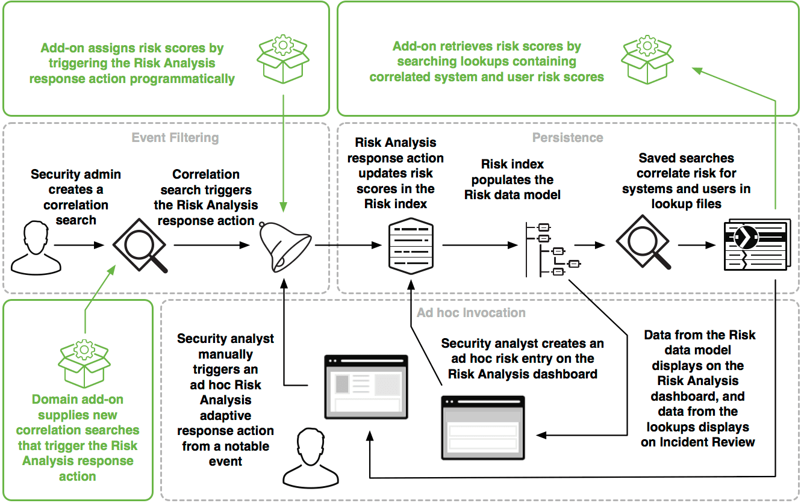

# Building Integrations for Splunk Enterprise Security

## Risk Analysis framework in Splunk ES

Risk Analysis 프레임워크는 개인 또는 assets의 risk profile을 높이는 작업을 식별 할 수있는 기능을 제공
프레임워크는 위험한 활동을 비정상적으로 수행하는 사람이나 장치를 식별 할 수있는 위험을 축적

이 프레임워크는 통합 할 수있는 Splunk Enterprise Security의 다섯 가지 프레임워크 중 하나
프레임워크에 대한 소개는 [Building Integrations for Splunk Enterprise Security](http://dev.splunk.com/view/enterprise-security/SP-CAAAFAZ)을 참조

이 다이어그램은 가능한 통합 지점을 강조 표시하여 위험 분석 프레임워크의 개요를 표시



이 다이어그램은 관리자, 분석가 및 개발자가 위험 분석 프레임워크와 상호 작용하는 방법

- 보안 관리자는 Risk Analysis response action를 트리거하는 correlation search을 작성
- response action는 Risk index에 위험 점수를 업데이트하고 해당 index 데이터는 Incident Review 및 Risk Analysis 대시보드에 표시
- 보안 분석가는 Incident Review에서 Risk Analysis response action를 실행하거나 Risk Analysis 대시보드에서 ad-hoc risk score 항목을 만들 수 있습니다.(이러한 작업 중 하나가 Risk index를 업데이트).
- 에드온 (녹색으로 강조 표시된)은 이 프레임워크와 두 가지 방식으로 통합
  - 위험 분석 대응 조치를 트리거하는 새로운 상관 관계 검색을 제공
  - /receivers/simple Endpoint를 직접 호출하여 위험 점수를 프로그래밍 방식으로 할당

ES 분석가와 관리자가 Splunk Enterprise Security의 위험 분석 프레임워크와 상호 작용할 수있는 몇 가지 방법

- Risk Analysis response actions이 포함된 Splunk Enterprise Security에 포함된 correlation searches을 활성화
- 위험 분석 대시보드에 ad-hoc risk entry을 생성
- Incident Review 대시보드에서 ad-hoc Risk Analysis adaptive response action을 실행하여 notable event의 위험 점수를 높이거나 낮춤

### Terminology for the Risk Analysis framework

Splunk Enterprise Security에서 위험을 수정하는 이벤트를 risk modifiers라고합니다. risk modifiers는 위험 지수의 이벤트로, 최소한 risk_score, risk_object 및 risk_object_type을 포함(risk modifiers를 설명하는 설명 필드가 있음)
Risk 데이터 모델은 Risk Analysis 및 Incident Review 대시보드에 대해 이러한 필드를 가속화
또한 프레임워크는 대소 문자를 구분하지 않는 asset and identity correlation을 처리하므로 시스템 또는 사용자 이름 변경에 적용되는 risk modifiers를 동일한 risk_object에 올바르게 할당

주어진 risk_object에 대한 전반적인 위험 점수는 해당 risk_object에 대한 모든 risk modifiers의 모든 risk_score 값의 합계
프레임워크가 위험 점수를 계산하는 방법에 대한 자세한 내용은 [Analyze risk in Splunk Enterprise Security](http://docs.splunk.com/Documentation/ES/latest/User/RiskScoring)을 참조.

### Integrate with the Risk Analysis framework

Risk Analysis 프레임워크에 패키지 통합을 제공 할 수있는 세 가지 통합 지점

- correlation search을 작성하고 Risk Analysis response action를 트리거하도록 설정
- Risk Analysis response action을 프로그래밍 방식으로 트리거
- 외부 앱 또는 기타 통합에서 사용하기 위해 Risk 프레임워크에서 위험 점수를 읽음

#### Write a correlation search

Risk Analysis 프레임워크의 통합을 구축하는 첫 번째 방법은 통합 요구를 충족시키는 correlation search을 작성하고 Risk Analysis response action을 트리거하도록 설정(예를 들어 [Risk scoring example](http://docs.splunk.com/Documentation/ES/latest/User/RiskAnalysis#Risk_scoring_example)를 참조)
그런 다음 콘텐츠 관리 페이지에서 앱으로 correlation search을 내보내기.
앱으로 [Export content from Splunk Enterprise Security](http://docs.splunk.com/Documentation/ES/latest/Admin/Export)를 참조

#### Trigger the response action programmatically

correlation search을 사용하지 않고 애드온 내부에서 Risk Analysis response action를 프로그래밍 방식으로 트리거하려면 modaction_adhoc REST 처리기를 사용하여 "| sendalert risk"를 호출
(예를 들어, 특정 시스템의 위험 점수를 100으로 업데이트)

```bash
$ curl -k -u admin:changeme https://localhost:8089/services/alerts/modaction_adhoc \
>     -d "search=| makeresults | eval src=\"my system\",description=\"my description\"" \
>     -d "action_name=risk" \
>     -d "action.risk.param._risk_score=100" \
>     -d "action.risk.param._risk_object=src" \
>     -d "action.risk.param._risk_object_type=system"
{"sid":"1476130499.2","command":"| makeresults | eval src=random() | sendalert risk param._risk_object_type=system param._risk_object=src param._risk_score=100 param.action_name=risk param.results_count=\"$job.resultCount$\" | stats count"}
```

검색 파이프 라인에서 직접 위험을 수정할 수도 있음(특정 시스템의 위험 점수를 100으로 업데이트) :

```bash
| makeresults | eval risk_object="mysystem"
| sendalert risk param._risk_score="100" param._risk_object_type="system"
```

특정 사용자의 위험 점수를 100으로 업데이트하려면 다음을 수행 :

```bash
| makeresults | eval risk_object="myuser"
| sendalert risk param._risk_score="100" param._risk_object_type="user"
```

"other"유형의 risk object에 대한 위험 점수를 100으로 업데이트 :

```bash
| makeresults | eval risk_object="myother"
| sendalert risk param._risk_score="100" param._risk_object_type="other"
```

#### Read risk scores from the framework

외부 앱에서 사용하기 위해 Risk Analysis 프레임워크에서 현재 위험 점수를 읽으려면 검색에서 직접 risk_correlation 조회를 호출
lookups이 동일한 risk_object의 변형에 대한 risk modifiers를 상관시키기 때문에 index 또는 데이터 모델에서 직접 조회하는 대신 lookups에서 데이터를 읽는 것이 가장 좋음. 예 :

```bash
| inputlookup append=T risk_correlation_by_user_lookup where risk_object="myuser"
```

'risk_correlation_identities(user)' 매크로를 사용하여 위험 점수와 다른 데이터를 상관시키기 위해 검색 파이프 라인을 사용. 예 :

It is also possible to use the search pipeline to correlate risk scores with other data using the `risk_correlation_identities(user)` macro. For example:

```bash
`summariesonly` count from datamodel=Authentication.Authentication by Authentication.user
| rename Authentication.user as user | `risk_correlation_identities(user)`
```