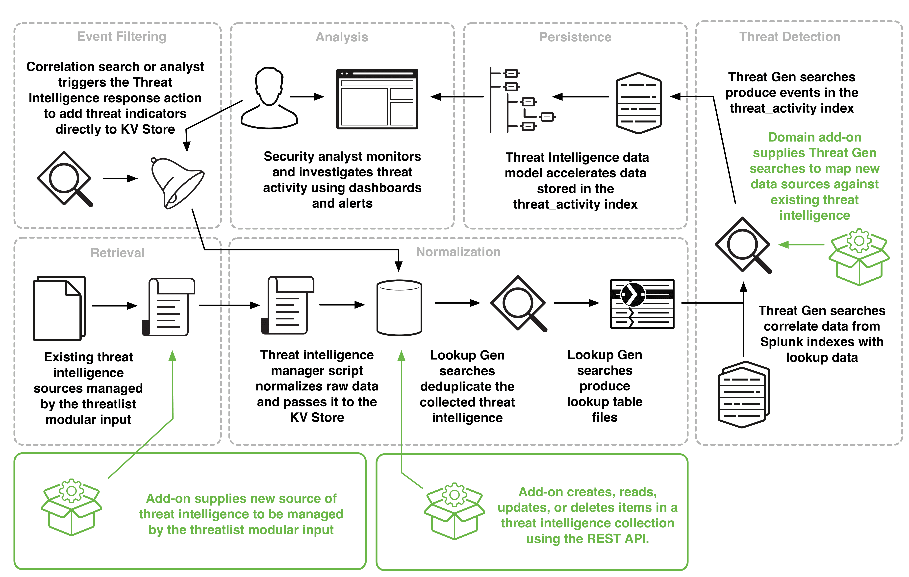

# Building Integrations for Splunk Enterprise Security

## Threat Intelligence framework in Splunk ES

The Threat Intelligence framework is a mechanism for consuming and managing threat feeds, detecting threats, and alerting. The framework consists of modular inputs that collect and sanitize threat intelligence data, lookup generation searches to reduce data to optimize performance, searches to correlate data and alert on the results, and data modeling to accelerate and store results. This framework also includes a number of audit dashboards that allow introspection into threat intelligence retrieval, normalization, persistence, and analysis.

This framework is one of five frameworks in Splunk Enterprise Security with which you can integrate. See [Building Integrations for Splunk Enterprise Security](http://dev.splunk.com/view/enterprise-security/SP-CAAAFAZ) for an introduction to the frameworks.

The diagram presents an overview of the Threat Intelligence framework, with the possible integration points highlighted.

This diagram shows how admins, analysts, and developers can interact with the threat intelligence framework. A security admin configures the threat intelligence sources managed by the threatlist modular input. The threat intelligence manager script normalizes the raw data and passes it to the Splunk KV Store. Lookup generating searches deduplicate the collected threat intelligence and produce lookup table files. Threat generation searches correlate data from Splunk indexes with the lookup data. Threat gen searches produce events in the threat_activity index. The threat intelligence data model accelerates data in the threat_activity index. Security analysts monitor and investigate threat activity using dashboards and alerts. Analysts can directly add new threat indicators to the KV Store using an adaptive response action, which can also be triggered by correlation searches. Developers can integrate with the threat intelligence framework in three ways: 1. Create an add-on that supplies a new source of threat intelligence to be managed by the threatlist modular input. 2. Create, read, update, or delete items in a threat intelligence collection in the KV Store using the REST API. 3. Supply new Threat generation searches to map new data sources against existing threat intelligence.

### How Splunk Enterprise Security processes threat intelligence

The default process by which Splunk Enterprise Security processes threat intelligence is as follows.

1. A Splunk Enterprise Security administrator configures the included threatlist sources and adds new ones by adding new threatlist inputs. In addition, she can configure correlation searches to add threat indicators directly from events to the KV Store.

2. The threatlist.py modular input downloads threat intelligence from the configured threatlist sources to the threat intelligence dropbox at $SPLUNK_HOME/etc/apps/SA-ThreatIntelligence/local/data/threat_intel.
 Note: In some circumstances, the threatlist.py modular input is not able to download threat intelligence when there are specialized requirements, such as complex authentication schemes. In these cases, the Splunk Enterprise Security administrator may choose to populate a threat intelligence dropbox with files using an out-of-band process, external to the Splunk platform. Splunk Enterprise Security provides a dropbox for this purpose at $SPLUNK_HOME/etc/apps/DA-ESS-ThreatIntelligence/local/data/threat_intel.
 See [Configure a custom folder and input monitor for threat sources](http://docs.splunk.com/Documentation/ES/latest/Admin/Uploadthreatfile#Configure_a_custom_folder_and_input_monitor_for_threat_sources) if you want to add another dropbox in a different app. The path must follow this pattern: $SPLUNK_HOME/etc/apps/<app_name>/local/data/threat_intel.

3. The threat_intelligence_manager.py modular input reviews the downloaded content in all defined dropboxes and lookup tables for new threat intelligence.

- If a downloaded file contains no usable information, the threat_intelligence_manager deletes the file if remove_unusable is set to true.
- If a downloaded file contains usable information, the threat_intelligence_manager consumes the data and then deletes the file if sinkhole is set to true.
- If the threat intelligence comes from a lookup table, the threat_intelligence_manager consumes the data and leaves it in place. Deletion does not occur for threat intelligence consumed from lookup tables, as they might be used by other searches.

4. The Threat Intelligence Audit dashboard displays the latest status changes to the threat sources.

5. The threat_intelligence_manager.py modular input parses the threat sources and updates the KV Store threat collections with any new intelligence. Security analysts can review the data in the threat collections on the Threat Artifacts dashboard or with an |inputlookup search on a specific collection name. For example, |inputlookup ip_intel.

6. When collections are updated, lookup generating searches extract and deduplicate threat data from the KV Store collections and create CSV lookup files for efficient use in search.

7. Threat generating searches compare the lookup files to events in the data models. By default, all Threat Gen searches search the previous 45 minutes of events. To match threat intelligence data against events older than 45 minutes, modify the earliest time for the Threat Gen searches.

8. Matches found by Threat Gen searches populate the threat_activity index and tag the events for the Threat Intelligence data model. Security analysts can review the items in the threat_activity index on the Threat Activity dashboard.

9. The Threat Activity Detected correlation search creates notable events from the threat source matches and changes risk scores of assets and identities associated with the threat source match. Security analysts can review the notable events created on the Incident Review dashboard and the risk scores on the Risk Analysis dashboard. They can use the threat intelligence response action to add threat indicators from events to the KV Store.

### Integrate with the Threat Intelligence framework

There are three ways to integrate with the Threat Intelligence framework.

- Add a custom threat intelligence data source. There are two ways to do this:
  - Create a new stanza in inputs.conf, managed by the threatlist.py modular input. Follow the naming convention [threatlist://<my_custom_threat_intel_source>].
  - Upload a custom threat intelligence data source by using the REST API. See [Threat Intelligence API reference](http://docs.splunk.com/Documentation/ES/latest/API/ThreatIntelligenceAPIreference).

- Create, read, update, or delete items in a threat intelligence collection in the KV Store by using the REST API. See Threat Intelligence API reference.
- Match custom data against existing intelligence collections by creating a new Threat Gen search.