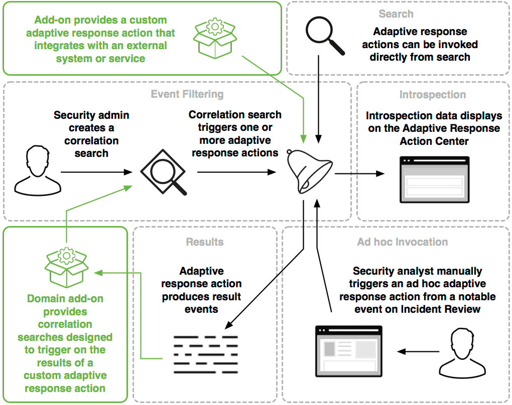

# Building Integrations for Splunk Enterprise Security

## Adaptive Response framework in Splunk ES

The Adaptive Response framework provides a mechanism for running preconfigured actions within the Splunk platform or by integrating with external applications. These actions can be automatically triggered by correlation search results or manually run on an ad hoc basis from the Incident Review dashboard.

This framework is one of five frameworks in Splunk Enterprise Security with which you can integrate. See [Building Integrations for Splunk Enterprise Security](http://dev.splunk.com/view/enterprise-security/SP-CAAAFAZ) for an introduction to the frameworks.

Most adaptive response actions produce new events in the Splunk platform. Response events are linked to the action that produced them with orig_action_name, orig_sid, and orig_rid fields, allowing developers or ES admins to construct workflows of chained actions. ES admins and analysts can then customize and audit these workflows.

The diagram presents an overview of the Adaptive Response framework, with the possible integration points highlighted.

This diagram shows how admins, analysts, and developers can interact with the adaptive response framework. A security admin creates a correlation search which triggers one or more response actions. A security analyst can also manually trigger an adaptive response action from a notable event on Incident Review, or the actions can be invoked directly from a Splunk search. Introspection data displays on the Adaptive Response Action Center. The adaptive response action produces result events. Developers can provide a custom adaptive response action that integrates with an external system or service. Developers can also create correlation searches designed to trigger on the result events of a custom adaptive response action.

### Integrate with the Adaptive Response framework

To build integrations for this framework, write your own adaptive response actions using the Common Action Model. Follow the JSON spec and the cim_actions.py library or use Splunk Add-on Builder to ensure that your action is fully compatible with the Adaptive Response framework.

You can also create one or more correlation searches designed to alert on the results of a custom response action and trigger another action. In this way, you can create logical chains of actions that evaluate the results of one action and dynamically react with additional actions or recommendations.

See [Create a response action](http://dev.splunk.com/view/enterprise-security/SP-CAAAFBF) to get started.

#### Determine whether your action supports ad hoc invocation

Response actions can be invoked in two ways: by matching the trigger conditions of a correlation search in Splunk Enterprise Security, or by manually running the action on a notable event from the Incident Review dashboard. The latter, manual method of running an action is called an ad hoc invocation.

While all response actions can be triggered by correlation searches, not all response actions can be invoked as ad hoc actions. For example, the Send email response action cannot be invoked as an ad hoc action, because this action uses the sendemail command rather than the default sendalert command and relies on a number of parameters that are not available from the context of the event.

All actions that use the default sendalert command to initiate an adaptive response action can be invoked as an ad hoc action.

#### Best practices for using dynamic logic in a response action

As a best practice, do not include choice routing or other dynamic logic within a single response action. Although executing multiple actions within a single adaptive response action is technically possible, troubleshooting and auditing such actions is challenging. Instead, use the addevent() and writevents() methods supplied by the Common Action Model to produce events that can then kick off downstream actions by matching the search criteria of other correlation searches. For example, see [Sample correlation search designed to assign risk scores based on results from the haveibeenpwned action](http://dev.splunk.com/view/enterprise-security/SP-CAAAFBH#chain).

Enterprise Security admins can suggest a workflow for analysts to follow using the Next Steps option when configuring the triggers and details of a notable event. See [Create a notable event](http://docs.splunk.com/Documentation/ES/latest/Admin/Configureadaptiveresponse#Create_a_notable_event) for more information about writing Next Steps for ES analysts.
