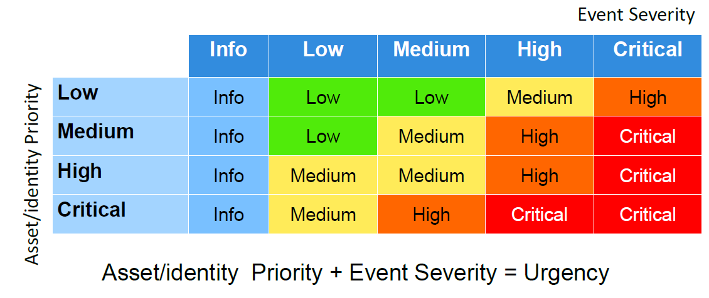

# Administering Splunk Enterprise Security

## Module 2: Security Monitoring and Incident Investigation

### Objectives

- Use the Security Posture dashboard to monitor enterprise security status
- Use the Incident Review dashboard to investigate notable events
- Take ownership of an incident and move it through the investigation workflow
- Create notable events
- Suppress notable events
- Examine the investigation journal

### Monitoring and Response

- ES continually runs correlation searches for known types of threats and vulnerabilities
- When a correlation search detects any indicators of compromise (IOC), it can initiate any number of adaptive responses, including creating a notable event
  - Notable events are referred to as incidents, which can be tracked, updated, and resolved, and are categorized into security domains
- Use the Security Posture dashboard for an overview of recent notable events, and Incident Review to inspect and manage notable event incidents

### The Security Posture Dashboard

- An overview of your Enterprise Security condition
- Key indicators at the top summarize notable event status by domain over the last 24 hours
- Four panels below provide additional summary information categorized by urgency, time, and most common notable event types and sources

### Security Domains: Categories of Notables

|Domain|Description|
|:--:|:--|
|Access|Authentication attempts, access control, or related events such as login, access allowed or failed, etc.|
|Endpoint|Endpoint systems such as PCs, notebooks, POS, including: malware, system configuration, etc.|
|Network|Networks or traffic, from sources like firewalls, routers, intrusion detection, vulnerability scanners, etc.|
|Identity|Assets (devices) or identities(users)|
|Audit|Discoveries during audit scans|
|Threat|Possible indicators of compromise found by the threat intelligence system|

### Key Indicators

Current total count of events, the trend of events, and the total increase or decrease over the past 24 hours
Red = over threshold
Only ES Admins can edit key indicators
Large number for each indicator is the total number of notable events in that category
Green = under threshold
Black = no threshold
Trend indicator; red for increase, green for decrease
Amount of change in last 24 hours

### Security Posture Panels

### Notable Event Urgency

- Each notable event has an urgency field, ranging from informational to critical
- Urgency is a combination of two factors:
  - Severity
    - Based on the raw event(s)
    - Found by the correlation search
  - Priority
    - Assigned to the associated assets or identities—i.e., the server or user
    - If more than one asset or identity is involved in a single notable event, the one with the highest priority determines the urgency

### Urgency Table

- Asset/identity Priority + Event Severity = Urgency

Event Severity
A
Asset/identity Priority + Event Severity = Urgency
Info Low Medium High Critical
y t i r o i r P y t i t n e d i / t e s s
Low
Medium
High
Critical
Info Low Low Medium High
Info Low Medium High Critical
Info Medium Medium High Critical
Info Medium High Critical Critical

### Security Posture: Drilldown Support

In Security Posture, click an item in the key indicator row or a panel to open related notable events in the Incident Review dashboard
Hover over an item in a panel to show details about that item's underlying notable events
Once opened in the incident review dashboard, you can drill down into the details of each notable event, take ownership, and "work" the issue
Incident Review Dashboard

### The Incident Review Dashboard

Urgency
Action Click to expand details
menu
Filter options
Sortable column headers
Duration
Notable events
Timeline & job controls

### Incident Review Filter Fields

- Status: New, In Progress, Pending, Resolved, Closed
  - Along with Owner, use to track status of an incident
- Urgency: info, low, medium, high, critical
- Security Domain: Access, Endpoint, Identity, Network, Threat, Audit
- Owner: The user assigned to investigate and resolve an incident
- Correlation Search Name: Drop-down list
- Search: Splunk search language expressions
- Tag: A list of tag names

### Using the Incident Review Dashboard

- Select one or more values per field
  - More than one value per field are ORed together
- Urgency values can be toggled on and off
  - Grey values are “off” and will not be displayed
- If values are set for more than one field, the fields are ANDed together
- Status, owner, domain and tag support multiple OR values

### Notable Event Details

Risk score
All fields for the notable event, with action menus for each field

Note
You can’t expand an event until the search is complete. Not all incidents have all the same detail items.
Notable Event Action menu

### Create a Short ID

Click Create Short ID for ES to automatically generate a short ID that makes it easier to find and share. The Short ID replaces the Create Short ID link, such as: 2H4CKO.
Creating a Short ID is also an option when you choose the Share Notable Event in the Actions drop down.

### Notable Event Actions Menu

- Each notable event also has an actions menu with options related to the event, such as:
  - Adding the event to an investigation
  - Suppressing the notable event –
  - Running adaptive response actions
  - Sharing the notable event with others

### Field Actions Menus

- Each notable event field has an action menu allowing you to
  - Investigate the asset, set tags, access other ES dashboards to view events or analyze the data in the field, and more
- Risk scores for hosts or users are displayed next to fields
  - Click a risk score to open the Risk Analysis dashboard for that asset or identity

Note
Action menus only display 10 items at a time. Scroll the menu to make sure you see all the items.

### Incident Workflow: Concepts

- Steps:
  1. Assign an owner
  2. Investigate
  3. Implement corrective measures
- Regularly update status as you move to resolution
- ES Admins can define and add new status values as necessary

|New - not yet being worked|
|:--|
|In progress - investigation underway|
|Pending - various: work in progress, awaiting action, etc.|
|Resolved - fixed, awaiting verification|
|Closed - fix verified|

### Incident Workflow: Procedures

1. Select
2. Click Edit one or Selected more events
3. Set Urgency, Status, Owner, and Comment
4. Click Save changes

### Incident Review History

1. Select View all review activity for this Notable Event to open a new search showing all review events for the current issue
2. The `incident_review` macro can be used in your own custom searches and reports for incident status tracking

### Adaptive Response

- A notable event may contain adaptive responses the analyst can initiate
  - Actions menu: Select other adaptive responses to execute
  - Adaptive Responses: See a list of previously executed responses
  - Next Steps: Click a suggested response
- Depending on the type of notable event, different adaptive responses are available
  - Examples: ping host, change risk, run a script, Nslookup, send to UBA, etc.

### Creating and Suppressing Notable Events

- Manual creation: useful when you have source event data that has not (yet) been identified by ES as suspicious, and you want to create a notable event that will identify the issue and allow you to track it
- Suppression: useful if you are getting false positives from a host or a user, and you want to exclude future notable events from that host or user from appearing on the incident review dashboard
- By default, ES Analysts do not have permission to perform these actions
  - An ES Admin must enable these capabilities for ES Analysts if desired

### Creating Notable Events

- You can create ad-hoc notable events from several menus
  - Example: you find an event in a search that has not triggered a correlation search's parameters, but you feel it should be investigated
- Steps:
  1. Run a search on the source events
  2. Expand an event and select Event Actions
  3. Select Create notable event
  4. Enter the desired data for the notable event
  5. Click Save

### Suppressing Notable Events

- Suppression hides notable events from the incident review dashboard
  - Notables are still created
- To do so, start from Incident Review:
  1. Expand the notable event's Actions menu
  2. Select Suppress Notable Events
  3. Set description and dates 4. Click Save

Note
The end date is optional. If left blank, all future notable events from this server will be suppressed.

### Suppression Audit

- Audit > Suppression Audit
- Useful for tuning correlation searches
- Provides an overview of notable event suppression activity
- Shows how many events are being suppressed and by whom

### Managing Notable Event Suppressions

- After you create a new notable event suppression, you will see the list of suppressions as a confirmation
  - You can access this list via Configure > Incident Management > Notable Event Suppressions
- • Only ES admins can edit these suppressions by default
  - While editing, you can modify the suppression search criteria if desired

### Investigations

- An investigation is a collection of activities and notes related to work done on a specific issue, such as a breach or other incident
- Investigations are organized chronologically into timelines
- Investigations can be managed by one or more analysts
- Use investigations to:
  - Visualize progress
  - Document work
  - Share information

### Starting an Investigation

- You can create a new investigation:
  - On an incident’s action menu in Incident Review –On the My Investigations dashboard –At any time using the Investigation Bar at the bottom of the ES window
  - On an event’s Actions menu
- By default only ess_admin and ess_analyst users can create investigations
- Each investigation has one owner and can have any number of additional collaborators
  - Only owners and collaborators can modify the investigation

### My Investigations Dashboard

To edit (delete) an investigation: 1. Click a box or boxes Click the Edit Selection
button
Lists all investigations
Filter by time or text
Click an investigation to view its related entries (default view is Timeline)
Add investigations

### Timeline View

Click to change view
Scroll left (newer)
Jump to start
Expand or contract time scale
Filter
Add collaborator
Click an item to see details in upper panel
Scroll right (older)

### Rename Investigation Entry

Modify time as needed. Default = now
Enter new title
Add attachment s (optional)

### Investigation Bar and Inline Timeline View

Notable events
Sortable column headers
Select investigatio n
Navigate quickly to investigations from Incident Review
View and edit the investigation timeline
Timeline
Timeline Zoom
Edit Investigation name and description
Create a
Jump to start new
Action investigatio
History n
Generated for Cho Jun Seung `
(jscho@time-gate.com) (C) Splunk Inc, not for distribution
Notes
Quick Searc h
Toggle Investigation Timeline

### Quick Search

Add search to investigation
Enter 2
search criteria
Determine whether the results are useful to the investigation
Click quick search icon

### Adding Events

Add notable events from incident review
or o Add source r
events from search result window

### Investigation List View

Delete items
Click to edit investigation name
Choose which items to view Add / remove collaborators
Edit item names

### Adding Items to the Investigation

- Note
  - Generic text items used to add information relevant to the investigation
- Action History
  - A reverse chronological list of all of your activities in ES: searches run, dashboards used, etc.
  - Add these to your investigation to document the steps you’ve taken to research the issue
  - Adding notes can clarify why you ran the search and what the results mean for your investigation

### Adding a Note

Add attachments Note
Attachments can be in text or binary format. 4 MB max per file (as attachments to notes) and are stored in KV store.
Click to add a note
Modify time as needed. Default = now

### Enter comments

### Adding Action History Items

Modify time as needed.
Select items
1 Filter as needed

### Action History Whitelist

- You can mask some searches from appearing in the action history list
- Useful to screen common searches that otherwise cause list congestion
- Configure > Data Enrichment > Lists and Lookups > Action History Whitelist
- Right-click last row to insert new entry
- Click Done

### Adding Collaborators

- Only the owner and collaborators can work on an investigation
- Owners can’t be deleted

Hover over any collaborator to view name
Click to remove a collaborator or change the write permissions
Click to add a collaborator
Search and / or click to add a collaborator

### Lab Exercise 2: Monitor and Investigate

- Time: 40 minutes
- Scenario: An expired user account has been detected attempting to log on to high priority resources
  - Tasks:
    - Use the Incident Review dashboard to investigate and take ownership
    - Determine which server(s) are being threatened and take action to mitigate
    - Transition the notable events through the investigation workflow
    - Create a manual notable event
    - Suppress notable events