# Quick Start

This Quick Start walks you through the process of creating an app using Splunk Web and explains how configuration files work together to create an app.

This Quick Start is aimed towards people just getting started with Splunk app development, but more experienced app developers might also find it useful. You'll learn about getting started with Splunk Enterprise and how to create an app, add data to an app, search data in an app, add visualizations to your app, and customize your app's navigation. Along the way, the Quick Start will dive into the details of how different parts of a Splunk app work together and link to more in-depth resources on individual topics.

This Quick Start contains the following sections:

- Before you begin
- Create your first app
- Add data
- Report on data
- Visualize data
- Change navigation
- Set $SPLUNK_HOME
- Your first AppInspect
- Use macros to avoid index dependency

At the end of this Quick Start, you'll be prepared for a more comprehensive journey into Splunk app development. For a walkthrough about how to create Splunk apps for two different use cases, see Building Splunk Solutions. For more about the general process of creating an app, see Overview of creating an app.

We need your feedback! Please let us know if the style of this Quick Start works for you and what topics you'd like us to explore next. Click here to take a short survey.

## Before You Begin

Before you begin, you must install Splunk and make sure you have a Splunk.com account so that you can download the Splunk Enterprise trial used in this tutorial. Your Splunk.com account is also used to download and install apps from Splunkbase directly through Splunk Web. Once you have set up your account, install Splunk Enterprise using one of the following methods:

- Get Splunk Enterprise using Docker.
  1. Install Docker.
  2. From a terminal command prompt, run:
    ```bash
    docker run -it -v ${PWD}/etc:/opt/splunk/etc -p 8000:8000 splunk/splunk
    ```
- Get Splunk Enterprise by downloading it from Splunk.com.

This tutorial focuses on building apps using Splunk Enterprise. There are other versions of Splunk you might be interested in, including Splunk Light and Splunk Cloud. Keep in mind the following:

- Splunk Light doesn't support custom-built apps.
- Cloud apps must be vetted by Splunk before they can run on Splunk Cloud.

Once you have installed Splunk Enterprise, consider getting a Splunk developer license. This license is optional, but it provides many benefits. For example, a Splunk developer license allows you to index up to 10GB of data per day, which is useful as you begin to experiment with Splunk and build apps. To take advantage of those benefits, you'll need to apply your Splunk developer license.

Next, you'll need to understand the basics of using Splunk software. Make sure you can do the following:

- [Import data](http://docs.splunk.com/Documentation/Splunk/latest/Data/WhatSplunkcanmonitor)
- [Perform a basic search](https://docs.splunk.com/Documentation/Splunk/latest/SearchTutorial/WelcometotheSearchTutorial)
- [Save reports](https://docs.splunk.com/Documentation/Splunk/latest/SearchTutorial/Aboutsavingandsharingreports)
- [Create charts](https://docs.splunk.com/Documentation/Splunk/latest/SearchTutorial/Aboutsavingandsharingreports)
- [Create dashboards](https://docs.splunk.com/Documentation/Splunk/latest/SearchTutorial/Aboutdashboards)
- [Create alerts](https://docs.splunk.com/Documentation/Splunk/latest/SearchTutorial/Aboutdashboards)

Finally, go to Splunkbase for the hundreds of apps and add-ons, many of which are open source, that you can use or extend to get results faster.

## Create Your First App

Now that you have installed Splunk, create your first app:

1. Start Splunk Enterprise, if it isn't already running.
2. Open Splunk Web from a web browser by navigating to <http://localhost:8000>, which is the default URL.
3. Log in to Splunk Enterprise.
4. On the Splunk Web home page, click the Gears icon next to Apps.
5. Click Create app.
6. On the Add new page, fill out the properties of the new app, including the app's name, the name of the folder where it will be stored on disk, the version number your app will start at, the author name, and the description of your app. For Visible select Yes. Each settings creates a corresponding stanza in the app configuration file (app.conf) defining your app. We'll talk more about that more below.
7. Under Template, select barebones. The barebones template creates:
    - An app with a basic directory structure.
    - Required configuration (.conf) files.
    - Some additional readme files.
8. Click Save to create your app.
  Your app is now listed on the Apps page along with any other apps that are installed.
  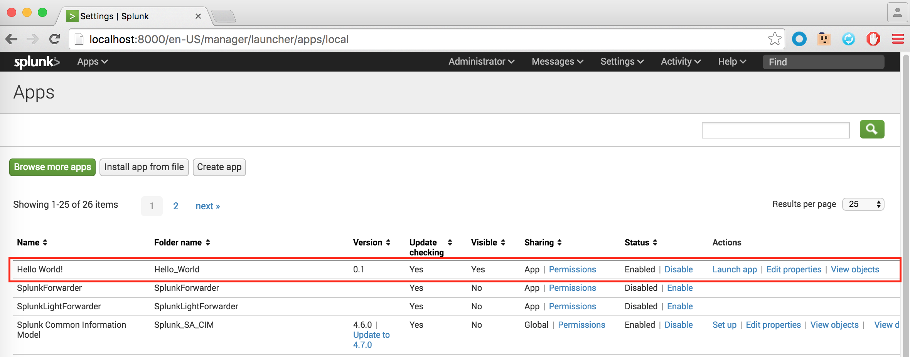
  Under the Actions for your app, you can click Launch app to navigate to the default home dashboard of your app.
  Click the Splunk logo in the upper left corner of the window to return to the default Splunk Web dashboard, and notice that your app appears in the list of apps on the left of the Splunk Web home page.
  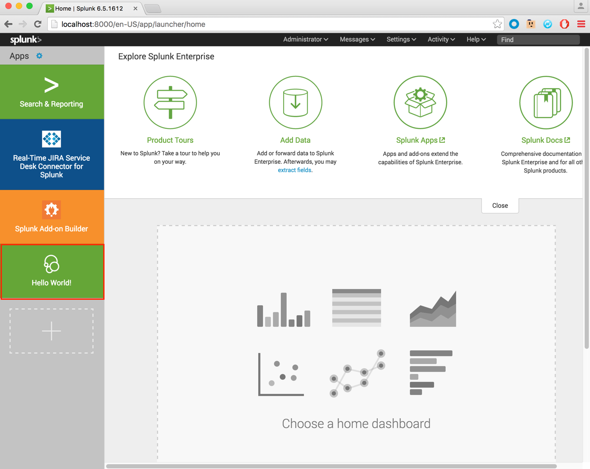
9. Click your app to run it.

### Recap

You've just created your first app using Splunk Web's interface. Congratulations! Let's take a step back and look at the files and folders Splunk Web just created for you.

Open a file browser and navigate to the apps folder under `$SPLUNK_HOME`. Depending on your operating system, the default paths are:

- Mac: /Applications/Splunk/etc/apps
- Windows: C:\Program Files\Splunk\etc\apps
- Linux: /opt/Splunk

Splunk stores all installed apps under `$SPLUNK_HOME/etc/apps` and includes a folder for the app you just created. Splunk Enterprise should set the SPLUNK_HOME variable by default, but if you want to change it see Set $SPLUNK_HOME.

### App folders and files

Here's a sample folder structure for your app:

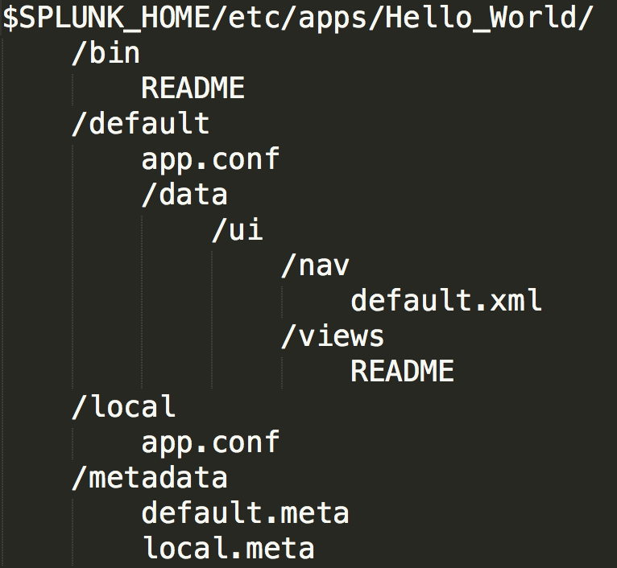

Open the folder containing your app. The /bin folder is where you should store supporting code for your app. For example, Python code used for modular inputs should go in here.

> Notes
> - When you use the barebones template to create an app, a README file is generated that contains a quick statement about what belongs in this directory. You should remove this file before publishing your app.
> - If your app won't have any scripts or code, remove /bin directory because unnecessary files can make it difficult to determine an app's purpose.

### Default and local configurations

The /default folder is where default and base configuration files (.conf), navigation components, and views (visualization components) are stored.

The /local folder is where user-customized configurations, navigation components, and views are stored.

Changes made to files in the /local folder are private to each user and is where Splunk Web saves most changes you make to an app through the web interface. The /local folder is used so that the default values are not mutated. You can always revert to the defaults of an app by deleting the local configurations for your user. The contents of the /local folder have higher precedence than the contents of the /default folder.

If the same stanza properties are defined in the same configuration files in both /default and /local, the values in /local are the ones Splunk Enterprise uses. For more about configuration precedence, see [Configuration file precedence](http://docs.splunk.com/Documentation/Splunk/latest/Admin/Wheretofindtheconfigurationfiles) in the Admin Manual.

For instance, in the app you just created, the "version" field in /default/app.conf is set to 1.0. This value is overridden by the "version" field in /local/app.conf with 0.1, and this is the value displayed by Splunk Web as the version number for your app.

> Notes
> - Migrate configurations from the /local to the /default directory before you package and publish your app so that users don't inadvertently overwrite important configurations.
> - When users update their app, the /local directory won't be overwritten so that customizations users make to their app are preserved through updates.

### The app configuration file

The app.conf file contains configuration settings about your app and how Splunk Enterprise should display it. In the image below, the default app.conf is on the left and the local app.conf is on the right:

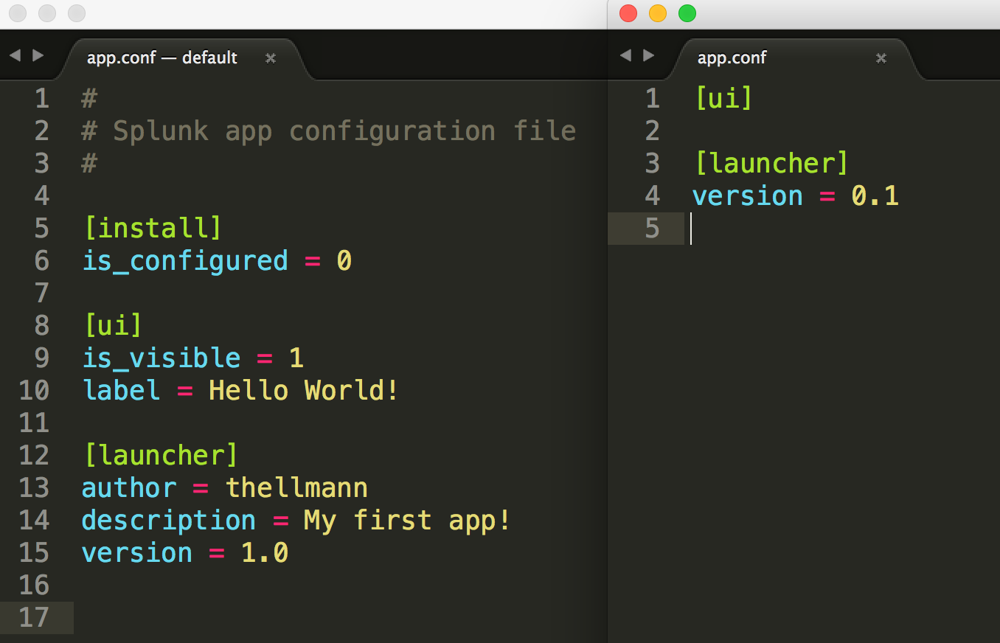

> Note  The screenshots of code displayed here show Sublime Text with the Splunk Conf File Syntax Highlighting plug-in that enables syntax highlighting for .conf and .meta files.

If you compare these fields to the page you filled in earlier when creating your app, you can see where the values for "is_visible", "label", "author", "description", and "version" are stored. The "version" property was set in the /local directory--because settings in this directory have higher precedence than settings in /default, the version number is displayed as 0.1 in Splunk Web.

All .conf files contain a series of stanzas, indicated by square brackets, and attributes. Each attribute applies only to the stanza in which it is defined. You could have multiple description attributes in the same .conf file as long as they were contained in different stanzas. For more about .conf files in general, see [Configuration file structure](http://docs.splunk.com/Documentation/Splunk/latest/Admin/Configurationfilestructureandsyntax) in the Admin Manual. For more about the [app.conf](http://docs.splunk.com/Documentation/Splunk/latest/admin/Appconf) file, see app.conf in the Admin Manual.

If you design your app to rely on other apps and add-ons and would like to declare dependencies, which will be automatically resolved, you'll need to provide an app.manifest file. For more information, see [The app manifest](http://dev.splunk.com/view/packaging-toolkit/SP-CAAAE9V#theappmanifest) in the Packaging Toolkit documentation.

### The navigation file

The `/default/data/ui/nav` and `/local/data/ui/nav` folders contain settings for the navigation bar at the top of your app in the default.xml file.

The "default='true'" attribute determines which dashboard to display when your app first loads. The "name" attribute refers to the "label" value defined in the dashboard's .xml file for that navigation entry.

The navigation links in your first app are default links and are part of the Search app that is included with Splunk Web, which is why you do not see these dashboards stored in /default/data/ui/views.

The Search app's dashboards are stored in `$SPLUNK_HOME/etc/apps/search/default/ui/views` if you're curious.

### Metadata

The /default/data/ui/views and /local/data/ui/views folders contain the .xml files that define dashboards in your app. Currently, there's just a README file stored in the /default version of this folder because we haven't defined any dashboards yet. As with the other README, this file just tells us what goes in this directory and can be removed. When you create a dashboard in Splunk Web, it appears in /local/data/ui/views. The metadata contains two files to store metadata and permissions for Splunk objects (searches, views, and so on). Unlike other configuration files, the default and local versions of the metadata are stored in the same /metadata folder.

The default.meta file contains stanzas describing which objects can be viewed by which users in the system. The empty [] stanza is used to allow access to the app. In the barebones app you created, default.meta allows all users of the Splunk Enterprise environment to access the app, but only admins and power users can change it.

The export statements in each stanza indicate that these Splunk objects should be available to all apps in the Splunk environment. You can export to system (all apps), none (no apps), or to specific apps. This setting makes the specified Splunk objects in the current app accessible to the other apps you specify.

The local.meta file has higher precedence than default.meta and as a result overwrites default.meta if you define the same stanza or attribute in both files. In your app, local.meta defines a version (corresponding to the version of Splunk on which you created the app) and modtime (corresponding to the last time the object referred to in that stanza was modified). For more information about permissions and scopes, see Configuration file structure in the Admin Manual.

Now that you know what happens when Splunk creates an app, you also know how to manually create an app without using Splunk Web. Create the same folder structure and .conf files inside of $SPLUNK_HOME/etc/apps and restart Splunk Enterprise.

## Add Data

Now that you have an app, let's add some data. We'll use sample data from the sample app "sample_app", which is included with Splunk Enterprise.

1. Click the Splunk logo in the upper left corner of Splunk Web to return to the home page.
2. Click Add Data.
3. Click Upload files from my computer.
4. Click Select.
5. Navigate to $SPLUNK_HOME/etc/apps/sample_app/logs, select maillog, then click Open.
6. Click Next.
7. For Source type, click Email, then select sendmail_syslog.
8. Click Next.
9. For Index, click Create a new index.
  Creating an index is typically a task for administrators, who determine where to store data. For this tutorial, you will create an index for your data, which you can remove later if you want. For best practices, see [App Design Patterns - Creating Indexes](https://www.splunk.com/blog/2017/04/03/app-design-patterns-creating-indexes.html) on Splunk Blogs.
10. Enter an Index Name, and leave Search and Reporting selected for App.
  You should not include index definitions with your app or build your searches to rely on the existence of a specific index. The Search and Reporting app is the default location for index definitions. If you create an index from the command line without specifying a location, the index is created under `$SPLUNK_HOME/etc/apps/search/local`. For more about making your app index-independent, see [Use macros to avoid index dependency](http://dev.splunk.com/view/quickstart/SP-CAAAFDK).
  Most of the other options on the New Index dialog box are used for determining where to store data and how much to store. For details, see [Indexes, indexers, and indexer clusters](http://docs.splunk.com/Documentation/Splunk/latest/Indexer/Aboutindexesandindexers) in the Managing Indexers and Clusters of Indexers manual.
11. Click Save to create your index.
12. Click Review, then click Submit to upload your data to the new index.

You can also create indexes from the command line as follows:

1. Open a command prompt and navigate to $SPLUNK_HOME/bin.
2. Enter the following at the command prompt, where your_index_name is the name of your index:
    On Mac, enter:
    ```bash
    ./splunk add index your_index_name
    ```
    On Windows, enter:
    ```bash
    splunk add index your_index_name
    ```
3. Enter your Splunk username and password when prompted.
  Unless you specify a different location, the index is created in `$SPLUNK_HOME/etc/apps/search/local`.
4. To remove an index, enter the following at the command prompt
    On Mac, enter:
    ```bash
    ./splunk remove index your_index_name
    ```
    On Windows, enter:
    ```bash
    splunk remove index your_index_name
    ```

### Add Data Recap

Now you've added some data to Splunk Enterprise that your app can access. Let's review the changes made to your app's structure.

Two files in the Search and Reporting app have been updated: `$SPLUNK_HOME/etc/apps/search/local/indexes.conf` and `$SPLUNK_HOME/etc/apps/search/metadata/local.meta`. The local.meta file now contains a stanza at the end that provides additional information about the new index, which is called "hello_index" in the following diagram:
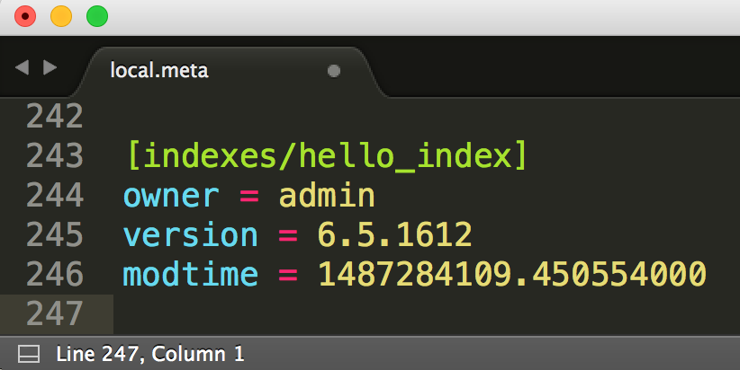

The indexes.conf file now contains a stanza at the end that defines the new index, which is called "hello_index" below:
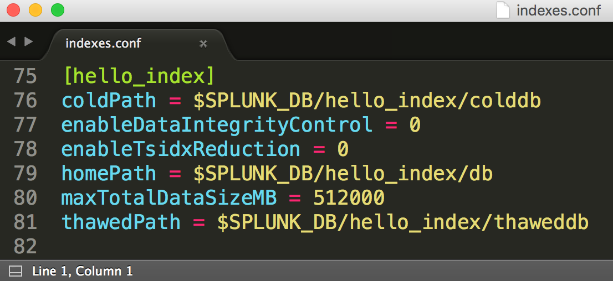

For more about these files, see default.meta.conf and indexes.conf in the Admin Manual.

Because these configurations are stored outside of your app, you don't need to remove them before you package your app or send it to the App Certification process. The data we uploaded is stored in this index. When you're done with this tutorial, you can delete the index to remove the sample data from your Splunk instance. You can also restrict searches to this specific index using the "index=hello_world" search command to speed up searches. However, your app won't work if this index isn't present. Carefully consider the tradeoffs when restricting your app to a specific index.

## Report On Data

Now that you've added data to your app, let's explore the types of searches and reports that you can run. Searches are your main tool for exploring your data in using Splunk Enterprise. For more about search, see Get started with Search in the Search Manual.

1. Navigate back to your app's home page by clicking the Splunk logo in the upper left of the browser window, then click the tile for your app from the list on the left.
  The default home page is the apps's Search page.

2. In the Search box, enter `"index=your index name | timechart count(to) by mailer"`, replacing `your index name` with the index you created in Add data. Leave the time span to the right of the search box set to All time.
  This step creates a hard dependency on the existence of your index. To learn how to avoid doing this, see Use macros to avoid index dependency.
  You should see results that look like this:
  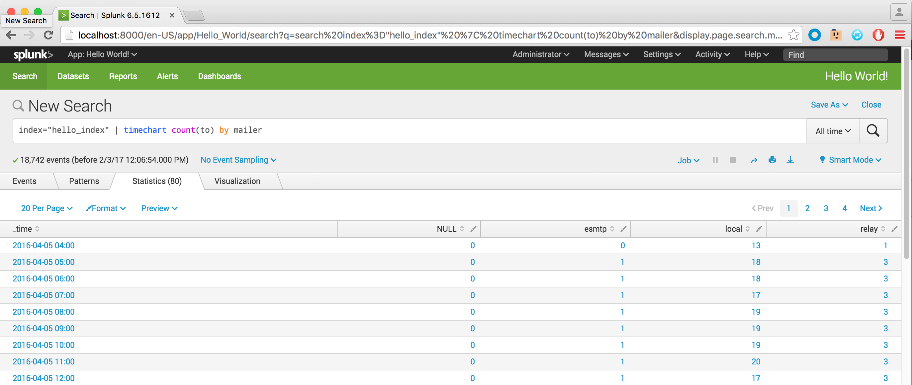
3. Save this search as a report by clicking Save As, then selecting Report.
4. For Title, enter "Top recipients by mailer" and optionally add a description.
5. Click Save, then click Continue Editing.

### Report on data Recap

We'll use this search in a dashboard later, but first let's take a look at how Splunk Enterprise saved the search as a report, also known as a saved search.

By default, the search is saved with private permission. Private objects are stored to a location outside of apps in Splunk Enterprise. Let's take a look at where the search ended up and see how we can move it back inside of our app.

Private objects are stored in `$SPLUNK_HOME/etc/users/your_username/your_app/local`. This folder contains all objects marked as private, including the ui-prefs.conf configuration file that contains customizations about the display of apps, and savedsearches.conf with the configuration settings for the report you saved.
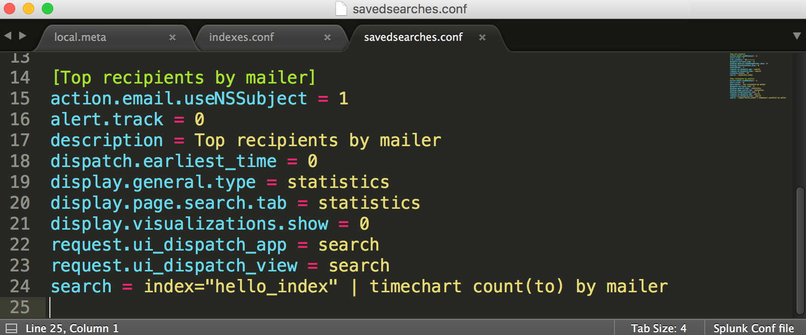

For more, see [ui-prefs.conf](https://docs.splunk.com/Documentation/Splunk/latest/Admin/Ui-prefsconf) and [savedsearches.conf](http://docs.splunk.com/Documentation/Splunk/latest/Admin/savedsearchesconf) in the Admin Manual.

### Change the scope of the report

In its current location, this search is available only to our current user, which causes problems when you want to distribute your app. Let's move it back into the app.

1. Return to Splunk Web and click the Reports tab in the navigation bar.
   You should see your report along with any other reports for other apps installed on your Splunk Enterprise instance.
2. Click This App's to view only the reports associated with your app.
  The Sharing setting for the report you saved earlier is set to Private, which corresponds to its current location in the app's directory for the current user.
3. Click Edit, then click Edit Permissions.
4. Change Display For to App.
  Changing this setting moves the stanza defined in the savedsearches.conf file for the report into one of the savessearches.conf files located in your app. You can also make these changes to the configuration files manually.
5. Click Save to apply your changes.

Now, when you open the `$SPLUNK_HOME/etc/apps/your_app/local` folder, you'll see that a savedsearches.conf file has been added. If you plan to include this report with the app you distribute to users, be sure to migrate the savedsearches.conf file to the /default directory before deployment. Also, look in `$SPLUNK_HOME/etc/users/your_username/your_app/local/savedsearches.conf`, and notice that the stanza defining your saved search has been removed.

## Visualize Data

Now that we've got some data and a report, let's add a dashboard with a visualization to our app.

1. From the app in Splunk Web, click the Reports tab.
2. Next to the report you created earlier, click Open in Search.
3. Above the search bar, click Save As, then select Dashboard Panel.
4. In the Save As Dashboard Panel dialog box, select the following options:
    - Next to Dashboard click New. We'll create a new dashboard because we don't have any writeable dashboards to add our report to. The dashboards that your app already has, such as Search, are default dashboards that are not writeable.
    - For Dashboard Permissions click Shared to App. Private dashboards are saved to the user's local app's /local directory. Dashboards that are shared to the app are saved to the app's /local directory.
    - For Dashboard Title, provide a title.
    - Optionally, provide a description and panel title.
    - For Panel Powered By, click Inline Search so that you can edit the search directly from the dashboard. If you select Report, your dashboard references the saved search.
    If you your report is set to run on a schedule, this panel takes the most recent results of the scheduled run if available rather than running the report again. For more about scheduled reports, see Schedule reports in the Reporting Manual. For more the types of searches that can power dashboards, see Searches power dashboards and forms in the Dashboards and Visualizations manual.
5. Click Save, then click View Dashboard.
    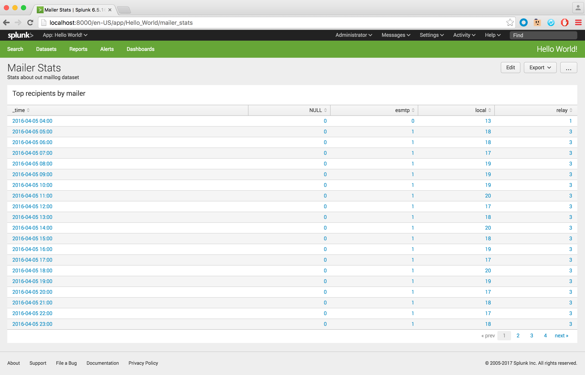

### Visualize data Recap

Let's take a look at your dashboard. Look at your app's /local folder and noticed that it now has a /data/ui/views subfolder with a new .xml file matching the name of the dashboard you just created.

Dashboards are by default defined using Simple XML. For more, see [Simple XML Reference](http://dev.splunk.com/docs.splunk.com/Documentation/Splunk/latest/Viz/PanelreferenceforSimplifiedXML) in the Dashboards and Visualizations manual.

The label and description fields define the title and description text displayed in the upper left corner of the dashboard:
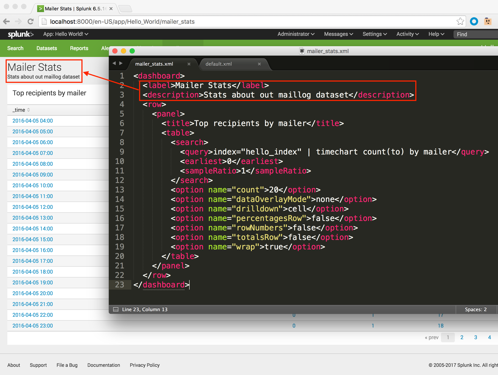

Simple XML uses row and panel objects to organize content on dashboards. This example has only a single row, but you can add any number of rows to a dashboard. Each panel can also have a title attribute that appears at the top of the panel.
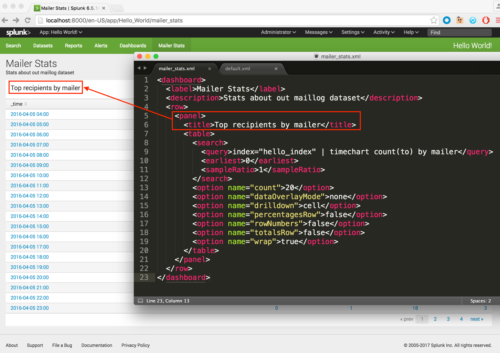

In this dashboard, we're using a table visualization that displays a set of search results. The table object can embed a search inline or reference a saved report. In this case, the object is an embedded copy of the report we created earlier.
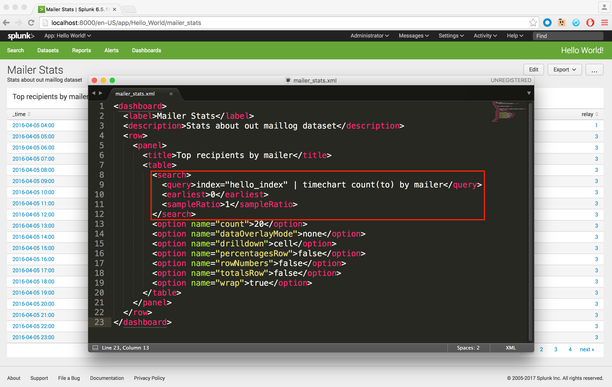

The table also includes a set of attributes describing how to display data, including options to display 20 results per page and to control how drilldown works.
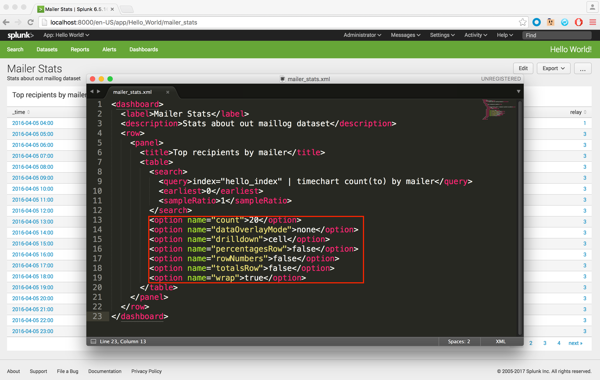

Drilldown is a powerful option that allows you to control how users navigate panels in your app. For more, see [Use drilldown for dashboard interactivity](http://docs.splunk.com/Documentation/Splunk/latest/Viz/DrilldownIntro) in the Dashboards and Visualizations manual.

For a list of the different built-in visualizations, see [Visualization reference](http://docs.splunk.com/Documentation/Splunk/latest/Viz/Visualizationreference) in the Dashboards and Visualizations manual.

To find out how to create your own custom visualizations, see Tutorial: [Create a custom Splunk view](http://dev.splunk.com/view/SP-CAAAEQ8).

## Change Navigation

Now that your app has a dashboard, you can set your app to display it when users first load your app rather than displaying the default Search dashboard. To do this, we'll modify the navigation file.

1. In a text editor, open `$SPLUNK_HOME/etc/apps/your_app/default/data/ui/nav/default.xml`.
2. Add the following line at the end of the `<nav>` block, replacing the value of "name" with your dashboard's name:
    ```xml
    <view name='your_dashboard_name_no_caps_or_spaces' default='true'/>
    ```
3. From line 2 of the file, remove:
    ```properties
    default='true'
    ```

Your default.xml file should now look like this:

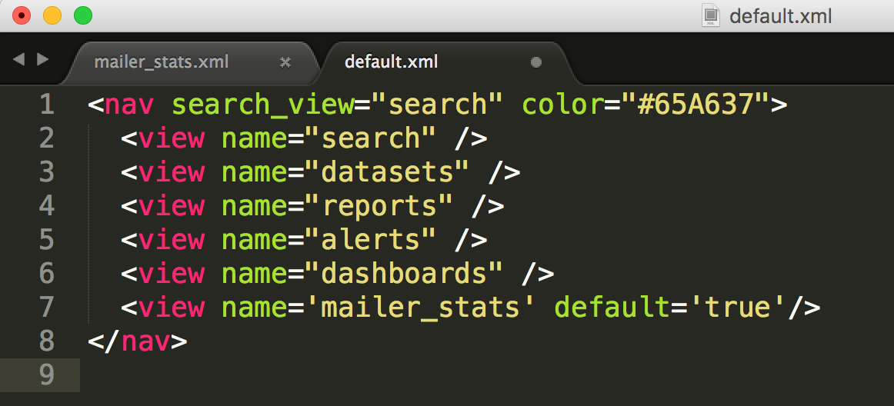

If you refresh Splunk Web, you'll notice that the navigation has not changed because navigation changes require you to either restart Splunk Enterprise or force a refresh of the Splunk Web UI. To get your new navigation to show up, do one of the following.

### Restart Splunk Enterprise

1. In Splunk Web, click Settings, then Server Controls, then Restart Splunk.
2. When you log back in, navigate to your app. The navigation will be updated and your dashboard will be open by default.

### Force a refresh of Splunk Web UI

Do one of the following:

- Navigate to <http://localhost:8000/en-US/_bump>, click Bump version to flush the client cache. If you make changes to client-side JavaScript, CSS, or static resources, this command forces those assets to be updated.
- Navigate to <http://localhost:8000/en-US/debug/refresh>, click Refresh to refresh almost all Splunk Enterprise knowledge objects. To refresh only views, navigation, or saved searches, you could append ?entity=data/ui/views, ?entity=data/ui/nav, or ?entity=saved/searches to the end of the URL.
  > **Note**  In these URLs, "8000" refers to the default port. "en-US" refers to your language and region. You might need to adjust these values according to your own port and region.

  For more about caching, see About file precedence and caching.

When you reload the page, you should now see your new dashboard's name in the navigation bar. Whichever method you chose, your dashboard should now look like this:

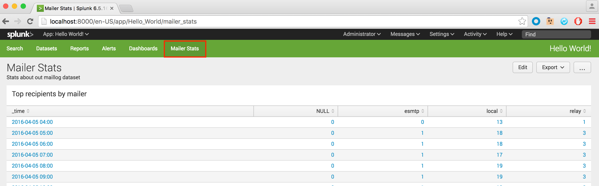

To find out more about customizing your app's navigation, see [Add navigation to a Splunk app](http://dev.splunk.com/view/SP-CAAAEP9).

## Set $SPLUNK_HOME

The SPLUNK_HOME environment variable specifies where your instance of Splunk is installed. Setting this variable makes it easier to navigate to Splunk's installation directory in a terminal or command prompt. Some apps rely on this variable. The Splunk documentation refers to this location in file paths as `$SPLUNK_HOME`.

Splunk Enterprise may set this variable during the installation process. For instance, the DMG installer for Mac OS X sets this variable. This topic describes how to check if SPLUNK_HOME is set, and how to set it if needed.

### Determine whether the SPLUNK_HOME environment variable is set

On *nix:

1. Open a terminal window.
2. Enter the following command:
    ```bash
    echo $SPLUNK_HOME
    ```
    If you see "/Applications/Splunk" or similar, SPLUNK_HOME has been set.

On Windows:

1. Open a command prompt.
2. Enter the following command:
    ```bash
    echo %$SPLUNK_HOME%
    ```
    If you see "C:\Program Files\Splunk" or similar, SPLUNK_HOME has been set.

### Set the SPLUNK_HOME environment variable

The value of SPLUNK_HOME should be the directory of your Splunk installation.

On *nix:

1. In a terminal window, enter the following command:
    ```bash
    touch .profile
    ```
2. Exit the terminal window.
3. In a new terminal window, enter the following command:
    ```bash
    echo export $SPLUNK_HOME=your_Splunk_directory >> .profile
    ```
    For example, to target the default install location, the command would be:
    ```bash
    export $SPLUNK_HOME=/Applications/Splunk
    ```
4. Close the terminal window.
5. To test that this procedure worked, enter the following command in a new terminal window:
    ```bash
    echo $SPLUNK_HOME
    ```
    The echo should return the Splunk directory you entered.

On Windows:

1. In a command window, enter the following command:
    ```bash
    setx $SPLUNK_HOME your_Splunk_directory
    ```
    For example, to target the default install location, the command would be:
    ```bash
    setx $SPLUNK_HOME "C:\Program Files\Splunk"
    ```
2. Close the command window.
3. To test that this procedure worked, enter the following command in a new command window:
    ```bash
    echo %$SPLUNK_HOME%
    ```
    The echo should return the Splunk directory you entered.

## Your First AppInspect

When developing an app, consider whether you want to have it Splunk Certified. When Splunk certifies an app, other users know that the app meets Splunk's rigorous certification criteria. Your app will also be featured more prominently in search results on Splunkbase and you will receive sales leads for who has downloaded your app. This information can be valuable for developers trying to grow a business with Splunk.

However, the app we have created for this tutorial doesn't meet Splunk's app certification criteria. To find the issues we'll use Splunk AppInspect, which is a tool to check for problems that prevent your app from being certified. You can run AppInspect locally on your computer or through a web service. For details, see the [Splunk AppInspect documentation](https://dev.splunk.com/goto/appinspect).

Let's walk through how to use AppInspect to find errors in your app.

1. Install AppInspect. For details, see Install Splunk AppInspect.
    This tutorial uses version 1.4.1.88. If you aren't sure which version of AppInspect you installed, open a command prompt and run the following command:
    ```bash
    splunk-appinspect list version
    ```
2. At a command prompt, run AppInspect on your app. You'll need to specify the app's folder or the package file (.tar.gz). When you run AppInspect on the app's folder, as we'll do in this example, you might see errors related to files that you should remove during packaging, such as .DS_Store or .gitignore files. Remove these files before you submit your app to Splunkbase for publishing.
    Enter the following command, replacing the path to your app:
    ```bash
    splunk-appinspect inspect path_to_your_splunk_app --included-tags splunk_appinspect
    ```
    This command runs a set of basic AppInspect checks, which are the same checks that the Splunk App Certification team runs as the first step when you request certification for your app. For a full list of AppInspect commands, see [Use the AppInspect CLI tool](http://dev.splunk.com/view/appinspect/SP-CAAAFAM).

    AppInspect reports several issues for your app as shown below:
    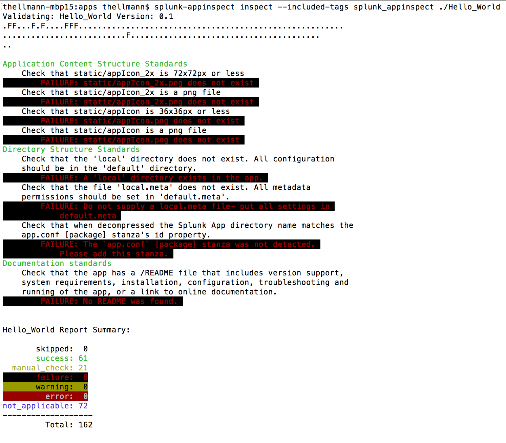

    Let's walk through how you can fix the issues AppInspect is reporting as failures.

    - The app is missing a README file in its base directory. AppInspect asks you to include information about support, system requirements, installation, configuration, troubleshooting, and using the app. Or, include a link to online documentation.
    To fix this issue, add a README file to your app.
    - Because we're running AppInspect on an app's directory rather than a packaged file, AppInspect expects a [package] stanza in the app configuration file in /default/app.conf. The [package] stanza is required for the Splunk Packaging Toolkit to recognize your app. For details, see the [Splunk Packaging Toolkit documentation](http://dev.splunk.com/view/packaging-toolkit/SP-CAAAE9V).
    To fix this issue, add the following stanza to that file:
    ```properties
    [package]
    id=app_name
    ```
    - The app has meta settings in the `/metadata/local.meta` file.
    To fix this issue, copy these settings to `/metadata/default.meta`, then delete `/metadata/local.meta`.

    > **Note**  If you already followed the steps in [Use macros to avoid index dependency](http://dev.splunk.com/view/quickstart/SP-CAAAFDK), migrate the [macros/default_index] stanza from the local.meta file to the default.meta file before you delete local.meta.

    - AppInspect requires the /local folder to be deleted.
    To fix this issue, migrate any settings you want to preserve from /local to /default, then delete the /local folder.

    For example, copy the modified app version number from your /local/app.conf to /default/app.conf, which should look like this now:

    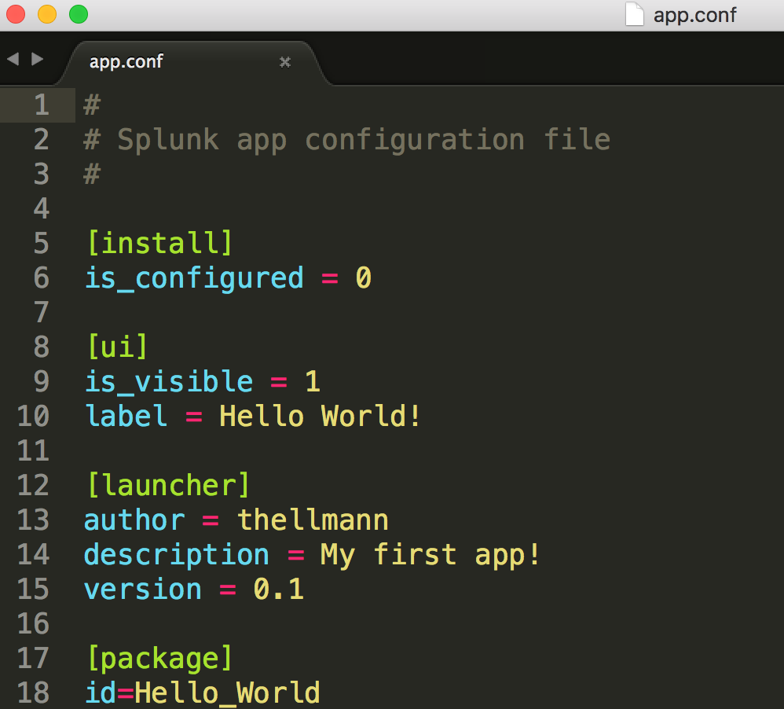

    - The remaining issues are related to the requirement for apps to have icon files in the app's /static folder (a 36x36 pixel file named appIcon.png, and a 72x72 pixel file named appIcon_2x.png).
    To fix this issue, add these icon files to your app's /static folder. For details and for example images, see Add icons to your app.

3. Run AppInspect again to verify that these issues have been resolved.
    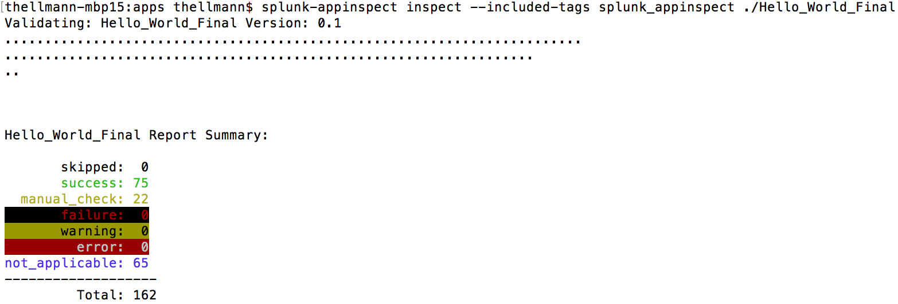

## Use Macros To Avoid Index Dependency

In Report on data in this tutorial, the search you used in your dashboard referenced a specific index. However, as a recommended practice, you shouldn't include index definitions with your app. You could remove the specific index from your search, but then you'll have to include "index=*" in your searches instead. If your users want to restrict your app to searching in a specific index, they'll need to modify every search.

To work around this issue, you can use a macro that includes a default index to search, helping administrators to configure your app. For development, you can also set up a local version of the macro to reference your development index.

For more about macros, see [Use search macros in searches](http://docs.splunk.com/Documentation/Splunk/latest/Knowledge/Usesearchmacros) in the Knowledge Manager Manual.

For a general description of using macros to avoid dependency on indexes, see App Design Patterns - Creating Indexes on Splunk Blogs.

Let's start out by creating a macro. In this macro, you'll specify an index that your app should look in for sendmail_syslog events.

1. In Splunk Web, click Settings, then click Advanced search.
2. Next to Search macros click Add new.
3. Under Destination app make sure your app is selected.
4. Under Name provide a name for your macro.
5. Under Definition enter:
    ```properties
    index=hello_index
    ```
    Your macro definition should look something like this:
    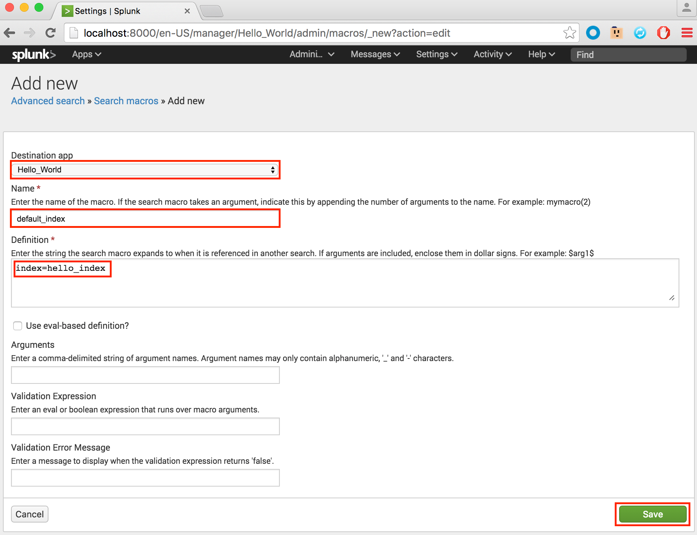
6. Click Save to create your macro.
    As with searches, macros are saved to your local user's app's /local folder. Let's move it back into the app by changing its sharing permissions:
7. Click Permissions next to your macro.
8. Under Object should appear in select This app only.
9. Click Save to update permissions.
10. Return to your app by clicking the Apps menu in the upper left corner of the window and selecting your app.
    We need to edit the inline search in your app that is powering your dashboard to use your new macro. We'll also make the search a little more specific.
11. On your dashboard, click Edit to open the edit view of your dashboard.
    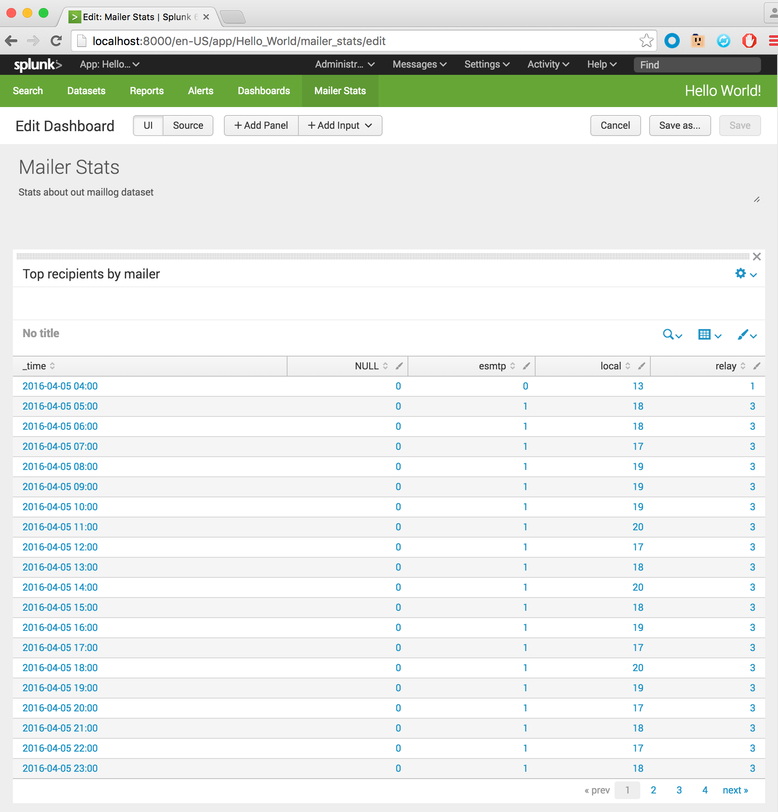
    > **Tip** : You can also open edit view by appending "/edit" to your dashboard's URL.
12. Next to Edit Dashboard, click Source to display the Simple XML view of your dashboard.
13. In the \<query\> tag, replace "index=<your_index_name>" with:
    ```sql
    `default_index` sourcetype=sendmail_syslog
    ```
    > Note  This line contains backticks (`), not single quotes (').

    This statement specifies the sourcetype to select only the data that your app is designed to handle. Right now, your app uses the index you created and has so far indexed only sendmail_syslog events. In the future, you can't be certain which index your app will be set up to target or what other events will be included in that index, so you should specify the sourcetype you expect.

14. Click Save to save these changes.

When you return to your dashboard, it should look the same as before.

Now, your app's searches will use the default_index macro to specify the index in which to find events. If your app grew to include a large number of searches, you could easily change the target index for all of them just by changing the default_index macro.

Next, let's take a look at how your app's structure was affected:

1. In a text editor, open `$SPLUNK_HOME/etc/apps/your_app_name/metadata/local.meta`.
    Splunk Web has added a stanza to define permissions for the default_index macro:
    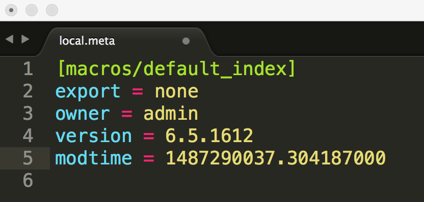
    Because this macro is only shared within this app, export is set to none.
    > Note  If you previously deleted local.meta by following the steps in Your first AppInspect, the file will have been recreated.
2. In a text editor, open $SPLUNK_HOME/etc/apps/your_app_name/local/macros.conf.
    Splunk Web has added a stanza defining your default_index macro:
    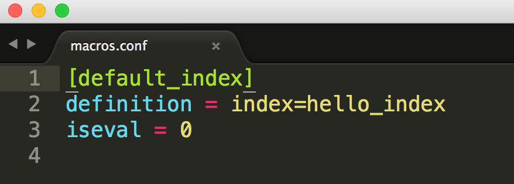
    This addition is a good start for the local version of macros.conf because your index is the one you are using for development purposes. However, if you want to help the administrators who will be installing and configuring your app, add a macros.conf file to the /default directory for them to edit.
3. Copy the macros.conf file from `$SPLUNK_HOME/etc/apps/your_app_name/local` folder to the `$SPLUNK_HOME/etc/apps/your_app_name/default` folder.
4. In a text editor, open $SPLUNK_HOME/etc/apps/your_app_name/default/macros.conf.
5. Replace "index=hello_index" with "".
    If you do not specify an index for searches, the default index is used, which is typically "main". Because the "main" index probably doesn't have any events matching sourcetype=sendmail_syslog, you won't see any results after you remove your local version of macros.conf. For end users of your apps, using this setup results in your app searching their default index, which is a reasonable approach.
6. Add a comment letting future admins know to add their index specification to this file:
    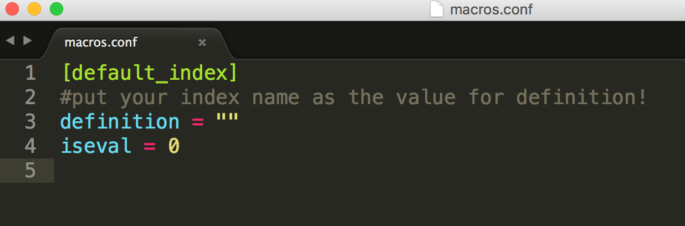
    Because you won't package local files when you distribute your app, if you were to upload your app to Splunkbase and someone were to install it, your app would search the user's default index by default until an administrator edits the macros.conf file.