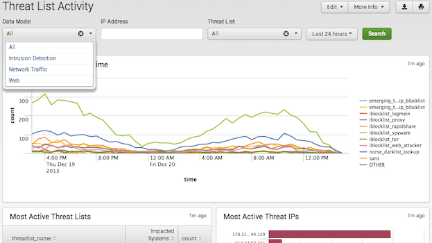

# Splunk 앱 및 애드온 개요

- Splunk 앱 정보
- Splunk 앱이란 무엇입니까?
- Splunk 애드온이란 무엇입니까?
- 누군가 Splunk 앱을 사용하고자하는 이유는 무엇입니까?

## Splunk 앱 정보

Splunk Enterprise 및 Splunk Cloud의 응용 프로그램을 사용하면 조직 및 사용자가 데이터와보다 쉽게 ​​상호 작용할 수 있습니다. 응용 프로그램은 실시간 데이터 분석, 보안 및 모니터링과 같은 특정 유형의 작업을 처리 한 다음 데이터를보다 쉽게 ​​해석 할 수 있도록 여러 시각화를 사용하여 데이터를 표시하도록 설계되었습니다. 조직 내의 Splunk 사용자를 위해 다양한 방법으로 앱을 만들 수 있으며, 다른 Splunk 사용자와 공유하거나 다른 Splunk 사용자에게 판매 할 수 있습니다.

## Splunk 앱이란?

Splunk 응용 프로그램은 Splunk Enterprise 또는 Splunk Cloud를보다 효과적으로 사용할 수 있도록 특정 기술 또는 사용 사례 용으로 패키징 된 지식 개체 및 확장 모음입니다. Splunk 응용 프로그램에는 대시 보드, 보고서, 사용자 정의 검색 명령, 모듈 식 입력, 필드 추출 정의, 데이터 조회, 탐색 메뉴, 사용자 지정 경고 작업, 사용자 지정 코드 파일 등이 포함 된 사용자 지정 UI와 같은 요소가 포함될 수 있습니다. Splunk 응용 프로그램은 Splunk Web에서 실행되며 홈 페이지 또는 응용 프로그램 메뉴에서 액세스 할 수 있습니다.

! [Splunk Web apps](./images/SWF_SplunkHome.jpg)

Splunk 앱의이 정의를 확장하려면 다음을 수행하십시오.

- Splunk 앱은 특정 사용자에 대한 특정 문제를 해결하는 패키지 솔루션입니다.
- Splunk 앱은 종종 특정 유형의 역할을 대상으로 역할별로 읽기 / 쓰기 액세스를 제한합니다. 따라서 동일한 Splunk Enterprise 또는 Splunk Cloud 인스턴스의 서로 다른 사용자는 자신의 관심사와 관련된 데이터 만 볼 수 있습니다.
- Splunk 앱에는 양식 및 시각화가 포함 된 하나 이상의 대시 보드가 포함되어 있습니다.
- Splunk 응용 프로그램은 스크립트 된 입력 또는 모듈 식 입력을 사용하는 것과 다른 데이터 소스에서와 같이 다양한 방식으로 Splunk에 데이터를 가져 오는 것을 처리 할 수 ​​있습니다.
- Splunk의 동일한 인스턴스에서 여러 앱을 동시에 실행할 수 있습니다.

다음은 다양한 사용자와 역할을위한 Splunk 앱의 예입니다.

- Microsoft Exchange 용 Splunk 앱은 Exchange 관리자 용입니다. 이 응용 프로그램은 Microsoft Exchange 및 기본 인프라의 모든 측면에서 성능 메트릭, 로그 파일 및 PowerShell 데이터를 수집합니다.
- Splunk Enterprise Security은 보안 전문가를위한 것입니다. 이 앱은 엄청난 양의 활동 데이터를 분석하여 위협을 찾습니다.
- VMware 용 Splunk App은 시스템 관리자 용입니다. 이 앱은 성능 및 용량 병목 현상을 사전에 파악하여 환경의 상태를 정확하게 실시간으로 보여줍니다.
- NetApp Data ONTAP 용 Splunk App은 스토리지 관리자 용입니다. 이 응용 프로그램을 사용하면 모든 NetApp Data ONTAP 스토리지 시스템의 구성, 로그 및 성능을 시각화 할 수 있습니다.
- S.O.S - Splunk on Splunk 앱은 Splunk 문제를 해결하려는 모든 사용자를위한 프로그램입니다. 이 앱을 사용하면 Splunk 환경의 문제를 분석하고 해결할 수 있습니다.

## Splunk 애드온이란 무엇입니까?

기술적으로 Splunk 애드온은 Splunk 응용 프로그램입니다. 실제로 Splunk 애드온은 전체 UI를 포함하지 않는 Splunk 응용 프로그램을 말하며 일반적으로 사용자 정의 구성이나 데이터 입력을 제공합니다. 또한 UI가 없으면 Splunk 웹 홈페이지 또는 Splunk App 메뉴에서 추가 기능을 사용할 수 없으며 전용 URL이 없습니다.

하나의 애드온을 여러 애플 리케이션, 스위트 또는 솔루션에서 사용할 수 있습니다. 따라서 추가 기능의 모든 개체는 전역 적으로 액세스 할 수 있도록 전역 적으로 사용할 수 있어야합니다. 자세한 내용은 관리 설명서의 응용 프로그램 아키텍처 및 객체 소유권을 참조하십시오.

Splunk 애드온 빌더는 Splunk 배치를위한 기술 애드온을 작성하고 검증하는 데 도움이되는 Splunk 응용 프로그램입니다. 자세한 내용은 Splunk 애드온 빌더 사용자 가이드를 참조하십시오.

왜 누군가가 Splunk 앱을 사용하길 원했을까요?

Splunk 앱은 여러 가지 이유로 유용합니다.

- 앱은 역할별로 깊은 통찰력을 제공합니다 (예 : Exchange 관리자, 시스템 관리자, 저장소 관리자 등).
- 앱은 한 곳에서 모든 서버 및 네트워크 장치에 대한 즉각적인 가시성 및 분석을 제공합니다.
- 앱은 비즈니스 성장으로 인해 사용량을 예측, 계획 및 모니터링합니다.
- 앱은 보안 상태를 개선하고 사건 조사 속도를 높이며 규정 준수 요구 사항을 충족시킵니다.
- 앱이 도구를 통합합니다 (여러 모니터링 도구가 더 이상 필요하지 않음).
- 응용 프로그램은 개발 및 프로덕션 응용 프로그램을 모니터링하고 문제를 해결하는 데 도움을줍니다.

## 다음 단계

Splunk 플랫폼 용 애플리케이션을 개발할 준비가 되셨습니까? 기본 응용 프로그램을 만들고 구성하는 방법을 보여주는 연습을 위해 퀵 스타트 (Quick Start)로 들어가보십시오.

그런 다음 방법에 대해 자세히 알아보십시오.

앱 또는 부가 기능 개발
앱 또는 부가 기능 출시
Splunk 플랫폼과 통합
프리미엄 기능 확장