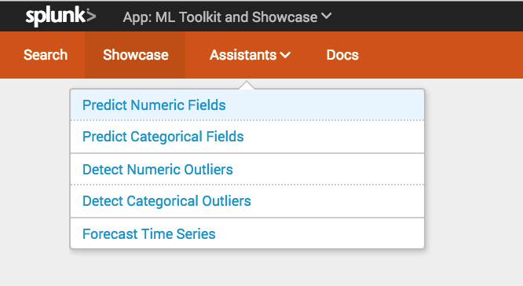

# Develop an app or add-on

- Create an app
- Create an add-on
- Create dashboards and visualizations
- Add navigation
- Manage state
- Add app supportability
- Add licensing requirements
- Create a setup page
- Create custom search commands
- Tips

## Create an app

Create an app using Splunk Web, then configure the properties, data inputs, knowledge objects, permissions, and alerts for the app.

> Learn more about creating Splunk apps

### Overview of creating an app

To get started developing an app or add-on for Splunk Enterprise or Splunk Cloud, you'll need:

- A Splunk Enterprise test environment.
  Use an installation of Splunk Enterprise on a single-instance development environment, such as a laptop. For more about supported computing environments, see [System requirements for use of Splunk Enterprise on-premises](http://docs.splunk.com/Documentation/Splunk/latest/Installation/Systemrequirements) in the Installation Manual.
- Development tools.
  Splunk Web has a built-in source code editor with syntax highlighting and auto-indent features, or use your own editor for XML, CSS, and HTML files. You can also use debugging tools that are included with web browsers.
- A plan for your app.
  Determine the scope of your app and decide on the use case you want to address. Storyboard your app and create mockups of the dashboards, panels, and navigation.
- Sample data.
  Decide what data you want to work with and how you're going to import it. Get some sample data to test your app.

The basic process for developing a Splunk app is as follows:

1. Create an app using Splunk Web. See [Create a Splunk app](http://dev.splunk.com/view/SP-CAAAEUC) for details.
2. Configure app properties, such as the app configuration settings and static assets. See [Configure app properties](http://dev.splunk.com/view/SP-CAAAE86) for details.
3. Get data into Splunk using data inputs, indexes, and modular inputs. See Configure the data layer for details.
4. Search your data using the Splunk search language and optimize your searches (filter, limit scope, avoid real-time searches). For more, read the Search Manual.
5. Enrich the search with Splunk knowledge objects such as saved searches, event types, transactions, tags, field extractions, transforms, lookups, search commands, and data models. See Configure knowledge objects for details.
6. Set permissions for the objects in your app to specify what users can see (read) and interact with (write). See Set permissions for objects in a Splunk app for details.
7. Create alerts using both out-of-the-box alert actions, as well as custom alert actions to integrate with other systems. For more, read the Alerting Manual.

## Create an add-on

Use the Splunk Add-on Builder to create add-ons, configure data inputs, create a setup page, perform field extractions, and add CIM mapping using a UI. The Add-on Builder also validates your add-on against best practices and provides suggestions for fixing issues before you package your add-on for distribution.

> Learn more about the Splunk Add-on Builder

[Splunk Add-on Builder](http://dev.splunk.com/view/addon-builder/SP-CAAAE83)

## Create dashboards and visualizations

The Splunk Web Framework is the full stack that makes building a Splunk app looks and feel like building any modern web application. Developers can build an application with custom dashboards, charts, form searches, and other functionality using Simple XML, HTML, and JavaScript.

> Learn more about the Splunk Web Framework

[Splunk Web Framework](http://dev.splunk.com/webframework)

## Add navigation

Add navigation to your app to specify how users will access the dashboards, reports, data models, and alerts in your app. Build navigation for your app so users can access the dashboards, reports, and other features of your app.

> Learn how to add navigation

### Add navigation to a Splunk app

Add navigation to your app by modifying the app bar to specify how users will access the dashboards, reports, data models, and alerts in your app. Here's an example of an app bar for a Splunk app:


This navigation structure is defined in an XML file, default.xml, which is located in `$SPLUNK_HOME/etc/apps/your_app_name/default/data/ui/nav/`, which is created automatically when you create an app.

This is the XML structure for the default app bar:

```xml
<nav search_view="search" color="#65A637">
    <view name="search" default="true" />
    <view name="data_models" />
    <view name="reports" />
    <view name="alerts" />
    <view name="dashboards" />
</nav>
```

#### Modify the app bar

Edit the default.xml file to modify the app bar. You can edit the source file directly using your own text editor, or use the Splunk software's Source Editor (in Splunk Web, go to `Settings > User Interface`, click Navigation menus, then click default for your app).

To view your changes, restart Splunk Web or refresh the page by opening the <http://localhost:port/debug/refresh> URL in your web browser, click Refresh, then reload the page in the browser.

Here's an example of a Splunk app with a modified app bar:



You can modify the app bar by setting or adding the following features:

- Default search target and home page
- App bar color
- Dashboard links
- Report links
- External links
- Dynamic lists
- Saved searches list

#### Default search target and home page

To enable other apps to run a search query in your app, specify the target dashboard using the search_view tag. By default, "search" is the target dashboard.

To change the default home page for your app, use the default="true" property. When no view is marked as default, the first one listed in default.xml is used.

```xml
<nav search_view="search" color="#0072C6">
    <!-- Set "myhomedashboard" as the default page -->
    <view name="myhomedashboard" default="true" />
</nav>
```

#### App bar color

Set the color of the app bar in the nav element using the color property set to a hexadecimal value:

```xml
<nav search_view="search" color="#0072C6">
    . . .
</nav>
```

#### Dashboard links

Add links to dashboards on the app bar using the view tag. Add lists of links using the collection tag. Two levels of nesting are supported.

```xml
    <!-- Use the view tag to create a dashboard link -->
    <view name="dashboard1" />

    <!-- Use the collection tag to create a list of items -->
    <collection label="Menu name">

        <!-- Add items to the list -->
        <view name="dashboard2" />
        <view name="dashboard3" />

        <!-- Add a nested list with items -->
        <collection label="Submenu name">
            <view name="dashboard4" />
            <view name="dashboard5" />
        </collection>

    </collection>
```

#### Report links

Add links to reports on the app bar using the saved="report_name" tag:

```xml
    <!-- Use the saved tag to create a report link -->
    <saved name="report1" />
```

Specify the dashboard in which to display a report by adding the view="dashboard_name" property. Splunk Enterprise checks for a "view" property attached to the the report in the savedsearches.conf configuration file. If a value is not specified, the report is launched in the Search app's "timeline" view.

```xml
    <!-- Display the report in the "mycharts" dashboard -->
    <saved name="report1" view="mycharts" />
```

#### External links

Add external links to the app bar using the a tag:

```xml
    <!-- This is an external link -->
    <a href="http://dev.splunk.com/">Splunk Developer Portal</a>
```

#### Dynamic lists

Generate dynamic lists of all dashboards or all reports that are available to the app using the source="all" property:

```xml
    <!-- Dynamically list all available dashboards-->
    <collection label="All dashboards">
        <view source="all" />
    </collection>

    <!-- Dynamically list all available reports-->
    <collection label="All reports">
        <saved source="all" />
    </collection>
```

Generate a dynamic list of dashboards or reports that contain a substring by using the match="substring" property. This example displays a menu of all dashboards and a menu of all reports that include the word "error" in their name:

```xml
    <!-- Dynamically list all dashboards with the word "error"-->
    <collection label="Dashboards (errors)">
        <view source="all" match="error"/>
    </collection>

    <!-- Dynamically list all reports with the word "error"-->
    <collection label="Reports (errors)">
        <saved source="all" match="error"/>
    </collection>
```

Classified dashboards and reports are those that are explicitly referred to in default.xml using the name="name" property. All other dashboards and reports are unclassified.

Generate a dynamic list of all unclassified dashboards or reports using the source="unclassified" property. This example displays all dashboards except "dashboard1" and all reports except "report1":

```xml
    <view name="dashboard1" />
    <saved name="report1" />

    <!-- Dynamically list all unclassified dashboards -->
    <collection label="Others">
        <view source="unclassified" />
    </collection>

    <!-- Dynamically list all unclassified reports -->
    <collection label="Others">
        <saved source="unclassified" />
    </collection>
```

#### Saved searches list

By default, Splunk Enterprise limits the number of saved searches it lists in the Navigation drop-down menu of an app. The default limit is 500. If you expect your app to access more than 500 saved searches and you are using Splunk Enterprise 6.5.4 or later, consider adding an appNavReportsLimit attribute in the web.conf file to increase the number of saved searches the app lists in the Navigation drop-down menu. If you set the value of appNavReportsLimit higher than 500, you may incur a decrease in browser performance.

See the web.conf documentation for details and further context.

```properties
appNavReportsLimit = <integer>
* Maximum number of reports to fetch to populate the navigation drop-down menu of an app.
* An app must be configured to list reports in its navigation XML configuration before it can list any reports.
* Set to -1 to display all the available reports in the navigation menu.
* NOTE: Setting to either -1 or a value that is higher than the default might result in decreased browser performance due to listing large numbers of available reports in the drop-down menu.
* Defaults to 500.
```

## Manage state

The App Key Value Store (KV Store) feature of Splunk Enterprise provides a way to save and retrieve data within your Splunk apps, thereby enabling you to manage and maintain the state of the application.

> Learn more about the App Key Value Store

[App Key Value Store](http://dev.splunk.com/view/kvstore/SP-CAAAEY7)

## Add supportability

Provide additional data about the troubleshooting information that Splunk Diag collects from your app to support your customers, and use this information yourself for troubleshooting.

> Learn how to add app supportability

### Add app supportability

Customer Support uses diagnostic files, or diags, to help troubleshoot issues with apps and Splunk installations. Diags are typically gathered by system administrators using the Splunk Diag command-line tool. Splunk Diag collects configuration files, directory listings, system status, and similar information, and then outputs this to a a .tar.gz file, which can then be sent to Support or someone who can assist with troubleshooting.

As a Splunk app developer, you can provide additional data about the troubleshooting information that Splunk Diag collects from your app to support your customers, and use this information yourself if you want. For example, you could allow information from Splunk REST endpoints to be gathered to help troubleshoot your app. Or, you could run a program and collect its output.

#### Determining what Splunk Diag collects

Each app provides a certain amount of information to Splunk Diag by default, including the contents of the app directory.

Splunk Diag also attempts to limit the collection of sensitive data by masking password hashes and skipping files that might contain event data. App developers can assess what is collected by Splunk Diag, and modify the set of data that can be gathered for their apps.

The following command collects only the information that your app provides, along with the baseline of information about memory, storage, CPU availability, and so forth:

```bash
splunk diag --collect app:your_app_name
```

The Splunk Diag command-line tool also provides options to specify what to include or exclude from the diags based on file paths and file categories, further controlling what is gathered.

For more about using Splunk Diag and what is included in diags by default, see Generate a diag in the Splunk Enterprise Troubleshooting Manual.

#### Setting up your app for Splunk Diag output

To set up your app to modify the information that is included in Splunk Diag output, you must:

- Declare the diag extension in the app.conf configuration file.
- Implement data collection by creating a Python script.

#### Declare the diag extension

To declare the diag extension in your app:

1. In a text editor, open your app.conf configuration file, which is located in `$SPLUNK_HOME/etc/apps/appname/default by default`.
2. Add a new [diag] stanza with the extension_script setting, which specifies the name of your Python data collection script, as follows:
    ```propteties
    [diag]
    extension_script = your_script.py
    ```
    When specifying the script filename:
    - Do not specify a path. The script must be located in your app's /bin directory, and no other path is allowed.
    - Be sure to match the case. Although Mac and Windows have case-insensitive file systems, other environments such as Linux and Solaris are case sensitive.
3. By default, apps are limited to 100MB of data in a diag, which prevents the app from damaging customer and support workflows in case of unexpected app behavior. If you expect your app to provide much more or much less data in a diag, you can adjust the data limit using the data_limit setting, as follows:
    ```properties
    [diag]
    extension_script = your_script.py
    data_limit = 50MB
    ```
4. Save your changes.

#### Create the data collection script

The data collection Python script lets you specify additional data that is collected from your app for diags by default. Consider the following guidelines when creating your script:

- When choosing what to include, consider what a customer might consider to be sensitive information. Generally, customer event data should not be included, even in small amounts.
- Large amounts of data cause slow collection and logistical problems. Hundreds of megabytes of information for a single app is not good default behavior.
- Use the splunk diag command-line interface to let the user opt in to send more data when needed.
- The script should avoid stalling. A special interface is provided to gather REST endpoints with enforced timeouts.
- Ensure that errors are not hidden. Let exceptions go uncaught or log them.

Your Python module can include an optional setup() function, and must include a collect_diag_info() function, described below. You can also use the Python logging module functions in your script such as logging.warn() and logging.error(). By default, warning and errors are captured to the diag.log file inside the diag. However, the output from logging.debug() is only captured when you run the diag command with the --debug option.

##### setup()

This function is not required to explicitly accept all arguments. However, because the arguments are passed as keywords, the argument names you use must match these names.

```python
setup(parser=parser_obj, app_dir=path, callback=callback_obj, **kwargs)
```

Arguments

- parser: An optparse parser object. Short option strings are not supported. App-specific options are placed in their own visual group in the diag --help output.
  The primary method is parser.add_option(). For example:
    ```python
    parser.add_option('--my-option', help="This is my option")
    ```
- app_dir: An absolute path referencing the installed location of your app. Because apps can be stored in different locations within a Splunk installation, use this path to locate the files and directories used by your app.
- callback: A callback object with one method, will_need_rest(), which you call if your app gathers REST data. Calling the callback.will_need_rest() function triggers a Splunk login prompt.
- **kwargs: Required. A container to gracefully accept arguments. This argument accomodates future Splunk releases.

##### collect_diag_info()

This function is not required to explicitly accept all arguments. However, because the arguments are passed as keywords, the argument names you use must match these names.

```python
collect_diag_info(diag=diag_adding_obj, app_dir=path,
                  options=app_options, global_options=global_options, **kwargs)
```

Arguments

- diag: An object that adds data to the output and builds a .tar.gz file. This object provides the following ways to add data.
  To add a single file:
    ```python
    diag.add_file(filesystem_path, diag_path)
    ```
  To recursively add all contents inside a directory:
    ```python
    diag.add_dir(filesystem_path, diag_path)
    ```
  To add the contents of a Python string as a single file:
    ```python
    diag.add_string(a_string, diag_path)
    ```
  To add the output of a splunkd REST endpoint as a single file:
    ```python
    diag.add_rest_endpoint(endpoint, diag_path)
    ```
      - An extension using this method must call the callback.will_use_rest() function during setup.
      - The endpoint may include GET parameters, but should not include the host, port, or protocol. For example: "/services/fictional/endpoint?param1=val1&param2=val2".
  The data is stored in the diag in a path prefixed by diag-name/app_ext/your_app_name, followed by the provided diag_path. For example, the following command stores the file as diag-name/app_ext/your_app_name/text/myfile.txt:
    ```python
    diag.add_file(os.path.join(app_dir, "my_file.txt"), "text/myfile.txt")
    ```
- app_dir: An absolute path referencing the installed location of your app. Because apps can be stored in different locations within a Splunk installation, use this path to locate the files and directories used by your app.
- options: An optparse options object that contains any app-specific options that were declared when setup() was called.
- global_options: An optparse options object that contains global diag options. These options are provided in case the app wants to honor one of the general directives in an app-interpreted manner. For more about these options, run the diag --help command, or see the server.conf.spec file that is included with Splunk Enterprise.
- **kwargs: Required. A container to gracefully accept arguments. This argument accomodates future Splunk releases.

##### Script examples

The following example shows a very simple data collection script:

```python
def collect_diag_info(diag, **kwargs):
     diag.add_string("data", "filename.txt")
```

The following example shows a script that demonstrates the entire Splunk Diag interface:

```python
import os
import logging

# Use the **args pattern to ignore options we don't care about.
def setup(parser=None, callback=None, **kwargs):
    logging.debug("test_app's setup() was called!")

    # Create an option that shows up in diag --help.
    # This translates into --test_app:grom at the command line.
    # Because this app is called test_app, we can
    # use the value as options.gromvar below
    parser.add_option("--grom", dest="gromvar")

    # Declare that we're going to use REST later
    callback.will_need_rest()

# The options are out of order, as is possible for keyword invocation
def collect_diag_info(diag, options=None, global_options=None, app_dir=None, **kwargs):
    logging.debug("test_app's collect_diag_info() was called!")

    # Collect a file located in the app. In this case the script itself is added
    a_file = os.path.join(app_dir, 'bin', 'diag.py')

    # Rename the file, so that <app>/bin/diag.py appears in the diag as app_ext/<app>/waohoo.txt
    diag.add_file(a_file, 'waohoo.txt')

    # Collect a directory from the app
    a_dir = os.path.join(app_dir, 'whatever')
    diag.add_dir(a_dir, 'whatever')

    # Try the option we requested above
    if options.gromvar:
        logging.error("gromvar is %s!" % options.gromvar)

    # Collect some REST endpoint data
    diag.add_rest_endpoint("/services/server/info", "server_info.xml")
```

## Add licensing requirements

Add licensing requirements for an entire app or for specific functions within the app.

> Learn how to add licensing requirements

### Add licensing requirements to a Splunk app

You can add licensing requirements to apps that you develop for Splunk Enterprise and Splunk Cloud. You can create a license requirement for an entire app or for specific functions within the app.

You must generate app licenses from a template. Each template is assigned to an individual product and one or more versions of that product. The license templates contain customizable parameters so that you can provide a user experience specific to each product and version or versions.

Splunk uses a cloud-based licensing service for app license verification. Apps cannot be enabled without access to the app licensing service. A connection to the app licensing service needs to be maintained for apps to continue to run.

This topic contains the following sections:

- Splunk Application Licensing Service Overview
- Splunk License Validation
  - Configuring App Licensing for Splunk Enterprise
  - Automatic license validation
  - Developer-initiated license validation
- Enabling Disabled Apps
- App Licensing Logs
- User Messages
  - Viewing user messages
  - Core error messages use cases

#### Splunk Application Licensing Service Overview

To use a licensed app, Splunk Enterprise or Splunk Cloud must have consistent access to the Splunk Application Licensing Service. This access is required for installed licensed applications to function and remain enabled.

The Splunk Application Licensing Service receives app licensing requests from Splunk Enterprise and Splunk Cloud and responds over SSL to the requesting instance. All communications are provided over TCP port 443.

App licensing also provides API services that you can use to create products, access license templates, and generate licenses.

#### Splunk License Validation

To use license validation In Splunk Enterprise, you first need to enable it. Application developers can set license validation operations that use REST APIs internal to Splunk to happen automatically, and they can also specifically initiate license validation operations.

##### Configuring App Licensing for Splunk Enterprise

Splunk App Licensing is disabled by default. To enable the service, complete the following steps:

1. Find the app license stanza in the server.conf file.
2. Change the appLicenseHostPort value to match the following example. This change points the app license functionality to version 0.5 of the app licensing API.
    ```properties
    appLicenseServerPath = /splunklicensevalidation/0.5/api/licenses/validations
    ```
3. Change the disabled value from true to false. This change enables app licensing.
    ```properties
    disabled = false
    ```
4. Verify that the app license stanza now matches the following version:
    ```properties
    [applicense]
    appLicenseHostPort =  apps-api.splunk.com:443
    appLicenseServerPath = /splunklicensevalidation/0.5/api/licenses/validations
    caCertFile = $SPLUNK_HOME/etc/auth/appsLicenseCA.pem
    cipherSuite = TLSv1.2+HIGH:@STRENGTH
    sslVersions = tls1.2
    sslVerifyServerCert = true
    sslCommonNameToCheck = apps-api.splunk.com
    sslAltNameToCheck = apps-api.splunk.com
    disabled = false
    ```
5. Schedule a restart of the Splunk instances in which you made changes.

[Troubleshooting your configuration]

If you modify other portions of the app license stanza, your apps might not function correctly, or they might become disabled. If your app license stanza is configured incorrectly, then you can find an error message in the splunkd.log file. You can try to re-configure the stanza, or you can revert it to the following unedited version:

```properties
[applicense]
appLicenseHostPort =  apps-api.splunk.com:443
appLicenseServerPath = /splunklicensevalidation/api/licenses/validations
caCertFile = $SPLUNK_HOME/etc/auth/appsLicenseCA.pem
cipherSuite = TLSv1.2+HIGH:@STRENGTH
sslVersions = tls1.2
sslVerifyServerCert = true
sslCommonNameToCheck = apps-api.splunk.com
sslAltNameToCheck = apps-api.splunk.com
disabled = true
```

##### Automatic license validation

Automatic license validation in Splunk Enterprise and Splunk Cloud happens in the following situations:

- Anytime 24 hours has passed since the last validation.
- Whenever Splunk Enterprise restarts.
- When an admin initiates a REST API request to re-check the status of a license.
- When an admin enables a licensed app that was disabled because the license was no longer valid. See Disabled Apps for more information.

##### Developer-initiated license validation

App developers can initiate license validation checks in Splunk Enterprise and Splunk Cloud in the following situations, among others:

- When a user wants to access additional functionality within an app.
- Anytime an app developer needs to check the status and capabilities of a license on demand.
  
To check the status of a license, initiate a CURL request to the licensing service with the application ID:

```bash
curl  -k https://<Licensing service URI>/services/applicense/applicenses/<application ID>
```

On successful license validation, license service will return a JSON payload similar to the following example:

```json
{
"links": {
"_reload": "/services/applicense/applicenses/_reload", "_acl": "/services/applicense/applicenses/_acl"
},
"origin": "https://<Licensing service URI>/services/applicense/applicenses",
"updated": "2017-01-18T13:44:25-08:00",
"generator": {
"build": "45ce86991a0b7e52903683675b091502a3c3efc66", "version": "201612213"
},
"entry": [{
"name": "<Licensing service URI>",
"id": "https://<Licensing service URI>/services/applicense/applicenses/<application ID>", "updated": "2017-01-18T13:44:25-08:00",
"links": {
"alternate": "/services/applicense/applicenses/<application ID>",
"list": "/services/applicense/applicenses/<application ID>", "_reload": "/services/applicense/applicenses/<application ID>/_reload"
},
"author": "system",
"acl": {
"app": "",
"can_list": false,
"can_write": false,
"modifiable": false,
2
"owner": "system",
"perms": {
"read": ["*"],
"write": ["admin", "splunk-system-role"]
},
"removable": false,
"sharing": "system"
},
"content": {
"appId": " <Licensing service URI>",
"appLicenseId": "3581DECE-D4C5-4950-848B-6AB0E6FAC99E", "eai:acl": null,
"lastCheckTime": "Wed Jan 18 13:42:15 2017",
"licenseStatus": "outOfCompliance"
}
}],
"paging": {
"total": 1,
"perPage": 30,
"offset": 0
},
"messages": []
}
```

#### Enabling Disabled Apps

Licensed apps are disabled when their specific app license passes the expiration date and, if it exists, the grace period. Admins are warned before their apps are disabled due to expiration. License checks occur automatically when an admin re-enables a licensed app, but only if the app was disabled because the license was no longer valid.

Admins can complete the following steps to view their app license status and re-enable a disabled app:

1. Select Settings > Licensing.
2. Scan for the apps and associated license expiration date.
3. If an app is past its license expiration date, re-purchase or renew app license.
4. Re-enable the app by selecting Enable for that app under Apps > Manage Apps.

#### App Licensing Logs

You can access the logs for app licensing in the audit.log file and the splunkd.log file. The Audit log entries exist for each licensed app that is installed.

At minimum, an audit marker exists in the process-return-license code path that indicates if the license is in compliable, out of compliance, or in the grace period if one exists. The following scenarios are also associated with audit markers:

- Licensed apps do not have a URL to contact the licensing service.
- A transaction to the licensing service fails.

#### User Messages

App licensing uses the Splunk Enterprise and Splunk Cloud messaging framework. In the following scenarios, Splunk software generates a user message:

- An app license will expire soon
- An app license has expired
- The app licensing service is unavailable

##### Viewing user messages

Admins can complete the following steps to view the user messages:

- Select Messages in a Splunk installation.
- Select a message to read and acknowledge it.

After an admin has acknowledged a message, it does not reappear unless the status that the message is reporting changes. For example, if the message indicates a countdown until the app license expires and the app is disabled, the message appears again on the next day to display the modified countdown.

##### Core error messages use cases

The following core error messages are also available in the Splunk audit logs.

[Use Case 1: Expired license]

The following message displays in the UI and is written to the splunkd.log file after the licenses for an app expire and the grace period ends.

```properties
APP_LICENSE_EXPIRED__S
message = The following Application licenses have expired and have been disabled: %s.
action = Repurchase application license from Splunkbase.
severity = ERROR
```

[Use Case 2: License in grace period]

The following message displays after the licenses for an app expires, but before the grace period ends. At this time, the app remains enabled, and app developers can choose to take additional actions within the app.

```properties
APP_LICENSE_GRACE_PERIOD__S
message = The following Application licenses have expired but are running in a grace period: %s.
action = Repurchase application license from Splunkbase.
severity = WARN
```

[Use Case 3: No license detected]

The following message displays if the app is installed, but either no license is installed or the license is deleted from the Splunk installation.

```properties
APP_LICENSE_NOT_FOUND__S
message = The following Application licenses cannot be found and have been disabled: %s
action = Contact Splunk support if you believe there has been an error.
severity = ERROR
```

[Use Case 4: Connection to the license server disrupted due to .conf file change]

The following message displays if a license is installed for an app, but the connection to the license server is broken due to modification of .conf files. At this time, the app remains enabled, and app developers can choose to take additional actions within the app.

```properties
APP_LICENSE_SERVER_UNDEFINED__S
message = The appLicenseHostPort setting in server.conf is undefined. Unless the connection is restored, all licensed applications will be disabled in %s day(s).
severity = ERROR
```

[Use Case 5: Failure to connect to the license server]

The following message displays if the connection to the cloud licensing server has been severed locally or through the Internet. At this time, all apps remain enabled, and app developers can choose to take additional actions within the apps.

```properties
APP_LICENSE_SERVER_UNREACHABLE__S
message = The application license server cannot be reached. Unless the connection is restored, all licensed applications will be disabled in %s day(s).
severity = ERROR
```

[Use Case 6: Extended failure to connect to the license server]

The following message displays if the connection to the cloud licensing server has been severed locally or through the Internet for more than 30 days. All licensed apps are disabled.

```properties
APP_LICENSE_ALL_DISABLED
message = The application license server was unreachable for 30 days or more. All licensed applications have been disabled.
severity = ERROR
```

[Use Case 7: License Master not configured for Splunk App Licensing]

The following message displays in the splunkd.log file if you have not configured the connection to License Master to support Splunk App Licensing. The disabled flag in the app license stanza in the server.conf file is set to true.

```properties
APP_LICENSE_ALL_DISABLED
message = App license disabled by conf setting.
severity = INFO
```

## Create a setup page

If your app requires user input to be configured, add a setup page for users to fill out the first time they run the app.

> Learn how to create setup pages

[create setup pages](http://dev.splunk.com/view/setup-page/SP-CAAAE8U)

## Create custom search commands

Customize search commands to better meet your needs to perform custom processing or calculations. You can add a custom Python search script to Splunk Enterprise, or make calls directly to the Splunk REST API to build a search that runs recursively.

> Learn how to create custom search commands using the Splunk SDK for Python
[Splunk SDK for Python](http://dev.splunk.com/view/SP-CAAAEU2)
> Read about custom search commands in the Search Manual
[custom search commands](http://docs.splunk.com/Documentation/Splunk/latest/Search/Aboutcustomsearchcommands)

## Tips

> For help with search efficiency and dashboards, see tips for creating Splunk apps

### Tips for creating Splunk apps

#### Post-processing for dashboards

You can save search resources by creating a dashboard that feeds all downstream panels with one single search. Use this type of post-processing to enhance the user experience in apps and add-ons that include dashboards to minimize the number of searches that are required. However, do not use post-processing if the parent search is non-reporting, which can lead to incomplete results. For more, see Searches power dashboards and forms in the Dashboards and Visualizations manual.

#### Techniques for summarization and acceleration

Splunk Enterprise is capable of generating reports on massive amounts of data. However, the amount of time to prepare such reports is directly proportional to the number of events they summarize. Plainly put, a lot of time is needed to report on very large data sets. Splunk evaluates apps and add-ons for their ability to accommodate data sets of all sizes. For more, see Overview of summary-based search and pivot acceleration in the Knowledge Manager Manual.

Splunk Enterprise provides the following methods for creating data summaries:

- Report acceleration uses automatically-created summaries to speed up completion times for certain kinds of reports.
- Data model acceleration uses automatically-created summaries to speed up completion times for pivots.
- Summary indexing enables search and report acceleration by manually creating summary indexes that exist separately from the main indexes.

##### Dashboard and user interface

Apps that have large quantities of charts and reports are discouraged. Use your best judgment, but apps that have dashboards with more than 20 charts or reports will not pass certification. Use forms when appropriate to allow for more robust reports. For more, see Form examples in the Dashboards and Visualizations manual.

##### Search efficiency

Use the following tips to help maximize your search efficiency:

- Carefully consider your use of the sort, eventstats, and join search commands, as well as use of subsearches.
- Use the TERM() directive for IP addresses when possible. For more, see Use CASE() and TERM() to match phrases in the Search Manual.
- Use reasonable lookups, CSV files, external data sources, and KV store lookups. For more, see Configure external lookups and Configure KV Store lookups in the Knowledge Manager Manual.

##### Deprecated and removed features

Deprecated features are those features that are slated to be removed in a future version of Splunk Enterprise but still work and are supported in the current version of the software. Splunk discourages you from using deprecated features, and will provide a report of any deprecated features you have used in your app or add-on. In addition to deprecated features, do not use features that have been removed from the Splunk software.

To determine which features have been deprecated or removed, see the Splunk Enterprise Release Notes.

##### Splunk Enterprise 5.x

Do not use any features that are specific to Splunk Enterprise 5.x in your app or add-on. For more information about migrating from Splunk Enterprise 5.x to 6.x or later, see Migration issues in the Developing Views and Apps for Splunk Web manual.