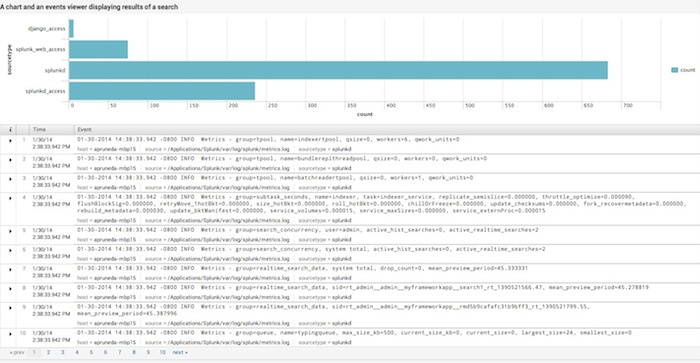
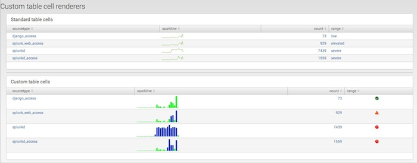
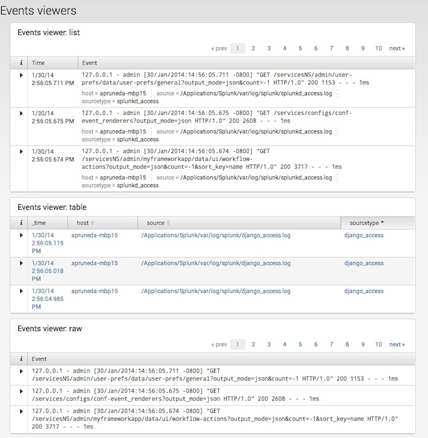
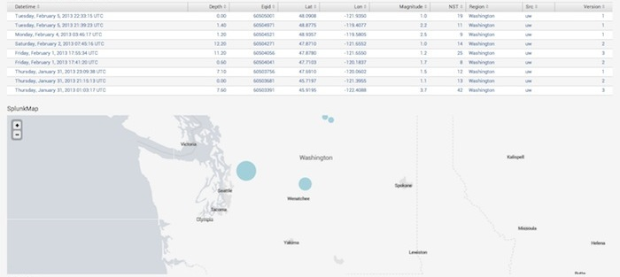
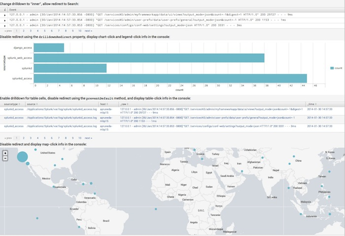
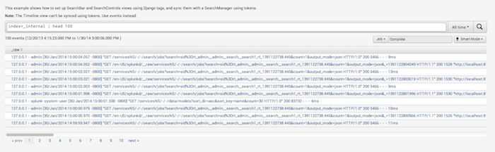
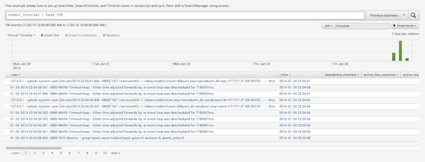
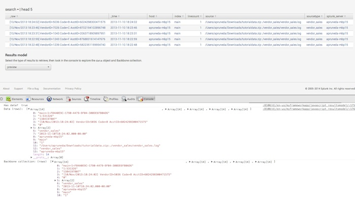
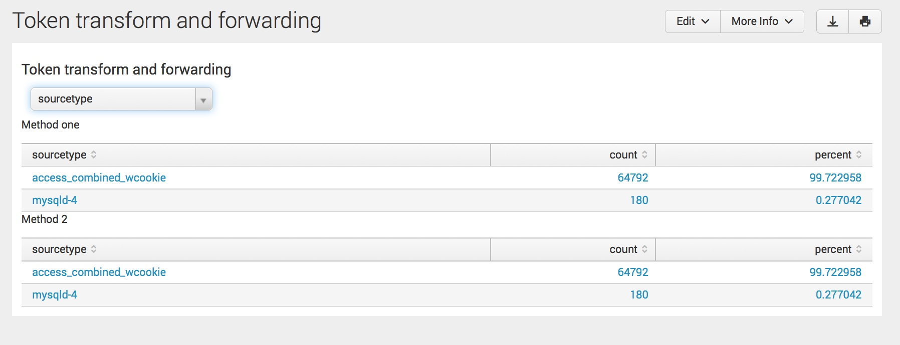

# WebFramework Example Code

<http://dev.splunk.com/view/SP-CAAAEU7>

## Simple XML extensions

<table>
<thead><tr><th>Code example</th><th>Description</th><th>Dashboard</th><th>Dashboard Page</th></tr></thead>
<tr><td>Basic dashboard</td><td>검색 결과를 표시하는 차트 및 이벤트 뷰어가있는 기본 템플릿입니다.</td><td>01.Basic Example</td><td>example_basicpage</td></tr>
<tr><td>A collection of views on one page</td><td>한 페이지에 가장 일반적인보기를 표시합니다. 검색 컨트롤을 검색 관리자와 동기화하는 방법과 정적 옵션 및 검색 기반 선택 항목으로 양식 컨트롤을 채우는 방법을 보여줍니다.</td><td>02.Collection of Views</td><td>example_all</td></tr>
<tr><td>Charts</td><td>가능한 각 차트 유형의 예를 보여줍니다.</td><td>03.Chart Example</td><td>example_chart</td></tr>
<tr><td>Tables with custom renderers</td><td>Shows how to display a table that includes a sparkline in the search results, a custom cell renderer, and a custom row renderer.</td><td>04.Tables Example</td><td>example_customtables</td></tr>
<tr><td>Events viewers</td><td>Shows examples of each of the possible types of events viewer.</td></tr>
<tr><td>Maps</td><td>Shows data displayed on a Splunk map.</td></tr>
<tr><td>Drilldown properties</td><td>Shows the result of setting different combinations of drilldown properties for the views that allow drilldown actions.</td></tr>
<tr><td>Search controls using tokens</td><td>Shows how to use tokens to sync search controls to a search manager.</td></tr>
<tr><td>Search controls using events</td><td>Shows how to use change events to sync search controls to a search manager.</td></tr>
<tr><td>Search progress events</td><td>Shows how to retrieve the progress of a search, including the status of the search and the properties of the search job.</td></tr>
<tr><td>Search results model</td><td>Shows how to retrieve the different types of search results from the results model: events, preview, results, and summary.</td></tr>
<tr><td>Token manipulation</td><td>Shows how to use tokens to run a search using the index value that is selected from a dropdown list. Tokens are manipulated using the token change event handler.</td></tr>
<tr><td>Token transform and forwarding</td><td>Shows different ways to change a token value by using token filters and forwarders.</td></tr>
</table>

### Example: Basic dashboard using a Simple XML extension

이 예제는 간단한 XML 확장을 사용하여 차트가있는 기본 템플릿을 만들고 검색 결과를 표시하는 이벤트 뷰어를 만드는 방법을 보여줍니다.



- `$SPLUNK_HOME/etc/apps/app_name/local/data/ui/views/` example_basicpage.xml
- `$SPLUNK_HOME/etc/apps/app_name/appserver/static/` example_basicpage.js
- <http://localhost:port/app/mysplunkapp/examplenam>

#### example_basicpage.xml

```xml
<dashboard script="example_basicpage.js">
  <label>Basic example</label>
  <row>
    <panel>
      <html>
        <h3>A chart and an events viewer displaying results of a search</h3>
        <div id="mychart"></div>
        <div id="myeventsviewer"></div>
      </html>
    </panel>
  </row>
</dashboard>
```

#### example_basicpage.js

```js
require([
    "splunkjs/mvc/searchmanager",
    "splunkjs/mvc/chartview",
    "splunkjs/mvc/eventsviewerview",
    "splunkjs/mvc/simplexml/ready!"
], function(
    SearchManager,
    ChartView,
    EventsViewerView
) {

    // Instantiate the views and search manager
    var mysearch = new SearchManager({
        id: "search1",
        preview: true,
        cache: true,
        status_buckets: 300,
        search: "index=_internal | head 1000 | stats count by sourcetype"
    });

    var mychart = new ChartView ({
        id: "chart1",
        managerid: "search1",
        type: "bar",
        el: $("#mychart")
    }).render();

    var myeventsviewer = new EventsViewerView ({
        id: "eviewer1",
        managerid: "search1",
        el: $("#myeventsviewer")
    }).render();
});
```

### Example: A collection of views using a Simple XML extension

이 예제는 간단한 XML 확장을 사용하여 가장 일반적인보기를 한 페이지에 표시하고 검색 컨트롤을 검색 관리자와 동기화하는 방법을 보여 주며 고정 선택과 검색 기반 선택으로 양식 컨트롤을 채우는 방법을 보여줍니다


- `$SPLUNK_HOME/etc/apps/app_name/local/data/ui/views/` example_all.xml
- `$SPLUNK_HOME/etc/apps/app_name/appserver/static/` example_js.xml
- <http://localhost:port/app/mysplunkapp/myexample>

#### example_all.xml

```xml
<dashboard script="example_all.js" >
    <label>Splunk views</label>
    <row>
        <panel>
            <html>
                <p>This example shows how to set up the most common views using JavaScript. Tokens are used to keep the search controls in sync with the search manager.</p>
                <table>
                    <!-- Row -->
                    <tr>
                        <td style="width: 80%;">
                            <h3>SearchBar</h3>
                            <div id="mysearchbar"></div>
                        </td>
                        <td style="width: 20%;">
                            <h3>TimeRange<br/>(also included with SearchBar)</h3>
                            <div id="mytimerange"></div>
                        </td>
                    </tr>
                    <!-- Row -->
                    <tr>
                        <td style="width: 100%;">
                            <h3>SearchControls</h3>
                            <div id="mysearchcontrols"></div>
                        </td>
                    </tr>
                    <!-- Row -->
                    <tr>
                        <td style="width: 100%;">
                            <h3>Timeline</h3>
                            <div id="mytimeline"></div>
                        </td>
                    </tr>
                    <!-- Row -->
                    <tr>
                        <td style="width: 100%;">
                            <h3>EventsViewer</h3>
                            <div id="myeventsviewer"></div>
                        </td>
                    </tr>
                    <!-- Row -->
                    <tr>
                        <td style="width: 100%;">
                            <h3>Table</h3>
                            <div id="mytable"></div>
                        </td>
                    </tr>
                    <!-- Row -->
                    <tr>
                        <td style="width: 100%;">
                            <h3>Chart</h3>
                            <div id="mychart"></div>
                        </td>
                    </tr>
                    <!-- Row -->
                    <tr>
                        <td style="width: 33%;">
                            <h3>Single</h3>
                            <div id="mysingle"></div>
                        </td>
                        <td style="width: 34%;">
                            <h3>TextInput</h3>
                            <div id="mytextinput"></div>
                        </td>
                        <td style="width: 33%;">
                            <h3>Checkbox</h3>
                            <p>Check me:</p>
                            <div id="mycheckbox"></div>
                        </td>
                    </tr>
                    <!-- Row -->
                    <tr>
                        <td style="width: 50%;">
                            <h3>CheckboxGroup (static choices)</h3>
                            <div id="mycheckboxgroup1"></div>
                        </td>
                        <td style="width: 50%;">
                            <h3>CheckboxGroup (search-based choices)</h3>
                            <div id="mycheckboxgroup2"></div>
                        </td>
                    </tr>
                    <!-- Row -->
                    <tr>
                        <td style="width: 50%;">
                            <h3>RadioGroup (static choices)</h3>
                            <div id="myradiogroup1"></div>
                        </td>
                        <td style="width: 50%;">
                            <h3>RadioGroup (search-based choices)</h3>
                            <div id="myradiogroup2"></div>
                        </td>
                    </tr>
                    <!-- Row -->
                    <tr>
                        <td style="width: 50%;">
                            <h3>Dropdown (static choices)</h3>
                            <div id="mydropdown1"></div>
                        </td>
                        <td style="width: 50%;">
                            <h3>Dropdown (search-based choices)</h3>
                            <div id="mydropdown2"></div>
                        </td>
                    </tr>
                    <!-- Row -->
                    <tr>
                        <td style="width: 50%;">
                            <h3>MultiDropdown (static choices)</h3>
                            <div id="mymultidropdown1"></div>
                        </td>
                        <td style="width: 50%;">
                            <h3>MultiDropdown (search-based choices)</h3>
                            <div id="mymultidropdown2"></div>
                        </td>
                    </tr>

                </table>
            </html>
        </panel>
    </row>
</dashboard>
```

#### example_all.js

```js
require([
    "splunkjs/mvc",
    "splunkjs/mvc/searchmanager",
    "splunkjs/mvc/chartview",
    "splunkjs/mvc/checkboxgroupview",
    "splunkjs/mvc/checkboxview",
    "splunkjs/mvc/dropdownview",
    "splunkjs/mvc/eventsviewerview",
    "splunkjs/mvc/multidropdownview",
    "splunkjs/mvc/radiogroupview",
    "splunkjs/mvc/searchbarview",
    "splunkjs/mvc/searchcontrolsview",
    "splunkjs/mvc/singleview",
    "splunkjs/mvc/tableview",
    "splunkjs/mvc/textinputview",
    "splunkjs/mvc/timelineview",
    "splunkjs/mvc/timerangeview",
    "splunkjs/mvc/simplexml/ready!"
], function(
    mvc,
    SearchManager,
    ChartView,
    CheckboxGroupView,
    CheckboxView,
    DropdownView,
    EventsViewer,
    MultiDropdownView,
    RadioGroupView,
    SearchbarView,
    SearchControlsView,
    SingleView,
    TableView,
    TextInputView,
    TimelineView,
    TimeRangeView
) {

    // Create a token-based search to interact with search controls
    var search1 = new SearchManager({
        id: "example-search1",
        search: mvc.tokenSafe("$searchquery$"),
        earliest_time: mvc.tokenSafe("$earlyval$"),
        latest_time: mvc.tokenSafe("$lateval$"),
        preview: true,
        cache: true,
        status_buckets: 300
    });

    // Create a stats search for chart example
    var search2 = new SearchManager({
        id: "example-search2",
        search: "index=_internal | head 1000 | stats count by sourcetype",
        preview: true,
        cache: true
    });

    // Create a search that returns a single value
    var search3 = new SearchManager({
        id: "example-search3",
        search: "index=_internal | stats count",
        preview: true,
        cache: true,
        earliest_time: "-15m",
        latest_time: "now"
    });

    // Create a search on index names for populating choices
    var search4 = new SearchManager({
        id: "example-search4",
        search: "| eventcount summarize=false index=* index=_* | dedup index | fields index",
        preview: true,
        cache: true
    });

    // Create views
    var timeline1 = new TimelineView({
        id:"example-timeline",
        managerid: "example-search1",
        el: $("#mytimeline")
    }).render();

    var searchbar1 = new SearchbarView({
        id:"example-searchbar",
        managerid: "example-search1",
        value: mvc.tokenSafe("$searchquery$"),
        default: "index=_internal | head 1000",
        timerange_earliest_time: mvc.tokenSafe("$earlyval$"),
        timerange_latest_time: mvc.tokenSafe("$lateval$"),
        el: $("#mysearchbar")
    }).render();

    var timerange1 = new TimeRangeView({
        id:"example-timerange",
        managerid: "example-search1",
        earliest_time: mvc.tokenSafe("$earlyval$"),
        latest_time: mvc.tokenSafe("$lateval$"),
        el: $("#mytimerange")
    }).render();

    var searchcontrols1 = new SearchControlsView({
        id:"example-searchcontrols",
        managerid: "example-search1",
        el: $("#mysearchcontrols")
    }).render();

    var eventsviewer1 = new EventsViewer({
        id:"example-eventtable",
        managerid: "example-search1",
        el: $("#myeventsviewer")
    }).render();

    var table1 = new TableView({
        id:"example-table",
        managerid: "example-search1",
        el: $("#mytable")
    }).render();

    var chart1 = new ChartView({
        id:"example-chart",
        managerid: "example-search2",
        type: "bar",
        el: $("#mychart")
    }).render();

    var single1 = new SingleView({
        id:"example-single",
        managerid: "example-search3",
        beforeLabel: "Event count:",
        el: $("#mysingle")
    }).render();

    var textinput1 = new TextInputView({
        id:"example-textinput",
        default: " Type here",
        el: $("#mytextinput")
    }).render();

    var checkbox1 = new CheckboxView({
        id:"example-checkbox",
        label: "Check me",
        default: true,
        el: $("#mycheckbox")
    }).render();

    var checkboxgroup1 = new CheckboxGroupView({
        id:"example-checkboxgroup1",
        default: "Three",
        el: $("#mycheckboxgroup1")
    }).render();

    var checkboxgroup2 = new CheckboxGroupView({
        id:"example-checkboxgroup2",
        managerid: "example-search4",
        default: "main",
        labelField: "index",
        valueField: "index",
        el: $("#mycheckboxgroup2")
    }).render();

    var radiogroup1 = new RadioGroupView({
        id:"example-radiogroup1",
        default: "One",
        el: $("#myradiogroup1")
    }).render();

    var radiogroup2 = new RadioGroupView({
        id:"example-radiogroup2",
        managerid: "example-search4",
        default: "main",
        labelField: "index",
        valueField: "index",
        el: $("#myradiogroup2")
    }).render();

    var dropdown1 = new DropdownView({
        id:"example-dropdown1",
        default: "One",
        el: $("#mydropdown1")
    }).render();

    var dropdown2 = new DropdownView({
        id:"example-dropdown2",
        managerid: "example-search4",
        default: "main",
        labelField: "index",
        valueField: "index",
        el: $("#mydropdown2")
    }).render();

    var multidropdown1 = new MultiDropdownView({
        id:"example-multidropdown1",
        default: "Two",
        el: $("#mymultidropdown1")
    }).render();

    var multidropdown2 = new MultiDropdownView({
        id:"example-multidropdown2",
        managerid: "example-search4",
        default: "main",
        labelField: "index",
        valueField: "index",
        el: $("#mymultidropdown2")
    }).render();

    // Define a static list of choices for the form controls
    var staticchoices = [
        {label:" One", value: "One"},
        {label:" Two", value: "Two"},
        {label:" Three", value: "Three"}
    ];

    // Populate the form controls with the list of choices
    checkboxgroup1.settings.set("choices", staticchoices);
    dropdown1.settings.set("choices", staticchoices);
    multidropdown1.settings.set("choices", staticchoices);
    radiogroup1.settings.set("choices", staticchoices);

    // Whenever the user changes the timeline, update the search manager
    timeline1.on("change", function() {
        search1.settings.set(timeline1.val());
    });
});
```

### Example: Charts using a Simple XML extension

이 예제에서는 간단한 XML 확장을 사용하여 가능한 각 차트 유형의 예제를 표시합니다.


- example_chart.xml
- example_chart.js

#### example_chart.xml

```xml
<dashboard script="example_chart.js" >
    <label>Charts</label>
    <row>
        <panel>
            <html>
                <table class="table">
                    <tr>
                        <!-- First cell -->
                        <td style="width: 50%;">
                            <h3>Bar</h3>
                            <div id="mybarchart"></div>
                        </td>
                        <!-- Second cell -->
                        <td style="width: 50%;">
                            <h3>Column</h3>
                            <div id="mycolumnchart"></div>
                        </td>
                    </tr>
                    <tr>
                        <!-- First cell -->
                        <td style="width: 50%;">
                            <h3>Line</h3>
                            <div id="mylinechart"></div>
                        </td>
                        <!-- First cell -->
                        <td style="width: 50%;">
                            <h3>Area</h3>
                            <div id="myareachart"></div>
                        </td>
                    </tr>
                    <tr>
                        <!-- Second cell -->
                        <td style="width: 50%;">
                            <h3>Pie</h3>
                            <div id="mypiechart"></div>
                        </td>

                        <!-- Second cell -->
                        <td style="width: 50%;">
                            <h3>Scatter</h3>
                            <div id="myscatterchart"></div>
                        </td>
                    </tr>
                    <tr>
                        <!-- first cell -->
                        <td style="width: 33%;">
                            <h3>Radial Gauge</h3>
                            <div id="myrgchart"></div>
                        </td>
                        <!-- Second cell -->
                        <td style="width: 33%;">
                            <h3>Marker Gauge</h3>
                            <div id="mymgchart"></div>
                        </td>
                        <!-- Third cell -->
                        <td style="width: 33%;">
                            <h3>Filler Gauge</h3>
                            <div id="myfgchart"></div>
                        </td>
                    </tr>
                </table>
            </html>
        </panel>
    </row>
</dashboard>
```

#### example_chart.js

```js
require([
    "splunkjs/mvc/searchmanager",
    "splunkjs/mvc/chartview",
    "splunkjs/mvc/simplexml/ready!"
], function(
   SearchManager,
   ChartView
) {

    // Set up search managers
    var search1 = new SearchManager({
        id: "example-search",
        search: "index=_internal | head 10000 | timechart count by bytes limit=10",
        preview: true,
        cache: true
    });

    var search2 = new SearchManager({
        id: "example-search-gauge",
        search: "index=_internal | stats count",
        earliest_time: "-15s",
        latest_time: "now",
        preview: true,
        cache: true
    });

    // Set up the charts
    barchart = new ChartView({
        id: "example-bar-chart",
        managerid: "example-search",
        "charting.chart.stackMode": "stacked",
        "charting.legend.placement": "bottom",
        type: "bar",
        el: $("#mybarchart")
    }).render();

    linechart = new ChartView({
        id: "example-chart-line",
        managerid: "example-search",
        type: "line",
        "charting.legend.placement": "bottom",
        el: $("#mylinechart")
    }).render();

    piechart = new ChartView({
        id: "example-chart-pie",
        managerid: "example-search",
        type: "pie",
        "charting.chart.showPercent": true,
        el: $("#mypiechart")
    }).render();

    areachart = new ChartView({
        id: "example-chart-area",
        managerid: "example-search",
        type: "area",
        el: $("#myareachart")
    }).render();

    scatterchart = new ChartView({
        id: "example-chart-scatter",
        managerid: "example-search",
        type: "scatter",
        el: $("#myscatterchart")
    }).render();

    columnchart = new ChartView({
        id: "example-chart-column",
        managerid: "example-search",
        type: "column",
        "charting.chart.stackMode": "stacked100",
        el: $("#mycolumnchart")
    }).render();

    fillergaugechart = new ChartView({
        id: "example-chart-fg",
        managerid: "example-search-gauge",
        type: "fillerGauge",
        el: $("#myfgchart")
    }).render();

    markergaugechart = new ChartView({
        id: "example-chart-mg",
        managerid: "example-search-gauge",
        type: "markerGauge",
        el: $("#mymgchart")
    }).render();

    radialgaugechart = new ChartView({
        id: "example-chart-rg",
        managerid: "example-search-gauge",
        type: "radialGauge",
        el: $("#myrgchart")
    }).render();

    // Respond to a click event on the bar chart
    barchart.on("click:chart", function (e) {
        e.preventDefault();
        console.log("Clicked chart: ", e);
    });

});
```

### Example: Tables with custom renderers using a Simple XML extension

이 예제는 Simple XML 확장을 사용하여 검색 결과에 스파크 라인을 포함하는 테이블을 표시하고 표의 두 번째 버전은 스파크 라인을 포맷하고 사용자 정의 셀 렌더러를 작성하는 방법 및 사용자 정의 행 확장 렌더러를 사용하는 세 번째 테이블을 표시합니다.



- example_customtables.xml
- example_customtables.js
- example_customtables.css

#### example_customtables.xml

```xml
<dashboard script="example_customtables.js" stylesheet="custom.css">
    <label>Custom table cell and row rendering</label>
    <row>
        <panel>
            <html>
                <table>
                    <tr>
                        <td style="width: 100%;">
                            <h3>Standard table cells</h3>
                            <div id="table-plain"></div>
                        </td>
                    </tr>
                    <tr>
                        <td style="width: 100%;">
                            <h3>Custom table cells</h3>
                            <div id="table-customcell"></div>
                        </td>
                    </tr>
                    <tr>
                        <td style="width: 100%;">
                            <h3>Custom expanding table rows</h3>
                            <div id="table-customrow"></div>
                        </td>
                    </tr>

                </table>
            </html>
        </panel>
    </row>
</dashboard>
```

#### example_customtables.js

```js
require([
    "underscore",
    "splunkjs/mvc/searchmanager",
    "splunkjs/mvc/tableview",
    "splunkjs/mvc/simplexml/ready!"
], function(
   _,
   SearchManager,
   TableView
) {

    // Set up search managers
    var search1 = new SearchManager({
        id: "search1",
        search: "index=_internal | head 10000 | stats sparkline count by sourcetype | rangemap field=count low=0-100 elevated=101-1000 default=severe",
        earliest_time: "-1h@h",
        latest_time: "now",
        preview: true,
        cache: true
    });

    var search2 = new SearchManager({
        id: "search2",
        preview: true,
        cache: true,
        search: "index=_internal | stats count by sourcetype, source, host"
    });

    // Create a table
    var myplaintable = new TableView({
        id: "table-plain",
        managerid: "search1",
        el: $("#table-plain")
    }).render();

    // Create a custom table and set sparkline properties
    var mycustomcelltable = new TableView({
        id: "table-customcell",
        managerid: "search1",
        el: $("#table-customcell"),
        // Format the sparkline cell
        format: {
            "sparkline": [ // This field name is required
                {
                    "type": "sparkline", // This property must be "sparkline"

                    // Sparkline options
                    "options":
                    {
                        "type": "bar",
                        "height": "40px",
                        "barWidth": "5px",
                        "colorMap":
                        {
                            "100:": "#0033CC",
                            ":99": "#00FF00"
                        }
                    }
                }
            ]
        }
    });

    // Create a table for a custom row expander
    var mycustomrowtable = new TableView({
        id: "table-customrow",
        managerid: "search2",
        drilldown: "none",
        el: $("#table-customrow")
    });

    // Define icons for the custom table cell
    var ICONS = {
        severe: "alert-circle",
        elevated: "alert",
        low: "check-circle"
    };

    // Use the BaseCellRenderer class to create a custom table cell renderer
    var CustomCellRenderer = TableView.BaseCellRenderer.extend({
        canRender: function(cellData) {
            // This method returns "true" for the "range" field
            return cellData.field === "range";
        },

        // This render function only works when canRender returns "true"
        render: function($td, cellData) {
            console.log("cellData: ", cellData);

            var icon = "question";
            if(ICONS.hasOwnProperty(cellData.value)) {
                icon = ICONS[cellData.value];
            }
            $td.addClass("icon").html(_.template('<i class="icon-<%-icon%> <%- range %>" title="<%- range %>"></i>', {
                icon: icon,
                range: cellData.value
            }));
        }
    });

    // Use the BasicRowRenderer class to create a custom table row renderer
    var CustomRowRenderer = TableView.BaseRowExpansionRenderer.extend({
        canRender: function(rowData) {
            console.log("RowData: ", rowData);
            return true;
        },

        render: function($container, rowData) {
        // Print the rowData object to the console
        console.log("RowData: ", rowData);

        // Display some of the rowData in the expanded row
        $container.append("<div>"
            + "<b>rowIndex</b>: " + rowData.rowIndex + "<br>"
            + "<b>colspan</b>: " + rowData.colspan + "<br>"
            + "<b>fields</b>: " + rowData.fields + "<br>"
            + "<b>values</b>: " + rowData.values
            + "</div>");
        }
    });

    // Create an instance of the custom cell renderer,
    // add it to the table, and render the table
    var myCellRenderer = new CustomCellRenderer();
    mycustomcelltable.addCellRenderer(myCellRenderer);
    mycustomcelltable.render();

    // Create an instance of the custom row renderer,
    // add it to the table, and render the table
    var myRowRenderer = new CustomRowRenderer();
    mycustomrowtable.addRowExpansionRenderer(myRowRenderer);
    mycustomrowtable.render();
});
```

#### example_customtables.css

```css
/* custom.css */

/* Define icon styles */

td.icon {
    text-align: center;
}

td.icon i {
    font-size: 15px;
    text-shadow: 1px 1px #aaa;
}

td.icon .severe {
    color: red;
}

td.icon .elevated {
    color: orangered;
}

td.icon .low {
    color: #006400;
}
```

### Example: Events viewers using a Simple XML extension

이 예제는 단순 XML 확장을 사용하여 가능한 각 유형의 이벤트 뷰어의 예제를 표시합니다.



- example_eventsviewers.xml
- example_eventsviewers.js

#### example_eventsviewers.xml

```xml
<dashboard script="example_eventsviewers.js" >
    <label>Events Viewers</label>
    <row>
        <panel>
            <html>
                <table>
                    <tr>
                        <td style="width: 60%;">
                            <h3>Events viewer: list</h3>
                            <div id="myeventsviewer-list"></div>
                        </td>
                    </tr>

                    <!-- Row for the table events viewer -->
                    <tr>
                        <td style="width: 60%;">
                            <h3>Events viewer: table</h3>
                            <div id="myeventsviewer-table"></div>
                        </td>
                    </tr>

                    <!-- Row for the raw events viewer -->
                    <tr>
                        <td style="width: 60%;">
                            <h3>Events viewer: raw</h3>
                            <div id="myeventsviewer-raw"></div>
                        </td>
                    </tr>
                </table>
            </html>
        </panel>
    </row>
</dashboard>
```

#### example_eventsviewers.js

```js
require([
    "splunkjs/mvc/searchmanager",
    "splunkjs/mvc/eventsviewerview",
    "splunkjs/mvc/simplexml/ready!"
], function(
    SearchManager,
    EventsViewer
) {

    // Set up a search manager
    var search1 = new SearchManager({
        id: "example-search",
        search: "index=_internal | head 100",
        preview: true,
        cache: true
    });

    // Create 3 events viewers: list, table, and raw
    var listviewer = new EventsViewer({
        id: "example-eventsviewer-list",
        managerid: "example-search",
        type: "list",
        "list.drilldown": "outer",
        drilldownRedirect: true,
        "list.wrap": true,
        count: 3,
        pagerPosition: "top",
        showPager: true,
        rowNumbers: false,
        el: $("#myeventsviewer-list")
    }).render();

    var tableviewer = new EventsViewer({
        id: "example-eventsviewer-table",
        managerid: "example-search",
        type: "table",
        "table.drilldown": true,
        drilldownRedirect: true,
        "table.sortColumn": "sourcetype",
        "table.sortDirection": "asc",
        "table.wrap": true,
        count: 3,
        showPager: false,
        rowNumbers: false,
        el: $("#myeventsviewer-table")
    }).render();

    var rawviewer = new EventsViewer({
        id: "example-eventsviewer-raw",
        managerid: "example-search",
        type: "raw",
        "raw.drilldown": "inner",
        drilldownRedirect: true,
        count: 3,
        pagerPosition: "top",
        showPager: true,
        rowNumbers: false,
        el: $("#myeventsviewer-raw")
    }).render();
});
```

### Example: Maps using a Simple XML extension

이 예제는 Simple XML 확장을 사용하여 Splunk 맵에 데이터를 표시합니다.



- example_map.xml
- example_map.js

#### example_map.xml

```xml
<dashboard script="example_map.js">
  <label>Map view</label>
  <row>
    <panel>
      <html>
        <div>
          <div class="main-area">
            <h4>Table view</h4>
            <div id="markerinfotable"></div>

            <h4>SplunkMap view</h4>
            <div id="mysplunkmapview"></div>
          </div>
        </div>
      </html>
    </panel>
  </row>
</dashboard>
```

#### example_map.js

```js
require([
    "splunkjs/mvc/searchmanager",
    "splunkjs/mvc/postprocessmanager",
    "splunkjs/mvc/tableview",
    "splunkjs/mvc/splunkmapview",
    "splunkjs/mvc/simplexml/ready!"
], function(
    SearchManager,
    PostProcessManager,
    TableView,
    SplunkMapView
) {

    // Define the search manager and postprocess manager
    var searchmain = new SearchManager({
        id: "search-map",
        search: "| inputlookup earthquakes.csv | search  Region=Washington",
        preview: true,
        cache: true
    });

    var searchsub1 = new PostProcessManager({
        id: "search-splunkmap",
        managerid: "search-map",
        search: "| rename Lat as lat, Lon as lon | geostats count"
    });

    // Set up a table for displaying marker info
    new TableView({
        id: "markerinfo",
        managerid: "search-map",
        el: $("#markerinfotable")
    }).render();

    // Set up the Splunk map
    var mysplunkmap = new SplunkMapView({
        id: "example-splunkmap",
        managerid: "search-splunkmap",
        drilldown: true,
        drilldownRedirect: true,
        tileSource: "splunk",
        "mapping.map.zoom": 7,
        "mapping.map.center": "(47.5,-120)", // Center on Washington state
        "mapping.markerLayer.markerOpacity": 0.6,
        "mapping.markerLayer.markerMinSize": 15,
        el: $("#mysplunkmapview")
    }).render();

    // Capture click data and display the object in the console
    mysplunkmap.on("click:marker", function(e) {
        e.preventDefault();

        // Display a data object in the console
        console.log("Map click: ", e.data['row.count'] + " earthquakes near (" + e.data['row.latitude'] + ", " +e .data['row.longitude'] + ")");
    });

});
```

### Example: Drilldown properties using a Simple XML extension

이 예제에서는 단순 XML 확장을 사용하여 드릴 다운 작업을 허용하는보기에 대해 다양한 드릴 다운 속성 조합을 설정 한 결과를 보여줍니다.



- example_drilldown.xml
- example_drilldown.js

#### example_drilldown.xml

```xml
<dashboard script="example_drilldown.js">
  <label>Drilldown properties</label>
  <row>
    <panel>
      <html>
        <div>
            <div class="main-area">
                <p>You can set drilldown properties for the EventsViewer, Chart, Table, and SplunkMap views. This example shows different ways to set these properties in JavaScript.</p>
            </div>

            <h2>EVENTS: Change drilldown to "inner", allow redirect to Search:</h2>
            <div id="myeventsviewer"></div>

            <h2>CHART: Disable redirect using the <tt>drilldownRedirect</tt> property,
            display chart-click and legend-click info in the console:</h2>
            <div id="mychart"></div>

            <h2>TABLE: Enable drilldown for table cells, disable redirect using the <tt>preventDefault</tt>
            method, and display table-click info in the console:</h2>
            <div id="mytable"></div>

            <h2>MAP: Disable redirect and display map-click info in the console:</h2>
            <div id="mymap"></div>
        </div>
      </html>
    </panel>
  </row>
</dashboard>
```

#### example_drilldown.js

```js
require([
    "splunkjs/mvc",
    "splunkjs/mvc/searchmanager",
    "splunkjs/mvc/postprocessmanager",
    "splunkjs/mvc/eventsviewerview",
    "splunkjs/mvc/chartview",
    "splunkjs/mvc/tableview",
    "splunkjs/mvc/splunkmapview",
    "splunkjs/mvc/simplexml/ready!"
], function(
    mvc,
    SearchManager,
    PostProcessManager,
    EventsViewer,
    ChartView,
    TableView,
    SplunkMapView
) {

    // Define the search managers and postprocess search managers
    var searchmain = new SearchManager({
        id: "main-search",
        search: "index=_internal | head 100 | fields *",
        preview: true,
        cache: true
    });

    var searchsub1 = new PostProcessManager({
        id: "subsearch1",
        managerid: "main-search",
        search: " | stats count by sourcetype"
    });

    var searchsub2 = new PostProcessManager({
        id: "subsearch2",
        managerid: "main-search",
        search: " | fields sourcetype, source, host"
    });

    var searchmap = new SearchManager({
        id: "map-search",
        search: "| inputlookup earthquakes.csv | rename Lat as lat Lon as lon | geostats count",
        preview: true,
        cache: true
    });

    // Set up the views
    var myeventsviewer = new EventsViewer({
        id: "example-eventsviewer",
        managerid: "main-search",
        type: "raw",
        "raw.drilldown": "inner",
        count: 3,
        el: $("#myeventsviewer")
    }).render();

    var mychart = new ChartView({
        id: "example-chart",
        managerid: "subsearch1",
        type: "bar",
        drilldown: "all",
        drilldownRedirect: false,
        el: $("#mychart")
    }).render();

    var mytable = new TableView({
        id: "example-table",
        managerid: "subsearch2",
        pageSize: 3,
        wrap: true,
        drilldown: "cell",
        el: $("#mytable")
    }).render();

    var mymap = new SplunkMapView({
        id: "example-splunkmap",
        managerid: "map-search",
        drilldownRedirect: false,
        el: $("#mymap")
    }).render();

    // Set up event handlers to customize drilldown behavior
    mychart.on("click:legend", function(e) {
        // Displays a data object in the console--the legend text
        console.log("Clicked the chart legend: ", e.name2);
    });

    mychart.on("click:chart", function(e) {
        // Displays a data object in the console
        console.log("Clicked the chart: ", e.value);
    });

    mytable.on("click", function(e) {
        // Bypass the default behavior
        e.preventDefault();

        // Displays a data object in the console
        console.log("Clicked the table:", e.data);
    });

    mymap.on("click:marker", function(e) {
        // Displays a data object in the console
        console.log("Clicked the map: ", e.data['row.count'] + " earthquakes near (" + e.data['row.latitude'] + ", " +e .data['row.longitude'] + ")");
    });

});
```

### Example: Search controls using tokens using a Simple XML extension

이 예제는 단순 XML 확장을 사용하여 토큰 변수를 사용하여 검색 컨트롤을 검색 관리자와 동기화합니다.



- example_searchcontrolstokens.xml
- example_searchcontrolstokens.js

#### example_searchcontrolstokens.xml

```xml
<dashboard script="example_searchcontrolstokens.js">
  <label>Search controls and tokens</label>
  <row>
    <panel>
      <html>
        <div>
            <div class="main-area">
                <p>This example shows how to set up SearchBar and SearchControls views and sync them with a SearchManager using tokens.</p>
                <p><b>Note:</b> The Timeline view can't be synced using tokens. Use events instead.</p>
                <div id="mysearchbar1"></div>
                <div id="mysearchcontrols1"></div>
                <div id="mytable1"></div>
            </div>
        </div>
      </html>
    </panel>
  </row>
</dashboard>
```

#### example_searchcontrolstokens.js

```js
require([
    "splunkjs/mvc",
    "splunkjs/mvc/searchmanager",
    "splunkjs/mvc/searchbarview",
    "splunkjs/mvc/searchcontrolsview",
    "splunkjs/mvc/tableview",
    "splunkjs/mvc/simplexml/ready!"
], function(
    mvc,
    SearchManager,
    SearchbarView,
    SearchControlsView,
    TableView
) {

    // Create the search manager and views
    var mysearch = new SearchManager({
        id: "search1",
        search: mvc.tokenSafe("$searchquery$"),
        earliest_time: mvc.tokenSafe("$earlyval$"),
        latest_time: mvc.tokenSafe("$lateval$"),
        app: "search",
        preview: true,
        required_field_list: "*",
        status_buckets: 300
    });

    var mysearchbar = new SearchbarView({
        id: "searchbar1",
        managerid: "search1",
        value: mvc.tokenSafe("$searchquery$"),
        timerange_earliest_time: mvc.tokenSafe("$earlyval$"),
        timerange_latest_time: mvc.tokenSafe("$lateval$"),
        default: "index=_internal | head 100",
        el: $("#mysearchbar1")
    }).render();

    var mysearchcontrols = new SearchControlsView({
        id: "searchcontrols1",
        managerid: "search1",
        el: $("#mysearchcontrols1")
    }).render();

    var mytable = new TableView({
        id: "table1",
        managerid: "search1",
        el: $("#mytable1")
    }).render();
});
```

### Example: Search controls using events using a Simple XML extension

이 예제는 단순 XML 확장을 사용하여 변경 이벤트를 사용하여 검색 컨트롤을 검색 관리자에 동기화합니다.



- example_searchcontrolsevents.xml
- example_searchcontrolsevents.js

#### example_searchcontrolsevents.xml

```xml
<dashboard script="example_searchcontrolsevents.js">
  <label>Search controls and events</label>
  <row>
    <panel>
      <html>
        <div>
            <div class="main-area">
                <p>This example shows how to set up SearchBar, SearchControls, and Timeline views in JavaScript and sync them with a SearchManager using events.</p>
                <div id="mysearchbar1"></div>
                <div id="mysearchcontrols1"></div>
                <div id="mytimeline1"></div>
                <div id="mytable1"></div>
            </div>
        </div>
      </html>
    </panel>
  </row>
</dashboard>
```

#### example_searchcontrolsevents.js

```js
require([
    "splunkjs/mvc/searchmanager",
    "splunkjs/mvc/searchbarview",
    "splunkjs/mvc/searchcontrolsview",
    "splunkjs/mvc/timelineview",
    "splunkjs/mvc/tableview",
    "splunkjs/mvc/simplexml/ready!"
], function(
    SearchManager,
    SearchbarView,
    SearchControlsView,
    TimelineView,
    TableView
) {

    // Create the search manager
    var mysearch = new SearchManager({
        id: "search1",
        app: "search",
        preview: true,
        cache: true,
        status_buckets: 300,
        required_field_list: "*",
        search: "index=_internal | head 100"
    });

    // Create the views
    var mytimeline = new TimelineView ({
        id: "timeline1",
        managerid: "search1",
        el: $("#mytimeline1")
    }).render();

    var mysearchbar = new SearchbarView ({
        id: "searchbar1",
        managerid: "search1",
        el: $("#mysearchbar1")
    }).render();

    var mysearchcontrols = new SearchControlsView ({
        id: "searchcontrols1",
        managerid: "search1",
        el: $("#mysearchcontrols1")
    }).render();

    var mytable = new TableView ({
        id: "table1",
        managerid: "search1",
        el: $("#mytable1")
    }).render();

    // When the timeline changes, update the search manager
    mytimeline.on("change", function() {
        mysearch.settings.set(mytimeline.val());
    });

    // When the query in the searchbar changes, update the search manager
    mysearchbar.on("change", function() {
        mysearch.settings.unset("search");
        mysearch.settings.set("search", mysearchbar.val());
    });

    // When the timerange in the searchbar changes, update the search manager
    mysearchbar.timerange.on("change", function() {
        mysearch.settings.set(mysearchbar.timerange.val());
    });
});
```

### Example: Search progress events using a Simple XML extension

이 예제에서는 Simple XML 확장을 사용하여 검색 상태 및 검색 작업의 속성을 포함하여 검색 진행률을 검색합니다.


- example_progressevents.xml
- example_progressevents.js

#### example_progressevents.xml

```xml
<dashboard script="example_progressevents.js">
  <label>Search progress events</label>
  <row>
    <panel>
      <html>
        <div>
            <div class="main-area">
                <p>A search (<tt>index=_internal | head 50000</tt>) runs when the page is loaded. Progress is indicated by displaying the
                number of matching events.</p>
                <p><b>Open the developer console!</b> Search progress is displayed in the console. And, when the search has completed, an object
                containing the properties of the search job is displayed there.</p>
                <h4><div id="progresstext">...status...</div></h4>

            </div>
        </div>
      </html>
    </panel>
  </row>
</dashboard>
```

#### example_progressevents.js

```js
require([
    "splunkjs/mvc/searchmanager",
    "splunkjs/mvc/simplexml/ready!"
], function(SearchManager) {

    // Create the search manager
    var mysearch = new SearchManager({
        id: "search1",
        app: "search",
        cache: false,
        search: "index=_internal | head 50000"
    });

    mysearch.on('search:failed', function(properties) {
        // Print the entire properties object
        console.log("FAILED:", properties);
        document.getElementById("progresstext").innerHTML="Failed!";
    });

    mysearch.on('search:progress', function(properties) {
        // Print just the event count from the search job
        console.log("IN PROGRESS.\nEvents so far:", properties.content.eventCount);
        document.getElementById("progresstext").innerHTML="In progress with " + properties.content.eventCount + " events...";
    });

    mysearch.on('search:done', function(properties) {
        // Print the search job properties
        console.log("DONE!\nSearch job properties:", properties.content);
        document.getElementById("progresstext").innerHTML="Done!";
    });
});
```

### Example: Search results model using a Simple XML extension

이 예제에서는 단순 XML 확장을 사용하여 이벤트 모델, 미리보기, 결과 및 요약과 같은 다양한 유형의 검색 결과를 결과 모델에서 검색합니다.



- example_resultsmodel.xml
- example_resultsmodel.js

#### example_resultsmodel.xml

```xml
<dashboard script="example_resultsmodel.js" >
  <label>Search results model</label>
  <row>
    <panel>
      <html>
        <div>
          <div class="main-area">
            <h3>search index=_internal | head 5</h3>
            <div id="mytable"></div>
            <h4>Results model</h4>
            <p>Select the type of results to retrieve, then look in the developer console to explore the <tt>data</tt> object and Backbone collection.</p>
            <div id="mydropdown"></div>
          </div>
        </div>
      </html>
    </panel>
  </row>
</dashboard>
```

#### example_resultsmodel.js

```js
require([
    "splunkjs/mvc",
    "splunkjs/mvc/searchmanager",
    "splunkjs/mvc/tableview",
    "splunkjs/mvc/dropdownview",
    "splunkjs/mvc/simplexml/ready!"
], function(
    mvc,
    SearchManager,
    TableView,
    DropdownView
) {

    // Create the search manager and views
    var mainSearch = new SearchManager({
        id: "mysearch",
        search: "index=_internal | head 5",
        data: mvc.tokenSafe("$datamod$"),
        status_buckets: 300,
        preview: true,
        cache: false
    });

    var table1 = new TableView({
        id:"table",
        managerid: "mysearch",
        el: $("#mytable")
    }).render();

    var mydropdown = new DropdownView({
        id: "selData",
        showClearButton: false,
        value: mvc.tokenSafe("$datamod$"),
        el: $("#mydropdown")
    }).render();

    // Set the dropdown list choices
    var choices = [
        {label: "events",  value: "events" },
        {label: "preview", value: "preview"},
        {label: "results", value: "results"},
        {label: "summary", value: "summary"}
    ];
    mydropdown.settings.set("choices", choices);

    // Display the type of selected results model in the console
    var myChoice = "results";
    mydropdown.on("change", function(){
        myChoice = mydropdown.settings.get("value");
        var myResults = mainSearch.data(myChoice);
        myResults.on("data", function() {
            console.log("Type: ", myChoice);
            console.log("Has data? ", myResults.hasData());
            console.log("Data (rows): ", myResults.data().rows);
            console.log("Backbone collection: (rows) ", myResults.collection().raw.rows);
        });
    });

});
```

### Example: Token manipulation using a Simple XML extension

이 예제는 간단한 XML 확장을 사용하여 토큰을 사용하여 드롭 다운 목록에서 선택된 인덱스 값을 사용하여 검색을 실행합니다. 토큰은 [토큰 변경 이벤트 핸들러](http://dev.splunk.com/view/SP-CAAAEW4)를 사용하여 조작됩니다.


- example_tokensmanip.xml
- example_tokensmanip.js

#### example_tokensmanip.xml

```xml
<dashboard script="example_tokensmanip.js">
  <label>Token manipulation</label>
  <description></description>
  <row>
    <panel>
      <html>
        <h2>Token manipulation</h2>

        <p>Select an index:</p>
        <div id="indexlist"></div><br/>
        <p>Here's the search:</p>
        <div id="text1"></div>
        <div id="tableindex"></div>
      </html>
    </panel>
  </row>
</dashboard>
```

#### example_tokensmanip.js

```js
require([
    "splunkjs/mvc",
    "splunkjs/mvc/searchmanager",
    "splunkjs/mvc/dropdownview",
    "splunkjs/mvc/tableview",
    "splunkjs/mvc/textinputview",
    "splunkjs/mvc/simplexml/ready!"
], function(
    mvc,
    SearchManager,
    DropdownView,
    TableView,
    TextInputView
) {

    // Search query is based on the selected index
    var indexsearch = new SearchManager({
        id: "indexsearch",
        cache: true,
        search: mvc.tokenSafe("$searchQuery$")
    });

    // Display an arbitrary list of indexes
    var indexlist = new DropdownView({
        id:"indexlist",
        choices: [
            {label: "main", value: "main"},
            {label: "_internal", value: "_internal"},
            {label: "_audit", value: "_audit"},
            {label: "<all>", value: "all"} // Not a valid index name
        ],
        showClearButton: false,
        value: mvc.tokenSafe("$indexName$"),
        el: $("#indexlist")
    }).render();

    // When the $indexName$ token changes, form the search query
    var defaultTokenModel = mvc.Components.get("default");
    defaultTokenModel.on("change:indexName", function(formQuery, indexName) {
        var newQuery = " | stats count by sourcetype, index";
        if (indexName == "all") {
            newQuery = "index=_internal OR index=_audit OR index=main" + newQuery;
        } else {
            newQuery = "index=" + indexName + newQuery;
        }
        // Update the $searchQuery$ token value
        defaultTokenModel.set('searchQuery', newQuery);
    });

    // Display the search results
    var textinput1 = new TextInputView({
        id: "textinput1",
        value: mvc.tokenSafe("$searchQuery$"),
        el: $("#text1")
    }).render();
    var tableindex = new TableView({
        id: "tableindex",
        managerid: "indexsearch",
        pageSize: 5,
        el: $("#tableindex")
    }).render();
});
```

### Example: Token transform and forwarding using a Simple XML extension

이 예제에서는 단순 XML 확장을 사용하여 토큰 필터와 전달자를 사용하여 토큰 값을 변경하는 여러 가지 방법을 보여줍니다.



- example_tokenstransform.xml
- example_tokenstransform.js

#### example_tokenstransform.xml

```xml
<dashboard script="example_tokenstransform.js">
  <label>Token transform and forwarding</label>
  <description></description>
  <row>
    <panel>
      <html>
        <h2>Token transform and forwarding</h2>
        <div id="fieldChoices"></div>

        <p>Method one</p>
        <div id="mytable1"></div>
        <p>Method 2</p>
        <div id="mytable2"></div>
      </html>
    </panel>
  </row>
</dashboard>
```

#### example_tokenstransform.js

```js
require([
    "splunkjs/mvc",
    "splunkjs/mvc/searchmanager",
    "splunkjs/mvc/dropdownview",
    "splunkjs/mvc/tableview",
    "splunkjs/mvc/tokenforwarder",
    "splunkjs/mvc/simplexml/ready!"
], function(
    mvc,
    SearchManager,
    DropdownView,
    TableView,
    TokenForwarder
) {

    // Display a list of fields choices for searching
    var fieldChoices = new DropdownView({
        id: "fieldChoices",
        choices: [
            {label:"host", value: "host"},
            {label:"sourcetype", value: "sourcetype"},
            {label:"source", value: "source"},
            {label:"status", value: "status"},
            {label:"message", value: "message"} // Only valid when index=_internal
        ],
        default: "host",
        showClearButton: false,
        value: mvc.tokenSafe("$selectedField$"),
        el: $("#fieldChoices")
    }).render();


    // Method 1: Return a transformed token value
    // Create a search manager that transforms a token
    var search_method1 = new SearchManager({
        id: "search_method1",
        cache: true,
        search: mvc.tokenSafe("$selectedField|makeSearchQuery1$")
    });

    // Transform $selectedField$ and return a value. $selectedField$ is not affected.
    mvc.setFilter('makeSearchQuery1', function(selectedField) {
        var searchQuery1 = (selectedField==="message")
            ? "index=_internal | top 3 message"
            : "* | top 3 " + selectedField;
        return searchQuery1;
    });


    // Method 2: Forward one token to form a new one
    // Create a search manager that uses token forwarding
    var search_method2 = new SearchManager({
        id: "search_method2",
        cache: true,
        search: mvc.tokenSafe("$searchQuery2$ ")
    });

    // Form a new token $searchQuery2$ from $selectedField$
    new TokenForwarder('$selectedField$', '$searchQuery2$', function(selectedField) {
        var searchQuery2 = (selectedField === "message")
            ? "index=_internal | top 3 message"
            : "* | top 3 " + selectedField;
        return searchQuery2;
    });

    // Display the results for each method
    var mytable1 = new TableView({
        id: "mytable1",
        managerid: "search_method1",
        el: $("#mytable1")
    }).render();

    var mytable2 = new TableView({
        id: "mytable2",
        managerid: "search_method2",
        el: $("#mytable2")
    }).render();
});
```

## HTML dashboards

## SplunkJS Stack for apps outside Splunk Web

## Same dashboard using differenct tools
