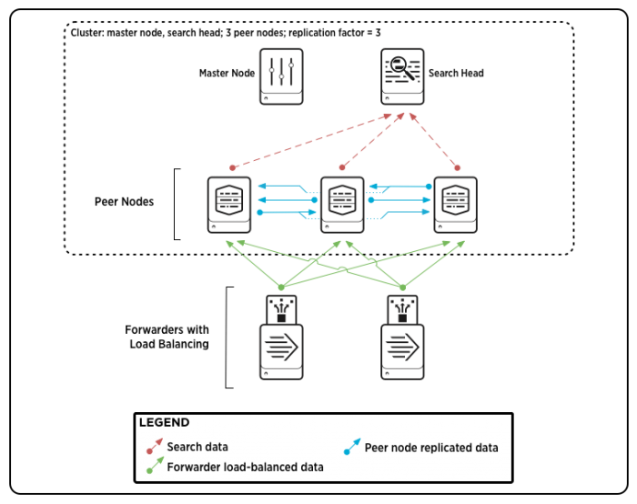
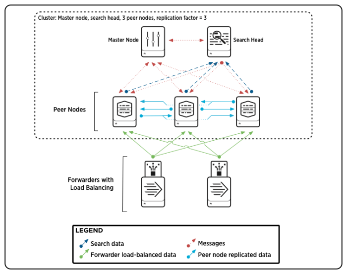
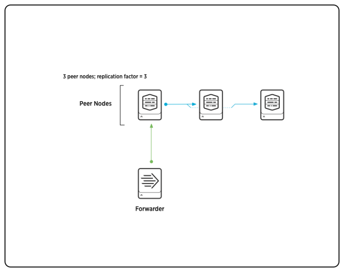
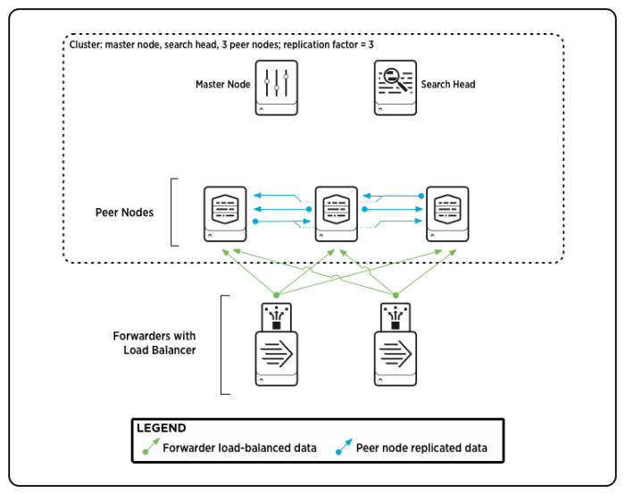

# Managing Indexers and Clusters of Indexers

## About indexer clusters and index replication

Indexer clusters are groups of Splunk Enterprise indexers configured to replicate each others' data, so that the system keeps multiple copies of all data. This process is known as index replication. By maintaining multiple, identical copies of Splunk Enterprise data, clusters prevent data loss while promoting data availability for searching.

Indexer clusters feature automatic failover from one indexer to the next. This means that, if one or more indexers fail, incoming data continues to get indexed and indexed data continues to be searchable.

The key benefits of index replication are:

- Data availability. An indexer is always available to handle incoming data, and the indexed data is available for searching.
- Data fidelity. You never lose any data. You have assurance that the data sent to the cluster is exactly the same data that gets stored in the cluster and that a search can later access.
- Data recovery. Your system can tolerate downed indexers without losing data or losing access to data.
- Disaster recovery. With multisite clustering, your system can tolerate the failure of an entire data center.
- Search affinity. With multisite clustering, search heads can access the entire set of data through their local sites, greatly reducing long-distance network traffic.

The key trade-off in index replication is between the benefits of data availability/recovery and the costs of storage (and, to a minor degree, increased processing load). The degree of data recovery that the cluster possesses is directly proportional to the number of copies of data it maintains. But maintaining more copies of data means higher storage requirements. To manage this trade-off to match the needs of your enterprise, you can configure the number of copies of data that you want the cluster to maintain. This is known as the replication factor. 

You can also use clusters to scale indexing capacity, even in situations where index replication is not a requirement. See "[Use indexer clusters to scale indexing](http://docs.splunk.com/Documentation/Splunk/7.0.3/Indexer/Clustersinscaledoutdeployments)".

Note: Search head clusters provide high availability and scalabilty for groups of search heads. They are a separate feature from indexer clusters, but you can combine them with indexer clusters to build a high availability, scalable solution across your entire Splunk Enterprise deployment. See "[About search head clustering](http://docs.splunk.com/Documentation/Splunk/7.0.3/DistSearch/AboutSHC)" in the Distributed Search manual. 

### Parts of an indexer cluster

An indexer cluster is a group of Splunk Enterprise instances, or nodes, that, working in concert, provide a redundant indexing and searching capability. Each cluster has three types of nodes:

- A single master node to manage the cluster.
- Several to many peer nodes to index and maintain multiple copies of the data and to search the data.
- One or more search heads to coordinate searches across the set of peer nodes.

The master node manages the cluster. It coordinates the replicating activities of the peer nodes and tells the search head where to find data. It also helps manage the configuration of peer nodes and orchestrates remedial activities if a peer goes down.

The peer nodes receive and index incoming data, just like non-clustered, stand-alone indexers. Unlike stand-alone indexers, however, peer nodes also replicate data from other nodes in the cluster. A peer node can index its own incoming data while simultaneously storing copies of data from other nodes. You must have at least as many peer nodes as the replication factor. That is, to support a replication factor of 3, you need a minimum of three peer nodes.

The search head runs searches across the set of peer nodes. You must use a search head to manage searches across indexer clusters. 

For most purposes, it is recommended that you use forwarders to get data into the cluster. 

Here is a diagram of a basic, single-site indexer cluster, containing three peer nodes and supporting a replication factor of 3: 

This diagram shows a simple deployment, similar to a small-scale non-clustered deployment, with some forwarders sending load-balanced data to a group of indexers (peer nodes), and the indexers sending search results to a search head. There are two additions that you don't find in a non-clustered deployment:

- The indexers are streaming copies of their data to other indexers.
- The master node, while it doesn't participate in any data streaming, coordinates a range of activities involving the search peers and the search head.

### Multisite indexer clusters

Multisite indexer clusters allow you to maintain complete copies of your indexed data in multiple locations. This offers the advantages of enhanced disaster recovery and search affinity. You can specify the number of copies of data on each site. Multisite clusters are similar in most respects to basic, single-site clusters, with some differences in configuration and behavior. See "[Multisite indexer clusters](http://docs.splunk.com/Documentation/Splunk/7.0.3/Indexer/Multisiteclusters)".

### How to set up a cluster

Clusters are easy to set up. The process is similar to setting up a group of stand-alone indexers. Basically, you install the indexers and perform a bit of configuration.

The main difference is that you also need to identify and enable the cluster nodes. You designate one Splunk Enterprise instance as the master node and other instances as peer nodes. You need at least as many peer nodes as the size of your replication factor. To increase indexing capacity for horizontal scaling, you just add more peer nodes.

You also need to set up one or more search heads to manage searches across the peers and to consolidate the results for the user.

You enable cluster nodes in the same way that you configure any settings in Splunk Enterprise: through Splunk Web or the CLI, or directly, by editing configuration files.

See the chapter "[Deploy the indexer cluster](http://docs.splunk.com/Documentation/Splunk/7.0.3/Indexer/Clusterdeploymentoverview)". 

### How to search a cluster

You search a cluster the same way you search any non-clustered group of indexers. You submit your searches through a search head.

What happens behind the scenes is a bit different, though. Once you have submitted your search, the search head consults the master node to determine the current set of peer nodes. The search head then distributes the search tasks directly to those peers. The peers do their part and send their results back to the search head, which then consolidates the results and returns them to Splunk Web. From the user's standpoint, it is no different than searching any standalone indexer or non-clustered group of indexers. See "How search works in an indexer cluster." 

With a multisite cluster, you can also implement search affinity. In search affinity, a search head gets search results only from indexers local to its site, when possible. At the same time, the search still has access to the full set of data. See "Implement search affinity in a multisite indexer cluster."

### Before you go any further

Clusters are easy to set up and use, but you need to have a good grounding in the basics of Splunk Enterprise indexing and deployment first. Before you continue, make sure you know this stuff:

- How to configure indexers. See "How the indexer stores indexes", along with the other topics in the current manual that describe managing indexes.
- What a search head does. For an introduction to distributed search and search heads, see "About distributed search" in the Distributed Search manual.
- How to use a forwarder to get data into an indexer. See "Use forwarders" in the Getting Data In manual.

### Migrating from a non-clustered Splunk Enterprise deployment

Clustered indexers have several different requirements from non-clustered indexers. It is important that you be aware of these issues before you migrate your indexers. For details, see "Key differences between clustered and non-clustered Splunk Enterprise deployments of indexers". After you read that material, go to "Migrate non-clustered indexers to a clustered environment" for details on the actual migration process.

## Multisite indexer clusters2

Indexer clusters have built-in site-awareness, meaning that you can explicitly configure a multisite indexer cluster on a site-by-site basis. This simplifies and extends the ability to implement a cluster that spans multiple physical sites, such as data centers.

### Use cases

Multisite clusters offer two key benefits over single-site clusters:

- Improved disaster recovery. By storing copies of your data at multiple locations, you maintain access to the data if a disaster strikes at one location. Multisite clusters provide site failover capability. If a site goes down, indexing and searching can continue on the remaining sites, without interruption or loss of data.
- Search affinity. If you configure each site so that it has both a search head and a full set of searchable data, the search head on each site will limit its searches to local peer nodes. This eliminates any need, under normal conditions, for search heads to access data on other sites, greatly reducing network traffic between sites.

### Multisite configuration

You configure multisite clusters somewhat differently from basic, single-site clusters. These are the key differences for multisite clusters: 

- You assign a site to each node.
- You can specify the replication and search factors on a site-by-site basis. That is, you can specify the number of copies and searchable copies that you want to maintain on each site, along with the number that you want to maintain on the cluster overall.

There are a few other configuration differences as well. See "Multisite deployment overview".

### Multisite architecture

The architecture of single-site and multisite clusters is similar. These are the main differences for multisite clusters:

- Each node belongs to an assigned site.
- Replication of bucket copies occurs in a site-aware manner.
- Search heads distribute their searches across local peers only, whenever possible.

For more information on multisite cluster architecture, read "Multisite indexer cluster architecture".

### For more information

These chapters and topics describe multisite clusters in detail: 

- "[Deploy and configure a multisite indexer cluster](http://docs.splunk.com/Documentation/Splunk/7.0.3/Indexer/Multisitedeploymentoverview)". This chapter contains topics that describe multisite configuration, including search affinity configuration and multisite replication and search factors.
- "[Manage a multisite indexer cluster](http://docs.splunk.com/Documentation/Splunk/7.0.3/Indexer/Moveapeertoanewsite)". This chapter covers issues such as handling master site failure and converting a multisite cluster to single-site.
- "[Migrate an indexer cluster from single-site to multisite](http://docs.splunk.com/Documentation/Splunk/7.0.3/Indexer/Migratetomultisite)". This topic describes how to convert a single-site cluster to multisite.

Other topics in this manual differentiate multisite and single-site clusters as needed. 

## The basics of indexer cluster architecture

This topic introduces indexer cluster architecture. It describes the nodes of a single-site cluster and how they work together. It also covers some essential concepts and describes briefly how clusters handle indexing and searching.

Multisite cluster architecture is similar to single-site cluster architecture. There are, however, a few areas of significant difference. For information on multisite cluster architecture and how it differs from single-site cluster architecture, read the topic "[Multisite indexer cluster architecture](http://docs.splunk.com/Documentation/Splunk/7.0.3/Indexer/Multisitearchitecture)".

For a deeper dive into cluster architecture, read the chapter "[How indexer clusters work](http://docs.splunk.com/Documentation/Splunk/7.0.3/Indexer/Basicconcepts)".

### Cluster nodes

A cluster includes three types of nodes: 

- A single master node to manage the cluster.
- Multiple peer nodes to index and replicate data and to search the data.
- One or more search heads to coordinate searches across all the peer nodes.

In addition, a cluster deployment usually employs forwarders to ingest and forward data to the peers. 

Master nodes, peer nodes, and search heads are all specialized Splunk Enterprise instances. All nodes must reside on separate instances and separate machines. For example, the master node cannot reside on the same instance or machine as a peer node or a search head. 

Here is a diagram of a simple single-site cluster, with a few peers and some forwarders sending data to them: 

Some of what is happening in this diagram might not make sense yet; read on. 

#### Master node

The master node manages the cluster. It coordinates the replicating activities of the peer nodes and tells the search head where to find data. It also helps manage the configuration of peer nodes and orchestrates remedial activities if a peer goes offline. 

Unlike the peer nodes, the master does not index external data. A cluster has exactly one master node. 

#### Peer node

Peer nodes perform the indexing function for the cluster. They receive and index incoming data. They also send replicated data to other peer nodes in the cluster and receive replicated data from other peers. A peer node can index its own external data while simultaneously receiving and sending replicated data. Like all indexers, peers also search across their indexed data in response to search requests from the search head. 

The number of peer nodes you deploy is dependent on two factors: the cluster replication factor and the indexing load. For example, if you have a replication factor of 3 (which means you intend to store three copies of your data), you need at least three peers. If you have more indexing load than three indexers can handle, you can add more peers to increase capacity. 

#### Search head

The search head manages searches across the set of peer nodes. It distributes search queries to the peers and consolidates the results. You initiate all searches from the search head. A cluster must have at least one search head. 

#### Forwarder

Forwarders function the same as in any Splunk Enterprise deployment. They consume data from external sources and then forward that data to indexers, which, in clusters, are the peer nodes. You are not required to use forwarders to get data into a cluster, but, for most purposes, you will want to. This is because only with forwarders can you enable indexer acknowledgment, which ensures that incoming data gets reliably indexed. In addition, to deal with potential peer node failures, it is advisable to use load-balancing forwarders. That way, if one peer goes down, the forwarder can switch its forwarding to other peers in the load-balanced group. For more information on forwarders in a clustered environment, read "[Use forwarders to get data into the indexer cluster](http://docs.splunk.com/Documentation/Splunk/7.0.3/Indexer/useforwarders)" in this manual.

### Important concepts

To understand how a cluster functions, you need to be familiar with a few concepts: 

- Replication factor. This determines the number of copies of data the cluster maintains and therefore, the cluster's fundamental level of failure tolerance.
- Search factor. This determines the number of searchable copies of data the cluster maintains, and therefore how quickly the cluster can recover its searching capability after a peer node goes down.
- Buckets. Buckets are the basic units of index storage. A cluster maintains replication factor number of copies of each bucket. 

This section provides a brief introduction to these concepts.

#### Replication factor

As part of configuring the master, you specify the number of copies of data that you want the cluster to maintain. The number of copies is called the cluster's replication factor. The replication factor is a key concept in index replication, because it determines the cluster's failure tolerance: a cluster can tolerate a failure of (replication factor - 1) peer nodes. For example, if you want to ensure that your system can handle the failure of two peer nodes, you must configure a replication factor of 3, which means that the cluster stores three identical copies of your data on separate nodes. If two peers go down, the data is still available on a third peer. The default value for the replication factor is 3. 

Here is a high-level representation of a cluster with three peers and a replication factor of 3:

In this diagram, one peer is receiving data from a forwarder, which it processes and then streams to two other peers. The cluster will contain three complete copies of the peer's data. This diagram represents a very simplified version of peer replication, where all data is coming into the system through a single peer. In most three-peer clusters, all three peers would be receiving external data from a forwarder, as well as replicated data from other peers.

For a detailed discussion of the replication factor and the trade-offs involved in adjusting its value, see the topic "[Replication factor](http://docs.splunk.com/Documentation/Splunk/7.0.3/Indexer/Thereplicationfactor)". 

Important: Multisite clusters use a significantly different version of the replication factor. See "[Multisite replication and search factors](http://docs.splunk.com/Documentation/Splunk/7.0.3/Indexer/Multisitearchitecture#Multisite_replication_and_search_factors)".

#### Search factor

When you configure the master, you also designate a search factor. The search factor determines the number of immediately searchable copies of data the cluster maintains.

Searchable copies of data require more storage space than non-searchable copies, so it is best to limit the size of your search factor to fit your exact needs. For most purposes, use the default value of 2. This allows the cluster to continue searches with little interruption if a single peer node goes down.

The difference between a searchable and a non-searchable copy of some data is this: The searchable copy contains both the data itself and some extensive index files that the cluster uses to search the data. The non-searchable copy contains just the data. Even the data stored in the non-searchable copy, however, has undergone initial processing and is stored in a form that makes it possible to recreate the index files later, if necessary. 

For a detailed discussion of the search factor and the trade-offs involved in adjusting its value, see the topic "Search factor". 

Important: Multisite clusters use a significantly different version of the search factor. See "Multisite replication and search factors". 

#### Buckets

Splunk Enterprise stores indexed data in buckets, which are directories containing files of data. An index typically consists of many buckets. 

A complete cluster maintains replication factor number of copies of each bucket, with each copy residing on a separate peer node. The bucket copies are either searchable or non-searchable. A complete cluster also has search factor number of searchable copies of each bucket. 

Buckets contain two types of files: a rawdata file, which contains the data along with some metadata, and - for searchable copies of buckets - index files into the data.

The cluster replicates data on a bucket-by-bucket basis. The original bucket and its copies on other peer nodes have identical sets of rawdata. Searchable copies also contain the index files.

Each time a peer creates a new bucket, it communicates with the master to get a list of peers to stream the bucket's data to. If you have a cluster in which the number of peer nodes exceeds the replication factor, a peer might stream data to a different set of peers each time it creates a new bucket. Eventually, the copies of the peer's original buckets are likely to be spread across a large number of peers, even if the replication factor is only 3. 

You need a good grasp of buckets to understand cluster architecture. For an overview of buckets in general, read "[How the indexer stores indexes](http://docs.splunk.com/Documentation/Splunk/7.0.3/Indexer/HowSplunkstoresindexes)". Then read the topic "[Buckets and indexer clusters](http://docs.splunk.com/Documentation/Splunk/7.0.3/Indexer/Bucketsandclusters)". It provides detailed information on bucket concepts of particular importance for a clustered deployment. 

### How indexing works

Clustered indexing functions like non-clustered indexing, except that the cluster stores multiple copies of the data. Each peer node receives, processes, and indexes external data - the same as any non-clustered indexer. The key difference is that the peer node also streams, or "replicates", copies of the processed data to other peers in the cluster, which then store those copies in their own buckets. Some of the peers receiving the processed data might also index it. The replication factor determines the number of peers that receive the copies of data. The search factor determines the number of peers that index the data. 

A peer node can be indexing external data while simultaneously storing, and potentially indexing, copies of replicated data sent to it from other peers. For example, if you have a three-peer cluster configured with a replication factor of 3, each peer can be ingesting and indexing external data while also storing copies of replicated data streamed to it by the other peers. If the cluster's search factor is 2, one of the peers receiving a copy of streamed data will also index it. (In addition, the peer that originally ingests the data always indexes its own copy.) This diagram shows the movement of data into peers, both from forwarders and from other peers: 

You can set up your cluster so that all the peer nodes ingest external data. This is the most common scenario. You do this simply by configuring inputs on each peer node. However, you can also set up the cluster so that only a subset of the peer nodes ingest data. No matter how you disperse your inputs across the cluster, all the peer nodes can, and likely will, also store replicated data. The master determines, on a bucket-by-bucket basis, which peer nodes will get replicated data. You cannot configure this, except in the case of multisite clustering, where you can specify the number of copies of data that each site's set of peers receives. 

In addition to replicating indexes of external data, the peers also replicate their internal indexes, such as _audit, _internal, etc. 

The master manages the peer-to-peer interactions. Most importantly, it tells each peer what peers to stream its data to. Once the master has communicated this, the peers then exchange data with each other, without the master's involvement, unless a peer node goes down. The master also keeps track of which peers have searchable data and ensures that there are always search factor number of copies of searchable data available. When a peer goes down, the master coordinates remedial activities. 

For detailed information, read the topic "[How clustered indexing works](http://docs.splunk.com/Documentation/Splunk/7.0.3/Indexer/Howclusteredindexingworks)". 

For information on how indexing works in a multisite cluster, read "[Multisite indexing](http://docs.splunk.com/Documentation/Splunk/7.0.3/Indexer/Multisitearchitecture#Multisite_indexing)".

### How search works

In an indexer cluster, a search head coordinates all searches. The process is similar to how distributed searches work in a non-clustered environment. The main difference is that the search head relies on the master to tell it who its search peers are. Also, there are various processes in place to ensure that a search occurs over one and only one copy of each bucket. 

To ensure that exactly one copy of each bucket participates in a search, one searchable copy of each bucket in the cluster is designated as primary. Searches occur only across the set of primary copies. 

The set of primary copies can change over time, for example, in response to a peer node going down. If some of the bucket copies on the downed node were primary, other searchable copies of those buckets will be made primary to replace them. If there are no other searchable copies (because the cluster has a search factor of 1), non-searchable copies will first have to be made searchable before they can be designated as primary. 

The master rebalances primaries across the set of peers whenever a peer joins or rejoins the cluster, in an attempt to improve distribution of the search load. See "[Rebalance the indexer cluster primary buckets](http://docs.splunk.com/Documentation/Splunk/7.0.3/Indexer/Rebalancethecluster)".

The master keeps track of all bucket copies on all peer nodes, and the peer nodes themselves know the status of their bucket copies. That way, in response to a search request, a peer knows which of its bucket copies to search. 

Periodically, the search head gets a list of active search peers from the master. To handle searches, it then communicates directly with those peers, as it would for any distributed search, sending search requests and knowledge bundles to the peers and consolidating search results returned from the peers. 

For example, assume a cluster of three peers is maintaining 20 buckets that need to be searched to fulfill a particular search request coming from the search head. Primary copies of those 20 buckets could be spread across all three peers, with 10 primaries on the first peer, six on the second, and four on the third. Each peer gets the search request and then determines for itself whether its particular copy of a bucket is primary and therefore needs to participate in the search. 

For detailed information, read the topic "[How search works in an indexer cluster](http://docs.splunk.com/Documentation/Splunk/7.0.3/Indexer/Howclusteredsearchworks)".

Important: There are key differences in how searching works in a multisite cluster. For example, each site in the cluster typically has a complete set of primary buckets, so that a search head can perform its searches entirely on data local to its site. For more information, read "Multisite searching". 

### How clusters deal with peer node failure

If a peer node goes down, the master coordinates attempts to reproduce the peer's buckets on other peers. For example, if a downed node was storing 20 copies of buckets, of which 10 were searchable (including three primary bucket copies), the master will direct efforts to create copies of those 20 buckets on other nodes. It will likewise attempt to replace the 10 searchable copies with searchable copies of the same buckets on other nodes. And it will replace the primary copies by changing the status of corresponding searchable copies on other peers from non-primary to primary. 

#### Replication factor and node failure

If there are less peer nodes remaining than the number specified by the replication factor, the cluster will not be able to replace the 20 missing copies. For example, if you have a three-node cluster with a replication factor of 3, the cluster cannot replace the missing copies when a node goes down, because there is no other node where replacement copies can go. 

Except in extreme cases, however, the cluster should be able to replace the missing primary bucket copies by designating searchable copies of those buckets on other peers as primary, so that all the data continues to be accessible to the search head. 

The only case in which the cluster cannot maintain a full set of primary copies is if a replication factor number of nodes goes down. For example, if you have a cluster of five peer nodes, with a replication factor of 3, the cluster will still be able to maintain a full set of primary copies if one or two peers go down but not if a third peer goes down. 

#### Search factor and node failure

The search factor determines whether full search capability can quickly resume after a node goes down. To ensure rapid recovery from one downed node, the search factor must be set to at least 2. That allows the master to immediately replace primaries on the downed node with existing searchable copies on other nodes. 

If instead the search factor is set to 1, that means the cluster is maintaining just a single set of searchable bucket copies. If a peer with some primary copies goes down, the cluster must first convert a corresponding set of non-searchable copies on the remaining peers to searchable before it can designate them as primary to replace the missing primaries. While this time-intensive process is occurring, the cluster has an incomplete set of primary buckets. Searches can continue, but only across the available primary buckets. Eventually, the cluster will replace all the missing primary copies. Searches can then occur across the full set of data. 

If, on the other hand, the search factor is at least 2, the cluster can immediately assign primary status to searchable copies on the remaining nodes. The activity to replace the searchable copies from the downed node will still occur, but in the meantime searches can continue uninterrupted across all the cluster's data. 

For detailed information on peer failure, read the topic "[What happens when a peer node goes down](http://docs.splunk.com/Documentation/Splunk/7.0.3/Indexer/Whathappenswhenaslavenodegoesdown)".

For information on how a multisite cluster handles peer node failure, read "[How multisite indexer clusters deal with peer node failure](http://docs.splunk.com/Documentation/Splunk/7.0.3/Indexer/Multisitearchitecture#How_multisite_clusters_deal_with_peer_node_failure)".

### How clusters deal with master node failure

If a master node goes down, peer nodes can continue to index and replicate data, and the search head can continue to search across the data, for some period of time. Problems eventually will arise, however, particularly if one of the peers goes down. There is no way to recover from peer loss without the master, and the search head will then be searching across an incomplete set of data. Generally speaking, the cluster continues as best it can without the master, but the system is in an inconsistent state and results cannot be guaranteed. 

For detailed information on master failure, read the topic "[What happens when a master node goes down](http://docs.splunk.com/Documentation/Splunk/7.0.3/Indexer/Whathappenswhenamasternodegoesdown)".

## Multisite indexer cluster architecture

This topic describes the architecture of multisite indexer clusters. It focuses primarily on how multisite clusters differ from single-site clusters. For an overview of cluster architecture, focusing on single-site clusters, read The basics of indexer cluster architecture. 

How multisite and single-site architecture differ

Multisite clusters differ from single-site clusters in these key respects:

• Each node (master/peer/search head) has an assigned site.

• Replication of bucket copies occurs with site-awareness.

• Search heads distribute their searches across local peers only, when possible. 

• Bucket-fixing activities respect site boundaries when applicable.

Multisite cluster nodes

Multisite and single-site nodes share these characteristics: 

• Clusters have three types of nodes: master, peers, and search heads.

• Each cluster has exactly one master node. 

• The cluster can have any number of peer nodes and search heads. 

Multisite nodes differ in these ways: 

• Every node belongs to a specific site. Physical location typically determines a site. That is, if you want your cluster to span servers in Boston and Philadelphia, you assign all nodes in Boston to site1 and all nodes in Philadelphia to site2. 

• A typical multisite cluster has search heads on each site. This is necessary for search affinity, which increases search efficiency by allowing a search head to access all data locally.

Here is an example of a two-site cluster. 

Basic multisite cluster.png 

Note the following: 

• The master node controls the entire cluster. Although the master resides physically on a site, the master is not actually a member of any site. However, each master has a built-in search head, and that search head requires that you specify a site for the master as a whole. Note that the master's search head is for testing purposes only. Do not use it in a production environment.

• This is an example of a cluster that has been configured for search affinity. Each site has its own search head, which searches the set of peer nodes on its site. Depending on circumstances, however, a search head might also search peers outside its own site. See Multisite searching and search affinity.

• The peers replicate data across site boundaries. This behavior is fundamental for both disaster recovery and search affinity.

Multisite replication and search factors

As with their single-site counterparts, multisite replication and search factors determine the number of bucket copies and searchable bucket copies, respectively, in the cluster. The difference is that the multisite replication and search factors also determine the number of copies on each site. A multisite replication factor for a three-site cluster might look like this: 

site_replication_factor = origin:2, site1:1, site2:1, site3:1, total:4

This replication factor specifies that each site will get one copy of each bucket, except when the site is the originating site for the data, in which case it will get two copies. It also specifies that the total number of copies across the cluster is four. 

In this particular example, the replication factor explicitly specifies all sites, but that is not a requirement. An explicit site is a site that the replication factor explicitly specifies. A non-explicit site is a site that the replication factor does not explicitly specify. 

Here is another example of a multisite replication factor for a three-site cluster. This replication factor specifies only two of the sites explicitly: 

site_replication_factor = origin:2, site1:1, site2:2, total:5

In this example, the number of copies that the non-explicit site3 gets varies. If site1 is the origin, site1 gets two copies, site2 gets two copies, and site3 gets the remainder of one copy. If site2 is the origin, site1 gets one copy, site2 gets two copies, and site3 gets two copies. If site3 is the origin, site1 gets one copy, site2 gets two copies, and site3 gets two copies. 

Note: In this example, the total value cannot be 4. It must be at least 5. This is because, when the replication factor has non-explicit sites, the total must be at least the sum of all explicit site and origin values. 

For details on replication factor syntax and behavior, read "Configure the site replication factor". 

The site search factor works the same way. For details, read "Configure the site search factor". 

Multisite indexing

Multisite indexing is similar to single-site indexing, described in "The basics of indexer cluster architecture". A single master coordinates replication across all the peers on all the sites. 

This section briefly describes the main multisite differences, using the example of a three-site cluster with this replication factor: 

site_replication_factor = origin:2, site1:1, site2:1, site3:1, total:4

These are the main multisite issues to be aware of: 

• Data replication occurs across site boundaries, based on the replication factor. If, in the example, a peer in site1 ingests the data, it will stream one copy of the data to another peer in site1 (to fulfill the origin setting of 2), one copy to a peer in site2, and one copy to a peer in site3.

• Multisite replication has the concept of the origin site, which allows the cluster to handle data differently for the site that it originates on. The example illustrates this. If site1 originates the data, it gets two copies. If another site originates the data, site1 gets only one copy.

• As with single-site replication, you cannot specify the exact peers that will receive the replicated data. However, you can specify the sites whose peers will receive the data.

For information on how the cluster handles migrated single-site buckets, see "Migrate an indexer cluster from single-site to multisite". 

Multisite searching and search affinity

Multisite searching is similar in most ways to single-site searching, described in "The basics of indexer cluster architecture". Each search occurs across a set of primary bucket copies. There is one key difference, however. 

Multisite clusters provide search affinity, which allows searches to occur on site-local data. You must configure the cluster to take advantage of search affinity. Specifically, you must ensure that both the searchable data and the search heads are available locally. 

To accomplish this, you configure the search factor so that each site has at least one full set of searchable data. The master then ensures that each site has a complete set of primary bucket copies, as long as the sites are functioning properly. This is known as the valid state. 

With search affinity, the search heads still distribute their search requests to all peers in the cluster, but only the peers on the same site as the search head respond to the request by searching their primary bucket copies and returning results to the search head. 

If the loss of some of a site's peers means that it no longer has a full set of primaries (and thus is no longer in the valid state), bucket fix-up activities will attempt to return the site to the valid state. During the fix-up period, peers on remote sites will participate in searches, as necessary, to ensure that the search head still gets a full set of results. After the site regains its valid state, the search head once again uses only local peers to fulfill its searches. 

Note: You can disable search affinity if desired. When disabled for a particular search head, that search head can get its data from peers on any sites. 

For more information on search affinity and how to configure the search factor to support it, see "Implement search affinity in a multisite indexer cluster". For more information on the internals of search processing, including search affinity, see "How search works in an indexer cluster". 

Multisite clusters and node failure

The way that multisite clusters deal with node failure has some significant differences from single-site clusters. 

Important: Before reading this section, you must understand the concept of a "reserve" bucket copy. A reserve copy is a copy awaiting assignment to a peer. As a consequence of multisite peer node failure, some bucket copies might not be immediately assigned to a peer. For example, in a cluster with a total replication factor of 5, the master might tell the originating peer to stream buckets to just three other peers. This results in four copies (the original plus the three streamed copies), with the fifth copy awaiting assignment to a peer once certain conditions are met. The fifth, unassigned copy is known as a reserve copy. This section describes how the cluster must sometimes reserve copies when peer nodes fail. 

How multisite clusters deal with peer node failure

When a peer goes down, bucket fix-up happens within the same site, if possible. The cluster tries to replace any missing bucket copies by adding copies to peers remaining on that site. (In all cases, each peer can have at most one copy of any particular bucket.) If it is not possible to fix up all buckets by adding copies to peers within the site, then, depending on the replication and search factors, the cluster might make copies on peers on other sites. 

The fix-up behavior under these circumstances depends partially on whether the failed peer was on an explicit or non-explicit site. 

If enough peers go down on an explicit site such that the site can no longer meet its site-specific replication factor, the cluster does not attempt to compensate by making copies on peers on other sites. Rather, it assumes that the requisite number of peers will eventually return to the site. For new buckets also, it holds copies in reserve for the return of peers to the site. In other words, it does not assign those copies to peers on a different site, but instead waits until the first site has peers available and then assigns the copies to those peers. 

For example, given a three-site cluster (site1, site2, site3) with this replication factor: 

site_replication_factor = origin:2, site1:1, site2:2, total:5

the cluster ordinarily maintains two copies on site2. But if enough peers go down on site2, so that only one remains and the site can no longer meet its replication factor of 2, that remaining peer gets one copy of all buckets in the cluster, and the cluster reserves another set of copies for the site. When a second peer rejoins site2, the cluster streams the reserved copies to that peer. 

When a non-explicit site loses enough peers such that it can no longer maintain the number of bucket copies that it already has, the cluster compensates by adding copies to other sites to make up the difference. For example, assume that the non-explicit site3 in the example above has two copies of some bucket, and that it then loses all but one of its peers, so that it can only hold one copy of each bucket. The cluster compensates by streaming a copy of that bucket to a peer on one of the other sites, assuming there is at least one peer that does not yet have a copy of that bucket. 

For information on how a cluster handles the case where all the peer nodes on a site fail, see See "How the cluster handles site failure". 

How the cluster handles site failure

Site failure is just a special case of peer node failure. Cluster fix-up occurs following the rules described earlier for peer node failure. Of particular note, the cluster might hold copies in reserve against the eventual return of the site. 

For any copies of existing buckets that are held in reserve, the cluster does not add copies to other sites during its fix-up activities. Similarly, for any new buckets added after the site goes down, the cluster reserves some number of copies until the site returns to the cluster. 

Here is how the cluster determines the number of copies to reserve: 

• For explicit sites, the cluster reserves the number of copies and searchable copies specified in the site's search and replication factors. 

• For non-explicit sites, the cluster reserves one searchable copy if the total components of the site's search and replication factors are sufficiently large, after handling any explicit sites, to accommodate the copy. (If the search factor isn't sufficiently large but the replication factor is, the cluster reserves one non-searchable copy.)

For example, say you have a three-site cluster with two explicit sites (site1 and site2) and one non-explicit site (site3), with this configuration: 

site_replication_factor = origin:2, site1:1, site2:2, total:5
site_search_factor = origin:1, site1:1, site2:1, total:2

In the case of a site going down, the cluster reserves bucket copies like this: 

• If site1 goes down, the cluster reserves one searchable copy. 

• If site2 goes down, the cluster reserves two copies, including one that is searchable.

• If site3 goes down, the cluster reserves one non-searchable copy.

Once the reserved copies are accounted for, the cluster replicates any remaining copies to other available sites, both during fix-up of existing buckets and when adding new buckets. 

When the site returns to the cluster, bucket fix-up occurs for that site to the degree necessary to ensure that the site has, at a minimum, its allocation of reserved bucket copies, both for new buckets and for buckets that were on the site when it went down. 

If the site that fails is the site on which the master resides, you can bring up a stand-by master on one of the remaining sites. See "Handle indexer cluster master site failure". 

How multisite clusters deal with master node failure

A multisite cluster handles master node failure the same as a single-site cluster. The cluster continues to function as best it can under the circumstances. See "What happens when a master node goes down". 
