# 순서도(Flowchart) 작성법

## (1) 순서도

- 프로그래밍을 하기 전에 그 프로그램의 흐름을 기호화한 것

1) 순서도의 장점

    - 프로그램의 흐름을 단순화하여 분석이 명료해짐
    - 논리적인 오류를 쉽게 파악할 수 있음
    - 도식화된 기호를 이용하므로 다른 사람이 쉽게 이해할 수 있음
    - 원시 프로그램의 작성을 용이하게 하여 코딩 작업이 간단해짐

2) 순서도의 종류

<table>
<tr>
<td>시스템 순서도 (System Flowchart)</td>
<td>① 자료의 입출력과 흐름에 중점을 두어 작성 
② 시스템 전반에 걸친 내용을 나타낸 것 
③ 처리 순서도(Process Flow Chart)라고도 함</td>
</tr>
<tr>
<td>프로그램 순서도 (Program Flowchart)</td>
<td>① 컴퓨터로 처리되는 부분에 중점을 두어 작성 
② 프로그래밍하기 전에 작성하는 순서도</td>
</tr>
<tr>
<td>일반 순서도 (General Flowchart)</td>
<td>프로그램의 대략적인 흐름을 한눈에 파악할 수 있도록 작성된 순서도</td>
</tr>
<tr>
<td>상세 순서도 (Detail Flowchart)</td>
<td>일반 순서도를 세분화하여 자세히 풀어 놓은 것으로 코딩의 기본적인 자료가 됨</td>
</tr>
</table>

## (2) 순서도의 기호

|이름|기호|의미|
|:--:|:--:|:--|
|터미널|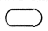|순서도의 시작과 끝|
|입출력|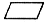|일반적으로 터미널에 의한 입출력을 표현|
|준비|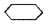|변수의 초기화 및 준비사항 기입|
|판단|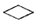|조건 비교, 판단, 분기 등 결정|
|수작업 입력|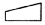|키나 스위치 또는 콘솔에 의한 입력|
|카드 입출력|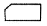|천공 카드를 매체로 하는 입출력|
|종이 테이프|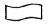|종이 테이프를 매체로 하는 입출력|
|서브루틴|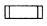|이미 정의된 순서나 부프로그램을 호출|
|반복 명령|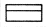|반복 수행|
|자기 테이프|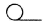|자기 테이프를 매체로 하는 입출력|
|표시|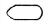|화면 출력|
|자기 디스크||자기 디스크를 매체로 하는 입출력|
|결합|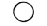|같은 페이지에서 순서도의 흐름을 제어|
|페이지 결합||순서도의 흐름을 다른 페이지의 순서도로 연결|
|온라인 기억||On-Line된 보조기억장치|
|오프라인 기억|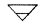|Off-Line된 기억장치|
|화살표|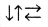|순서 기호 사이를 연결하여, 순서도의 흐름을 표현|
|주석|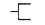|순서도의 이해를 돕기 위한 설명|
