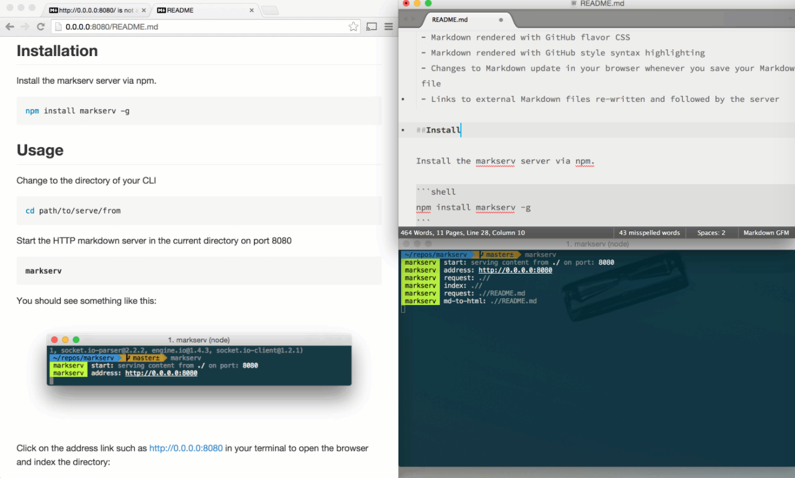
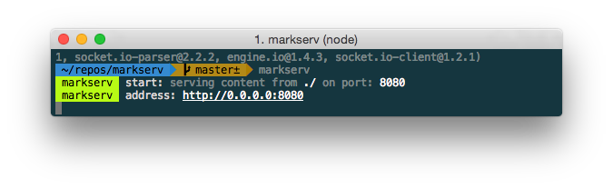
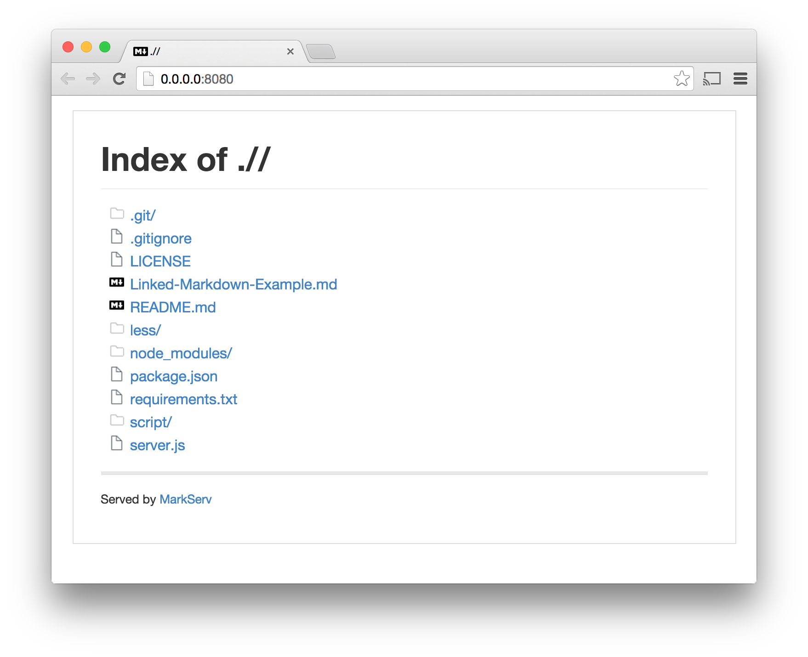
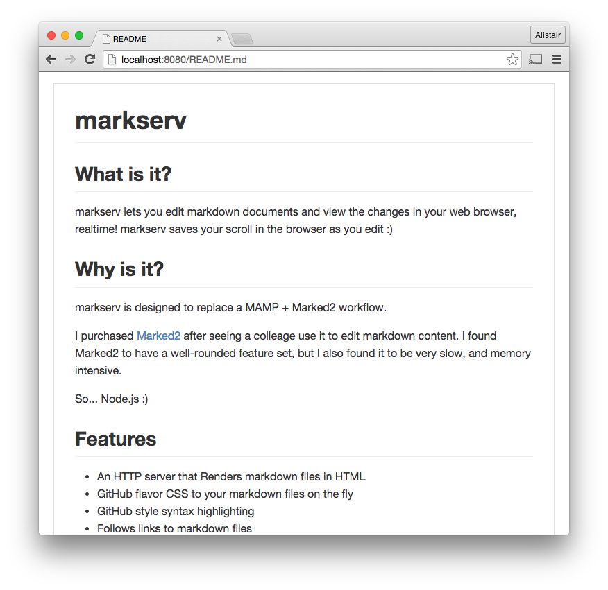
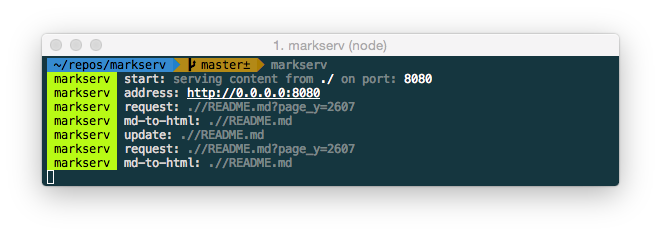

markserv 
========

markserv serves Markdown files as GitHub style HTML and LiveReloads your changes in the browser as you edit.
-------------------------------------------------------------------------------------------------------------



Why Does It Exist?
========
markserv is designed to replace a Apache + Marked2 workflow.

I purchased Marked2 after seeing a colleage use it to edit markdown content. It looked awesome, but it felt clunky. And it didn't integrate with my almost constant CLI usage. While I found Marked2 to have a very well-rounded feature set, it was simply too slow, and too memory intensive.

Features
========

Basic HTTP server that indexes directories
HTTP server renders Markdown files as HTML
Markdown rendered with GitHub flavor CSS
Markdown rendered with GitHub style syntax highlighting
LiveReload updates the view when your files change
Links to external Markdown files are re-written and followed by the server
MathJax equations (example)

Installing
========

Install the markserv server via npm.

```html    
npm install markserv -g
```

Usage
Change to the directory of your CLI

```
cd path/to/serve/from
```

Start the HTTP markdown server in the current directory on port 8080

```
markserv
```

You should see something like this:



Click on the address link such as http://0.0.0.0:8080 in your terminal to open the browser and index the directory:

Showing Indexes in markserv


In the browser, click on a Markdown file, like "README.md", and markserv should render the Markdown file as HTML in your browser.

Expected output


Watch your CLI for server hints:

- Diretory Indexes
- Files Served
- Markdown file updates
- Errors

markserv CLI being chatty


Realtime/Live editing
---------------

Edit your markdown file, and you should now see the page reloading as you save your Markdown file. It should save your scroll position, which helps when editing extemely large documents.




http://imgur.com/a/b8Cje

Linking to an external Markdown file
-----------------------------------

You can link to an external Markdown file in the same way that you use GitHub Wiki links. You can use the example code here to see how external links work.

Example code:
````
[Skateboarding Dog!](Linked-Markdown-Example.md)
````

Example link:
Skateboarding Dog!

Using With Auto-Save for SublimeText
----------------------------------
Coming soon...

https://packagecontrol.io/packages/auto-save


Options/Flags
=============

To list the options/flags for the markserv CLI tool:
```
markserv --help
```

Changing the HTTP Directory
-----

You can serve content from a different path using the following command:
```
markserv -h /path/to/dir
```

Changing the HTTP Port
-----------------
You can change the HTTP Port like this:
```
markserv -p 80
```

Making it available to external networks
-------------

In some cases localhost might be the address on which the server is listening, in which case it is hard to make the site available to external networks even with the right IP. Use the following as an example to make sure the server is accessible from external networks:
```
markserv -p 8642 -a 0.0.0.0
```

Above example runs the server on port 8642 and it can be accessed from external networks using public IP of the machine on which the server is running. If you want the server to keep running in a seperate thread even when you log out, use this:
```
nohup markserv -p 8642 -a 0.0.0.0 &
```

This will make the server instance persistent and will be available to access even when you log out or even when your ssh session closes (in case you are accessing a remote machine through ssh to set up <code>markserv</code> server)

Pre-Requisites
==========

- Node.js & NPM
- Web Browser
- Text Editor

How does it work?
-------------

markserv watches for file updates to the markdown file, and to the CSS directory, and automatically reloads the Markdown page via LiveReload. markserv remembers the scroll position you were at in the web browser, and reloads the page with the same scroll position when you make changes.

markserv was built for working on projects that contain a combination of web content and Markdown, where the markdown gets reloaded on the fly as the file is saved in your text editor. But it also serves regular HTTP content, replacing the need for a more bulky web server setup using MAMP, etc.